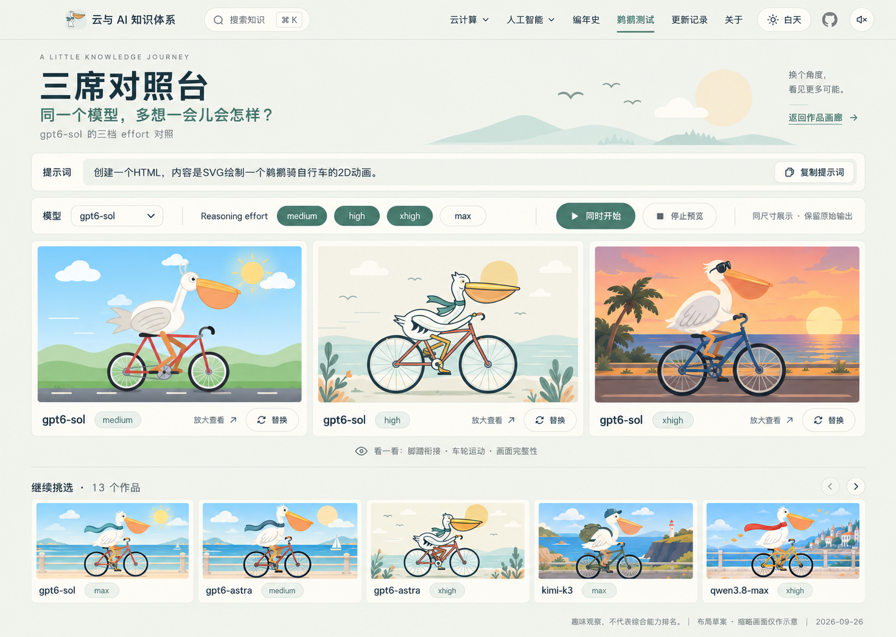

# 鹈鹕测试展区：评估与设计

设计日期：2026-09-26。实施状态：已按方案一完成开发和构建验收，发布入口为 `/playground/pelican/`。本文保留最初的设计依据；最终验证记录见仓库根目录 `design-qa.md`，后续收录流程见 `scripts/PELICAN-COLLECTION.md`。

## 建议

新增顶层导航「鹈鹕测试」，放在「编年史」之后，进入独立的宽版三列画廊；在首页现有鹈鹕动画下方补一个「同一道题，看看其他模型怎么画 →」链接。

初版主打逛作品、筛选、播放、放大。采用当前站点的暖纸色与海盐绿，不另起一套风格。每个作品占据相同大小的展示窗口，不以画面好看与否生成模型排行榜。

这道题适合观察 SVG 绘图、动画编程、视觉构图和对提示词的理解。单次输出不能代表模型综合能力；页面可使用轻量说明「趣味观察，不代表综合能力排名」。

## 首批文件核对

共 13 个独立 HTML，9 个模型名称，4 档 reasoning effort，总大小 204,546 字节，约 200 KiB。数量与名称来自本地文件，不代表对模型身份或参数生效情况的外部核验。

| 文件中的模型名 | 已有 effort | 作品数 |
| --- | --- | ---: |
| gpt6-astra | medium、xhigh | 2 |
| gpt6-sol | medium、high、xhigh、max | 4 |
| gpt6-luna | max | 1 |
| deepseek-v4.1-flash | max | 1 |
| glm-5.3 | max | 1 |
| glm-5.3-flash | max | 1 |
| kimi-k3 | max | 1 |
| qwen3.8-flash | xhigh | 1 |
| qwen3.8-max | xhigh | 1 |

effort 数量为 medium 2、high 1、xhigh 4、max 6。保留这些原始标签，不把不同模型的同名档位解释成相同计算预算。

所有文件都包含 SVG；10 个文件包含脚本，另有仅使用 CSS 或 SVG SMIL 的结果。源码扫描未发现外部 HTTP(S) 的 src/href 依赖。实施时已逐个检查 13 个原始页面与隔离预览，全部成功渲染 SVG；当前验证浏览器为 Chromium，未进行跨浏览器认证。

源文件的修改日期不能充当生成日期。模型快照、调用平台、实际请求参数、测试时间、耗时、token 和成本尚无可靠记录，先留空，不推算或补写。

## 页面入口与信息结构

导航顺序：云计算 / 人工智能 / 编年史 / **鹈鹕测试** / 更新记录 / 关于。

建议路径 `/playground/pelican/`。当前先保持「鹈鹕测试」这个直观名称；将来出现其他趣味题，再把入口升级为「模型游乐场」，现有链接继续有效。

首页第二入口紧贴已有鹈鹕插画的底部，不占用知识地图的三张领域卡片。中等屏宽下若顶部导航拥挤，提前切换现有移动导航，所有入口在菜单里保留。

独立展区保留全站导航、主题切换与页脚，桌面内容最大约 1336 px 宽。采用自定义宽版页面，不放文章侧栏、阅读进度、导读或右侧目录。

从上到下为：

1. 小标题「鹈鹕测试」与主标题「同一道题，骑出不同的风景。」；小字显示 13 个作品、9 个模型、4 档 effort。
2. 提示词原文与复制按钮。
3. 模型筛选、effort 筛选、排序、结果数、清空筛选。
4. 三列作品网格。
5. 简短收录说明和更新信息。

不放大幅重复主视觉，让作品尽早出现在第一屏。

## 提示词

以独立常驻区域逐字保存：

> 创建一个HTML，内容是SVG绘制一个鹈鹕骑自行车的2D动画。

复制按钮复制以上完整原文，成功后短暂显示「已复制」。手机端允许自然换行；不省略、不改写，不给 prompt 擅自加约束。

提示词以题目级对象保存，初版 `promptVersion: v1`。后续改提示词必须生成新版本，作品关联自己实际使用的版本。不同版本不默认为同一测试条件。

## 卡片与浏览

桌面 ≥ 1100 px 三列，平板 700–1099 px 两列，手机 < 700 px 一列；间距 20–24 px。网格不限九个作品，首批直接显示全部 13 个，最后一行不足三张时自然左对齐。后续超过 30 个时可引入每次 12 个的「加载更多」，数字来自数据。

卡片由 16:10 预览区、模型全名、effort 标签及「放大查看」组成。日期和批次可以在详情显示，数据存在时才呈现。模型名最多两行，不让关键后缀消失。

封面必须从真实 HTML 渲染截图生成，不能用设计图里的插画替代，也不修改输出让它看起来更好。为各作品使用一致的参考视口和截取时机，并记录封面参数。原作品自己的标题、控件、留白都是输出的一部分。

建议先尝试 1280 × 800 参考视口，缩放整个 iframe 页面到卡片内；卡片外框统一，内部保持比例。放大层允许「统一视口」与「适应窗口」查看。原输出若自身裁切或有滚动条，应忠实展示并允许看完整页面；不能通过裁剪车轮、鸟嘴来填满卡片。`qwen3.8-max` 使用 SVG `slice`，更应避免额外改变视口比例。

总览中进入视口的作品默认自动播放，可同时浏览多张动画；离屏时释放 iframe，滚回后自动恢复。点击动画或「放大查看」进入详情，详情默认使用「适应窗口」。

展区不提供「停止预览 / 重新播放」控件。切到后台、打开详情时释放总览 iframe；回到前台、关闭详情时自动恢复可见作品。原始页面自带的暂停、速度和车铃等控件仍保留在详情中，不修改模型输出。

加载状态要有文字；失败则显示「预览未能加载」和重试，保留模型信息，不显示虚构封面。可用键盘进入作品详情；待播放的封面提供模型与 effort 的替代说明。按用户要求，作品进入视口后自动播放。

## 筛选规则

| 控件 | 初版交互 |
| --- | --- |
| 模型 | 可搜索的多选下拉，显示现有模型名及结果数量 |
| Reasoning effort | 全部、medium、high、xhigh、max，可多选 |
| 排序 | 默认按模型名称分组相邻、组内按 effort 顺序；可切换最近收录 |
| 结果数 | 明确显示「显示 4 / 13 个作品」，筛选立即更新 |
| 清空 | 恢复全部模型、全部 effort |
| 同模型入口 | 从卡片或详情一键只看该模型的其他结果 |

同一个筛选维度内为 OR，模型与 effort 两个维度之间为 AND。未选择表示不限制；「全部」和具体 effort 不并存为含糊的选择状态。枚举顺序采用 medium → high → xhigh → max，不使用字母序。

先按当前另一维度计算可用数量；无结果项显示 0，并保持已选项可撤销。筛选为空时显示「没有符合条件的作品」，同时提供清空入口。不要显示伪造的空白作品卡片。

筛选和排序写入 URL query，例如 `?model=gpt6-sol&effort=medium,xhigh`；允许分享、刷新保留和浏览器返回恢复。分享链接保留 GitHub Pages 的部署前缀。

初版不加厂商筛选、打分和投票。批次筛选在第二批加入后再显示，避免只有一个选项还占空间。

## 放大层

主体是完整作品，标题显示模型 + effort。次级信息包括原始提示词、批次、记录编号、可用的测试时间和运行配置。复制提示词、下载 HTML、查看同模型是次级动作。

支持关闭按钮、Escape、焦点约束和关闭后回到原卡片；前后切换遵循当前筛选结果顺序。手机端使用全屏查看，保留明显的关闭入口。

「新窗口查看」如要加入，应打开仍带沙箱的站内查看器。原始 HTML 作为下载文件保留，不直接把未隔离的结果作为站点同源页面运行。

## 后续对照视图

第二阶段允许勾选 2–3 个作品进入并排对照，继续用相同显示尺寸。支持跨模型或同模型不同 effort。「同时开始」表示同时发起加载/重播，不宣称不同实现的动画已经逐帧同步。

三个观察提示就足够：脚蹬是否衔接、车轮是否协调、画面是否完整。初版不写数值评分，不将文件大小等同于质量。若以后做正式测评，应单独定义重复采样、评价规则和测试环境。

## 数据与持续收录

首批按文件名自动解析：去掉 `pelican-bicycle-` 前缀与 `.html` 后缀，然后**仅从最后一个 `-` 分割**模型与 effort。

- `pelican-bicycle-qwen3.8-max-xhigh.html` → model `qwen3.8-max`，effort `xhigh`。
- `pelican-bicycle-deepseek-v4.1-flash-max.html` → model `deepseek-v4.1-flash`，effort `max`。
- 未识别的 effort、缺失模型名、重复 ID 应在导入报告中标明，不能悄悄猜测。

文件名只用于首次生成元数据，网页从清单读取；后续可以修订显示名而不改原始文件。

| 字段 | 作用 |
| --- | --- |
| id | 永久记录 ID，不能只由模型 + effort 组成 |
| challengeId / promptVersion | 题目及提示词版本 |
| modelId / modelLabel | 原始模型标识与展示名称 |
| reasoningEffort / effortSource | 原始 effort 和来源，本批为 filename |
| batchId / runId | 批次和单次运行，支持重复测同一组合 |
| sourceFilename / artifactPath / sha256 | 原文件、展示资源及完整性校验 |
| thumbnailPath / captureViewport / captureDelayMs | 真实封面及其截图配置 |
| importedAt / testedAt | 收录时间与真实测试时间，后者未知则 null |
| runtime / generationConfig / notes | 调用环境、参数及备注；缺失不填猜测值 |

追加流程：放入新批次目录 → 生成待审元数据 → 校验命名和文件完整性 → 浏览器生成真实封面并检查加载 → 更新清单与收录记录 → 构建验证。网页自动形成模型选项、数量和网格，不手写追加卡片。

同一个模型同一个 effort 的新结果使用新 runId，保留旧结果，不覆盖。相同文件哈希提示重复，由收录者决定是否是重复导入。第一批暂命名「首批」，不把文件 mtime 直接命名为测试日期。

## 与当前工程的衔接

当前工程是 VitePress + Vue，适合直接增加一个自定义页面及数据清单，不需要数据库和新后端。

建议将站点代码改动集中于：

- `docs/.vitepress/config.mts`：导航注册。
- `docs/.vitepress/theme/components/CoastalHome.vue`：插画附近的辅助入口。
- 新 `docs/playground/pelican/index.md` 与 `PelicanGallery.vue`：宽版布局、筛选和查看器。
- 独立清单及 `docs/public/playground/pelican/`：真实 HTML 和封面资源。
- 主题注册或页面局部引用、必要的页面专用样式；复用 `--coast-*` 色彩变量。

全站日夜主题只改变展区外框与文字，不替原始作品强制改色。原页面有自己的主题切换时，在放大层保留。

预览使用 `iframe sandbox="allow-scripts"`，不加 `allow-same-origin`、弹窗、顶层导航等非必要权限；不把 HTML 直接注入 Vue DOM。若通过 `srcdoc` 加入禁用外部请求的 CSP，生成独立预览包装，原始文件和下载内容保持原样，且逐个验证没有改变运行结果。沙箱本身不等于网络隔离。这些约束来自独立文档运行方式，用户界面不需要展示实现术语。[MDN iframe 文档](https://developer.mozilla.org/en-US/docs/Web/HTML/Reference/Elements/iframe)

SVG 的 `slice` 会按覆盖视口方式缩放，可能超出可见范围；`meet` 保留完整 viewBox。因此展示层应尽量保持原始页面比例，不直接覆写作品中的 SVG 属性。[MDN preserveAspectRatio](https://developer.mozilla.org/en-US/docs/Web/SVG/Reference/Attribute/preserveAspectRatio)

## 交付范围

第一阶段：导航与首页入口、提示词复制、13 个原始作品及真实封面、三列响应式画廊、模型/effort 筛选、URL 状态、受控播放、放大层、静态数据导入规则。

第二阶段：2–3 个作品对照、同一组合多次运行、批次筛选、更多趣味测试题、可选观察备注。达到相应数据规模再增加，不在首版预留大量空控件。

进入实现后验证：13 个结果全部可加载且与单独打开一致；`qwen3.8-max` 解析正确；模型和 effort 的 AND/OR 逻辑正确；提示词复制逐字一致；桌面三列、平板两列、手机一列；长模型名、空结果、键盘关闭、减少动画偏好；页面外或离屏无持续预览；含 GitHub Pages base 的资源、刷新及分享链接可用；运行现有测试和 VitePress 构建。

## 视觉草案

下方为 ImageGen 内置工具生成的三个独立布局草案，编号按本轮对话中图片的展示顺序。它们用于讨论布局，并非可运行页面或真实测试截图。

**所有草案中的作品缩略图、按钮状态和部分装饰均为示意，不能据此判断任何模型表现。最终实现使用原始 HTML 和实拍封面；筛选行为、文字和数据以本文规则为准。** 尤其草案 2 的勾选模型与下方可见结果不完全一致，实现时必须保持筛选结果严格一致。

| 草案 | 重点 | 取舍 |
| --- | --- | --- |
| 1 | 横向筛选 + 连续三列画廊 | 最适合初版逛作品；推荐作为默认入口 |
| 2 | 左侧模型列表 + 分组展柜 | 模型多时查找直观，但占横向空间且分组产生留白 |
| 3 | 三席并排对照 | 适合作为第二阶段的可选查看方式 |

完整生成提示词保存在 [generation-prompts.md](generation-prompts.md)。文件清单及哈希保存在 [first-batch-inventory.json](first-batch-inventory.json)。
