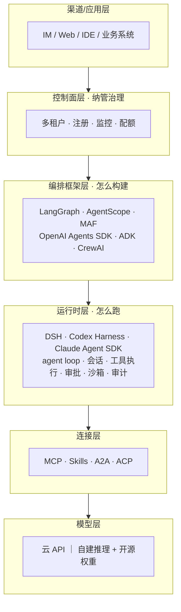

# Agent 开发框架对比

> 2026 年的 Agent 技术栈已经分层收敛：**编排框架**解决"agent 怎么构建/治理"，**运行时（Harness）**解决"agent 怎么跑"。这篇基于源码级审计的调研摘要（完整调研 2026-09-02），给出分层全景、核心框架对比与选型框架。

## 技术栈分层全景

**关键判断**：2026 年 8 月，"harness"成为独立赛道——DeepSeek Harness（8/13）与 Codex Harness 完整开源（8/19）相隔一周，运行时层正式商品化。成熟的中台组合是：**框架做编排 + harness 做运行时 + 自建 MCP 连接器**。

## 核心四框架速评

成熟度排序（2026-09）：LangGraph（1.0 一年+，生产案例最多）≈ AgentScope 2.0（企业级全栈）＞ Codex Harness（内核产品级，SDK 开源仅数周）＞ DSH（架构最激进，早期 prerelease）。

| 框架 | 类别 | 语言 | 一句话定位 | 突出能力 | 主要缺口 |
| --- | --- | --- | --- | --- | --- |
| **LangGraph + LangChain/Deep Agents** | 编排框架 | Python | 图/状态机编排事实标准 | checkpoint/HITL/时间旅行；LangSmith 部署四形态 | 沙箱/审批 UI/审计需 Deep Agents 或自建 |
| **AgentScope（+Service 控制面）** | 框架+控制面 | Python+Java | 企业级全栈，多租户一等公民 | 一键分布式 RAG、权限体系、飞书/钉钉渠道、异构 agent 注册 | 阿里云外生态相对年轻 |
| **Codex Harness** | 运行时 | Rust 内核 | 产品同款内核开源（Apache-2.0） | 内核最稳、沙箱完整、Compliance Platform | 为 OpenAI 模型深度调优，第三方模型有折扣 |
| **DeepSeek Harness（DSH）** | 运行时 | TypeScript | "Everything is a Plugin" | 会话事件溯源最强（fork/回放/全文检索）、模型无关、全链路可审计 | 早期 prerelease；办公连接器/RAG/多租户全自建 |

## 其他主流框架扫描

| 框架 | 类别 | 状态 | 一句话适用 |
| --- | --- | --- | --- |
| Microsoft Agent Framework（MAF） | 编排 | 1.0 GA（2026-04），合并 AutoGen + Semantic Kernel | 微软/Azure 系中台首选编排层 |
| AutoGen | 编排 | **维护模式**，官方引导迁移至 MAF | 仅存量维护，新项目勿选 |
| OpenAI Agents SDK | 编排 | 0.22.0，五原语轻量编排 | GPT 系轻量编排层，与 Codex Harness 分层互补 |
| Claude Agent SDK | 运行时 SDK | 0.x 高频迭代 | 深度定制编码/办公 agent（云推理） |
| Google ADK | 编排 | 1.0（2026-05），主推 A2A 协议 | GCP/Gemini 系 + 跨框架互操作 |
| CrewAI | 编排 | 1.15.18 | 快速上手角色化多 agent（Crews + Flows 双层） |
| Dify | 低代码平台 | 1.17.0，154k★ | 业务侧低代码/原型；注意修改版 Apache-2.0 的多租户条款 |
| Coze Studio | 低代码平台 | 开源 | 国内生态开箱即用 |

## 关键维度对比（核心四框架）

| 维度 | DSH | Codex Harness | LangGraph 系 | AgentScope 系 |
| --- | --- | --- | --- | --- |
| 会话管理 | ★★★ 事件溯源+fork+回放 | ★★ rollout/compaction | ★★ checkpoint 多后端 | ★★ 多租户多会话 |
| 审批 / HITL | fail-closed 三态缝 | approval modes | interrupt()（UI 自建） | 权限系统内置 |
| 沙箱 | ⚠️ 仅文件效果 | 完整（Seatbelt/Landlock） | ❌ 核心库无 | Docker/E2B/K8s 多档 |
| MCP | 一等（tools） | server + client | 生态集成 | + mcp-hub |
| 多 agent | 多 provider + Teams(实验) | 有限 | supervisor/swarm | agent-team 编排 |
| RAG / 记忆 | 需第三方 | memories | store + 生态 | 一键分布式 RAG + Mem0/ReMe |
| 可观测 | OTel（可导 SIEM） | OTel + 合规平台 | LangSmith | OTel 默认 + Dashboard |
| 多租户 / 渠道 | ❌ | ❌ | 付费档 | ✅ 原生 + 官方渠道 |
| 自建模型接入 | ✅ 一等公民 | ⚠️ experimental | ✅ 模型无关 | ✅ vLLM 兼容 |

## 选型框架

1. **编排层选成熟的，运行时层允许激进**：编排层要一年以上生产验证（LangGraph/AgentScope）；DSH/Codex SDK 都太新，用可替换的缝去试点
2. **不要用编排框架从零复刻 harness 能力**——会话/审批/审计是 2026 年 8 月后开源运行时免费送的部分
3. **数据敏感场景**的组合思路：模型无关的运行时（可对接自建推理）+ 控制面私有化 + 自建内部系统 MCP 连接器
4. **License 三处注意**：Dify 修改版 Apache-2.0 的多租户 SaaS 条款；Codex 开源 harness 与闭源模型/云的边界；LangSmith 自托管的出站依赖审查
5. **快速变化风险**：相关项目均在剧烈演进（首个正式 tag 即删兼容层是常态）——锁版本 + 薄抽象层隔离

## 参考资料

- [LangGraph 文档](https://docs.langchain.com/) · [AgentScope 生态门户](https://agentscope.io/)（官方架构图）
- [OpenAI Codex 仓库](https://github.com/openai/codex) · [DeepSeek Harness 仓库](https://github.com/deepseek-ai/deepseek-harness)
- [Microsoft Agent Framework](https://learn.microsoft.com/en-us/agent-framework/) · [Google ADK](https://adk.dev/) · [CrewAI](https://docs.crewai.com/)
- 站内相关：[Agent 热点编年史](/agentic/history) · [Agentic 总览](/agentic/)
