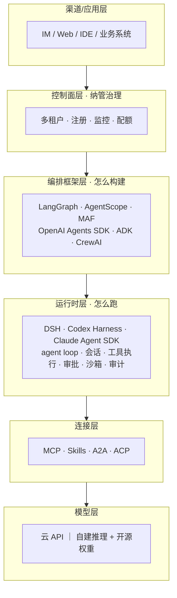
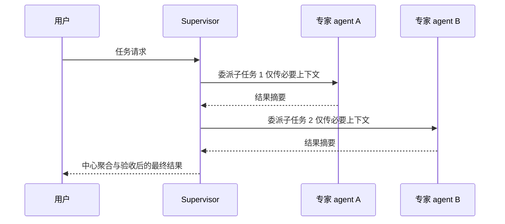
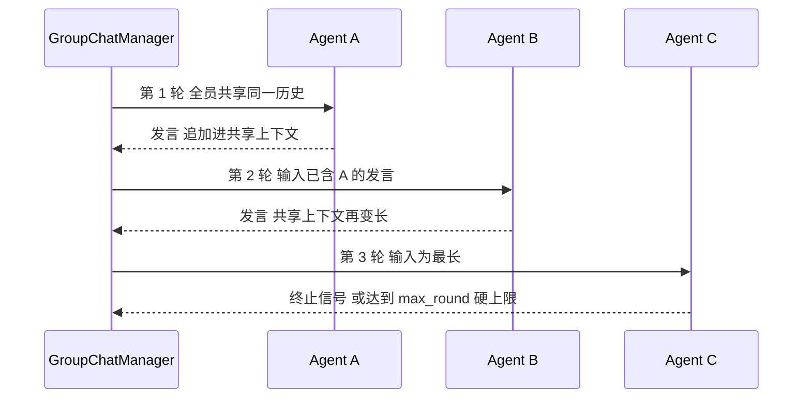
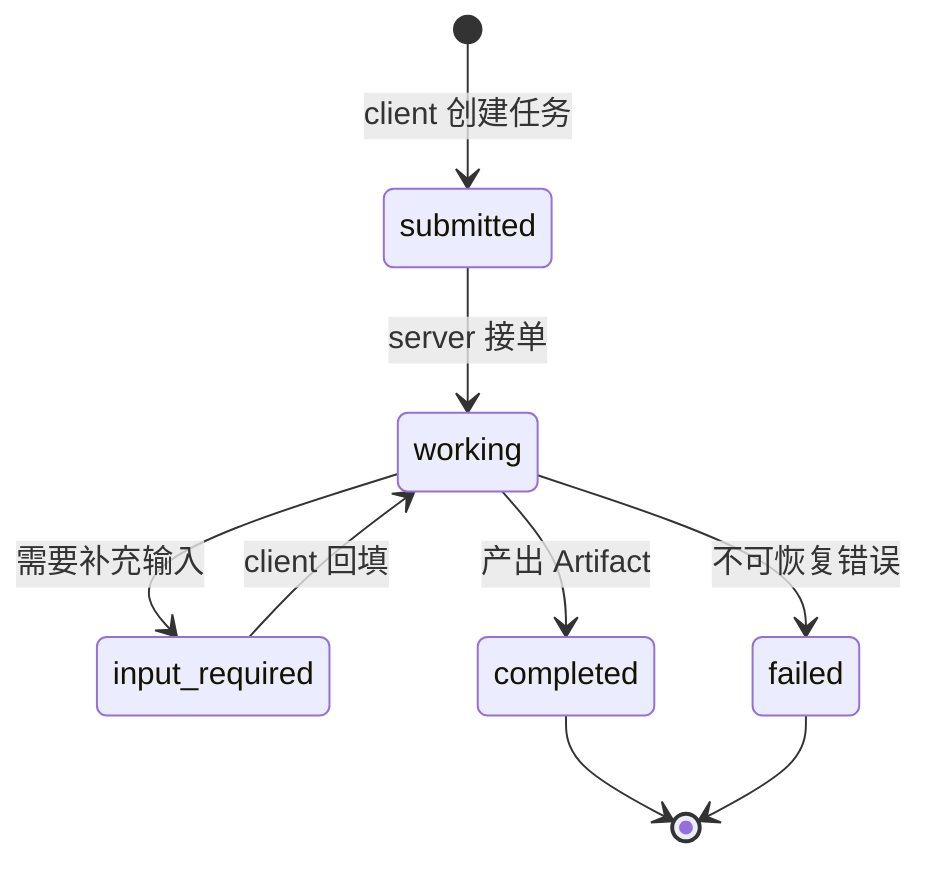
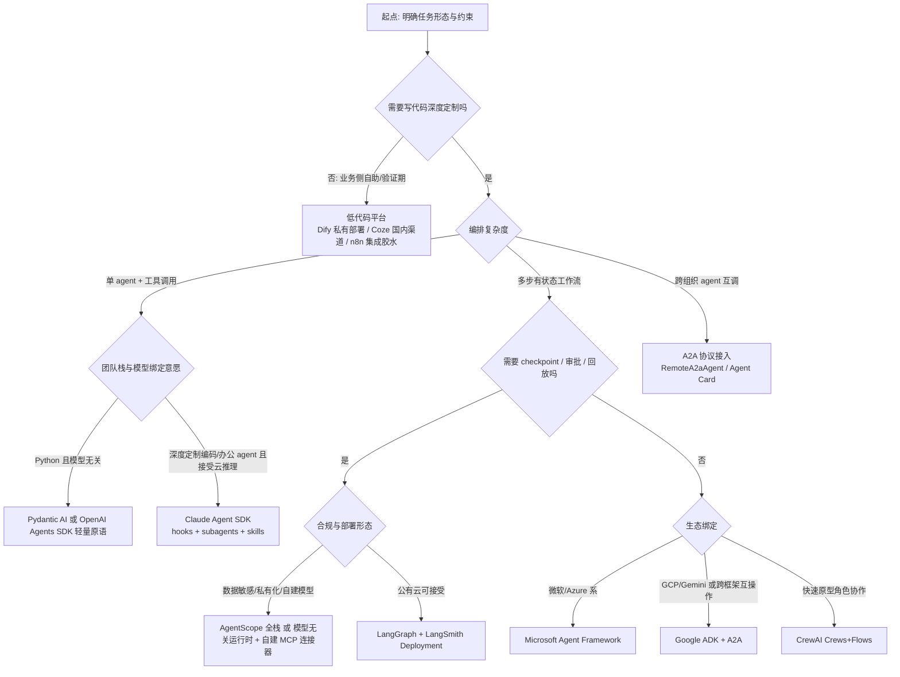
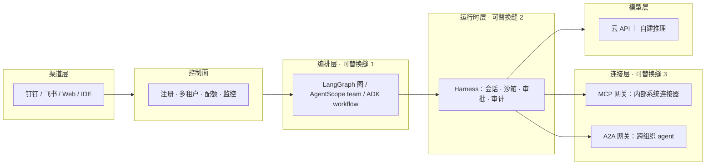

# Agent 开发框架对比

> 面向要把 Agent 接进生产系统、正在编排框架与运行时之间做选型的工程师与方案架构师。这篇不做功能清单式的罗列，而是把每条框架谱系**拆到机制层**讲清：LangGraph 的图状态机与 checkpoint、AutoGen 的会话驱动与它的三分 lineage、CrewAI 的角色协作、OpenAI Agents SDK 的 handoff 语义、Claude Agent SDK 的 subagent/hook、Google ADK 的工作流图，再往上收拢到编排模式（单 agent 循环 / supervisor / 层级 / 群聊 / 流水线）的通信开销与失控风险对比、协议层（MCP / A2A）的机制与治理现状、记忆与状态的工程实现，最后给一棵可直接套用的选型决策树和一张常见坑表。全文版本与协议事实核实于 2026-09-04，配图与生态动态复核于 2026-09-05。

## 一、技术栈分层全景



**关键判断**：2026 年 8 月，"harness"成为独立赛道——DeepSeek Harness（8/13）与 Codex Harness 完整开源（8/19）相隔一周，运行时层正式商品化。成熟的中台组合是：**框架做编排 + harness 做运行时 + 自建 MCP 连接器**。这条分层不是学术划分，而是过去一年生产事故教出来的：编排层负责"任务怎么拆、状态怎么流转"，运行时层负责"进程怎么活下来"（会话恢复、工具沙箱、审批缝、审计日志），两层混在一个框架里做的项目，升级时几乎没有不付出重写代价的。

## 二、第一性原理：Agent 执行循环与框架要解的四类问题

所有框架的差异，最终都可以追溯到它对同一个循环的不同封装方式。Anthropic 在《Building Effective Agents》中给出的执行循环序列，是理解一切编排抽象的起点：


*图源：Anthropic 工程博客《Building effective agents》agent loop 序列图（[anthropic.com/engineering/building-effective-agents](https://www.anthropic.com/engineering/building-effective-agents)，2026-09-05 下载本地化）。*

读这张图要抓两个细节。**其一，四个泳道（Human / Interface / LLM / Environment）对应生产系统的四个角色**：请求方、接入层（承担展示与澄清交互）、决策内核、工具环境——框架之间的差异，本质是"这四者之间的消息由谁路由、状态存在哪"。**其二，两个虚线框（Until tasks clear / Until tests pass）才是循环的灵魂**：终止条件被显式写成"任务清单清空"和"测试通过"，而不是"模型觉得自己做完了"。生产事故里占比最高的一类就是终止条件缺失导致的空转与过早收尾，后面第五节的失控风险对比表会回到这一点。

这个循环就是 ReAct（Reasoning + Acting，推理与行动交替，[arXiv:2210.03629](https://arxiv.org/abs/2210.03629)）范式的工程化：模型先生成一段推理迹（thought），再决定一个动作（action，通常是工具调用），环境返回观察（observation）拼回上下文，循环直到模型认为任务完成。伪代码层面极其朴素：

```text
messages = [system_prompt, user_request]
while not done and steps < max_steps:
    response = llm(messages, tools=tool_schemas)   # 决策：继续调工具还是收尾
    if response.tool_calls:
        for call in response.tool_calls:
            obs = execute_tool(call)               # 行动：在环境里产生副作用
            messages.append(tool_result(call, obs)) # 观察：回灌上下文
        done = False
    else:
        done = True                                # 模型自判终止
        final = response.text
```

朴素归朴素，一旦上生产，这个循环立刻引出四类工程问题——**框架之间真正的差异就在这四类问题的解法上**：

| 问题 | 工程本质 | 典型机制 | 代表实现 |
| --- | --- | --- | --- |
| 控制流 | 循环之外的分支、并行、回退怎么表达 | 图 / 会话 / 角色 / 工作流 DSL | LangGraph 状态图、AutoGen GroupChat、ADK Workflow |
| 状态 | 上下文放哪、崩溃后怎么恢复、多副本怎么共享 | checkpoint / 事件溯源 / 会话存储 | LangGraph checkpointer、DSH 事件溯源、OpenAI Sessions |
| 工具与连接 | 工具怎么注册、发现、鉴权、跨进程调用 | 函数工具 / MCP / Skills | 各框架 function tool + MCP client |
| 治理 | 审批、沙箱、审计、配额、多租户 | hook / interrupt / 运行时沙箱 / 控制面 | Claude Agent SDK hooks、LangGraph interrupt、AgentScope 权限体系 |

一个判断标准（我自己的经验边界内相当稳）：**看一个框架值不值得上生产，不要看它 demo 多炫，看它这四类问题里"状态"和"治理"两类的答案是否一等公民**。只解决了控制流的框架是玩具，解决了状态的是工具，四类都解决的是平台。

## 三、版本与活跃度全景（截至 2026-09）

成熟度排序（2026-09 口径，版本状态核实于 2026-09-04）：LangGraph（1.0 发布于 2025-10，生产案例最多）≈ AgentScope 2.0（v2.0.7，企业级全栈）＞ Codex Harness（内核产品级，SDK 开源仅数周）＞ DSH（架构最激进，早期 prerelease 0.1.2-rc）。

| 框架 | 版本（2026-09-04） | 类别 | 语言 | 一句话定位 | 突出能力 | 主要缺口 |
| --- | --- | --- | --- | --- | --- | --- |
| **LangGraph + LangChain/Deep Agents** | LangGraph 1.2.11 / LangChain 1.4.0 | 编排框架 | Python | 图/状态机编排事实标准 | checkpoint/HITL/时间旅行；LangSmith 部署四形态 | 沙箱/审批 UI/审计需 Deep Agents 或自建 |
| **AgentScope（+Service 控制面）** | 2.0.7 | 框架+控制面 | Python+Java+TS | 企业级全栈，多租户一等公民 | 一键分布式 RAG、权限体系、飞书/钉钉渠道、异构 agent 注册 | 阿里云外生态相对年轻 |
| **Codex Harness** | rust 0.153.2 | 运行时 | Rust 内核 | 产品同款内核开源（Apache-2.0） | 内核最稳、沙箱完整、Compliance Platform | 为 OpenAI 模型深度调优，第三方模型有折扣 |
| **DeepSeek Harness（DSH）** | 0.1.2-rc.1 | 运行时 | TypeScript | "Everything is a Plugin" | 会话事件溯源最强（fork/回放/全文检索）、模型无关、全链路可审计 | 早期 prerelease；办公连接器/RAG/多租户全自建 |

其他主流框架扫描（同口径）：

| 框架 | 类别 | 状态 | 一句话适用 |
| --- | --- | --- | --- |
| Microsoft Agent Framework（MAF） | 编排 | 1.0 GA（2026-04）；Python 1.17 / .NET 1.20，合并 AutoGen + Semantic Kernel | 微软/Azure 系中台首选编排层 |
| AutoGen | 编排 | **维护模式**，官方引导迁移至 MAF | 仅存量维护，新项目勿选 |
| OpenAI Agents SDK | 编排 | 0.22.0（2026-08），五原语轻量编排 | GPT 系轻量编排层，与 Codex Harness 分层互补 |
| Claude Agent SDK | 运行时 SDK | Python 0.2.152 / TS 0.3.260，0.x 高频迭代 | 深度定制编码/办公 agent（云推理） |
| Google ADK | 编排 | 2.8.0（2.0 发布于 2026-05，1.39 系并行维护），主推 A2A 协议 | GCP/Gemini 系 + 跨框架互操作 |
| CrewAI | 编排 | 1.15.18 | 快速上手角色化多 agent（Crews + Flows 双层） |
| Dify | 低代码平台 | 1.17.0，150k+ star 量级 | 业务侧低代码/原型；注意修改版 Apache-2.0 的多租户条款 |
| Coze Studio | 低代码平台 | 开源（2025 年开源） | 国内生态开箱即用 |
| Pydantic AI（首次收录） | 编排 | 2.38.0（2026-09），19.7k★ | Python 类型安全、模型无关的轻量编排，LangChain 系之外首选 |
| Mastra（首次收录） | 编排 | @mastra/core 1.63.0，TypeScript | JS/TS 全栈团队的 agent 框架 |

关键维度对比（核心四框架，★ 为同口径相对评分）：

| 维度 | DSH | Codex Harness | LangGraph 系 | AgentScope 系 |
| --- | --- | --- | --- | --- |
| 会话管理 | ★★★ 事件溯源+fork+回放 | ★★ rollout/compaction | ★★ checkpoint 多后端 | ★★ 多租户多会话 |
| 审批 / HITL | fail-closed 三态缝 | approval modes | interrupt()（UI 自建） | 权限系统内置 |
| 沙箱 | 部分仅文件效果 | 完整（Seatbelt/Landlock） | 无 核心库无 | Docker/E2B/K8s 多档 |
| MCP | 一等（tools） | server + client | 生态集成 | + mcp-hub |
| 多 agent | 多 provider + Teams(实验) | 有限 | supervisor/swarm | agent-team 编排 |
| RAG / 记忆 | 需第三方 | memories | store + 生态 | 一键分布式 RAG + Mem0/ReMe |
| 可观测 | OTel（可导 SIEM） | OTel + 合规平台 | LangSmith | OTel 默认 + Dashboard |
| 多租户 / 渠道 | 无 | 无 | 付费档 |  原生 + 官方渠道 |
| 自建模型接入 |  一等公民 | 部分experimental |  模型无关 |  vLLM 兼容 |

## 四、编排框架谱系机制级拆解

### 4.1 LangGraph：图状态机

LangGraph 的核心赌注是：**把 agent 的控制流显式建模为一张带状态的状态机图**，而不是让模型在对话里隐式地"聊出"流程。三个一等抽象：

- **State**：一个schema化的共享状态对象（通常是 TypedDict/dataclass），图里所有节点读写同一份状态；
- **Node**：一个普通函数 `(state) -> partial_state`，可以是 LLM 调用、工具调用或纯代码；
- **Edge / 条件边**：决定下一个执行哪个节点；条件边的路由函数读状态返回节点名，分支逻辑写在代码里而不是 prompt 里。

状态合并靠 **channel + reducer** 机制：每个状态字段是一个 channel，声明 reducer（如列表字段用 `add_messages` 追加而非覆盖）后，多个节点对同一字段的写操作按 superstep（同步步）语义合并——这与 Google Pregel/BSP（Bulk Synchronous Parallel，整体同步并行）模型同源：每个 superstep 内并行执行当前活跃节点，步末统一应用状态更新。这个设计换来的工程红利是**确定性回放**：同一份 checkpoint + 同一输入，执行路径可复现，调试时能做"时间旅行"（从任意历史 checkpoint 分叉重跑）。

**checkpoint 与 human-in-the-loop** 是 LangGraph 相对其他编排框架最深的护城河：

- checkpointer 把每个 superstep 后的状态快照持久化到后端（内存 / SQLite / Postgres / Redis 多档），线程（thread_id）即会话；
- `interrupt()` 在任意节点边界暂停图执行，状态已落盘，等人审批后 `resume` 继续——审批 UI 要自建，但"暂停-恢复"的语义是内核级的，不是补丁；
- 崩溃恢复 = 从最近 checkpoint 重启，长任务（几十分钟的多步 agent）因此才敢上生产。

2026 年的演进主线是**容错与规模化**：1.0（2025-10）冻结核心 API；1.2（2026-05）加入节点级 timeout（`add_node(timeout=...)`，超时抛 `NodeTimeoutError`）、节点错误处理器、graceful shutdown（当前 superstep 完成后协作式停机并保存状态）、以及一种显著缩小 checkpoint 体积的新 channel 类型；1.2.11（2026-08）为当前稳定版。平台侧 LangGraph Platform 已更名为 LangSmith Deployment，观测与部署收拢到 LangSmith 一条线。活跃度：GitHub 约 41k star，PyPI 月下载量级在千万级，是安装量最大的编排框架（star 数反而低于 LangChain 主仓与 Dify，说明它更多被当作库而非话题）。

```python
from langgraph.graph import StateGraph, START, END

graph = StateGraph(AgentState)
graph.add_node("plan", plan_node)                 # 纯代码或 LLM 节点
graph.add_node("act", act_node, timeout=30)       # 1.2 起支持节点级超时
graph.add_node("review", review_node)             # 内部调 interrupt() 等人工审批
graph.add_edge(START, "plan")
graph.add_conditional_edges("act", route_by_state)  # 分支写在代码里
graph.add_edge("review", END)
app = graph.compile(checkpointer=postgres_saver)    # checkpoint 后端可选
```

**多 agent 库与 Deep Agents**。图内核之上，官方 `langgraph-supervisor` / `langgraph-swarm` 两个库给出 supervisor 与 handoff 两种拓扑的现成实现（第五节的模式图即出自同一家官方脉络）；Deep Agents 层则在 LangGraph 上加了"计划工具 + 子 agent 派生 + 文件系统式上下文管理"的默认组合，把编排层到运行时层之间的空档补上。工程含义：用 LangGraph 不必手写 supervisor 路由逻辑，但路由策略（选哪个子 agent、结果如何摘要回传）仍是你自己的 prompt 资产，要进回归测试集。

适用场景：多步、有状态、需要审批与回放的企业级工作流；缺口是沙箱、审批 UI、审计这些"运行时/控制面"能力要给 Deep Agents 或自建。

### 4.2 AutoGen → AG2 / Microsoft Agent Framework：会话驱动

AutoGen（微软研究院，[arXiv:2308.08155](https://arxiv.org/abs/2308.08155)）的核心赌注与 LangGraph 相反：**控制流不画图，而是让 agent 之间"聊出来"**。一切皆 Conversable Agent，编排 = 设计会话模式。


*图源：AutoGen 论文图 1（[arXiv:2308.08155](https://arxiv.org/abs/2308.08155)）。*

论文给出的两种基础会话拓扑至今仍是群聊类框架的原型：


*图源：AutoGen 论文（two-agent vs group chat 结构图，[arXiv:2308.08155](https://arxiv.org/abs/2308.08155)）。*

- **two-agent chat**：用户代理 + 助手代理轮流发言，代码执行器作为"环境角色"参与对话（模型写出代码 → executor 角色跑出错信息回贴 → 模型自修正），这是"对话即调试循环"的原始设计；
- **GroupChat**：多个 agent 共享一条会话流，由一个 **GroupChatManager**（本身也是 LLM agent）决定下一轮谁发言；hierarchical chat 则是把一组会话包成一个嵌套节点对外表现为单 agent。

机制层面的代价要心里有数：group chat 的通信是**广播式**的——每轮发言进入共享上下文，所有 agent 的下一轮输入都变长，token 成本随轮数近似线性、随 agent 数近似二次增长；manager 的选人决策是又一次 LLM 调用，选错人就空转一轮。AutoGen 的解法是 speaker selection 策略可配（round-robin / LLM 选 / 人工指定）与 `max_round` 硬上限，但"会话即状态"的模型决定了它很难做 checkpoint 级回放——这也是它后来被图状态机路线压过的根本原因。

**lineage 三分**是 2026 年用 AutoGen 系必须先搞清的事：

| 分支 | 现状（2026-09） | 说明 |
| --- | --- | --- |
| microsoft/autogen | **维护模式** | 2025-01 发布 v0.4 全量重写（actor 模型异步运行时）；2025-10 宣布进入维护模式：只修 bug 与安全补丁，不加新功能，官方引导迁移 MAF |
| Microsoft Agent Framework（MAF） | 1.0 GA（2026-04） | AutoGen 的 agent/编排抽象 + Semantic Kernel 的企业能力（会话状态管理、类型安全、中间件）合并而成；Python 1.17 / .NET 1.20，2026 年 BUILD 大会继续加 Agent Harness 能力，并扩展 Go 支持 |
| AG2（ag2ai/ag2） | 社区活跃 | 2024-11 原作者 Chi Wang、Qingyun Wu 离开微软后 fork 的社区治理分支，Apache-2.0，v1.0.x；定位"Build Systems, Not Prompts"，强调跨框架互操作（可把 AG2/ADK/OpenAI/LangChain agent 编进一个 team） |

MAF 在机制层继承两条 lineage：AutoGen 的 agent/编排抽象（会话式与 workflow 式编排、GroupChat 的后继形态）加上 Semantic Kernel 的企业件套（基于 session 的状态管理、类型安全的插件模型、中间件管线），可观测默认走 OpenTelemetry。对已在 Azure 栈内的团队，它的价值在于让 agent 的治理面与既有企业身份、合规体系对齐，而不是编排语义本身有多新。

工程结论很直接：**新项目不要选 microsoft/autogen**；微软/Azure 系选 MAF，认同原 AutoGen 会话哲学且要社区节奏选 AG2。

### 4.3 CrewAI：角色协作

CrewAI 的核心赌注是**用组织隐喻降低多 agent 的心智门槛**：每个 agent 有 role（角色）、goal（目标）、backstory（背景故事）三要素，任务（Task）指派给 agent，一组 agent + 一组任务组成 Crew。独立于 LangChain 自研内核，主打"lean、lightning-fast"。


*图源：CrewAI 官方文档 Crews 概念图（[docs.crewai.com](https://docs.crewai.com/)，2026-09-05 下载本地化）。*

双层架构是 2025 年后的关键演进，官方文档把两层的关系概括为 "Crews: more agency / Flows: more control"：


*图源：CrewAI 官方文档 Flows 概念图（[docs.crewai.com](https://docs.crewai.com/)，2026-09-05 下载本地化）。*

- **Crews（自主层）**：process 模式 sequential（任务按序传递产出）或 hierarchical（自动派生一个 manager agent 做委派与验收）；agent 在任务内自主决定工具调用顺序。适合"结果导向、过程不想管"的场景，如调研-写作-审校流水线；
- **Flows（控制层）**：事件驱动编排，`@start` / `@listen` / `@router` 装饰器定义节点与触发关系，带结构化状态（Pydantic 模型）与持久化，可以把 Crew 整体作为一个 Flow 节点嵌入。需要精确控制与分支时用 Flow 包 Crew，是官方推荐的生产组合。

```python
crew = Crew(
    agents=[researcher, writer, reviewer],      # 每个 agent 带 role/goal/backstory
    tasks=[research_task, draft_task, review_task],
    process=Process.sequential,                 # 或 hierarchical：自动派生 manager agent
    memory=True,                                # 短期/长期/实体三层记忆开箱
)
result = crew.kickoff(inputs={"topic": "..."})  # 任务产出按序传递（context= 显式声明依赖）
```

状态与记忆：Crew 内置短期/长期/实体记忆（默认 SQLite + 向量存储）与任务间上下文传递（`context=` 显式声明依赖）。版本 1.15.x（2026-09 为 1.15.18），1.0 于 2025-10 发布；GitHub star 各来源口径不一（2026 年内报道在 44k–57k 区间），取"5 万量级"。我的使用边界：CrewAI 上手是全家桶里最快的（半天能跑通带记忆的三 agent 流水线），但**角色隐喻在复杂分支场景会漏**——一旦需要"第 3 步失败回退到第 1 步并重放"，你会发现自己是在和隐喻打架，这时该换图状态机。

### 4.4 OpenAI Agents SDK：轻量原语与 handoff

OpenAI Agents SDK（2025-03 发布，Swarm 实验项目的正式后继）的赌注是**原语最少化**：五个概念覆盖全部编排——Agents（带指令与工具的 LLM）、Handoffs（控制权转移）、Guardrails（输入/输出校验）、Sessions（跨 run 会话记忆）、Tracing（内建执行追踪）。没有图、没有角色，控制流靠"agent 把别的 agent 当工具调"表达。

**handoff 机制**是它与其他框架多 agent 模型的本质差异：handoff 在实现上是一个**特殊的工具调用**——agent A 的工具表里挂着 `transfer_to_b`，模型决定调用它时，runner 不是把 B 的输出当工具结果回填给 A，而是**把整个 run 的控制权切换给 B**（B 接管对话与工具表，A 退出本次 run）。这与 supervisor 模式（中心 agent 把子 agent 当普通工具调、收回结果继续决策）形成对照：

| 语义 | handoff（OpenAI SDK / LangGraph swarm） | supervisor（LangGraph supervisor 等） |
| --- | --- | --- |
| 控制权 | 转移：A 退出，B 接手 | 保留：中心 agent 始终在环内 |
| 上下文 | 默认共享同一会话历史 | 子 agent 独立上下文，只回传结果 |
| 适用 | 按领域分诊（售前/售后/退款） | 中心决策 + 专家执行 |
| 失控面 | 链式 handoff 可能踢皮球 | 中心节点单点与瓶颈 |

几个必须知道的语义边界（官方文档明写，踩过才知道痛）：**input guardrails 只作用于 handoff 链上的第一个 agent，output guardrails 只作用于产出最终结果的 agent；tool guardrails 不覆盖 handoff 调用本身**——也就是说校验逻辑要按"链"设计而不是按"agent"设计。Sessions 原语在 2026 年补上了跨 run 的会话记忆（SQLite/内存/自定义后端），之前每次 `Runner.run` 都要手工回灌历史。

```python
triage = Agent(name="triage", instructions="按领域分诊请求",
               handoffs=[sales, support, refunds])
sales  = Agent(name="sales", tools=[quote_tool], handoffs=[triage])
# 模型调用 transfer_to_sales 时，runner 把控制权整体切给 sales，triage 退出本次 run；
# input guardrails 只对 triage（链上第一个）执行，output guardrails 只对产出最终结果的 agent 执行
```

2026-04-15 的 "next evolution" 更新是发布以来最大一次：原生**沙箱执行**（隔离环境内做文件检查、shell、代码编辑，不用再自己拼 Docker）、**session snapshot/rehydration**（会话快照在新沙箱中恢复续跑）、subagents 与 code mode、TypeScript 版同步获得沙箱 agent 与开源 harness。当前版本 0.22.0（2026-08）。定位判断：它是 GPT 系模型的轻量编排层，与 Codex Harness 分层互补（SDK 管编排语义，Harness 管运行时）；模型无关性靠 LiteLLM 类适配，但深度特性（沙箱、语音 agent）明显为 OpenAI 模型优先。

### 4.5 Claude Agent SDK：把运行时做成 SDK

Claude Agent SDK 的形态与以上所有框架都不同：**它不是编排库，而是把 Claude Code 同款 agent 运行时以 SDK 形式开放**（Python/TypeScript 双语言，实现上会拉起一个 Claude Code CLI 子进程作为执行内核——部署时要按"带一个二进制依赖"来规划，而不是纯 pip 库）。2025 年随 Claude Code 发布时名为 Claude Code SDK，2026 年初更名 Claude Agent SDK，同时期补齐 subagents、生命周期 hooks 与 Skills 体系，定位从"编码 agent"扩到通用 agent。

机制层三个一等公民：

- **Subagents**：主 agent 通过 Agent 工具派生子 agent，子 agent 有独立上下文窗口与专属指令/工具集，结果摘要回传——本质是"上下文隔离 + 并行执行"的官方实现，官方文档明确其用途是 isolate context / run in parallel / specialized instructions；支持嵌套（社区实测深度可达 5 层，但官方建议封顶）；
- **Hooks**：在生命周期缝上挂确定性代码（不是 prompt），覆盖 session、prompt、tool、subagent、task、file、notification 等阶段约 30 个事件（`PreToolUse` / `PostToolUse` / `SubagentStart` / `SubagentStop` 等）。hook 返回结构化决定（allow / deny / 修改输入），是**合规场景最硬的缝**——比如"禁止读 .env""删除操作必须过工单系统"这类规则用 hook 写是确定性的，用 prompt 写是概率性的；
- **Skills**：按需加载的能力包（目录 + 说明文档 + 资源），渐进式披露进上下文，控制长任务的上下文占用。

hooks 的配置形态示意（具体命名以官方文档为准）：确定性规则挂在生命周期缝上，返回 allow/deny/改写输入的结构化决定——"删除类命令必须过工单系统""禁止读取凭据文件"这类合规规则在这里是代码而不是 prompt：

```text
hooks = {
  PreToolUse:  [match("Bash")  -> block_dangerous_cmd],   # 工具执行前的确定性否决缝
  PostToolUse: [match("*")     -> audit_log],             # 全量审计落盘
  SubagentStop:[match("*")     -> collect_subagent_summary],
}
options = {hooks: hooks, mcp_servers: {internal: ...}, permission_mode: "default"}
```

会话侧支持 session 续跑与 fork（从历史会话分叉新会话），配合 MCP client 一等支持，使其成为"深度定制编码/办公 agent（云推理）"的首选运行时 SDK。版本高频迭代（0.x，Python 0.2.152 / TS 0.3.260，2026-09-04 口径），2026-08 起支持 1M 上下文与沙箱化运行。使用边界：推理走 Anthropic 云，**数据必须留在自建推理内的场景不适用**；0.x 版本 API 变动频繁，锁版本是硬要求。

### 4.6 Google ADK：工作流图 + A2A 原生

Google ADK（Agent Development Kit，2025-04 发布）的赌注是**软件工程化**：agent 是代码对象树，组合方式显式声明。核心抽象三层：

- **Agent**：`LlmAgent`（模型驱动）与_workflow agent_（`SequentialAgent` / `ParallelAgent` / `LoopAgent`，确定性组合）；
- **Tool**：函数工具、MCP 工具、OpenAPI 工具、以及把远程 A2A agent 包成本地工具的 `RemoteA2aAgent`；
- **Artifact / Session / Memory**：会话状态、产物存储与记忆服务内置，Runner 负责执行与事件流。


*图源：Google ADK 官网工作流示意图（[adk.dev](https://adk.dev/)，2026-09-05 下载本地化）。*

这张官方图的信息量在于：ADK 的工作流里**确定性节点（Function）、人工节点（Human Input）、工具节点（Tool）与 LLM 节点是同构的**，条件分支（Miles < 5k / 5k–20k / > 20k）写在图结构里——思路与 LangGraph 同源，但 ADK 把"人工审批"也做成了一种节点类型而非中断语义。组合方式的代码形态：

```python
root = SequentialAgent(sub_agents=[
    LlmAgent(name="analyze", tools=[search_tool]),          # 模型驱动节点
    LoopAgent(sub_agents=[checker, fixer], max_iterations=3),  # 确定性循环，终止条件显式
    RemoteA2aAgent(name="partner", agent_card=card_url),     # 跨组织黑盒 agent 变成本地节点
])
```

ADK 同时也是 A2A 协议的原生载体：`RemoteA2aAgent` 自动处理 Agent Card 发现与交换，跨语言组 team（Python agent 调 Java agent）是官方主打场景；内置 eval 框架（agent 级与流程级评估）在编排框架里完成度最高。版本：2.0 于 2026-05 发布（当前 2.8.0，1.39 系并行维护），ADK for Java 1.0.0 已 GA。适用：GCP/Gemini 系与跨框架互操作（A2A）场景；模型无关但生态重心在 Gemini。

### 4.7 低代码平台：Dify / Coze / n8n 的形态差异

低代码平台与代码框架不是竞争关系而是**不同交付形态**，三者差异比表面大：

| 平台 | 形态本质 | 强项 | 边界 | 开源与许可（2026-09） |
| --- | --- | --- | --- | --- |
| Dify | LLMOps 原生：模型管理 + RAG 知识库 + Workflow/Agent 编排 + 观测一体化 | 企业级私有部署、知识库工程化、交付给业务方自助运营 | 深度定制要改平台代码；多租户 SaaS 化受许可条款约束 | 开源，1.17.0，150k+ star；修改版 Apache-2.0（多租户 SaaS 条款注意） |
| Coze（扣子）/ Coze Studio | Bot 工厂：零代码搭 bot + 插件市场 + 渠道分发 | 国内渠道与插件生态开箱即用，非开发者可用 | 开源版（2025 年开源）生态尚新，复杂状态流转表达力弱 | coze-studio 开源 |
| n8n | 自动化平台长出的 AI 能力：节点式工作流，AI Agent 是其中一类节点 | 集成面最广（数百连接器）、可写 JS/Python 节点、社区与公司化支持最稳 | AI 原生能力（记忆/多 agent）是后加的，深度不如原生框架 | fair-code（源码可见，非 OSI 开源） |

选型经验：**验证期与业务自助期用低代码，进入生产治理期把核心链路迁回代码框架**——低代码平台最难补的是版本化（工作流 JSON 的 diff/评审/回滚）与测试（编排逻辑的自动化回归），这两项恰是代码框架的舒适区。具体到痛点：画布产出的 DSL 进 Git 后 diff 几乎不可读，评审只能靠截图；节点逻辑散在画布配置里，写单元测试没有稳定入口；平台升级偶有节点语义变化，回归只能全量手点。这三项任何一项成为团队日常负担，就是迁移信号。也有反向路径：n8n 做集成胶水 + 代码框架做核心 agent，用 MCP/HTTP 节点互连，是不少团队的实际形态。

### 4.8 AgentScope 与国产生态

AgentScope（阿里通义系开源）是国产框架里唯一做到"框架 + 控制面"全栈的：2.0 架构中心是 Agent Service / Agent Engine / Workspace（Docker 与云沙箱），外围覆盖模型渠道、网关注册、可观测与沙箱、示例应用。


*图：AgentScope 2.0 官方生态架构图（来源：[agentscope.io](https://agentscope.io/)，2026-09-04 下载本地化）。*

机制亮点：多租户与权限体系是一等公民（编排框架里少见）、一键分布式 RAG、记忆可接 Mem0/ReMe、官方渠道含飞书/钉钉、异构 agent 注册（非 AgentScope 实现的 agent 也能纳管）、沙箱多档（Docker/E2B/K8s）、OTel 默认可观测 + Dashboard、vLLM 兼容的自建模型接入。当前 v2.0.7，Python+Java+TS 三语言。对国内企业场景（钉钉/飞书渠道、私有化、信创栈适配）它的"开箱即治理"程度最高；代价是阿里云外生态相对年轻，社区案例密度低于 LangGraph。

国产与周边值得跟踪的还有：Coze Studio（字节，见 4.7）、国内云厂商的 agent 开发平台（阿里云百炼类）多以闭源平台形态提供编排+知识库+渠道，与开源框架互补而非替代；Datawhale 等社区的 hello-agents 教程已成为中文入门事实教材。

## 五、编排模式专题：通信开销与失控风险

框架选完只是选了"表达工具"，真正的架构决策是**选哪种多 agent 拓扑**。2026 年 LangChain 官方把多 agent 架构收敛为四种基础模式（subagents / skills / handoffs / routers），与经典五分法（单 agent / supervisor / 层级 / 群聊 / 流水线）的对应关系是：subagents ≈ supervisor，handoffs ≈ swarm/群聊的受控版，routers ≈ 流水线前置分诊。

**Supervisor（中心委派）**：主 agent 把子 agent 当工具调用，收回结果后继续决策。通信是星型：所有信息过中心，子 agent 之间不直接对话。


*图源：LangChain 官方博客《Choosing the Right Multi-Agent Architecture》subagents/supervisor 模式图（[langchain.com/blog/choosing-the-right-multi-agent-architecture](https://www.langchain.com/blog/choosing-the-right-multi-agent-architecture)，2026-09-05 下载本地化）。*

**Handoffs / swarm（对等移交）**：控制权在 peer agent 间转移，没有常驻中心。


*图源：LangChain 官方博客《Choosing the Right Multi-Agent Architecture》handoffs 模式图（[langchain.com/blog/choosing-the-right-multi-agent-architecture](https://www.langchain.com/blog/choosing-the-right-multi-agent-architecture)，2026-09-05 下载本地化）。*

五种模式的工程对比（通信开销按 n 个 agent、T 轮任务估算量级）。先说这列怎么读：O(T) 指上下文总增长只与任务步数有关、与 agent 数无关（单 agent 与流水线）；O(n·T) 指中心节点上下文随 agent 数线性增长（每个子 agent 往返在中心汇一次）；O(n²·T) 指广播式群聊中每轮共享历史全员可见、人人付全价。量级估的是"上下文字节"而非调用次数——真正烧钱的是前者，因为 token 按上下文长度计费：

| 模式 | 通信拓扑 | 通信开销 | 失控风险 | 可调试性 | 典型适用 | 工程含义 |
| --- | --- | --- | --- | --- | --- | --- |
| 单 agent 循环（ReAct） | 无（模型-工具星型） | O(T) | 低：一条轨迹可完整回放 | ★★★ | 工具调用型任务、编码 agent | 默认起点；上下文膨胀是唯一失控面 |
| 流水线（pipeline） | 链型 A→B→C | O(T) | 低：无环，终止确定 | ★★★ | 步骤固定的生产流程（抽取→校验→入库） | 本质是 workflow 不是 agent；能用流水线解决就不要上多 agent |
| Supervisor | 星型 | O(n·T)，中心上下文线性增长 | 中：中心误委派、子 agent 结果被中心误读 | ★★ | 领域分工明确、需中心审计 | 2026 年企业默认模式：合规边界与审计天然落在中心 |
| 层级式（hierarchical） | 树型（supervisor 套 supervisor） | O(n·T·depth) | 中高：误差逐层放大，深层信息失真 | ★ | 组织映射型大系统（部门-小组） | 深度建议 ≤2；每加一层损失一次信息保真 |
| 群聊 / swarm | 广播共享会话 | O(n²·T)（共享上下文每轮全员变长） | 高：发言死循环、manager 选人空转 | ★ | 头脑风暴、辩论式评审、代码互审 | 必须设 max_round 与终止判定；成本最先爆的就是它 |



对照看群聊式的通信形态——差别一目了然：



群聊式的开销就藏在这张图里：**每一轮的输入 = 全部历史发言**，agent 数与轮数共同决定上下文长度；而 supervisor 图里子 agent 的输入只有中心节点精心裁剪的子任务描述。这也是为什么群聊式只适合"过程本身有价值"的场景（辩论评审、代码互审、创意发散），而"只要结果"的场景用群聊是在为过程付全价。

这张序列图里有两条工程含义：**其一**，supervisor 模式下子 agent 只拿"必要上下文"，这是它相对群聊的成本优势来源（群聊里每轮发言全员可见）；**其二**，所有结果经中心聚合，审计点唯一——合规场景要的"谁批准了这一步"在星型拓扑里是一个确定答案，在群聊拓扑里是一段需要回溯的对话。LangChain 自己对 supervisor 路线的基准测试报告了约 50% 的任务完成度提升（相对其早期多 agent 实现），这也是 2026 年 supervisor 成为企业默认模式的实证背景。

## 六、协议层：MCP 与 A2A

编排框架解决"一个应用内的 agent 怎么协作"，协议层解决"跨应用、跨厂商的 agent 与工具怎么互连"。2026 年的治理格局是：**两条协议同归 Linux Foundation 下的 Agentic AI Foundation（AAIF）共治**——Anthropic 于 2025-12-09 将 MCP 捐赠给 AAIF（基金会由 Anthropic、Block、OpenAI 共同创立，Block 的 goose 与 OpenAI 的 AGENTS.md 同为创始项目），A2A 亦归入其下；Linux Foundation 2026-04-09 公告 A2A 参与组织超 150 家、已进入企业生产使用。"MCP 管工具/上下文、A2A 管 agent 互通"的分工被官方明确。

### 6.1 MCP：模型-工具连接

MCP（Model Context Protocol）把"模型 ↔ 工具/数据"的连接标准化为 client-server 协议：host 应用（IDE、agent 框架、桌面客户端）内嵌 MCP client，通过 stdio（本地进程）或 streamable HTTP（远程）连接 MCP server；server 暴露三类原语——**tools**（可调用动作）、**resources**（可读上下文）、**prompts**（模板），client 侧另有 **sampling**（server 反向请求模型补全）与 elicitation 等缝。


*图源：MCP 官方文档架构图（[modelcontextprotocol.io](https://modelcontextprotocol.io/specification/2026-07-28/)，docs 仓库 java 架构页插图，2026-09-05 下载本地化）。*

spec 沿革：2025-06-18 → 2025-11-25 → **2026-07-28（现行）**。2026-07-28 是一次"无状态化"重写，对自建网关的架构影响最大：

- **移除协议级会话握手**：initialize 握手与 `Mcp-Session-Id` 头取消，每次请求自带版本与能力声明——水平扩容不再需要 sticky routing 与共享会话存储，server 可以像普通 HTTP 服务一样放在负载均衡后面；
- **新增 server/discover 与统一通知流 subscriptions/listen**：发现与订阅归一，网关可做统一路由；
- **MRTR（Multi Round-Trip Requests）** 取代基于长连接 SSE 的 server 主动请求：server 返回"允许多轮往返"的响应而非在持久连接上推流，对 serverless/短连接部署友好；
- 代价：存量有状态 server 需要适配（AAIF 提供了迁移指南），网关层要做双版本兼容——这是 2026 下半年 MCP 生态最主要的工程工作量。

协议原语与工程含义对照：

| 原语 | 方向 | 用途 | 工程要点 |
| --- | --- | --- | --- |
| tools | server 暴露 | 可调用动作（带 inputSchema 与注解） | 鉴权与审计落在 server 侧；工具描述质量直接决定模型调用正确率，是要维护的资产 |
| resources | server 暴露 | 可读上下文（文件、DB 行、文档） | 适合"注入上下文"而非"执行动作"；只读面更易过安全审查 |
| prompts | server 暴露 | 模板化提示词 | 组织级最佳实践 prompt 的统一分发口 |
| sampling | client 提供 | server 反向请求 host 的模型做补全 | server 借 host 的模型配额完成子推理；权限缝在 client 侧审批 |
| elicitation | client 提供 | server 向用户请求补充输入 | HITL 的协议级缝，补充信息不必再塞进工具参数里绕路 |

### 6.2 A2A：agent 间通信

A2A（Agent2Agent Protocol，Google 2025-04 发起）解决另一层问题：**把远程 agent 当黑盒协作**——不共享内存、不共享工具表、甚至不同框架不同语言，只通过协议交换能力与任务。


*图源：Google Developers 博客《A2A: A new era of agent interoperability》概念图（[developers.googleblog.com](https://developers.googleblog.com/en/a2a-a-new-era-of-agent-interoperability/)，2026-09-05 下载本地化）。*

机制四件套：**Agent Card**（JSON 能力名片，含端点、技能、鉴权方式，供能力发现）、**Task**（有生命周期的工作单元：submitted/working/input-required/completed/failed 状态机）、**Message/Part**（文本/文件/结构化数据载荷）、**Artifact**（任务产出物）。通信模式覆盖请求-响应、SSE 流式与 push notification（长任务回调）。Task 的状态机值得单独画出来，因为它是"跨组织协作可审计"的基础——每一步状态迁移都是协议事件：



与 MCP 的分工在官方图里一目了然：


*图源：A2A 官方文档《A2A and MCP》互补关系图（[a2a-protocol.org](https://a2a-protocol.org/)，2026-09-05 下载本地化）。*

一句话记忆：**MCP 是 agent 的"手"（够到工具与数据），A2A 是 agent 的"嘴"（跟别的 agent 谈事）**。生态现状：spec 首个稳定版 v1.0.0（2026-03-12），v1.0.1（2026-05）补丁；官方 SDK 覆盖 Python/JS/Java/.NET/Go/Rust 六语言；Azure AI Foundry、AWS Bedrock AgentCore 等已 GA 支持；ADK 的 `RemoteA2aAgent`、AG2 的跨框架 team 是框架侧主要接入点。


*图源：Google Developers 博客 A2A 发布文伙伴墙（[developers.googleblog.com](https://developers.googleblog.com/en/a2a-a-new-era-of-agent-interoperability/)，2026-09-05 下载本地化）。*

### 6.3 协议选型的工程含义

| 问题 | 用 MCP | 用 A2A |
| --- | --- | --- |
| 让 agent 读写我方数据库/内部系统 | 是：自建 MCP server，鉴权与审计落在 server 侧 | 否 |
| 让我方 agent 调用合作伙伴的 agent | 否 | 是：对方发布 Agent Card，我方以 RemoteA2aAgent 接入 |
| 跨框架（LangGraph 调 ADK agent） | 部分（工具级） | 是（agent 级黑盒互调） |
| 数据敏感场景私有化 | server 私有部署，协议出网面可控 | 任务粒度出网，Artifact 内容需审查 |

我的实践结论：**内部系统连接器一律走 MCP**（工具粒度细、鉴权面小、审计点明确），**跨组织协作才启用 A2A**（任务粒度粗，但换来黑盒隔离与框架无关）。两条协议都在 AAIF 下快速演进，网关层留版本适配缝是必须的。

## 七、记忆与状态

"记忆"在工程上不是一个组件而是三个问题：**本轮上下文怎么管（短期）、跨会话知识怎么存（长期）、进程死了怎么活（持久化）**。

| 层次 | 机制 | 典型实现 | 工程要点 |
| --- | --- | --- | --- |
| 短期/工作记忆 | 会话窗口 + 压缩 | 消息列表、rolling summary、context compaction | 压缩是信息有损操作：被摘要掉的细节不可恢复，关键事实要外置到长期记忆或状态字段 |
| 长期记忆 | 向量检索 + 实体存储 | 向量库（语义召回）、键值/图（实体与关系）、Mem0/ReMe 类记忆服务 | 写入策略比检索更难：何时记、记什么、何时忘（过期与冲突合并）决定记忆质量 |
| 会话持久化 | checkpoint / 事件溯源 / 快照 | LangGraph checkpointer（多后端）、DSH 事件溯源（fork/回放）、OpenAI Sessions snapshot、Claude SDK session resume | 多副本部署要求存储外置（Postgres/Redis 类）；事件溯源存储成本高于快照，换来任意点回放 |

各框架的实现对照（2026-09 口径）：

| 框架 | 短期 | 长期 | 持久化与恢复 |
| --- | --- | --- | --- |
| LangGraph | state channel + 消息压缩 | BaseStore（多后端键值/向量） | checkpointer 每 superstep 快照；thread 即会话；时间旅行回放 |
| OpenAI Agents SDK | Sessions 原语（跨 run） | 需自建/第三方 | session snapshot/rehydration（2026-04 起，配合沙箱恢复） |
| Claude Agent SDK | 上下文管理内核级（含 1M 上下文） | Skills 渐进披露 + 外部记忆工具 | session 续跑与 fork |
| CrewAI | 任务间 context 传递 | 短期/长期/实体记忆内置（SQLite+向量默认） | Flow 状态持久化 |
| AgentScope | 多租户多会话 | 一键分布式 RAG + Mem0/ReMe | Workspace 级隔离 |
| DSH | 事件溯源（全会话事件流） | 需第三方 | fork/回放/全文检索最强；prerelease |

经验值（适用边界：中等规模生产、单会话几十到几百步）：**checkpoint 频率取"每 superstep"**（LangGraph 默认）在 Postgres 后端下存储成本可接受；事件溯源全量留存的存储量级约为快照方案的数倍，但排查线上事故时"回放出事那一刻"的价值远超这点存储费。跨进程恢复的验收标准只有一条：**杀掉进程后从外部存储恢复，任务从中断点继续且副作用不重复**——副作用幂等（工具侧重试安全）要和状态恢复一起设计，只恢复状态不处理幂等等于把事故推迟到重试那一刻。

三层里最容易做坏的是短期压缩（compaction）。我给团队定的验收三问：**压掉了什么**（关键事实在压缩前是否外置到状态字段或长期记忆，被摘要掉的细节不可恢复）、**谁决定压**（阈值触发还是模型自判；阈值触发才可复现、可回归）、**压错能否举证**（压缩前原文是否留档可追溯）。三问都有明确答案，compaction 才是工程机制；任何一问答不上来，它就是一个有损黑盒，事故复盘时你会希望当初留了原文。

本节结论的适用边界：以上是 OLTP 式 agent 会话（单会话几十到几百步、并发会话数千量级以内）的通用工程判断；超长生命周期 agent（数周级会话）或十万级并发会话场景，存储选型与压缩策略要按实测读写比重新评估，别直接套。

## 八、选型决策树



使用这棵决策树有三点说明。其一，分支顺序按**反悔代价**排列：先问"要不要写代码"（反悔代价最高，涉及团队能力结构），再问编排复杂度，最后问生态绑定（反悔代价相对最低，协议层与 MCP 连接器可跨框架复用）。其二，每个叶子都是**起点而非终点**：从轻量 SDK 起步的项目，长到需要 checkpoint 与审批时向 LangGraph/AgentScope 迁移是正常路径，反之从图状态机降维到轻量 SDK 的案例我见得极少——复杂度只会单向增长。其三，若"是否需要 checkpoint/审批/回放"在试点期与生产期答案不同，按两个部署对待：试点期允许裸跑，生产期准入条件里写死状态持久化与审计覆盖，避免试点代码直接转正。

典型场景速查（我的经验边界内，均为可替换组合而非唯一解）：

| 场景 | 推荐组合 | 理由 |
| --- | --- | --- |
| 企业内部知识问答 + 审批流 | LangGraph（checkpoint+interrupt）+ 自建 MCP 连接器 | 审批与回放是内核能力；内部系统工具粒度接 MCP |
| 编码/办公深度定制 agent | Claude Agent SDK 或 Codex Harness | 运行时（沙箱/会话/审计）开箱即产品级 |
| 钉钉/飞书渠道 + 多租户中台 | AgentScope + Service 控制面 | 渠道与多租户一等公民，省去自建控制面 |
| 跨部门流程、步骤固定 | 流水线 workflow（ADK Workflow 或 LangGraph 线性图） | 确定性流程不该付 agent 的不确定性成本 |
| 跨组织协作（合作方 agent） | 本方框架 + A2A 接入对方 Agent Card | 黑盒隔离，框架无关 |
| 业务方自助验证 | Dify 私有部署 | 交付运营自助，验证后再迁核心链路 |

## 九、组合实践：框架 + 运行时 + 协议的参考部署拓扑

选型决策树回答"选哪个"，组合实践回答"怎么摆"。2026 年我见到的最稳的中台形态是三层三缝：



三条缝各自的替换条件要提前写进设计文档：**缝 1（编排）** 以"图定义与 prompt 资产可迁移"为条件，所以路由策略与节点逻辑不依赖框架私有 API；**缝 2（运行时）** 以"会话存储外置、审计事件格式自持"为条件，harness 可换但事件流格式是自己的；**缝 3（连接）** 以协议为界，MCP server 是独立部署单元，换框架不动连接器。反过来，把编排逻辑写进 harness 回调、或把连接器硬编码进编排节点，都会让对应的缝焊死——这是我见过最贵的两类返工。

## 十、常见坑

| 坑 | 现象 | 根因与对策 |
| --- | --- | --- |
| 框架抽象泄漏 | 需要的能力（自定义重试语义、特殊路由）不在框架抽象里，开始 hack 框架内部 | 根因：框架是对某种执行模型的赌注，你的需求在赌注之外。对策：核心循环留自己代码，框架只做可替换层；hack 超过三处就该换框架或降维 |
| 过度编排 | 五 agent 系统效果不如单 agent + 好 prompt，token 成本翻数倍 | 根因：多 agent 引入信息损失（每次委派/汇总都是有损压缩）与协调开销。对策：单 agent 起步，只有出现上下文隔离或合规边界需求才拆分 |
| 调试黑盒 | 线上事故后答不出"agent 在哪一步做错了决定" | 根因：无 tracing 与状态回放。对策：OTel/LangSmith 类 trace 全覆盖 + checkpoint/事件溯源；验收标准是"任意一步可重放" |
| 版本漂移 | 小版本升级后图行为/API 语义变化，回归测试大面积红 | 根因：该赛道 0.x/1.x 早期项目"首个正式 tag 即删兼容层"是常态。对策：锁版本 + 薄抽象层隔离 + 升级走灰度与契约测试 |
| 群聊成本爆炸 | group chat token 消耗随轮数陡增，agent 间互相致谢空转 | 根因：广播通信 + 终止条件靠模型自觉。对策：max_round 硬上限、结构化终止信号、能换 supervisor 就换 |
| HITL 变堵点 | 审批节点在无人值守时段挂起整条流水线 | 根因：interrupt 只有"等"没有"超时与默认策略"。对策：fail-closed 三态缝（批准/拒绝/超时走安全默认）+ 升级链 |
| 协议版本漂移 | MCP server 升级后老 client 断连、能力发现失败 | 根因：2026-07-28 spec 无状态化是 breaking change。对策：网关层双版本适配，server 侧声明能力而非假设 client 版本 |
| 记忆写入失控 | 长期记忆库越积越脏，召回结果互相矛盾 | 根因：只设计了"记"没设计"忘"与"合并"。对策：记忆条目带时效与来源，写入前去重合并，定期衰减 |
| 沙箱当摆设 | agent 在"沙箱"里仍能读到家目录凭据、访问内网 | 根因：沙箱只隔离了文件写入没隔离网络与读面，或审批模式默认全放。对策：沙箱按"默认全拒、白名单放行"配置，网络出口走代理审计；用 harness 的完整沙箱而非自拼容器 |
| 工具描述腐烂 | 工具越多模型选错率越高，新增工具后老任务回归变差 | 根因：工具描述是 prompt 资产却无人维护，语义重叠的工具互相干扰。对策：工具集按任务域分包按需加载（Skills/MCP 分 server），描述写"何时不要用"，进回归测试 |

## 十一、选型框架小结

1. **编排层选成熟的，运行时层允许激进**：编排层要一年以上生产验证（LangGraph/AgentScope）；DSH/Codex SDK 都太新，用可替换的缝去试点
2. **不要用编排框架从零复刻 harness 能力**——会话/审批/审计是 2026 年 8 月后开源运行时免费送的部分
3. **数据敏感场景**的组合思路：模型无关的运行时（可对接自建推理）+ 控制面私有化 + 自建内部系统 MCP 连接器
4. **License 三处注意**：Dify 修改版 Apache-2.0 的多租户 SaaS 条款；Codex 开源 harness 与闭源模型/云的边界；LangSmith 自托管的出站依赖审查
5. **快速变化风险**：相关项目均在剧烈演进（首个正式 tag 即删兼容层是常态）——锁版本 + 薄抽象层隔离

## 参考资料

<Refs>

**原始论文**

- [AutoGen: Enabling Next-Gen LLM Applications via Multi-Agent Conversation（arXiv:2308.08155）](https://arxiv.org/abs/2308.08155) — 会话驱动多 agent 范式的原始论文，本文 4.2 节机制拆解与两张配图来源（访问日期 2026-09-05）
- [ReAct: Synergizing Reasoning and Acting in Language Models（arXiv:2210.03629）](https://arxiv.org/abs/2210.03629) — agent 执行循环（推理-行动交替）的奠基论文，ICLR 2023（访问日期 2026-09-05）

**官方博客与文档**

- [LangGraph 文档](https://docs.langchain.com/)（访问日期 2026-09-04） · [LangGraph Releases](https://github.com/langchain-ai/langgraph/releases)（访问日期 2026-09-04，1.2.11 核实） · [LangChain Releases](https://github.com/langchain-ai/langchain/releases)（访问日期 2026-09-04）
- [LangChain 博客：Choosing the Right Multi-Agent Architecture](https://www.langchain.com/blog/choosing-the-right-multi-agent-architecture) — 四种多 agent 基础模式（subagents/skills/handoffs/routers）与本文第五节两张模式图来源（访问日期 2026-09-05）
- [LangChain 博客：Benchmarking Multi-Agent Architectures](https://www.langchain.com/blog/benchmarking-multi-agent-architectures) — supervisor 路线基准数据（访问日期 2026-09-05）
- [AgentScope 生态门户](https://agentscope.io/)（访问日期 2026-09-04，官方架构图来源） · [AgentScope Releases](https://github.com/agentscope-ai/agentscope/releases)（访问日期 2026-09-04）
- [microsoft/autogen 仓库（维护模式声明）](https://github.com/microsoft/autogen)（访问日期 2026-09-05） · [AutoGen 迁移 MAF 官方指南](https://learn.microsoft.com/en-us/agent-framework/migration-guide/from-autogen/)（访问日期 2026-09-05） · [Microsoft Agent Framework 1.0 公告](https://devblogs.microsoft.com/agent-framework/microsoft-agent-framework-version-1-0/)（访问日期 2026-09-05）
- [AG2 官网](https://ag2.ai/)（访问日期 2026-09-05） · [ag2ai/ag2 仓库](https://github.com/ag2ai/ag2)（访问日期 2026-09-05）
- [OpenAI Agents SDK 文档](https://openai.github.io/openai-agents-python/)（访问日期 2026-09-04） · [Handoffs 文档](https://openai.github.io/openai-agents-python/handoffs/)（访问日期 2026-09-05） · [Guardrails 文档](https://openai.github.io/openai-agents-python/guardrails/)（访问日期 2026-09-05） · [The next evolution of the Agents SDK](https://openai.com/index/the-next-evolution-of-the-agents-sdk/)（访问日期 2026-09-05，沙箱与 session 快照）
- [Claude Agent SDK 文档](https://code.claude.com/docs/en/agent-sdk/overview)（访问日期 2026-09-04） · [Subagents in the SDK](https://code.claude.com/docs/en/agent-sdk/subagents)（访问日期 2026-09-05） · [claude-agent-sdk-python CHANGELOG](https://github.com/anthropics/claude-agent-sdk-python/blob/main/CHANGELOG.md)（访问日期 2026-09-05）
- [Google ADK 官网](https://adk.dev/)（访问日期 2026-09-04，工作流配图来源） · [ADK Releases](https://github.com/google/adk-python/releases)（访问日期 2026-09-04） · [ADK for Java 1.0.0 公告](https://developers.googleblog.com/announcing-adk-for-java-100-building-the-future-of-ai-agents-in-java/)（访问日期 2026-09-05）
- [CrewAI 文档](https://docs.crewai.com/)（访问日期 2026-09-04，Crews/Flows 配图来源） · [crewAI Releases](https://github.com/crewAIInc/crewAI/releases)（访问日期 2026-09-05）
- [MCP 规范 2026-07-28](https://modelcontextprotocol.io/specification/2026-07-28/)（访问日期 2026-09-04，架构图来源） · [MCP 2026-07-28 发布公告](https://blog.modelcontextprotocol.io/posts/2026-07-28/)（访问日期 2026-09-05） · [MCP 加入 Agentic AI Foundation 公告](https://blog.modelcontextprotocol.io/posts/2025-12-09-mcp-joins-agentic-ai-foundation/)（访问日期 2026-09-04） · [Anthropic：Donating the Model Context Protocol](https://www.anthropic.com/news/donating-the-model-context-protocol-and-establishing-of-the-agentic-ai-foundation)（访问日期 2026-09-05）
- [A2A 协议官网](https://a2a-protocol.org/)（访问日期 2026-09-04，A2A/MCP 互补图来源） · [Google Developers 博客：A2A a new era of agent interoperability](https://developers.googleblog.com/en/a2a-a-new-era-of-agent-interoperability/)（访问日期 2026-09-05，概念图与伙伴墙来源） · [Linux Foundation：A2A 一周年公告](https://www.linuxfoundation.org/press/a2a-protocol-surpasses-150-organizations-lands-in-major-cloud-platforms-and-sees-enterprise-production-use-in-first-year)（访问日期 2026-09-04）
- [Anthropic 工程博客：Building effective agents](https://www.anthropic.com/engineering/building-effective-agents)（访问日期 2026-09-05，agent loop 序列图来源）
- [开源 AI Agent 与工作流平台全景对比（Jimmy Song）](https://jimmysong.io/blog/open-source-ai-agent-workflow-comparison/) — Dify/Coze/n8n 形态差异的第三方对照（访问日期 2026-09-05）
- [OpenAI Codex 仓库](https://github.com/openai/codex)（访问日期 2026-09-04） · [DeepSeek Harness 仓库](https://github.com/deepseek-ai/deepseek-harness)（访问日期 2026-09-04）
- [Pydantic AI](https://github.com/pydantic/pydantic-ai)（访问日期 2026-09-04，首次收录） · [Mastra](https://github.com/mastra-ai/mastra)（访问日期 2026-09-04，首次收录）

**图片来源**

- `agentscope2-ecosystem.png` — AgentScope 2.0 官方生态架构图，取自 [agentscope.io](https://agentscope.io/)（访问日期 2026-09-04）
- `anthropic-agent-loop-sequence.png` — agent loop 序列图，取自 [Anthropic 工程博客](https://www.anthropic.com/engineering/building-effective-agents)（访问日期 2026-09-05）
- `autogen-architecture.png`、`autogen-two-agent-vs-group-chat.png` — AutoGen 论文图 1 与 two-agent/group chat 结构图，取自 [arXiv:2308.08155](https://arxiv.org/abs/2308.08155) HTML 版（访问日期 2026-09-05）
- `langgraph-supervisor-pattern.png`、`langgraph-handoffs-pattern.png` — 多 agent 模式图，取自 [LangChain 官方博客](https://www.langchain.com/blog/choosing-the-right-multi-agent-architecture)（访问日期 2026-09-05）
- `crewai-crews.png`、`crewai-flows.png` — Crews/Flows 概念图，取自 [CrewAI 官方文档](https://docs.crewai.com/)（访问日期 2026-09-05）
- `adk-graphs.png` — ADK 工作流示意图，取自 [adk.dev](https://adk.dev/)（访问日期 2026-09-05）
- `mcp-client-server-architecture.jpg` — MCP client-server 架构图，取自 [MCP 官方文档仓库](https://modelcontextprotocol.io/specification/2026-07-28/)（访问日期 2026-09-05）
- `a2a-architecture.png`、`a2a-partners.png` — A2A 概念图与伙伴墙，取自 [Google Developers 博客](https://developers.googleblog.com/en/a2a-a-new-era-of-agent-interoperability/)（访问日期 2026-09-05）
- `a2a-mcp-relationship.png` — A2A 与 MCP 互补关系图，取自 [a2a-protocol.org](https://a2a-protocol.org/)（访问日期 2026-09-05）

- 站内相关：[Agent 热点编年史](/ai/agent/history) · [智能体技术全景](/ai/agent/) · [RAG 架构](/ai/application/rag-architecture) · [大模型应用导览](/ai/application/)

</Refs>
