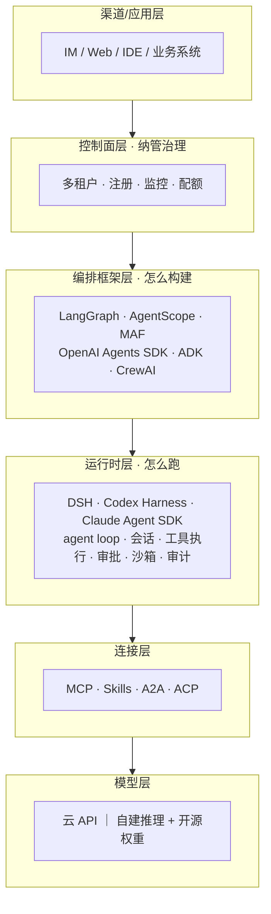

# Agent 开发框架对比

> 2026 年的 Agent 技术栈已经分层收敛：**编排框架**解决"agent 怎么构建/治理"，**运行时（Harness）**解决"agent 怎么跑"。这篇基于源码级审计的调研摘要（完整调研 2026-09-02，版本与协议事实 2026-09-04 复核），给出分层全景、核心框架对比与选型框架。

## 技术栈分层全景

**关键判断**：2026 年 8 月，"harness"成为独立赛道——DeepSeek Harness（8/13）与 Codex Harness 完整开源（8/19）相隔一周，运行时层正式商品化。成熟的中台组合是：**框架做编排 + harness 做运行时 + 自建 MCP 连接器**。

## 核心四框架速评

成熟度排序（2026-09 口径，版本状态核实于 2026-09-04）：LangGraph（1.0 发布于 2025-10，生产案例最多）≈ AgentScope 2.0（v2.0.7，企业级全栈）＞ Codex Harness（内核产品级，SDK 开源仅数周）＞ DSH（架构最激进，早期 prerelease 0.1.2-rc）。

| 框架 | 版本（2026-09-04） | 类别 | 语言 | 一句话定位 | 突出能力 | 主要缺口 |
| --- | --- | --- | --- | --- | --- | --- |
| **LangGraph + LangChain/Deep Agents** | LangGraph 1.2.11 / LangChain 1.4.0 | 编排框架 | Python | 图/状态机编排事实标准 | checkpoint/HITL/时间旅行；LangSmith 部署四形态 | 沙箱/审批 UI/审计需 Deep Agents 或自建 |
| **AgentScope（+Service 控制面）** | 2.0.7 | 框架+控制面 | Python+Java+TS | 企业级全栈，多租户一等公民 | 一键分布式 RAG、权限体系、飞书/钉钉渠道、异构 agent 注册 | 阿里云外生态相对年轻 |
| **Codex Harness** | rust 0.153.2 | 运行时 | Rust 内核 | 产品同款内核开源（Apache-2.0） | 内核最稳、沙箱完整、Compliance Platform | 为 OpenAI 模型深度调优，第三方模型有折扣 |
| **DeepSeek Harness（DSH）** | 0.1.2-rc.1 | 运行时 | TypeScript | "Everything is a Plugin" | 会话事件溯源最强（fork/回放/全文检索）、模型无关、全链路可审计 | 早期 prerelease；办公连接器/RAG/多租户全自建 |

*图：AgentScope 2.0 官方生态架构图（来源：[agentscope.io](https://agentscope.io/)，2026-09-04 下载本地化）。*

## 其他主流框架扫描

| 框架 | 类别 | 状态 | 一句话适用 |
| --- | --- | --- | --- |
| Microsoft Agent Framework（MAF） | 编排 | 1.0 GA（2026-04）；Python 1.17 / .NET 1.20，合并 AutoGen + Semantic Kernel | 微软/Azure 系中台首选编排层 |
| AutoGen | 编排 | **维护模式**，官方引导迁移至 MAF | 仅存量维护，新项目勿选 |
| OpenAI Agents SDK | 编排 | 0.22.0（2026-08），五原语轻量编排 | GPT 系轻量编排层，与 Codex Harness 分层互补 |
| Claude Agent SDK | 运行时 SDK | Python 0.2.152 / TS 0.3.260，0.x 高频迭代 | 深度定制编码/办公 agent（云推理） |
| Google ADK | 编排 | 2.8.0（2.0 发布于 2026-05，1.39 系并行维护），主推 A2A 协议 | GCP/Gemini 系 + 跨框架互操作 |
| CrewAI | 编排 | 1.15.18 | 快速上手角色化多 agent（Crews + Flows 双层） |
| Dify | 低代码平台 | 1.17.0，154k★ | 业务侧低代码/原型；注意修改版 Apache-2.0 的多租户条款 |
| Coze Studio | 低代码平台 | 开源 | 国内生态开箱即用 |
| Pydantic AI（首次收录） | 编排 | 2.38.0（2026-09），19.7k★ | Python 类型安全、模型无关的轻量编排，LangChain 系之外首选 |
| Mastra（首次收录） | 编排 | @mastra/core 1.63.0，TypeScript | JS/TS 全栈团队的 agent 框架 |

## 连接层动态：MCP 与 A2A（2026-09）

- **治理归一**：Anthropic 于 2025-12-09 将 MCP 捐赠给 Linux Foundation 下新设的 **Agentic AI Foundation（AAIF）**，与 Block 的 goose、OpenAI 的 AGENTS.md 同为创始项目（基金会由 Anthropic、Block、OpenAI 共同创立，Google、Microsoft、AWS 等支持）；A2A 同样归入 AAIF，Linux Foundation 2026-04-09 公告其参与组织超 150 家、进入企业生产使用。两条协议在同一个中立基金会下共治，"MCP 管工具/上下文、A2A 管 agent 互通"的分工被官方明确。
- **MCP spec**：现行版本 **2026-07-28**（沿革 2025-06-18 → 2025-11-25 → 2026-07-28）。2026-07-28 的关键变化是"无状态化"：移除协议级会话握手（initialize/Mcp-Session-Id），每次请求自带版本与能力声明，新增 server/discover 与统一通知流 subscriptions/listen——对自托管网关与多副本部署是利好，存量有状态 server 需要适配。
- **A2A spec**：首个稳定版 **v1.0.0（2026-03-12）**，v1.0.1（2026-05）补丁；官方 SDK 覆盖 Python/JS/Java/.NET/Go/Rust 六语言，Azure AI Foundry、AWS Bedrock AgentCore 等已 GA 支持。

## 关键维度对比（核心四框架）

| 维度 | DSH | Codex Harness | LangGraph 系 | AgentScope 系 |
| --- | --- | --- | --- | --- |
| 会话管理 | ★★★ 事件溯源+fork+回放 | ★★ rollout/compaction | ★★ checkpoint 多后端 | ★★ 多租户多会话 |
| 审批 / HITL | fail-closed 三态缝 | approval modes | interrupt()（UI 自建） | 权限系统内置 |
| 沙箱 | 部分仅文件效果 | 完整（Seatbelt/Landlock） | 无 核心库无 | Docker/E2B/K8s 多档 |
| MCP | 一等（tools） | server + client | 生态集成 | + mcp-hub |
| 多 agent | 多 provider + Teams(实验) | 有限 | supervisor/swarm | agent-team 编排 |
| RAG / 记忆 | 需第三方 | memories | store + 生态 | 一键分布式 RAG + Mem0/ReMe |
| 可观测 | OTel（可导 SIEM） | OTel + 合规平台 | LangSmith | OTel 默认 + Dashboard |
| 多租户 / 渠道 | 无 | 无 | 付费档 |  原生 + 官方渠道 |
| 自建模型接入 |  一等公民 | 部分experimental |  模型无关 |  vLLM 兼容 |

## 选型框架

1. **编排层选成熟的，运行时层允许激进**：编排层要一年以上生产验证（LangGraph/AgentScope）；DSH/Codex SDK 都太新，用可替换的缝去试点
2. **不要用编排框架从零复刻 harness 能力**——会话/审批/审计是 2026 年 8 月后开源运行时免费送的部分
3. **数据敏感场景**的组合思路：模型无关的运行时（可对接自建推理）+ 控制面私有化 + 自建内部系统 MCP 连接器
4. **License 三处注意**：Dify 修改版 Apache-2.0 的多租户 SaaS 条款；Codex 开源 harness 与闭源模型/云的边界；LangSmith 自托管的出站依赖审查
5. **快速变化风险**：相关项目均在剧烈演进（首个正式 tag 即删兼容层是常态）——锁版本 + 薄抽象层隔离

## 参考资料

<Refs>

- [LangGraph 文档](https://docs.langchain.com/)（访问日期 2026-09-04） · [LangGraph Releases](https://github.com/langchain-ai/langgraph/releases)（访问日期 2026-09-04） · [LangChain Releases](https://github.com/langchain-ai/langchain/releases)（访问日期 2026-09-04）
- [AgentScope 生态门户](https://agentscope.io/)（访问日期 2026-09-04，官方架构图来源） · [AgentScope Releases](https://github.com/agentscope-ai/agentscope/releases)（访问日期 2026-09-04）
- [OpenAI Codex 仓库](https://github.com/openai/codex)（访问日期 2026-09-04） · [DeepSeek Harness 仓库](https://github.com/deepseek-ai/deepseek-harness)（访问日期 2026-09-04）
- [Microsoft Agent Framework](https://learn.microsoft.com/en-us/agent-framework/)（访问日期 2026-09-04） · [Google ADK](https://adk.dev/)（访问日期 2026-09-04） · [ADK Releases](https://github.com/google/adk-python/releases)（访问日期 2026-09-04） · [CrewAI](https://docs.crewai.com/)（访问日期 2026-09-04）
- [OpenAI Agents SDK](https://openai.github.io/openai-agents-python/)（访问日期 2026-09-04） · [Claude Agent SDK 文档](https://code.claude.com/docs/en/agent-sdk/overview)（访问日期 2026-09-04）
- [MCP 规范 2026-07-28](https://modelcontextprotocol.io/specification/2026-07-28/)（访问日期 2026-09-04） · [MCP 加入 Agentic AI Foundation 公告](https://blog.modelcontextprotocol.io/posts/2025-12-09-mcp-joins-agentic-ai-foundation/)（访问日期 2026-09-04）
- [A2A 协议官网](https://a2a-protocol.org/)（访问日期 2026-09-04） · [Linux Foundation：A2A 一周年公告](https://www.linuxfoundation.org/press/a2a-protocol-surpasses-150-organizations-lands-in-major-cloud-platforms-and-sees-enterprise-production-use-in-first-year)（访问日期 2026-09-04）
- [Pydantic AI](https://github.com/pydantic/pydantic-ai)（访问日期 2026-09-04，首次收录） · [Mastra](https://github.com/mastra-ai/mastra)（访问日期 2026-09-04，首次收录）
- 图片来源：AgentScope 2.0 生态架构图，取自 [agentscope.io](https://agentscope.io/)（访问日期 2026-09-04），本地存于 `/images/ai/agent/frameworks/agentscope2-ecosystem.png`
- 站内相关：[Agent 热点编年史](/ai/agent/history) · [智能体技术全景](/ai/agent/)

</Refs>