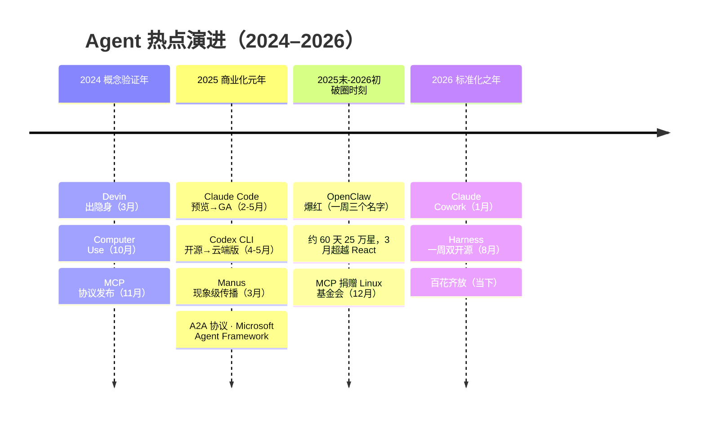

# Agent 热点编年史：从 OpenClaw 到百花齐放

> 2024 到 2026 年，Agent 完成了从"概念演示"到"独立技术品类"的三级跳。这篇编年史按亲历者视角记录关键节点：每一浪为什么起、留下了什么基础设施。部分增长数字存在口径差异，正文已注明来源与统计口径。

## 时间线总览

*图源：star-history.com 博客（[来源页](https://www.star-history.com/blog/openclaw-surpasses-react-most-starred-software)，访问日期 2026-09-03）*

## 第一阶段：概念验证（2024）

| 时间 | 事件 | 留下了什么 |
| --- | --- | --- |
| 2024-03 | **Devin** 发布，自称"首个 AI 软件工程师" | 掀起 AI 编程 agent 第一波热潮；后期实测争议也成为"能力宣传≠交付能力"的公开课 |
| 2024-10 | Anthropic 发布 **Computer Use**（公测） | 首个大厂"看屏幕动鼠标"API——GUI 成为 agent 的通用接口层 |
| 2024-11 | Anthropic 发布 **MCP 协议** | Agent 连接工具与数据的开放标准，后来成为整个生态的底座 |

**架构师观察**：这一年的关键词是"接口"——Computer Use 定义了"操作计算机"的接口，MCP 定义了"连接工具"的接口。接口先于应用成熟，是每一轮平台化的标准序曲。

## 第二阶段：编码 Agent 商业化元年（2025）

- **2025-02**：Claude Code 研究预览（随 Claude 3.7 Sonnet），终端 agentic 编程工具
- **2025-04**：**Codex CLI 开源**（OpenAI，Apache-2.0）；同月 Google 在 Cloud Next 发布 **A2A 协议与 ADK**
- **2025-05**：Claude Code 随 Claude 4 正式 GA；**Codex 云端 agent** 进入 ChatGPT（云端并行执行）
- **2025-06 → 2025-09**：Claude Code SDK 发布，9 月升级为 **Claude Agent SDK**——编程引擎被抽象为通用 agent 工具包
- **2025-10**：Anthropic 发布 **Agent Skills** 机制（按需加载的指令/脚本包）；Claude Code 网页版上线
- **2025-03**（插曲）：**Manus** 发布，"首个通用自主 agent"叙事 + 邀请码炒作，成为现象级营销案例
- **2025-10**：微软宣布 **Microsoft Agent Framework** 预览——AutoGen 与 Semantic Kernel 合并
- **2025-12**：**MCP 捐赠给 Linux 基金会旗下 Agentic AI Foundation**，完成中立化

**架构师观察**：这一年跑通了 Agent 的第一份商业账本——Claude Code 订阅制（$20–200/月档）+ API 双轨，2026 年上半年年化收入达到数十亿美元量级（公开报道口径）。同时协议层（MCP→A2A→Skills）开始标准化：**协议中立化是生态爆发的前置条件**。

## 第三阶段：OpenClaw 破圈时刻（2025-11 → 2026-03）

- **2025-11-24**：奥地利开发者 Peter Steinberger（PSPDFKit 创始人）发布项目（最初名为 **Warelay**，后更名 **Clawdbot**）——一个跑在自己设备上的个人 AI 助手，通过 WhatsApp/飞书等聊天渠道交互，支持定时任务与技能生态
- **2026-01-27**：因商标关切更名 **Moltbot**；**2026-01-30** 再更名 **OpenClaw**——"一周三个名字"（Clawdbot → Moltbot → OpenClaw）的戏剧性反而助推传播
- **爆红峰值**：**2026-01-24** 前仓库仅约 1,000 星，此后垂直拉升；单日最高 +25,310 星（**2026-01-26**），创当时 GitHub 软件仓库的单日 star 纪录；爆红后约 60 天累计约 25 万星（这是 NVIDIA 等广泛引用的口径，从 1 月初爆红起算；若从 **2025-11-24** 首发起算约 4 个月）；**2026 年 3 月初**超越 React（约 24.3 万星）成为 GitHub 上 star 最多的**非聚合类**软件项目——star-history 于 **2026-03-01** 确认，部分媒体记为 **2026-03-03**（时值 250,829 星）。"史上最快破 5 万星"一说无权威来源可核实，当时被广泛引用的是前述单日纪录与"史上增长最快仓库"（首发 84 天破 20 万星），这两类纪录后来均被 DeepSeek Harness（约 2 天 10 万星）打破

*图源：star-history.com 博客配图，openclaw/openclaw、torvalds/linux、facebook/react star 趋势（[来源页](https://www.star-history.com/blog/openclaw-surpasses-react-most-starred-software)，访问日期 2026-09-03）*

- **2026-02-14**：Steinberger 宣布加入 OpenAI，项目转入新成立的非营利组织 OpenClaw Foundation 运营；截至 **2026-09-03** 仓库约 38.9 万星（GitHub 实时 388,722），ClawHub 技能生态达数万规模（2026 年上半年第三方统计约 1.4 万，成文时未获权威口径）
- **企业侧反应**：飞书等 IM 平台推出官方集成插件；同时安全争议集中爆发——个人设备 + 高权限 + 聊天渠道的架构被广泛质疑企业风险

**为什么是它**：此前的 Agent 都活在开发者的终端里，OpenClaw 把 Agent 放进了**每个人已有的聊天窗口**——渠道原生 + 本地部署 + 单人项目的传奇叙事，三者共振。它证明的不是某个架构的胜利，而是"Agent 的用户可以是所有人"。

## 第四阶段：Harness 成为独立赛道（2026-08）

- **2026-08-13**：**DeepSeek Harness（DSH）**开源——"Everything is a Plugin"架构，MIT 许可，同期 V4-Pro API 提价，形成"编排开源 + 推理付费"的双边策略
- **2026-08-19/20**：OpenAI 发布 **"Codex as a platform"**，完整开源 Codex Harness（Rust 内核，Apache-2.0）——产品同款执行引擎作为平台开放
- **一周内两大头部相继开源运行时**，标志着 harness 从产品内部件升格为独立竞争层

### "主动开源"还是"被倒逼"？

这是当时社区争论的焦点，两边都有证据：

- **被动论**：开源社区出现了用同款基础模型跑分超过 Codex 的第三方 harness，竞争压力真实存在；且实际开源范围与媒体宣传的落差引发源码级质疑
- **主动论**：OpenAI 在开源前一个月已发文铺垫 "Harness engineering" 方法论，平台化是既定战略；开源当日即推出企业合规配套
- **架构师视角的判断**：动机之争不重要，重要的是结果——**执行引擎的商品化让"模型可替换、运行时可选型"成为企业架构的现实选项**。详见 [Agent 开发框架对比](/ai/agent/frameworks)

## 当下：百花齐放（2026-09）

- **运行时层**：Claude Code/Codex 双巨头 + DSH 等开源挑战者 + 各厂自研
- **编排框架层**：LangGraph、AgentScope、MAF、ADK、CrewAI 分层竞争
- **应用形态**：从编码扩展到通用知识工作（Claude Cowork 类）、办公自动化、个人助理（OpenClaw 谱系）
- **协议层**：MCP（工具）+ Skills（能力包）+ A2A（互操作）三件套事实标准化

## 三条穿越周期的规律

1. **接口先行**：每轮爆发前 12 个月，都有一个"接口事件"（MCP、Computer Use、Skills）——先看接口再看应用
2. **开源是生态位的武器**：从 Codex CLI 到 DSH，开源时机都精确对应着防守或进攻的战略节点
3. **商品化顺序**：模型 → 编排框架 → 运行时，层层商品化；每一层商品化后，价值就向上一层迁移——现在价值在"应用与数据"，这与云计算 IaaS→PaaS→SaaS 的价值迁移完全同构

## 参考资料

<Refs>

- [OpenClaw 维基百科条目](https://en.wikipedia.org/wiki/OpenClaw) · [Fast Company：Steinberger 专访](https://www.fastcompany.com/91550800/how-peter-steinberger-built-openclaw)
- [star-history：OpenClaw Surpasses React to Become the Most-Starred Software Project on GitHub](https://www.star-history.com/blog/openclaw-surpasses-react-most-starred-software)（访问日期 2026-09-03） · [The New Stack：OpenClaw rocks to GitHub's most-starred status, but is it safe?](https://thenewstack.io/openclaw-github-stars-security/)（访问日期 2026-09-03）
- [openclaw.report：200,000 Stars on GitHub（84 天增长时间线）](https://openclaw.report/news/openclaw-200k-github-stars)（访问日期 2026-09-03） · [GitHub：openclaw/openclaw](https://github.com/openclaw/openclaw)（访问日期 2026-09-03）
- [NVIDIA（X）：OpenClaw hit 250K GitHub stars in 60 days](https://x.com/nvidia/status/2049971830513910054)（访问日期 2026-09-03）
- [Anthropic：MCP 发布公告](https://www.anthropic.com/news/model-context-protocol) · [MCP 加入 Agentic AI Foundation](https://www.anthropic.com/news/donating-the-model-context-protocol-and-establishing-of-the-agentic-ai-foundation)
- [OpenAI：Codex as a platform](https://developers.openai.com/blog/codex-as-a-platform) · [Codex 仓库](https://github.com/openai/codex)
- [Anthropic：Agent Skills](https://www.anthropic.com/engineering/equipping-agents-for-the-real-world-with-agent-skills) · [InfoQ：Claude Cowork](https://www.infoq.com/news/2026/01/claude-cowork/)
- [DeepSeek Harness](https://www.deepseek.com/harness/en/) · [InfoQ：DSH 发布报道](https://www.infoq.com/news/2026/08/deep-seek-harness/)
- [Microsoft Agent Framework 公告](https://azure.microsoft.com/en-us/blog/introducing-microsoft-agent-framework/)
- 站内相关：[Agent 开发框架对比](/ai/agent/frameworks) · [智能体技术全景](/ai/agent/)
- 图片来源：[star-history 博客配图（2 张）](https://www.star-history.com/blog/openclaw-surpasses-react-most-starred-software)，本地存于 `/images/ai/agent/history/`（访问日期 2026-09-03）

</Refs>