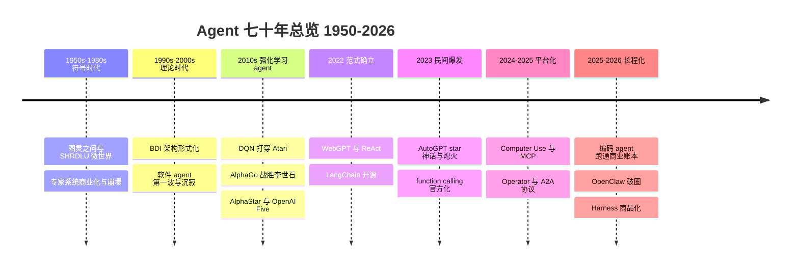
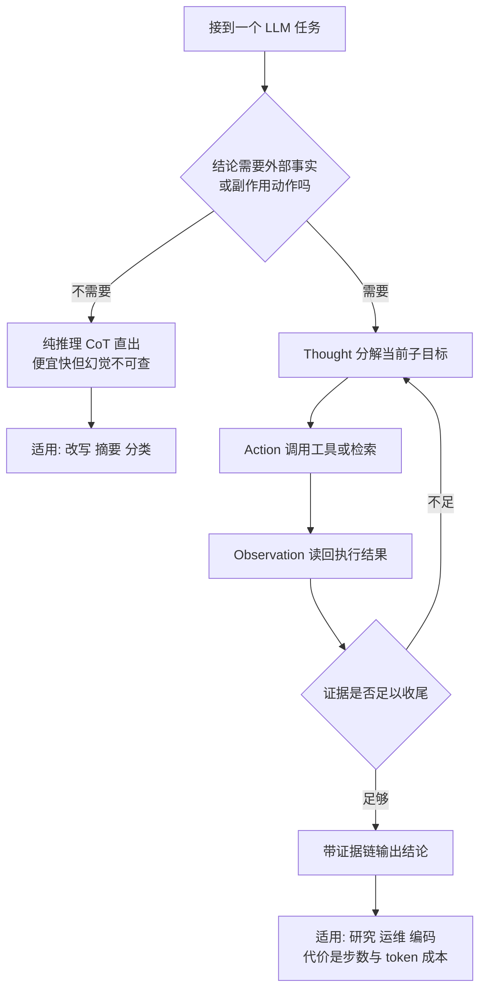
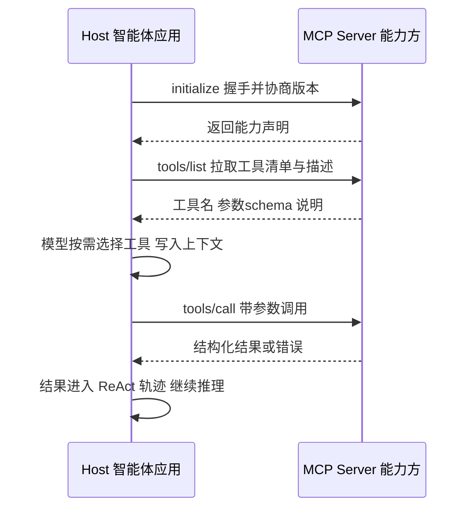
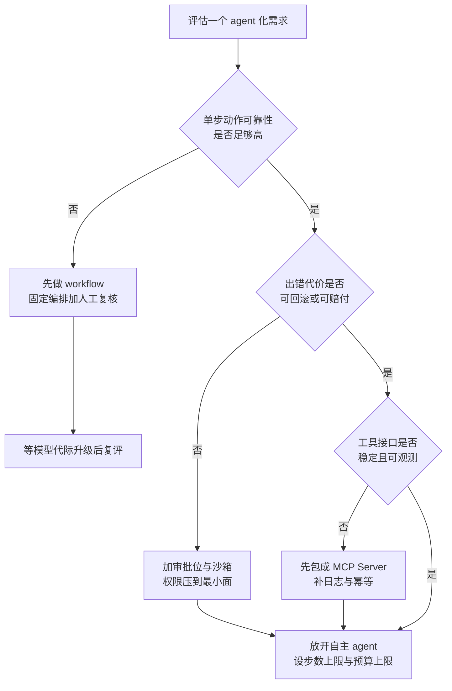

# Agent 编年史：从符号智能体到 OpenClaw 的七十年

> 面向想搞清楚 Agent 技术来路、并判断当前这波浪潮位置的工程师与方案架构师。这篇编年史覆盖七十年：智能体（agent，能感知环境、自主决策并通过行动改变环境的软件系统）这条线索上，每个阶段**发生了什么、为什么偏偏是这个时候、留下了什么遗产**。全文只有一条主线：**模型能力、成本、可靠性这个三角，决定了 agent 的每一次起落**；而每一轮应用爆发之前约 12 个月，都有一个"接口事件"先行。读完你会看懂三次 agent 寒冬的共性结构、明白编码为什么成为 agent 第一个跑通商业账本的落地场景，并拿到一条判断"现在该押注什么"的时间轴标尺。部分增长数字存在口径差异，正文已注明来源与统计口径；时间边界截至 2026-09。

## 怎样读这篇编年史

先给分期。我把七十年切成六个阶段，每阶段用同一组三问展开（发生了什么 / 为什么是这时 / 留下了什么），末尾再统一做"期望落差"与规律分析：

| 阶段 | 时期 | 代表事件 | 核心命题 | 留下的遗产 |
| --- | --- | --- | --- | --- |
| 史前史 | 1950s–2021 | SHRDLU、专家系统、BDI、AlphaGo、Siri | 没有大模型时，"自主性"从哪来 | 任务分解思维、强化学习训练范式、助手产品形态 |
| 酝酿期 | 2021-12 – 2022 | WebGPT、ReAct、LangChain | "推理 + 行动"能否成为统一范式 | ReAct 循环骨架、开源编排层 |
| 爆发期 | 2023 | AutoGPT、BabyAGI、function calling | 民间狂热能否变成产品 | 任务分解/记忆/工具三件套；function calling 官方化 |
| 平台期 | 2024 – 2025 中 | Computer Use、MCP、Operator、A2A、Devin | 接口与协议能否标准化 | GUI 通用接口层、MCP/A2A 协议、agent 基准 |
| 长程期 | 2025 下 – 2026 | 编码 agent 商业化、deep research、OpenClaw、Harness 开源 | 长程任务能否进生产线 | 运行时/技能/上下文工程、harness 独立赛道 |
| 当下 | 2026-09 | 四层格局百花齐放 | 价值向哪一层迁移 | 仍在生成中 |



一个读法提醒：编年史最容易写成流水账。我刻意在每阶段末尾放一句"遗产"判断——因为对做架构的人而言，**事件本身不重要，事件沉淀下来的接口、协议与失败教训才重要**。不同角色可以各取所需：做技术选型的先读"落差与节律"和"实践与选型"两章；做协议与集成的重点看平台期的接口事件表与 MCP 时序图；给管理层写汇报的直接引用三次寒冬表与 Gartner 口径；只想快速补齐 2024–2026 的读者可以直奔平台期与长程期——原"热点编年史"的材料在这两章全量保留。

### 口径与边界

- 日期一律以官方公告、arXiv 提交日期或权威媒体同期报道为准；存在分歧处（如 OpenClaw 超越 React 的确认日期有 03-01 与 03-03 两种记载）并列两说，不择一掩盖
- star 数、收入等增长数字均注明来源与统计口径；无法核实的流传数字（如"史上最快破 5 万星"）明确标注为无权威来源
- 带经验边界的判断（"我遇到的情况是""我的判断是"）是从业者视角的个人观察，标了边界就不冒充普遍结论
- 时间边界 2026-09；此后事件不在本文射程内，基准与 star 数等时效数字以文中标注的访问日期为准

## 史前史：没有 LLM 的六十年（1950s–2021）

### 发生了什么

**符号主义 agent（1950s–1980s）**。1950 年图灵在《Computing Machinery and Intelligence》里提出"机器能否思考"之问，顺便也定义了 agent 的终极考题。1970 年前后，Winograd 在 MIT 做的 SHRDLU 是第一个"像样"的智能体：在积木微世界里听懂自然语言指令、规划动作、回答追问——"语言即控制接口"这个七十年后被 computer use 重新发明一次的观念，源头就在这里。1970–80 年代专家系统（医疗诊断的 MYCIN、DEC 配置规则的 XCON/R1 类）把"知识 + 推理机"做成第一批商业产品，然后在 1980 年代末因知识获取瓶颈与维护成本集体崩塌，连带第一波 AI 寒冬。

这次崩塌的结构值得拆开看，因为它在四十年后完整重演过一次：知识获取成本随领域宽度线性增长（每条规则都要从专家嘴里手工挖出来）、维护成本随规则数量超线性增长（新规则与旧规则互相冲突）、系统没有学习能力（错误不会变成改进）。把这三条对应到 2023 年 AutoGPT 式系统的三大坑——提示词工程人力、提示冲突与上下文膨胀、缺乏自我修正闭环——会发现寒冬换的只是技术形态，成本结构从来没变。

**BDI 与软件 agent 理论（1987–2000s）**。哲学家 Bratman 1987 年的意图理论被 Rao 与 Georgeff 在 1990 年代初形式化为 BDI（Belief-Desire-Intention，信念-愿望-意图）agent 架构：用"信念"表示对世界的认知、"愿望"表示目标、"意图"表示已承诺执行的计划，让 agent 的决策过程第一次有了可工程化的理论骨架。1990 年代中后期"软件 agent"成为热词（接口 agent、移动 agent、多 agent 系统），但当时没有能理解开放世界的模型，这波热度在 2000 年代初归于沉寂——这是 agent 的第二次寒冬。

BDI 的机制值得多说一句，因为它被低估了：信念是 agent 的世界模型（允许带不确定性），愿望是目标集合（允许互相冲突），意图则是 agent**已经承诺执行、并配有计划**的目标子集。关键工程贡献在于把"想要"和"承诺去做"分开——意图具有持续性，环境变化时触发的是重规划而不是推倒重来，agent 不必每一步从零决策。今天 agent 系统里"目标—任务队列—当前计划"的三段结构，骨子里还是 BDI。

**强化学习 agent（2013–2019）**。深度强化学习把"agent"从哲学概念拉回实验科学：DQN 在 Atari 上超越人类（2013 年预印本、2015 年 Nature）；2016 年 3 月 AlphaGo 对李世石 4:1，第四局李世石的"白 78 挖"是人类留给这条时间线的最后一次反击；AlphaGo Zero（2017，Nature）证明可以完全自我对弈从零学起；AlphaStar 2019 年 1 月演示赛 10:1 职业选手、同年 10 月登上 Nature 达到星际 II 宗师段位；OpenAI Five 2019 年 4 月击败 Dota 2 世界冠军 OG，同年 8 月开放公众对战。

| 里程碑 | 时间 | 环境特征 | 里程碑意义 |
| --- | --- | --- | --- |
| DQN Atari | 2013 预印本 / 2015 Nature | 单 agent、全可观测、离散动作 | 首个"像素进、动作出"的端到端 agent，证明深度网络 + 强化学习可行 |
| AlphaGo | 2016-03，4:1 李世石 | 双人轮流、完全信息 | 策略网络 + 价值网络 + 蒙特卡洛树搜索；人类在"智力标杆"游戏上首次失守 |
| AlphaGo Zero | 2017-10，Nature | 同上但不喂人类棋谱 | 纯自我对弈超越人类起点；"自博弈 + 奖励优化"成为后来推理模型训练的模板 |
| AlphaStar | 2019-01 演示 / 2019-10 Nature | 实时、不完美信息、动作空间巨大 | 多智能体联赛训练应对策略循环克制，证明 agent 能吃下不完美信息 |
| OpenAI Five | 2019-04 胜 OG / 2019-08 公众对战 | 5v5 协作、单局数万步决策 | 规模定律在 agent 域的首次验证：算力换协作涌现，无需显式通信协议 |

这五块里程碑的共同遗产是**训练范式**而非产品：自对弈、奖励建模、规模换能力，这三件事在 2022 年后以 RLHF/RLVR 的名字回到 LLM 主线，成为推理模型与 agent 微调的地基。但同样要记住它们的共同边界：环境是封闭的、奖励是可定义的。一旦离开游戏进入开放世界，这套方法在当年没有用武之地——这正是"为什么游戏 agent 没有直接变成通用 agent"的答案。


*图源：Wikimedia Commons 棋谱图（[来源页](https://commons.wikimedia.org/wiki/File:Lee_Sedol_(B)_vs_AlphaGo_(W)_-_Game_4.jpg)，访问日期 2026-09-05）*

**个人助手的第一次尝试（2011–2020s）**。Siri 2011 年 10 月随 iPhone 4S 发布，Google Now、Alexa 相继跟进。它们把"语音 + 意图槽位（intent-slot，把用户话语分类到预定义意图并抽取参数）+ 技能市场"做成了亿级用户的产品，但十多年过去，能力边界仍停在"定闹钟、查天气、放音乐"。

### 为什么是这时

符号主义是当年唯一可用的范式：知识工程在窄域确实可行，XCON 类系统在其适用边界内创造了真实价值，问题出在把窄域成功外推到开放世界。强化学习 agent 则必须等两件事成熟：深度网络的表征能力与 GPU 算力规模——二者都在 2010 年代才到位。而游戏环境是刻意选择的试验田：规则封闭、奖励明确、可无限并行自对弈，正好绕开开放世界的所有难题。

### 留下了什么

| 史前遗产 | 在 LLM agent 时代的对应物 |
| --- | --- |
| SHRDLU 的"语言即指令" | 自然语言成为 agent 的统一控制接口（prompt / computer use） |
| 专家系统的规则与知识库 | 领域知识包、Agent Skills 类的按需加载指令 |
| BDI 的信念-愿望-意图 | 目标分解、任务队列、计划-执行-反思循环的概念源头 |
| 强化学习自对弈与奖励优化 | RLHF/RLVR，2024 年后推理模型与 agent 训练的主范式 |
| Siri 的意图槽位与技能市场 | 助手产品形态与"技能生态"的初代样本（及其天花板） |

**Siri 时代为什么做不成通用 agent**，我的判断是三个"没有"：没有开放推理能力（意图分类覆盖不了没见过的说法）、没有统一行动空间（每个技能都要单独对接）、没有错误经济学（助手答错的代价由用户耐心支付，用户耐心是有限的）。这三条直到 LLM + function calling + 协议标准化才分别被解决——这条对照表是理解后文所有爆发的钥匙。

把意图槽位范式与 LLM agent 范式并排看，差异是结构性的：

| 维度 | 意图槽位范式（Siri 类） | LLM agent 范式（2022 后） |
| --- | --- | --- |
| 理解方式 | 话语分类到预定义意图 + 抽参数 | 开放语义理解，无需预定义意图表 |
| 行动空间 | 每个技能单独对接，N 个技能 N 套集成 | 统一接口（function calling / MCP / GUI） |
| 多步任务 | 基本不支持，一轮一问一答 | 原生支持循环与计划 |
| 失败模式 | "我没听懂"（显性、可预期） | "我听懂了但做错了"（隐性、需验证器） |
| 扩展成本 | 线性加技能 | 边际递减（工具描述即接入） |

最后一行是范式更替的经济性根源：意图槽位的能力增长靠人力堆技能，LLM agent 的能力增长靠模型代际与工具描述——前者是加法，后者是乘法。但也要公平地说，Siri 范式留下的"显性失败"在安全性上反而优于早期 agent 的"隐性失败"，2025 年后企业 agent 设计里强制的确认节点，某种意义上是在把显性失败请回来。

## 酝酿期：确立"推理 + 行动"范式（2021-12 – 2022）

### 发生了什么

- **2021-12**：OpenAI 发布 **WebGPT**（arXiv:2112.09332）——让 GPT-3 操作一个文本浏览器检索、引用、作答，再用人类反馈做强化学习。它是后来所有浏览器 agent 的图纸，只是当时模型太弱、声量太小。机制上它已经集齐了后世浏览器 agent 的全部要素：受限的动作集合（搜索、点击链接、引用）、可观察的环境状态（网页文本）、以及用人类偏好训练"何时停、引用谁"的策略层。2025 年的 Operator 与 deep research，本质是同一张图纸换上了强得多的模型。
- **2022-01**：Chain-of-Thought（思维链，arXiv:2201.11903）证明"把中间推理写出来"能显著提升大模型多步任务表现——"推理"第一次成为可诱导的涌现能力。
- **2022-10-06**：普林斯顿与 Google 的 **ReAct**（arXiv:2210.03629，ICLR 2023）提出 Thought–Action–Observation 交替循环：先想一步、再动一步、读回结果、继续想。推理与行动从两条研究线合并成一个范式。


*图源：Google Research 官方博客 ReAct 文章配图（[来源页](https://research.google/blog/react-synergizing-reasoning-and-acting-in-language-models/)，访问日期 2026-09-05）*


*图源：Google Research 官方博客 ReAct 文章实验图（[来源页](https://research.google/blog/react-synergizing-reasoning-and-acting-in-language-models/)，访问日期 2026-09-05）*

ReAct 论文里最被我看重的一组结论不是分数，而是定性差异：纯 CoT 会"自信地编造"（幻觉无法自查），纯 Act 会"盲目试错"（缺乏规划），ReAct 用外部观察给推理装上**可验证的刹车**。这个设计原则——让 agent 的每一步都能被外部事实校正——是今天所有可靠 agent 系统的底色。

把 ReAct 循环写成伪代码，只有七行，但它定义了此后所有 agent 运行时（harness）的主循环：

```text
ReAct 主循环（论文形式）
for step in 1..T:
    Thought_t     = LLM(任务 + 已有轨迹)        # 现在该做什么、为什么
    Action_t      = parse(Thought_t)            # search[..] / lookup[..] / finish[..]
    if Action_t == finish: break                # 唯一的停机条件
    Observation_t = Env.execute(Action_t)       # 外部世界回话：检索结果、工具返回
    轨迹 += Thought_t + Action_t + Observation_t  # 写回上下文，供下一步参考
```

两个决定生死的细节都在注释里：**停机条件**（没有 finish 就会无限循环，AutoGPT 半年后正好死在这里）与**轨迹写回**（上下文随步数线性膨胀，2025 年的上下文工程要解决的正是它的后遗症）。一篇 2022 年的论文，提前写好了后三年所有 agent 故障模式的说明书。

- **2022-10-24**：Harrison Chase 开源 **LangChain**，最初约八百行 Python，成为 LLM 应用的第一块开源编排底板。它的历史位置要放在协议史里看：在 function calling 与 MCP 都不存在的年代，LangChain 用"链 + 工具 + 记忆"的抽象替全行业试错了 agent 编排的接口形状——后来平台原生能力到位后它的部分抽象被抛弃，但"工具描述、记忆存储、trace 可观测"这三件资产留了下来，2025-10 其公司 LangChain 以 12.5 亿美元估值完成 B 轮（公开报道口径），靠的正是 LangGraph/LangSmith 这层工程化沉淀。

### 为什么是这时

三块拼图在 2022 年凑齐：指令微调（InstructGPT 类）让模型"听得懂任务"，思维链让模型"会拆步骤"，开源社区（LangChain）让工程侧"有脚手架"。缺的只剩一个稳定的行动接口——这个缺口正好由 2023 年的 function calling 补上。范式的确立从来不是单点突破，而是拼图到位的顺序问题。

### 留下了什么

ReAct 循环成为此后一切 agent 的默认骨架：你今天在 Claude Code、Codex、Deep Research 里看到的"思考-调用工具-观察-继续"，结构上与 2022 年这篇论文同构。下面的决策图是我在评审 agent 方案时实际用的判断入口：



## 爆发期：民间狂欢与平台收编（2023）

### 发生了什么

- **2023-03-23**：OpenAI 上线 **ChatGPT plugins**，被社区称为"App Store 时刻"；一年后（2024-03/04）被 GPTs 取代而下线——插件生态的短命本身就是一条重要史料。

plugins 的兴亡值得单列，因为它是"平台收编民间需求"的第一次预演：民间用 LangChain 手写工具调用，平台就用 plugins 收编；plugins 的 OpenAPI 描述格式太工程化、开发者生态没养起来，平台又用 GPTs 和后来的 function calling 重写了一遍。同一件事在 2024-11 由 MCP 以开放协议的方式做成——**封闭平台接口做不成生态位，开放协议才可以**，这条教训直接决定了 MCP 与 A2A 的治理设计（捐赠基金会、多方共治）。
- **2023-03-16**：Toran Bruce Richards 提交 **AutoGPT** 首个 commit：给 GPT 一个目标，让它自己拆解任务、循环执行、自我批评。13 天 3 万星，约五周破 10 万星、超过当时的 PyTorch，被 Logan Kilpatrick 等称为"GitHub 史上增长最快仓库"；如今（2026-09）约 18.7 万星，但产品形态早已不是当年那个循环脚本。

AutoGPT 的核心循环只有三个自我提示，把它的结构写出来，失败原因就一目了然：

```text
AutoGPT 式循环（2023 春）
loop:
    1 Generate    : 给 LLM 目标 + 已完成结果，让它列出下一批任务
    2 Prioritize  : 让 LLM 按对目标的贡献重排任务队列
    3 Execute     : 取队首任务，LLM 调用 web / 文件 / 内存插件执行，结果写回记忆
    终止条件      : 用户手动中断，或预算烧完——没有第三种
```

对照上一节的 ReAct 伪代码：AutoGPT 有 Generate/Prioritize/Execute，却**没有 Observation 的强制校验位，也没有 finish 停机位**。它把"自我批评"当成验证，而 GPT-3.5 的自我批评与它的错误同源——裁判和选手是同一个模型。这是 2023 年最贵的一堂架构课。
- **2023-03-30 / 04-03 / 04-07**：三周内三个标志性开源/论文——**HuggingGPT**（arXiv:2303.17580，LLM 当控制器编排 Hugging Face 模型群）、**BabyAGI**（中岛洋平，105 行代码的任务队列自主体）、**Generative Agents**（arXiv:2304.03442，Smallville 小镇 25 个 agent 的记忆流-反思-规划架构，UIST 2023）。
- **2023-06-13**：OpenAI 发布 **function calling**（gpt-4-0613 / gpt-3.5-turbo-0613）：模型按 JSON Schema 可靠地输出结构化调用参数。工具调用从"民间提示词黑客方案"变成**平台能力**——这是 2023 年最重要的单一事件，重要性超过任何明星项目。


*图源：star-history.com 生成的 significant-gravitas/AutoGPT star 趋势图（[star-history](https://www.star-history.com/significant-gravitas/autogpt)，访问日期 2026-09-05）*


*图源：HuggingGPT 论文图 2（[arXiv:2303.17580](https://arxiv.org/abs/2303.17580)，访问日期 2026-09-05）*

### AutoGPT 为什么必然失败

我当年和团队实测过 AutoGPT 类项目，失败模式高度收敛，四条根因：

1. **循环没有停机条件**：目标模糊时任务队列自我繁殖，跑一夜烧掉几百美元 token 却原地打转；
2. **成本无预算约束**：没有 per-run 预算与步数上限，成本与任务难度解耦；
3. **可靠性复利衰减**：GPT-3.5 单步可靠率若按 80% 估，20 步串联后整体成功率只剩约 1%（0.8 的 20 次方量级）——长链 agent 对单步可靠率是指数敏感的；
4. **无权限与检查点设计**：没有沙箱、没有人工审批位、没有可回滚状态，企业不敢碰。

star 数与成功率在 2023 年是彻底背离的两个指标。这不是某个项目的失败，而是**模型能力尚未越过长链可靠性的门槛**——这个门槛要到 2024 年底的推理模型与 2025 年的长程模型才真正跨过。

### 留下了什么

任务分解、记忆、工具编排"三件套"成为 agent 工程的标准词汇表；AutoGPT 的失败清单成为后来者的设计守则（停机条件、预算上限、沙箱、审批位，今天都写进了各家 harness 的默认配置）。更重要的是 function calling：它把"模型输出结构化调用意图、宿主程序负责执行"的分工固定下来，此后所有协议（MCP/A2A）都建立在这个分工之上。

## 平台期：接口化、协议化、基准化（2024 – 2025 中）

### 发生了什么

**基准先行（2023-10 – 2024）**。SWE-bench（arXiv:2310.06770，ICLR 2024）用 12 个真实 Python 仓库的 2294 个 issue 当考题，GPT-4 初测仅解出约 1.96%——agent 领域第一次有了不会自我感动的考卷。**Devin** 2024-03-12 发布，自称"首个 AI 软件工程师"，报出 SWE-bench 无辅助 13.86%；随后实测争议成为"能力宣传 ≠ 交付能力"的公开课。**SWE-agent**（arXiv:2405.15793，NeurIPS 2024）提出 ACI（Agent-Computer Interface，智能体-计算机接口）概念：为 agent 重新设计文件浏览/检索/编辑命令，比裸 shell 显著提升成功率——"接口设计决定 agent 上限"由此有了实验证据。

**Computer Use 与 GUI 接口层（2024-10-22）**。Anthropic 发布 computer use 公测：Claude 3.5 Sonnet（升级版）可以"看屏幕、动光标、点按钮、敲键盘"，GUI 第一次成为 agent 的通用接口层。官方同时给出的基准表里，新模型 SWE-bench Verified 49.0%、TAU-bench 零售 69.2%——"agentic 基准"开始与知识基准并列出现在发布材料里。


*图源：Simon Willison 博客对 Anthropic computer use 官方参考实现的实测截图（[来源页](https://simonwillison.net/2024/Oct/22/computer-use/)，访问日期 2026-09-05）*


*图源：Anthropic 官方博客《Introducing computer use, a new Claude 3.5 Sonnet, and Claude 3.5 Haiku》配图（[来源页](https://www.anthropic.com/news/3-5-models-and-computer-use)，访问日期 2026-09-05）*

**MCP 与协议中立化（2024-11 – 2025-12）**。2024-11-25 Anthropic 开源 **MCP（Model Context Protocol）**：用统一的 host-client-server 结构把 agent 连到工具与数据源，被类比为"AI 的 USB-C"。2025-03 OpenAI 采纳 MCP（进入 ChatGPT 桌面端、API 与 SDK），2025-04 Google DeepMind 表态支持；2025-12 MCP 捐赠给 Linux 基金会旗下 Agentic AI Foundation 完成中立化。**协议中立化是生态爆发的前置条件**——这条规律在 Kubernetes 与容器生态上验证过一次，在 MCP 上又验证了一次。

MCP 的机制一句话讲清：三个角色——host（agent 应用，如 IDE 或客户端）、client（host 内的连接会话）、server（能力提供方）；server 对外暴露三类原语——**tools**（可调用的函数）、**resources**（可读的数据）、**prompts**（预置模板）；传输层本地走 stdio、远程走 HTTP。它的工程含义是把 M 个 agent × N 个工具的集成问题变成 M + N：每边只实现一次协议。我遇到的情况是：2025 年企业落地 agent 时，MCP 解决的是"连得上"，随之而来的治理问题（谁能暴露什么 tool、调用如何审计）催生了 MCP 网关这个新品类——协议标准化永远只是把问题往上推一层，而不是消灭问题。

一次典型的 MCP 工具调用时序如下，注意"发现"与"调用"是分离的两步——agent 先列清单再按需取用，这正是上下文预算思想的协议化：




*图源：Anthropic 官方博客《Introducing the Model Context Protocol》题图（[来源页](https://www.anthropic.com/news/model-context-protocol)，访问日期 2026-09-05）*

**浏览器 agent 与 deep research（2025 上半年）**。2025-01-23 OpenAI 发布 **Operator**（研究预览，CUA 模型驱动浏览器）；2025-02-02 发布 **deep research**（o3 系模型微调的联网多步研究 agent）；2025-07-17 二者合并为 **ChatGPT Agent**。2025-03-06 **Manus** 以"首个通用自主 agent"叙事加邀请码稀缺营销成为现象级传播案例（邀请码一度被黄牛炒作），是 agent 史上第一堂"叙事与交付落差"的大众课。

deep research 的形态值得单独记一笔，因为它定义了"长程只读 agent"这个最先把可靠性做对的品类：把任务交给一个微调过的推理模型，在数十分钟里浏览、检索、交叉验证上百个来源，产出一份带引用的报告。它做对的关键取舍是**动作空间只读化**——不写文件、不下单、不改系统，把"出错代价"压到接近零，于是长链可靠性问题被产品形态绕开了。这条"用权限边界换自主长度"的思路，是 2025 年 agent 产品设计的核心智慧之一。而 A2A 的核心对象是 **Agent Card**（agent 的能力自描述，类似服务的 OpenAPI 文档）加任务/产物消息模型：MCP 解决"agent 连工具"，A2A 解决"agent 连 agent"，两者在 2025 年内先后进入 Linux 基金会治理，协议层的中立基础设施至此成型。

**协议层补齐与编码 agent 商业化（2025 全年）**。2025-04-09 Google 在 Cloud Next 发布 **A2A（Agent2Agent）协议**（50+ 合作伙伴），2025-06-23 捐赠 Linux 基金会；MCP 管"agent 连工具"，A2A 管"agent 连 agent"。编码侧：2025-02-24 **Claude Code** 研究预览（随 Claude 3.7 Sonnet）、2025-05 随 Claude 4 正式 GA；2025-04 **Codex CLI 开源**（Apache-2.0）、2025-05 云端 Codex 进入 ChatGPT；2025-06 Claude Code SDK 发布、2025-09-29 随 Claude Sonnet 4.5 更名 **Claude Agent SDK**——编程引擎被抽象为通用 agent 工具包；2025-10 Anthropic 发布 **Agent Skills**（按需加载的指令/脚本包）与 Claude Code 网页版；2025-10 微软宣布 **Microsoft Agent Framework** 预览（AutoGen 与 Semantic Kernel 合并）。

### 为什么是这时

2024 年的关键词是"接口"：Computer Use 定义了"操作计算机"的接口，MCP 定义了"连接工具"的接口，ACI/Skills 定义了"agent 与代码库/能力包"的接口。**接口先于应用成熟，是每一轮平台化的标准序曲**。而接口事件之所以在 2024–2025 密集出现，是因为模型单步可靠性第一次跨过了"长链可用"的门槛（推理模型 + agentic 微调），厂商敢把"连续几十步自主操作"写进产品承诺了。

### 留下了什么

| 接口事件 | 时间 | 定义的接口 | 后续生态 |
| --- | --- | --- | --- |
| function calling | 2023-06 | 模型 → 结构化调用意图 | 一切工具调用的分工基础 |
| Computer Use | 2024-10 | agent → GUI | 浏览器/桌面 agent 品类 |
| MCP | 2024-11 | agent → 工具与数据 | 数千个 MCP server、基金会治理 |
| ACI / SWE-agent | 2024-05 | agent → 代码库 | 编码 agent 的界面设计学派 |
| A2A | 2025-04 | agent → agent | 跨厂商互操作 |
| Agent Skills | 2025-10 | agent → 能力包 | 技能生态与按需加载 |

## 长程期：从演示到生产线（2025 下 – 2026）

### 编码 agent 成为最成功的落地场景

到 2026 年回看，agent 第一个跑通商业账本的是编码：Claude Code 订阅制（20–200 美元/月档）+ API 双轨，2026 年上半年年化收入达数十亿美元量级（公开报道口径）。为什么是编码？我的归纳是四条，全部与"可靠性三角"有关：

1. **产物可验证**：测试、编译、lint 提供了免费的裁判，agent 的每一步都有外部事实校正——这正是 ReAct 当年论证的性质；
2. **错误可回滚**：git 天然是检查点系统，烧坏了可以 reset；
3. **用户容忍度高且付费意愿强**：开发者习惯 Review 半成品，且时间成本高；
4. **工具接口成熟**：终端、文件系统、LSP 全是文本接口，ACI 设计空间干净。

对照之下，客服、法务、财务等场景缺的正是这四条中的前两条——这解释了为什么 Gartner 会在 2025-06 预测"超过 40% 的 agentic AI 项目将在 2027 年底前被取消"（原因：成本攀升、业务价值不清、风险控制不足），并点名"agent washing"（把旧 RPA/聊天机器人改名叫 agent）现象。

编码 agent 这条线还贡献了编年史的一个经典桥段：**基准的生命周期**。SWE-bench 2023 年出世时 GPT-4 只能解 1.96%，是照出差距的镜子；到 2025–2026 年前沿模型在其 Verified 子集上的公开分数已进入九成一档、不同聚合口径互相打架，基准本身饱和甚至被污染。OpenAI 于 2026 年发文宣布不再以 SWE-bench Verified 衡量前沿编码能力，社区转向更难的 SWE-bench Pro 与抗污染的 SWE-rebench 等后继基准。基准从"照出差距"到"被差距撑破"再到"换代"，本身就是 agent 能力曲线的刻度尺——读编年史时，看一个基准何时饱和，比看任何发布会都准。

### 长程任务与上下文工程

2025 下半年起，agent 任务的长度从"几十次工具调用"进入"数百次工具调用"量级，瓶颈从模型智力转向**上下文管理**：上下文是有限资源，塞满即退化。Anthropic 2025-09-29 的工程博客《Effective context engineering for AI agents》把实践收敛为压缩（compaction）、结构化笔记、子 agent 隔离、按需检索几招；Agent Skills 的"按需加载"本质上也是上下文预算分配。我遇到的情况是：长程 agent 项目的返工，八成发生在上下文策略而不是模型选型上。

| 上下文技术 | 做什么 | 适用边界（经验值） |
| --- | --- | --- |
| 压缩 compaction | 长历史总结成摘要后继续跑 | 丢细节，适合"方向比细节重要"的探索型任务；关键约束需另存 |
| 结构化笔记 | 把结论要点写入外部笔记、按需读回 | 依赖 agent 的写入纪律，需在设计里强制而非指望自觉 |
| 子 agent 隔离 | 子任务用独立上下文执行，只回传结论 | 适合可并行的研究/检索型子任务；串行强依赖任务会割裂信息 |
| 按需检索 / Skills | 指令与数据不预载，用到才取 | 依赖索引与命名质量；检索失败等于能力缺失 |

这四招的共同本质是**把上下文当预算管**：每一步都要回答"这条信息值得占用多少 token、活多久"。2026 年的长程 harness（Claude Code/Codex/DSH 类）都内置了其中至少两招，差别只在默认策略与可调粒度——选型时我建议直接对比这几项的默认值，而不是对比宣传语。

### 多 agent 协作的产品化

单 agent 拉长程会遇到上下文与失败隔离两个天花板，于是 2025 下半年"多 agent"从论文走进产品：编排者-工作者模式（主 agent 派生子 agent、只收结论）成为主流形态，LangGraph、Microsoft Agent Framework、ADK 等框架把子 agent、检查点、人机审批位做成一等公民。我的经验判断是：多 agent 的收益主要来自**隔离**（上下文预算、故障域、权限面），而不是"群体智慧"——把多 agent 当成分布式系统的隔离手段来设计，通常不会错；当成辩论会来设计，通常翻车。框架层的详细对比见 [Agent 开发框架对比](/ai/agent/frameworks)。

### OpenClaw 破圈时刻（2025-11 → 2026-03）

- **2025-11-24**：奥地利开发者 Peter Steinberger（PSPDFKit 创始人）发布项目（最初名为 **Warelay**，后更名 **Clawdbot**）——一个跑在自己设备上的个人 AI 助手，通过 WhatsApp/飞书等聊天渠道交互，支持定时任务与技能生态
- **2026-01-27**：因商标关切更名 **Moltbot**；**2026-01-30** 再更名 **OpenClaw**——"一周三个名字"（Clawdbot → Moltbot → OpenClaw）的戏剧性反而助推传播
- **爆红峰值**：**2026-01-24** 前仓库仅约 1,000 星，此后垂直拉升；单日最高 +25,310 星（**2026-01-26**），创当时 GitHub 软件仓库的单日 star 纪录；爆红后约 60 天累计约 25 万星（这是 NVIDIA 等广泛引用的口径，从 1 月初爆红起算；若从 **2025-11-24** 首发起算约 4 个月）；**2026 年 3 月初**超越 React（约 24.3 万星）成为 GitHub 上 star 最多的**非聚合类**软件项目——star-history 于 **2026-03-01** 确认，部分媒体记为 **2026-03-03**（时值 250,829 星）。"史上最快破 5 万星"一说无权威来源可核实，当时被广泛引用的是前述单日纪录与"史上增长最快仓库"（首发 84 天破 20 万星），这两类纪录后来均被 DeepSeek Harness（约 2 天 10 万星）打破


*图源：star-history.com 博客（[来源页](https://www.star-history.com/blog/openclaw-surpasses-react-most-starred-software)，访问日期 2026-09-03）*


*图源：star-history.com 博客配图，openclaw/openclaw、torvalds/linux、facebook/react star 趋势（[来源页](https://www.star-history.com/blog/openclaw-surpasses-react-most-starred-software)，访问日期 2026-09-03）*

- **2026-02-14**：Steinberger 宣布加入 OpenAI，项目转入新成立的非营利组织 OpenClaw Foundation 运营；截至 **2026-09-03** 仓库约 38.9 万星（GitHub 实时 388,722），ClawHub 技能生态达数万规模（2026 年上半年第三方统计约 1.4 万，成文时未获权威口径）
- **企业侧反应**：飞书等 IM 平台推出官方集成插件；同时安全争议集中爆发——个人设备 + 高权限 + 聊天渠道的架构被广泛质疑企业风险

**为什么是它**：此前的 Agent 都活在开发者的终端里，OpenClaw 把 Agent 放进了**每个人已有的聊天窗口**——渠道原生 + 本地部署 + 单人项目的传奇叙事，三者共振。它证明的不是某个架构的胜利，而是"Agent 的用户可以是所有人"。

企业侧从 OpenClaw 学到的则是反面清单，我把它归纳为三条，2026 年做个人 agent 类选型时基本绕不开：**高权限默认开启是事故预埋**（助手能读全盘、能发消息，泄漏即全损）；**个人设备承载企业数据是合规黑洞**（数据出了企业边界就没有审计面）；**聊天渠道的确认语义太弱**（一条消息就授权一次高危操作，缺乏企业需要的审批链）。这三条不是否定 OpenClaw，而是划出了"个人生产力工具"与"企业可管控 agent"的边界——两个品类，两套设计约束。

### Harness 成为独立赛道（2026-08）

- **2026-08-13**：**DeepSeek Harness（DSH）**开源——"Everything is a Plugin"架构，MIT 许可，同期 V4-Pro API 提价，形成"编排开源 + 推理付费"的双边策略
- **2026-08-19/20**：OpenAI 发布 **"Codex as a platform"**，完整开源 Codex Harness（Rust 内核，Apache-2.0）——产品同款执行引擎作为平台开放
- **一周内两大头部相继开源运行时**，标志着 harness 从产品内部件升格为独立竞争层

**"主动开源"还是"被倒逼"？** 这是当时社区争论的焦点，两边都有证据：被动论者指出开源社区出现了用同款基础模型跑分超过 Codex 的第三方 harness，竞争压力真实存在，且实际开源范围与媒体宣传的落差引发源码级质疑；主动论者指出 OpenAI 在开源前一个月已发文铺垫 "Harness engineering" 方法论，平台化是既定战略，开源当日即推出企业合规配套。我的判断是：动机之争不重要，重要的是结果——**执行引擎的商品化让"模型可替换、运行时可选型"成为企业架构的现实选项**。详见 [Agent 开发框架对比](/ai/agent/frameworks)。

### 当下：百花齐放（2026-09）

- **运行时层**：Claude Code/Codex 双巨头 + DSH 等开源挑战者 + 各厂自研
- **编排框架层**：LangGraph、AgentScope、MAF、ADK、CrewAI 分层竞争
- **应用形态**：从编码扩展到通用知识工作（Claude Cowork 类）、办公自动化、个人助理（OpenClaw 谱系）
- **协议层**：MCP（工具）+ Skills（能力包）+ A2A（互操作）三件套事实标准化

这个四层结构值得给一句判读：运行时层拼执行效率与生态位，编排层拼表达力与可观测性，应用层拼场景贴合，协议层拼治理中立——四层各有各的头部、互不吞并，恰恰是一个技术品类成熟的标志。2023 年一切都混在"agent"一个词里，2026 年每层有自己的榜单、许可证与失败模式；**分层清晰之日，就是品类从炒作进入工业之日**。对照云计算：IaaS/PaaS/SaaS 的三层分野在 2010 年前后才清晰，而云的真正企业级爆发发生在分野清晰之后——agent 的这段路，2026 年刚走到分野清晰这一步。

## 落差与节律：把炒作周期读作一个三角

### 每阶段的"技术能力 vs 产品期望"落差

用炒作周期（hype cycle）的视角回看，每个阶段的 demo 期望与生产可靠性之间都隔着一道鸿沟，鸿沟宽度决定了随后 trough 的深度：

| 阶段 | 当时的 demo 期望 | 当时的生产可靠性 | 落差结局 |
| --- | --- | --- | --- |
| 1980s 专家系统 | "专家知识可以装进机器" | 窄域有效、维护成本指数增长 | 1987 后商业崩塌，第一波寒冬 |
| 1990s 软件 agent | "助手替你打理一切" | 无开放世界理解能力 | 热度退潮，转入学术，第二波寒冬 |
| 2016–2019 游戏 agent | "通用智能近在咫尺" | 封闭环境超人、开放环境为零 | 期望回落，RL 转向游戏/机器人/对齐 |
| 2023 AutoGPT 浪潮 | "给个目标就自动完成" | 长链成功率个位数百分比 | star 神话后项目沉寂，第三波 trough |
| 2025 agentic 企业潮 | "数字员工全面上岗" | 编码/研究类场景可用，其余参差 | Gartner 预测 40%+ 项目 2027 前取消 |
| 2026 长程 agent | "数百步任务无人值守" | 有验证器的场景（编码/研究）稳定 | 仍在验证期，暂无定论 |

### 三次寒冬的共性结构

| 寒冬 | 崩塌导火索 | 三角中缺的那条边 | 复活条件 |
| --- | --- | --- | --- |
| 1987–1993 专家系统 | 知识获取瓶颈、维护成本 | 成本（知识工程人力） | 统计学习替代手工知识工程 |
| 2000s 软件 agent | 无常识推理、无统一行动空间 | 模型能力 | LLM 提供开放世界理解 |
| 2023H2–2024 AutoGPT 式 trough | 循环失控、成本、不可靠 | 可靠性 + 成本 | 推理模型 + 接口/协议标准化 + 上下文工程 |

三次寒冬的共性是：**每一次都不是"想法错了"，而是三角中至少一条边没到位**；每一次复活，都是某条边被技术进步或工程标准化补齐。BDI 的任务分解思想在 AutoGPT 里复活，ReAct 的循环在 Claude Code 里复活，Siri 的助手梦在 OpenClaw 里复活——想法从不死亡，只是等待它的三角闭合。

### 在炒作周期上给每个阶段定位

把上表叠到炒作周期（hype cycle）的曲线上，位置大致是：专家系统死于"启蒙坡"之后的幻灭谷；1990s 软件 agent 没爬出谷就散了；2016–2019 游戏 agent 是一次"技术触发点"但没有产品坡；2023 年 AutoGPT 是标准的"期望峰值→幻灭谷"完整过山车，谷底盘整了约 18 个月；2024–2025 的接口与协议建设是"启蒙坡"的真正起点——坡度由基准分数与单位任务成本这两条曲线共同决定；2026 年的长程 agent 正处在"生产力 plateau"的入口前，能否站稳取决于错误经济学而不是 demo 效果。Gartner 2025-06 的 40% 取消率预测，说的正是启蒙坡上那些"因恐惧落后而立项、因价值不清而取消"的项目——这与 1980 年代企业上马专家系统的动机结构完全同构。**判断自己站在曲线哪一段，比判断技术好不好更重要**：峰值期立项的项目，多数会在谷底被砍；谷底坚持做接口与基准的团队，多数吃到坡上的红利。

### 任务的经济账：三角的成本边怎么算

落到单个任务，三角可以折算成一张经济账。agent 完成一次任务的期望成本 ≈（步数 × 单步 token 成本 + 工具与算力成本）÷ 单链成功率，再乘以失败重试次数；而"值不值得"取决于任务本身的人力成本与错误代价。用这个式子回看各阶段：2023 年单链成功率是个位数百分比，除数一上去，任何任务都不经济；2025 年编码类任务成功率进入可用区间且验证免费，经济账第一次转正；2026 年长程任务的竞争焦点已从"能不能完成"转向"每成功一次的总 token 成本"——harness 层的上下文压缩、缓存与子 agent 隔离，本质上都是在改这个式子的分子。我做方案估算时的经验边界：单步可靠率低于 90% 的任务链，先别算经济账，先改任务切分。

### 现在要不要上 agent：一个可操作的判断入口



这张图是我在方案评审里的实际顺序：先看可靠性，再看错误经济学，最后看接口成熟度——**三条都过才给自主权**，任何一条不过就降级为 workflow 或加护栏。多数场景下，2026 年的正确答案仍然是"workflow 为主、agent 为辅"，而不是反过来。

## 实践与选型：什么任务用什么形态

| 任务特征 | 推荐形态 | 典型实现 | 工程含义 |
| --- | --- | --- | --- |
| 步骤确定、错误零容忍 | 固定 workflow + 人工复核 | 编排框架的静态图（LangGraph 类） | 不为确定性任务支付 agent 的方差 |
| 开放探索、产物可验证 | 自主 agent + 沙箱 | 编码 agent（Claude Code/Codex/Devin 类） | 用测试/编译当裁判，允许失败重试 |
| 跨系统数据与工具整合 | MCP 连接 + 审批节点 | MCP server 群 + 权限网关 | 接口标准化先于智能化 |
| 长研究、只读为主 | deep research 形态 | 联网多步研究 agent | 只读权限天然低风险，最适合先落地 |
| 多角色协作、流程长 | 多 agent 编排 | 子 agent 隔离上下文（MAF/ADK 类） | 用隔离换上下文预算，见 [框架对比](/ai/agent/frameworks) |

三条选型经验备注（适用边界：2025–2026 年企业场景、中小任务规模）：

- 能把验收标准写成测试的，优先交给自主 agent；只能靠人评的，先做 workflow 加辅助建议
- 第一个 agent 场景选"只读、有产物、低频"的，先积累评估集与监控，再谈扩大自主权
- 协议选择跟生态不跟立场：MCP 生态覆盖足够的地方用 MCP，跨厂商 agent 互联等 A2A 再成熟一些再重仓

### 上线前的最小评估清单

选型之后、上线之前，我要求团队至少回答四个问题，缺一不可：**成功率基线**（在自建任务集上跑 50 例，记录成功率/步数/成本三指标，任务集小于 30 例的评估不作数）；**失败模式清单**（把失败样例归类到循环/上下文/权限/接口四类，确认每一类都有对策）；**回滚路径**（agent 造成的每一个副作用是否可撤销，不可撤销的是否都挂了审批位）；**退出条件**（模型涨价、协议变更、成功率退化到阈值以下时，切换到备选形态的成本是多少）。这四问的本质是把"agent 是实验品还是产品"区分开：答不上来的，就还是实验品。

### 常见坑

| 坑 | 现象 | 根因与对策 |
| --- | --- | --- |
| 循环失控 | token 账单一夜暴涨、任务原地打转 | 缺停机条件；对策：步数上限 + 预算上限 + 重复检测 |
| 上下文爆炸 | 长程任务后半段开始"忘记"早期约束 | 上下文是有限资源；对策：压缩、结构化笔记、子 agent 隔离 |
| 权限过宽 | agent 误删数据、越权调用 | 默认全权限的惯性；对策：最小权限 + 沙箱 + 高危操作审批位 |
| 可靠性复利衰减 | 单步 95% 但 50 步任务几乎必败 | 长链对单步可靠率指数敏感；对策：缩短链长、加验证器、分段人工检查点 |
| 评估缺失 | 上线后"感觉变差了"但说不清 | 没有 agent 级基准；对策：先建任务集与成功率/成本/步数三指标再迭代 |
| 协议锁定 | 私有工具协议换模型即作废 | 接口未标准化；对策：优先 MCP/A2A 等中立协议，见 [框架对比](/ai/agent/frameworks) |

## 三条穿越周期的规律

1. **接口先行**：每轮爆发前 12 个月，都有一个"接口事件"（MCP、Computer Use、Skills）——先看接口再看应用
2. **开源是生态位的武器**：从 Codex CLI 到 DSH，开源时机都精确对应着防守或进攻的战略节点
3. **商品化顺序**：模型 → 编排框架 → 运行时，层层商品化；每一层商品化后，价值就向上一层迁移——现在价值在"应用与数据"，这与云计算 IaaS→PaaS→SaaS 的价值迁移完全同构

逐条展开一句。第一条的操作化用法是"看接口排期而不是看发布会"：2024-10 看到 Computer Use、2024-11 看到 MCP 时，正确的动作是评估自己领域的工具接口何时会被协议覆盖，而不是等明星产品；接口事件到应用爆发之间的 12 个月，正是做集成与数据准备的窗口期。第二条的判据是"开源时点与竞争态势的对应关系"：防守型开源（Codex CLI 对 Claude Code）与进攻型开源（DSH 对闭源 harness）的许可条款与范围完全不同，读许可证比读通稿信息量大。第三条对架构选型的含义最直接：**不要在正在商品化的层上建护城河**——2023 年在编排层建壁垒的团队，2025 年大多被迫转型；2026 年运行时层商品化后，护城河候选只剩应用、数据与信任（权限/审计/合规）三处。

补一句编年史视角的观察：这三条规律在七十年尺度上都成立——专家系统时代商品化的是"推理机"，价值迁到"知识库"；LLM 时代商品化的是"模型调用"，价值迁到"编排与运行时"，现在正迁向"应用与数据"。**读编年史的价值不在于记住日期，而在于认出当前站在迁移曲线的哪一格。**

## 参考资料

<Refs>

**原始论文**

- [ReAct: Synergizing Reasoning and Acting in Language Models（arXiv:2210.03629）](https://arxiv.org/abs/2210.03629) — 推理+行动范式的奠基论文，ICLR 2023（访问日期 2026-09-05）
- [WebGPT: Browser-assisted question-answering with human feedback（arXiv:2112.09332）](https://arxiv.org/abs/2112.09332) — 浏览器 agent 的最早图纸（访问日期 2026-09-05）
- [Toolformer: Language Models Can Teach Themselves to Use Tools（arXiv:2302.04761）](https://arxiv.org/abs/2302.04761) — 自监督工具调用，NeurIPS 2023（访问日期 2026-09-05）
- [HuggingGPT: Solving AI Tasks with ChatGPT and its Friends（arXiv:2303.17580）](https://arxiv.org/abs/2303.17580) — LLM 控制器编排模型群（访问日期 2026-09-05）
- [Generative Agents: Interactive Simulacra of Human Behavior（arXiv:2304.03442）](https://arxiv.org/abs/2304.03442) — 记忆流-反思-规划架构，UIST 2023（访问日期 2026-09-05）
- [SWE-bench: Can Language Models Resolve Real-World GitHub Issues?（arXiv:2310.06770）](https://arxiv.org/abs/2310.06770) — 编码 agent 的标准考卷，ICLR 2024（访问日期 2026-09-05）
- [SWE-agent: Agent-Computer Interfaces Enable Automated Software Engineering（arXiv:2405.15793）](https://arxiv.org/abs/2405.15793) — ACI 概念，NeurIPS 2024（访问日期 2026-09-05）
- [OpenAI：Why SWE-bench Verified no longer measures frontier coding capabilities](https://openai.com/index/why-we-no-longer-evaluate-swe-bench-verified/) — 2026 年基准饱和与换代宣言（访问日期 2026-09-05）
- [Mastering the game of Go without human knowledge（Nature, 2017）](https://www.nature.com/articles/nature24270) — AlphaGo Zero 自我对弈路线（访问日期 2026-09-05）
- [Grandmaster level in StarCraft II using multi-agent reinforcement learning（Nature, 2019）](https://www.nature.com/articles/s41586-019-1724-z) — AlphaStar 宗师段位论文（访问日期 2026-09-05）

**官方博客与文档**

- [OpenAI：Function calling and other API updates](https://openai.com/index/function-calling-and-other-api-updates/) — 2023-06-13 工具调用官方化（访问日期 2026-09-05）
- [OpenAI：Introducing Operator](https://openai.com/index/introducing-operator/) — 2025-01-23 浏览器 agent 与 CUA 模型（访问日期 2026-09-05）
- [OpenAI：Introducing deep research](https://openai.com/index/introducing-deep-research/) — 2025-02-02 联网多步研究 agent（访问日期 2026-09-05）
- [OpenAI：Introducing ChatGPT agent](https://openai.com/index/introducing-chatgpt-agent/) — 2025-07-17 Operator 与 deep research 合并（访问日期 2026-09-05）
- [OpenAI：OpenAI Five defeats Dota 2 world champions](https://openai.com/index/openai-five-defeats-dota-2-world-champions/) — 2019-04 击败 OG（访问日期 2026-09-05）
- [OpenAI：Codex as a platform](https://developers.openai.com/blog/codex-as-a-platform) — 2026-08 开源 Codex Harness（访问日期 2026-09-05）
- [Anthropic：Introducing computer use, a new Claude 3.5 Sonnet, and Claude 3.5 Haiku](https://www.anthropic.com/news/3-5-models-and-computer-use) — 2024-10-22 GUI 接口层（访问日期 2026-09-05）
- [Anthropic：Introducing the Model Context Protocol](https://www.anthropic.com/news/model-context-protocol) — 2024-11-25 MCP 发布（访问日期 2026-09-05）
- [Anthropic：MCP 加入 Agentic AI Foundation](https://www.anthropic.com/news/donating-the-model-context-protocol-and-establishing-of-the-agentic-ai-foundation) — 2025-12 协议中立化（访问日期 2026-09-05）
- [Anthropic：Claude 3.7 Sonnet and Claude Code](https://www.anthropic.com/news/claude-3-7-sonnet) — 2025-02-24 编码 agent 研究预览（访问日期 2026-09-05）
- [Anthropic：Effective context engineering for AI agents](https://www.anthropic.com/engineering/effective-context-engineering-for-ai-agents) — 2025-09-29 长程任务上下文方法论（访问日期 2026-09-05）
- [Anthropic：Equipping agents for the real world with Agent Skills](https://www.anthropic.com/engineering/equipping-agents-for-the-real-world-with-agent-skills) — 2025-10 技能机制（访问日期 2026-09-05）
- [Google for Developers：Announcing the Agent2Agent Protocol (A2A)](https://developers.googleblog.com/en/a2a-a-new-era-of-agent-interoperability/) — 2025-04-09 互操作协议（访问日期 2026-09-05）
- [Linux Foundation：Launches the Agent2Agent Protocol Project](https://www.linuxfoundation.org/press/linux-foundation-launches-the-agent2agent-protocol-project-to-enable-secure-intelligent-communication-between-ai-agents) — 2025-06 A2A 捐赠（访问日期 2026-09-05）
- [Google Research：ReAct 官方博客](https://research.google/blog/react-synergizing-reasoning-and-acting-in-language-models/) — ReAct 配图来源（访问日期 2026-09-05）
- [Cognition：Introducing Devin, the first AI software engineer](https://cognition.com/blog/introducing-devin) — 2024-03-12（访问日期 2026-09-05）
- [DeepMind：AlphaStar 官方博客](https://deepmind.google/blog/alphastar-grandmaster-level-in-starcraft-ii-using-multi-agent-reinforcement-learning/) — 星际 II 宗师级 agent（访问日期 2026-09-05）
- [Microsoft Azure Blog：Introducing Microsoft Agent Framework](https://azure.microsoft.com/en-us/blog/introducing-microsoft-agent-framework/) — AutoGen 与 Semantic Kernel 合并（访问日期 2026-09-05）
- [DeepSeek Harness](https://www.deepseek.com/harness/en/) — 2026-08 开源运行时（访问日期 2026-09-05）

**行业报告与媒体**

- [Gartner：Over 40% of Agentic AI Projects Will Be Canceled by End of 2027](https://www.gartner.com/en/newsroom/press-releases/2025-06-25-gartner-predicts-over-40-percent-of-agentic-ai-projects-will-be-canceled-by-end-of-2027) — 2025-06-25 预测与 agent washing 概念（访问日期 2026-09-05）
- [Reuters：Over 40% of agentic AI projects will be scrapped by 2027, Gartner says](https://www.reuters.com/business/over-40-agentic-ai-projects-will-be-scrapped-by-2027-gartner-says-2025-06-25/) — 同口径媒体报道（访问日期 2026-09-05）
- [The Guardian：AlphaGo seals 4-1 victory over Go grandmaster Lee Sedol](https://www.theguardian.com/technology/2016/mar/15/googles-alphago-seals-4-1-victory-over-grandmaster-lee-sedol) — 2016-03 人机对局终局报道（访问日期 2026-09-05）
- [star-history：OpenClaw Surpasses React to Become the Most-Starred Software Project on GitHub](https://www.star-history.com/blog/openclaw-surpasses-react-most-starred-software) — 2026-03 star 纪录口径（访问日期 2026-09-03）
- [The New Stack：OpenClaw rocks to GitHub's most-starred status, but is it safe?](https://thenewstack.io/openclaw-github-stars-security/) — 企业安全争议（访问日期 2026-09-03）
- [openclaw.report：200,000 Stars on GitHub](https://openclaw.report/news/openclaw-200k-github-stars) — 84 天增长时间线（访问日期 2026-09-03）
- [Simon Willison：Initial explorations of Anthropic's new Computer Use capability](https://simonwillison.net/2024/Oct/22/computer-use/) — computer use 参考实现实测（访问日期 2026-09-05）
- [InfoQ：DeepSeek Harness 发布报道](https://www.infoq.com/news/2026/08/deep-seek-harness/) — 2026-08（访问日期 2026-09-05）
- [InfoQ：Claude Cowork 报道](https://www.infoq.com/news/2026/01/claude-cowork/) — 2026-01 通用知识工作形态（访问日期 2026-09-05）
- [LangChain 官方博客：Series B](https://www.langchain.com/blog/series-b) — 2025-10 以 12.5 亿美元估值融资，编排层沉淀的商业验证（访问日期 2026-09-05）

**图片来源**

- `alphago-game4-move78.jpg`：Wikimedia Commons 棋谱图（[来源](https://commons.wikimedia.org/wiki/File:Lee_Sedol_(B)_vs_AlphaGo_(W)_-_Game_4.jpg)）
- `react-framework.png`、`react-hotpotqa-results.png`：Google Research 官方博客 ReAct 文章配图（[来源](https://research.google/blog/react-synergizing-reasoning-and-acting-in-language-models/)）
- `autogpt-star-history.svg`：star-history.com 生成的 AutoGPT star 趋势图（[来源](https://www.star-history.com/significant-gravitas/autogpt)）
- `hugginggpt-framework.png`：HuggingGPT 论文图 2（[来源](https://arxiv.org/abs/2303.17580)）
- `computer-use-demo-screenshot.jpg`：Simon Willison 博客对 computer use 官方参考实现的截图（[来源](https://simonwillison.net/2024/Oct/22/computer-use/)）
- `anthropic-35sonnet-benchmarks.png`、`mcp-announcement.png`：Anthropic 官方博客配图（[来源 1](https://www.anthropic.com/news/3-5-models-and-computer-use)、[来源 2](https://www.anthropic.com/news/model-context-protocol)）
- `openclaw-surpasses-react.webp`、`openclaw-vs-react-star-history.svg`：star-history 博客配图（[来源](https://www.star-history.com/blog/openclaw-surpasses-react-most-starred-software)）
- 以上均本地存于 `/images/ai/agent/history/`（访问日期 2026-09-05）

**站内相关**

- 站内相关：[Agent 开发框架对比](/ai/agent/frameworks) · [智能体技术全景](/ai/agent/) · [大模型时代编年史](/chronicle/ai-era) · [大语言模型](/ai/models/llm)

</Refs>
