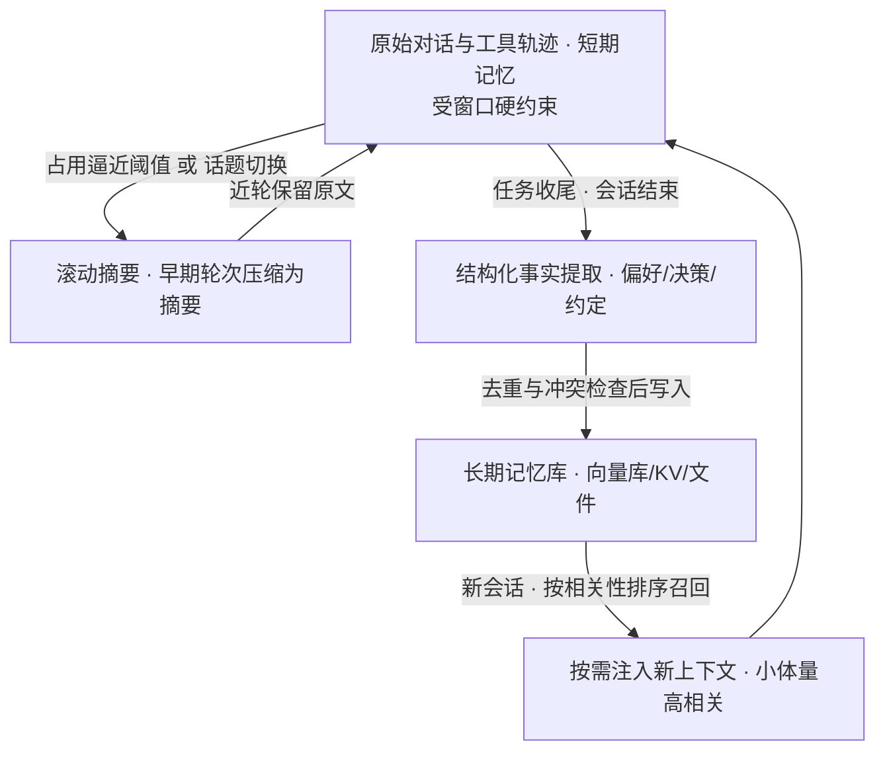

# 智能体技术全景

> 2025–2026 年，Agent 从"对话助手的延伸"变成了独立的技术品类：它有自己的运行时（Harness）、自己的协议层（MCP/Skills/A2A）、自己的商业化路径与开源生态。这个子域记录智能体的技术全景——从概念分级、热点演进到框架选型。

## 从 Copilot 到 Agent 的分级

- **L1 对话**：问答与生成，无外部动作
- **L2 工具调用**：Function Calling，模型决定调什么工具
- **L3 工作流**：多步规划 + 工具编排（ReAct、Plan-and-Execute）
- **L4 自主体**：长任务、自我反思、多 Agent 协作——落地仍需人工确认点

技术栈的分层现实：**编排框架**（怎么构建）与**运行时**（怎么跑）正在收敛为两个独立赛道，连接层（MCP/Skills/A2A）成为事实标准。详见 [Agent 开发框架对比](/ai/agent/frameworks)。

## 本子域文章

| 文章 | 状态 | 说明 |
| --- | --- | --- |
| [Agent 热点编年史](/ai/agent/history) | 已发布 | 从符号智能体、AutoGPT 到 MCP 与长程 Agent 的七十年编年 |
| [Agent 开发框架对比](/ai/agent/frameworks) | 已发布 | 主流框架机制拆解、编排模式、MCP/A2A 协议与选型决策树 |

## Function Calling 的工程要点

- 工具描述（Schema）就是 Prompt：描述质量直接决定调用准确率
- 参数校验与幂等：模型会幻觉出不存在的参数值
- 失败处理：工具报错要"可被模型理解"，否则陷入重试死循环
- 高风险动作保留人工确认（HITL）：审批不是体验损失，是治理基线

## Agent 应用的架构模式

- 单 Agent + 工具箱：覆盖 80% 场景，先做这个
- 路由 + 专家 Agent：意图分发，各域独立迭代
- 多 Agent 协作：复杂任务分解——注意协作开销可能大于收益
- 上线清单：动作白名单、预算上限（token/调用次数）、审计日志、回滚路径

## 记忆与上下文工程

Agent 的记忆问题拆开只有两件事：**上下文窗口管理**（单任务内保留什么）与**外部化持久**（跨会话带走什么）。"短期记忆怎么实现、轮次多了怎么优化、何时触发总结"是月之暗面等长上下文模型厂商面试的高频三连——不意外，窗口就是它们的核心资产。这一节给出工程口径。

### 记忆的两类形态

- **短期记忆**：上下文窗口内的对话记录与工具调用轨迹。受窗口硬约束：token 上限、随长度上升的输入成本、轮次增多后的注意力稀释（中段信息容易被忽略，即 lost in the middle）。它本质不是"存储"而是上下文本身，优化手段只有"留什么、以什么形态留"。
- **长期记忆**：外部化存储、跨会话持久。三种常见载体：**向量库**（语义召回，适合偏好与经验）、**KV 存储**（结构化事实，如用户画像，KV 即 key-value 键值对）、**文件/知识库**（沉淀式文档，如 AGENTS.md 式的笔记）。MemGPT 开创过"OS 分页"路线——模型自主换入换出记忆层级，但我的多数落地案例更朴素：写入与检索由编排层控制，模型只消费注入结果。

### 多轮上下文的策略：何时压缩、何时归档

轮次多了怎么优化，主流三招：

| 策略 | 做法 | 代价 | 适用场景（经验口径） |
| --- | --- | --- | --- |
| 滑动窗口 | 只保留最近 N 轮原始记录，更早的直接丢弃 | 信息丢失不可控 | 无状态问答、短任务对话；N 取占窗口 50%–70% token 的轮数 |
| 滚动摘要 | 把早期轮次压缩成摘要放回系统提示，近轮保留原文 | 多一次摘要调用、细节损失 | 多数多轮任务型场景的首选 |
| 分层压缩 | 原始轨迹 → 结构化事实 → 长期档案，逐层压缩 | 工程成本最高，需要事实 schema | 长程运行、跨会话的个人助理型 Agent |

何时触发总结，我的口径：①**占用逼近窗口阈值**——达到窗口的 70%–80% 就压缩，给摘要调用本身与后续生成留出预算；②**话题切换**——旧话题完整、语义自洽时压缩，质量最高；③**任务收尾**——会话关闭前把结构化结论写入长期记忆。相形之下，"固定每 N 轮"是最差的触发条件，它会把语义完整的片段拦腰截断。另一条来自 Anthropic 工程实践的告诫：把压缩提示词当生产系统对待，优化目标先保召回再保精简——压缩后丢一个关键决策，远比多留几句废话致命。

### 与 RAG 的分工：知识归 RAG，个性化归记忆

记忆与 RAG 是检索体系里最容易混的一对，一句话区分：**记忆管个性化与跨会话持久**（用户偏好、历史决策、这个 Agent 自己的过往约定），**RAG 管共享知识的按需检索**（文档、FAQ、产品资料）。两个反模式：

- 别把对话史塞进 RAG 知识库——共享索引会被个人噪声污染，且个人数据从此无法干净删除；
- 别把整个知识库塞进记忆——窗口预算被静态内容占满，挤掉当前任务。

两者消费侧的检索手段其实同构（语义检索 + 排序），差别在写入主体、生命周期与权限边界。RAG 侧的完整链路见[企业级 RAG 架构设计](/ai/application/rag-architecture)。

### 工程要点与坑

- **写入时机**：每轮写还是会话末写，两派都有。我的口径是偏好、决策等结构化事实每轮结束即写（会话中断不丢、可即刻复用），原始轨迹在会话末批处理。每轮写就必须同时做去重与合并，否则三个月后记忆库里全是重复事实。
- **检索相关性**：记忆召回同样是个检索问题——按语义相似度、时间衰减、重要性加权排序，别"全量灌入"上下文。每次注入的体量宁可比你想象的小，召回不足可以再查，淹没了当前任务没法补救。
- **隐私与"遗忘"**：长期记忆就是个人数据，删除入口必须显式提供（这是删除义务的合规要求）；密码、证件号、健康信息等敏感内容要在写入层就拦截，别指望事后清洗。
- **记忆漂移**：一次错误事实被写入记忆、反复引用，就成了"确凿事实"，错误会复利式放大。对策是给记忆条目记来源与置信度、关键事实保留原始轨迹可回溯覆盖，写入时尽量做与存量记忆的冲突检查。

## 精选资源

> 更新于 2026-09-02。

- [What is the Model Context Protocol (MCP)?](https://modelcontextprotocol.io/docs/getting-started/intro) — MCP 官方规范：协议架构与接入方式（2026 · 官方文档）
- [Building Effective AI Agents](https://www.anthropic.com/engineering/building-effective-agents) — 辨析工作流与 Agent 并给出设计模式，智能体实践经典（2024 · 工程博客）
- [anthropics/skills — Agent Skills](https://github.com/anthropics/skills) — Anthropic 官方 Agent Skills 仓库与规范示例（持续更新 · 开源项目）
- [MCP 火爆半年后，是时候对它"祛魅"了](https://www.infoq.cn/article/aojruzcywajsxgj00jv6) — 冷静剖析 MCP 架构本质与生态炒作（2025 · 工程博客）
- [Agent Arena Leaderboard](https://arena.ai/leaderboard/agent) — Agent 任务能力排行榜（持续更新 · 行业报告）
- [SWE-Marathon](https://www.swe-marathon.org/) — 长程软件工程基准，测 Agent 自主开发的持续作战能力（2026 · 行业报告）
- [Berkeley Function Calling Leaderboard](https://gorilla.cs.berkeley.edu/blogs/8_berkeley_function_calling_leaderboard.html) — 函数调用能力权威横评（2024 · 工程博客）
- [Hermes Agent Documentation](https://hermes-agent.nousresearch.com/docs/) — Nous 开源 Agent 框架官方文档（2026 · 官方文档）
- [Orca — Agent Development Environment](https://www.onorca.dev/) — 面向 Agent 的 ADE：多智能体编排与终端自动化（2026 · 工程博客）
- [你的 OpenClaw 真的在受控运行吗？](https://mp.weixin.qq.com/s/W1n69rhyOUVU5eKUAqGPnA) — Agent 受控运行与治理的实践探讨（2026 · 工程博客）
- [OpenClaw 维基百科条目](https://en.wikipedia.org/wiki/OpenClaw) — 现象级个人 Agent 项目全记录（持续更新 · 百科）

## 计划扩充

- [ ] Agent 开发环境（ADE）横评：Orca 类工具的多智能体编排模式
- [ ] Agent 评测体系：任务型榜单的指标解读与选型应用
- [ ] Agent 成本失控的典型案例分析
- [ ] 企业级 Agent 治理：权限、审计与合规边界

## 参考资料

<Refs>

- [Effective context engineering for AI agents — Anthropic Engineering](https://www.anthropic.com/engineering/effective-context-engineering-for-ai-agents)（访问日期 2026-09-04）
- [MemGPT: Towards LLMs as Operating Systems（arXiv:2310.08560）](https://arxiv.org/abs/2310.08560)（访问日期 2026-09-04）
- [LangChain/LangGraph Memory 概念：短期记忆 = 线程内 checkpointer，长期记忆 = 跨会话 store](https://docs.langchain.com/oss/python/concepts/memory)（访问日期 2026-09-04）
- [Letta（MemGPT 团队）：Agent Memory 与分层记忆设计](https://www.letta.com/blog/agent-memory/)（访问日期 2026-09-04）
- 站内相关：[企业级 RAG 架构设计](/ai/application/rag-architecture) · [Agent 开发框架对比](/ai/agent/frameworks)

</Refs>
