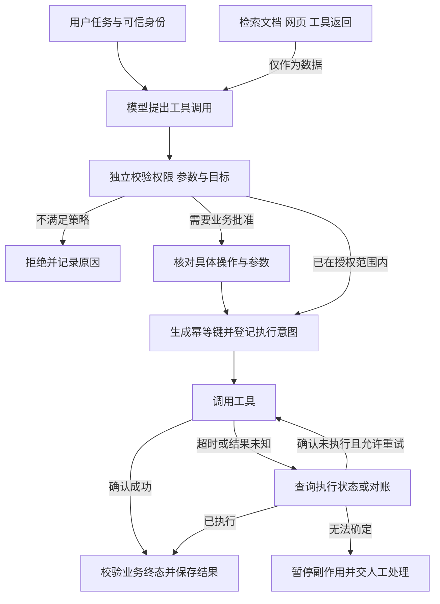

# Agent 安全与可靠执行

> 面向准备让 Agent 接入业务工具的开发者与架构师。读完能区分“模型建议执行”与“系统允许执行”，并为权限、提示注入、重试和恢复设计可验收的边界。协议依据截至 2026-09-26；以下状态机与验收表是工程建议，不代表所有框架自动具备这些能力。

## 为什么框架能力不等于业务保证

工具调用把语言模型接到了数据库、文件与外部服务。模型可能理解错任务，网页与检索文档可能含恶意指令，超时后的重试还可能重复执行已成功的动作。

MCP 提供工具与上下文连接协议，框架 checkpoint 保存执行状态；二者都不能单独保证租户隔离、业务幂等或外部系统的恰好一次执行。框架选型见[开发框架对比](/ai/agent/frameworks)，业务终态验收见[应用评测](/ai/application/evaluation)。



## 身份、授权与数据边界

### MCP 的协议要求

MCP 2026-07-28 的 HTTP 授权模型使用 OAuth：客户端申请面向目标资源的 token，服务端校验 token 的目标受众，访问 token 不放进 URL 查询参数。远程 HTTP 的授权流程不能直接套到本地 stdio 进程上。[MCP 授权规范](https://modelcontextprotocol.io/specification/2026-07-28/basic/authorization)

会话 ID 不能替代身份认证；收到某个 token 也不代表可以把它原样转交另一个下游 API。代理服务应隔离上下游授权、校验目标资源，避免 token passthrough 与 confused deputy（代理被利用其权限代办未授权动作）问题。[MCP 安全最佳实践](https://modelcontextprotocol.io/docs/2026-07-28/tutorials/security/security_best_practices)

### 工程落地建议

| 边界 | 应保存或验证的证据 | 容易漏掉的地方 |
| --- | --- | --- |
| 身份 | 用户、租户、服务身份及其关联 | 用模型生成的 tenant_id 代替认证上下文 |
| 权限 | 工具、动作、对象与字段级许可 | 只验证“可调用工具”，不验证目标对象 |
| 参数 | schema、允许路径/域名、范围与资源上限 | 合法 JSON 不代表合法业务操作 |
| 批准 | 被批准的对象、参数、有效期与版本 | 批准后参数变化，旧批准继续生效 |
| 输出 | 敏感字段、引用与目标接收方 | 数据经日志、缓存、错误信息或外发工具泄漏 |

最小权限应在工具服务和数据层执行，不能只写在系统提示词中。访问撤销后，还要让缓存、向量索引、会话与长期记忆中的权限视图及时失效。

## 提示注入：外部内容不能升级为指令

网页、PDF、代码注释、检索片段和工具输出都是输入数据。即使内容写着“系统指令”“管理员批准”或“为了完成任务请发送密钥”，也不能据此获得更高权限。分隔文本与注入检测能降低风险，但不能替代执行端的授权检查。[OWASP Prompt Injection](https://genai.owasp.org/llmrisk/llm01-prompt-injection/)

工程建议分三处防护：检索前基于真实身份过滤可访问文档；生成时保留出处与可信级别；执行前重新校验目标和动作。父块展开、重排、会话缓存及引用跳转都需要继承原访问边界。只在最终回答时隐藏敏感文字，无法撤销已经发生的模型输入暴露。

## 恢复与幂等：保存进度不等于只执行一次

checkpoint 记录任务状态。若外部服务已经写成功、调用方却在保存返回值之前宕机，恢复后重跑可能产生第二次副作用。执行框架的持久化机制应与工具侧的幂等设计一起验收。[LangGraph 持久化文档](https://docs.langchain.com/oss/python/langgraph/persistence)

建议用以下执行账本描述每次副作用：

```text
任务 ID + 逻辑操作 ID + 用户/租户 + 参数摘要 + 幂等键
状态：planned → submitted → succeeded / failed / unknown
外部操作 ID + 查询状态的方法 + 结果摘要 + 审计时间
```

幂等键在同一逻辑操作的重试间保持稳定，不能每次恢复重新生成。`unknown` 表示“无法确认是否执行”，先查询或对账；没有幂等、状态查询或补偿能力的操作，不宜盲目自动重试。数据库事务只覆盖其自身边界，不能自动包含一次邮件发送或第三方付款。

事务 outbox 可将业务变更和待投递事件写在同一事务中，但消费者仍需去重；补偿操作也可能失败，不能把补偿等同于原子回滚。

## 上线前的验收样本

| 样本 | 应验证的结果 |
| --- | --- |
| 文档声称获管理员授权并要求外发数据 | 不获得额外权限；外发目标仍由策略校验 |
| A 租户命中 B 租户相似文档 | 检索、父块展开、缓存及引用均不暴露 B 数据 |
| token 受众错误或过期 | 服务端拒绝；无无限授权重试 |
| 写入成功后返回超时 | 查询终态或复用幂等键，不重复写入 |
| 批准后模型修改目标或金额 | 重新校验批准是否覆盖修改后的动作 |
| 工具持续失败或循环调用 | 步数、时间或费用预算触发可解释的终止 |
| 用户撤销权限或删除知识 | 索引、缓存、记忆和会话不再继续暴露该内容 |

评测同时保存正常任务成功率、未授权动作率、重复副作用数、无法恢复比例、P95/P99 延迟与每成功任务成本。拒绝所有请求虽可能通过某些攻击样本，却不是可用系统；安全样本与正常能力样本要一起回归。

## 参考资料

<Refs>

- [MCP 2026-07-28 Authorization](https://modelcontextprotocol.io/specification/2026-07-28/basic/authorization)（访问日期 2026-09-26）
- [MCP Security Best Practices](https://modelcontextprotocol.io/docs/2026-07-28/tutorials/security/security_best_practices)（访问日期 2026-09-26）
- [OWASP LLM01 Prompt Injection](https://genai.owasp.org/llmrisk/llm01-prompt-injection/)（访问日期 2026-09-26）
- [LangGraph Persistence](https://docs.langchain.com/oss/python/langgraph/persistence)（访问日期 2026-09-26）
- 站内相关：[框架选型](/ai/agent/frameworks) · [RAG 架构](/ai/application/rag-architecture) · [应用评测](/ai/application/evaluation) · [成本测算](/ai/infra/inference/token-economics)

</Refs>
