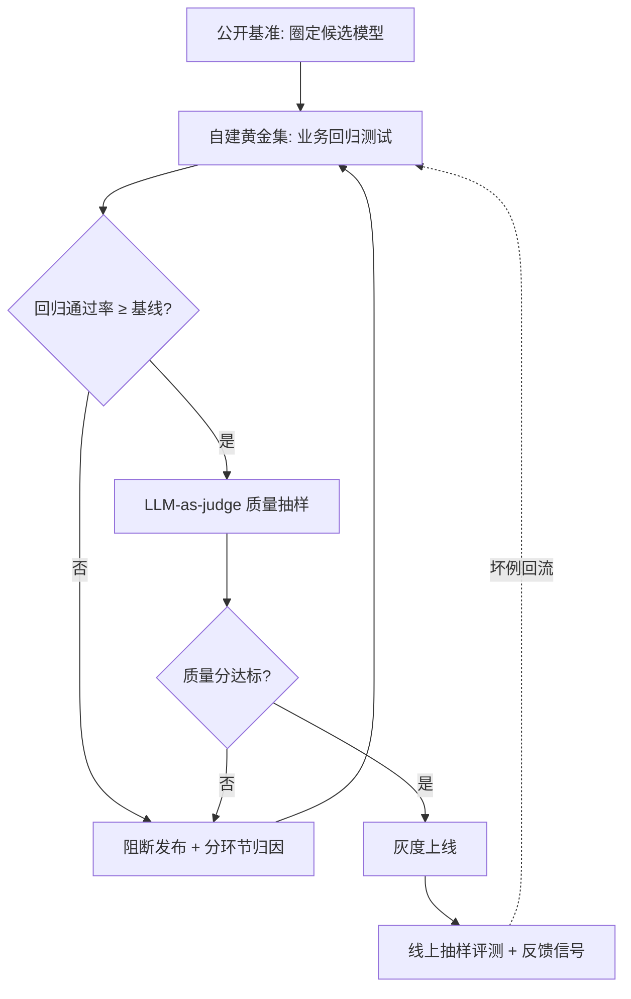
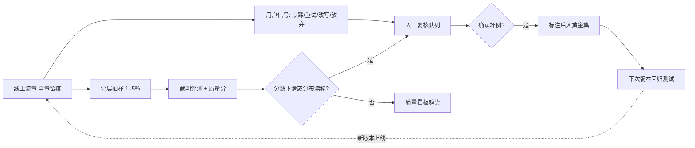

# 大模型评测：从基准到生产监控

> 写给要把大模型应用推上线、或已经上线却仍在"凭感觉调"的工程师。评测是 LLM 应用的回归测试与质量看板：这篇文章帮你理清 2026 年公开基准的现状与污染陷阱，按选型、RAG、Agent 三类场景搭评测方案，掌握 LLM-as-judge 的用法与偏差缓解，并建立从黄金集到生产监控的质量闭环。

## 是什么

先对齐定义。评测（Evaluation）是 LLM 应用的**回归测试与质量看板**：

- **回归测试**：每次改动提示词、模型版本、知识库，都重跑一组固定题目，立刻知道"改这一处有没有弄坏别处"
- **质量看板**：用可计算、可对比的数字——通过率、忠实度、任务成功率——向团队和业务方汇报质量，而不是"感觉变好了"

为什么"凭感觉"不行？三条硬伤：

1. **不可复制**："上周那版效果不错"无法复现，模型换回去也没人记得是哪一版、什么参数
2. **不可汇报**：感觉无法通过验收，回答不了"提升了多少、依据是什么、怎么持续保证"
3. **不可迭代**：没有基线就没有归因，答错了分不清是模型、提示词还是检索的问题，优化全靠抽签

评测与传统软件测试的关系值得说清：**单测验证确定性代码，评测验证概率性输出**。LLM 的输出有随机性，经典断言式测试不能直接套用，要换成统计化判据（通过率、分布、裁判打分）；但工程纪律是一样的——评测先行、改动必回归、指标可追溯。

## 为什么重要

| 维度 | 传统软件 | LLM 应用 |
| --- | --- | --- |
| 正确性判据 | 断言相等，确定性 | 统计判据 + 裁判模型，概率性 |
| 回归手段 | 单元/集成测试 | 黄金集回归 + 质量打分 |
| 质量劣化信号 | 报错率、异常日志 | 点踩、重试、抽样分数下滑 |
| 不做的代价 | 带病上线，但报错可见 | 带病上线，且**变差是静默的** |

最后一行是关键：**LLM 答错不抛异常**。没有评测，质量退化无声无息，等用户投诉时已经损失了信任。反过来，评测也是连接选型、调优、运营三个环节的唯一"共同语言"——没有它，每个环节的结论都无法交接给下一个环节。

*图 1：评测体系的决策主线——公开基准只负责圈候选，上线与否由自建黄金集与质量抽样裁决，线上坏例回流形成闭环。*

## 公开基准全景：2026 年现状

下表按能力维度梳理代表基准，现状基于 2026 年 9 月各基准官网与主流跟踪站的核实。不同跟踪站的评分口径（提示模板、是否带推理）不同，数字给区间，趋势比具体分数可靠。

| 能力维度 | 代表基准 | 测什么 | 局限与 2026 现状 |
| --- | --- | --- | --- |
| 知识（英文） | MMLU → MMLU-Pro | 57 学科选择题；Pro 版 1.2 万题、10 选项 | MMLU 已饱和且被确认存在污染，前沿模型分数逼近上限、头部差距 2 分以内；MMLU-Pro 头部也出现分数聚拢（约九成） |
| 知识（专家级） | GPQA Diamond / HLE | 研究生级科学题；人类知识边缘的 2500 道专家题 | GPQA Diamond 趋于饱和（上百个在榜模型中约两成得分 90%+，人类博士专家约 65–81%）；HLE 前沿模型得分仍低，是当前区分度最高的知识基准之一 |
| 数学推理 | GSM8K → MATH → AIME / FrontierMath | 小学应用题 → 竞赛数学 → 前沿难题 | GSM8K（前沿约 99%+）与 MATH 均已饱和；AIME 2025/2026 成为新标准但 SOTA 已逼近九成七，学界转向题目扰动类鲁棒性评测 |
| 代码 | HumanEval → SWE-bench Verified | 函数级单测；真实 GitHub issue 修复（500 道人工复核子集） | HumanEval 饱和且有污染，仅作遗留参照；SWE-bench Verified 前沿智能体超 75%，"刷榜过拟合"争议升温，Pro、Multimodal 等更难变体在接棒 |
| 中文 | C-Eval / CMMLU / SuperCLUE | 52 学科知识；67 主题含中国特色内容；综合能力 + 开放式主观题 | C-Eval、CMMLU 头部约九成一至九成三，已饱和；C-Eval 2025 年 7 月起公开全部测试集；SuperCLUE 月度更新，但中立性在社区有争议 |
| 多模态 | MMMU → MMMU-Pro | 大学级图表/截图多模态问答 | MMMU 头部约 83–84%，仍有区分度；MMMU-Pro 封堵猜题捷径，是 2026 多模态选型的主流参照 |
| 综合偏好 | LMArena（原 Chatbot Arena） | 匿名两两对战、众包人类偏好、Elo 排名 | 题目不在训练语料里、天然抗污染；但更测"讨喜程度"而非正确性，存在"榜单幻觉"争议 |

### 榜单污染与过拟合

比饱和更伤的是污染。评测集题目通过各种途径进入训练语料——互联网爬料里带上了公开题库、针对性收集竞赛真题、甚至直接对着榜单调训练——模型在**背诵而不是推理**，分数虚高。已核实的应对有三类：

- **污染检测**：n-gram/MinHash 文本重叠比对、成员推断；OpenCompass 内置污染评估模块，会把 C-Eval 拆成"干净/题目污染/题目答案均污染"子集分别汇报
- **防污染设计**：保留私有测试集（C-Eval 曾长期不公开测试集，2025 年才全量公开）、持续换新题（AIME 每年换卷）、闭卷私题（各家内部评测）
- **社区监督**：针对特定榜单的"针对性刷分"（benchmaxxing）指控在 SWE-bench、开源模型榜单上多次出现，已成常态争议

我的判断可以直接说：**公开基准的分数 ≠ 好用**。它的作用只有一个——快速淘汰明显弱的候选。任何选型决策、任何上线判断，都应落在自建评测集上；自建集的题目来自你的业务，没有人能替你"刷榜"。

## 分场景评测

### 选型评测：横评候选模型

选型是最典型的场景：三个候选模型，选哪个？可复制的流程是：

1. 用公开基准淘汰明显不达标者（比如代码场景看 SWE-bench 系、中文场景看 SuperCLUE 系），把候选压到 2–3 个
2. 用自建黄金集对候选模型做**同卷同判**回归：同一份题、同一套提示词模板、同一个判分标准
3. 把成本与延迟纳入决策：单位质量下的每千次调用价格、P95 延迟，往往比 1–2 分的质量差更有决定意义

经验边界：候选模型在黄金集上差距小于 3 个百分点时，我会视为"打平"，转而比成本、延迟与合规约束——这个阈值是我的经验值，你的业务对错误的容忍度不同，阈值应自己定。

### RAG 评测：检索与生成分开归因

RAG 评测的指标体系（检索端 Context Precision/Recall、生成端 Faithfulness/Relevancy）与 RAGAS 框架的用法，已在[企业级 RAG 架构设计](/ai/application/rag-architecture)的"评测"一节完整展开，此处不重复，只强调两点差异：

- **归因顺序**：先问"检索到了吗"再问"生成对了吗"，两类的修法完全不同
- **评测集必须带出处标注**：预期答案 + 出处文档缺一不可，否则检索端指标无法计算

### Agent 评测：结果之外还要看轨迹

Agent 的输出不是一段文本，而是一条执行轨迹，评测要分三层：

| 指标层 | 指标 | 判据 |
| --- | --- | --- |
| 结果 | 任务成功率 | **以终态验证为准**（查数据库、查文件、查工单状态），不认 Agent 自我汇报的"我完成了" |
| 过程 | 轨迹质量 | 工具调用序列与期望路径比对：精确匹配、顺序匹配或无序匹配三档松紧 |
| 过程 | 工具调用正确率 | 选对工具、参数正确；业界数据显示工具调用准确的 Agent 任务成功率可高出数倍 |
| 效率 | 步数、时延、每任务成本 | 同样的任务，绕路 20 步完成与 3 步完成都是"成功"，但成本差一个量级 |

一线观点：**Agent 评测中，过程指标比结果指标更有诊断价值**。任务成功率告诉你"不行"，轨迹比对才告诉你"哪里不行"——是选错了工具、参数传错，还是陷入重试循环。轨迹评测对评测集的要求也更高：每题要标注期望的工具调用路径，维护成本显著高于纯问答黄金集。

## LLM-as-judge：用模型给模型打分

黄金集规模一上去，人工判分就不现实，主流做法是让一个强模型当裁判。两种用法边界清晰：

| 用法 | 做法 | 适用 | 注意 |
| --- | --- | --- | --- |
| 绝对打分 | 按评分细则（rubric）给单条输出打 1–5 分 | 版本回归、质量趋势监控 | 分数锚点要在细则里写死，否则裁判的"3 分"会漂移 |
| 两两对比 | 同一问题的两个输出，判哪个更好 | 模型选型、提示词 A/B | 有系统性位置偏差，必须配合下文缓解手段 |

裁判不是免费的公正法官，它有三类被反复量化过的系统性偏差：

1. **位置偏差**：两两对比时偏好出现在固定位置（常见是第一个）的答案，与质量无关
2. **冗长偏差**：偏好更长、格式更漂亮的回答，哪怕内容更水
3. **自我偏好**：裁判偏好自己（同家族模型）生成的内容——让 GPT 评 GPT 的输出，分数会虚高

缓解手段按性价比排序：

- **交换位置取平均**：两两对比必须正反对调各跑一次，两次结论一致才算有效偏好；这是最便宜也最有效的一招
- **多评审投票**：用 2–3 个异构模型当裁判，投票或取中位，单裁判的家族偏好被稀释
- **参考答案判分**：给裁判提供标准答案或得分点清单，把它从"凭品味打分"拉回"对答案核对"，冗长偏差显著下降
- **定期与人工对齐**：每月抽几十条做人工双标，计算裁判与人工的一致率（我的底线是 80%，低于就换裁判提示词或裁判模型）

## 评测集构建

### 黄金集来自真实业务问答

这也是 OpenAI 等厂商面试真题的高频方向——"没有标准答案的系统，你怎么评测"，答题要点就是这套流水线：

- **来源**：从真实业务问答里来——线上日志抽样、客服工单、业务专家口述的高频问题。合成题只能做补充，不能做主体：合成题的分布永远不等于真实用户的提问分布
- **起步规模**：不追求一步到位，先建 50–200 条覆盖核心场景的小集跑起来，之后版本化增长；每条记录来源与入库日期
- **必须包含拒答题**：评测集里要有"知识库答不了的问题"，验证系统会承认不知道而不是编造——多数评测集只放可答题，是最大的盲区
- **版本化管理**：评测集进版本库，改动留痕；评测结果与评测集版本绑定记录，否则跨期对比无意义

### 多标注员冲突怎么处理

黄金集要标注预期答案，多人标注必然冲突。冲突处理不是杂务，而是评测可信度的地基，标准流程四步：

1. **一致性度量**：先算标注者间一致性——两人用 Cohen's κ，多人用 Fleiss' κ 或 Krippendorff's α。κ 低于 0.6 先别急着标数据，多半是标注指南写得不清楚，改指南、重新培训
2. **多数表决**：每题至少 3 人独立标注，取多数票作为标签；得票一致的题直接进入黄金集
3. **仲裁升级**：分歧题升级到资深标注员或领域专家裁决；专家也拿不准的，说明题目本身有歧义——改写或弃题，不要硬标
4. **噪声标签建模**：承认标注是带噪声的观测。可以用标注者可靠性加权（如 Dawid-Skene 类模型）聚合标签；对高分歧样本，要么降权，要么从"判定对错的硬标签"降级为"只要言之成理即可"的软标签

一个容易被忽视的观点：**高分歧样本是信号不是垃圾**。人都说不清对错的题，裁判模型在上面不稳定是理所当然的——这类题不适合做裁判校准样本，但非常适合做系统的鲁棒性探针。

### 规模与覆盖

- **分层覆盖**：按意图/主题/难度分层，保证每个业务核心意图都有题，而不是高频问题占掉 80%
- **长尾场景**：真实故障几乎都出在长尾里——多轮追问、跨语言混杂、超长输入、时效性问题，每个长尾类别留 5–10 条探针题
- **对抗样本**：提示注入、越权提问、诱导性错误前提，建议占评测集 10–20%（安全敏感行业取上限）；对抗题的通过标准不是"答得对"，而是"拒绝得对"
- **定期换血**：评测集用久了，提示词调优的人会不自觉地对它过拟合；每季度替换 20–30% 的题目，保留题目与答案的"暗集"不参与日常调优

## 生产质量监控与漂移

上线不是评测的终点。离线评测集再大也只是抽样，真实分布只有线上才有：

- **全量留痕**：输入、输出、延迟、成本、工具调用链全部记录（可观测平台如 Langfuse 类），这是一切事后分析的原料
- **线上抽样评测**：按意图分层抽样 1–5% 的流量跑裁判评测，跟踪质量分趋势；抽样率以"每天每类意图至少几十条"为底线倒推
- **用户反馈信号**：显式信号（点踩/点赞）最贵也最准；隐式信号更丰富——同一问题重试、换说法再问、中途放弃会话、人工修改模型输出后采用，都是"答得不好"的旁证
- **分布漂移检测**：对比线上输入与评测集的主题/长度/意图分布；分布偏了，评测集的结论就开始失真，此时要先补题再谈质量。质量分与错误率的滑动告警按周设阈值，避免日常波动刷屏

*图 2：生产评测闭环——抽样评测与用户反馈汇入复核，确认的坏例标注后回流黄金集，成为下一版的回归用例。*

工具现状（2026-09）：开源可自托管方向 **Langfuse** 是主流（对数据不出域的企业场景几乎是默认选项）；**LangSmith** 与 LangChain/LangGraph 生态绑定最深、追踪调试体验好；**Arize Phoenix、Braintrust** 等平台在评测与监控一体化上各有侧重。选型判断：先看是否必须私有化（决定开源自托管还是 SaaS），再看与现有框架的集成成本，功能差异在缩小。

## 实践要点

| 场景 | 评测重点 | 推荐做法 | 经验判据 |
| --- | --- | --- | --- |
| 模型选型 | 横评候选 | 公开基准圈候选 + 黄金集同卷同判 | 差距 <3 分视为打平，转比成本延迟 |
| 提示词变更 | 回归测试 | 黄金集接入 CI，变更必跑 | 通过率回落超 2–3 个百分点先阻断再归因 |
| RAG 调优 | 检索/生成分开归因 | RAGAS 指标体系，见 RAG 篇 | Faithfulness 是抓幻觉第一指标 |
| Agent | 成功率 + 轨迹 | 终态验证 + 工具序列比对 | 不认自我汇报，只认终态 |
| 生产运营 | 趋势与漂移 | 抽样裁判 + 反馈信号 + 换血评测集 | 裁判与人工一致率 ≥80%，每季度换题 20–30% |

## 常见坑

| 坑 | 现象 | 对策 |
| --- | --- | --- |
| 只看公开榜单选型 | 榜上高分，接进业务不好用 | 公开基准只圈候选，自建集定案 |
| 评测集泄漏 | 分数虚高，线上翻车 | 测试题不进任何训练/微调语料；留"暗集"不供调优人员看；定期换题 |
| 裁判未校准 | 评测结论与用户体感相反 | 上线前做人机一致率校准，每月抽检复核 |
| 没有黄金集就上线 | 无法复现、无法汇报、无法归因 | 哪怕 50 条小集，先建再上线，滚动扩充 |
| 评测一次性不回归 | 新版悄悄弄坏旧功能 | 评测接入 CI，变更必回归，结果版本化留档 |
| 只看平均分 | 整体分数上涨，核心场景却在变差 | 按意图/主题分层看分，核心场景单列门槛 |
| 只测可答题 | 系统面对知识库外问题一本正经地编 | 评测集强制包含拒答类题目 |

## 小结

评测的成熟度阶梯：**黄金集 → 回归纪律 → 裁判校准 → 生产监控 → 坏例回流**。公开基准在 2026 年大面积饱和、污染常态化之后，已经退居"圈候选"的辅助位；真正决定应用质量的，是围绕自己业务建起的那套小闭环。这也是它与传统测试最大的不同：评测集不是上线前的一次性作业，而是一个与系统共同生长的活资产。

## 参考资料

<Refs>

**基准与榜单**

- [MMLU-Pro: A More Robust and Challenging Multi-Task Language Understanding Benchmark（arXiv）](https://arxiv.org/abs/2406.01574)（访问日期 2026-09-04）
- [MMLU-Pro Leaderboard — TIGER-Lab（Hugging Face）](https://huggingface.co/spaces/TIGER-Lab/MMLU-Pro)（访问日期 2026-09-04）
- [Artificial Analysis 基准榜单（MMLU-Pro / GPQA Diamond / HLE）](https://artificialanalysis.ai/evaluations/mmlu-pro)（访问日期 2026-09-04）
- [Humanity's Last Exam（CAIS）](https://agi.safe.ai/)（访问日期 2026-09-04）
- [MMMU: Massive Multi-discipline Multimodal Understanding](https://mmmu-benchmark.github.io/)（访问日期 2026-09-04）
- [GSM8K-Platinum: Revealing Performance Gaps in Frontier Models](https://gradientscience.org/gsm8k-platinum/)（访问日期 2026-09-04）
- [SWE-bench Leaderboards](https://www.swebench.com/)（访问日期 2026-09-04）
- [C-Eval 官方网站](https://cevalbenchmark.com/)（访问日期 2026-09-04）
- [CMMLU（GitHub）](https://github.com/haonan-li/CMMLU/)（访问日期 2026-09-04）
- [SuperCLUE 中文大模型测评基准](https://www.superclueai.com/)（访问日期 2026-09-04）
- [OpenCompass 数据污染评估文档](https://opencompass.readthedocs.io/zh_CN/latest/advanced_guides/contamination_eval.html)（访问日期 2026-09-04）
- [LMArena Leaderboard](https://lmarena.ai/leaderboard)（访问日期 2026-09-04）

**方法与研究**

- [Justice or Prejudice? Quantifying Biases in LLM-as-a-Judge](https://llm-judge-bias.github.io/)（访问日期 2026-09-04）
- [Self-Preference Bias in LLM-as-a-Judge（arXiv）](https://arxiv.org/abs/2410.21819)（访问日期 2026-09-04）
- [OpenAI Evaluation Best Practices](https://developers.openai.com/api/docs/guides/evaluation-best-practices)（访问日期 2026-09-04）
- [Demystifying Evals for AI Agents — Anthropic](https://www.anthropic.com/engineering/demystifying-evals-for-ai-agents)（访问日期 2026-09-04）
- [Awesome Data Contamination（GitHub 论文集）](https://github.com/lyy1994/awesome-data-contamination)（访问日期 2026-09-04）

**工具**

- [Langfuse：LLM 评测方法与路线图](https://langfuse.com/blog/2025-11-12-evals)（访问日期 2026-09-04）
- [Langfuse：AI Agent Evaluation](https://langfuse.com/resources/engineering/ai-agent-evaluation)（访问日期 2026-09-04）
- [DeepEval 文档](https://deepeval.com/)（访问日期 2026-09-04）
- [promptfoo 文档](https://www.promptfoo.dev/)（访问日期 2026-09-04）

站内相关：[企业级 RAG 架构设计](/ai/application/rag-architecture) · [大模型应用总览](/ai/application/) · [智能体技术全景](/ai/agent/)

</Refs>
