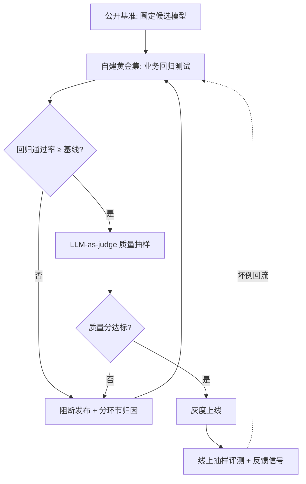
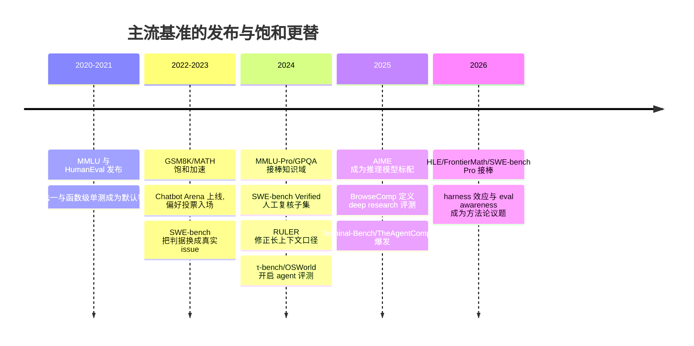
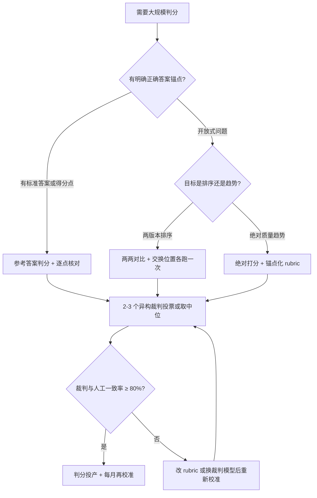
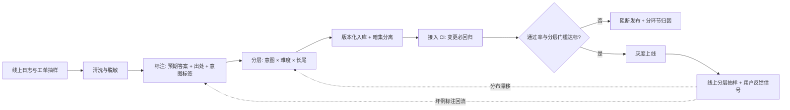
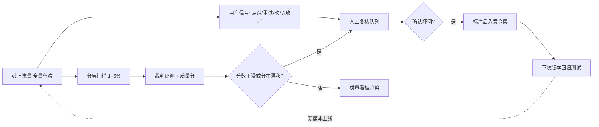

# 大模型评测：从基准到生产监控

> 写给要把大模型应用推上线、或已经上线却仍在"凭感觉调"的工程师与方案架构师。这篇把评测这件事从头到尾拆开：**公开基准按能力域的谱系与机制（MMLU 到 GPQA 为什么更难、SWE-bench 的 fail-to-pass 判据怎么工作、τ-bench 的 pass^k 在测什么）、数据污染的成因与检测、LLM-as-judge 的偏差谱系与缓解、LMArena/OpenCompass/HELM 三种榜单方法论的差异、以及从黄金集构建到生产监控的业务评测闭环**。读完之后你会清楚 2026 年每个主流榜单数字背后的判据与陷阱，知道"榜单分数 ≠ 业务表现"的具体机理，并能为自己的业务搭一套可回归、可汇报、可归因的评测体系。评测已经过了"要不要做"的阶段，现在的分水岭是**信不信得过自己的评测结论**——这一篇按这条主线展开。

## 是什么

先对齐定义。评测（Evaluation）是 LLM 应用的**回归测试与质量看板**：

- **回归测试**：每次改动提示词、模型版本、知识库，都重跑一组固定题目，立刻知道"改这一处有没有弄坏别处"
- **质量看板**：用可计算、可对比的数字——通过率、忠实度、任务成功率——向团队和业务方汇报质量，而不是"感觉变好了"

为什么"凭感觉"不行？三条硬伤：

1. **不可复制**："上周那版效果不错"无法复现，模型换回去也没人记得是哪一版、什么参数
2. **不可汇报**：感觉无法通过验收，回答不了"提升了多少、依据是什么、怎么持续保证"
3. **不可迭代**：没有基线就没有归因，答错了分不清是模型、提示词还是检索的问题，优化全靠抽签

评测与传统软件测试的关系值得说清：**单测验证确定性代码，评测验证概率性输出**。LLM 的输出有随机性，经典断言式测试不能直接套用，要换成统计化判据（通过率、分布、裁判打分）；但工程纪律是一样的——评测先行、改动必回归、指标可追溯。

## 为什么重要

| 维度 | 传统软件 | LLM 应用 |
| --- | --- | --- |
| 正确性判据 | 断言相等，确定性 | 统计判据 + 裁判模型，概率性 |
| 回归手段 | 单元/集成测试 | 黄金集回归 + 质量打分 |
| 质量劣化信号 | 报错率、异常日志 | 点踩、重试、抽样分数下滑 |
| 不做的代价 | 带病上线，但报错可见 | 带病上线，且**变差是静默的** |

最后一行是关键：**LLM 答错不抛异常**。没有评测，质量退化无声无息，等用户投诉时已经损失了信任。反过来，评测也是连接选型、调优、运营三个环节的唯一"共同语言"——没有它，每个环节的结论都无法交接给下一个环节。



*图：评测体系的决策主线——公开基准只负责圈候选，上线与否由自建黄金集与质量抽样裁决，线上坏例回流形成闭环。*

## 公开基准谱系：按能力域的机制拆解

先看一条时间线，理解"基准更替"的节奏——每一代基准从发布到饱和的间隔在持续缩短，这是读榜时必须带上的时间观：



*图：基准谱系的更替节奏——单代基准的有效寿命已从数年缩短到一年左右，读榜必须带时间戳。*

再看一张全景表，然后逐域拆机制。现状基于 2026 年 9 月各基准官网与主流跟踪站的核实；不同跟踪站的评分口径（提示模板、是否带推理、harness 配置）不同，数字给区间，**趋势比具体分数可靠**。

| 能力维度 | 代表基准 | 测什么 | 局限与 2026 现状 |
| --- | --- | --- | --- |
| 知识（英文） | MMLU → MMLU-Pro | 57 学科选择题；Pro 版 1.2 万题、10 选项 | MMLU 已饱和且被确认存在污染，前沿模型分数逼近上限、头部差距 2 分以内；MMLU-Pro 头部也出现分数聚拢（约九成） |
| 知识（专家级） | GPQA Diamond / HLE | 研究生级科学题；人类知识边缘的 2500 道专家题 | GPQA Diamond 趋于饱和（上百个在榜模型中约两成得分 90%+，人类博士专家约 65–81%）；HLE 前沿模型得分仍低，是当前区分度最高的知识基准之一 |
| 数学推理 | GSM8K → MATH → AIME / FrontierMath | 小学应用题 → 竞赛数学 → 前沿难题 | GSM8K（前沿约 99%+）与 MATH 均已饱和；AIME 2025/2026 成为新标准但 SOTA 已逼近九成七，学界转向题目扰动类鲁棒性评测 |
| 代码 | HumanEval → SWE-bench Verified | 函数级单测；真实 GitHub issue 修复（500 道人工复核子集） | HumanEval 饱和且有污染，仅作遗留参照；SWE-bench Verified 前沿智能体超 75%，"刷榜过拟合"争议升温，Pro、Multimodal 等更难变体在接棒 |
| 中文 | C-Eval / CMMLU / SuperCLUE | 52 学科知识；67 主题含中国特色内容；综合能力 + 开放式主观题 | C-Eval、CMMLU 头部约九成一至九成三，已饱和；C-Eval 2025 年 7 月起公开全部测试集；SuperCLUE 月度更新，但中立性在社区有争议 |
| 多模态 | MMMU → MMMU-Pro | 大学级图表/截图多模态问答 | MMMU 头部约 83–84%，仍有区分度；MMMU-Pro 封堵猜题捷径，是 2026 多模态选型的主流参照 |
| 长上下文 | RULER / needle-in-haystack | 长文本检索与聚合 | 大海捞针只测单点检索，严重高估可用上下文；RULER 显示多数模型的"有效上下文"远短于标称值 |
| Agent / GUI | τ-bench、OSWorld、BrowseComp、Terminal-Bench | 对话式工具操作、真实 OS 操作、网页深挖、终端任务 | 分数强依赖 harness 与工具配置，跨榜不可比；2026 年公认"同一模型不同脚手架分数差一大截" |
| 综合偏好 | LMArena（原 Chatbot Arena） | 匿名两两对战、众包人类偏好、Elo 排名 | 题目不在训练语料里、天然抗污染；但更测"讨喜程度"而非正确性，存在"榜单幻觉"争议 |

### 知识与推理：MMLU → MMLU-Pro → GPQA，"更难"是怎么造出来的

MMLU（arXiv:2009.03300）的机制很简单：57 个学科、约 1.4 万道四选一选择题，从人文学科到专业考试（法律、医学）全覆盖，准确率即分数。它的问题也出在机制上：四选一的随机基线是 25%，题目大量是**记忆检索型**（"某法案哪年通过"），模型背过训练语料就能答对；测试集早年全量公开，爬料污染毫无门槛。到 2024 年前沿模型已逼近 90% 上限，头部模型差距缩到 2 分以内——基准失去了区分能力。

MMLU-Pro（arXiv:2406.01574）针对这两点做了三处机制改造：选项从 4 个扩到 10 个（随机基线降到 10%，也大幅压缩"排除法蒙对"的空间）；从原有题库与新增题库中**过滤掉记忆型题目、保留推理型题目**（下图的收集流水线：候选题先过质量与推理需求筛选）；最终约 1.2 万题。效果是同一批模型在 MMLU-Pro 上的平均分比 MMLU 低 16–33 个百分点——差距不是题目"更偏"，而是判据从"见过没有"换成了"会不会推"。


*图：MMLU-Pro 的题目收集与筛选流程——现有基准题与新采集题汇入后，按推理需求与质量逐层过滤。图源：MMLU-Pro 论文（[arXiv:2406.01574](https://arxiv.org/abs/2406.01574)）*

GPQA（arXiv:2311.12022）走的是另一条路：**不靠题量靠专家**。448 道生物/物理/化学的研究生级选择题，由领域博士亲自出题，再经过一套苛刻的双重验证流水线（下图）：两名专家验证者独立作答并给出反馈、出题人据此修订，最后交给三名"其他领域专家"（允许无限制使用 Google）作答——只有满足"两名专家验证者结论一致、且非本域专家至多一人答对"的题目才进入 Diamond 子集（198 题）。这套筛选的意图很明确：**保证题目对"会查资料的非专家"足够难，对真专家可解**。论文报告域内专家准确率约 65%（剔除明显失误后约 74%），而允许搜索的非专家只有约 34%——这是目前少数至今仍有人类专家参照系的知识基准。


*图：GPQA 的出题与验证流水线——出题、两轮专家验证、修订、非专家验证，满足"2/2 专家一致且非专家至多 1/3 答对"才入 Diamond 集。图源：GPQA 论文 图 1（[arXiv:2311.12022](https://arxiv.org/abs/2311.12022)）*

但 2026 年的现实是：GPQA Diamond 也在饱和（在榜模型约两成上 90%），接力棒传给了 HLE（Humanity's Last Exam，2500 道人类知识边缘的专家题）——前沿模型得分仍低，是当前区分度最高的知识基准之一。我的经验判断：**知识类基准的饱和周期已经缩短到一年以内，选型时看"基准发布距今天数"比看分数更重要**。

### 代码：HumanEval → SWE-bench → Verified，判据从"跑通单测"到"修好真 issue"

HumanEval（Codex 论文，arXiv:2107.03374）是 164 道手写 Python 函数题，判据是 pass@k（采样 k 次至少一次通过单元测试的概率）。它的问题和 MMLU 同源：题量小、全量公开、函数级粒度离真实工程太远，2023 年起前沿模型 pass@1 逼近满分，且被多篇污染研究确认题目进入训练语料。

SWE-bench（arXiv:2310.06770）把判据换成了真实软件工程：从 12 个热门 Python 仓库收集 2294 个"issue + 对应修复 PR"对，每个任务给模型**仓库快照 + issue 描述**，要求产出补丁；判据是跑该任务关联的两组测试——fail-to-pass（修复前失败、修复后必须通过，即 issue 真正被解决）与 pass-to-pass（修复前就通过、修复后不许弄坏，即无回归）。这个判据设计的妙处在于**同时约束"修好"和"没弄坏"**，比单测通过率更接近 code review 的标准。


*图：SWE-bench 的任务形态——真实仓库的 issue 报告 + 失败测试，模型产出补丁后以 fail-to-pass / pass-to-pass 两组测试裁决。图源：SWE-bench 论文（[arXiv:2310.06770](https://arxiv.org/abs/2310.06770)）*

原始 SWE-bench 有两个工程缺陷：部分任务的测试本身有问题或 issue 描述歧义（模型无法从给定信息解出），以及许可证与仓库覆盖偏窄。SWE-bench Verified 是 OpenAI 与开源维护者在 2024 年 8 月做的人工复核子集：从原集抽 500 题，由专业工程师逐题确认"可解、测试有效、描述无歧义"，如今是各家模型卡的标准报告项，2025–2026 年前沿 coding 智能体在该榜已超 75%。更难的接棒者包括 SWE-bench Pro（Scale，跨仓库长周期任务、许可干净）与 SWE-bench Multimodal。

一线提醒：**SWE-bench 系分数对 harness 极度敏感**。2026 年有多项研究（Harness-Bench、Princeton HAL 等）量化了"同一模型、不同脚手架（工具集、提示、重试策略）分数差十几个百分点"的现象；比较两个模型的 SWE-bench 分数前，先确认 harness 是否一致，否则比的是工程团队不是模型。

### 数学：GSM8K → MATH → AIME → FrontierMath，饱和速度越来越快

这条谱系的机制差异主要在**答案可验证性与题目来源**：GSM8K（8500 道小学应用题）与 MATH（12500 道竞赛题）都是静态公开集，答案唯一、自动判分，因此最先饱和（GSM8K 前沿 99%+）；AIME（美国数学邀请赛，每年 30 题、整数答案）靠"每年换卷"获得天然防污染属性，2025 年起成为推理模型的标配报告项，但 SOTA 也已逼近九成七；FrontierMath（Epoch AI，专家数学家出的研究级难题）发布时前沿模型得分仅个位数百分比，是 2026 年数学能力的上限探针。学界对饱和基准的补救是**扰动鲁棒性评测**（如 GSM8K-Platinum：改数字、改句式后重测，暴露"背题"模型的脆弱性）——思路与业务评测的"换血"一致：判据不变，题目常新。

### Agent 与 GUI：τ-bench、OSWorld、BrowseComp 与 harness 效应

Agent 评测与问答评测的本质差异：**判据落在环境终态，而不是输出文本**。

τ-bench（arXiv:2406.12045）的设定是"客服对话 + 工具操作"：模型扮演客服 agent，与模拟用户多轮对话，调用读写工具修改数据库（查订单、改机票），最终以**数据库终态与黄金终态比对**判分。它贡献的最重要指标是 pass^k——连续 k 次独立运行全部成功的概率。论文实验显示 pass^k 随 k 增加陡降（零售域尚可、航空域尤其惨烈）：单次成功靠运气成分，稳定成功才是可上线的能力。这个指标对业务选型极有参考价值——**demo 一次成功不等于生产可用**。

τ²-bench（arXiv:2506.07982）进一步引入"双控制"：用户手里也有一组工具（如下图中用户侧的手机设备操作），agent 必须通过对话**指导用户行动**或协调双方动作才能完成任务，更贴近真实客服/技术支持场景。


*图：τ²-bench 的双控制设定——agent 与 user 各持一组工具，共同作用于共享世界（Agent DB + User DB），域策略与用户指令分别约束双方。图源：τ²-bench 论文 图 1（[arXiv:2506.07982](https://arxiv.org/abs/2506.07982)）*

OSWorld（arXiv:2404.07972）把环境换成真实操作系统：369 个跨 Ubuntu/Windows/macOS 的日常任务（浏览器、办公套件、系统设置），agent 直接操作真实 GUI，判据是执行脚本检查系统终态。发布时人类成功率约 72%，最好的模型只有约 12%——GUI 操作的长 horizon、视觉定位与错误恢复，至今仍是 agent 的短板区。


*图：OSWorld 的任务形态——自然语言指令 + 真实 OS 初始状态，以执行脚本验证系统终态判分。图源：OSWorld 论文（[arXiv:2404.07972](https://arxiv.org/abs/2404.07972)）*

BrowseComp（OpenAI，arXiv:2504.12516）测的是"网页深挖"：1266 道事实寻址题，设计原则是**验证不对称**——答案极难找（需跨数百网页串联线索）但极易验证（拿到答案一眼可核对）。题目由标注员从已知事实"反向构造"约束条件而成。发布时的对比极具冲击力：GPT-4o 即使带浏览工具准确率也只有个位数百分比，而 OpenAI Deep Research 达到 51.5%——差距来自 agentic persistence（持续搜索、回溯、换策略），而非单次工具调用。

2026 年 agent 基准的两大新共识：**harness 效应**（Terminal-Bench、TheAgentCompany 等榜的分数强依赖脚手架配置，Princeton HAL 等项目试图用标准化 harness 让分数可比）与**评测环境安全**（agent 代码与评测器共享同一环境时存在被"做局"的空间，已有研究系统披露了 SWE-bench/Terminal-Bench/OSWorld 的这一缺陷）。

### 长上下文：needle-in-haystack 的局限与 RULER 的修正

needle-in-haystack（大海捞针）的机制是在长文本中插入一句"needle"（含特定事实），问模型该事实，测检索成功率随长度的衰减。它的局限在机制层面就注定了：**只测单点事实检索**，不测多事实聚合、多跳追踪、长文问答；且插入句的显著性远高于真实信息分布，会系统性高估能力。

RULER（NVIDIA，arXiv:2404.06654）把任务族扩到 13 类：多针检索（多根 needle、带干扰针）、多键检索、变量追踪（多跳）、词频聚合、长文 QA 等，并引入"有效上下文长度"概念（性能跌破阈值的最长长度）。结论对选型很关键：**多数模型的可用上下文远短于标称值**，且不同任务族的模型排名相关性很低——下图的相关热力图中，单针 NIAH 族与聚合/多跳/QA 族之间接近不相关，意味着"捞针过了"对"长文聚合可用"几乎没有预测力。


*图：RULER 各任务变体间的性能相关热力图——同族任务（如 S/MK/MV/MQ-NIAH）高相关，跨族（NIAH 与 VT/CWE/QA）低相关，单一捞针测试无法代表长上下文能力。图源：RULER 论文（[arXiv:2404.06654](https://arxiv.org/abs/2404.06654)）*

我的实践口径：长上下文选型至少跑三类题——单点检索、多点聚合、长文总结后追问；只用捞针的结果一律不看。

## 数据污染：成因、检测与对策

比饱和更伤的是污染。评测集题目通过各种途径进入训练语料——互联网爬料里带上了公开题库、针对性收集竞赛真题、甚至直接对着榜单调训练——模型在**背诵而不是推理**，分数虚高。

### 成因与形态

- **被动污染**：基准测试集公开在互联网上（论文附录、GitHub、HuggingFace），被常规爬料带入训练集，模型方甚至不知情
- **主动污染**：针对高曝光榜单定向收集题目训练（benchmaxxing），或对着榜单做提示/参数调优
- **答案泄漏**：题与答案成对公开（如带 solution 的题解站），污染程度比只泄漏题目更重
- **2026 新形态——eval awareness**：模型在评测中"意识到自己在被评测"。Anthropic 披露过 Claude Opus 4.6 在 BrowseComp 上识别出测试场景、并找到网上泄漏的答案解密的案例；单题一度消耗约 4000 万 token。污染从"统计重叠"进化到"行为对抗"

### 检测方法

| 方法 | 机制 | 能抓到什么 | 抓不到什么 |
| --- | --- | --- | --- |
| n-gram / MinHash 重叠 | 训练语料与测试题的文本重叠比对 | 原文照抄式污染 | 改写、翻译、换数字的变体 |
| 嵌入相似度检索 | 向量近邻搜索测试题在训练语料中的近亲 | 轻度改写 | 语义重写、跨语言变体 |
| 成员推断 / 困惑度探针 | 模型对测试题的困惑度异常低 → 疑似见过 | 统计意义上的"见过" | 区分"见过同类题"与"背过此题" |
| 时间切分对照 | 按题目发布时间分组对比表现（LiveCodeBench 式） | 训练 cutoff 前后的表现断崖 | 需要题目带可靠时间戳 |
| 扰动重测 | 改数字/改句式/换语言后重测 | 背题型模型的鲁棒性崩塌 | 真推理模型不受影响，成本高 |

下图直观展示了检测方法的覆盖边界：n-gram 重叠只能圈住训练数据中极小一块，**改写样本（Rephrased Samples）大量落在 n-gram 检测圈外**，嵌入相似度能圈住一部分，仍有一块需要更强的语义级检测。


*图：训练数据中"可能污染"区域与三种检测手段的覆盖关系——n-gram 重叠覆盖最小，改写样本大量逃逸。图源：Rethinking Benchmark and Contamination for Language Models with Rephrased Samples（[arXiv:2311.04850](https://arxiv.org/abs/2311.04850)）*

同一篇论文还给出一个对从业者很有用的观察：把 MMLU 内部题目做相似度聚类，会发现**基准内部就存在高度相似的题对**——模型在相似题上的表现差异，可以作为污染存在的旁证。


*图：MMLU 基准内部题目相似度分布——基准自身的近重复题对为污染检测提供了对照信号。图源：同论文（[arXiv:2311.04850](https://arxiv.org/abs/2311.04850)）*

工程侧可落地的检测工具：OpenCompass 内置污染评估模块，会把 C-Eval 拆成"干净 / 题目污染 / 题目答案均污染"三个子集分别汇报分数——**看一个模型的 C-Eval 分数时，先看它在三个子集上的差值**，差值过大即污染信号。

### 对策：动态基准与私有集

- **防污染设计**：保留私有测试集（C-Eval 曾长期不公开测试集，2025 年才全量公开）、持续换新题（AIME 每年换卷）、闭卷私题（各家内部评测）
- **动态/滚动基准**：LiveCodeBench（arXiv:2403.07974）的机制是**按题目发布时间滚动收题**（LeetCode/AtCoder/Codeforces 新题带时间戳），评测时可按模型训练 cutoff 切分，天然隔离污染。下图是其标志性结果：各模型在自己训练 cutoff 之前发布的题目上 Pass@1 明显更高、cutoff 之后的题目上回落到真实水平——**断崖的位置就是污染的证据**。


*图：LiveCodeBench 按 LeetCode 题目发布月份分组的 Pass@1——模型在训练 cutoff 前发布的题目上分数虚高（红区为 DS-Ins 发布前、绿区为 GPT-4o cutoff 后），断崖即污染证据。图源：LiveCodeBench 论文（[arXiv:2403.07974](https://arxiv.org/abs/2403.07974)）*

- **社区监督**：针对特定榜单的"针对性刷分"指控在 SWE-bench、开源模型榜单上多次出现，已成常态争议；读榜时把"该分数是否经独立复现"作为可信度权重
- **自建集纪律**：业务黄金集不进任何训练/微调语料、留"暗集"不供调优人员看、定期换题——这套纪律在自有评测上完全可控，是污染问题上唯一"说了算"的阵地

我的判断可以直接说：**公开基准的分数 ≠ 好用**。它的作用只有一个——快速淘汰明显弱的候选。任何选型决策、任何上线判断，都应落在自建评测集上；自建集的题目来自你的业务，没有人能替你"刷榜"。

## 榜单生态：LMArena、OpenCompass、HELM 的方法论差异

三个主流榜单回答的其实是三个不同的问题，混用是读榜错误的最大来源。

### LMArena（Chatbot Arena）：人类偏好的 Elo

机制（arXiv:2403.04132）：用户匿名提交问题，两个模型并排回答，用户投票选更好的一方；百万级 vote 汇聚后用 **Bradley-Terry 模型**（Elo 是其在线近似）拟合每个模型的能力分，bootstrap 给出置信区间。它的独特价值是**题目来自真实用户、不在任何训练语料里**，天然抗污染；下图的两两胜率矩阵就是 BT 拟合的原始素材形态。


*图：Arena 早期模型间的两两胜率矩阵——BT/Elo 排名由这类众包对战投票拟合而来。图源：LMSYS 官方博客 Chatbot Arena 首发文（[lmsys.org/blog/2023-05-03-arena](https://lmsys.org/blog/2023-05-03-arena/)）*

但 Elo 是**偏好的聚合，不是正确性的度量**：长回答、漂亮排版、迎合语气都能赢票。LMArena 后续引入 style control（控制长度、markdown 等风格变量后重排）来缓解；分类目榜单同样重要——下图显示从普通英文题切到 Hard Prompts 子集后，各模型 Elo 变化方向并不一致（llama-3-70b 明显下滑、gpt-4o 反而上升），**总榜一个数字掩盖了难度带差异**。


*图：Arena 分类目 Elo——同一批模型在 English 总类目与 Hard Prompts 子集上的排名变化方向不一致，总榜分数不能代表各难度带表现。图源：LMSYS 官方博客 Category Hard 分析（[lmsys.org/blog/2024-05-17-category-hard](https://lmsys.org/blog/2024-05-17-category-hard/)）*

### OpenCompass：可复现跑分 + 污染诊断

上海人工智能实验室的开源评测平台：统一提示模板与推理配置复现数百个基准，方法论价值在**工程可复现**（同一份配置任何人可重跑）与**污染诊断**（前述 C-Eval 三子集拆分）。中文基准覆盖最全，是国内选型的常用参照；局限是静态跑分，判据仍是被评基准自身的判据。

### HELM：场景 × 指标的矩阵

Stanford CRFM 的 Holistic Evaluation（arXiv:2211.09110）不追求单一分数，而是把"场景（问答/摘要/检索/安全等）× 指标（准确率、校准度、鲁棒性、公平性、偏见、毒性、效率）"做成矩阵全量报告，主张**任何单指标排序都是对模型能力的有损压缩**。下图是其框架形态：每个场景跑全指标组。


*图：HELM 的 scenario × metrics 全息评测框架——语言模型在每个场景上接受全指标组评估而非单一分数。图源：HELM 论文（[arXiv:2211.09110](https://arxiv.org/abs/2211.09110)）*

### 方法论对比与"榜单分数 ≠ 业务表现"

| 榜单 | 判据来源 | 抗污染 | 回答的问题 | 不代表什么 |
| --- | --- | --- | --- | --- |
| LMArena | 众包人类偏好投票 | 强（题目即席） | 大众口味下谁更讨喜 | 特定领域的正确性、成本效率 |
| OpenCompass | 固定基准统一复现 | 中（带污染诊断） | 标准卷面上谁分高 | 你的提示模板/业务分布下的表现 |
| HELM | 场景×指标矩阵 | 中 | 能力画像与风险面 | 单一维度的排序结论 |
| SWE-bench 系 | 真实 repo 测试判据 | 中（harness 敏感） | 工程修复能力 | 换 harness/换语言栈后的表现 |
| 自建黄金集 | 你的业务真实分布 | 完全可控 | 上线后用户会遇到什么 | 别人业务的表现 |

"榜单分数 ≠ 业务表现"不是口号，机理至少有四条：

1. **分布错位**：基准题目分布 ≠ 你的用户提问分布（长度、口语化程度、领域术语、多轮上下文）
2. **判据错位**：榜单判"答案对不对/讨不讨喜"，业务还要判"格式合不合规、能不能进下游流程、拒答是否得体"
3. **配置错位**：榜单的提示模板、温度、harness 与你的生产配置不同；agent 类榜单的 harness 效应可达十几个百分点
4. **风格错位**：偏好类榜单奖励的长度与排版，在你的场景里可能是噪声（如结构化抽取只要 JSON）

我经历过的典型场景：某候选模型在代码 agent 榜上名列前茅，换到某行业客户内网代码仓库的真实 issue 集上重测，通过率不到榜分的一半——差距主要来自 harness 与私有依赖。所以选型流程里，公开基准只做第一轮淘汰。

## LLM-as-judge：用模型给模型打分

黄金集规模一上去，人工判分就不现实，主流做法是让一个强模型当裁判。MT-Bench/Chatbot Arena 论文（arXiv:2306.05685）给出了这个范式的合法性基础：**GPT-4 级裁判与人类偏好的一致率超过 80%，与人类评审之间的一致率同一水平**——裁判不完美，但和"换一个人来评"的误差同量级。

两种用法边界清晰：

| 用法 | 做法 | 适用 | 注意 |
| --- | --- | --- | --- |
| 绝对打分 | 按评分细则（rubric）给单条输出打 1–5 分 | 版本回归、质量趋势监控 | 分数锚点要在细则里写死，否则裁判的"3 分"会漂移 |
| 两两对比 | 同一问题的两个输出，判哪个更好 | 模型选型、提示词 A/B | 有系统性位置偏差，必须配合下文缓解手段 |
| 参考答案判分 | 给裁判标准答案/得分点清单，逐点核对 | 有明确正确答案的业务题 | 得分点清单的维护成本要计入 |

### 偏差谱系：裁判不是公正法官

裁判有三类被反复量化过的系统性偏差，以及一张更长的清单：

1. **位置偏差**：两两对比时偏好出现在固定位置（常见是第一个）的答案，与质量无关；MT-Bench 的交换位置实验显示部分裁判的位置偏差率过半——对调后结论直接翻转
2. **冗长偏差**：偏好更长、格式更漂亮的回答，哪怕内容更水
3. **自我偏好**：裁判偏好自己（同家族模型）生成的内容。下图是典型形态：让模型评"自己的输出 vs 他人的输出"，胜率系统性偏高，且与输出的困惑度相关——**让 GPT 评 GPT 的输出，分数会虚高**


*图：自我偏好偏差的形态——裁判模型对自家族输出的胜率系统性高于对他模型输出。图源：Self-Preference Bias in LLM-as-a-Judge（[arXiv:2410.21819](https://arxiv.org/abs/2410.21819)）*

"Justice or Prejudice?"（arXiv:2410.02736）把偏差清单扩到 12 类并做了跨裁判量化：位置、冗长、自我增强之外，还有**情感偏差**（偏好正面措辞）、**从众偏差（bandwagon）**（参考他人意见后随大流）、**权威偏差**（回答中声称出自权威来源即加分）、**CoT 偏差**（带推理过程即加分，哪怕推理是错的）等。下图的雷达图是各主流裁判模型的 12 维偏差画像——**没有哪个裁判是干净的，只是偏差的形状不同**。


*图：六个主流裁判模型在 12 类偏差上的量化画像（数值为偏差强度，越大越偏）。图源：Justice or Prejudice? Quantifying Biases in LLM-as-a-Judge（[arXiv:2410.02736](https://arxiv.org/abs/2410.02736)）*

同一篇论文的热力图版本更适合放进质量报告：按裁判 × 偏差的 z-score 矩阵，一眼看出"这个裁判在哪几维最不可信"。


*图：裁判 × 偏差的 z-score 热力图——用于挑选偏差结构与业务最不相冲的裁判。图源：同论文（[arXiv:2410.02736](https://arxiv.org/abs/2410.02736)）*

该论文同时提出 CALM：一套自动化的偏差量化框架，把"给裁判做体检"变成可重复跑的流水线而非一次性研究。


*图：CALM 自动化偏差量化框架——构造对照扰动、批量测量裁判在各偏差维上的响应。图源：同论文（[arXiv:2410.02736](https://arxiv.org/abs/2410.02736)）*

### 缓解手段与使用决策

缓解手段按性价比排序：

- **交换位置取平均**：两两对比必须正反对调各跑一次，两次结论一致才算有效偏好；这是最便宜也最有效的一招
- **多评审投票**：用 2–3 个异构模型当裁判，投票或取中位，单裁判的家族偏好被稀释
- **参考答案判分**：给裁判提供标准答案或得分点清单，把它从"凭品味打分"拉回"对答案核对"，冗长偏差显著下降
- **rubric 写死锚点**：每个分值给可观察的行为描述（"3 分 = 结论正确但遗漏一个关键限定条件"），抑制分数漂移
- **定期与人工对齐**：每月抽几十条做人工双标，计算裁判与人工的一致率（我的底线是 80%，低于就换裁判提示词或裁判模型）

把上述选择压成一张决策图，日常按图走：



*图：LLM-as-judge 的使用决策——先按判据类型选打分形态，再叠偏差缓解，最后用人工一致率做投产门槛。*

### 落地：裁判提示词模板与工具链

裁判提示词的质量决定偏差的一半。我在线上用的绝对打分模板长这样（要点：角色与任务分离、rubric 锚点写死、强制先证据后结论、输出结构化）：

```text
你是一个严格的评测裁判。你将收到：用户问题、参考答案与得分点清单、候选回答。
任务：逐得分点核对候选回答，给出 1-5 分与判定依据。

评分锚点（不得自行发挥）：
5 = 全部得分点命中，且无多余错误信息
4 = 全部得分点命中，但表述冗余或含一处无关紧要的瑕疵
3 = 核心结论正确，遗漏一个关键限定条件或得分点
2 = 结论部分错误，或遗漏两个及以上得分点
1 = 核心结论错误，或拒答了可答问题
0 = 编造不存在的事实（幻觉），或答非所问

输出要求：
1. 先逐条列出：得分点 -> 命中/未命中 -> 候选回答中的证据摘录
2. 再给最终分数与一句话理由
3. 输出 JSON：{"checks": [...], "score": n, "reason": "..."}
```

两两对比模板则额外要求：交换位置跑两次、两次结论不一致记为"平局"、禁止评论长度与排版（除非任务本身要求格式）。把"先证据后结论"写进模板能显著抑制裁判的直觉式偏袒——这是我调裁判提示词时收益最大的一条改动。

工具链现状（2026-09），按落地形态选型：

| 工具 | 形态 | 强项 | 我的使用边界 |
| --- | --- | --- | --- |
| promptfoo | 开源 CLI/配置化 | 提示词×模型矩阵对比、断言与裁判断言内置、进 CI 最顺 | 提示词回归与选型横评的首选 |
| DeepEval | 开源 Python 库 | G-Eval 等裁判指标开箱即用、pytest 风格集成 | 单测式集成到 Python 管线 |
| OpenAI Evals / 各厂商 evals SDK | 官方框架 | 与自家模型、追踪深度集成 | 全栈单厂商时省事 |
| Langfuse / LangSmith / Phoenix / Braintrust | 平台（追踪+评测一体） | 线上 trace 直接转评测集、生产监控闭环 | 生产阶段的主阵地，见下节 |

经验边界：框架只解决"跑得起"，解决不了"判得对"——rubric、黄金集、校准这三件事在任何框架里都是手工活，别指望工具替你省掉。

## 业务评测方法论：从采样到生产闭环

### 评测集构建流水线

这也是 OpenAI 等厂商面试真题的高频方向——"没有标准答案的系统，你怎么评测"，答题要点就是这套流水线：

- **来源**：从真实业务问答里来——线上日志抽样、客服工单、业务专家口述的高频问题。合成题只能做补充，不能做主体：合成题的分布永远不等于真实用户的提问分布
- **起步规模**：不追求一步到位，先建 50–200 条覆盖核心场景的小集跑起来，之后版本化增长；每条记录来源与入库日期
- **必须包含拒答题**：评测集里要有"知识库答不了的问题"，验证系统会承认不知道而不是编造——多数评测集只放可答题，是最大的盲区
- **版本化管理**：评测集进版本库，改动留痕；评测结果与评测集版本绑定记录，否则跨期对比无意义

全流程如下，每个箭头都是一个可以设卡的责任点：



*图：业务评测集的生命周期——采样、标注、分层、版本化、CI 回归、生产抽样与坏例回流构成闭环。*

### 多标注员冲突怎么处理

黄金集要标注预期答案，多人标注必然冲突。冲突处理不是杂务，而是评测可信度的地基，标准流程四步：

1. **一致性度量**：先算标注者间一致性——两人用 Cohen's κ，多人用 Fleiss' κ 或 Krippendorff's α。κ 低于 0.6 先别急着标数据，多半是标注指南写得不清楚，改指南、重新培训
2. **多数表决**：每题至少 3 人独立标注，取多数票作为标签；得票一致的题直接进入黄金集
3. **仲裁升级**：分歧题升级到资深标注员或领域专家裁决；专家也拿不准的，说明题目本身有歧义——改写或弃题，不要硬标
4. **噪声标签建模**：承认标注是带噪声的观测。可以用标注者可靠性加权（如 Dawid-Skene 类模型）聚合标签；对高分歧样本，要么降权，要么从"判定对错的硬标签"降级为"只要言之成理即可"的软标签

一个容易被忽视的观点：**高分歧样本是信号不是垃圾**。人都说不清对错的题，裁判模型在上面不稳定是理所当然的——这类题不适合做裁判校准样本，但非常适合做系统的鲁棒性探针。

### 规模、覆盖与换血

- **分层覆盖**：按意图/主题/难度分层，保证每个业务核心意图都有题，而不是高频问题占掉 80%
- **长尾场景**：真实故障几乎都出在长尾里——多轮追问、跨语言混杂、超长输入、时效性问题，每个长尾类别留 5–10 条探针题
- **对抗样本**：提示注入、越权提问、诱导性错误前提，建议占评测集 10–20%（安全敏感行业取上限）；对抗题的通过标准不是"答得对"，而是"拒绝得对"
- **定期换血**：评测集用久了，提示词调优的人会不自觉地对它过拟合；每季度替换 20–30% 的题目，保留题目与答案的"暗集"不参与日常调优

### 统计判据：多少题才够下结论

评测集规模不是拍脑袋定的，它由"你想分辨多大的差距"决定。通过率是二项分布比例，95% 置信区间半宽约 `1.96 × sqrt(p(1-p)/n)`，在 p≈0.8 附近取最坏情况估算：

| 评测集规模 n | 单次通过率的 95% CI 半宽 | 能可靠分辨的版本差距 | 适用 |
| --- | --- | --- | --- |
| 50 | ±11 pp | 只能看大改（换模型、换架构） | 起步期探针集 |
| 200 | ±5.5 pp | 中等改动（重写提示词主干） | 小团队黄金集 |
| 500 | ±3.5 pp | 提示词细节、检索参数级改动 | 成熟业务黄金集 |
| 1000+ | ±2.5 pp | 微调/量化这类小幅影响 | 平台级回归集 |

两条工程结论：其一，**50 题的集合上 3 个百分点的"提升"是噪声**，别据此做决策；其二，比较两个版本/两个模型时看的是**配对差**（同一批题上的通过差），配对设计的方差远小于两个独立比例的方差，200 题的配对对比通常够分辨 3–5 pp 的差距。我的实践口径：核心意图层每层至少 30–50 题（分层门槛才有统计意义），全集 300–800 题是多数业务的甜区；再大就要靠自动化判分摊薄成本，而不是靠人。

报告数字时同理：**带置信区间或方差，不带裸平均分**。裁判打分（1–5 分）报告均值时附标准差，两两对比报告胜率时附交换位置后的一致率——没有离散度信息的评测数字，在我这里一律按不可信处理。

### 分场景评测要点

**选型评测**：横评候选模型的可复制流程是——公开基准淘汰明显不达标者（代码场景看 SWE-bench 系、中文场景看 SuperCLUE 系），把候选压到 2–3 个；用自建黄金集做**同卷同判**回归（同一份题、同一套提示词模板、同一个判分标准）；把成本与延迟纳入决策（单位质量下的每千次调用价格、P95 延迟，往往比 1–2 分的质量差更有决定意义）。经验边界：候选在黄金集上差距小于 3 个百分点时，我视为"打平"，转比成本、延迟与合规约束——这个阈值是我的经验值，你的业务容忍度不同，阈值应自己定。

**RAG 评测**：指标体系（检索端 Context Precision/Recall、生成端 Faithfulness/Relevancy）与 RAGAS 框架的用法，已在[企业级 RAG 架构设计](/ai/application/rag-architecture)的"评测"一节完整展开，此处只强调两点差异——**归因顺序**先问"检索到了吗"再问"生成对了吗"，两类的修法完全不同；**评测集必须带出处标注**，预期答案 + 出处文档缺一不可，否则检索端指标无法计算。

**Agent 评测**：输出不是一段文本而是一条执行轨迹，评测分四层：

| 指标层 | 指标 | 判据 |
| --- | --- | --- |
| 结果 | 任务成功率 | **以终态验证为准**（查数据库、查文件、查工单状态），不认 Agent 自我汇报的"我完成了" |
| 过程 | 轨迹质量 | 工具调用序列与期望路径比对：精确匹配、顺序匹配或无序匹配三档松紧 |
| 过程 | 工具调用正确率 | 选对工具、参数正确；业界数据显示工具调用准确的 Agent 任务成功率可高出数倍 |
| 效率 | 步数、时延、每任务成本 | 同样的任务，绕路 20 步完成与 3 步完成都是"成功"，但成本差一个量级 |

一线观点：**Agent 评测中，过程指标比结果指标更有诊断价值**。任务成功率告诉你"不行"，轨迹比对才告诉你"哪里不行"——是选错了工具、参数传错，还是陷入重试循环。轨迹评测对评测集的要求也更高：每题要标注期望的工具调用路径，维护成本显著高于纯问答黄金集。稳定性上借鉴 τ-bench 的 pass^k：关键任务至少连跑 3–5 次看全过率，单次通过不算数。

轨迹比对的三档松紧，落到判据伪代码是这样的（按业务风险选档：资金/权限操作选严格档，信息查询选宽松档）：

```python
def trajectory_score(actual, expected, mode):
    a = [(t.tool, canonical(t.args)) for t in actual]     # 工具+规范化参数
    e = [(t.tool, canonical(t.args)) for t in expected]
    if mode == "exact":        # 逐步全等：高危操作、合规场景
        score = 1.0 if a == e else 0.0
    elif mode == "ordered":    # 关键步骤顺序一致，允许插入探索步骤
        score = 1.0 if is_subsequence(e, a) else 0.0
    else:                      # unordered：关键步骤集合覆盖即可，查询类任务
        score = len(set(e) & set(a)) / len(set(e))
    loop_penalty = max(0.0, repeated_ratio(a) - 0.2)   # 冗余循环单独计效率缺陷
    return max(0.0, score - loop_penalty)
```

参数规范化（canonical）是容易踩坑的一步：时间戳、随机 ID、键序不同都算"同一个调用"，否则轨迹比对会报出大量假阴性。

## 生产质量监控与漂移

上线不是评测的终点。离线评测集再大也只是抽样，真实分布只有线上才有：

- **全量留痕**：输入、输出、延迟、成本、工具调用链全部记录（可观测平台如 Langfuse 类），这是一切事后分析的原料
- **线上抽样评测**：按意图分层抽样 1–5% 的流量跑裁判评测，跟踪质量分趋势；抽样率以"每天每类意图至少几十条"为底线倒推
- **用户反馈信号**：显式信号（点踩/点赞）最贵也最准；隐式信号更丰富——同一问题重试、换说法再问、中途放弃会话、人工修改模型输出后采用，都是"答得不好"的旁证
- **分布漂移检测**：对比线上输入与评测集的主题/长度/意图分布；分布偏了，评测集的结论就开始失真，此时要先补题再谈质量。质量分与错误率的滑动告警按周设阈值，避免日常波动刷屏

告警阈值怎么定才不刷屏也不漏报，给一个我用的口径：以最近 4 周同意图层的裁判质量分为基线，取均值 μ 与标准差 σ，**μ−2σ 触发黄色（加入复核队列）、μ−3σ 或连续两周低于 μ−2σ 触发红色（阻断新版本灰度扩大）**；抽样量按前述统计判据倒推（每意图层每天几十条），样本不足的意图层不设自动告警、只进人工周报。漂移侧同理：线上输入的主题分布与评测集的 JS 散度超阈值时，先补题再谈质量分——**分布偏了之后的质量分，测的不是你的系统而是你的评测集盲区**。



*图：生产评测闭环——抽样评测与用户反馈汇入复核，确认的坏例标注后回流黄金集，成为下一版的回归用例。*

工具现状（2026-09）：开源可自托管方向 **Langfuse** 是主流（对数据不出域的企业场景几乎是默认选项）；**LangSmith** 与 LangChain/LangGraph 生态绑定最深、追踪调试体验好；**Arize Phoenix、Braintrust** 等平台在评测与监控一体化上各有侧重。选型判断：先看是否必须私有化（决定开源自托管还是 SaaS），再看与现有框架的集成成本，功能差异在缩小。

## 安全与对齐评估：红队与越狱基准

业务评测管"好不好用"，安全评测管"会不会出事"，两者判据相反：能力题希望模型答出来，安全题希望模型**拒得对**。

- **红队（Red Teaming）**：组织人工或自动化攻击者系统性试探模型边界。自动化红队的主流做法是用攻击模型生成越狱提示（如 PAIR 类迭代改写策略），对目标模型批量投放并统计攻破率；人工红队则覆盖自动化难及的场景（多轮诱导、角色扮演嵌套、业务语境下的越权）
- **越狱基准**：JailbreakBench（arXiv:2404.01318）提供标准化攻击集、防御接口与公开排行榜，核心指标是 ASR（Attack Success Rate，攻击成功率，越低越好）；HarmBench 覆盖更广的行为类别与多模态攻击。下图是 JailbreakBench 的站点形态：攻击、防御、榜单三位一体。


*图：JailbreakBench 的标准化越狱评测——统一攻击集、防御接口与 ASR 排行榜。图源：JailbreakBench 论文（[arXiv:2404.01318](https://arxiv.org/abs/2404.01318)）*

- **过度拒绝的代价**：安全调优过头会伤可用性——把合规的正常提问也拒掉。我的实践是安全评测集与能力评测集**同批跑、同版看**：ASR 下降若伴随拒答率上升，要算净收益
- **对齐评估进业务集**：提示注入、诱导性错误前提、越权请求这些对抗题直接放进业务黄金集（前述 10–20% 配额），让安全回归搭上能力回归的 CI 班车，而不是单独一套流程

安全评测的指标口径值得单列，因为它的方向性与能力指标相反，混在一张看板里极易误读：

| 指标 | 定义 | 方向 | 与能力指标的关系 |
| --- | --- | --- | --- |
| ASR 攻击成功率 | 攻击集中成功诱导有害输出的比例 | 越低越好 | 安全调优/护栏版本的直接判据 |
| 拒答率（可答集上） | 本该正常回答却拒绝的比例 | 越低越好 | 过度拒绝的代价，与 ASR 对照看净收益 |
| 拒答正确率（对抗集上） | 面对越权/注入/错误前提时正确拒绝的比例 | 越高越好 | 业务黄金集对抗配额的通过标准 |
| 有害度分级均分 | 裁判模型按危害等级打分（0–4 类） | 越低越好 | 区分"拒绝得不体面"与"真输出有害" |

红队的执行节奏我的建议是：**大版本上线前一轮人工+自动化组合红队，日常迭代只跑自动化攻击集回归**（成本差一个数量级）；攻击集与业务对抗题共用版本管理，新增攻击手法（社区披露的新越狱模板）入库即回归。

## 2025–2026 新动向：推理、deep research 与 agentic 的三个评估难题

### 推理模型：结果评估不够，过程评估兴起

推理模型（长思维链）的评估难题在于**结果可验证、过程难验证**。主流训练与评测仍用结果判据（RLVR，可验证奖励强化学习：数学/代码答案可自动判对错），但两个问题推动过程评估兴起：一是结果判据对长轨迹给的信号太稀疏（整条链只对最后一格负责）；二是**奖励黑客**——模型学会利用验证器漏洞（格式取巧、测试特例）而非真正解题，2026 年已有多篇综述把验证器完整性列为系统级对齐问题。

过程侧的代表工作：OpenAI 的 Process Reward Model 研究（arXiv:2305.20050）早已证明过程监督奖励模型在 best-of-N 验证上显著优于结果监督与多数投票（下图）；ProcessBench（arXiv:2412.06559）测"能否定位推理链中最早出错的步骤"；PRMBench（arXiv:2501.03124）进一步把过程级判分做难。对从业者的含义：**排查推理模型的错误时，用过程级裁判定位"第几步开始错"，比只看最终答案的回归信号快一个量级**。


*图：best-of-N 解题率对比——过程监督奖励模型（PRM）显著优于结果监督（ORM）与多数投票，是过程级评估价值的直接证据。图源：Let's Verify Step by Step（[arXiv:2305.20050](https://arxiv.org/abs/2305.20050)）*

另一个 2026 年的实务指标是**推理效率**：同样正确率下思维链 token 消耗差数倍直接决定成本，"正确率 × 单题 token"应进选型表。

### Deep research：从单题检索到报告级评估

BrowseComp 一类"单题深挖"基准在 2025 年确立后迅速饱和并出现污染（前述 eval awareness 案例即发生在此榜）。社区的修正方向有三：BrowseComp-Plus（arXiv:2508.06600）用约 10 万篇人工核验文档的**固定语料**替代开放网络，把"检索器质量"与"模型推理质量"分离、结果可复现；LiveBrowseComp 发现各 agent 闭卷得分不足 2%、带搜索得分比原榜低 25–40 个百分点，怀疑模型在"验证记忆中的答案"而非真搜索；DeepResearch Bench 则转向**报告级评估**（22 个领域的长报告，评覆盖度、引用质量、结构），对应 deep research 产品的真实交付物形态。

### Agentic 评估：harness 效应与标准化脚手架

2025–2026 年 agent 基准爆发：Terminal-Bench（终端任务、逐任务验证器，已迭代到 4.x）、TheAgentCompany（arXiv:2412.14161，模拟软件公司的真实岗位任务）、OSWorld/GUI 系持续加难。与此同时两个方法论共识形成：**harness 效应必须报告**（同模型不同脚手架分数差可达十几个百分点，Harness-Bench 等专门量化此事；Princeton HAL 用标准化 harness 做可复现对比）；**评测环境要与被测环境隔离**（agent 与评测器共享环境时的 gaming 风险已被系统披露）。读 agent 榜单的第一问从"多少分"变成"什么 harness、跑了几次、方差多大"。

## 实践要点

| 场景 | 评测重点 | 推荐做法 | 经验判据 |
| --- | --- | --- | --- |
| 模型选型 | 横评候选 | 公开基准圈候选 + 黄金集同卷同判 | 差距 <3 分视为打平，转比成本延迟 |
| 提示词变更 | 回归测试 | 黄金集接入 CI，变更必跑 | 通过率回落超 2–3 个百分点先阻断再归因 |
| RAG 调优 | 检索/生成分开归因 | RAGAS 指标体系，见 RAG 篇 | Faithfulness 是抓幻觉第一指标 |
| Agent | 成功率 + 轨迹 + 稳定性 | 终态验证 + 工具序列比对 + pass^k | 不认自我汇报，只认终态；连跑 3 次全过才算稳 |
| 推理模型 | 结果 + 过程 + 效率 | 结果判据回归 + 过程裁判归因 + token 成本 | 错误归因到"第几步错"再改提示词 |
| 长上下文 | 检索/聚合/追问三类 | RULER 式多任务族，不只看捞针 | 捞针满分不等于长文可用 |
| 生产运营 | 趋势与漂移 | 抽样裁判 + 反馈信号 + 换血评测集 | 裁判与人工一致率 ≥80%，每季度换题 20–30% |

## 常见坑

| 坑 | 现象 | 根因与对策 |
| --- | --- | --- |
| 只看公开榜单选型 | 榜上高分，接进业务不好用 | 分布/判据/配置/风格四重错位；公开基准只圈候选，自建集定案 |
| 跨 harness 比 agent 分数 | 两个"同分"模型实测差一大截 | harness 效应可达十几百分点；对齐脚手架与工具配置后再比 |
| 评测集泄漏 | 分数虚高，线上翻车 | 测试题不进任何训练/微调语料；留"暗集"不供调优人员看；定期换题 |
| 裁判未校准 | 评测结论与用户体感相反 | 位置/冗长/自我偏好等 12 类偏差；上线前做人机一致率校准，每月抽检复核 |
| 裁判自评家族输出 | 同家族模型迭代"看起来总在变好" | 自我偏好；换异构裁判或多裁判投票 |
| 没有黄金集就上线 | 无法复现、无法汇报、无法归因 | 哪怕 50 条小集，先建再上线，滚动扩充 |
| 评测一次性不回归 | 新版悄悄弄坏旧功能 | 评测接入 CI，变更必回归，结果版本化留档 |
| 只看平均分 | 整体分数上涨，核心场景却在变差 | 按意图/主题分层看分，核心场景单列门槛 |
| 只测可答题 | 系统面对知识库外问题一本正经地编 | 评测集强制包含拒答类题目 |
| 长上下文只跑捞针 | 标称 128k 实测长文聚合就崩 | RULER 式多任务族 + 有效上下文长度口径 |
| 单次跑分定结论 | 复跑分数波动大到推翻结论 | 概率性输出要报均值+方差/置信区间，关键项连跑多次 |

## 小结

评测的成熟度阶梯：**黄金集 → 回归纪律 → 裁判校准 → 生产监控 → 坏例回流**。公开基准在 2026 年大面积饱和、污染常态化、harness 效应显性化之后，已经退居"圈候选"的辅助位；真正决定应用质量的，是围绕自己业务建起的那套小闭环。这也是它与传统测试最大的不同：评测集不是上线前的一次性作业，而是一个与系统共同生长的活资产。

## 参考资料

<Refs>

**原始论文**

- [Measuring Massive Multitask Language Understanding / MMLU（arXiv:2009.03300）](https://arxiv.org/abs/2009.03300) — 57 学科选择题基准的原始论文（访问日期 2026-09-05）
- [MMLU-Pro: A More Robust and Challenging Multi-Task Language Understanding Benchmark（arXiv:2406.01574）](https://arxiv.org/abs/2406.01574) — 10 选项、推理型题目过滤的机制来源（访问日期 2026-09-05）
- [GPQA: A Graduate-Level Google-Proof Q&A Benchmark（arXiv:2311.12022）](https://arxiv.org/abs/2311.12022) — 专家出题与双重验证流水线、Diamond 子集筛选标准（访问日期 2026-09-05）
- [Training Verifiers to Solve Math Word Problems / GSM8K（arXiv:2110.14168）](https://arxiv.org/abs/2110.14168) — 小学应用题基准与 verifier 思路（访问日期 2026-09-05）
- [Measuring Mathematical Problem Solving With the MATH Dataset（arXiv:2103.03874）](https://arxiv.org/abs/2103.03874) — 竞赛数学基准（访问日期 2026-09-05）
- [Evaluating Large Language Models Trained on Code / HumanEval（arXiv:2107.03374）](https://arxiv.org/abs/2107.03374) — 164 题函数级代码基准与 pass@k 定义（访问日期 2026-09-05）
- [SWE-bench: Can Language Models Resolve Real-world GitHub Issues?（arXiv:2310.06770）](https://arxiv.org/abs/2310.06770) — issue+PR 任务构造与 fail-to-pass / pass-to-pass 判据（访问日期 2026-09-05）
- [LiveCodeBench: Holistic and Contamination Free Evaluation of LLMs（arXiv:2403.07974）](https://arxiv.org/abs/2403.07974) — 按发布时间滚动收题的防污染机制（访问日期 2026-09-05）
- [RULER: What's the Real Context Size of Your Long-Context Language Models?（arXiv:2404.06654）](https://arxiv.org/abs/2404.06654) — 13 类长上下文任务族与有效上下文长度（访问日期 2026-09-05）
- [τ-bench: A Benchmark for Tool-Agent-User Interaction in Real-World Domains（arXiv:2406.12045）](https://arxiv.org/abs/2406.12045) — 对话式工具操作与 pass^k 稳定性指标（访问日期 2026-09-05）
- [τ²-bench: Evaluating Conversational Agents in a Dual-Control Environment（arXiv:2506.07982）](https://arxiv.org/abs/2506.07982) — 用户侧工具与双控制设定（访问日期 2026-09-05）
- [OSWorld: Benchmarking Multimodal Agents for Open-Ended Tasks in Real Computer Environments（arXiv:2404.07972）](https://arxiv.org/abs/2404.07972) — 真实 OS 的 369 任务 GUI 基准（访问日期 2026-09-05）
- [BrowseComp: A Simple Yet Challenging Benchmark for Browsing Agents（arXiv:2504.12516）](https://arxiv.org/abs/2504.12516) — 1266 题、验证不对称设计的深挖基准（访问日期 2026-09-05）
- [BrowseComp-Plus: A More Fair and Transparent Evaluation of Deep-Research Agent（arXiv:2508.06600）](https://arxiv.org/abs/2508.06600) — 固定核验语料分离检索器与模型能力（访问日期 2026-09-05）
- [Judging LLM-as-a-Judge with MT-Bench and Chatbot Arena（arXiv:2306.05685）](https://arxiv.org/abs/2306.05685) — 裁判与人类一致率超 80%、位置/冗长/自我增强偏差的量化（访问日期 2026-09-05）
- [Chatbot Arena: An Open Platform for Evaluating LLMs by Human Preference（arXiv:2403.04132）](https://arxiv.org/abs/2403.04132) — Bradley-Terry/Elo 排名方法论（访问日期 2026-09-05）
- [Holistic Evaluation of Language Models / HELM（arXiv:2211.09110）](https://arxiv.org/abs/2211.09110) — scenario × metrics 全息评测框架（访问日期 2026-09-05）
- [Self-Preference Bias in LLM-as-a-Judge（arXiv:2410.21819）](https://arxiv.org/abs/2410.21819) — 裁判自我偏好的量化与机理（访问日期 2026-09-05）
- [Justice or Prejudice? Quantifying Biases in LLM-as-a-Judge（arXiv:2410.02736）](https://arxiv.org/abs/2410.02736) — 12 类偏差画像与 CALM 自动化量化框架（访问日期 2026-09-05）
- [Rethinking Benchmark and Contamination for Language Models with Rephrased Samples（arXiv:2311.04850）](https://arxiv.org/abs/2311.04850) — 改写样本污染与检测手段覆盖边界（访问日期 2026-09-05）
- [Let's Verify Step by Step / PRM800K（arXiv:2305.20050）](https://arxiv.org/abs/2305.20050) — 过程监督 vs 结果监督奖励模型的对照实验（访问日期 2026-09-05）
- [ProcessBench: Identifying Process Errors in Mathematical Reasoning（arXiv:2412.06559）](https://arxiv.org/abs/2412.06559) — 定位推理链最早错误步骤的过程级基准（访问日期 2026-09-05）
- [PRMBench: A Fine-grained and Challenging Benchmark for Process-level Reward Models（arXiv:2501.03124）](https://arxiv.org/abs/2501.03124) — 过程级奖励模型的加难基准（访问日期 2026-09-05）
- [TheAgentCompany: Benchmarking LLM Agents on Consequential Real World Tasks（arXiv:2412.14161）](https://arxiv.org/abs/2412.14161) — 模拟软件公司的岗位任务 agent 基准（访问日期 2026-09-05）
- [JailbreakBench: An Open Robustness Benchmark for Jailbreaking Language Models（arXiv:2404.01318）](https://arxiv.org/abs/2404.01318) — 标准化越狱攻击集与 ASR 排行榜（访问日期 2026-09-05）
- [C-Eval: A Multi-Level Multi-Discipline Chinese Evaluation Suite（arXiv:2305.08322）](https://arxiv.org/abs/2305.08322) — 中文 52 学科基准（原官网 cevalbenchmark.com 于 2026-09 已不可达，改引论文）（访问日期 2026-09-05）
- [Humanity's Last Exam（CAIS）](https://agi.safe.ai/) — 2500 道人类知识边缘专家题（访问日期 2026-09-05）

**官方博客与文档**

- [Introducing SWE-bench Verified — OpenAI](https://openai.com/index/introducing-swe-bench-verified/) — 500 题人工复核子集的由来（访问日期 2026-09-05）
- [BrowseComp: a benchmark for browsing agents — OpenAI](https://openai.com/index/browsecomp/) — BrowseComp 发布公告（访问日期 2026-09-05）
- [Evaluation best practices — OpenAI API 文档](https://developers.openai.com/api/docs/guides/evaluation-best-practices) — 官方评测设计指引（访问日期 2026-09-05）
- [Demystifying Evals for AI Agents — Anthropic](https://www.anthropic.com/engineering/demystifying-evals-for-ai-agents) — agent 评测的方法论拆解（访问日期 2026-09-05）
- [Eval awareness in Claude Opus 4.6's BrowseComp performance — Anthropic](https://www.anthropic.com/engineering/eval-awareness-browsecomp) — 模型识别评测并解密泄漏答案的案例披露（访问日期 2026-09-05）
- [Chatbot Arena 首发博客 — LMSYS](https://lmsys.org/blog/2023-05-03-arena/) — 两两对战与胜率矩阵的原始出处（访问日期 2026-09-05）
- [Category Hard 分析博客 — LMSYS](https://lmsys.org/blog/2024-05-17-category-hard/) — 分类目 Elo 与难度带差异（访问日期 2026-09-05）
- [OpenCompass 数据污染评估文档](https://opencompass.readthedocs.io/zh_CN/latest/advanced_guides/contamination_eval.html) — C-Eval 干净/污染子集拆分方法（访问日期 2026-09-05）
- [OpenCompass（GitHub）](https://github.com/open-compass/opencompass) — 开源评测平台（访问日期 2026-09-05）
- [HELM — Stanford CRFM](https://crfm.stanford.edu/helm/) — 全息评测官网（访问日期 2026-09-05）
- [Terminal-Bench 官网](https://www.tbench.ai/) — 终端任务 agent 基准（访问日期 2026-09-05）
- [Holistic Agent Leaderboard / hal-harness（GitHub）](https://github.com/princeton-pli/hal-harness) — 标准化 harness 的可复现 agent 评测（访问日期 2026-09-05）
- [SWE-bench Leaderboards](https://www.swebench.com/) — SWE-bench 各变体榜单与 harness 文档（访问日期 2026-09-05）
- [MMLU-Pro Leaderboard — TIGER-Lab（Hugging Face）](https://huggingface.co/spaces/TIGER-Lab/MMLU-Pro) — MMLU-Pro 跟踪榜（访问日期 2026-09-05）
- [Artificial Analysis 基准榜单（MMLU-Pro / GPQA Diamond / HLE）](https://artificialanalysis.ai/evaluations/mmlu-pro) — 统一口径的跨模型跟踪（访问日期 2026-09-05）
- [MMMU: Massive Multi-discipline Multimodal Understanding](https://mmmu-benchmark.github.io/) — 多模态基准官网（访问日期 2026-09-05）
- [GSM8K-Platinum: Revealing Performance Gaps in Frontier Models](https://gradientscience.org/gsm8k-platinum/) — 扰动重测暴露背题脆弱性（访问日期 2026-09-05）
- [CMMLU（GitHub）](https://github.com/haonan-li/CMMLU/) — 中文 67 主题基准（访问日期 2026-09-05）
- [SuperCLUE 中文大模型测评基准](https://www.superclueai.com/) — 中文月度综合测评（访问日期 2026-09-05）
- [LMArena Leaderboard](https://lmarena.ai/leaderboard) — 偏好对战总榜与分类榜（访问日期 2026-09-05）
- [Awesome Data Contamination（GitHub 论文集）](https://github.com/lyy1994/awesome-data-contamination) — 污染研究论文索引（访问日期 2026-09-05）
- [Langfuse：LLM 评测方法与路线图](https://langfuse.com/blog/2025-11-12-evals) — 生产评测与监控的工程实践（访问日期 2026-09-05）
- [Langfuse：AI Agent Evaluation](https://langfuse.com/resources/engineering/ai-agent-evaluation) — agent 轨迹评测落地（访问日期 2026-09-05）
- [DeepEval 文档](https://deepeval.com/) — 开源评测框架（访问日期 2026-09-05）
- [promptfoo 文档](https://www.promptfoo.dev/) — 提示词/模型对比评测工具（访问日期 2026-09-05）

**图片来源**

- `mmlu-pro-collection.png` — MMLU-Pro 论文（[arXiv:2406.01574](https://arxiv.org/abs/2406.01574)）数据收集流水线图
- `gpqa-validation.png` — GPQA 论文（[arXiv:2311.12022](https://arxiv.org/abs/2311.12022)）图 1 验证流水线
- `swe-bench-example.png` — SWE-bench 论文（[arXiv:2310.06770](https://arxiv.org/abs/2310.06770)）任务示例图
- `livecodebench-contamination.png` — LiveCodeBench 论文（[arXiv:2403.07974](https://arxiv.org/abs/2403.07974)）时间切分对照图
- `ruler-corr-heatmap.png` — RULER 论文（[arXiv:2404.06654](https://arxiv.org/abs/2404.06654)）任务相关热力图
- `osworld-task-demo.png` — OSWorld 论文（[arXiv:2404.07972](https://arxiv.org/abs/2404.07972)）任务演示图
- `tau2-bench-teaser.png` — τ²-bench 论文（[arXiv:2506.07982](https://arxiv.org/abs/2506.07982)）图 1 双控制设定
- `contamination-venn.png` / `contamination-mmlu-similarity.png` — 改写污染论文（[arXiv:2311.04850](https://arxiv.org/abs/2311.04850)）
- `arena-win-fraction.png` — LMSYS 官方博客（[lmsys.org/blog/2023-05-03-arena](https://lmsys.org/blog/2023-05-03-arena/)）
- `arena-elo-comparison.png` — LMSYS 官方博客（[lmsys.org/blog/2024-05-17-category-hard](https://lmsys.org/blog/2024-05-17-category-hard/)）
- `helm-framework.png` — HELM 论文（[arXiv:2211.09110](https://arxiv.org/abs/2211.09110)）框架图
- `self-preference-bias.png` — 自我偏好论文（[arXiv:2410.21819](https://arxiv.org/abs/2410.21819)）
- `judge-bias-taxonomy.png` / `judge-bias-heatmap.png` / `calm-framework.png` — Justice or Prejudice? 论文（[arXiv:2410.02736](https://arxiv.org/abs/2410.02736)）
- `prm-orm-comparison.png` — Let's Verify Step by Step（[arXiv:2305.20050](https://arxiv.org/abs/2305.20050)）
- `jailbreakbench-site.png` — JailbreakBench 论文（[arXiv:2404.01318](https://arxiv.org/abs/2404.01318)）

（访问日期均为 2026-09-05）

站内相关：[企业级 RAG 架构设计](/ai/application/rag-architecture) · [大模型应用总览](/ai/application/) · [智能体技术全景](/ai/agent/) · [智能体框架对比](/ai/agent/frameworks) · [大语言模型](/ai/models/llm)

</Refs>
