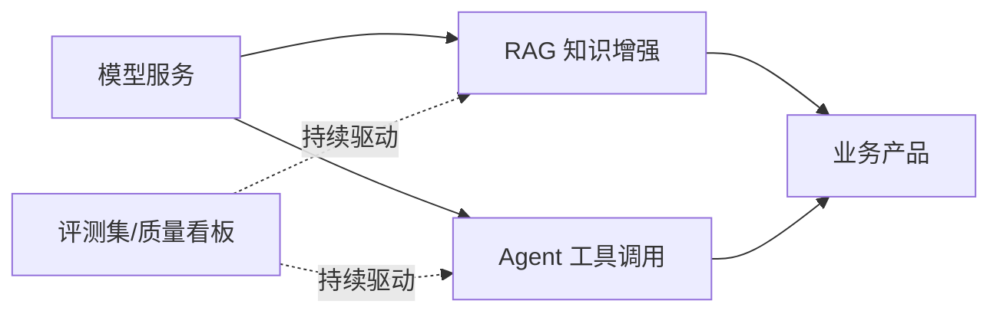

# 大模型应用

> 应用层把模型能力工程化为业务价值。这一层的主题只有一个：**把概率性的模型输出，包进确定性的工程系统**——知识增强（RAG）解决"说得对"，Agent 解决"做得了"，评测与运营解决"持续可靠"。

## 文章列表

| 文章 | 状态 | 说明 |
| --- | --- | --- |
| [企业级 RAG 架构设计](/ai/application/rag-architecture) | ✅ 已发布 | 解析/切分/混合检索/重排/评测全链路 |
| [Agent 与 MCP](/ai/application/agent) | 🚧 提纲 | Function Calling、工具编排、落地边界 |
| [多模态模型与视频生成](/ai/application/multimodal) | 🚧 提纲 | 文生视频/图生视频、评测与本地部署路线 |

## 子域地图

## 计划扩充方向

- Prompt 工程的系统化方法（模板、版本化、回归测试）
- 大模型应用的评测体系设计（离线评测集 + 线上质量监控）
- 多模型路由与降级策略
- AI 应用的安全基线（提示注入、数据泄露、内容合规）

## 精选资源

> 筛选标准：官方与一手来源优先，近两年内容优先，经典明确标注。更新于 2026-09-01。

### RAG

- [Contextual Retrieval in AI Systems](https://www.anthropic.com/engineering/contextual-retrieval) — 上下文嵌入 + BM25 混合检索的生产调优，大幅降低检索失败（2024 · 工程博客）
- [Retrieval-Augmented Generation for LLMs: A Survey](https://arxiv.org/abs/2312.10997) — 系统综述 RAG 三大范式与优化方向（2023 · 论文）
- [从零搭建企业私有知识库：RAG + 大模型实战](https://developer.aliyun.com/article/1726467) — 十万级文档知识库生产落地复盘，含分块重排与踩坑（2026 · 工程博客）
- [Ragas Documentation](https://docs.ragas.io/en/stable/) — faithfulness 等指标的官方文档，无参考自动化评测（2025 · 官方文档）

### Agent 与 MCP

- [What is the Model Context Protocol (MCP)?](https://modelcontextprotocol.io/docs/getting-started/intro) — MCP 官方规范：协议架构与接入方式（2026 · 官方文档）
- [Building Effective AI Agents](https://www.anthropic.com/engineering/building-effective-agents) — 辨析工作流与 Agent 并给出设计模式，智能体实践经典（2024 · 工程博客）
- [MCP 火爆半年后，是时候对它"祛魅"了](https://www.infoq.cn/article/aojruzcywajsxgj00jv6) — 冷静剖析 MCP 架构本质与生态炒作（2025 · 工程博客）
- [Berkeley Function Calling Leaderboard](https://gorilla.cs.berkeley.edu/blogs/8_berkeley_function_calling_leaderboard.html) — 函数调用能力权威横评榜单（2024 · 工程博客）

### Agent 工具链与评测（2026-09-02 书签补充）

- [anthropics/skills — Agent Skills](https://github.com/anthropics/skills) — Anthropic 官方 Agent Skills 仓库与规范示例（持续更新 · 开源项目）
- [Orca — Agent Development Environment](https://www.onorca.dev/) — 面向 Agent 的 ADE：多智能体编排与终端自动化（2026 · 工程博客）
- [Agent Arena Leaderboard](https://arena.ai/leaderboard/agent) — Agent 任务能力排行榜，跟踪模型智能体化进展（持续更新 · 行业报告）
- [SWE-Marathon](https://www.swe-marathon.org/) — 长程软件工程基准，测 Agent 自主开发的持续作战能力（2026 · 行业报告）
- [Hermes Agent Documentation](https://hermes-agent.nousresearch.com/docs/) — Nous 开源 Agent 框架官方文档（2026 · 官方文档）

### Prompt 工程

- [Prompt Engineering Guide（中文版）](https://www.promptingguide.ai/zh) — 最权威的提示工程教程中文版（持续更新 · 课程教程）

### 安全

- [OWASP Top 10 for LLM Applications 2025](https://genai.owasp.org/resource/owasp-top-10-for-llm-applications-2025/) — LLM 应用十大风险权威清单（2025 · 行业报告）
- [The lethal trifecta for AI agents](https://simonwillison.net/2025/Jun/16/the-lethal-trifecta/) — 点明提示注入风险三要素与防御思路（2025 · 工程博客）
- [提示词注入攻击方法与多模型纵深防御架构](https://developer.aliyun.com/article/1667146) — 中文系统梳理攻击手法与纵深防御（2025 · 工程博客）

## 衔接

- 上游：[推理与算力](/ai/inference/) · [模型训练](/ai/training/)
