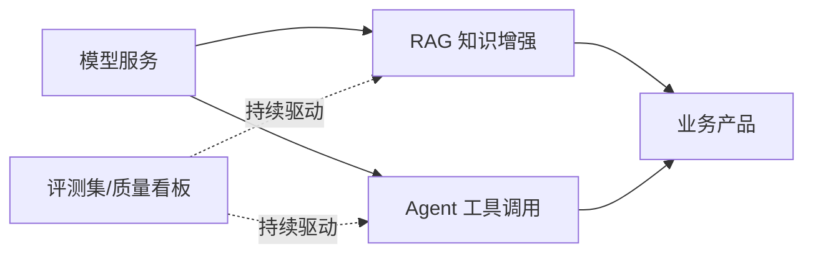

# 大模型应用

> 应用层把模型能力工程化为业务价值。这一层的主题只有一个：**把概率性的模型输出，包进确定性的工程系统**——知识增强（RAG）解决"说得对"，Agent 解决"做得了"，评测与运营解决"持续可靠"。

## 文章列表

| 文章 | 状态 | 说明 |
| --- | --- | --- |
| [企业级 RAG 架构设计](/ai/application/rag-architecture) | ✅ 已发布 | 解析/切分/混合检索/重排/评测全链路 |
| [Agent 与 MCP](/ai/application/agent) | 🚧 提纲 | Function Calling、工具编排、落地边界 |

## 子域地图

## 计划扩充方向

- Prompt 工程的系统化方法（模板、版本化、回归测试）
- 大模型应用的评测体系设计（离线评测集 + 线上质量监控）
- 多模型路由与降级策略
- AI 应用的安全基线（提示注入、数据泄露、内容合规）

## 衔接

- 上游：[推理与算力](/ai/inference/) · [模型训练](/ai/training/)
