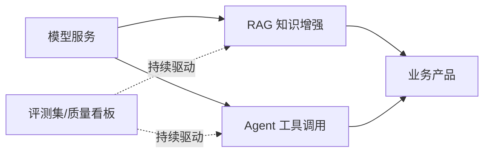

# 大模型应用

> 应用层把模型能力工程化为业务价值。这一层的主题只有一个：**把概率性的模型输出，包进确定性的工程系统**——知识增强（RAG）解决"说得对"，Agent 解决"做得了"，评测与运营解决"持续可靠"。

## 文章列表

| 文章 | 状态 | 说明 |
| --- | --- | --- |
| [企业级 RAG 架构设计](/ai/application/rag-architecture) | 已发布 | 解析/切分/混合检索/重排/评测全链路 |
| [Agent 与 MCP](/agentic/) | 提纲 | Function Calling、工具编排、落地边界 |
| [多模态模型与视频生成](/ai/application/multimodal) | 已发布 | 文生视频/图生视频、评测与本地部署路线 |

## 子域地图

## 计划扩充方向

- Prompt 工程的系统化方法（模板、版本化、回归测试）
- 大模型应用的评测体系设计（离线评测集 + 线上质量监控）
- 多模型路由与降级策略
- AI 应用的安全基线（提示注入、数据泄露、内容合规）

## 精选资源

> 筛选标准：官方与一手来源优先，近两年内容优先，经典明确标注。更新于 2026-09-01。

### RAG

- [Contextual Retrieval in AI Systems](https://www.anthropic.com/engineering/contextual-retrieval) — 上下文嵌入 + BM25 混合检索的生产调优，大幅降低检索失败（2024 · 工程博客）
- [Retrieval-Augmented Generation for LLMs: A Survey](https://arxiv.org/abs/2312.10997) — 系统综述 RAG 三大范式与优化方向（2023 · 论文）
- [从零搭建企业私有知识库：RAG + 大模型实战](https://developer.aliyun.com/article/1726467) — 十万级文档知识库生产落地复盘，含分块重排与踩坑（2026 · 工程博客）
- [Ragas Documentation](https://docs.ragas.io/en/stable/) — faithfulness 等指标的官方文档，无参考自动化评测（2025 · 官方文档）

### Prompt 工程

- [Prompt Engineering Guide（中文版）](https://www.promptingguide.ai/zh) — 最权威的提示工程教程中文版（持续更新 · 课程教程）

### 安全

- [OWASP Top 10 for LLM Applications 2025](https://genai.owasp.org/resource/owasp-top-10-for-llm-applications-2025/) — LLM 应用十大风险权威清单（2025 · 行业报告）
- [The lethal trifecta for AI agents](https://simonwillison.net/2025/Jun/16/the-lethal-trifecta/) — 点明提示注入风险三要素与防御思路（2025 · 工程博客）
- [提示词注入攻击方法与多模型纵深防御架构](https://developer.aliyun.com/article/1667146) — 中文系统梳理攻击手法与纵深防御（2025 · 工程博客）

> Agent 相关资源（MCP、框架、评测）统一收录于 [Agentic 支柱](/agentic/)。

### 评测与知识生态（2026-09-02 书签补充）

- [LMArena Leaderboard](https://lmarena.ai/leaderboard) — 众包对战式模型评测榜单（持续更新 · 行业报告）
- [通往 AGI 之路](https://waytoagi.feishu.cn/) — 社区共建的 AI 学习知识库（持续更新 · 课程教程）

### 合规与备案（2026-09-02 书签补充）

- [关于发布生成式人工智能服务已备案信息的公告](https://www.cac.gov.cn/2024-04/02/c_1713729983803145.htm) — 网信办大模型备案官方公告（2024 · 官方文档）
- [互联网信息服务算法备案系统](https://beian.cac.gov.cn/) — 算法与大模型备案入口（持续更新 · 官方文档）
- [大模型备案 VS 算法备案的区别和联系](https://cloud.tencent.com/developer/article/2538592) — 两类备案的适用边界解读（2025 · 工程博客）

## 衔接

- 上游：[推理与算力](/ai/infra/inference/) · [模型训练](/ai/infra/training)
