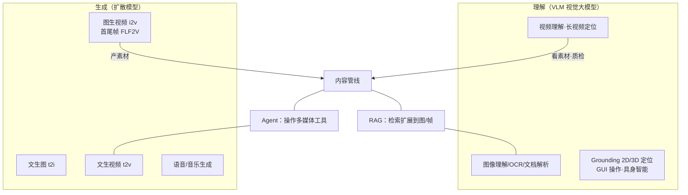
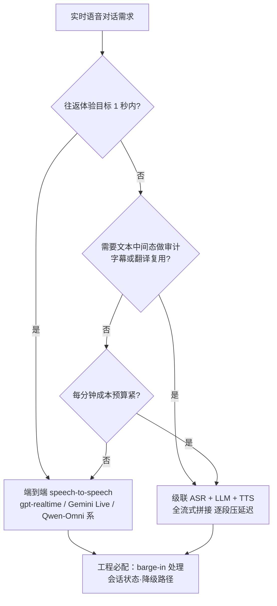
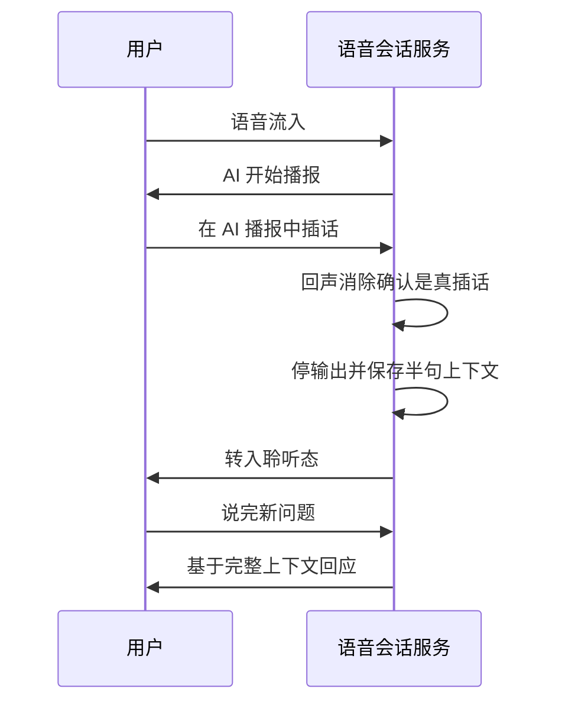
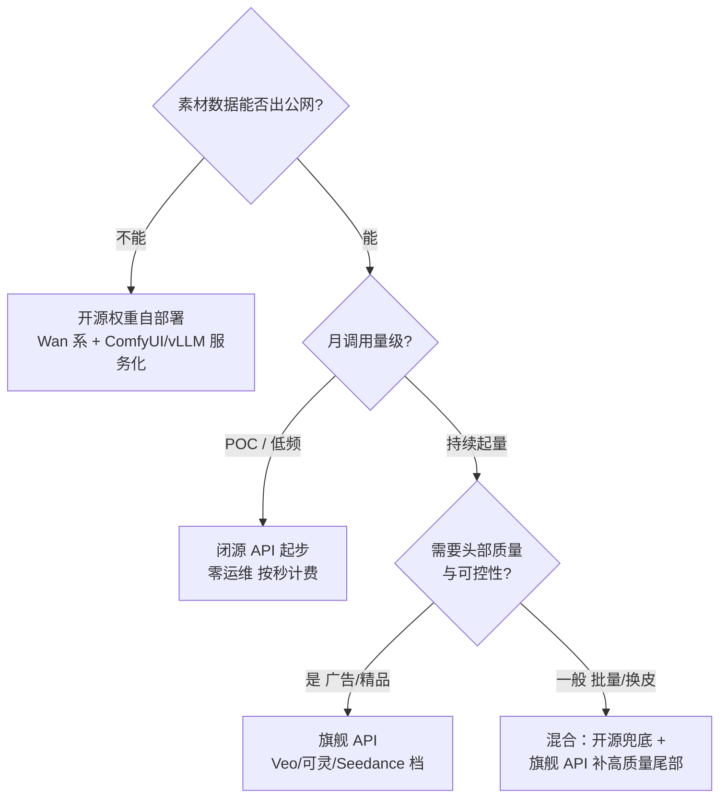

# 多模态应用

> 这篇写给两类人：正在评估"哪些多模态能力能进我们产品"的技术负责人，和准备把图像/视频/语音模型接进业务管线的工程师。全文站在**应用层**：视觉问答、文档智能、视频理解、实时语音、数字人、GUI Agent、多模态检索这七种产品形态，各自的输入输出、典型架构与成本特征是什么；实时语音的级联与端到端两条路线怎么在延迟、可控性、成本三角里选；图像/视频 token、语音往返延迟、视频生成 GPU 秒、多模态检索存储这四笔账分别怎么算。模型层原理（VLM 怎么看、TTS 怎么发声、扩散模型怎么画）不在本篇展开，按需跳转站内四篇模型架构文章。能力表述均**截至 2026-09**，这个领域三个月一变，请以榜单和官方文档的实时状态为准。

## 应用层版图：从"能对话"到"能看、能听、能操作"

大模型应用的主战场，正在从"对话 + 检索"扩展到图像/视频/语音的生成与理解。我体感最明显的变化是：前两年客户问的是"文档问答怎么接"，2026 年以来问"一条产品视频能不能自动生成""监控视频能不能直接看懂并报警""电话客服能不能换成 AI 语音"的比例明显上来了。


*图源：Wikimedia Commons（[文件页](https://commons.wikimedia.org/wiki/File:Astronaut_Riding_a_Horse_(SD3.5).webp)，CC0）*

关键认知是：**多模态不是替代 RAG/Agent，而是把"输入输出的形态"扩展了**。检索可以检图检视频帧，Agent 可以操作多媒体管线——理解（VLM）和生成（扩散模型）是两棵独立演进的技术树，在应用层交汇。再补一句应用层的共识骨架：七种形态几乎都是"感知编码器 → 统一 token 空间 → LLM 推理 → 模态输出头"这条主干的变体，**产品之间的差异不在主干，而在输入输出组合，以及哪一项成本占主导**。

为什么拐点在 2025–2026？我的归因是四条同时成熟：长上下文把"整段视频/整本扫描档塞进一次请求"变成可行选项；原生音频进出让实时语音跳过级联延迟墙；视频生成的单秒成本两年降了一个量级，素材工业化第一次算得过来账；轻量专用 VLM（1–4B）把文档解析的单页成本压到管线级别。四条里任何一条单独出现都不够，合在一起才让"多模态进产品"从演示走向排期。



把七种常见应用形态摊开看，选型时先对号入座：

| 应用形态 | 典型输入 | 典型输出 | 典型架构 | 成本特征（谁占主导） |
| --- | --- | --- | --- | --- |
| 视觉问答 / 图像理解 | 图片 + 问题 | 文本 / 坐标框 | 单次 VLM 调用，或 VLM + 工具 | 输入图像 token，随分辨率近线性 |
| 文档智能 | PDF / 扫描件 / 拍照件 | 结构化 JSON / Markdown | 解析模型（管线或 VLM 直读）→ 下游 LLM | 按页算力，可离线批量、可削峰 |
| 视频理解 / 摘要 / 事件定位 | 视频（含音轨） | 摘要 / 带时间戳事件 | 抽帧 VLM，或 agentic video 按需取帧 | 视频秒数折 token，长视频是成本杀手 |
| 实时语音对话 | 麦克风流 | 扬声器流（+ 文本留痕） | 级联 ASR+LLM+TTS，或端到端 speech-to-speech | 每分钟音频 token + 并发会话数 |
| 数字人 / 实时化身 | 文本 / 语音 | 带口型的视频流 | TTS + 驱动渲染，或端到端视频生成 | 渲染或生成 GPU 秒，七形态里最贵 |
| GUI Agent | 屏幕截图流 | 动作序列（点击/键入） | VLM 循环 + 执行器 | 截图 token × 步数，随任务长度线性涨 |
| 多模态检索 | 图 / 文查询 | 图片 / 文档页 / 视频片段 | 双塔编码器，或迟交互多向量索引 | 离线索引算力 + 向量存储 |

七种形态各补一句一线注记（截至 2026-09 的成熟度体感）：

- **视觉问答**：最成熟，单模型直连即可上线，竞争点在预处理与 prompt 模板；
- **文档智能**：解析能力已商品化，差异在字段级校验与输入治理的厚度；
- **视频理解**：分钟级可用，小时级靠 agentic 取帧与两级读法，事件定位精度仍要人工复核兜底；
- **实时语音**：体验已过"能用"线，工程难点全在打断、设备侧与成本；
- **数字人**：技术可行但成本最高，多数需求其实止步于"语音 + 轻驱动"；
- **GUI Agent**：内部固定版式系统可用，开放场景可靠性不足，慎对外承诺；
- **多模态检索**：页图多向量路线效果已验证，落地瓶颈在存储与增量治理。

### 三种组装模式：直连、工具循环、管线编排

七种形态落到代码上，组装方式其实只有三种：

| 组装模式 | 结构 | 适用形态 | 典型失败模式 |
| --- | --- | --- | --- |
| 单模型直连 | 一次 API 调用，进图/音/视频，出结果 | 视觉问答、文档直读、视频摘要 | 把模型能力上限当产品上限，没有校验环 |
| 模型 + 工具循环 | 模型自己决定调什么观察工具（取帧/检索/截图/取转写） | agentic video、GUI Agent、深度调研类 | 循环不收敛、步数失控、成本不可估 |
| 管线编排 | 固定 DAG，模型只是图中一个节点 | 文档智能、语音级联、内容产线 | 错误级联；换节点要重调上下游 |

我的经验顺序是：**直连起步验证需求真实性，精度撞墙再升级工具循环，流程稳定后固化为管线**；反过来一上来就搭大管线，是多模态项目最常见的架构浪费。判断"直连是否撞墙"的信号也简单：bad case 里"没看清/没听清"的占比超过"没想清"时，就该加观察工具而不是换更大的模型。

立项时我会先逼业务方回答三个问题，答不上来的项目大概率半年后静默死亡：**这个模态的信息是不可替代的吗**（截图里的报错信息，转成文字喂文本模型行不行？多数时候行，那就别上视觉）；**错误的代价是什么**（读错一个字段是重跑还是赔钱，决定校验链路的厚度）；**成本天花板在哪**（按第几节的账先算单件成本，再乘业务量，超天花板的需求要在立项时砍形态而不是上线后砍质量）。

分工边界先说清楚：模型层的"为什么能看、能听、能画"由站内四篇覆盖——[视觉理解模型](/ai/models/vision)、[语音识别与理解](/ai/models/audio)、[视频生成](/ai/models/video-gen)、[语音生成](/ai/models/speech-gen)。本篇只讲"怎么组装成产品"，架构细节只在它直接影响工程决策时才点一句。

## 实时语音应用专节：两条架构与延迟三角

### 级联管线：过去十年的默认路线


*图源：Google Cloud 官方博客 How to use Gemini Live API native audio in Vertex AI（[链接](https://cloud.google.com/blog/topics/developers-practitioners/how-to-use-gemini-live-api-native-audio-in-vertex-ai)）*

上图上排就是级联（cascade）架构：STT → LLM → TTS 三段，**段与段之间各是一个延迟点**——VAD 判停、ASR 出最终转写、LLM 首 token、TTS 首包，四笔延迟串行相加。工程上每一段都可以流式化（流式 ASR 出 partial 转写、LLM 流式首 token、流式 TTS 首句出声）把往返压到 1.2–2 秒量级，但结构上限就在那里。级联的真正优势不在延迟，而在**每一段可替换、可审计**：文本中间态可以留痕过合规审核、复用为字幕与翻译、单独替换某一段模型（比如换更便宜的 ASR）。劣势同样明显：错误串行传播（ASR 听错一个字，LLM 就答错方向），韵律与情绪在文本中间态丢失，全双工打断要自己在三个组件之间拼 VAD 与 barge-in 逻辑。

级联路线把延迟压进 1.5 秒内的常规优化清单，按收益排序：**partial 转写先行**（ASR 的中间结果边出边送 LLM 做预热，不等最终转写）；**TTS 首包最小句**（首段切分粒度调小，先出声再补全）；**判停与推理重叠**（VAD 静音窗内提前触发 LLM）；**缓存高频问答**（客服场景头部问题集中，命中缓存可跳过 LLM 整段）。四件事做完仍达不到体验目标，才轮到考虑换端到端——这个顺序能省很多钱。

### 端到端 speech-to-speech：2025–2026 的主推路线

闭源侧，OpenAI 的 Realtime API 从 2024 年 preview 走到 2025-08 的 gpt-realtime GA，2026 年又迭代到 gpt-realtime-2 / 2.1（把推理能力带进实时语音，官方口径 p95 延迟再降四分之一以上）；Google 的 Gemini Live API 提供原生音频进出的双向流式会话（见上图下排）。开源侧有两类代表：


*图源：Moshi 论文图 1（[arXiv:2410.00037](https://arxiv.org/abs/2410.00037)）*

Moshi 的关键设计是**双流并行**：同时建模"用户的音频流"和"自己的音频流"，再叠一条与语音时间对齐的 Inner Monologue 文本流提升语言质量——这让它不需要等用户说完就能边听边说，理论延迟 160ms、实测约 200ms，是第一个公开的全双工实时语音 LLM。


*图源：Qwen3-Omni 技术报告概览图（[arXiv:2509.17765](https://arxiv.org/abs/2509.17765)，已缩至 1200px）*

Qwen3-Omni 的 Thinker-Talker 分工是另一种端到端思路：Thinker（MoE）吃文本/图像/音频/视频并产出文本与隐状态，Talker 把隐状态实时转成语音 codec token 流式出声，避免"先出文本再合成"的级联延迟；30B-A3B 权重开源（Apache 系许可），支持 119 种语言文本、19 种语言语音。2026 年阿里云百炼上的旗舰已演进到 Qwen3.5-Omni，实时语音交互是标准能力。

### 两条路线怎么比：延迟、可控性、成本三角

| 维度 | 级联 ASR + LLM + TTS | 端到端 speech-to-speech | 工程含义 |
| --- | --- | --- | --- |
| 往返延迟 | 1.2–2s（全流式优化后） | 约 0.3–1.3s（官方与第三方实测区间） | 对话感要求 1 秒内回应时，级联基本到头了 |
| 全双工打断 | 自研 VAD + barge-in，逻辑分散在三段 | 原生支持，模型边说边听 | 级联的打断状态机是线上 bug 第一来源 |
| 可控性与审计 | 文本中间态全留痕，可分段审核 | 音频进音频出，留痕依赖模型附带转写 | 强合规行业（金融/政务/医疗）默认级联或双写留痕 |
| 工具调用 / RAG | 天然顺畅（中间就是文本 LLM） | 已支持（gpt-realtime 系带 function calling / MCP）但调试更绕 | 工具密集场景（查单、下单）级联仍更稳 |
| 韵律与情绪 | 文本中间态丢失，靠 TTS 补偿 | 端到端保留，能"听出情绪再回应" | 陪伴、安抚、营销外呼类体验差异明显 |
| 每分钟成本量级 | ASR/TTS 按分钟计费 + LLM 文本 token，组合可压到分级 | 音频 token 单价为文本 token 数十倍，分钟成本高一档 | 高频低价值场景级联赢；体验即卖点的场景端到端赢 |
| 工程量 | 三个服务 + 编排 + 打断状态机 | 一条 WebSocket 会话 + 会话状态 | 级联运维复杂度高，端到端厂商锁定深 |

我的默认判断：**客服/外呼等"流程型"语音先上级联**（可控、可审计、成本可算），**陪伴/口语陪练/实时翻译等"体验型"语音直接端到端**，别在流程型场景里为 300ms 延迟付十倍成本。

### 全双工与打断处理：体验的分水岭

- **判停不等于判完**。用"用户静音 500ms"当轮次结束，会被呼吸、思考停顿频繁误触发；工程上要叠加语义完整性判断（endpointing 模型或 LLM 二次确认），误触发率才能压到可接受。
- **barge-in（用户插话）要当一等公民**。端到端模型原生边说边听；级联架构要做播放端回声消除 + 能量检测 + 三段联动停播，任何一段漏了都会出现"AI 自说自话"的事故。
- **会话状态与降级路径**。实时会话的历史在服务端（session 对象），断线重连要能续；端到端服务抖动时要有降级路径（退回级联或纯文本），别让一条语音链路的故障变成整产品不可用。



语音链路的成本账单独算一节：gpt-realtime-2.1 的音频输入约 $32/百万 token（缓存命中 $0.40）、音频输出 $64/百万 token，2.1-mini 降到 $10/$20；按分钟计费的旁路模型更直观——实时翻译约 $0.034/分钟、转写约 $0.017/分钟（官方口径，截至 2026-09）。级联组合的每分钟成本则是"转写分级 + 文本 token + TTS 分钟价"三段相加，量级上可以比端到端低一个档位。**做预算时按"会话分钟数 × 说话占比"估，而不是按请求数估**——静音和等待也占着会话。

### 延迟预算表：往返一秒是怎么花掉的

把两条路线的往返延迟拆到段，给一份预算分配参考（量级值，全流式配置，综合公开实测与我的项目经验）：

| 环节 | 级联参考值 | 说明 |
| --- | --- | --- |
| VAD / 判停 | 300–600ms | 最大的"隐形延迟"，语义 endpointing 可调低但误判率上升 |
| ASR 出最终转写 | 200–500ms | 用 partial 转写先行送 LLM 可与之重叠 |
| LLM 首 token | 300–800ms | 取决于模型档位与是否开推理；推理档更慢但答得对 |
| TTS 首包 | 100–300ms | 流式声码器已成熟，路线细节见 [语音生成](/ai/models/speech-gen) |
| 级联合计 | 1.2–2s | 每段都能压，但串行结构下限摆在那里 |
| 端到端单跳 | 0.3–1.3s | 含模型自身判停；开推理档上浮明显 |

这张表的用法是**做预算而不是做承诺**：立项时先问产品"可接受往返是多少"，再倒推每段允许花多少，超预算的段要么换档要么换路线。

### 打断时序：barge-in 的状态机



这条时序里三个容易漏的工程点：**回声消除必须排除 AI 自己的播报**（否则模型听到自己的声音继续接话，出现"自问自答"事故）；停播后**半句内容要进会话历史**，否则用户追问"我刚才说的那个"时上下文断裂；聆听态切换要瞬时完成，停顿超过两百毫秒用户就会觉得"反应慢"，哪怕后面回答得很快。

### 每分钟成本算例

以一通 10 分钟的客服通话做量级算例（截至 2026-09 公开单价）：级联组合 = 转写（$0.017/分钟量级的实时转写，或更低的批量价）+ 对话文本 token（千级）+ TTS（分/角级分钟价），合计**角级**；端到端旗舰档按音频 token 单价折，单通会话在**一元到数美元量级**（取决于说话占比与是否开推理），mini 档约降到三分之一。两条路线的体验差与成本差同量级存在，所以选型会上我总是先问一句：**这通电话每分钟值多少钱？** 高价值场景（转化、挽留）付得起端到端的溢价，通知回访类场景付不起。

### 设备侧：语音输入的半边工程

服务端架构选对了，体验仍可能死在设备侧。实时语音项目的设备侧清单：采样率与编码统一（16kHz/Opus 一类，全链路只转换一次）；**播放端回声消除**（网页端用 WebRTC 的 AEC，电话侧靠运营商链路）；噪声抑制按场景开关（呼叫中心要开，录音棚素材别开）；网络抖动缓冲（jitter buffer 20–60ms 量级，太小卡顿、太大加延迟）；以及断网重连后的会话续接。我的经验是：**语音项目的线上事故约一半在设备与网络侧**，立项时就要把端上 SDK 的选型和测试机矩阵排进计划。

模型层细节跳转 [语音识别与理解](/ai/models/audio) 与 [语音生成](/ai/models/speech-gen)。

### 语音应用的权利与标识红线

语音是七种形态里合规约束最密的一个，立项期就要拉进方案：**声音授权**——克隆或复刻真人音色必须取得书面授权，客服场景用合成音色也要在话术里告知对方是 AI；**深度合成标识**——AI 生成语音在外呼与广播场景的标识义务，多数司法辖区已落地；**录音留存**——客服类会话录音的留存期限与调阅权限按行业监管走，文本留痕与音频留痕要同策略管理。我的习惯是把这三条写进架构文档的"非功能需求"一节，而不是留给法务在上线前一周提——那时改架构的代价是十倍。

### 多语言与方言的现实约束

跨语言语音项目里，模型宣传的语言列表和一线表现是两回事：旗舰模型的中英文体验差距已经很小，但**方言与口音仍是重灾区**（ASR 端尤其明显，端到端模型则表现为"听懂了但回应语气错位"）；小语种的 TTS 音色选择极少，常常只有单一默认音色可用。我的做法是立项时就用目标人群的真实录音（而不是标准普通话样本）做一轮摸底评测，把方言支持度写进验收标准；不支持的语言/方言直接在产品入口做语种检测与降级提示，比让用户听错答案体面得多。

### 电话信道：被忽视的最差输入环境

语音应用里电话信道（SIP/PSTN 外呼与热线）是最差的输入环境：8kHz 采样、信道噪声、压缩失真叠加，ASR 错误率比网页端高一个档位；端到端模型同样受输入质量拖累。工程对策：入口做 8k→16k 上采样与信道均衡（不能指望模型自己补）；话术设计避开易混词（数字逐字复述确认）；关键信息（单号、金额）强制二次确认而不是依赖单次识别。gpt-realtime 系已原生支持 SIP 接入，把"电话线路"变成一条 API 会话，但**信道质量不会因为接了旗舰模型而变好**——电话场景的验收集必须用真实线路录音构建。

## 视觉应用工程：先算 token 账

### 三家计费口径对照

理解侧（VLM）的成本模型是输入 token 账，四家官方口径（截至 2026-09）：

| 供给方 | 图像 token 规则 | 视频 token 规则 | 工程含义 |
| --- | --- | --- | --- |
| OpenAI（Responses API 系） | 按 patch/tile 折 token，`detail: low` 只计基础 token（百级/图）；有效处理长边约 1568px，**再高清也会被降采样** | 抽帧为图像序列 | 原图直喂是浪费，进管线前先降采样 |
| Google Gemini | Gemini 3 起按 part 设媒体分辨率档：LOW 280 / MEDIUM 560 / HIGH 1120 token/图；老版本按 768×768 tile 每块 258 token | 静态采样约 263 token/秒（音轨 32 token/秒）；agentic video 按需取帧，官方称最多省 88% token | 同请求混档：复杂图表用 HIGH、缩略图用 LOW |
| Anthropic Claude | token 约等于 宽 × 高 ÷ 750；老模型长边上限 1568px，新模型开放高分辨率（长边 2576px 量级），单图封顶约四千余 token | 无原生视频输入，抽帧为图像序列 | 成本与像素面积线性相关，降采样是第一成本杠杆 |
| Qwen3-VL / 百炼 | 动态分辨率 | 原生 256K（可扩 1M）上下文，小时级视频、秒级事件定位；OCR 30+ 语言、2D/3D grounding | 长视频任务优先选"视频原生 token 机制"的模型 |

### 一笔账：分辨率策略对账单的影响

拿一张 3840×2160 的截图或照片举例：按 Claude 老口径先降到 1568 长边（1568×882 ≈ 138 万像素），约折 1800 token；同一张图在 Gemini 走 HIGH 档固定 1120 token、LOW 档 280 token。**如果任务只是"图里有什么"级别的问答，LOW/中档足够，与 HIGH 档差 4–6 倍成本；如果任务要读小字（票据字段、代码截图、合同条款），低档就是拿精度换钱，必须用高档或原分辨率。** 我的经验规则是：按任务类型先定"最小可读分辨率"，在进模型前的管线里统一降采样并缓存，而不是把原始分辨率甩给 API 让它替你降——后者既按高档收钱，又拿不到档位控制权。

坐标类任务（grounding）沿用我的一贯做法：**先做分辨率归一化再喂模型**，各家对输入分辨率的有效上限都远低于摄像头原始分辨率，按原图喂既烧 token 又掉精度；模型返回的坐标按归一化尺寸反算回原图。

把上面的算例固化成一张速查表（单张 3840×2160 图像，量级值按各家公开计量规则折算）：

| 处理策略 | 约折 token | 适用任务 |
| --- | --- | --- |
| 原图直喂（若 API 不收降采样费） | 万级 | 几乎从不必要 |
| 降至 1568 长边（Claude 老口径面积公式） | 约 1800 | 中等字号文本、UI 截图 |
| Gemini HIGH 档 | 1120 | 小字、密集图表、证照字段 |
| Gemini MEDIUM 档 | 560 | 常规问答、物体与场景识别 |
| Gemini LOW 档 | 280 | 分类、缩略图筛选、有无判断 |

图像进模型前的预处理三件事，我在每个项目里都做成管线固定动作：方向矫正（按 EXIF 旋转位归正，否则手机竖拍图全部横躺进模型）；按任务档位压长边并**缓存压缩版本**（同会话复用，避免重复计费）；grounding 任务保留原图尺寸元数据用于反算：

```text
model_box → 原图 box 反算
scale = 原图长边 / 输入长边
x_orig = x_model × scale
y_orig = y_model × scale
若 API 返回 0-1000 归一化坐标：
x_orig = x_norm × 原图宽 / 1000
```

### 视频输入的三种供给形态

| 供给形态 | 做法 | 成本特征 | 适用 |
| --- | --- | --- | --- |
| API 原生视频 | 整段上传，模型内部采样（含音轨） | 按视频秒数折 token，简单省心 | 分钟级以内、事件不稀疏的素材 |
| 自抽帧 | 管线里按 fps/关键帧抽图，多图进请求 | 帧率自己控，可配缓存与复用 | 需要固定采样策略做回归评测时 |
| agentic 按需取帧 | 模型调 get_frames 一类工具自己看 | token 最省（官方称至多省 88%），延迟与调试成本上升 | 小时级长视频、事件稀疏的监控/会议素材 |

选型经验：**评测集阶段用自抽帧**（采样策略固定才可复现），**生产长视频用 agentic 或两级读法**，短视频和营销素材直接原生视频最省事。

### 视觉 prompt 与结构化输出

图像任务的 prompt 工程比文本更吃"问法"。三条一线有效的做法：**指定观察顺序**（"先读表头，再逐行读数据列"比"总结这张表"的字段正确率高出一档）；**要求先描述后结论**（让模型先列举它看到的元素再回答，能显著压低"没看就答"的幻觉）；**输出结构化**（JSON schema 或固定字段模板，配合服务端校验重试一次，比自由文本后处理稳定得多）。多图请求里还要显式编号引用（"图 2 中的仪表读数"），否则模型对图片顺序的指代并不可靠。

### 理解与生成的最小闭环

理解侧和生成侧在应用层的第一个交汇点，是**生成前分镜理解 + 生成后质检打分**的闭环：VLM 先把素材/脚本拆成分镜意图，视频或图像模型按分镜生成，VLM 再对产物逐条打分（主体一致性、构图、是否违和）过滤不合格品。这条闭环不依赖任何未公开能力，今天就能搭，且直接改善"可用率"这个真 KPI；多数自称"多模态 Agent"的产品，拆开看就是这条闭环加了编排外壳。

### 多图与视频的上下文管理

- **多图不是越多越好**。token 线性累加之外还有注意力稀释：单请求图片数上去后，中间位置图片的被引用率明显下降（位置偏差）。经验做法：关键图前置、单次请求控制在个位数、大批量图拆请求或用检索先筛。
- **视频采样三策略**：均匀抽帧（便宜但漏瞬时事件）、关键帧（场景切分/运动检测驱动）、agentic 按需取帧（模型自己决定看哪段）。


*图源：Google 官方博客 Introducing agentic video understanding with Gemini（[链接](https://blog.google/innovation-and-ai/models-and-research/gemini-models/introducing-agentic-video-in-gemini/)）*

- **长视频两级读法**：先低帧率粗扫出摘要与候选时间段，再对命中段高帧率精读。小时级监控/会议素材用这个套路，token 账能压一个量级，且不漏事件——比自己均匀抽帧便宜，比全量塞上下文可行。

## 文档智能：复杂文档的两条路线


*图源：NVIDIA 官方博客 Turn Complex Documents into Usable Data with VLM（[链接](https://developer.nvidia.com/blog/turn-complex-documents-into-usable-data-with-vlm-nvidia-nemotron-parse-1-1/)）*

**管线路线**：版面分析 → 文本检测/识别（OCR）→ 表格识别 → 阅读顺序恢复 → 结构化输出。代表是 PP-StructureV2 一类开源产线和各云厂商的文档智能 API。优点是输出确定、每段可单独替换调优、规模化后单页成本最低；缺点是错误级联（版面切错一块，后面全错），对印章、手写、竖排、复杂合并单元格这类"长尾版式"要靠规则打补丁，管线维护本身是一份长期工作量。

**VLM 直读路线**：整页图像端到端出 Markdown/JSON（上图即典型结构：视觉编码器 → 压缩 → 解码出文本+框+类别）。2025–2026 的主流形态是**轻量化专用 VLM**（1–4B 参数，如 MinerU2.5、PaddleOCR-VL、Qianfan-OCR、OvisOCR2 等），在 OmniDocBench 一类端到端还原评测上追平甚至超过大得多的通用模型。优点是版式鲁棒、一个模型覆盖表格/公式/印章；缺点是幻觉（读出页面上不存在的字）、输出格式漂移（Markdown 结构不稳）、单页算力高于成熟管线。

| 场景 | 我的默认选择 | 理由 |
| --- | --- | --- |
| 百万页级档案数字化 | 成熟管线或轻量直读模型 | 单页成本与吞吐主导，版式分布稳定 |
| 长尾版式（印章/手写/竖排/嵌套表格） | VLM 直读 + 规则校验 | 管线的错误级联在这里不可控 |
| 字段级精确（票据/证照入库） | 直读 + 小 OCR 复核双路投票 | 单路幻觉在字段级不可接受 |
| 下游是 RAG 检索 | 直读出 Markdown，或页图直接进视觉索引 | 取决于检索路线，见下一节 |

一线结论：**混合是常态**——VLM 负责解析，关键字段用字典/规则/小 OCR 复核；纯任一路径上线的文档项目，我还没见过不返工的。

字段级校验不需要复杂，我项目里常用的规则集就三层：

```text
第 1 层 格式校验：日期/金额/证号过格式与校验位规则
第 2 层 字典校验：机构名、品类码、币种命中主数据字典
第 3 层 交叉校验：同一字段取两路结果（VLM 直读 + 小 OCR）
        一致才入库；不一致进人工复核队列，不猜
```

三层跑下来，入库字段的错误率可以压到人工抽检水平，而人工只碰不一致的尾部——这是"幻觉当工程问题处理"在文档场景的具体形态。

再补一句评测口径：2025–2026 年文档解析的主流基准已从"检测框指标"转向**端到端还原能力**（OmniDocBench 一类：文本、表格、公式、阅读顺序是否整体还原正确）。对比产品或开源模型时先看它的榜单量的是什么——检测框指标第一的模型，可能一张复杂合并单元格表格都还原不对；反过来，端到端还原强的模型在纯 OCR 文字流场景未必比成熟管线划算。

输入治理是文档项目里最被低估的一环：**扫描件 DPI 有下限**（经验上正文低于 150 DPI 时任何路线的错误率都陡增，拍照件还要过歪斜与阴影检测）；彩色印章与黑色文字叠压的页面要单独建评测子类；多语言混排文档要在入口就分流模型档位。我的经验是：文档智能项目一半的"模型不行"，追到最后是"输入不行"——先把输入治理做好，再谈换模型。

## 多模态 RAG：图文混合索引、以图搜图、视频检索


*图源：ColPali 论文图 1（[arXiv:2407.01449](https://arxiv.org/abs/2407.01449)）*

传统图文检索要先跑 OCR → 版面 → 切块 → 文本嵌入的离线管线，图表、版式信息在 OCR 那一步就丢了。ColPali 一类视觉检索的做法是：**页面渲染成图直接进 VLM，每个 patch 出一个向量（多向量表示），检索时用 ColBERT 式迟交互（MaxSim）**——查询的每个 token 向量去和页面所有 patch 向量找最相似者再求和。上图的数字很说明问题：离线索引每页从 7.22 秒降到 0.39 秒，ViDoRe 基准 nDCG@5 从 0.66 升到 0.81，整条 OCR 管线直接消失。

代价在存储：每页约千条 128 维向量，比单向量文本索引重两个量级；亿页级库要做二值量化或单向量近似（MUVERA 一类），经验上换约 2 个 nDCG 点。**先算存储账再选路线**，这是多模态 RAG 和文本 RAG 最大的工程差异。

MaxSim 的打分公式写出来只有一行（查询 q、页面 P）：

```text
score(q, P) = Σ_i max_j cos(E_q[i], E_P[j])
即：查询的每个 token 向量 i，
在页面所有 patch 向量里找最相似者 j，取其余弦，最后求和
```

存储账算例：100 万页 × 约 1000 个 patch 向量 × 128 维 × float16（2 字节）≈ **256GB 纯向量**，再加索引结构开销；二值量化（1 bit/维）后压到约十六分之一即 16GB 量级，代价是约 2 个 nDCG 点。**这笔账决定多向量路线在你的机器上能不能落地**——不算就先建索引的团队，通常在建到三分之一时发现内存装不下，再回头改架构。查询侧倒是便宜：单查询几十毫秒级（上图 30ms/query 量级），瓶颈永远在离线索引与存储。

| 检索目标 | 索引路线 | 注意 |
| --- | --- | --- |
| PDF / PPT 页面 | ColPali 系页面多向量 | 版式与图表信息保留，免 OCR 管线 |
| 自然图 / 商品图 | CLIP 系双塔（图文共享空间） | 一图一向量最省，电商/素材库成熟方案 |
| 图内文字（截图/证照/海报） | OCR 文本索引 + 图像嵌入重排 | 双塔对"搜图里的字"这类查询明显偏弱 |
| 视频片段 | 帧级索引 + 时间聚合，或字幕索引 + 帧复核 | 两级粗筛细读，控制召回算力 |

以图搜图在电商与素材库已是成熟能力（CLIP 系双塔），但要提醒一句：双塔空间对细粒度文字不敏感，"搜截图里那段报错信息"必须配 OCR 文本索引。视频检索同理：帧级嵌入命中后按时间相邻聚合成片段，小时级素材库先用 ASR 字幕或低帧率粗索引缩小范围。

增量与版本治理是多模态索引上线后才开始的长期工作：**页级版本化**（文档更新只重嵌变化的页，多向量路线下这能省掉九成重索引算力）；**嵌入模型版本化**（换嵌入模型等于全库重建，要把"双版本并行 + 流量灰度切索引"设计进架构，而不是停服重建）；**删除与合规**（多向量索引的页删除要级联到所有 patch 向量，漏删在合规审计里是事故）。文本 RAG 里这些是常识，多模态 RAG 里因为向量量大、重建贵，每一条的代价都被放大。架构层面的完整讨论见 [企业级 RAG 架构设计](/ai/application/rag-architecture)。

生产里我更推荐**混合检索 + 视觉重排**的组合：第一路文本索引（BM25 或文本向量）保召回下限与可解释性，第二路视觉多向量保版式与图表信息，两路融合后用 VLM 对 top-k 候选页做重排与答案抽取。这个组合的好处是任何一路失效时系统降级而不是失效，且重排阶段只处理几十页，VLM 成本可控。纯视觉单路索引在演示里分数最好看，但我在生产里还没敢单路上过线。

## GUI Agent 与数字人：交互侧的两种形态

### GUI Agent：截图进、动作出


*图源：UI-TARS 论文（[arXiv:2501.12326](https://arxiv.org/abs/2501.12326)）*

GUI Agent 的产品形态是"给一句任务，模型看着屏幕把事办完"。两条供给路线：通用旗舰模型 + computer-use 工具接口（截图与动作作为工具来回传），和**原生 GUI 模型**（UI-TARS 一类：感知/推理/grounding/记忆全在一个 VLM 里，直接输出点击坐标与键入内容）。

一个循环四步，成本与风险都集中在第三步：

| 步骤 | 动作 | 工程要点 |
| --- | --- | --- |
| 1 观察 | 截图 + 压缩/归一化 | 分辨率档位决定 grounding 精度与单步 token |
| 2 思考 | 模型输出 thought + action | 要求结构化输出（JSON/固定语法），便于解析与拦截 |
| 3 执行 | 执行器做 click / type / wait | 动作与域名白名单；不可逆操作转人工确认 |
| 4 校验 | 再截图确认状态变化 | 连续两次状态不变即熔断，防死循环烧钱 |

成本特征是按步计费：一步一张截图加一段推理，一个任务几十步，单任务成本比单轮问答高一个量级。UI-TARS-2（2025-09）引入多轮 RL + 数据飞轮后在游戏套件上约达人类六成水平；截至 2026-09，我看到的落地仍集中在版式固定的内部系统自动化，开放互联网场景的可靠性还不够上桌。编排层细节见 [智能体技术全景](/ai/agent/)。

安全边界要单列：GUI Agent 拿着的是**真实账号的真实权限**，工程上至少做到四层——执行器跑在隔离会话（独立虚拟机/容器/浏览器 profile），与人工环境物理隔离；账号最小权限 + 专用身份（不用员工主账号）；动作白名单（禁止支付、删除、外发类动作或强制人工确认）；全程录屏留痕可回放审计。少任何一层，我都不会建议把它放上生产系统。

### 数字人：成本最高、也最容易过度设计

非实时数字人是成熟管线：TTS 出声（见 [语音生成](/ai/models/speech-gen)）+ 音频驱动面部/口型渲染，或整段端到端视频生成（见 [视频生成](/ai/models/video-gen)）；实时交互数字人则是第二节语音链路 + 驱动渲染的串联，延迟预算要在语音和渲染之间分摊：

| 环节 | 预算（经验量级） |
| --- | --- |
| 语音判停 + 理解 | 300–800ms（与第二节共用） |
| 回应生成 | 与 LLM 首 token 共用 |
| 语音合成首包 | 100–300ms |
| 驱动渲染首帧 | 200–500ms（2D 轻量驱动）/ 秒级（3D 实时渲染） |

四段相加就是用户感知的"首帧反应"，预算超过 2 秒时，脸再真也显得迟钝。成本量级是七种形态里最高的（渲染或生成 GPU 秒持续计费），所以多数场景的真实最优解是"语音 + 2D 轻量驱动"甚至"语音 + 静态形象微动效"——**先验证用户是否真的需要一张脸，再决定要不要付这张脸的账单**。产品化集中的场景是直播口播、客服形象与导览讲解；这三类里，前两类对唇形同步精度要求高（音画不同步比不画更糟），导览类则可以容忍较低帧率。

## 视频生成：从能力到产线

### 两条路线与能力边界

视频生成按输入形态分两条主线：

- **文生视频（t2v）**：文本提示词直接出片，考验模型对镜头语言和运动的理解；
- **图生视频（i2v）**：给一张首帧图让它"动起来"，构图和主体一致性由图锁定，**是目前产品化落地最多的形态**——电商展示、海报动起来、老照片复活全是它。

再往上是**首尾帧控制（FLF2V）**（给首帧和尾帧，模型补中间过渡）和**参考图驱动**（VACE 类可控生成：姿态、深度、Control 视频注入）。我的经验是：纯 t2v 出"能看的一条 5 秒"早已不难，难的是**可重复制品**——同风格、同角色的批量素材，这要靠 i2v + 首尾帧 + 参考图这套控制能力组合，而不是更大的模型。时长和分辨率是另外两条硬边界：主流模型单条生成普遍在 5–10 秒、480P–1080P，"分钟级长视频"多数靠分镜拼接而非端到端生成。

### 闭源与开源并存

- **闭源平台服务**：Google Veo 系、快手可灵、字节 Seedance、OpenAI Sora 系等，API 或直接产品。截至 2026-09，各家第三方横评榜单（如 Artificial Analysis Video Arena）的头部基本被这批闭源旗舰占据，且排名随版本迭代几个月一洗牌——**看榜单一定要看截图日期和分赛道**（带音频/不带音频、有无视频输入是不同分榜）。
- **开源权重**：以阿里通义万相 [Wan2.1/Wan2.2](https://github.com/Wan-Video/Wan2.1)（Apache 2.0）为代表，还有智谱 CogVideoX、海螺 MiniMax 开源版、字节 HunyuanVideo 等。开源阵营这两年追得很猛：Wan2.1 在 VBench 上发布时曾居开源榜首（86%+ 量级），中文提示词原生支持是其差异点之一。模型层原理详见 [视频生成](/ai/models/video-gen)。

选型逻辑与文本模型完全一致——**调用量、数据边界、成本三角**，在本节末用表展开。

### Wan 的技术底座：为什么显存和时间都是大头

Wan2.1 官方 README 给出的架构是三件套：**UMT5-XXL 多语言文本编码器 + 3D 因果 VAE + 全注意力 DiT（扩散 Transformer）**。


*图源：Wan-Video/Wan2.1 官方仓库 README（[assets/video_dit_arch.jpg](https://github.com/Wan-Video/Wan2.1/blob/main/assets/video_dit_arch.jpg)）*

这张图解释了工程上的一切约束：

1. **DiT 是全注意力**，token 数 = 潜空间分辨率 × 帧数，显存与耗时对"时长 × 分辨率"近似线性甚至超线性增长——这就是视频比图像贵一个量级的根因；
2. **UMT5-XXL 编码器本体在 FP16 下约 10GB 量级**，低显存部署时常成为第一瓶颈（社区称 "T5 幽灵显存"），官方与 ComfyUI 教程都推荐换 FP8 量化版或直接 `t5_cpu` 卸载到内存；
3. **官方给出的显存锚点**：T2V-1.3B 仅需约 8.2GB 显存（"兼容几乎所有消费级显卡"），14B 则需 FP8 量化 + offload 才能在 24GB 卡上跑 480P，原生 BF16 720P 是 40GB+ 乃至多卡的负载；多卡可用 FSDP + 序列并行（Ulysses）线性扩容。

### 本地部署路线：ComfyUI + 开源权重

[ComfyUI](https://github.com/comfyanonymous/ComfyUI) 是开源图像/视频模型本地部署的**事实标准工作流框架**：节点式编排，一条"文本编码 → 加载模型 → 采样 → VAE 解码 → 出片"的管线以可视化节点图 + JSON 文件存在，可分享、可版本化、可 API 调用（把 JSON POST 给它的服务端就是最简单的推理服务）。


*图源：comfyanonymous/ComfyUI 官方仓库 README*

Wan 系列从 2.1 起被 ComfyUI **原生支持**，官方文档给出了各任务的示例工作流：[Wan2.2 T2V/I2V](https://docs.comfy.org/zh/tutorials/video/wan/wan2_2)、[FLF2V 首尾帧](https://docs.comfy.org/zh/tutorials/video/wan/wan-flf)、[VACE 可控生成](https://docs.comfy.org/zh/tutorials/video/wan/vace)。入门路径也收敛成了固定动作：升级到最新版 → 工作流模板库搜 "Wan" → 按文档表格把模型文件放到指定目录 → 按显存选规模（官方口径：Wan2.2 的 5B TI2V 版本可下沉到 8GB 显存跑 720P）。

这条路线适合什么？我的判断是两类场景：**数据敏感**（素材不能出内网：未发布产品、医疗/政务影像、客户素材）和 **POC 验证**（先零成本验证效果，再决定买不买 API）。不适合什么：需要头部闭源旗舰同等质量、或弹性波动大的生产流量——那属于拿消费级显卡跟别人的推理集群赛跑。

降门槛的社区生态值得单独一提：GGUF 量化（Q4–Q8 多档）、TeaCache 跳步缓存（约 1.5–2 倍提速）、SageAttention、CPU offload 组合拳下来，**16GB 显存跑 14B 的 480P 短片已是常规操作，甚至 8GB 也能出片**——代价是每条几十分钟起步的等待。

### 提示词与一致性工程

视频生成的"提示词工程"和文本模型不是一回事：它要写的是**镜头语言**（景别、运镜、光线、节奏），而不是需求描述。一线模板是四段式：主体与动作 → 环境与光线 → 镜头与运镜 → 风格与质感约束，每段一句，超出的修饰词多数是噪声。一致性（同角色/同风格批量出片）靠三件套：i2v 锁首帧、参考图/LoRA 锁角色风格、种子与参数固定做回归；**把"可用率"而不是"惊艳度"当 KPI**——批量素材场景里，十条里八条能用比十条里一条封神更值钱。这条也是"素材工业"论断的操作化版本。

最后划一下适用边界，避免过度承诺：视频生成当前适合**短时长、强风格、可人工筛选**的素材生产（电商展示、营销短片、动态海报、教学演示片段），不适合**长叙事、精确物理、多人交互**的成片需求（物理一致性崩坏与角色穿帮在分钟级叙事里会被无限放大）；涉及真人肖像与声音的素材必须走授权链路，涉及新闻纪实类内容则原则上不应使用生成素材。把边界写进产品文档，比上线后公关补救便宜几个数量级。

### 成本结构：按秒计费背后的 GPU 账

闭源 API 按输出秒数计费，截至 2026-09 第三方统计的价差极大：便宜的批量档约 $0.03/秒，头部旗舰高清档 $0.5–0.7/秒，**相差约 20 倍**，且"每条成本"还要乘失败重试率。自部署侧则是显存 × 时长的账单：社区基准里 4090 生成一条 5 秒 480P，1.3B 全优化约 4 分钟，14B 量化优化后约 1–2 分钟，未优化 BF16 是十分钟量级。**单条分钟级的生成时间意味着：视频推理必须异步化（任务队列 + 回调 + 中间态存储），同步请求超时是第一个会撞上的工程坑。** 成本测算方法可以直接复用站内 [GPU 选型与推理成本测算](/ai/infra/inference/gpu-sizing) 的框架，把"每次调用 token 数"换成"每次调用 GPU 秒数"即可。

生产场景的完整链路是：**生成 → 审核 → 转码 → 分发**。内容安全审核（生成结果过机审 + 抽检）和深度合成标识在多数司法辖区是合规必选项，不是可选项；转码与分发就是标准视频云/对象存储的活。架构上值得记住的一点：视频素材体积大、写多读少，**生成节点到存储的带宽和本地暂存盘**容易成为瓶颈，模型 checkpoint（几十 GB）的镜像化/挂载分发也比文本模型重得多。

异步化之后，任务状态机的最小状态集是：pending → queued → generating → post-processing（审核/转码）→ succeeded / failed / cancelled，每个状态带时间戳与重试次数，并**向前端暴露进度百分比与预计完成时间**——否则"是不是卡住了"的客服咨询会淹没值班群。上线前验收清单我给四条，都不难但都致命：同种子素材连生成 20 条看稳定性分布；首尾帧与参考图约束逐条验证；存储与带宽峰值压测；标识与审核链路合规走查。

### 选型：闭源 API vs 开源自部署



| 维度 | 闭源旗舰 API | 开源权重自部署（Wan 类） |
| --- | --- | --- |
| 质量（截至 2026-09） | 头部，横评榜单第一梯队 | 第一梯队边缘，日常素材够用，差距月缩 |
| 数据边界 | 素材出网，需过合规评估 | 全内网，敏感素材唯一解 |
| 单位成本 | 按秒计费，量越大越贵 | 显存+电费+运维，量越大越划算（经验上高频稳定负载的盈亏平衡点通常在数十万条/月量级，需按自身卡型核算） |
| 可控性 | 固定参数集 + 各家的首尾帧/参考图接口 | 权重可微调（LoRA 锁角色/风格），管线全开源可魔改 |
| 弹性 | 天然弹性，扛突发 | 受限于自有 GPU，突发需云上弹性卡池兜底 |
| 工程量 | 一个 HTTP 调用 | 环境、量化、显存编排、任务队列全套 |

我的默认打法：**API 起步验证需求真实性，效果与量级双达标后再评估自部署**，顺序反了大概率养一堆闲置 GPU。两边并行跑同一批评测集（自己的场景素材，不是公开样例）再下结论。

### 开源侧代表能力速览（截至 2026-09，据官方 README/文档）

| 模型 | 规模 | 能力 | 显存锚点 | 备注 |
| --- | --- | --- | --- | --- |
| Wan2.1 T2V/I2V | 1.3B | t2v/i2v，480P | 约 8.2GB（官方） | 消费级入门，速度换质量 |
| Wan2.1 | 14B | t2v/i2v，480P–720P，VBench 开源榜首（发布时） | FP8 约 24GB 起；原生 720P 需 40GB+/多卡 | UMT5 中文原生支持 |
| Wan2.2 | 5B (TI2V) / 14B | t2v + 单模型 i2v，官方口径 5B 在 ComfyUI 可 8GB 显存跑 720P | 5B：8GB 级 | 高压缩 VAE，社区量化/加速生态最全 |
| 其他开源 | — | CogVideoX、HunyuanVideo、LTX 系等 | — | 各有速度/质量取舍，选型时以当周榜单为准 |

[Artificial Analysis 的 I2V/T2V 榜单](https://artificialanalysis.ai/video/leaderboard/image-to-video) 是当前最省事的第三方横评入口：Arena 盲投 Elo + 每秒单价 + 生成速度三个维度并排。使用注意：Elo 是**带时间戳的偏好快照**，受题材分布影响（真人影视风权重高、动漫/产品演示会偏），**用于缩小候选范围可以，用于最终选型必须回到自建评测集**。

## 供给格局与评估（截至 2026-09）

### 旗舰多模态能力矩阵

| 供给方旗舰 | 图像理解 | 视频理解 | 音频理解 | 原生语音输出 / 实时对话 | 差异化注记 |
| --- | --- | --- | --- | --- | --- |
| OpenAI（GPT 系视觉 + gpt-realtime-2.1） | ★★★★★ | 抽帧图像序列 | ★★★★★ | Realtime 系，function calling / MCP / SIP 电话 | 实时语音生态最全，音频 token 单价也最高 |
| Google（Gemini 3.1 Pro + Live API） | ★★★★★（媒体分辨率分档） | 原生视频 token + agentic 取帧 | 原生音频 token（32/秒） | Live API 原生音频，会话上下文 128k | 长视频与超长上下文是王牌 |
| Anthropic（Claude 旗舰系） | ★★★★★（面积计费 + 高分辨率模式） | 抽帧图像序列 | 无原生音频进出 | 无 | 文档/截图/代码场景的视觉强项 |
| 阿里（Qwen3.5-Omni / Qwen3-VL） | ★★★★★ | 小时级视频、秒级定位 | 19 种语言语音 | Qwen-Omni 系实时语音，权重开源 | 开源阵营唯一端到端全模态旗舰 |
| 国产其他（GLM / 豆包 / Kimi 系等） | ★★★★ | ★★★★ | 部分 | 部分实时 | 迭代快，以当周榜单与官方文档为准 |

这张表的使用说明：星级只是"能力是否存在且一线可用"的粗粒度标记，**同档之内的差距要靠自建评测集分辨**；且截至 2026-09，各家旗舰版本号仍在以季度为单位滚动，选型时以官方模型页为准。

理解侧之外，生成侧的供给格局单独说一句：视频生成的头部闭源（Veo 系、可灵、Seedance、Sora 系）与开源（Wan 系等）的差距在以月为单位收窄，但**控制能力的接口形态各家不统一**（首尾帧、参考图、运镜参数的字段设计差异大），做多供给适配层时要把控制能力抽象成自己的中间语义，别直接透传某家的参数集——否则换一家供应商等于重写一遍管线。图像生成侧同理，详见 [图像生成](/ai/models/image-gen) 与 [视频生成](/ai/models/video-gen)。

### 评估难点与幻觉治理

多模态应用的评测比文本难在三处：**输入分布漂移**（分辨率、帧率、文档版式、口音的任何变化都会静默拉低准确率，所以评测集必须连输入预处理一起版本化）；**主观性**（视频生成质量、语音自然度没有客观金标准，Arena Elo 一类偏好分受题材分布影响）；**模态交叉错误难归因**（答错究竟是没看清、没听清还是推理错，要拆模态做消融才能定位）。我的最低配置：20–50 条自己业务的种子用例做固定回归集，每次换模型/换参数跑一遍，比任何公开榜单都可靠。方法论延伸见 [大模型应用评测](/ai/application/evaluation)。

幻觉治理上，多模态有三个高发区：**OCR 幻觉**（读出页面上不存在的小字，票据场景致命）、**视频事件幻觉**（报告没发生过的动作，监控场景致命）、**坐标漂移**（grounding 框偏出目标，GUI/标注场景致命）。对策按成本递增：双路交叉校验（VLM 直读 + 小 OCR 复核）、置信度抽检、grounding 结果回画框人工 spot-check、关键字段字典/规则兜底。**把幻觉当工程问题而不是模型问题**——它不会被"换个更好的模型"消灭，只会被校验链路压到业务可接受的水平。

### 自建回归集与多模态可观测性

自建回归集的最小闭环三步：从线上流量或验收素材里抽 20–50 条真实用例（覆盖正常/边界/对抗三类）；**把输入预处理版本和 prompt 版本一起固化进评测配置**（换了降采样档位就等于换了考卷）；每次模型或参数变更用同一脚本打分，保留分项得分而不只是总分——分项才能归因到模态。这套集合比任何订阅制榜单都值钱，因为它只回答一个问题：这次变更让**我的场景**变好还是变坏。

可观测性上，多模态服务要比文本服务多埋四类指标：**模态用量分布**（图像档位/视频秒数/音频分钟数的分布，账单异常的第一报警源）、**预处理命中率**（降采样缓存命中、抽帧策略分布）、**模态级错误率**（OCR 复核不一致率、grounding 回画框抽检通过率、语音打断误触发率）、**端到端体验指标**（语音往返 P95、数字人首帧反应、视频任务排队时长）。我的经验是：多模态项目的线上事故，绝大多数能在这四类指标里提前一天看到征兆——前提是立项时就把埋点设计进去，而不是事故后补。

### 多模态成本治理四板斧

账单治理按收益排序：**第一，降采样与分档**（第三节的老生常谈，通常是最大单项收益）；**第二，缓存**（图像压缩缓存、语音会话缓存 token、视频粗扫摘要缓存，命中即免重复计费）；**第三，路由分层**（简单请求走小模型/低档，复杂请求才上旗舰，用置信度或规则分流）；**第四，预算熔断**（按租户/功能设日预算与每分钟令牌桶，超限降级而不是超支）。四板斧做完，我经历过的项目账单普遍降三成到一半，且不需要牺牲可感知的质量。成本测算的底层框架复用 [GPU 选型与推理成本测算](/ai/infra/inference/gpu-sizing) 与 [Token 经济学](/ai/infra/inference/token-economics)。

缓存这一板斧里有个多模态特有的坑：**服务端 prompt 缓存对图像前缀同样有效，但要求前缀字节级稳定**。同一张图每次请求重新压缩（JPEG 质量抖动、EXIF 处理差异）会导致缓存全部 miss，账单悄悄翻倍。做法是图像进会话前先落一份规范化字节（固定编码参数、剥离无关元数据），后续请求复用同一份字节——这个小细节在我一个项目里值每月三位数的账单差。

## 常见坑

下表按"视频生成 → 语音 → 视觉 → 检索 → Agent"排序；现象列写的是线上告警或验收会上最先出现的样子，便于对号入座。

| 坑 | 现象 | 根因与对策 |
| --- | --- | --- |
| 只看参数量估显存 | 24GB 卡跑 14B BF16 直接 OOM | 显存大头在激活与注意力，不在权重；上 FP8/GGUF 量化 + T5 offload + VAE tiling 三件套 |
| 低估文本编码器 | 模型"没多大"却吃显存 | UMT5-XXL FP16 约 10GB 量级；换 FP8 编码器或 `t5_cpu` |
| 按同步接口设计 | 网关大面积超时 | 生成一条要分钟级，任务队列 + 轮询/回调 + 断点重试，别拿聊天接口的直觉接视频 |
| 拿榜单当验收 | demo 惊艳、上线拉胯 | Arena Elo 偏影视风；用自己业务的 20–50 条种子用例做固定回归集 |
| 忽视重试率 | 单条成本远超标价 | 抽卡质量不稳，按"可用条数"而非"生成条数"核算成本；预算留 2–3 倍重试 |
| 长视频硬等端到端 | 5 秒以上质量崩坏/失败 | 现阶段长视频=分镜规划 + 逐段生成 + 拼接，段间用首尾帧衔接压一致性 |
| 帧数/分辨率不守规矩 | 生成报错或结果异常 | 各模型对尺寸和帧数有整倍约束（如 Wan 系 4n+1 帧、按 480P/720P 档位），管线里提前校验 |
| 只测文本不管合规 | 上线被要求整改 | 生成内容标识、素材版权链路、肖像与声音授权，评估期就拉进方案而不是上线前补课 |
| VLM 原图直喂 | token 暴涨、坐标漂移 | 先归一化到模型有效分辨率再输入；grounding 结果按原图坐标反算 |
| 级联语音当三个独立服务做 | 打断逻辑全是特例，回声自问自答 | barge-in 状态机收拢到会话层 + 播放端回声消除；体验型场景直接换端到端 |
| 端到端语音当黑盒 | 账单静默超标，事故无文本留痕 | 会话级音频 token 计量与告警；合规场景双写文本留痕并约定降级路径 |
| 多图请求堆量 | 账单涨、准确率反而降 | 注意力位置偏差：关键图前置、单请求控制在个位数、批量先检索筛 |
| ColPali 不算存储账 | 向量存储比文本索引贵两个量级 | 先做二值量化/单向量近似再上线，接受约 2 个 nDCG 点换存储 |
| GUI Agent 无沙箱跑 | 生产环境误操作不可逆 | 执行器动作与域名白名单，关键步骤人工确认，步数预算 + 循环熔断 |

## 实践观点

- **视频生成当前是"素材工业"而不是"成片工业"**。把它接进"批量出素材、人工挑+剪"的管线立刻产生价值；指望一键出成片会失望。
- **i2v 是被低估的产品化钥匙**：真实业务里"一张定稿图"比"一段精准提示词"容易拿到，一致性也从玄学变成了工程问题。
- **开源自部署的价值不在省钱，在数据边界和可控性**。纯算成本时，别忘了把运维、闲置、失败重试都折进去——多数中小流量算下来 API 更便宜，这不丢人。
- **理解与生成会合流**。VLM 做生成前的分镜理解和生成后的质检打分，是现在就能搭的最小闭环，也是多数"多模态 Agent"场景的真身。
- **语音体验的分水岭是打断，不是音色**。用户能容忍略机械的音色，不能容忍"插不上话"；把 barge-in 和判停当核心能力投入，而不是上线后打补丁。
- **多模态 RAG 的第一步往往不是换模型，是换索引**。页图直进视觉索引能省掉整条 OCR 管线，效果与成本同时改善——这是过去两年我在文档场景里回报率最高的一次架构改动。
- **输入治理优先于模型升级**。降采样档位、扫描 DPI、抽帧策略这些"模型之外"的决策，对最终准确率的影响经常大于换一档模型；先把输入版本化，再谈任何对比实验。
- **合规是架构需求而不是上线检查项**。声音授权、深度合成标识、素材版权链路、肖像权，全部在立项期进非功能需求清单；上线前一周补合规，改的是架构不是文档。
- **电话与方言是语音项目的隐形验收线**。标准普通话 demo 全绿、上线被真实口音打穿的项目不止一个；验收集里必须有线上同分布的录音。
- **多模态项目的架构浪费，多数来自"先搭管线再验证需求"**。直连一次 API 的成本是一个下午，搭管线的成本是一个季度——顺序永远先前者。
- **账单治理的起点是模态用量分布，不是单价谈判**。多数团队的第一反应是找厂商谈折扣，而分布一看：八成请求在用最高档分辨率——治理空间往往比折扣大一个量级。
- **把"最小可读分辨率"当成产品参数来管理**。它同时决定成本与准确率，却常常散落在各个调用点无人负责；收拢到一个预处理模块，是视觉应用最划算的一次重构。
- **端到端不是级联的敌人，是它的上限参照**。两条路线会在同一家产品里共存：端到端撑体验、级联撑合规与成本兜底，架构上预留双通道比二选一扶墙更稳。

## 计划补充

- [x] 主流视频生成模型能力对比（控制能力/时长/分辨率/成本）→ 见"视频生成：从能力到产线"
- [x] 视频生成的推理成本测算（方法复用 [GPU 选型与推理成本测算](/ai/infra/inference/gpu-sizing)）→ 见同节，细化实测另开
- [x] 实时语音两条架构对比与打断处理 → 见"实时语音应用专节"
- [x] 多模态 RAG 索引路线（页图多向量 / 双塔 / 帧索引）→ 见"多模态 RAG"
- [ ] ComfyUI 本地部署实践：从环境到出片（完整动手篇，含 GGUF/TeaCache 配方与显存编排）
- [ ] 多模态自建评测集方法论（种子用例设计、输入预处理版本化、模态消融归因）
- [ ] 电话信道语音项目实战（8k 上采样、信道均衡、真实线路验收集构建）

## 衔接

阅读本文的建议路径：先按第一节的形态表定位自己的场景，再跳对应专节拿架构与成本账，最后用"常见坑"表做上线前走查。

- 同层：[企业级 RAG 架构设计](/ai/application/rag-architecture)（多模态检索是它的自然延伸）· [智能体技术全景](/ai/agent/)（Agent 操作多媒体管线的编排层）· [大模型应用评测](/ai/application/evaluation)（多模态评测方法论）
- 模型层：[视觉理解模型](/ai/models/vision) · [语音识别与理解](/ai/models/audio) · [视频生成](/ai/models/video-gen) · [语音生成](/ai/models/speech-gen)
- 下层：[GPU 选型与推理成本测算](/ai/infra/inference/gpu-sizing)（视频推理的成本账框架）· [大模型应用总览](/ai/application/)

## 参考资料

<Refs>

> 更新于 2026-09-05，访问日期均为 2026-09-05。
> 外部链接均于当日实测可达；开源仓库与榜单类链接持续更新，以页面实时状态为准。

**原始论文**

- [Moshi: a speech-text foundation model for real-time dialogue（arXiv:2410.00037）](https://arxiv.org/abs/2410.00037) — 端到端全双工实时语音对话：Mimi 流式编解码器、双流建模、Inner Monologue，理论延迟 160ms
- [ColPali: Efficient Document Retrieval with Vision Language Models（arXiv:2407.01449）](https://arxiv.org/abs/2407.01449) — 页图多向量 + 迟交互 MaxSim 的视觉文档检索，ViDoRe 基准提出者（ICLR 2025）
- [UI-TARS: Pioneering Automated GUI Interaction with Native Agents（arXiv:2501.12326）](https://arxiv.org/abs/2501.12326) — 仅截图输入的原生 GUI Agent：感知/推理/定位/记忆单一 VLM
- [Qwen3-Omni Technical Report（arXiv:2509.17765）](https://arxiv.org/abs/2509.17765) — Thinker-Talker MoE 全模态架构与流式语音输出
- [Wan: Open and Advanced Large-Scale Video Generative Models（arXiv:2503.20314）](https://arxiv.org/abs/2503.20314) — Wan 官方论文：UMT5 + 3D VAE + DiT 架构与 VBench 评测

**官方博客与文档**

- [OpenAI：Introducing gpt-realtime](https://openai.com/index/introducing-gpt-realtime/) — speech-to-speech 正式版的能力与计费口径（访问日期 2026-09-05）
- [OpenAI API：Images and vision 指南](https://developers.openai.com/api/docs/guides/images-vision) · [API Pricing](https://developers.openai.com/api/docs/pricing) — 图像 tile 计量、detail 参数与 realtime 音频 token 单价
- [Google Cloud 博客：How to use Gemini Live API native audio in Vertex AI](https://cloud.google.com/blog/topics/developers-practitioners/how-to-use-gemini-live-api-native-audio-in-vertex-ai) — 级联管线与 Live API 原生流式架构对比（本文架构图来源）
- [Google 博客：Introducing agentic video understanding with Gemini](https://blog.google/innovation-and-ai/models-and-research/gemini-models/introducing-agentic-video-in-gemini/) — agentic 按需取帧/取音频/取转写的视频理解循环与 token 节省口径
- [Gemini API 文档：Understand and count tokens](https://ai.google.dev/gemini-api/docs/tokens) · [Video understanding](https://ai.google.dev/gemini-api/docs/video-understanding) — 图像分档/平铺 token 规则与视频每秒 token 账
- [Claude 文档：Vision](https://platform.claude.com/docs/en/build-with-claude/vision) — 图像 token 面积公式与分辨率上限
- [NVIDIA 博客：Turn Complex Documents into Usable Data with VLM（Nemotron Parse）](https://developer.nvidia.com/blog/turn-complex-documents-into-usable-data-with-vlm-nvidia-nemotron-parse-1-1/) — VLM 文档解析管线（本文文档智能架构图来源）
- [QwenLM/Qwen3-Omni（GitHub）](https://github.com/QwenLM/Qwen3-Omni) — 开源全模态权重与能力边界（30B-A3B、119/19 语言）
- [Qwen3-VL（GitHub）](https://github.com/qwenlm/qwen3-vl) · [阿里云百炼：图像与视频理解](https://help.aliyun.com/zh/model-studio/vision) — 开源 VLM 的长视频/OCR/grounding 能力边界
- [Wan-Video/Wan2.1（GitHub）](https://github.com/Wan-Video/Wan2.1) — 开源视频生成模型官方仓库：架构、显存锚点（1.3B 约 8.2GB）、多卡并行方案
- [ComfyUI（GitHub）](https://github.com/comfyanonymous/ComfyUI) · [ComfyUI 文档：Wan2.2 视频工作流](https://docs.comfy.org/zh/tutorials/video/wan/wan2_2) · [Wan2.1 FLF2V 首尾帧示例](https://docs.comfy.org/zh/tutorials/video/wan/wan-flf) — 节点式工作流框架与本地部署入门路径
- [Image to Video Leaderboard — Artificial Analysis](https://artificialanalysis.ai/video/leaderboard/image-to-video) — 视频生成模型第三方横评（Elo/速度/每秒单价；快照随时间变化）

**图片来源**

- `sd35-astronaut.jpg` ← [Wikimedia Commons: Astronaut Riding a Horse (SD3.5)](https://commons.wikimedia.org/wiki/File:Astronaut_Riding_a_Horse_(SD3.5).webp)（CC0）
- `wan21-architecture.jpg` ← [Wan-Video/Wan2.1 assets/video_dit_arch.jpg](https://github.com/Wan-Video/Wan2.1/blob/main/assets/video_dit_arch.jpg)（官方仓库开源发布，已缩宽至 1200px）
- `comfyui-workflow-ui.png` ← [ComfyUI 官方仓库 README](https://github.com/comfyanonymous/ComfyUI) 工作流截图
- `cascade-vs-native-live-api.png` ← [Google Cloud 博客：Gemini Live API native audio in Vertex AI](https://cloud.google.com/blog/topics/developers-practitioners/how-to-use-gemini-live-api-native-audio-in-vertex-ai)
- `moshi-full-duplex-architecture.png` ← [Moshi 论文图 1（arXiv:2410.00037）](https://arxiv.org/abs/2410.00037)
- `qwen3-omni-thinker-talker.png` ← [Qwen3-Omni 技术报告概览图（arXiv:2509.17765）](https://arxiv.org/abs/2509.17765)（已缩至 1200px）
- `gemini-agentic-video-diagram.webp` ← [Google 博客：agentic video understanding](https://blog.google/innovation-and-ai/models-and-research/gemini-models/introducing-agentic-video-in-gemini/)
- `nemo-retriever-parse-architecture.webp` ← [NVIDIA 博客：Nemotron Parse](https://developer.nvidia.com/blog/turn-complex-documents-into-usable-data-with-vlm-nvidia-nemotron-parse-1-1/)
- `colpali-architecture.png` ← [ColPali 论文图 1（arXiv:2407.01449）](https://arxiv.org/abs/2407.01449)
- `ui-tars-model-architecture.png` ← [UI-TARS 论文（arXiv:2501.12326）](https://arxiv.org/abs/2501.12326)

**站内相关**

- [视觉理解模型](/ai/models/vision) · [语音识别与理解](/ai/models/audio) · [视频生成](/ai/models/video-gen) · [语音生成](/ai/models/speech-gen) · [企业级 RAG 架构设计](/ai/application/rag-architecture) · [大模型应用评测](/ai/application/evaluation) · [GPU 选型与推理成本测算](/ai/infra/inference/gpu-sizing) · [智能体技术全景](/ai/agent/)

</Refs>
