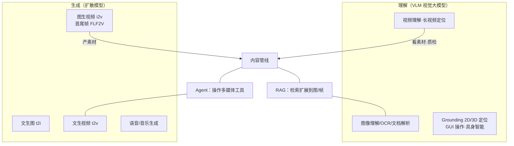
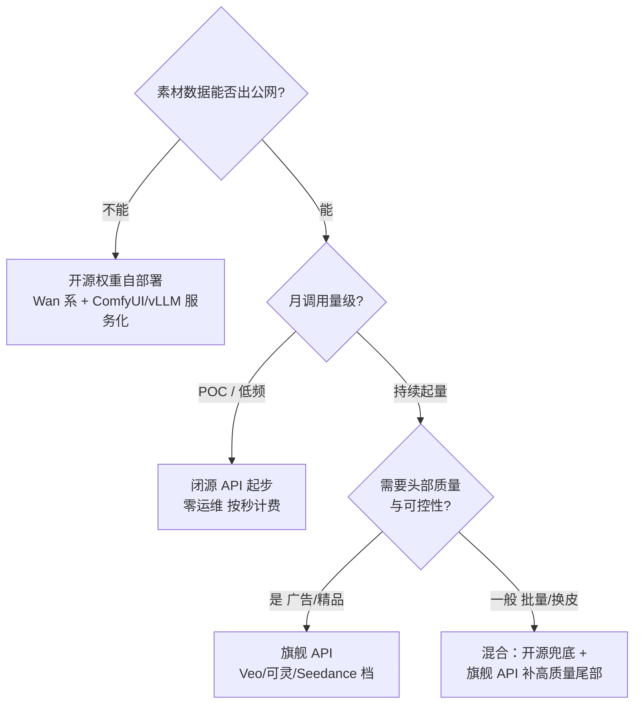

# 多模态模型与视频生成

> 这篇写给两类人：正在评估"视频生成能不能进我们业务"的技术负责人，和准备把开源视频模型跑在自己机器上的工程师。读完你应该能回答三个问题：多模态在应用层版图里到底占了哪块地；闭源 API 与开源权重怎么选（调用量、数据边界、成本三角）；以及本地部署时显存、耗时、工程量这三笔账各自是什么量级。文中模型能力表述均**截至 2026-09**，这个领域三个月一变，请以榜单和官方仓库的实时状态为准。

## 从文本到多模态：应用层的版图扩张

大模型应用的主战场，正在从"对话 + 检索"扩展到图像/视频/语音的生成与理解。我体感最明显的变化是：前两年客户问的是"文档问答怎么接"，2026 年以来问"一条产品视频能不能自动生成""监控视频能不能直接看懂并报警"的比例明显上来了。

*图源：Wikimedia Commons（[文件页](https://commons.wikimedia.org/wiki/File:Astronaut_Riding_a_Horse_(SD3.5).webp)，CC0）*

关键认知是：**多模态不是替代 RAG/Agent，而是把"输入输出的形态"扩展了**。检索可以检图检视频帧，Agent 可以操作多媒体管线——理解（VLM）和生成（扩散模型）是两棵独立演进的技术树，在应用层交汇。

与文本时代一样，理解侧和生成侧都有"闭源 API / 开源权重"两条供给路线，但两棵树的能力边界完全不同：理解侧卷的是长上下文和精度，生成侧卷的是时长、分辨率、运动质量与可控性。下面重点讲视频生成，理解侧的边界放在工程要点里一并说。

## 视频生成模型格局

### 两条路线与能力边界

视频生成按输入形态分两条主线：

- **文生视频（t2v）**：文本提示词直接出片，考验模型对镜头语言和运动的理解；
- **图生视频（i2v）**：给一张首帧图让它"动起来"，构图和主体一致性由图锁定，**是目前产品化落地最多的形态**——电商展示、海报动起来、老照片复活全是它。

再往上是**首尾帧控制（FLF2V）**（给首帧和尾帧，模型补中间过渡）和**参考图驱动**（VACE 类可控生成：姿态、深度、Control 视频注入）。我的经验是：纯 t2v 出"能看的一条 5 秒"早已不难，难的是**可重复制品**——同风格、同角色的批量素材，这要靠 i2v + 首尾帧 + 参考图这套控制能力组合，而不是更大的模型。时长和分辨率是另外两条硬边界：主流模型单条生成普遍在 5–10 秒、480P–1080P，"分钟级长视频"多数靠分镜拼接而非端到端生成。

### 闭源与开源并存

- **闭源平台服务**：Google Veo 系、快手可灵、字节 Seedance、OpenAI Sora 系等，API 或直接产品。截至 2026-09，各家第三方横评榜单（如 Artificial Analysis Video Arena）的头部基本被这批闭源旗舰占据，且排名随版本迭代几个月一洗牌——**看榜单一定要看截图日期和分赛道**（带音频/不带音频、有无视频输入是不同分榜）。
- **开源权重**：以阿里通义万相 [Wan2.1/Wan2.2](https://github.com/Wan-Video/Wan2.1)（Apache 2.0）为代表，还有智谱 CogVideoX、海螺 MiniMax 开源版、字节 HunyuanVideo 等。开源阵营这两年追得很猛：Wan2.1 在 VBench 上发布时曾居开源榜首（86%+ 量级），中文提示词原生支持是其差异点之一。

选型逻辑与文本模型完全一致——**调用量、数据边界、成本三角**，我在"实践与选型"一节用表展开。

### Wan 的技术底座：为什么显存和时间都是大头

Wan2.1 官方 README 给出的架构是三件套：**UMT5-XXL 多语言文本编码器 + 3D 因果 VAE + 全注意力 DiT（扩散 Transformer）**。

*图源：Wan-Video/Wan2.1 官方仓库 README（[assets/video_dit_arch.jpg](https://github.com/Wan-Video/Wan2.1/blob/main/assets/video_dit_arch.jpg)）*

这张图解释了工程上的一切约束：

1. **DiT 是全注意力**，token 数 = 潜空间分辨率 × 帧数，显存与耗时对"时长 × 分辨率"近似线性甚至超线性增长——这就是视频比图像贵一个量级的根因；
2. **UMT5-XXL 编码器本体在 FP16 下约 10GB 量级**，低显存部署时常成为第一瓶颈（社区称 "T5 幽灵显存"），官方与 ComfyUI 教程都推荐换 FP8 量化版或直接 `t5_cpu` 卸载到内存；
3. **官方给出的显存锚点**：T2V-1.3B 仅需约 8.2GB 显存（"兼容几乎所有消费级显卡"），14B 则需 FP8 量化 + offload 才能在 24GB 卡上跑 480P，原生 BF16 720P 是 40GB+ 乃至多卡的负载；多卡可用 FSDP + 序列并行（Ulysses）线性扩容。

## 本地部署路线：ComfyUI + 开源权重

[ComfyUI](https://github.com/comfyanonymous/ComfyUI) 是开源图像/视频模型本地部署的**事实标准工作流框架**：节点式编排，一条"文本编码 → 加载模型 → 采样 → VAE 解码 → 出片"的管线以可视化节点图 + JSON 文件存在，可分享、可版本化、可 API 调用（把 JSON POST 给它的服务端就是最简单的推理服务）。

*图源：comfyanonymous/ComfyUI 官方仓库 README*

Wan 系列从 2.1 起被 ComfyUI **原生支持**，官方文档给出了各任务的示例工作流：[Wan2.2 T2V/I2V](https://docs.comfy.org/zh/tutorials/video/wan/wan2_2)、[FLF2V 首尾帧](https://docs.comfy.org/zh/tutorials/video/wan/wan-flf)、[VACE 可控生成](https://docs.comfy.org/zh/tutorials/video/wan/vace)。入门路径也收敛成了固定动作：升级到最新版 → 工作流模板库搜 "Wan" → 按文档表格把模型文件放到指定目录 → 按显存选规模（官方口径：Wan2.2 的 5B TI2V 版本可下沉到 8GB 显存跑 720P）。

这条路线适合什么？我的判断是两类场景：**数据敏感**（素材不能出内网：未发布产品、医疗/政务影像、客户素材）和 **POC 验证**（先零成本验证效果，再决定买不买 API）。不适合什么：需要头部闭源旗舰同等质量、或弹性波动大的生产流量——那属于拿消费级显卡跟别人的推理集群赛跑。

降门槛的社区生态值得单独一提：GGUF 量化（Q4–Q8 多档）、TeaCache 跳步缓存（约 1.5–2 倍提速）、SageAttention、CPU offload 组合拳下来，**16GB 显存跑 14B 的 480P 短片已是常规操作，甚至 8GB 也能出片**——代价是每条几十分钟起步的等待。

## 工程与成本要点

### 视频推理的成本结构：按秒计费背后的 GPU 账

闭源 API 按输出秒数计费，截至 2026-09 第三方统计的价差极大：便宜的批量档约 $0.03/秒，头部旗舰高清档 $0.5–0.7/秒，**相差约 20 倍**，且"每条成本"还要乘失败重试率。自部署侧则是显存 × 时长的账单：社区基准里 4090 生成一条 5 秒 480P，1.3B 全优化约 4 分钟，14B 量化优化后约 1–2 分钟，未优化 BF16 是十分钟量级。**单条分钟级的生成时间意味着：视频推理必须异步化（任务队列 + 回调 + 中间态存储），同步请求超时是第一个会撞上的工程坑。** 成本测算方法可以直接复用站内 [GPU 选型与推理成本测算](/ai/infra/inference/gpu-sizing) 的框架，把"每次调用 token 数"换成"每次调用 GPU 秒数"即可。

### 媒体管线：生成只是中间一步

生产场景的完整链路是：**生成 → 审核 → 转码 → 分发**。内容安全审核（生成结果过机审 + 抽检）和深度合成标识在多数司法辖区是合规必选项，不是可选项；转码与分发就是标准视频云/对象存储的活。架构上值得记住的一点：视频素材体积大、写多读少，**生成节点到存储的带宽和本地暂存盘**容易成为瓶颈，模型 checkpoint（几十 GB）的镜像化/挂载分发也比文本模型重得多。

### 视觉理解的边界：Token 计量与长视频

理解侧（VLM）的成本模型与生成完全不同，是输入 token 账，三家官方口径（截至 2026-09）：

| | 图像输入 | 视频输入 | 长视频上限 |
| --- | --- | --- | --- |
| OpenAI（Responses API） | 按 patch/tile 折 token，`detail: low` 只计基础 token（百级/图）；有效处理长边约 1568px，**再高清也会被降采样** | 抽帧为图像序列 | 受上下文限制，无专门长视频机制 |
| Google Gemini | 每 768×768 tile 固定 258 token | 默认含音频流，低分辨率约 100 token/秒，高分辨率约 300 token/秒 | 低分辨率档可塞进数小时视频（2M 上下文） |
| Qwen3-VL / 百炼 | 动态分辨率 | 原生 256K（可扩 1M）上下文 | 官方宣称小时级视频、秒级事件定位；OCR 30+ 语言、2D/3D grounding |

一线经验：**坐标类任务（grounding）先做分辨率归一化再喂模型**，各家对输入分辨率的有效上限都远低于摄像头原始分辨率，按原图喂既烧 token 又掉精度；长视频任务优先选有"视频原生 token 机制"的模型（Gemini/Qwen-VL 系），比自己抽帧便宜且不漏事件。

## 实践与选型

### 闭源 API vs 开源自部署：三角决策

| 维度 | 闭源旗舰 API | 开源权重自部署（Wan 类） |
| --- | --- | --- |
| 质量（截至 2026-09） | 头部，横评榜单第一梯队 | 第一梯队边缘，日常素材够用，差距月缩 |
| 数据边界 | 素材出网，需过合规评估 | 全内网，敏感素材唯一解 |
| 单位成本 | 按秒计费，量越大越贵 | 显存+电费+运维，量越大越划算（经验上高频稳定负载的盈亏平衡点通常在数十万条/月量级，需按自身卡型核算） |
| 可控性 | 固定参数集 + 各家的首尾帧/参考图接口 | 权重可微调（LoRA 锁角色/风格），管线全开源可魔改 |
| 弹性 | 天然弹性，扛突发 | 受限于自有 GPU，突发需云上弹性卡池兜底 |
| 工程量 | 一个 HTTP 调用 | 环境、量化、显存编排、任务队列全套 |

我的默认打法：**API 起步验证需求真实性，效果与量级双达标后再评估自部署**，顺序反了大概率养一堆闲置 GPU。两边并行跑同一批评测集（自己的场景素材，不是公开样例）再下结论。

### 开源侧代表能力速览（截至 2026-09，据官方 README/文档）

| 模型 | 规模 | 能力 | 显存锚点 | 备注 |
| --- | --- | --- | --- | --- |
| Wan2.1 T2V/I2V | 1.3B | t2v/i2v，480P | 约 8.2GB（官方） | 消费级入门，速度换质量 |
| Wan2.1 | 14B | t2v/i2v，480P–720P，VBench 开源榜首（发布时） | FP8 约 24GB 起；原生 720P 需 40GB+/多卡 | UMT5 中文原生支持 |
| Wan2.2 | 5B (TI2V) / 14B | t2v + 单模型 i2v，官方口径 5B 在 ComfyUI 可 8GB 显存跑 720P | 5B：8GB 级 | 高压缩 VAE，社区量化/加速生态最全 |
| 其他开源 | — | CogVideoX、HunyuanVideo、LTX 系等 | — | 各有速度/质量取舍，选型时以当周榜单为准 |

### 模型对比与评测跟踪

[Artificial Analysis 的 I2V/T2V 榜单](https://artificialanalysis.ai/video/leaderboard/image-to-video) 是当前最省事的第三方横评入口：Arena 盲投 Elo + 每秒单价 + 生成速度三个维度并排。使用注意：Elo 是**带时间戳的偏好快照**，受题材分布影响（真人影视风权重高、动漫/产品演示会偏），**用于缩小候选范围可以，用于最终选型必须回到自建评测集**。

## 常见坑

| 坑 | 现象 | 根因与对策 |
| --- | --- | --- |
| 只看参数量估显存 | 24GB 卡跑 14B BF16 直接 OOM | 显存大头在激活与注意力，不在权重；上 FP8/GGUF 量化 + T5 offload + VAE tiling 三件套 |
| 低估文本编码器 | 模型"没多大"却吃显存 | UMT5-XXL FP16 约 10GB 量级；换 FP8 编码器或 `t5_cpu` |
| 按同步接口设计 | 网关大面积超时 | 生成一条要分钟级，任务队列 + 轮询/回调 + 断点重试，别拿聊天接口的直觉接视频 |
| 拿榜单当验收 | demo 惊艳、上线拉胯 | Arena Elo 偏影视风；用自己业务的 20–50 条种子用例做固定回归集 |
| 忽视重试率 | 单条成本远超标价 | 抽卡质量不稳，按"可用条数"而非"生成条数"核算成本；预算留 2–3 倍重试 |
| 长视频硬等端到端 | 5 秒以上质量崩坏/失败 | 现阶段长视频=分镜规划 + 逐段生成 + 拼接，段间用首尾帧衔接压一致性 |
| 帧数/分辨率不守规矩 | 生成报错或结果异常 | 各模型对尺寸和帧数有整倍约束（如 Wan 系 4n+1 帧、按 480P/720P 档位），管线里提前校验 |
| 只测文本不管合规 | 上线被要求整改 | 生成内容标识、素材版权链路、肖像与声音授权，评估期就拉进方案而不是上线前补课 |
| VLM 原图直喂 | token 暴涨、坐标漂移 | 先归一化到模型有效分辨率再输入；grounding 结果按原图坐标反算 |

## 实践观点

- **视频生成当前是"素材工业"而不是"成片工业"**。把它接进"批量出素材、人工挑+剪"的管线立刻产生价值；指望一键出成片会失望。
- **i2v 是被低估的产品化钥匙**：真实业务里"一张定稿图"比"一段精准提示词"容易拿到，一致性也从玄学变成了工程问题。
- **开源自部署的价值不在省钱，在数据边界和可控性**。纯算成本时，别忘了把运维、闲置、失败重试都折进去——多数中小流量算下来 API 更便宜，这不丢人。
- **理解与生成会合流**。VLM 做生成前的分镜理解和生成后的质检打分，是现在就能搭的最小闭环，也是多数"多模态 Agent"场景的真身。

## 计划补充

- [x] 主流视频生成模型能力对比（控制能力/时长/分辨率/成本）→ 见"实践与选型"
- [x] 视频生成的推理成本测算（方法复用 [GPU 选型与推理成本测算](/ai/infra/inference/gpu-sizing)）→ 见"工程与成本要点"，细化实测另开
- [ ] ComfyUI 本地部署实践：从环境到出片（完整动手篇，含 GGUF/TeaCache 配方与显存编排）
- [ ] 语音与音乐生成：多模态生成版图的另一角（TTS/歌声/音效的工程账）

## 衔接

- 同层：[企业级 RAG 架构设计](/ai/application/rag-architecture)（多模态检索是它的自然延伸）· [Agent 与 MCP](/agentic/)（Agent 操作多媒体管线的编排层）
- 下层：[GPU 选型与推理成本测算](/ai/infra/inference/gpu-sizing)（视频推理的成本账框架）· [大模型应用总览](/ai/application/)

## 参考资料

> 更新于 2026-09-02，访问日期均为 2026-09-02。

**文字来源**

- [Wan-Video/Wan2.1](https://github.com/Wan-Video/Wan2.1) — 开源视频生成模型官方仓库：架构、显存锚点（1.3B 约 8.2GB）、能力与多卡并行方案（持续更新 · 开源项目）
- [Wan: Open and Advanced Large-Scale Video Generative Models（arXiv:2503.20314）](https://arxiv.org/abs/2503.20314) — Wan 官方论文：UMT5 + 3D VAE + DiT 架构与 VBench 评测
- [comfyanonymous/ComfyUI](https://github.com/comfyanonymous/ComfyUI) — 节点式多模态工作流框架，本地部署事实标准（持续更新 · 开源项目）
- [ComfyUI 文档：Wan2.2 视频生成官方原生工作流](https://docs.comfy.org/zh/tutorials/video/wan/wan2_2) · [Wan2.1 FLF2V 首尾帧示例](https://docs.comfy.org/zh/tutorials/video/wan/wan-flf) — 本地部署入门路径与显存建议
- [Image to Video Leaderboard — Artificial Analysis](https://artificialanalysis.ai/video/leaderboard/image-to-video) — 视频生成模型第三方横评（Elo/速度/每秒单价；快照随时间变化）
- [Images and vision — OpenAI API 官方指南](https://developers.openai.com/api/docs/guides/images-vision) — 图像输入的 token 计量与 detail 参数
- [Video understanding — Gemini API 官方文档](https://ai.google.dev/gemini-api/docs/video-understanding) · [Understand and count tokens](https://ai.google.dev/gemini-api/docs/tokens) — 视频每秒 token 账与图像 258-token 平铺规则
- [Qwen3-VL（GitHub）](https://github.com/qwenlm/qwen3-vl) · [阿里云百炼：图像与视频理解](https://help.aliyun.com/zh/model-studio/vision) — 开源 VLM 的长视频/OCR/grounding 能力边界
- [Wan 2.x VRAM Requirements — willitrunai](https://willitrunai.com/blog/wan-2-2-vram-requirements) · [Benchmarking WAN2.1 — Salad](https://blog.salad.com/benchmarking-wan2-1/) — 消费级显卡实测参考（社区基准，非官方）

**图片来源**

- `wan21-architecture.jpg` ← [Wan-Video/Wan2.1 assets/video_dit_arch.jpg](https://github.com/Wan-Video/Wan2.1/blob/main/assets/video_dit_arch.jpg)（官方仓库开源发布，已缩宽至 1200px）
- `comfyui-workflow-ui.png` ← [ComfyUI 官方仓库 README](https://github.com/comfyanonymous/ComfyUI) 工作流截图
- `sd35-astronaut.jpg` ← [Wikimedia Commons: Astronaut Riding a Horse (SD3.5)](https://commons.wikimedia.org/wiki/File:Astronaut_Riding_a_Horse_(SD3.5).webp)（CC0）
