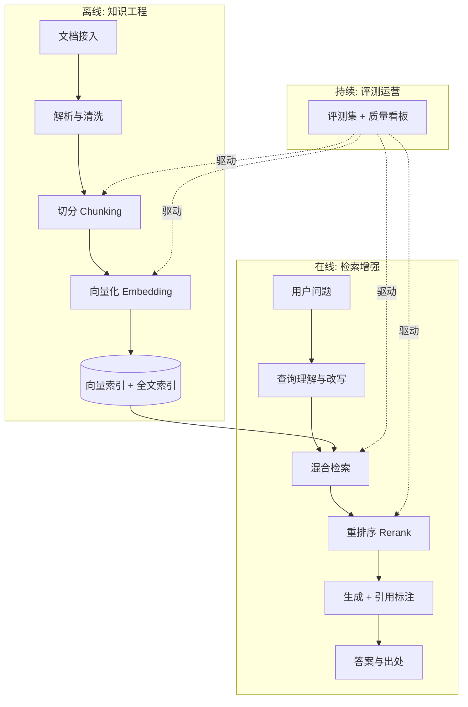
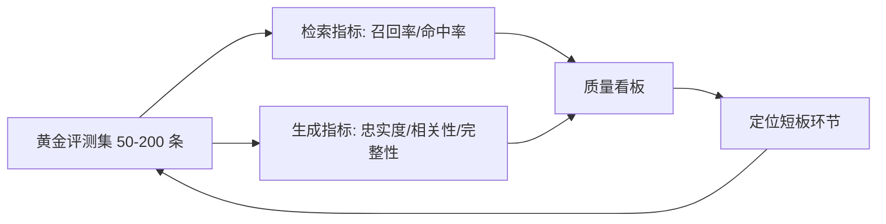

# 企业级 RAG 架构设计

> RAG 是企业落地大模型最成熟的路径，也是"Demo 与生产差距最大"的领域：一周能搭出一个问答原型，三个月未必能让它达到上线标准。差距不在模型，而在检索工程。这篇按完整链路拆解企业级 RAG 的设计要点。

## 为什么是 RAG

企业有三类需求，微调都解决不好，而 RAG 天然适配：

1. **私有知识**：内部文档、产品手册、工单记录，不在模型训练语料里
2. **知识时效**：制度每季度更新，重训/微调成本不可接受
3. **可信可溯**：回答必须能标注出处——合规场景的硬性要求

RAG 的本质：**把"让模型记住知识"转换为"让模型阅读并引用知识"**。前者不可控，后者可工程化。

## 全链路架构

一个关键认知：**RAG 的质量上限在离线链路，在线链路只是把上限兑现出来**。多数项目失败在解析和切分，而不是模型。

## 离线链路：质量上限在这里

### 文档解析：最脏最关键的活

- 扫描件要先过 OCR；表格、公式、图文混排是解析质量的试金石
- **表格要保结构**：拍平成文字的表格会丢失行列关系，检索必错。方案：Markdown 化、表格单独索引、或交给多模态理解
- 实践口径：解析质量抽查合格率低于 90% 之前，不要谈后面的优化

### 切分（Chunking）：工程化的核心决策

| 策略 | 做法 | 适用 |
| --- | --- | --- |
| 定长切分 | 按 token 数硬切 + 重叠 | 快速起步，结构均匀的文本 |
| 结构感知 | 按标题/章节/段落边界 | 有清晰结构的文档（首选） |
| 语义切分 | 按语义相似度断句 | 长文、结构松散的内容 |
| 父子块 | 小块检索、大块送生成 | 兼顾检索精度与上下文完整 |

经验参数只是起点：**块大小通常在 256–1024 token 之间实验，重叠 10–20%**。真正的判据是评测集表现，不是任何默认值。

### Embedding 与索引

- Embedding 模型选型：优先看**中文与领域语料的检索评测表现**，维度与最大输入长度是硬约束
- 单一向量检索不够：**混合检索（向量 + 全文关键词）是企业标配**。向量抓语义，关键词保精确匹配（产品名、编号、专有名词靠 BM25 才能命中）
- 元数据过滤：租户、权限、文档类型、时间——先过滤再检索，隔离与时效都靠它

## 在线链路：把上限兑现

### 查询理解

用户的提问往往不完美：指代不明、口语化、一词多义。查询改写是性价比最高的环节：

- **查询重写**：口语 → 规范检索语言
- **多查询扩展**：一个问题拆成多个子查询并行检索再合并
- **对话历史注入**：多轮场景必须把上下文问题补全成独立查询，否则"它的价格是多少"会检索不到任何东西

### 重排序（Rerank）

初检召回宁多勿漏（top 30–50），再用 Cross-Encoder 类重排模型精排到 top 3–5。**重排通常能带来最显著的效果提升**，代价是一次额外的模型调用（延迟增加 100–300ms 量级）。

### 生成与引用

- Prompt 中明确：只依据给定材料回答、材料不足时承认不知道、逐句标注引用编号
- 引用必须可点击回原文——这是 RAG 相对纯大模型的信任优势，也是验收标准
- 拒答策略：检索置信度过低时引导人工或澄清，比硬答更保护业务信誉

## 评测：没有评测的 RAG 等于盲飞

- **评测集先行**：上线前必须积累业务真实问答的黄金集，标注预期答案与出处文档
- **分环节归因**：答案不对先问"检索到了吗"——检索没召回是索引/切分问题，召回了没答对才是生成问题。两类的修法完全不同
- **持续化**：线上坏例定期回流进评测集，评测集是 RAG 系统的"回归测试"

## 运营层：企业级与 Demo 的分界线

1. **增量更新**：文档变更 → 增量解析 → 增量索引；删除文档必须同步删索引（权限回收的底线）
2. **权限贯通**：检索层的元数据过滤必须与文档权限系统打通——"模型能答出我看不到的文档"是安全事故
3. **成本控制**：Embedding 与 Rerank 都是计费调用，缓存高频查询、控制召回条数
4. **降级路径**：检索服务不可用时，明确降级策略（纯模型回答 + 免责声明，或直接人工）

## 常见坑

| 坑 | 后果 | 对策 |
| --- | --- | --- |
| 拿 PDF 直接塞默认解析 | 表格乱、页眉页脚成噪音 | 解析质量抽查，表格专项处理 |
| 只用向量检索 | 专有名词、编号查不中 | 混合检索 |
| 切分拍脑袋不实验 | 效果玄学波动 | 评测集驱动的参数扫描 |
| 没有评测集就上线 | 无法归因、无法汇报、无法迭代 | 评测先行 |
| 忽略权限 | 数据越权风险 | 元数据过滤 + 权限系统联动 |

## 小结

企业级 RAG 的成熟度阶梯：**解析质量 → 切分策略 → 混合检索 → 重排 → 评测闭环 → 权限与运营**。每一级都有明确的工程判据，这也是它区别于"调个 API"的地方——RAG 是知识工程，不只是模型应用。

## 参考资料

<Refs>

- [Retrieval-Augmented Generation 综述](https://arxiv.org/abs/2312.10997)
- [RAGAS 评测框架](https://docs.ragas.io/)
- 站内相关：[大模型推理部署实战](/ai/infra/inference/llm-inference) · [Agent 与 MCP](/agentic/)

</Refs>