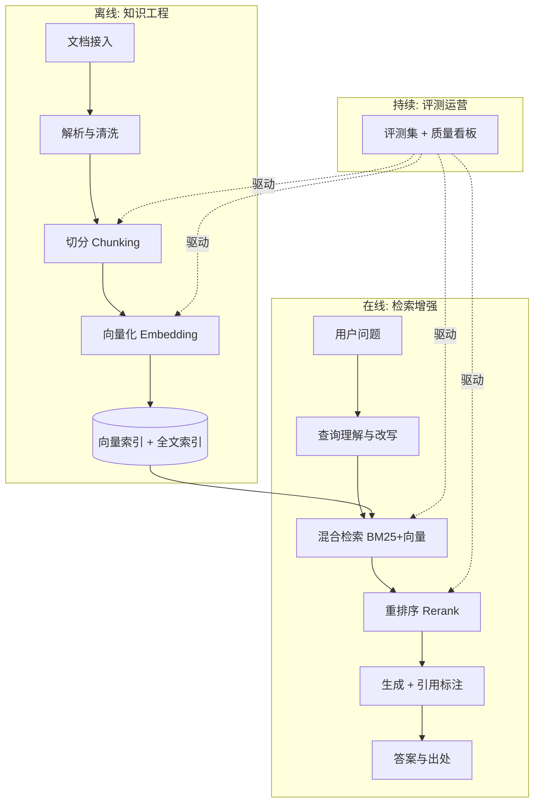
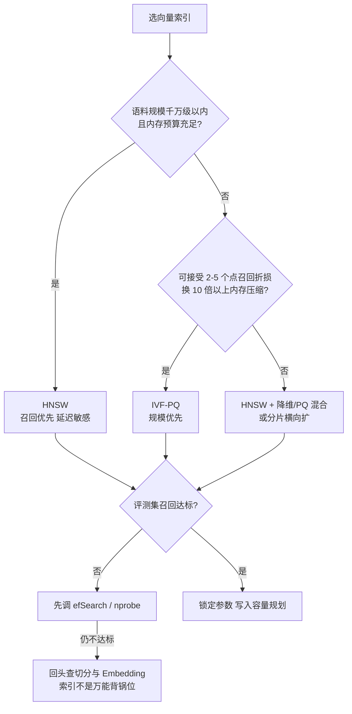
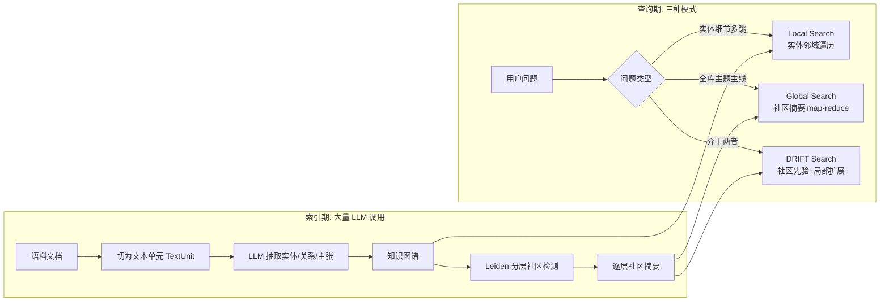
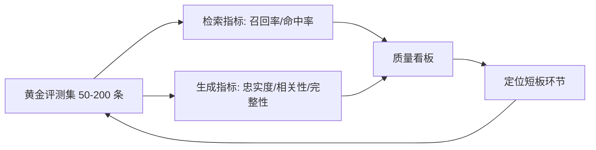
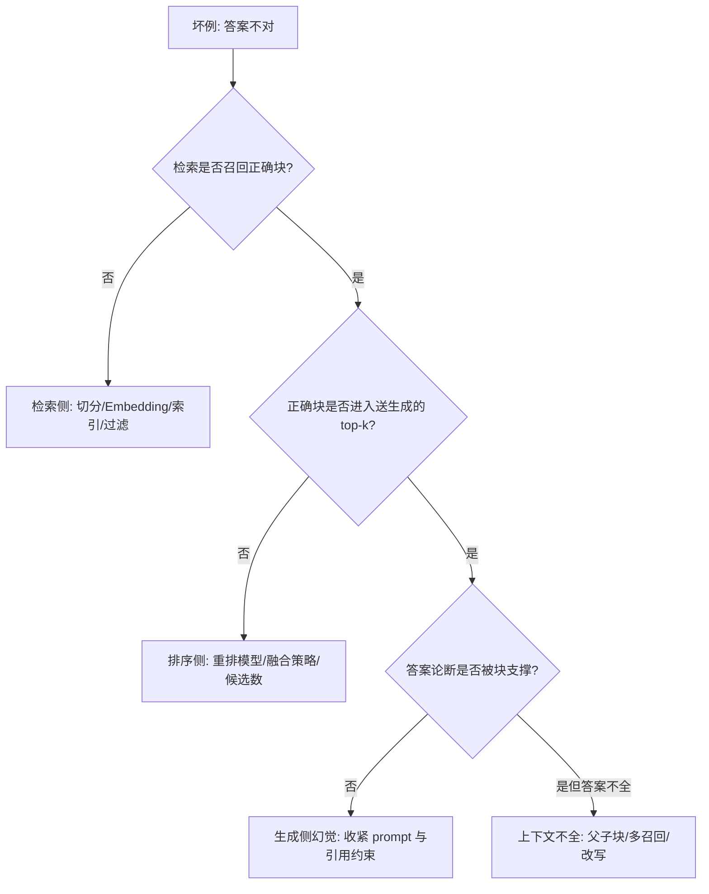

# 企业级 RAG 架构设计

> RAG 是企业落地大模型最成熟的路径，也是"Demo 与生产差距最大"的领域：一周能搭出一个问答原型，三个月未必能让它达到上线标准。差距不在模型，而在检索工程。这篇按完整链路拆解企业级 RAG 的设计要点——从解析切分、Embedding 与 ANN 索引的机制级原理、混合检索与重排的成本账，到 Naive→Advanced→Modular→Agentic→GraphRAG 的架构演进、长上下文与 RAG 的再分工、评测闭环与生产运营。读完你能拿到一张"每一环做什么、参数怎么调、坑在哪"的工程地图。

## 为什么是 RAG

企业有三类需求，微调都解决不好，而 RAG 天然适配：

1. **私有知识**：内部文档、产品手册、工单记录，不在模型训练语料里
2. **知识时效**：制度每季度更新，重训/微调成本不可接受
3. **可信可溯**：回答必须能标注出处——合规场景的硬性要求

RAG 的本质：**把"让模型记住知识"转换为"让模型阅读并引用知识"**。前者不可控，后者可工程化。

与微调的边界也一并说清，这是立项时第一个被问到的问题：

| 需求类型 | 选 RAG | 选微调 | 理由 |
| --- | --- | --- | --- |
| 私有/新增知识 | 是 | 否 | 微调记不牢事实知识，且更新要重训 |
| 回答需出处可溯 | 是 | 否 | 微调无法给出引用 |
| 输出风格/格式/术语习惯 | 否 | 是 | 风格是"能力"不是"知识"，微调更有效 |
| 领域推理范式（如特定诊断流程） | 部分 | 是 | 流程内化进权重比每次塞上下文更稳 |
| 两者兼有 | 组合 | 组合 | 微调定风格与范式，RAG 供知识，是多数企业项目的终态 |


*图 1：RAG 的经典三段式——检索、增强、生成。图源：NVIDIA 官方博客《What is Retrieval-Augmented Generation?》（[blogs.nvidia.com](https://blogs.nvidia.com/blog/what-is-retrieval-augmented-generation/)）*

2024 年以来的"长上下文会杀死 RAG"论调，到 2026 年已经基本平息为分工问题：百万级 token 窗口解决了"少量文档整篇读"的场景，但**语料规模、知识新鲜度、出处可溯、权限隔离、单次查询成本**这五件事，窗口再大也替不了检索。这一判断的证据与边界放在后文"长上下文与 RAG 的再分工"一节展开。

## 全链路架构



一个关键认知：**RAG 的质量上限在离线链路，在线链路只是把上限兑现出来**。多数项目失败在解析和切分，而不是模型。另一个容易被忽视的事实是：**评测闭环必须与链路并行建设**，没有评测集的每一次调参都是盲调。

## 离线链路：质量上限在这里

### 文档解析：最脏最关键的活

- 扫描件要先过 OCR；表格、公式、图文混排是解析质量的试金石
- **表格要保结构**：拍平成文字的表格会丢失行列关系，检索必错。方案：Markdown 化、表格单独索引、或交给多模态理解
- **版面感知解析**：标题层级、列表、脚注都是结构信号，解析阶段丢掉，切分阶段就补不回来。一线做法是用版面感知解析器（Unstructured、MinerU、Marker 类开源工具，或云厂商文档解析 API）先产出带层级结构的中间表示（Markdown/JSON），再进入切分
- 页眉页脚、页码、水印是高频噪音源：不进清洗规则就会在每个chunk里重复出现，既稀释语义又污染引用展示
- 实践口径：解析质量抽查合格率低于 90% 之前，不要谈后面的优化

不同文档形态的解析策略差异很大，按形态选工具比"选一个最好的解析器"更实际：

| 文档形态 | 解析要点 | 典型处理 |
| --- | --- | --- |
| 原生电子文档（Word/HTML/电子 PDF） | 直接取文本流与结构标签 | 轻量解析器转 Markdown，保留标题层级 |
| 扫描件/拍照件 | 先 OCR，注意识别置信度 | OCR + 版面分析；低置信页进人工队列 |
| 表格密集（报表/参数表） | 行列关系是答案本身 | 表格转 Markdown/HTML 单独成块，或表格问答专用索引 |
| 图文混排（流程图/截图） | 图里有关键信息 | 多模态模型生成图注，图注参与检索 |
| 公式密集（论文/规范） | 公式拍平即乱码 | 保留 LaTeX/MathML 或转自然语言描述 |

### 切分（Chunking）：工程化的核心决策

| 策略 | 做法 | 适用 | 代价 |
| --- | --- | --- | --- |
| 定长切分 | 按 token 数硬切 + 重叠 | 快速起步，结构均匀的文本 | 切断语义单元 |
| 结构感知 | 按标题/章节/段落边界 | 有清晰结构的文档（首选） | 块大小不均 |
| 语义切分 | 按语义相似度断句 | 长文、结构松散的内容 | 需要额外 embedding 计算 |
| 父子块 | 小块检索、大块送生成 | 兼顾检索精度与上下文完整 | 索引与维护翻倍 |
| 文档摘要块 | 标题 + 摘要 + 正文多粒度 | 需要全局理解的问答 | 摘要本身有幻觉风险 |
| Late Chunking | 先整篇嵌入、再按块聚合 token 级向量 | 块内指代依赖上下文的长文 | 要求嵌入模型支持长上下文 |

**切分策略的演进脉络**值得记住：早期大家迷信"黄金块大小"，后来发现块大小只是表象，真正的变量是**语义完整性**。语义切分（按相邻句向量相似度骤降处断句）解决的是"把一句话拦腰切断"的问题；父子块（小块负责命中、大块负责提供上下文）解决的是"块太小丢上下文、块太大稀释语义"的矛盾。现在的共识是：**先结构感知，结构松散处用语义切分兜底，再用父子块组织**。

**Late Chunking** 是 2024 年由 Jina AI 提出、2025 年后被长上下文嵌入模型普及的思路：传统做法先切块再嵌入，块内的"它""该方案"这类指代在切开后丢失了上下文；Late Chunking 反过来，**先用长上下文嵌入模型对整篇文档做 token 级嵌入，再按切分边界把 token 向量聚合成块向量**——每个块的向量因此携带了全文上下文信息。


*图 2：Late Chunking 方法示意——先对全文做 token 级嵌入，再在切分边界上做均值池化得到块向量。图源：论文《Late Chunking: Contextual Chunk Embeddings Using Long-Context Embedding Models》图 1（[arXiv:2409.04701](https://arxiv.org/abs/2409.04701)）*

**块大小—召回—成本的三角**是切分决策的本质：块调大，单个块语义被稀释、向量区分度下降，且送进生成的 token 成本上升；块调小，检索命中更准但上下文碎片化，答案所需信息散在多个块里要靠多召回拼。我的经验口径：**块大小通常在 256–1024 token 之间实验，重叠 10–20%**；结构化文档按章节切往往比定长更好。真正的判据是评测集表现，不是任何默认值——同一套语料上 256 与 512 的检索召回差异能到十几个点，方向还因语料而异。

**父子块（small-to-big）**的组织方式值得给一个具体形态，因为它是"检索精度"与"上下文完整"矛盾的标准解法：索引进向量库的是小块（语义集中、易命中），每个小块挂一个 parent 指针指向所属大块（章节级或滑动窗口级）；检索命中小块后，送进生成上下文的是去重后的大块。

```text
索引层 (参与向量检索):
  chunk_s_001 "报错 503 时先检查网关超时配置..."  → parent: chunk_b_012
  chunk_s_002 "若超时配置正常, 检查上游服务健康检查..." → parent: chunk_b_012
  chunk_s_003 "限流策略触发也会返回 503..."        → parent: chunk_b_013
生成层 (命中后展开):
  命中 chunk_s_001, chunk_s_002 → 展开为同一个 chunk_b_012 (去重)
  → 模型拿到完整章节上下文, 而不是两句孤立的话
```

它的代价是索引条目与维护成本近似翻倍（小块要建索引、映射关系要随文档更新同步），以及大块展开后可能重新引入噪声——所以父块粒度同样要过评测集，常见选择是"小节级"或"子块的 3–5 倍滑动窗口"。

### Embedding 选型：看榜单，但别信榜单

Embedding 模型决定向量空间的几何结构，是整条链路里**换起来最贵**的组件（换模型等于全量重建索引）。选型先看三个硬约束：中文与领域语料的检索评测表现、维度（索引与内存成本）、最大输入长度（决定切分上限与能否做 Late Chunking）。

**2026 年主流 Embedding 模型选型参考**（口径为 MTEB / C-MTEB 公开榜，具体到你的领域仍需自建评测集复测）：

| 模型 | 厂商/开源 | 维度 | 最大输入 | 定位与适用性 |
| --- | --- | --- | --- | --- |
| text-embedding-3-small | OpenAI | 1536（可降） | 8191 | 性价比首选，Matryoshka 支持降维 |
| text-embedding-3-large | OpenAI | 3072（可降） | 8191 | 多语言效果更强，可降到 256 维仍优于旧模型 |
| voyage-3.5 / voyage-4-large | Voyage AI | 1024（默认） | 32000 | 检索任务专项强，长上下文，另有 code/finance/law 垂类版 |
| Qwen3-Embedding-0.6B/4B/8B | 阿里（Apache 2.0） | 1024/2560/4096 | 32K | 8B 曾居 MTEB 多语言榜首，中文与代码检索俱佳，可私有化 |
| bge-m3 | 智源 BAAI | 1024 | 8192 | 单模型同时出稠密/稀疏/多向量，混合检索自洽 |
| embed-v4 | Cohere | 256–1536 可选 | — | 多语言 + 多模态，配合 Rerank 系列成套 |

选型上的三个一线判断：**私有化部署**优先 Qwen3 / bge 这类开放权重模型；**纯 API 托管**看 Voyage 与 OpenAI；**超长文档**（法律、研报）选 32K 上下文系。维度不是越大越好——高维度带来索引与内存成本，多数场景 1024 维已够用，配合 Matryoshka 降维（训练时保证前缀子向量可用，截断后仍保持大部分检索能力）可以再压存储：1024 维降到 256 维，索引内存直接砍到四分之一，检索指标通常只掉一两个点。

对公开榜单要留一分警惕：**MTEB / C-MTEB 反映的是通用语料上的平均检索能力，不等于你的领域表现**。榜单头部模型之间的差距往往小于一到两个点，而领域适配（术语、缩写、内部编码）的差异能到十个百分点以上。榜单用来圈定候选（2–3 个），最终排序交给自建评测集。另一个实操细节：**query 与 document 的嵌入指令要分开**（instruction-aware 模型如 Qwen3-Embedding、bge 系列都要求给 query 加前缀指令），漏加指令在榜单模型上能白白丢掉几个点的召回。

榜单与现成模型都不够时，最后的手段是**领域对比微调**：用业务里真实的 (query, 相关chunk) 对（搜索日志点击、工单与解决文档的配对、专家标注）对开放权重嵌入模型做对比学习微调。我的经验边界：标注对到千级量级才值得启动，收益集中在"术语鸿沟"大的垂直域（医疗、法律、工业编码）；微调后的模型进入版本化管理（见"索引版本化"一节），并且要保留通用评测集做回归，防止领域过拟合把通用能力训坏。多数项目走到"换模型 + 改切分"就够了，微调是第三选择而非默认动作。

### 相似度度量：向量检索的几何前提

向量检索的第一次决策发生在建索引之前：用哪种距离度量。三个选项的工程含义：

| 度量 | 公式直觉 | 几何含义 | 选用口径 |
| --- | --- | --- | --- |
| 余弦相似度 | 夹角余弦，忽略模长 | 只比方向 | 文本嵌入的事实默认；对长度不敏感 |
| 内积（dot product） | 向量点积 | 方向 + 模长共同作用 | 模型按内积训练时（部分双塔检索模型）必须用内积 |
| 欧氏距离 | L2 距离 | 绝对位置差 | 图像/音频嵌入更常见，文本少用 |

两个容易踩的细节：**归一化后的向量上，余弦与内积单调等价**（cos = 内积 / 模长乘积，归一化后模长为 1），所以"向量归一化 + 内积索引"是多数向量库的默认高性能组合；而**度量必须与嵌入模型的训练目标一致**——按对比学习内积目标训练的模型换用余弦，等于改掉了它学到的几何结构，召回会无理由地掉点。此外维度越高，随机向量对之间的距离越趋于集中（维度诅咒），这意味着高维空间里"top-k 与第 k+1 名的分数差"会变小，重排与阈值拒答的设计都要把这个事实考虑进去。

### 向量索引：ANN 算法的机制与调参含义

精确近邻（暴力扫描）在百万级以上语料不可行，工程上全部走近似近邻（ANN，Approximate Nearest Neighbor）：用少量召回率换数量级的延迟与内存收益。两条主流路线的机制必须理解到"参数动了会发生什么"的程度。

**HNSW（Hierarchical Navigable Small World，分层可导航小世界图）**：把向量组织成多层 proximity graph（近邻图）。底层（Layer 0）包含全部节点，越往上层节点越稀疏，结构上类似跳表：查询从最高层的某个入口点出发，做贪心搜索——每一步走向"离查询向量更近的邻居"，走到本层局部最优后下降一层继续，直到 Layer 0 做一次带候选列表的精搜。上层稀疏图负责"大步跳转、快速逼近目标区域"，底层稠密图负责"局部精排"，因此搜索复杂度近似 O(log N)。


*图 3：HNSW 的分层图结构与一次查询的下降路径（红色箭头），层越高连接越稀疏、特征半径越大。图源：Zilliz 官方博客《Vector Database 101: Hierarchical Navigable Small Worlds (HNSW)》，图重绘自 HNSW 原论文（[arXiv:1603.09320](https://arxiv.org/abs/1603.09320)；博客链接 [zilliz.com](https://zilliz.com/learn/hierarchical-navigable-small-worlds-HNSW)）*

HNSW 的三个核心参数，调参含义如下：

| 参数 | 作用阶段 | 典型取值 | 调大发生什么 |
| --- | --- | --- | --- |
| M（每节点最大邻居数） | 建索引 | 16–64 | 图更连通、召回更高，但内存与建索引时间上升 |
| efConstruction（建图候选列表） | 建索引 | 100–200 | 图质量更高、召回更高，建索引变慢；建成后不可改 |
| efSearch（查询候选列表） | 查询 | top-k 起，50–200 调 | 召回单调上升、查询延迟近似线性上升；必须 ≥ top-k |

一线口径：**M 与 efConstruction 在建库时定死，线上能动的只有 efSearch**——召回不达标先加 efSearch，加到延迟不可接受还差，才回头重建索引调 M。HNSW 的代价是内存：图结构本身要存邻接表，且向量原始数据通常要保留在内存里做精排，十亿级语料纯 HNSW 的内存账单往往不可接受。

把 HNSW 的建索引与查询拆成步骤，参数含义就完全清楚了：

```text
建索引（逐条插入）:
  1. 为新节点 v 抽层: l = floor(-ln(U(0,1)) × mL), mL = 1/ln(M)
     → 指数分布: 绝大多数节点只在 Layer 0, 少数"枢纽"节点上高层
  2. 从当前最高层入口点出发, 在高于 l 的各层做贪心搜索(ef=1)找入口
  3. 在 [min(l, 当前层)..0] 各层: 以 efConstruction 为候选宽度搜索 v 的邻居
  4. 双向连边; 若某节点邻居数超 M_max, 用启发式剪枝
     (优先保留"方向多样"的邻居而非最近的 M 个, 保证图连通性)

查询:
  1. 自顶层入口贪心下降(ep = entry point, ef = 1)
  2. Layer 0 以 efSearch 为候选宽度做带束搜索
  3. 候选列表取前 top-k 返回
```

两个设计点值得记住：**层分配是概率性的**（指数分布让上层天然成为"快速路由表"，无需平衡树式的维护）；**邻居剪枝用启发式而非简单取最近 M 个**——这是 HNSW 在高维数据上召回显著优于早期近邻图方法的关键，也是"为什么 M 调太大反而不一定更好"的原因（边太多会破坏长程连接的多样性并推高内存）。

**IVF-PQ（倒排粗排 + 乘积量化压缩）**：两个组件各解决一个问题。IVF（Inverted File）用 k-means 把向量聚成 nlist 个簇，查询时只扫离查询最近的 nprobe 个簇——用"可能漏掉正确簇"换扫描量下降；PQ（Product Quantization）把 D 维向量切成 m 个子向量，每个子向量独立做 256 类（8 bit）量化，于是**每个向量的存储从 D×4 字节压到 m 字节**（1024 维 float32 是 4096 字节，m=128 时只有 128 字节，压缩 32 倍），距离计算也变成查表累加。

算一笔公开的内存账（量级估算，便于建立直觉）：1000 万条 1024 维 float32 向量原始大小约 40 GB；HNSW（M=32）仅 Layer 0 邻接表就要约 1000万 × 32 × 2 × 4B ≈ 2.5 GB，外加 40 GB 原始向量常驻；IVF-PQ（m=128）压缩后约 1.2 GB，加上倒排结构与聚类中心也在数 GB 量级——**同一语料两者内存差一个数量级，这就是"内存换召回"与"压缩换规模"的取舍**。IVF-PQ 的调参抓手是 nlist（经验起点 4×√N）与 nprobe（召回不足时按比例加，从 nlist 的 1% 往上试），以及 m 与子空间量化位数（决定压缩率与精度损失）。

IVF-PQ 查询时的距离计算是它快的第二个原因，机制叫 **ADC（Asymmetric Distance Computation，非对称距离计算）**：查询向量保持原始精度不量化，对每个候选向量不做向量减法，而是把它 m 个子空间的量化类别号当作索引，去 m 张预先算好的距离表（每张 256 项，存"查询向量第 j 个子向量到该类别中心"的距离）里查表累加——一次候选距离从 O(D) 次浮点运算变成 m 次查表加 m-1 次加法。由此也能理解 PQ 的精度损失来源：**量化误差发生在文档侧**，子空间中心数（256）与子空间划分方式（是否先做 OPQ 旋转对齐）直接决定误差大小。

```text
IVF-PQ 查询步骤:
  1. 粗排: 计算查询向量到 nlist 个聚类中心的距离, 取最近 nprobe 个簇
  2. 建表: 对 m 个子空间各建 256 项距离查找表 (共 m×256 次计算, 与候选数无关)
  3. 精排: 遍历选中簇的倒排列表, 每个候选做 m 次查表累加得近似距离
  4. 取 top-k 返回 (可选: 用原始向量/重排模型对 top-k 复核)
```

ANN 索引之外还有第三类表示值得知道：**多向量 / 晚期交互（late interaction，ColBERT 一脉）**——文档与查询各表示为一组 token 级向量，相似度按"查询每个 token 对文档 token 取最大相似再求和"计算，精度介于双塔与 Cross-Encoder 之间；2024 年后的 ColPali/ColQwen 类工作把它扩展到**页面图像直接嵌入**（跳过解析，把 PDF 页面当图检索），对版面复杂、解析成本高的语料是一条真实可选路线。代价是存储与索引体积比单向量大一个量级（每文档存数百个向量），因此工程上常见用法是"多向量做召回、Cross-Encoder 做重排"的两阶段，或直接把它当解析困难语料的兜底通道。单向量 HNSW/IVF-PQ 仍是默认起点，多向量是解析或精度遇到天花板时的升级项。

| 索引 | 召回上限 | 查询延迟 | 内存占用 | 适用 |
| --- | --- | --- | --- | --- |
| 暴力扫描 Flat | 100%（基准） | O(N)，百万级已不可接受 | 原始向量 | 小语料、评测基准 |
| HNSW | 高（efSearch 可调到 95%+） | 毫秒级，近似 O(log N) | 高（向量+邻接表常驻） | 千万级以内、延迟敏感的在线检索 |
| IVF-PQ | 中（受 nprobe 与量化损失限制） | 毫秒级，扫描量可控 | 低（压缩 10–32 倍） | 亿级语料、内存预算紧、可接受召回折损 |



最后一格是经验之谈：**召回不达标时，索引参数能修的范围有限，更多时候问题在切分把答案切碎了、或 Embedding 模型读不懂领域术语**。先归因再调参。

### 元数据：隔离、时效与权限的地基

- 元数据过滤：租户、权限、文档类型、时间——先过滤再检索，隔离与时效都靠它
- 过滤时机有讲究：**pre-filter（在索引内带条件搜索）正确但依赖引擎支持；post-filter（先检索后过滤）在过滤选择性高时会把 top-k 滤空**。高选择性条件（如"某租户只占语料 1%"）必须用 pre-filter 或按租户物理分片
- 知识库要有"新鲜度"元数据（生效时间、失效时间、复核状态），检索时按时间窗过滤，避免模型拿着旧制度作答

### 索引版本化：换模型与重建的切换纪律

Embedding 模型、切分策略、解析器的任何一次变更，都意味着**新旧向量不可比**——混在一个索引里检索质量会无声崩塌。把索引当"带版本的构建产物"管理是底线纪律：

```text
索引别名 alias: kb-prod
  → 版本 v7 (embed=qwen3-8b, chunk=512/结构感知)   # 当前服务
  → 版本 v8 (embed=qwen3-8b, chunk=384/语义兜底)   # 重建中/评测中
切换流程:
  1. 新版本全量重建到独立索引, 旧版本继续服务 (双索引期内存 ×2, 要进容量规划)
  2. 评测集回归: 新版本指标全面不低于旧版本才允许进入下一步
  3. 别名灰度: 5% 流量切 v8, 观察在线指标 24-72h
  4. 全量切换后保留旧索引一个回滚窗口 (经验: 1-2 周), 再释放
回滚 = 别名指回 v7, 秒级; 这是"别名 + 多版本"相对"原地重建"的全部意义
```

配套的元数据纪律：每个 chunk 记录**生成它的解析器版本、切分参数、嵌入模型版本**三件套。线上出现质量事故时，这三件套是唯一的取证线索——"这批坏召回是哪个版本建出来的"必须可查，否则回滚都无从回滚。

## 在线链路：把上限兑现

### 查询理解：性价比最高的一环

用户的提问往往不完美：指代不明、口语化、一词多义。查询改写是性价比最高的环节：

- **查询重写**：口语 → 规范检索语言
- **多查询扩展（Multi-Query）**：一个问题拆成多个子查询并行检索再合并，对付"一句话里塞了多个意图"的提问；代价是检索调用数翻倍
- **HyDE（假设文档嵌入）**：先让模型"虚构"一段答案，用这段假设文档去做向量检索——缩小问句与文档之间的表达鸿沟，对提问过于简短的场景有效；代价是一次额外生成，且假设文档若方向带偏会放大错误
- **上提式提问（Step-back）**：把具体问题抽象一层再检索（"A 型号报错 503 怎么办" → "A 型号常见故障处理"），适合细节问题在库里只有通用文档覆盖的情况
- **对话历史注入**：多轮场景必须把上下文问题补全成独立查询，否则"它的价格是多少"会检索不到任何东西

| 技术 | 机制 | 最适合 | 额外成本 |
| --- | --- | --- | --- |
| 查询重写 | 口语/错别字 → 规范检索语句 | 搜索框式入口 | 一次小模型或 LLM 调用 |
| Multi-Query | 拆成多子查询并行检索合并 | 复合意图问题 | 检索调用 ×N |
| HyDE | 生成假设答案再嵌入检索 | 提问过短、表达与文档差异大 | 一次生成调用 |
| Step-back | 抽象一层再检索 | 细节问题只有通用文档覆盖 | 一次生成调用 |
| 会话补全 | 历史上下文补全指代 | 多轮对话 | 一次小模型调用 |

一线做法：**多轮补全是必选项，其余按评测集增益逐个加**。每个查询侧优化都是一次额外模型调用（百毫秒级延迟 + 费用），不上评测集证明增益就不进生产链路。

触发策略上我的口径是**条件触发而非全量开启**：多轮对话中存在未消解指代才做会话补全；检索置信度低（top-1 分数低于阈值）或意图分类为复合问题时才触发改写与 multi-query；HyDE 只在"查询过短且首轮召回为空"的分支启用。全量开启的代价不只是钱——**改写本身会引入错误**（把"E-107"改写成"温度故障"反而丢掉字面锚点），条件触发把改写的风险面限制在它确实有收益的子集上。阈值与触发规则同样进评测集做 A/B，这是查询侧优化与"拍脑袋加技巧"的分界线。

### 混合检索：BM25 + 向量的融合

单一向量检索不够：**混合检索（向量 + 全文关键词）是企业标配**。向量抓语义，关键词保精确匹配（产品名、编号、专有名词靠 BM25 才能命中）。两者各有一块对方覆盖不到的盲区：

- 向量检索擅长同义改写、概念匹配，但对低频词、型号编码、精确字面量不敏感
- BM25 擅长字面命中与稀有词，但读不懂"手机发热"和"机身温度过高"是同一件事

BM25 是 TF-IDF 家族带饱和函数的变体：词频收益有上限（k1 控制饱和，默认约 1.2）、长文档归一化（b 控制，默认约 0.75）、稀有词权重天然更高——这正是它能兜住"精确字面量"的原因。

2024 年之后还有第三条检索路：**学习型稀疏向量**（SPLADE、bge-m3 的 sparse 输出这类）——用模型学出"扩展后的词项权重"，既保留倒排索引的字面匹配与精确词优势，又具备一定的同义扩展能力（模型可以给文档中没出现的词项赋权）。工程上的吸引力在于：bge-m3 这类模型一次前向同时产出稠密与稀疏两路向量，**混合检索不需要额外维护一套 BM25 分词器与全文索引**，对中文分词敏感的场景（专有名词切分错误）尤其省事。我的口径：有现成全文索引（Elasticsearch/OpenSearch 类）就用 BM25，新建系统且选了一体化模型时可以学习型稀疏替代 BM25，两者与稠密向量的融合方式（RRF）不变。

两路结果需要融合，最常用的是 **RRF（Reciprocal Rank Fusion）**：对每个文档，`RRF(d) = Σ 1/(k + rank(d))`，k 通常取 60。它的妙处在于**只用名次不用分数**——BM25 分数和余弦相似度本不可比，RRF 绕开了归一化难题，且天然偏好"两路都召回"的文档，鲁棒性极好。工程上先各取 top 50 做 RRF 融合，再交给重排。

一个三行算例看清单路命中与双路命中的差别（k=60）：

| 文档 | BM25 名次 | 向量名次 | RRF 分数 | 说明 |
| --- | --- | --- | --- | --- |
| doc A | 1 | 3 | 1/61 + 1/63 ≈ 0.0323 | 双路都靠前，稳居第一 |
| doc B | — | 1 | 1/61 ≈ 0.0164 | 仅向量路第一名 |
| doc C | 2 | — | 1/62 ≈ 0.0161 | 仅关键词路第二名 |

单路第一名的 doc B 反而排在双路命中的 doc A 之后——**"两路都认为是答案"的证据强度高于"一路非常确信"**，这正是 RRF 在噪声环境下稳定的原因。k 的含义是"名次差异的衰减尺度"：k 越大，头部名次之间的分差越被压平；k=60 是原论文（Cormack 等，2009）给出的经验值，实践中极少需要改。

| 融合方式 | 做法 | 优点 | 坑 |
| --- | --- | --- | --- |
| RRF | 按名次倒数求和，k≈60 | 不需分数归一化、鲁棒、零调参 | 忽略分数差距信息 |
| 加权分数 | min-max 归一化后加权和 | 可利用分数强度 | 归一化对离群分敏感，权重需调 |
| 学习型融合 | 小模型/特征学权重 | 上限最高 | 需要标注数据，运维成本高 |

多数场景我从 RRF 起步且不再动它：它的收益来自"两路互为冗余"，调参空间小是优点不是缺点。

### 重排序（Rerank）：两阶段检索的精度闸门

初检召回宁多勿漏（top 30–50），再用重排模型精排到 top 3–5。**重排通常能带来全链路最显著的效果提升**，代价是一次额外的模型调用（延迟增加 100–300ms 量级）。

为什么必须两阶段？这是**成本与精度的物理约束**：双塔（bi-encoder）结构把 query 与文档分别编码成向量，文档向量可以离线算好、建索引，所以百万语料毫秒级可查——但 query 与文档之间没有交互，相关性上限受限；Cross-Encoder 把 query 与文档**拼接成一条序列整体过 Transformer**，两侧 token 在每一层注意力里互相看见，相关性判断精细得多——但每对 (query, doc) 都要一次前向，无法离线预计算，全库打分不可行。于是工程上必然是：双塔/BM25 粗召回 → Cross-Encoder 对几十到上百个候选精排。


*图 4：Bi-Encoder（双塔）——两个文档各自独立过同一个 Transformer 得到向量，再算相似度；文档向量可离线预计算，是粗召回能快的原因。图源：Pinecone 官方博客《Rerankers and Two-Stage Retrieval》（[pinecone.io](https://www.pinecone.io/learn/series/rag/rerankers/)）*


*图 5：Cross-Encoder——两段文本拼接后 jointly 编码，token 级交叉注意力带来更高相关性精度，但每对候选都要一次前向，只能用于精排。图源：Pinecone 官方博客《Rerankers and Two-Stage Retrieval》（[pinecone.io](https://www.pinecone.io/learn/series/rag/rerankers/)）*

**两阶段的成本账**（量级，供延迟预算参考）：100 万语料 → ANN 粗召回 top 50 约 10–30ms → Cross-Encoder 精排 50 对约 100–300ms（GPU 小模型）→ 送生成 top 5 块约 2–4k token。重排的候选数是被低估的旋钮：候选从 50 加到 200，重排延迟近似 ×4，而召回增益通常在前 50 之后迅速边际递减。

重排服务化还有几个一线细节：**候选对要 batch 化送推理**（50 对一次 batch 与逐对调用的吞吐差数倍）；0.6B 级 Cross-Encoder 做 INT8 量化后精度损失通常在小数点后一位以内，但延迟与显存收益明显，值得在自己的评测集上复测确认；**重排模型与嵌入模型一样有版本问题**——换重排模型会改变 top-k 的构成，评测集回归不能省；私有化部署时重排是独立于生成模型的小模型服务（单卡可承载的 QPS 远高于 LLM），把它和 LLM 混部在同一卡池是常见的容量事故来源。

重排有两条技术路线，取舍很清晰：

| 路线 | 代表 | 机制 | 取舍 |
| --- | --- | --- | --- |
| Cross-Encoder | bge-reranker、Qwen3-Reranker、Cohere Rerank | query 与文档拼接整体打分 | 精度高于双塔，专为相关性训练，延迟可控（百毫秒级） |
| LLM 重排 | 通用大模型 listwise/pointwise | 让 LLM 直接判断相关性 | 上限最高、可带推理，但贵且慢，一般只用于候选极少的精排或离线 |

一线经验：**优先上 Cross-Encoder**。它是为相关性专门训练的，性价比远高于拿通用 LLM 做重排；LLM 重排留给"必须理解复杂意图"的少数场景。2026 年 Qwen3-Reranker（0.6B/4B/8B，32K 上下文）与 Cohere Rerank 3.5（4K、多语言）是两条主流路线。

### 生成与引用

- Prompt 中明确：只依据给定材料回答、材料不足时承认不知道、逐句标注引用编号
- **引用粒度**：能落到"文档 + 段落/页码"就不要只给文档名；粒度越细，用户核验成本越低，幻觉也越容易被发现
- 引用必须可点击回原文——这是 RAG 相对纯大模型的信任优势，也是验收标准
- 拒答策略：检索置信度过低时引导人工或澄清，比硬答更保护业务信誉

生成端的 prompt 骨架值得固化成模板（关键约束逐条可测，便于评测集归因）：

```text
角色: 你是<领域>问答助手, 只依据下方"参考材料"回答, 不得使用材料外知识。
参考材料:
  [1] <文档名/章节/页码> <块文本>
  [2] ...
要求:
  1. 材料足以回答时: 直接作答, 每个论断句末标注来源编号, 如 [1][3]
  2. 材料部分足够时: 回答可支撑部分, 并明确说明"材料未覆盖: <缺口>"
  3. 材料不足时: 回复固定拒答话术, 不猜测、不补脑
  4. 材料相互冲突时: 并列给出两版说法及各自来源, 标注生效时间较新者
  5. 输出长度: <按场景设定>, 优先结论后依据
```

第 2、4 条是我在合规场景里加得最值的两条：**"部分回答 + 显式缺口"**比全有全无的拒答体验好得多，而**冲突并列**把"制度新旧版本打架"这类语料治理问题暴露给用户而不是让模型偷偷选边——后者一旦选错就是信任事故。
- 上下文排布也有影响：把最相关的块放在上下文首尾、次要材料居中，可缓解"lost in the middle"（模型对长上下文中间位置信息的利用率显著偏低）的公开研究结论

### 一个典型场景走查：把各环节串起来

以某制造业客户的设备维保知识库这类典型场景为例（语料量级：数万份手册与工单，切分后百万级 chunk），一次线上请求的完整路径与量级耗时：

```text
用户: "3 号产线的注塑机早上报 E-107, 夜班换过加热圈还是报, 怎么办?"
 ① 会话补全+改写 (小模型, ~200ms): 补出设备型号/产线上下文,
    产出规范查询 "注塑机 E-107 故障 更换加热圈后仍报错 处理步骤"
 ② 混合检索 (~20ms): BM25 命中 "E-107" 字面量 (向量路对故障码不敏感),
    向量路命中 "加热圈/温度传感器老化" 语义块; 各 top50 → RRF 融合
 ③ 元数据 pre-filter: 限定该客户租户 + 该设备型号 + 未失效文档
 ④ 重排 (~150ms): Cross-Encoder 对 50 候选打分, 取 top5
    → 其中一块来自维修手册章节 (父块展开), 一块来自同类工单的闭环记录
 ⑤ 生成 (流式, 2-4s): 按 "先排查项后结论" 组织, 逐句标 [1][2],
    引用落到手册第 4.2 节与工单编号, 可点击回原文
```

这个走查里每一环都对应前文的一个决策点：①是多轮补全的必选性，②是混合检索对"故障码 + 症状描述"两类表达的互补，③是 pre-filter 的权限与时效，④是重排候选数与延迟预算，⑤是引用粒度与可回链。任何一个环节缺位，坏例都会以不同形态出现在评测集里——这也是后文归因流程图的用法。

## 架构演进：从 Naive 到 Agentic 与 GraphRAG

RAG 的架构形态在过去三年经历了清晰的四次跃迁，理解这条脉络能避免"用 2023 年的管道解 2026 年的问题"：


*图 6：三代 RAG 范式对比——Naive RAG 的"索引-检索-生成"直线管道、Advanced RAG 加入预检索/后检索优化与重排、Modular RAG 把链路拆成可替换可编排的模块。图源：论文《Modular RAG: Transforming RAG Systems into LEGO-like Reconfigurable Frameworks》图 2（[arXiv:2407.21059](https://arxiv.org/abs/2407.21059)）*

1. **Naive RAG**：切块 → 嵌入 → top-k 检索 → 拼 prompt。Demo 形态，召回噪声直接进上下文
2. **Advanced RAG**：加入查询改写、混合检索、重排、上下文压缩等预检索/后检索优化，即本文在线链路的形态
3. **Modular RAG**：把上述环节抽象为可替换、可重组的模块（检索器、重排器、记忆、路由都可以插拔与循环调用），框架层面（LlamaIndex、LangChain 类）即以此组织
4. **Agentic RAG**：检索成为 Agent 的工具之一，何时检索、检索哪个库、是否重试由模型决策（详见下节）

Advanced RAG 阶段有两个技术点在 2025 年后成为默认配置，值得点名。**上下文富化（contextual retrieval）**：切块后、嵌入前，用模型给每个块补一段"它在全篇中的位置与指代背景"（如"本块出自《X 型号维保手册》第 4 章，讨论加热圈故障排查"）再嵌入——直接对症"块脱离全文后指代失效"这一召回杀手，Anthropic 2024 年公开的实验显示它能显著降低检索失败率，且配合 prompt caching 后富化成本可控。**上下文压缩**：重排之后、送生成之前，用小模型或抽取式方法把命中块内与问题无关的句子删掉——既压 token 成本，也减轻长上下文中间噪声对生成的干扰。两者的共同特征是：**不改变链路拓扑，只改变"块里装什么"**，因此是投入产出比最高的一类优化。

### Agentic RAG：从固定管道到自主编排

传统 RAG 是"查询 → 检索 → 生成"的固定管道，Agentic RAG 把检索变成 **Agent 可自主决定何时调用、调用哪个、是否重试**的工具，呼应 [智能体技术全景](/ai/agent/) 里 L2 工具调用 → L3 工作流的分级。两类自校正模式最常用：


*图 7：Self-RAG 与固定管道 RAG 的对比——模型自行决定何时检索（Retrieve 令牌）、并对检索相关性与生成支撑度自评（IS/Sup 令牌），实现按需检索与边生成边自检。图源：Self-RAG 官方项目页与论文（[arXiv:2310.11511](https://arxiv.org/abs/2310.11511)；项目页 [selfrag.github.io](https://selfrag.github.io/)）*

- **Self-RAG**：模型学会输出一组"反思令牌"，自己判断**要不要检索、检索回来的内容是否相关、生成是否被内容支撑**，按需检索、边生成边自检
- **CRAG（Corrective RAG）**：先给检索结果打一个质量分，分低就触发改写、分解文档或转去联网搜索，再送生成——本质是给检索加了一道"质检闸门"
- **路由与多库编排**：Agent 先判断问题该去哪个知识库（产品库/制度库/工单库），再决定检索策略。多库企业的真实形态往往不是一个大索引，而是"路由器 + 多个专业 RAG 工具"
- **自适应检索**：简单问题不检索直接答、复杂问题多轮检索——把"是否检索"从架构常量变成每次请求的决策变量，省下的检索与 token 成本在高频简单问答场景很可观

把"检索作为工具"的编排形态写成伪代码，与固定管道的差别一目了然：

```text
固定管道:  answer = generate(retrieve(rewrite(q)))          # 检索必发生
智能体编排:
  plan   = agent.plan(q)                # 判断: 是否需要检索/拆几个子问题/去哪个库
  for step in plan:
    obs  = tools[step.tool](step.args)  # 工具集: 向量检索/BM25/图谱/联网/SQL...
    if agent.judge(obs) == 不充分:       # 自评: 换工具、改查询、或再检索一轮
       step = agent.replan(step, obs)
  answer = agent.synthesize(全部 obs, 要求逐条引用)
```

固定管道是这段代码在"plan 恒为单步检索、judge 恒为通过"时的特例。理解这一点后， Agentic RAG 的工程问题就变成三个可度量的小问题：**plan 的准确率**（该检索时没检索 = 幻觉来源）、**judge 的校准度**（自评"充分"的阈值）、**单请求工具调用数的分布**（直接决定延迟与成本尾端）。我的经验是先把这三个量在评测集上测出来，再决定自主度放多高——而不是先选框架再补评测。

把检索封装成智能体工具时，接口设计决定编排质量，四条一线规范：

- **工具描述写"何时用我"**：不写"检索知识库"，写"当问题涉及内部制度、产品参数、历史工单时必须调用；闲聊与通用知识不要调用"——描述即路由规则
- **返回结构化证据而非散文**：每条结果带 chunk 文本、文档标识、位置、分数，让智能体能引用与判断充分性
- **暴露检索参数给智能体**：top-k、过滤器（时间/类型）作为工具入参，比硬编码更适应多轮探索
- **设调用预算与熔断**：单请求最大检索次数、总延迟预算超限即降级到固定管道——自主性必须有工程护栏

工程落地的务实路径：不必一步到位上全自主框架，**先把"检索置信度低 → 澄清/换工具/降级"这条决策链固化成工作流**，再逐步交给模型自主编排。Agentic RAG 的增益主要在长尾复杂问题上，对高频简单问答反而增加延迟与成本。

**2025–2026 的产品形态印证了这个方向**：检索已经从"管道阶段"变成"智能体工具"。OpenAI Deep Research（2025 年 2 月发布，基于 o3 的多步联网研究智能体）、Gemini Deep Research（2024 年底上线、2026 年演进到支持 MCP 的 Deep Research Max）、Perplexity 的 Deep Research 与 Agent API，都是"模型自主规划检索路径、多轮抓取与综合、产出带引用的长报告"的形态；评测侧也出现了 BrowseComp 这类"答案易验证但难找到"的深度检索基准。对企业 RAG 的启示很直接：**私有知识库正在以 MCP 工具/函数调用的形式接入同一套智能体范式**，固定管道退化为其中一个可被调用的检索工具。截至 2026-09，我的判断是：面向终端用户的高频问答仍走优化后的固定管道（延迟与成本可控），面向研究/分析类的低频深问交给 Agentic 编排。

### GraphRAG：什么时候向量检索不够用

微软提出的 GraphRAG 代表了一类新思路：**先从语料抽取知识图谱，再在图上检索**。它不是要取代向量检索，而是补上两类向量检索天然做不好的问题：


*图 8：GraphRAG 索引产物之一——由 LLM 从语料抽取实体与关系构成的知识图谱（不同颜色为 Leiden 算法检测出的社区）。图源：Microsoft GraphRAG 官方文档 Figure 1（[microsoft.github.io/graphrag](https://microsoft.github.io/graphrag/)）*

1. **多跳/连点成线类问题**：答案需要跨多个文档、经由共享实体串联才能得出。向量检索只能召回孤立片段，图谱能沿实体关系遍历
2. **全局摘要/整体理解类问题**："这批材料的主线是什么""全库范围有哪些主题"。这类问题没有单一可检索片段，GraphRAG 用社区检测（Leiden 分层）+ 逐层社区摘要，把语料组织成可全局问答的层级

GraphRAG 的索引管道值得拆开看，因为它的成本结构完全不同于向量索引：



| 查询模式 | 依据 | 擅长 | 代价 |
| --- | --- | --- | --- |
| Local Search | 命中实体的邻域子图 + 关联 TextUnit | 多跳细节问题 | 需要实体识别命中 |
| Global Search | 分层社区摘要做 map-reduce | 全库主题/主线类问题 | 单次查询 token 消耗大 |
| DRIFT Search | 社区摘要作先验 + 局部图扩展 | 两者之间的过渡带 | 实现与调参更复杂 |

代价同样明确：**索引期要烧大量 LLM 调用做实体抽取与摘要，构建慢、贵（索引成本比向量索引高一到两个数量级是常态）；且图随语料变更要重建**。把成本拆开看更容易做预算：

| 成本项 | 与什么成正比 | 量级直觉 |
| --- | --- | --- |
| 实体/关系抽取 | 语料总 token × 抽取 prompt 开销 | 每个文本单元至少一次大模型调用，是最大头 |
| 社区摘要 | 社区数 × 层级深度 | 分层 map-reduce，语料越大层级越深 |
| 索引重建 | 变更波及的社区范围 | 增量更新支持有限，频繁变更语料最不划算 |
| 对比：向量索引 | chunk 数 × embedding 单价 | 小模型或 API 嵌入，成本低于抽取一到两个数量级 |

因此引入判据我建议写成 checklist：**评测集中多跳/全局类问题占比是否显著（经验阈值：超过两成且当前答不对）→ 向量检索加父子块/摘要块后是否仍答不出 → 语料变更频率是否低到可以接受定期重建 → 索引与查询的 token 预算是否单独立账**。四项全过再上，否则把它做成离线分析工具（定期产出"语料主题地图"供人阅读）往往比做成在线检索通道更划算。我的判断是：**默认不上，先把混合检索 + 重排做扎实**。

## 长上下文与 RAG 的再分工（2025–2026）

"RAG 已死"的论调每次上下文窗口翻倍都会重来一轮，2025–2026 年的公开证据把争论拉回了分工问题：

- **精度侧证据是混合的**：LaRA 基准（arXiv:2407.16833，ICML 2025）的结论是"资源给足时，长上下文整篇注入的平均精度高于 RAG"（Gemini-1.5-Pro 高约 7.6 个点、GPT-4o 高约 13 个点），但同一研究也指出 RAG 成本显著更低、且在 128k 长度下开源模型上 RAG 普遍反超——**长上下文的优势集中在头部闭源模型**
- **长上下文自身有衰减**："lost in the middle"（arXiv:2307.03172）及其后的 context rot 系列研究（Chroma Research 2025 年对 18 个模型的公开测试）表明：相关信息位于上下文中间时利用率显著下降，输入越长表现越不可靠——"信息在窗口里"不等于"模型用得上"
- **成本侧 RAG 仍占优但差距在缩小**：整篇注入的 token 成本随语料线性涨，而 prompt caching / KV cache 对命中缓存的输入给大幅折扣，催生了 CAG（Cache-Augmented Generation，把全库预热进缓存直接长上下文推理）这一中间形态；语料规模一旦超过窗口或缓存经济边界，RAG 的成本优势重新拉开
- **RAG 的四个结构性壁垒没有变**：知识新鲜度（窗口是静态快照）、超窗口语料规模、出处可溯与合规审计、权限隔离（ACL 过滤发生在检索层，长上下文整篇注入天然绕过权限）

把 CAG 单独说透，因为它是 2025–2026 年最容易被误用的中间形态：CAG（Cache-Augmented Generation）把**整个知识库一次性预处理进模型的 KV cache / prompt cache**，之后每次查询不做检索、直接在缓存上下文上推理——省掉了检索链路的全部组件，且缓存命中时输入 token 按折扣计费。它的适用边界非常窄且清晰：**语料总量必须稳定地小于上下文窗口、更新频率必须低到缓存重建可接受、且不需要按用户做权限过滤**（缓存是全库共享的）。三者任一不满足，CAG 就会退化成"更贵且不可治理的 RAG 替代品"。我见过的成功案例几乎都是"单个中型制度库 + 全员工同一权限"这类形态；一旦引入多租户，CAG 就得按租户各建一份缓存，成本模型立刻崩坏。

| 场景特征 | 倾向方案 | 理由 |
| --- | --- | --- |
| 语料 < 窗口容量且更新慢（如一份合同） | 长上下文整篇注入 | 无检索损耗，精度上限高 |
| 语料超窗口 / 高频更新 / 高并发查询 | RAG（混合检索+重排） | 成本、新鲜度、可扩展性 |
| 需要出处引用与权限隔离 | RAG | 检索层提供过滤与溯源 |
| 少量文档 + 极低频深读（如尽调） | 长上下文或 CAG | 检索切分反而丢上下文 |
| 混合形态（多数企业现状） | 小语料整篇 + 大语料检索，或检索后长上下文精读 top 块 | 按特性而非按产品选 |

我的实操口径：**把"长上下文 vs RAG"当成每个功能的局部决策，而不是系统级站队**；并且注意一个趋势信号——2026 年上下文窗口竞赛趋缓，工程注意力转向上下文工程（context engineering：缓存命中率、上下文编排、检索与注入的混合策略），RAG 是其中一环而非全部。

## 评测：没有评测的 RAG 等于盲飞



**RAGAS** 是事实标准的评测框架，它把 RAG 质量拆成对检索和生成两端分别打分的指标：


*图 9：RAGAS 可用指标全景。图源：RAGAS 官方文档 Metrics Overview（[docs.ragas.io](https://docs.ragas.io/en/stable/concepts/metrics/overview/)）*

| 指标 | 衡量什么 | 需要标准答案？ | 归因指向 |
| --- | --- | --- | --- |
| Faithfulness（忠实度） | 回答中的论断有多少能被检索上下文支撑 | 否 | 生成端幻觉 |
| Answer / Response Relevancy | 回答是否切题、答非所问程度 | 否 | 生成端偏题 |
| Context Precision | 相关块是否排在召回列表靠前 | 是 | 检索排序 |
| Context Recall | 检索到的上下文是否覆盖了答案所需信息 | 是 | 检索召回 |

用法要点：**Faithfulness 用"论断可被上下文支撑的比例"计算，是抓幻觉的第一指标；Context Precision/Recall 需要黄金答案**，所以评测集要标注预期答案与出处文档。实操流程是：先跑检索指标定位"是没召回还是排序差"，再跑生成指标定位"是幻觉还是偏题"，两端归因清楚再决定动哪一环。

指标的计算口径值得展开，因为"知道怎么算"才知道"怎么救"：

- **Faithfulness** = 回答中可被检索上下文支撑的论断数 / 回答论断总数。实现上先用 LLM 把回答拆成原子论断（atomic statements），再逐条判定能否由上下文推出——所以它对"回答里夹带私货"极敏感，对"漏答"不敏感（漏答是 relevancy/recall 的事）
- **Context Precision**：按召回列表逐位判断相关性，命中位置越靠前得分越高（带位置加权的 precision@k 思想）——它惩罚的是"相关块被噪声埋在第 8 位"
- **Context Recall**：黄金答案中的每个论断，能否在检索上下文里找到支撑——它惩罚的是"答案需要的信息根本没被召回"，直接指向切分与索引
- **Answer Relevancy**：由回答反向生成若干问题、与原始问题比相似度——惩罚答非所问与冗余发挥

这四个指标两两组合就能完成环节归因：Context Recall 低 = 检索没找到；Context Recall 高但 Context Precision 低 = 找到了但排序差（重排/融合问题）；两者都高但 Faithfulness 低 = 生成端幻觉；Faithfulness 高但 Answer Relevancy 低 = 模型在照着材料写废话。



这类指标大多靠 LLM 当裁判（LLM-as-judge），要注意两点：**裁判模型的判断会有系统性偏差**（偏长答案、偏自家风格），上线前要抽一批样本做人工校验、算裁判与人工的一致率；**指标绝对值不要跨系统横比**，它们的价值在于同一系统内的纵向趋势与环节间归因。

**评测集怎么建**（一线流程）：

- 来源三三制：真实用户查询日志（脱敏后）占大头、领域专家补边界问题（多跳、拒答、时效）、对抗样本补缺（易幻觉的"库里没有"类问题）
- 每条标注四件套：问题、预期答案要点、出处文档/chunk、问题类别标签（单跳/多跳/全局/拒答）——类别标签是让指标可归因的关键

标注条目建议直接按可执行格式落盘（字段即评测管线的输入契约）：

```json
{
  "id": "eval-0147",
  "question": "3 号产线注塑机报 E-107, 更换加热圈后仍报错, 下一步查什么?",
  "answer_points": ["检查温度传感器与接线", "核对主控板固件版本是否在已知缺陷清单"],
  "source_docs": ["维保手册v4.2#4.2节", "工单 WO-2025-1187"],
  "category": "多跳",
  "origin": "线上日志回流",
  "added_at": "2026-08-11"
}
```

`answer_points` 用要点而非整段标准答案，是为了让 LLM 裁判做"论断级"比对而不是字面比对；`origin` 与 `added_at` 用于季度复盘时检查评测集分布是否跟上了真实查询的漂移。
- 规模经验值：冷启动 50–100 条即可驱动前几轮迭代，上线前补到 200+ 并按类别分层；**评测集是活资产**，线上坏例定期回流，它就是 RAG 系统的回归测试
- 上线后监控四件事：检索命中率抽样审计、拒答率与误拒答率、引用点击率/采纳率、用户负反馈率；指标漂移（如拒答率突升）往往先于业务投诉暴露索引或语料问题

线上监控指标建议按"能定位环节"来选，而不是堆大盘：

| 监控指标 | 采集方式 | 漂移时先怀疑 |
| --- | --- | --- |
| 检索命中率（抽样） | 定期对线上 query 跑 Context Recall 抽样 | 语料变更/索引重建/Embedding 版本 |
| 拒答率 / 误拒答率 | 拒答日志 + 抽样人工复核 | 阈值过紧或语料覆盖缺口扩大 |
| 引用点击率 / 采纳率 | 前端埋点 | 引用粒度太粗或排序变差 |
| 负反馈率（点踩/投诉） | 用户行为 | 全链路，需结合上面三项归因 |
| 端到端延迟分位（P50/P95） | 链路 tracing | 重排候选数、查询改写开关、索引规模 |
| 单请求 token / 调用成本 | 计费日志 | 上下文块数、改写与扩展策略变更 |

经验之谈：**监控的价值在"漂移告警 + 抽样归因"的组合**。绝对值看板看着热闹，但语料每次大批量更新、索引每次重建、模型每次换版本，都应该触发一次评测集回归 + 抽样审计——这三类变更是线上质量事故的主要来源。

最后补一层离线与在线的关系，避免"评测集分数高了就等于线上好了"的错觉：**离线评测集回答的是"这次改动有没有回归"，在线指标回答的是"评测集有没有覆盖真实分布"**。两者出现背离（离线涨、线上负反馈涨）通常意味着评测集分布过时了——比如业务新增了某类问题而评测集没补。我的例行节奏是：每次链路变更跑离线回归（分钟级、自动），每周做一次线上抽样归因并把新坏例回流入评测集（小时级、半自动），每季度复盘一次评测集的类别分布与真实查询日志的偏移。评测集不是验收材料，是这套系统的回归测试套件，它的维护投入应当写进运营预算。

## 运营层：企业级与 Demo 的分界线

1. **增量更新与时效管理**：文档变更 → 增量解析 → 增量索引；删除文档必须同步删索引（权限回收的底线）。知识库要有"新鲜度"元数据，对时效性强的内容设定过期与复核策略，避免模型拿着旧制度作答
2. **权限贯通**：检索层的元数据过滤必须与文档权限系统打通——"模型能答出我看不到的文档"是安全事故。注意 post-filter 的越权窗口：先检索后过滤意味着无权文档参与了打分，高敏感场景必须 pre-filter 或物理分片
3. **多租户**：小租户数用元数据过滤，租户间语料量级差异大或合规要求强时按租户分索引/分集合，避免大租户挤占召回名额
4. **缓存**：高频查询与高频文档块的 Embedding、重排结果都可缓存；对语义相近的查询做归一化缓存键，能显著摊薄 Embedding 与 LLM 调用成本
5. **引用溯源**：引用不能只是装饰——要落到具体文档 + 段落/页码，支持点击回链与审计留痕，这是合规验收的硬指标
6. **成本控制**：Embedding 与 Rerank 都是计费调用，控制召回条数、用降维向量压存储、给重排设候选上限；GraphRAG 的索引重建成本要单独立账；查询侧每次改写/扩展都是一次额外生成调用，进链路前先过评测集
7. **延迟预算**：把端到端延迟拆成"查询改写（可选，百毫秒级）+ 检索（数十毫秒）+ 重排（百毫秒级）+ 生成（秒级，取决于输出长度）"分项立标，生成是主要矛盾，流式输出是标配缓解手段
8. **降级路径**：检索服务不可用时，明确降级策略（纯模型回答 + 免责声明，或直接人工）

把成本按生命周期立账，是向业务方解释"RAG 为什么不是零边际成本"的最有效方式：

| 成本项 | 计费形态 | 主要杠杆 |
| --- | --- | --- |
| 解析与清洗 | 一次性 + 增量（OCR/版面解析按页计） | 解析器分级：简单文档走轻量解析 |
| 索引构建（embedding） | 一次性 + 增量，按 token 计 | 降维、批量调用、缓存不变 chunk 的向量 |
| 向量存储与内存 | 持续（内存/磁盘容量） | IVF-PQ 压缩、降维、冷热分层 |
| 在线检索与重排 | 每请求，重排按候选对数计 | 候选数封顶、重排结果缓存 |
| 查询改写/扩展 | 每请求一次生成调用 | 仅对低置信或复合意图触发 |
| 生成 | 每请求，按输入+输出 token | 控制送检块数、prompt caching |
| 索引重建（换模型/全量更新） | 偶发但大额 | 版本绑定、灰度重建、避开业务高峰 |
| GraphRAG 索引（如启用） | 偶发大额，LLM 抽取为主 | 单独立账，按变更频率评估可行性 |

我的经验：**多数团队的第一笔意外成本来自"重排候选数 × QPS"与"索引重建"**，两者都应当在容量规划阶段就写进预算表，而不是月底看账单时才发现。

还有一个不在清单里但决定运维质量的基建：**请求级 tracing**。每次问答留下完整痕迹——改写前后查询、两路召回列表与分数、融合结果、重排打分、送生成的块及其版本三件套（解析器/切分/嵌入版本）、生成 prompt 与引用映射。没有这套痕迹，线上坏例的归因只能靠复现猜；有了它，"用户点踩的那一条"可以在分钟级定位到具体环节与具体索引版本。把 tracing 存储成本（量级：每请求几 KB 到几十 KB 的结构化日志）写进预算，它比多数效果优化的回报都高。

## 常见坑

| 坑 | 现象 | 根因与对策 |
| --- | --- | --- |
| 拿 PDF 直接塞默认解析 | 表格答案错位、页眉页脚重复出现 | 根因：解析丢结构。对策：版面感知解析 + 表格专项处理 + 抽查合格率门槛 |
| 只用向量检索 | 专有名词、故障码、编号查不中 | 根因：嵌入对低频字面量不敏感。对策：混合检索 + RRF 融合 |
| 切分拍脑袋不实验 | 效果玄学波动，换批语料就退化 | 根因：块大小与语义完整性不匹配。对策：评测集驱动的参数扫描 |
| 跳过重排直接生成 | 答案里混入不相关段落 | 根因：召回噪声直接进上下文。对策：加 Cross-Encoder 精排 |
| 一上来就上 GraphRAG | 索引又贵又慢，收益存疑 | 根因：问题类型不匹配（单跳为主）。对策：先做扎实混合检索，按 checklist 引入 |
| 换 Embedding 模型不重建索引 | 换模型当天检索质量崩塌 | 根因：新旧向量空间不可比。对策：版本绑定 + 全量重建，灰度切换 |
| 没有评测集就上线 | 无法归因、无法汇报、无法迭代 | 根因：质量不可度量。对策：评测先行，50 条冷启动即可起步 |
| 忽略权限 | 用户问出了自己无权看的文档内容 | 根因：检索层与权限系统脱节。对策：元数据 pre-filter + 权限联动 + 高敏分片 |
| 召回差先怪生成模型 | 在生成端反复调 prompt 无效 | 根因：答案信息根本没被召回。对策：先跑 Context Recall 归因，再动生成 |
| 拿长上下文当万能药 | 成本失控、中间信息答错、权限绕过 | 根因：窗口不等于利用，整篇注入绕过检索层治理。对策：按特性分工，混合使用 |
| 重排候选数不设上限 | P95 延迟随语料增长线性劣化 | 根因：重排成本与候选数线性相关。对策：候选 50 量级起步，按延迟预算封顶 |
| post-filter 做权限过滤 | 小租户查询频繁空结果 | 根因：top-k 被高选择性条件滤空。对策：pre-filter 或按租户分索引 |
| 查询改写全量开启 | 延迟与费用上升，简单问题反被改坏 | 根因：改写收益集中在复杂/多轮查询。对策：按置信度或意图分类条件触发 |

## 小结

企业级 RAG 的成熟度阶梯：**解析质量 → 切分策略 → 混合检索 → 重排 → 评测闭环 → 权限与运营**。GraphRAG 与 Agentic RAG 是更高阶的可选项，前者解决多跳与全局理解，后者把检索交给模型自主编排，但都建立在前面几级扎实的前提下。2025–2026 年长上下文与智能体检索的进展没有推翻这条阶梯，而是给它加了两个新坐标：按特性决定"检索还是整篇注入"，按问题类型决定"固定管道还是智能体编排"。每一级都有明确的工程判据，这也是它区别于"调个 API"的地方——RAG 是知识工程，不只是模型应用。

上线前自检清单（每一项都对应正文一节的判据，可逐条打勾）：

| 环节 | 上线门槛 |
| --- | --- |
| 解析 | 抽查合格率 ≥ 90%，表格/扫描件有专项处理与人工兜底队列 |
| 切分 | 块大小与策略经评测集扫描确定，父子块/富化按需启用 |
| 索引 | 度量与模型训练目标一致；版本化 + 别名切换 + 回滚窗口就绪 |
| 检索 | 混合检索（向量+字面）+ RRF；pre-filter 覆盖权限与时效 |
| 重排 | Cross-Encoder 候选数与延迟预算封顶，量化/batch 已复测 |
| 生成 | 引用到段落/页码且可回链；拒答与冲突并列策略入 prompt 模板 |
| 评测 | ≥50 条分层黄金集 + 环节归因流程；LLM 裁判与人工一致率已知 |
| 运营 | 增量/删除同步、tracing、成本账、降级路径、监控告警齐备 |

## 参考资料

<Refs>

**原始论文**

- [Retrieval-Augmented Generation for Large Language Models: A Survey](https://arxiv.org/abs/2312.10997) — RAG 综述，Naive/Advanced/Modular 三代划分的常用出处（访问日期 2026-09-05）
- [Modular RAG: Transforming RAG Systems into LEGO-like Reconfigurable Frameworks](https://arxiv.org/abs/2407.21059) — 模块化 RAG 框架综述，图 6 来源（访问日期 2026-09-05）
- [From Local to Global: A Graph RAG Approach to Query-Focused Summarization](https://arxiv.org/abs/2404.16130) — 微软 GraphRAG 原论文，社区检测与 Global Search 机制（访问日期 2026-09-05）
- [Efficient and robust approximate nearest neighbor search using Hierarchical Navigable Small World graphs](https://arxiv.org/abs/1603.09320) — HNSW 原论文（访问日期 2026-09-05）
- [Billion-scale similarity search with GPUs](https://arxiv.org/abs/1702.08734) — FAISS 与 IVF/PQ 大规模近邻检索的工程基础（访问日期 2026-09-05）
- [Late Chunking: Contextual Chunk Embeddings Using Long-Context Embedding Models](https://arxiv.org/abs/2409.04701) — Late Chunking 方法，图 2 来源（访问日期 2026-09-05）
- [Precise Zero-Shot Dense Retrieval without Relevance Labels (HyDE)](https://arxiv.org/abs/2212.10496) — 假设文档嵌入（访问日期 2026-09-05）
- [Self-RAG: Learning to Retrieve, Generate, and Critique through Self-Reflection](https://arxiv.org/abs/2310.11511) — 自反思检索生成，图 7 来源（访问日期 2026-09-05）
- [Corrective Retrieval Augmented Generation (CRAG)](https://arxiv.org/abs/2401.15884) — 检索质量自评与纠正（访问日期 2026-09-05）
- [RAGAS: Automated Evaluation of Retrieval Augmented Generation](https://arxiv.org/abs/2309.15217) — RAGAS 评测框架论文（访问日期 2026-09-05）
- [Retrieval Augmented Generation or Long-Context LLMs? A Comprehensive Study and Hybrid Approach (LaRA)](https://arxiv.org/abs/2407.16833) — 长上下文与 RAG 的对照基准，ICML 2025（访问日期 2026-09-05）
- [Lost in the Middle: How Language Models Use Long Contexts](https://arxiv.org/abs/2307.03172) — 长上下文中间位置利用率衰减的经典研究（访问日期 2026-09-05）
- [BrowseComp-Plus: A More Fair and Transparent Benchmark for Deep-Research Agent](https://arxiv.org/abs/2508.06600) — 深度检索智能体基准的透明化改进（访问日期 2026-09-05）

**官方博客与文档**

- [NVIDIA: What is Retrieval-Augmented Generation?](https://blogs.nvidia.com/blog/what-is-retrieval-augmented-generation/) — 图 1 来源（访问日期 2026-09-05）
- [Reciprocal Rank Fusion — OpenSearch 混合检索博客](https://opensearch.org/blog/introducing-reciprocal-rank-fusion-hybrid-search/) — RRF 融合的工程实现说明（访问日期 2026-09-05）
- [Pinecone: Rerankers and Two-Stage Retrieval](https://www.pinecone.io/learn/series/rag/rerankers/) — 两阶段检索与 bi/cross-encoder 图解，图 4、图 5 来源（访问日期 2026-09-05）
- [Zilliz: Vector Database 101 — Hierarchical Navigable Small Worlds (HNSW)](https://zilliz.com/learn/hierarchical-navigable-small-worlds-HNSW) — HNSW 机制图解，图 3 来源（访问日期 2026-09-05）
- [Microsoft GraphRAG 官方文档](https://microsoft.github.io/graphrag/) — GraphRAG 索引与查询模式文档，图 8 来源（访问日期 2026-09-05）
- [RAGAS 评测框架文档](https://docs.ragas.io/) 与 [Metrics Overview](https://docs.ragas.io/en/stable/concepts/metrics/overview/) — 图 9 来源（访问日期 2026-09-05）
- [LlamaIndex 官方文档](https://docs.llamaindex.ai/) — 模块化 RAG 编排的代表框架（访问日期 2026-09-05）
- [LangChain RAG Concepts](https://python.langchain.com/docs/concepts/rag/) — RAG 概念与组件文档（访问日期 2026-09-05）
- [OpenAI: Vector embeddings 指南](https://developers.openai.com/api/docs/guides/embeddings) — text-embedding-3 系列与 Matryoshka 降维（访问日期 2026-09-05）
- [Voyage AI Text Embeddings 文档](https://docs.voyageai.com/docs/embeddings) — 长上下文与垂类嵌入模型（访问日期 2026-09-05）
- [Qwen3-Embedding 官方博客](https://qwenlm.github.io/blog/qwen3-embedding/) — 开放权重嵌入与重排模型（访问日期 2026-09-05）
- [BGE-M3（Hugging Face）](https://huggingface.co/BAAI/bge-m3) — 稠密/稀疏/多向量一体模型（访问日期 2026-09-05）
- [Cohere Rerank 文档](https://docs.cohere.com/docs/rerank) — 托管重排 API（访问日期 2026-09-05）
- [Anthropic: Introducing Contextual Retrieval](https://www.anthropic.com/news/contextual-retrieval) — 上下文富化（contextual retrieval）的公开实验与做法（访问日期 2026-09-05）
- [OpenAI: Introducing deep research](https://openai.com/index/introducing-deep-research/) — 智能体检索产品形态代表（访问日期 2026-09-05）
- [Gemini Deep Research 官方页](https://gemini.google/overview/deep-research/) 与 [Google 博客: 下一代 Gemini Deep Research](https://blog.google/innovation-and-ai/models-and-research/gemini-models/next-generation-gemini-deep-research/) — 智能体检索的产品演进（访问日期 2026-09-05）

**基准与榜单**

- [MTEB Leaderboard（Hugging Face）](https://huggingface.co/spaces/mteb/leaderboard) — 嵌入模型公开榜，含 C-MTEB 中文子榜（访问日期 2026-09-05）

**图片来源**

- 图 1 RAG 三段式流程：NVIDIA 博客《What is Retrieval-Augmented Generation?》（[blogs.nvidia.com](https://blogs.nvidia.com/blog/what-is-retrieval-augmented-generation/)）
- 图 2 Late Chunking 方法：论文 arXiv:2409.04701 图 1（[arxiv.org](https://arxiv.org/abs/2409.04701)）
- 图 3 HNSW 分层图结构：Zilliz 官方博客，重绘自 HNSW 原论文 arXiv:1603.09320（[zilliz.com](https://zilliz.com/learn/hierarchical-navigable-small-worlds-HNSW)）
- 图 4 Bi-Encoder 双塔、图 5 Cross-Encoder 联合打分：Pinecone 博客《Rerankers and Two-Stage Retrieval》（[pinecone.io](https://www.pinecone.io/learn/series/rag/rerankers/)）
- 图 6 三代 RAG 范式对比：论文 arXiv:2407.21059 图 2（[arxiv.org](https://arxiv.org/abs/2407.21059)）
- 图 7 Self-RAG 与 Vanilla RAG 对比：Self-RAG 官方项目页 / 论文 arXiv:2310.11511（[selfrag.github.io](https://selfrag.github.io/)）
- 图 8 GraphRAG 知识图谱：Microsoft GraphRAG 官方文档 Figure 1（[microsoft.github.io/graphrag](https://microsoft.github.io/graphrag/)）
- 图 9 RAGAS 指标思维导图：RAGAS 官方文档 Metrics Overview（[docs.ragas.io](https://docs.ragas.io/en/stable/concepts/metrics/overview/)）

站内相关：[大模型推理部署实战](/ai/infra/inference/llm-inference) · [智能体技术全景](/ai/agent/) · [多模态应用](/ai/application/multimodal) · [大模型应用评测](/ai/application/evaluation) · [大模型架构演进](/ai/models/llm)

</Refs>
