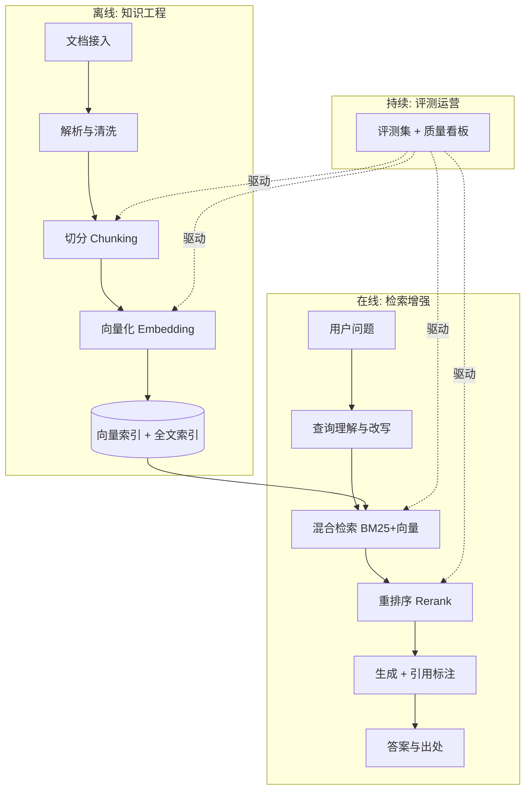
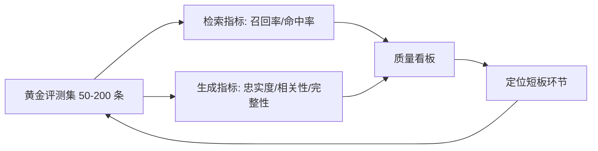

# 企业级 RAG 架构设计

> RAG 是企业落地大模型最成熟的路径，也是"Demo 与生产差距最大"的领域：一周能搭出一个问答原型，三个月未必能让它达到上线标准。差距不在模型，而在检索工程。这篇按完整链路拆解企业级 RAG 的设计要点——从解析切分、混合检索、重排，到 GraphRAG、Agentic RAG、评测与生产运营。

## 为什么是 RAG

企业有三类需求，微调都解决不好，而 RAG 天然适配：

1. **私有知识**：内部文档、产品手册、工单记录，不在模型训练语料里
2. **知识时效**：制度每季度更新，重训/微调成本不可接受
3. **可信可溯**：回答必须能标注出处——合规场景的硬性要求

RAG 的本质：**把"让模型记住知识"转换为"让模型阅读并引用知识"**。前者不可控，后者可工程化。

*图 1：RAG 的经典三段式——检索、增强、生成。图源：NVIDIA《What is Retrieval-Augmented Generation?》（[blogs.nvidia.com](https://blogs.nvidia.com/blog/what-is-retrieval-augmented-generation/)）*

## 全链路架构

一个关键认知：**RAG 的质量上限在离线链路，在线链路只是把上限兑现出来**。多数项目失败在解析和切分，而不是模型。另一个容易被忽视的事实是：**评测闭环必须与链路并行建设**，没有评测集的每一次调参都是盲调。

## 离线链路：质量上限在这里

### 文档解析：最脏最关键的活

- 扫描件要先过 OCR；表格、公式、图文混排是解析质量的试金石
- **表格要保结构**：拍平成文字的表格会丢失行列关系，检索必错。方案：Markdown 化、表格单独索引、或交给多模态理解
- **版面感知解析**：标题层级、列表、脚注都是结构信号，解析阶段丢掉，切分阶段就补不回来
- 实践口径：解析质量抽查合格率低于 90% 之前，不要谈后面的优化

### 切分（Chunking）：工程化的核心决策

| 策略 | 做法 | 适用 |
| --- | --- | --- |
| 定长切分 | 按 token 数硬切 + 重叠 | 快速起步，结构均匀的文本 |
| 结构感知 | 按标题/章节/段落边界 | 有清晰结构的文档（首选） |
| 语义切分 | 按语义相似度断句 | 长文、结构松散的内容 |
| 父子块 | 小块检索、大块送生成 | 兼顾检索精度与上下文完整 |
| 文档摘要块 | 标题 + 摘要 + 正文多粒度 | 需要全局理解的问答 |

**切分策略的演进脉络**值得记住：早期大家迷信"黄金块大小"，后来发现块大小只是表象，真正的变量是**语义完整性**。语义切分（按相邻句向量相似度骤降处断句）解决的是"把一句话拦腰切断"的问题；父子块（小块负责命中、大块负责提供上下文）解决的是"块太小丢上下文、块太大稀释语义"的矛盾。现在的共识是：**先结构感知，结构松散处用语义切分兜底，再用父子块组织**。

经验参数只是起点：**块大小通常在 256–1024 token 之间实验，重叠 10–20%**。真正的判据是评测集表现，不是任何默认值。

### Embedding 与索引

- Embedding 模型选型：优先看**中文与领域语料的检索评测表现**，维度与最大输入长度是硬约束
- 元数据过滤：租户、权限、文档类型、时间——先过滤再检索，隔离与时效都靠它

**2026 年主流 Embedding 模型选型参考**（口径为 MTEB / CMTEB 公开榜，具体到你的领域仍需自建评测集复测）：

| 模型 | 厂商/开源 | 维度 | 最大输入 | 定位与适用性 |
| --- | --- | --- | --- | --- |
| text-embedding-3-small | OpenAI | 1536（可降） | 8191 | 性价比首选，Matryoshka 支持降维 |
| text-embedding-3-large | OpenAI | 3072（可降） | 8191 | 多语言效果更强，可降到 256 维仍优于旧模型 |
| voyage-3.5 / voyage-4-large | Voyage AI | 1024（默认） | 32000 | 检索任务专项强，长上下文，另有 code/finance/law 垂类版 |
| Qwen3-Embedding-0.6B/4B/8B | 阿里（Apache 2.0） | 1024/2560/4096 | 32K | 8B 曾居 MTEB 多语言榜首，中文与代码检索俱佳，可私有化 |
| bge-m3 | 智源 BAAI | 1024 | 8192 | 单模型同时出稠密/稀疏/多向量，混合检索自洽 |
| embed-v4 | Cohere | 256–1536 可选 | — | 多语言 + 多模态，配合 Rerank 系列成套 |

选型上的三个一线判断：**私有化部署**优先 Qwen3 / bge 这类开放权重模型；**纯 API 托管**看 Voyage 与 OpenAI；**超长文档**（法律、研报）选 32K 上下文系。维度不是越大越好——高维度带来索引与内存成本，多数场景 1024 维已够用，配合 Matryoshka 降维可以再压存储。

对公开榜单要留一分警惕：**MTEB/CMTEB 反映的是通用语料上的平均检索能力，不等于你的领域表现**。榜单头部模型之间的差距往往小于一到两个点，而领域适配（术语、缩写、内部编码）的差异能到十个百分点以上。榜单用来圈定候选（2–3 个），最终排序交给自建评测集。

## 在线链路：把上限兑现

### 查询理解

用户的提问往往不完美：指代不明、口语化、一词多义。查询改写是性价比最高的环节：

- **查询重写**：口语 → 规范检索语言
- **多查询扩展**：一个问题拆成多个子查询并行检索再合并
- **HyDE（假设文档嵌入）**：先让模型"虚构"一段答案，用这段假设文档去做向量检索——缩小问句与文档之间的表达鸿沟，对提问过于简短的场景有效
- **上提式提问（Step-back）**：把具体问题抽象一层再检索（"A 型号报错 503 怎么办" → "A 型号常见故障处理"），适合细节问题在库里只有通用文档覆盖的情况
- **对话历史注入**：多轮场景必须把上下文问题补全成独立查询，否则"它的价格是多少"会检索不到任何东西

### 混合检索：BM25 + 向量的融合

单一向量检索不够：**混合检索（向量 + 全文关键词）是企业标配**。向量抓语义，关键词保精确匹配（产品名、编号、专有名词靠 BM25 才能命中）。两者各有一块对方覆盖不到的盲区：

- 向量检索擅长同义改写、概念匹配，但对低频词、型号编码、精确字面量不敏感
- BM25 擅长字面命中与稀有词，但读不懂"手机发热"和"机身温度过高"是同一件事

两路结果需要融合，最常用的是 **RRF（Reciprocal Rank Fusion）**：对每个文档，`RRF(d) = Σ 1/(k + rank(d))`，k 通常取 60。它的妙处在于**只用名次不用分数**——BM25 分数和余弦相似度本不可比，RRF 绕开了归一化难题，且天然偏好"两路都召回"的文档，鲁棒性极好。工程上先各取 top 50 做 RRF 融合，再交给重排。

### 重排序（Rerank）

初检召回宁多勿漏（top 30–50），再用重排模型精排到 top 3–5。**重排通常能带来最显著的效果提升**，代价是一次额外的模型调用（延迟增加 100–300ms 量级）。

重排有两条技术路线，取舍很清晰：

| 路线 | 代表 | 机制 | 取舍 |
| --- | --- | --- | --- |
| Cross-Encoder | bge-reranker、Qwen3-Reranker、Cohere Rerank | query 与文档拼接整体打分 | 精度高于双塔，专为相关性训练，延迟可控（百毫秒级） |
| LLM 重排 | 通用大模型 listwise/pointwise | 让 LLM 直接判断相关性 | 上限最高、可带推理，但贵且慢，一般只用于候选极少的精排或离线 |

一线经验：**优先上 Cross-Encoder**。它是为相关性专门训练的，性价比远高于拿通用 LLM 做重排；LLM 重排留给"必须理解复杂意图"的少数场景。2026 年 Qwen3-Reranker（0.6B/4B/8B，32K 上下文）与 Cohere Rerank 3.5（4K、多语言）是两条主流路线。

### 生成与引用

- Prompt 中明确：只依据给定材料回答、材料不足时承认不知道、逐句标注引用编号
- **引用粒度**：能落到"文档 + 段落/页码"就不要只给文档名；粒度越细，用户核验成本越低，幻觉也越容易被发现
- 引用必须可点击回原文——这是 RAG 相对纯大模型的信任优势，也是验收标准
- 拒答策略：检索置信度过低时引导人工或澄清，比硬答更保护业务信誉

## GraphRAG：什么时候向量检索不够用

微软提出的 GraphRAG 代表了一类新思路：**先从语料抽取知识图谱，再在图上检索**。它不是要取代向量检索，而是补上两类向量检索天然做不好的问题：

*图 2：GraphRAG 由 LLM 从语料抽取的知识图谱（官方 Figure 1）。图源：Microsoft GraphRAG 文档（[microsoft.github.io/graphrag](https://microsoft.github.io/graphrag/)）*

1. **多跳/连点成线类问题**：答案需要跨多个文档、经由共享实体串联才能得出。向量检索只能召回孤立片段，图谱能沿实体关系遍历
2. **全局摘要/整体理解类问题**："这批材料的主线是什么""全库范围有哪些主题"。这类问题没有单一可检索片段，GraphRAG 用社区检测（Leiden 分层）+ 逐层社区摘要，把语料组织成可全局问答的层级

代价同样明确：**索引期要烧大量 LLM 调用做实体抽取与摘要，构建慢、贵；且图随语料变更要重建**。查询端它也分了层级：Local Search 围绕实体邻域回答细节，Global Search 基于社区摘要回答全局，后来又有介于两者之间的 DRIFT Search。我的判断是：**默认不上，先把混合检索 + 重排做扎实**；只有当评测集里多跳与全局类问题占比高、且向量检索确实答不出来时，再针对性引入，或做成与向量检索并行的双通道。

## Agentic RAG：从固定管道到自主编排

传统 RAG 是"查询 → 检索 → 生成"的固定管道，Agentic RAG 把检索变成 **Agent 可自主决定何时调用、调用哪个、是否重试**的工具，呼应 [智能体技术全景](/ai/agent/) 里 L2 工具调用 → L3 工作流的分级。两类自校正模式最常用：

- **Self-RAG**：模型学会输出一组"反思令牌"，自己判断**要不要检索、检索回来的内容是否相关、生成是否被内容支撑**，按需检索、边生成边自检
- **CRAG（Corrective RAG）**：先给检索结果打一个质量分，分低就触发改写、分解文档或转去联网搜索，再送生成——本质是给检索加了一道"质检闸门"
- **路由与多库编排**：Agent 先判断问题该去哪个知识库（产品库/制度库/工单库），再决定检索策略。多库企业的真实形态往往不是一个大索引，而是"路由器 + 多个专业 RAG 工具"

工程落地的务实路径：不必一步到位上全自主框架，**先把"检索置信度低 → 澄清/换工具/降级"这条决策链固化成工作流**，再逐步交给模型自主编排。Agentic RAG 的增益主要在长尾复杂问题上，对高频简单问答反而增加延迟与成本。

## 评测：没有评测的 RAG 等于盲飞

**RAGAS** 是事实标准的评测框架，它把 RAG 质量拆成对检索和生成两端分别打分的指标：

*图 3：RAGAS 可用指标全景。图源：RAGAS 官方文档 Metrics Overview（[docs.ragas.io](https://docs.ragas.io/en/stable/concepts/metrics/overview/)）*

| 指标 | 衡量什么 | 需要标准答案？ | 归因指向 |
| --- | --- | --- | --- |
| Faithfulness（忠实度） | 回答中的论断有多少能被检索上下文支撑 | 否 | 生成端幻觉 |
| Answer / Response Relevancy | 回答是否切题、答非所问程度 | 否 | 生成端偏题 |
| Context Precision | 相关块是否排在召回列表靠前 | 是 | 检索排序 |
| Context Recall | 检索到的上下文是否覆盖了答案所需信息 | 是 | 检索召回 |

用法要点：**Faithfulness 用"论断可被上下文支撑的比例"计算，是抓幻觉的第一指标；Context Precision/Recall 需要黄金答案**，所以评测集要标注预期答案与出处文档。实操流程是：先跑检索指标定位"是没召回还是排序差"，再跑生成指标定位"是幻觉还是偏题"，两端归因清楚再决定动哪一环。

这类指标大多靠 LLM 当裁判（LLM-as-judge），要注意两点：**裁判模型的判断会有系统性偏差**（偏长答案、偏自家风格），上线前要抽一批样本做人工校验、算裁判与人工的一致率；**指标绝对值不要跨系统横比**，它们的价值在于同一系统内的纵向趋势与环节间归因。

- **评测集先行**：上线前必须积累业务真实问答的黄金集，标注预期答案与出处文档
- **分环节归因**：答案不对先问"检索到了吗"——检索没召回是索引/切分问题，召回了没答对才是生成问题。两类的修法完全不同
- **持续化**：线上坏例定期回流进评测集，评测集是 RAG 系统的"回归测试"

## 运营层：企业级与 Demo 的分界线

1. **增量更新与时效管理**：文档变更 → 增量解析 → 增量索引；删除文档必须同步删索引（权限回收的底线）。知识库要有"新鲜度"元数据，对时效性强的内容设定过期与复核策略，避免模型拿着旧制度作答
2. **权限贯通**：检索层的元数据过滤必须与文档权限系统打通——"模型能答出我看不到的文档"是安全事故
3. **缓存**：高频查询与高频文档块的 Embedding、重排结果都可缓存；对语义相近的查询做归一化缓存键，能显著摊薄 Embedding 与 LLM 调用成本
4. **引用溯源**：引用不能只是装饰——要落到具体文档 + 段落/页码，支持点击回链与审计留痕，这是合规验收的硬指标
5. **成本控制**：Embedding 与 Rerank 都是计费调用，控制召回条数、用降维向量压存储、给重排设候选上限；GraphRAG 的索引重建成本要单独立账
6. **延迟预算**：把端到端延迟拆成"检索（数十毫秒）+ 重排（百毫秒级）+ 生成（秒级，取决于输出长度）"分项立标，生成是主要矛盾，流式输出是标配缓解手段
7. **降级路径**：检索服务不可用时，明确降级策略（纯模型回答 + 免责声明，或直接人工）

## 常见坑

| 坑 | 后果 | 对策 |
| --- | --- | --- |
| 拿 PDF 直接塞默认解析 | 表格乱、页眉页脚成噪音 | 解析质量抽查，表格专项处理 |
| 只用向量检索 | 专有名词、编号查不中 | 混合检索 + RRF 融合 |
| 切分拍脑袋不实验 | 效果玄学波动 | 评测集驱动的参数扫描 |
| 跳过重排直接生成 | 召回噪声直接进上下文 | 加 Cross-Encoder 精排 |
| 一上来就上 GraphRAG | 索引又贵又慢，收益存疑 | 先做扎实混合检索，按需引入 |
| 换 Embedding 模型不重建索引 | 新旧向量不可比，检索质量崩塌 | 版本绑定 + 全量重建，灰度切换 |
| 没有评测集就上线 | 无法归因、无法汇报、无法迭代 | 评测先行 |
| 忽略权限 | 数据越权风险 | 元数据过滤 + 权限系统联动 |

## 小结

企业级 RAG 的成熟度阶梯：**解析质量 → 切分策略 → 混合检索 → 重排 → 评测闭环 → 权限与运营**。GraphRAG 与 Agentic RAG 是更高阶的可选项，前者解决多跳与全局理解，后者把检索交给模型自主编排，但都建立在前面几级扎实的前提下。每一级都有明确的工程判据，这也是它区别于"调个 API"的地方——RAG 是知识工程，不只是模型应用。

## 参考资料

<Refs>

**综述与标准**

- [Retrieval-Augmented Generation for Large Language Models: A Survey](https://arxiv.org/abs/2312.10997)（访问日期 2026-09-04）
- [Reciprocal Rank Fusion — OpenSearch 混合检索博客](https://opensearch.org/blog/introducing-reciprocal-rank-fusion-hybrid-search/)（访问日期 2026-09-04）

**框架与官方文档**

- [RAGAS 评测框架文档](https://docs.ragas.io/)（访问日期 2026-09-04）
- [RAGAS: Retrieval Augmented Generation Assessment（论文）](https://arxiv.org/abs/2309.15217)（访问日期 2026-09-04）
- [LlamaIndex 官方文档](https://docs.llamaindex.ai/)（访问日期 2026-09-04）
- [LangChain RAG Concepts](https://python.langchain.com/docs/concepts/rag/)（访问日期 2026-09-04）
- [Microsoft GraphRAG 官方文档](https://microsoft.github.io/graphrag/)（访问日期 2026-09-04）

**模型官方文档**

- [OpenAI Embeddings 指南](https://developers.openai.com/api/docs/guides/embeddings)（访问日期 2026-09-04）
- [Voyage AI Text Embeddings](https://docs.voyageai.com/docs/embeddings)（访问日期 2026-09-04）
- [Qwen3 Embedding 官方博客](https://qwenlm.github.io/blog/qwen3-embedding/)（访问日期 2026-09-04）
- [BGE-M3（Hugging Face）](https://huggingface.co/BAAI/bge-m3)（访问日期 2026-09-04）
- [Cohere Rerank 文档](https://docs.cohere.com/docs/rerank)（访问日期 2026-09-04）

**Agentic / 自校正**

- [Self-RAG: Learning to Retrieve, Generate, and Critique](https://arxiv.org/abs/2310.11511)（访问日期 2026-09-04）
- [Corrective Retrieval Augmented Generation（CRAG）](https://arxiv.org/abs/2401.15884)（访问日期 2026-09-04）

**图片来源**

- 图 1 RAG 三段式流程：NVIDIA 博客《What is Retrieval-Augmented Generation?》（[blogs.nvidia.com](https://blogs.nvidia.com/blog/what-is-retrieval-augmented-generation/)）
- 图 2 GraphRAG 知识图谱：Microsoft GraphRAG 官方文档 Figure 1（[microsoft.github.io/graphrag](https://microsoft.github.io/graphrag/)）
- 图 3 RAGAS 指标思维导图：RAGAS 官方文档 Metrics Overview（[docs.ragas.io](https://docs.ragas.io/en/stable/concepts/metrics/overview/)）

站内相关：[大模型推理部署实战](/ai/infra/inference/llm-inference) · [智能体技术全景](/ai/agent/) · [多模态应用](/ai/application/multimodal)

</Refs>
