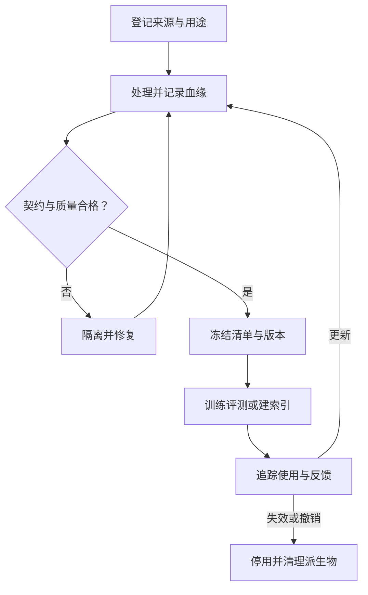

# AI 数据生命周期与血缘

> 面向数据工程师、算法工程师与 AI 平台负责人。读完能把数据来源、处理、发布和退出串成可追溯的链路，并判断一次训练或评测是否具备重新执行的条件。

## 数据资产包含内容、来源和使用条件

**AI 数据工程**负责持续提供适合指定任务的数据。表格特征、训练语料、评测样本和检索文档都属于其范围，但质量标准不同：预测任务关注特征在决策时是否可用，生成任务关注文本质量与分布，检索任务还要处理权限和知识生效时间。

工程上可以把一个数据资产理解为“内容 + 元数据 + 处理记录 + 使用约束”。仅知道某个存储路径，无法回答文件是否被覆盖、数据是否允许用于训练、标签采用哪个口径，以及哪些模型受到了错误数据的影响。

与[大数据体系](/cloud/data/bigdata)的分工是：数据平台负责采集、存储、计算等能力；本文关注进入 AI 系统的数据身份、责任和生命周期。

## 先为生产方和消费方建立数据契约

**数据契约**是双方对输入含义、质量、交付和变更作出的明确约定。下表是可按项目缩减的工程模板，不是某个产品要求的固定格式。

| 约定 | 至少写清什么 | 缺失时的后果 |
| --- | --- | --- |
| 业务含义 | 样本单位、实体标识、标签定义、适用任务 | 同名字段在不同团队含义不同 |
| 结构 | 类型、单位、枚举、空值含义、兼容规则 | 字符串与数字混用，单位变更未被发现 |
| 时间 | 事件发生时间、系统收到时间、可用于决策的时间 | 使用预测时尚未知的信息 |
| 交付 | 更新方式、完整性检查、迟到与重放规则 | 半批数据被当作完整快照 |
| 使用条件 | 来源依据、许可、允许用途、访问与保留规则 | 可访问的数据被误当作可任意使用 |
| 责任 | 生产方、消费方、异常联系人、变更通知 | 质量问题无明确处理人 |

契约要能触发检查。例如金额单位从“元”变成“分”，类型仍为整数，结构检查可能通过；需要业务范围检查和变更记录共同识别。

## 发布前建立可复核的数据状态

以下流程适合批数据、训练集和评测集。流数据可以在窗口、分区或日志偏移量范围上建立同样的发布边界。



原始区用于保留处理依据，但保留时长仍受用途和删除要求约束。处理区记录转换过程；发布区向消费者提供已经通过指定检查的数据。区域可以是逻辑状态，无需一开始建设三套存储系统。

## 版本号、快照与内容摘要各负责什么

**版本号**用于命名一次发布；**快照**表达某个时点或提交下的数据状态；**内容摘要**通过哈希等方法识别内容是否变化。三者需要明确关联。

阿里云 PAI 的[数据集管理文档](https://help.aliyun.com/zh/pai/create-and-manage-datasets)介绍了基础数据集版本及 OSS、文件存储等入口，适用阿里云中国站。这个产品事实不能单独证明所有底层文件都被冻结：选型时仍需验证存储对象能否覆盖、版本引用保存什么，以及旧数据能否重新读取。

以下是本文建议的发布记录字段；它是结构示意，实际摘要、访问位置和审批引用由流水线生成。

```yaml
dataset_id: support-intent
version: release-003
task: ticket-classification
source_snapshot: source-snapshot-018
content_manifest: manifests/release-003.json
schema_version: schema-002
transform_revision: transform-007
label_policy: intent-policy-004
split_policy: customer-group-and-time-v2
quality_report: quality-report-012
usage_policy: internal-classification-only
owner_role: data-owner
```

内容清单应包含实际对象标识、对象版本或快照、字节摘要、样本数量及分区范围。只冻结路径而允许原地覆盖，会使同一版本读取到不同内容。若底层保存的是数据库查询，则还要保存快照条件或物化结果，不能只保留随时间变化的 SQL。

重现实验还需要代码、依赖、参数及随机性条件；冻结数据只是其中一部分。对于外部托管模型，供应方可能不开放权重与完整运行环境，应明确可重放和可审计的边界。

## 血缘连接数据与实际执行

**数据血缘**描述数据从哪里来、经过什么处理、流向哪些资产。[OpenLineage 对象模型](https://openlineage.io/docs/spec/object-model/)用 Dataset、Job 和 Run 分别描述数据集、处理工作与一次执行，并通过事件及附加元数据连接输入输出。

在 ML 工作流中，[ML Metadata](https://www.tensorflow.org/tfx/guide/mlmd)记录制品、执行及两者之间的关系，用于追溯某个模型的上游输入或查找使用某份数据产生的下游制品。这些记录机制不自动保证采集完整；漏接一个手工导出步骤，就可能留下追踪缺口。

工程上至少验证两种查询：

- 从模型或索引版本反查原始输入、转换版本和执行结果，判断能否解释其来源。
- 从一份错误或撤销的数据正向查找训练、评测、索引和服务，形成影响清单。

血缘记录与权限控制分开实施。知道某人使用过数据，不代表其现在仍有访问权；能追到来源，也不代表来源许可满足当前用途。

## 数据卡为消费者说明适用边界

Hugging Face 的[数据卡文档](https://huggingface.co/docs/hub/datasets-cards)使用数据集仓库的 README 说明内容，并支持许可、语言等元数据及潜在偏差说明。

企业内部可以借鉴这种文档形式，增加采样范围、排除项、标注口径、已知缺口和维护责任。例如“覆盖中文售后工单，不覆盖语音转写与跨语种请求”，比只写“高质量客服数据集”更有判断价值。数据卡是说明文件，授权依据和质量报告仍需独立核验。

## 实践与选型：按追踪问题选择工具

| 首要问题 | 优先建立的能力 | 验证方法 |
| --- | --- | --- |
| 小团队无法复现实验 | 内容清单、对象版本、代码提交、数据卡 | 在隔离环境读取同一批输入 |
| 多引擎数据链路难追踪 | 跨平台血缘事件与统一数据标识 | 抽查一条跨引擎链路的输入输出 |
| 模型与数据依赖不清 | 实验追踪、制品关系与模型登记 | 由模型反查数据与评测证据 |
| 撤销来源后影响未知 | 下游依赖、停用状态与清理记录 | 从一个来源列出并处理所有受影响资产 |

虚构验收场景：某工单标签规则存在错误。先定位使用该规则的数据版本，再查训练与评测产物，暂停受影响版本的推广，修正后发布新版本并重新验证。旧版保留或清理按照既定使用条件执行。这是待执行的验证方案，不是生产实验结果。

## 常见坑

- 将“数据已经上传”当作“数据已经可用”：上传成功没有证明完整性、含义或使用条件。
- 每次清洗覆盖同一个目录：发布记录失去与实际字节的对应关系。
- 血缘只记录成功任务：失败、部分输出和重试也可能留下可被误用的资产。
- 删除注册记录就宣布数据消失：存储副本、缓存和下游制品需要分别处理；删除训练样本也不能据此断言模型已消除其影响。

## 参考资料

<Refs>

- [OpenLineage：Object Model](https://openlineage.io/docs/spec/object-model/)（访问日期 2026-10-04；项目公共文档）— 数据集、工作与执行的关系
- [TensorFlow：ML Metadata](https://www.tensorflow.org/tfx/guide/mlmd)（访问日期 2026-10-04；项目公共文档）— 制品与执行血缘
- [Hugging Face：Dataset Cards](https://huggingface.co/docs/hub/datasets-cards)（访问日期 2026-10-04；项目公共文档）— 数据说明与元数据
- [阿里云 PAI：创建及管理数据集](https://help.aliyun.com/zh/pai/create-and-manage-datasets)（访问日期 2026-10-04；中国站）— 数据集存储入口与版本管理
- 站内相关：[数据集质量](/ai/data/dataset-quality) · [知识治理](/ai/data/knowledge-governance) · [训练工程](/ai/infra/training) · [AI 联合版本](/ai/operations/version-release)

</Refs>
