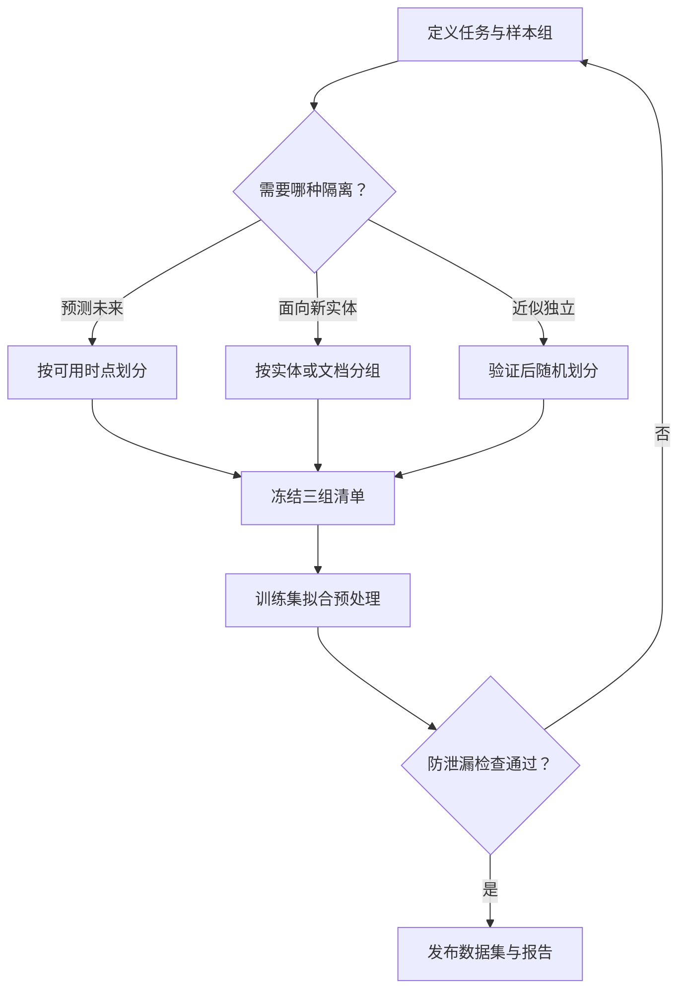

# 数据集质量、标注与防泄漏

> 面向准备训练数据、微调样本和业务评测集的工程师。读完能区分格式正确与任务有效，设计标注和划分规则，并识别离线成绩被重复样本或未来信息抬高的风险。

## 质量取决于数据要支持的判断

同一批工单可以用于意图分类、回复生成或知识检索。分类需要一致的标签定义，生成需要可靠的回答依据，检索需要来源、时间和访问边界。数据格式能够读取，只证明进入了处理链路。

建议在清洗前明确样本单位、目标用户、时间范围、输出要求和错误代价。随后按这些定义检查质量，避免为了提高一个整体分数而删除真实业务中的困难样本。

| 质量层面 | 核查对象 | 一个具体问题 |
| --- | --- | --- |
| 结构 | 类型、空值、单位、编码 | 金额是否统一为同一单位？ |
| 内容 | 重复、噪声、损坏、来源 | 同一文档的改写版是否反复出现？ |
| 语义 | 标签、答案依据、上下文 | 标签是在判断用户意图还是处理结果？ |
| 分布 | 时间、语言、业务与群体覆盖 | 总分是否主要来自常见且简单的请求？ |
| 使用条件 | 授权、用途、保留规则 | 允许做评测是否也允许用于训练？ |

## 结构和统计检查各有边界

[TensorFlow Data Validation](https://www.tensorflow.org/tfx/data_validation/get_started)支持统计分析、模式推断和异常检测，也能比较训练与服务数据、不同批次数据的分布。文档明确建议人工复核自动推断的模式。

实践中可以先从可信基线推导候选规则，再由数据负责人补充业务约束。例如身份证件编号不应当被当作连续数值特征；“空值”可能代表未采集，也可能代表不适用，这需要不同编码。异常出现后应判断是数据错误、业务变化还是规则过时，不能自动放宽规则让流水线通过。

结构检查很难发现“回答通顺但事实错误”。这类问题需要来源核查、领域标注和任务评测；统计分布相近也不能证明样本内容相同或标签正确。

## 标注规范需要表达分歧怎样处理

**标注**是按任务定义为样本赋予标签、答案或偏好。推荐先用一个小批次验证规范，再扩大生产。

规范至少包含正反例、边界情况、多标签规则、信息不足时的处理，以及冲突如何裁决。多人重复标注同一部分样本，可以发现口径分歧，但一致并不保证事实正确；统一采用错误规则也会高度一致。

对于由模型辅助生成的标签，保存辅助模型、提示词与复核方式，区分人工确认和自动推断。不能把模型自己的回答和评分组合成独立的正确性证据。

建议同时记录三类问题：标注员执行偏差、规范本身模糊、原始输入无法判断。第三类可以成为“需要补充信息或转人工”的有效样本，不必强行贴上确定标签。

## 防泄漏从划分单位开始

**数据泄漏**指训练或评测使用了真实决策时不可获得的信息，或评测内容通过其他路径进入了开发过程。它会使结果难以代表上线表现。

[scikit-learn 的常见陷阱文档](https://scikit-learn.org/stable/common_pitfalls.html)明确讨论测试数据参与预处理拟合造成的泄漏。以下将该原则扩展为数据集划分的工程建议，具体策略取决于部署任务：

- 文档切片先按原始文档或文档族归组，再分配集合，避免同一原文不同段落跨到训练与测试两侧。
- 同一用户、设备或会话的关联样本，按要验证的泛化目标决定是否整体隔离。
- 归一化参数、缺失值填充值、特征选择等仅在训练部分拟合，再应用于验证与测试部分。
- 验证集用于开发选择；保留测试集用于约定的最终评估。长期反复查看并针对性调优的测试集，应视为已经参与开发。
- RAG 任务允许检索业务知识，但应检查标准答案、评测问答或生成它们的材料是否被意外混入检索库。是否允许某类参考资料，要在任务定义中预先说明。

## 时点正确性还要检查信息何时真正可用

**时点关联**是按预测时刻还原当时可取得的特征。[Feast 文档](https://docs.feast.dev/getting-started/concepts/point-in-time-joins)说明了根据实体时间戳和特征 TTL 向过去关联的机制，也指出仅限制事件时间可能取到之后回填或修正的数据。

例如某条交易在 10:00 发生，风险标签在 14:00 才确认。模拟 10:05 的决策时，即使标签所属事件时间是 10:00，它仍不可用。数据契约需要区分事件发生时间与可用时间，并保证可用时间真实反映系统当时已知的信息。

Feast 当前文档提供 created timestamp 过滤选项，同时标明后端支持限制；实现前应核验使用版本和存储后端。工程验收应专门放入一条“事件早、到达晚”的回填样本，检查其是否错误进入历史特征。

## 合成数据进入训练前也要验收

**合成数据**是通过程序、仿真或模型生成的样本。它适合补充已定义的边界场景，但生成数量不能代表新增了同等数量的独立信息。

建议保存生成器版本、输入来源、筛选策略与人工复核记录。先排查近重复和答案错误，再分别评估加入前后的真实保留集表现。对自动评分器偏爱的表达方式、稀有群体覆盖和来源内容复现进行专项检查。

以虚构的客服意图分类为例，可以生成同一意图的多种口语表达，但不能只用同一个生成模型制作测试集并判断提升。测试集应有与目标业务相符、独立构建的真实或经领域人员验证的样本。这里描述实验设计，不宣称任何增益。

## 发布质量报告时保留分母与缺口

推荐每次数据发布同时交付一份质量报告：

| 报告项 | 应记录的内容 |
| --- | --- |
| 样本流转 | 输入、去重、排除、保留数量与原因，避免无声丢样本 |
| 结构检查 | 规则版本、异常范围、修复或接受原因 |
| 标注检查 | 覆盖范围、冲突类型、裁决口径与抽查结果 |
| 集合隔离 | 时间边界、分组键、重复检测方法和已知盲区 |
| 任务覆盖 | 按业务、语言、时间等切片的数量与质量 |
| 使用边界 | 可用任务、排除用途、来源和维护责任 |

可以采用[数据卡](https://huggingface.co/docs/hub/datasets-cards)承载面向消费者的说明，将详细检查报告链接进去。阈值依据业务风险、基线和样本规模制定；一个未经解释的“质量分 95”难以支持发布决定。

## 常见坑

- 为追求整洁而删除所有难例，使数据集偏离真实业务。
- 全量去重后不记录同源关系，仍让改写、摘要和切片跨集合。
- 只按事件时间切分，忽略晚到标签和回填特征。
- 把用户点赞、模型评分直接当作标准答案。
- 只报总体平均分，忽略关键业务切片的退化；统计判断方法见[大模型评测](/ai/application/evaluation)。

## 参考资料

<Refs>

- [TensorFlow：Get started with Data Validation](https://www.tensorflow.org/tfx/data_validation/get_started)（访问日期 2026-10-04；项目公共文档）— 结构、统计与异常检查
- [Feast：Point-in-time joins](https://docs.feast.dev/getting-started/concepts/point-in-time-joins)（访问日期 2026-10-04；项目公共文档）— 事件时间、可用时间与后端限制
- [scikit-learn：Common pitfalls](https://scikit-learn.org/stable/common_pitfalls.html)（访问日期 2026-10-04；项目公共文档）— 预处理与数据泄漏
- [Hugging Face：Dataset Cards](https://huggingface.co/docs/hub/datasets-cards)（访问日期 2026-10-04；项目公共文档）— 数据集用途与限制说明
- 站内相关：[数据生命周期](/ai/data/data-lifecycle) · [大模型评测](/ai/application/evaluation) · [工程数学与度量](/software/foundations/engineering-math-measurement) · [生产反馈](/ai/operations/monitoring-feedback)

</Refs>
