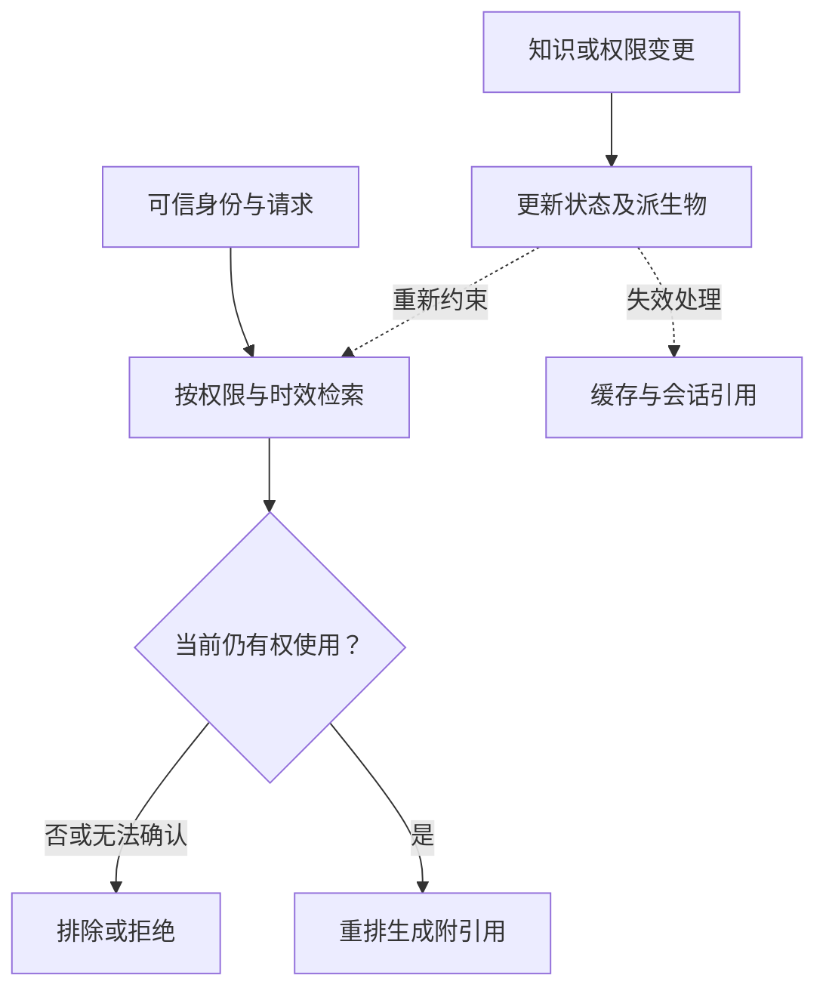

# 企业知识治理：权限、时效与删除

> 面向企业知识库、RAG 与 Agent 的开发和运营人员。读完能为知识建立权威来源、有效期和访问规则，并验证文档更新、权限撤销或删除之后，系统是否仍会使用旧内容。

## 知识治理管理“能否使用这条内容”

[RAG 架构](/ai/application/rag-architecture)解释解析、切分、检索与重排。知识治理进一步回答：谁负责这份知识，何时有效，谁能看到，依据是什么，失效后如何退出。

文档有创建时间，不代表仍然有效；相似度高，不代表来源权威；使用者能够访问整个搜索服务，也不代表能读取其中所有文档。这些条件应在进入模型上下文前得到验证。

## 用稳定标识连接原文与派生物

以下为企业知识条目的建议字段。来源平台能够提供的属性应尽量保留，新增字段应有明确生成规则。

| 字段组 | 建议记录 | 用途 |
| --- | --- | --- |
| 身份 | 来源系统、文档 ID、版本、内容摘要 | 识别更新、去重和派生关系 |
| 责任 | 内容所有者、审核角色、业务域 | 冲突与过期内容有处理人 |
| 有效性 | 生效时间、失效时间、复核期限、替代关系 | 按业务时点选择知识 |
| 访问 | 租户、允许主体或策略引用、权限版本 | 控制每次检索与后续使用 |
| 来源 | 原文位置、段落或页码、采集时间 | 回溯引用并核查答案 |
| 派生 | 解析、切分、嵌入与索引版本 | 找到需要更新或清理的对象 |

“发布日期”“生效日期”和“采集日期”应分开。例如制度在本月发布、下月生效，回答当前规则与未来规则时需要不同的时间条件。来源冲突可按正式制度、批准的操作规程、业务解释等建立优先级，但具体顺序由知识所有者制定。

## 权限在检索和使用链路上执行

[Azure AI Search 文档级访问控制](https://learn.microsoft.com/en-us/azure/search/search-document-level-access-overview)区分应用传入身份并构造安全过滤的方式，以及基于身份与权限元数据的原生能力；当前页面将部分原生 ACL、RBAC scope 和敏感度标签能力标为预览。这些是 Azure 全球文档中的产品边界，不能直接推导其他云或中国区的可用性。

通用工程建议是：由可信服务端解析用户身份与租户，构造权限条件，在内容进入重排器、外部模型或工具之前完成授权。不能让用户请求任意传入“我是管理员”，也不能仅让模型遵守“不要回答无权限内容”。

当权限元数据缺失或刷新失败时，高敏感场景宜拒绝使用不确定的内容。缓存命中也要检查当前授权，或将租户、授权范围和策略版本纳入缓存隔离；仅以用户问题作为缓存键，可能复用其他人的答案。

长会话还需要处理历史上下文：检索时曾经有权，不意味着后续每次调用仍可把原文发送给模型。重新使用相关内容时应核查现行权限；撤销不能收回已经被用户看到的信息，因此还要记录暴露范围。

## 更新、撤销和删除是不同事件

| 事件 | 立即目标 | 后续动作 |
| --- | --- | --- |
| 内容更新 | 按新版本提供正确知识 | 重建受影响切片与嵌入，验证后切换 |
| 权限撤销 | 阻止新的未授权使用 | 更新授权状态、索引权限、缓存和会话处理 |
| 知识过期 | 按规则停止作为当前依据 | 寻找替代文档，复核历史查询需求 |
| 来源删除 | 停止检索并追踪派生物 | 清理索引、文件副本与缓存，保留允许的处置证据 |

**删除标记**用于表达某个来源已被撤销或删除，帮助下游即使在延迟、失败和重放时也识别这一状态。具体实现可以是事件日志或独立状态表，应支持幂等处理与重试。

Azure AI Search 的[删除文档说明](https://learn.microsoft.com/en-us/azure/search/search-how-to-delete-documents)指出，某些索引器同步依赖软删除流程；若在索引器识别前物理删除源内容，可能留下索引孤儿。这里的普遍工程含义是：删除需要有可消费、可核对的状态，不能只根据源文件已不存在判断完成。

推荐为一次清理保存来源 ID、影响清单、请求时间、各下游处理结果与未完成项。完成条件应同时包括无法再检索、缓存不能返回旧内容，以及相关派生物按约定处置。备份和审计记录按其独立保留规则处理，不能含糊地承诺“全系统即时删除”。

## 索引回滚必须保留当前撤销状态

索引损坏时恢复旧快照，可能重新带回已经撤销的文档与旧权限。建议把索引内容版本与当前禁止使用记录分开管理，恢复后重新应用删除和授权变更，再开放流量。

虚构示例：某制度文档的敏感附件被撤回，系统随后回滚到上周索引。正确的恢复验收应使用已失去权限的身份、旧引用和缓存命中路径验证附件仍不可访问。只检查索引条数恢复正常，会漏掉这个问题。

已经用于训练的内容还需要单独评估模型影响。删除检索条目可以阻止后续检索，但不能据此证明模型权重已经“忘记”该内容。

## 让知识运营有可测量的目标

以下指标为建议定义，阈值由业务敏感度与维护能力决定：

- **更新可见延迟**：从内容批准生效，到新版本能够被正确检索的时间。
- **撤销生效延迟**：从撤销事件确认，到受影响身份的新请求无法再使用内容的时间。
- **失效知识使用率**：检查样本中，使用已过期或被替代内容的请求占比。
- **引用可回溯率**：答案引用中，能定位具体来源版本且访问条件正确的比例。
- **清理未完成量**：按下游系统与失败原因统计仍未完成的清理任务。

指标报告保留采样范围和分母。抽查未发现泄漏，不等于全部请求都已通过授权验证。

## 常见坑与验收场景

| 失败模式 | 建议验收 |
| --- | --- |
| 只在回答后过滤敏感词 | 检查无权限内容是否已经进入重排或模型输入 |
| 文档更新却复用旧摘要 | 验证原文、切片、嵌入、摘要和答案缓存的关联 |
| 删除原文后不追踪下游 | 使用来源 ID 检查所有派生物与重试状态 |
| 恢复快照复活撤销内容 | 在恢复演练中重放权限与删除事件 |
| 权限刷新失败继续服务 | 模拟身份或策略服务不可用，核对降级行为 |

上述验收是可执行的方案设计，本文未在具体企业系统中执行。

## 参考资料

<Refs>

- [Microsoft：Document-level access control](https://learn.microsoft.com/en-us/azure/search/search-document-level-access-overview)（访问日期 2026-10-04；Azure 全球文档）— 应用过滤、原生权限与预览边界
- [Microsoft：Delete documents](https://learn.microsoft.com/en-us/azure/search/search-how-to-delete-documents)（访问日期 2026-10-04；Azure 全球文档）— 删除同步与孤儿文档
- 站内相关：[RAG 架构](/ai/application/rag-architecture) · [数据生命周期](/ai/data/data-lifecycle) · [Agent 安全](/ai/agent/security) · [发布与回滚](/ai/operations/version-release) · [企业 AI 治理](/ai/operations/enterprise-governance)

</Refs>
