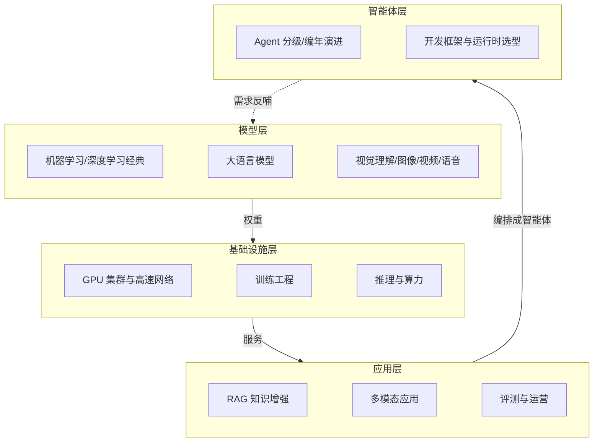

# 人工智能：知识全景

*本站生成的高清全文阅读地图；具体版本、参数与结论以正文引用的一手来源为准。*

> 人工智能支柱按“模型—系统—应用—智能体”组织：**模型**解释能力从何而来，**AI Infra**解释训练与推理如何运行，**应用**解释能力如何被评测并接入业务，**Agent**解释模型如何通过工具与编排完成长程任务。

## 知识全景

三层共用同一个工程命题：**在质量、延迟、成本三角里做显式取舍**；智能体层则在此之上叠加"编排与治理"的命题。

## 四个子域

### 模型：基础、理解与生成

按能力类型组织：基础模型（ML/DL、LLM）、多模态理解（视觉、语音识别）与多模态生成（图像、视频、语音生成）。

→ [模型架构演进](/ai/models/)

### AI Infra

模型背后的系统工程：GPU 集群与高速网络（NVLink/RDMA/分布式存储）、训练工程（预训练/后训练/强化学习）、推理优化与算力成本。

→ [AI Infra 总览](/ai/infra/)

| 文章 | 状态 |
| --- | --- |
| [GPU 集群与高速网络](/ai/infra/cluster) | 已发布 |
| [训练工程](/ai/infra/training) | 已发布（持续扩充） |
| [大模型推理部署实战](/ai/infra/inference/llm-inference) | 已发布 |
| [GPU 选型与推理成本测算](/ai/infra/inference/gpu-sizing) | 已发布 |
| [Token 经济学：定价与成本的数学](/ai/infra/inference/token-economics) | 已发布 |

### 大模型应用

把模型能力工程化为业务价值：RAG、多模态应用、评测与运营。

→ [大模型应用](/ai/application/)

| 文章 | 状态 |
| --- | --- |
| [企业级 RAG 架构设计](/ai/application/rag-architecture) | 已发布 |
| [多模态应用](/ai/application/multimodal) | 已发布 |
| [大模型评测](/ai/application/evaluation) | 已发布 |

### Agent

把模型编排成能干活的智能体：概念分级、热点编年演进、开发框架与运行时选型。

→ [智能体技术全景](/ai/agent/)

| 文章 | 状态 |
| --- | --- |
| [Agent 热点编年史](/ai/agent/history) | 已发布 |
| [Agent 开发框架对比](/ai/agent/frameworks) | 已发布 |

## 一句话入门

大模型时代的技术栈 = **模型定义能力上限 + Infra 定义成本下限 + 应用兑现业务价值**。工程上 80% 的功夫花在"把概率性的模型输出，包进确定性的工程系统里"。
