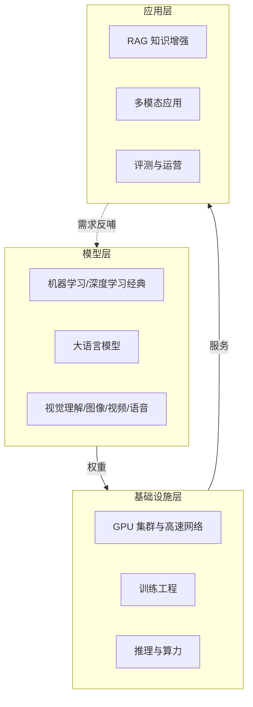

# 人工智能：知识全景

> 人工智能是本知识体系的核心支柱。作者亲历了从传统机器学习、深度学习（DNN/CNN/RNN/GAN/YOLO）到大模型时代的完整技术演进，这一支柱按"模型—系统—应用"组织：**模型架构演进**记录每一代模型的架构解析，**AI Infra** 记录训练与推理的系统工程，**大模型应用**记录工程化落地的方法。智能体（Agent）已独立为 [Agentic 支柱](/agentic/)。

## 知识全景

三层共用同一个工程命题：**在质量、延迟、成本三角里做显式取舍**。

## 三个子域

### 🧬 模型架构演进

从机器学习经典到多模态大模型的完整谱系：ML/DL 基础、LLM、视觉理解、图像生成、视频生成、语音——每一代模型的架构解析与演进逻辑。

→ [模型架构演进](/ai/models/)

### 🔧 AI Infra

模型背后的系统工程：GPU 集群与高速网络（NVLink/RDMA/分布式存储）、训练工程（预训练/后训练/强化学习）、推理优化与算力成本。

→ [AI Infra 总览](/ai/infra/)

| 文章 | 状态 |
| --- | --- |
| [GPU 集群与高速网络](/ai/infra/cluster) | 🚧 撰写中 |
| [训练工程](/ai/infra/training) | ✅ 已发布（持续扩充） |
| [大模型推理部署实战](/ai/infra/inference/llm-inference) | ✅ 已发布 |
| [GPU 选型与推理成本测算](/ai/infra/inference/gpu-sizing) | ✅ 已发布 |

### 🧩 大模型应用

把模型能力工程化为业务价值：RAG、多模态应用、评测与运营。

→ [大模型应用](/ai/application/)

| 文章 | 状态 |
| --- | --- |
| [企业级 RAG 架构设计](/ai/application/rag-architecture) | ✅ 已发布 |
| [多模态模型与视频生成（应用视角）](/ai/application/multimodal) | 🚧 提纲 |

## 一句话入门

大模型时代的技术栈 = **模型定义能力上限 + Infra 定义成本下限 + 应用兑现业务价值**。工程上 80% 的功夫花在"把概率性的模型输出，包进确定性的工程系统里"。
