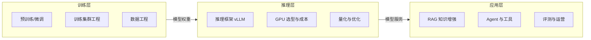

# 人工智能：知识全景

> 人工智能是本知识体系的第二支柱，也是当前更新最频繁的区域。按价值交付的链路分为三层：**训练**产出模型，**推理**交付算力，**应用**产生业务价值。聚焦工程与架构，不做论文综述。

## 三层结构

三层共用同一个工程命题：**在质量、延迟、成本三角里做显式取舍**——训练层为效果买单，推理层为吞吐买单，应用层为业务价值兜底。

## 三个子域

### 🎓 模型训练

从数据到模型权重的全过程：预训练、微调（SFT/PEFT）、对齐、训练集群的并行与容错工程。

→ [模型训练导读](/ai/training/)

### ⚡ 推理与算力

模型如何变成可调用的服务：推理框架、GPU 容量规划、量化与成本测算。当前的成本主战场。

→ [推理与算力](/ai/inference/)

| 文章 | 状态 |
| --- | --- |
| [大模型推理部署实战](/ai/inference/llm-inference) | ✅ 已发布 |
| [GPU 选型与推理成本测算](/ai/inference/gpu-sizing) | ✅ 已发布 |

### 🧩 大模型应用

把模型能力工程化为业务价值：RAG、Agent、评测与运营。

→ [大模型应用](/ai/application/)

| 文章 | 状态 |
| --- | --- |
| [企业级 RAG 架构设计](/ai/application/rag-architecture) | ✅ 已发布 |
| [Agent 与 MCP](/ai/application/agent) | 🚧 提纲 |
| [多模态模型与视频生成](/ai/application/multimodal) | 🚧 提纲 |

## 一句话入门

大模型时代的应用架构 = **训练产出模型 + 推理交付算力 + 应用兑现价值**。工程上 80% 的功夫花在"把概率性的模型输出，包进确定性的工程系统里"。
