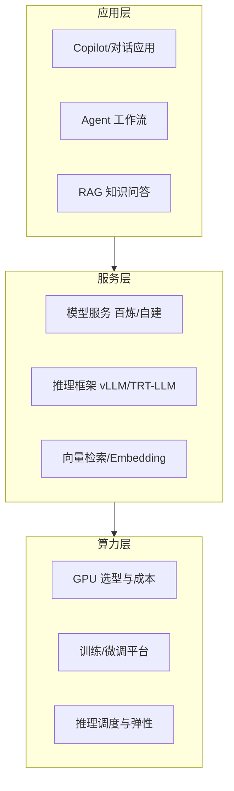

# 05 · AI 与大模型

> 当前的主战场。大模型把应用栈重塑了一遍：底层是算力与推理优化，中间是模型服务与知识增强（RAG），上层是 Agent 与应用。这一域是当前更新最频繁的区域，聚焦**工程与架构**，不做论文综述。

## 这个域回答什么问题

- 大模型推理的成本结构是什么？为什么"买卡"只是成本的一小部分？
- 如何在延迟、吞吐、成本三者之间为推理服务选型（vLLM/量化/并发）？
- 企业级 RAG 为什么"Demo 容易、落地难"？检索质量怎么量化与优化？
- Agent / Function Calling / MCP 的应用边界与架构模式？

## 知识框架

## 文章列表

| 文章 | 状态 | 说明 |
| --- | --- | --- |
| [大模型推理部署实战](/ai/llm-inference) | ✅ 已发布 | 种子文：vLLM、量化、并发与生产化要点 |
| [GPU 选型与推理成本测算](/ai/gpu-sizing) | ✅ 已发布 | 种子文：容量规划与成本模型 |
| [企业级 RAG 架构设计](/ai/rag-architecture) | ✅ 已发布 | 种子文：从 Demo 到生产的完整链路 |
| [Agent 与 MCP](/ai/agent) | 🚧 提纲 | Function Calling、工具编排与落地边界 |

## 一句话入门

大模型应用架构 = **模型即服务 + 知识即检索 + 工具即接口**。工程上 80% 的功夫花在"把不确定的模型输出，包进确定的工程系统里"。
