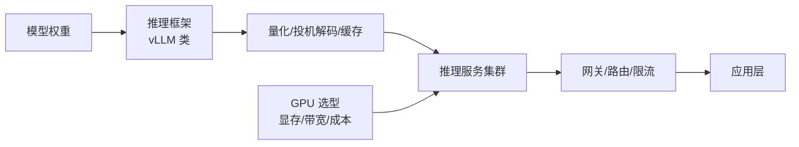

# 推理与算力

> 推理层把模型权重变成可调用的服务，是大模型应用栈里的**成本主战场**：GPU 选型、框架优化、量化、容量规划都在这里。训练决定模型能力的上限，推理决定能力兑现的单价。

## 文章列表

| 文章 | 状态 | 说明 |
| --- | --- | --- |
| [大模型推理部署实战](/ai/inference/llm-inference) | ✅ 已发布 | vLLM/Continuous Batching/量化/生产部署架构 |
| [GPU 选型与推理成本测算](/ai/inference/gpu-sizing) | ✅ 已发布 | 从模型规格到卡数到单位成本的完整测算链 |

## 子域地图

## 计划扩充方向

- 推理网关与多模型路由设计
- 长上下文场景的 KV Cache 工程
- 自建推理的运维手册（升级、扩缩容、故障演练）

## 衔接

- 上游：[模型训练](/ai/training/) · 下游：[大模型应用](/ai/application/)
