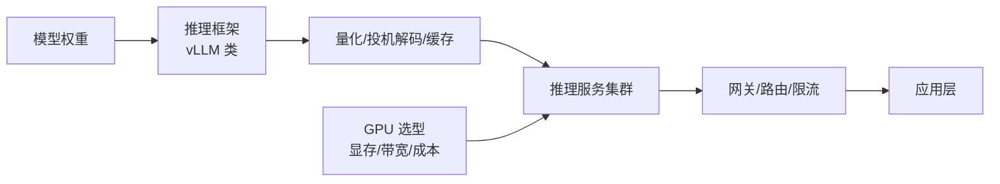

# 推理与算力

> 推理层把模型权重变成可调用的服务，是大模型应用栈里的**成本主战场**：GPU 选型、框架优化、量化、容量规划都在这里。训练决定模型能力的上限，推理决定能力兑现的单价。

## 文章列表

| 文章 | 状态 | 说明 |
| --- | --- | --- |
| [大模型推理部署实战](/ai/inference/llm-inference) | ✅ 已发布 | vLLM/Continuous Batching/量化/生产部署架构 |
| [GPU 选型与推理成本测算](/ai/inference/gpu-sizing) | ✅ 已发布 | 从模型规格到卡数到单位成本的完整测算链 |

## 子域地图

## 计划扩充方向

- 推理网关与多模型路由设计
- 长上下文场景的 KV Cache 工程
- 自建推理的运维手册（升级、扩缩容、故障演练）

## 精选资源

> 筛选标准：官方与一手来源优先，近两年内容优先，经典明确标注。更新于 2026-09-01。

### 推理框架与 Serving

- [Efficient Memory Management for LLM Serving with PagedAttention](https://arxiv.org/abs/2309.06180) — vLLM 奠基论文，理解 KV Cache 管理的一手资料（2023 · 论文）
- [vLLM V1: A Major Upgrade to vLLM's Core Architecture](https://vllm.ai/blog/2025-01-27-v1-alpha-release) — 官方详解 V1 架构重构：调度器与性能跃升（2025 · 官方文档）
- [SGLang v0.4：零开销调度与缓存感知负载均衡](https://www.lmsys.org/blog/2024-12-04-sglang-v0-4/) — 一线推理框架的工程实践（2024 · 工程博客）
- [NVIDIA/TensorRT-LLM](https://github.com/NVIDIA/TensorRT-LLM) — N 卡深度优化推理引擎的权威参考（2025 · 开源项目）
- [InternLM/lmdeploy](https://github.com/InternLM/lmdeploy) — 国产推理工具链：量化到部署一站式（2025 · 开源项目）
- [Mooncake: A KVCache-centric Disaggregated Architecture for LLM Serving](https://arxiv.org/abs/2407.00079) — 以 KVCache 为中心的 PD 分离架构，经生产验证（2024 · 论文）
- [腾讯一念 LLM 分布式推理优化实践](https://www.infoq.cn/article/l9zc91xqcxm9qflpxsrn) — PD 分离与分布式推理的一线落地复盘（2025 · 工程博客）

### 量化与加速

- [AWQ: Activation-aware Weight Quantization](https://arxiv.org/abs/2306.00978) — INT4 权重量化经典论文，激活感知思路被业界广泛采用（2023 · 论文）
- [Floating Point 8: An Introduction to Efficient Lower-Precision AI](https://developer.nvidia.com/blog/floating-point-8-an-introduction-to-efficient-lower-precision-ai-training/) — 官方讲透 FP8 数值格式与低精度加速（2025 · 官方文档）
- [Fast Inference from Transformers via Speculative Decoding](https://arxiv.org/abs/2211.17192) — 投机解码奠基论文，无损加速的理论基础（2023 · 论文）
- [EAGLE: Speculative Sampling Requires Rethinking Feature Uncertainty](https://arxiv.org/abs/2401.15077) — 生产环境主流投机解码方案（2024 · 论文）

### GPU 选型

- [The Best GPUs for Deep Learning — An In-depth Analysis](https://timdettmers.com/2023/01/30/which-gpu-for-deep-learning/) — 算力/显存/带宽/成本四维选型方法论，公认经典（2023 · 工程博客）

## 衔接

- 上游：[模型训练](/ai/training/) · 下游：[大模型应用](/ai/application/)
