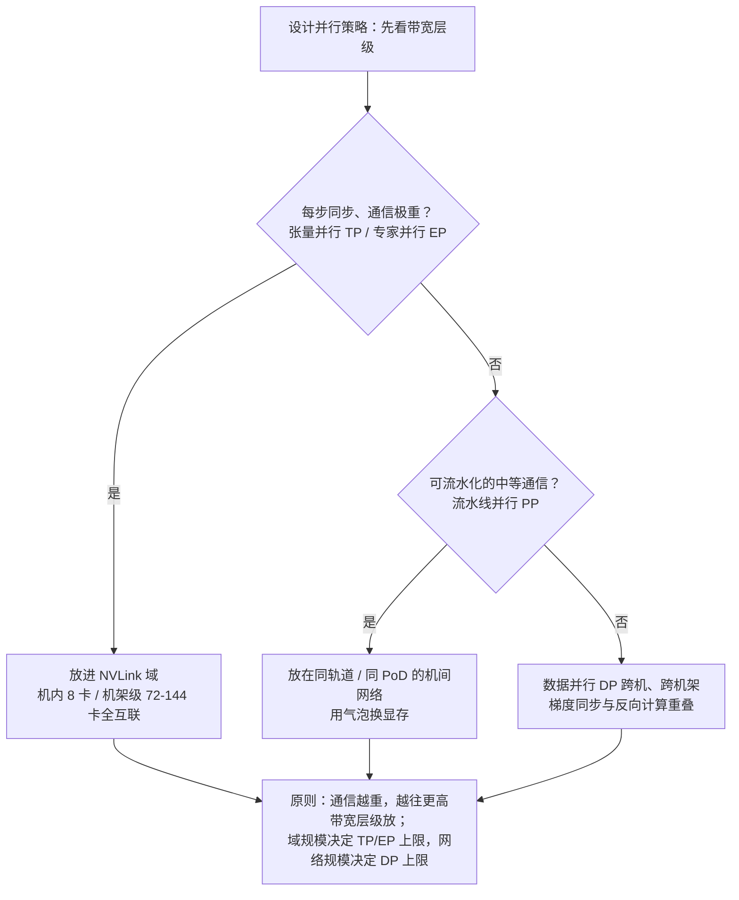
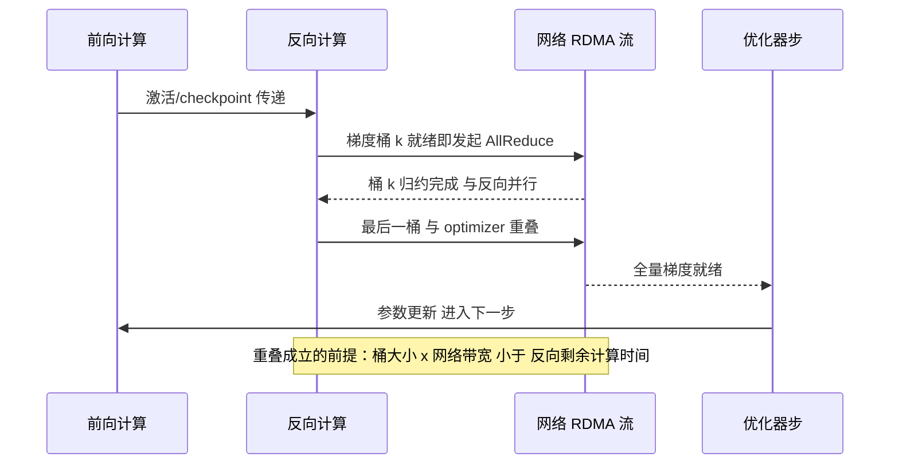
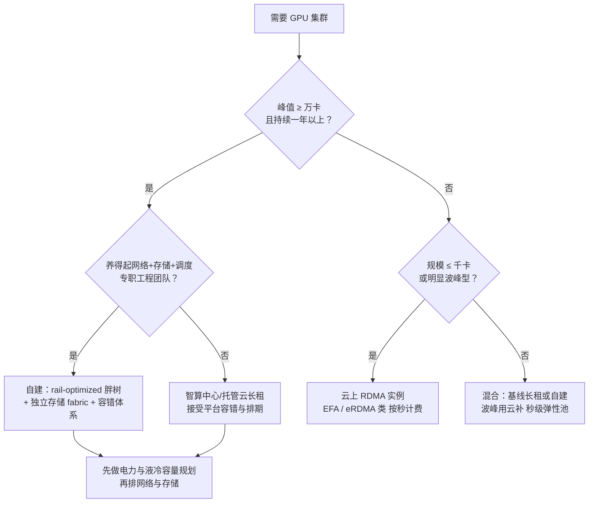

# GPU 集群与高速网络

> 面向要自建或租用千卡到万卡 GPU 集群、需要为训练与后训练 workload 做网络与存储决策的工程师和方案架构师。这篇把"万卡集群"这台巨型计算机逐层拆开：**机内 NVLink/NVSwitch 域怎么从 8 卡扩到一机架 72 卡乃至 576 die、机间 RDMA 网络为什么在 InfiniBand 与 RoCE 之间分成两个阵营、轨道优化胖树与收敛比怎么决定并行策略的可行空间、集合通信的带宽账怎么算、存储与 checkpoint 为什么是隐藏瓶颈、以及故障常态下容错体系怎么把有效训练时长拉回 90% 以上**。全文按"单卡 → 机内 → 机间 → 集合通信 → 存储 → 功耗 → 可靠性 → 选型"的顺序推进，所有数字截至 2026-09 均为公开口径。

全文只有一条主线：**带宽是分层的，所有设计都是"把通信往高带宽层塞"的推论**。各节回答的问题依次是：

- 机内互联——NVLink 域能多大，TP/EP 能铺多开；
- 机间网络——InfiniBand 还是 RoCE，拓扑与收敛比怎么定；
- 集合通信——每步通信量怎么算，重叠怎么做，账怎么评；
- 存储与数据管线——checkpoint 风暴与"GPU 等数据"怎么治；
- 功耗与液冷——机架成为供电单元之后的选址与 TCO 账；
- 可靠性工程——故障常态下，有效训练时长怎么保到 90% 以上；
- 选型与常见坑——规模 → 形态 → 拓扑 → 存储的决策顺序，以及我踩过的坑。

## 心智模型：集群是一台计算机，带宽是分层的

把集群当一台计算机看，很多设计决策就不再玄学：**这台机器的"总线"有四个层级，带宽每跨一层掉一个数量级**——HBM 显存带宽（TB/s 级）> NVLink 域内互联（每卡数百 GB/s 到 TB/s）> 机间 RDMA 网络（每卡数十到上百 GB/s）> 存储网络（每节点数十 GB/s）。并行策略、拓扑设计、存储选型，全部是"把通信量往高带宽层级塞"这一个原则的推论。

| 层级 | 介质与典型产品 | 每卡/每节点带宽量级 | 承载的通信 | 放错层的代价 |
| --- | --- | --- | --- | --- |
| L0 显存 | HBM3/HBM3e/HBM4 | 3–22 TB/s | 权重、激活、KV | 放不下即 OOM，只能切模型 |
| L1 域内互联 | NVLink + NVSwitch（HGX / NVL72） | 0.9–3.6 TB/s | TP、EP 的 AllReduce / All-to-All | 拆到域外，MFU 断崖 |
| L2 机间网络 | InfiniBand NDR/XDR、RoCE v2 400G/800G | 50–100 GB/s | PP 点对点、跨轨 DP、大 EP 溢出 | 拥塞与尾延迟吃掉步时 |
| L3 存储网络 | 并行 FS 独立 fabric（IB 或 RoCE） | 每节点 10–50 GB/s | 数据集读、checkpoint 写 | 加载与集合通信互抖 |



这张图也是本文所有硬件讨论的索引：下面每一节，都是在解释某一层为什么是现在这个样子。

## 机内互联：NVLink 域与机架级超节点

### 为什么需要 NVLink

训练时 GPU 间要交换梯度、激活和专家路由，PCIe 带宽（Gen5 约 64 GB/s 单向量级）是瓶颈，NVLink 把机内互联拉高到数百 GB/s 乃至 TB/s——机内通信走"总线"而不是"网络"，没有协议栈、没有排队抖动。与 PCIe 的差异可以拆成四点：

- **语义**：PCIe 是事务层协议，跨卡访问要走 P2P 窗口或主机内存中转；NVLink 是 load/store 语义，CUDA kernel 可以直接对远端显存发读写。
- **延迟与抖动**：域内无排队、无重传，集合通信的尾延迟由最慢一条链路决定，而域内链路是全集群里最"干净"的一段。
- **拓扑**：PCIe 以 CPU 为根成树，卡间通信天然绕路；NVSwitch 把卡间通信变成交换域，任意两卡等带宽。
- **演进速度**：PCIe 约三年一代、带宽翻倍；NVLink 每 GPU 代际翻倍，两者差距逐代拉大——这就是"TP 不能出域"的物理根源。

NVIDIA 官方口径的代际曲线非常陡：2020 年 A100 的第三代 NVLink 每卡 600 GB/s，到 2026 年 Vera Rubin 的第六代 NVLink 每卡 3.6 TB/s，六年六倍。


*图源：NVIDIA NVLink 官方产品页代际图（[nvidia.com/data-center/nvlink](https://www.nvidia.com/en-us/data-center/nvlink/)，访问日期 2026-09-05）*

### NVSwitch：把点对点总线变成交换域

NVLink 最早只是 GPU 之间的点对点桥，能连几颗卡完全受限于引脚数；NVSwitch 交换芯片把它变成了真正的交换域：

- **Hopper 一代（HGX H100/H200）**：基板上 4 颗第三代 NVSwitch，每颗 GPU 的 18 条 NVLink 4 通道拆分挂到 4 颗交换芯片上，构成 8 卡无阻塞全互联，任意两卡等带宽 900 GB/s；第三代 NVSwitch 同时引入了 SHARP 在网归约能力。
- **Blackwell 一代（GB200/GB300 NVL72）**：NVSwitch 从基板走上独立托盘——9 个 NVLink Switch 托盘、18 颗 NVSwitch 芯片，把 **72 张 GPU 组成一个域**，域内任意两卡直达，整架聚合带宽 130 TB/s；机架内走铜缆背板，是这个密度下功耗与成本的最优解。
- **Rubin 一代（Vera Rubin NVL72）**：NVLink 6 每卡 3.6 TB/s，整机架聚合 260 TB/s；NVIDIA 的公开表述是"超过全球互联网总带宽"。
- **域的管理面**：NVSwitch 域需要 Fabric Manager 做初始化与路由/隔离管理，域内坏卡的隔离粒度是"踢出域"而不是"踢出机"——运维流程要按域设计。

**域越大，张量并行（TP）与专家并行（EP）可铺开的规模越大**——MoE 时代这一点是决定性的：专家分布在哪些卡上，必须由域边界说了算。


*图源：NVIDIA 开发者博客《NVIDIA Contributes NVIDIA GB200 NVL72 Designs to Open Compute》（[developer.nvidia.com](https://developer.nvidia.com/blog/nvidia-contributes-nvidia-gb200-nvl72-designs-to-open-compute-project/)，访问日期 2026-09-05）*

### HGX 8 卡拓扑：节点是一切拓扑的原点

HGX 8 卡基板（H100/H200/B200/B300 同构）是过去五年所有集群拓扑的原点，三句话可以概括它的网络人格：

- **域内**：8 颗 GPU 经 NVSwitch 全互联构成 L1 域，TP/EP 的主战场。
- **域外**：每颗 GPU 各自引出一条 400G RDMA 网卡上机间网——这就是"轨道"的物理来源，8 卡机天然有 8 条轨。
- **分网**：看一台 DGX H100 的后面板，**4 个双口 OSFP 笼提供 8×400G 计算网（每卡一轨）、独立 QSFP 口接存储网、再分开 in-band 与 out-of-band 两张管理网**——计算、存储、管理三张网在节点上就是物理分离的。


*图源：NVIDIA DGX SuperPOD Reference Architecture（H100）——Network Fabrics，Figure 4（[docs.nvidia.com](https://docs.nvidia.com/dgx-superpod/reference-architecture-scalable-infrastructure-h100/latest/network-fabrics.html)，访问日期 2026-09-05）*

**架构含义**：并行策略要"贴着硬件拓扑做"。通信最重的维度（TP/EP）放进域内，通信中等、可流水的维度（PP）放在同轨道机间，通信轻、可重叠的维度（DP）才跨域跨架——前面那张 Mermaid 就是这条经验的形式化。我见过的多数性能事故，根因都是"把 TP 拆到了 NVLink 域外"这类拓扑错配。

### 代际规格与机架级系统

**代际观察**：每代升级的主线是"HBM 容量/带宽 + 域规模"双扩张；显存带宽决定推理上限，域规模决定训练并行上限。NVIDIA 官方页口径的三代对比：

| 指标 | H100 SXM | H200 | B200 | B300 (Ultra) | Rubin (VR200) |
| --- | --- | --- | --- | --- | --- |
| HBM | 80 GB HBM3 | 141 GB HBM3e | 192 GB HBM3e | 288 GB HBM3e | 288 GB HBM4 |
| 显存带宽 | 3.35 TB/s | 4.8 TB/s | 8 TB/s | 8 TB/s | ~22 TB/s |
| FP8 dense | ~2.0 PF | 同左 | ~4.5 PF | ~4.5 PF | — |
| FP4 dense | — | — | 9 PF | **15 PF** | **50 PF**（sparse，推理） |
| NVLink/卡 | 900 GB/s | 900 GB/s | 1.8 TB/s | 1.8 TB/s | **3.6 TB/s** |
| TDP | 700 W | 700 W | ~1000 W | ~1400 W | 机架 >250 kW |

（数据为 NVIDIA 官方公开口径；PF 为 dense/sparse 混合标注，量级对比用，精确值以官方白皮书为准。）

机架级系统沿着"域扩张"这条线推进，2025–2026 的节奏是一年一代：

| 系统 | NVLink 域 | 聚合 NVLink 带宽 | 聚合 HBM | 机架功耗量级 | 交付窗口 |
| --- | --- | --- | --- | --- | --- |
| HGX H100/H200 | 8 卡 | 7.2 TB/s | 0.64/1.13 TB | 风冷 ~10 kW | 2022–2024 |
| GB200 NVL72 | 72 卡 | 130 TB/s | 13.4 TB HBM3e | ~120–132 kW 液冷 | 2024–2025 |
| GB300 NVL72 | 72 卡 | 130 TB/s | 20.7 TB HBM3e | ~130 kW+ 液冷 | 2025 |
| Vera Rubin NVL72 | 72 封装 / 144 die | **260 TB/s** | ~20.7 TB HBM4 | **>250 kW** | 2026 下半年 |
| Rubin Ultra NVL576（Kyber 机架） | 576 die | NVLink 7 | 约 100 TB 级快存储 | **~600 kW** | 2027 |

几点一线的解读：

- **命名口径要先对齐**：Rubin 一代官方曾以 die 数称 NVL144，2026 年 CES 起统一按封装数称 Vera Rubin NVL72（72 封装 × 2 die = 144 die），260 TB/s 与 3.6 TB/s 指的都是这一个机架；做采购与容量规划时务必确认报价单里的"NVL72/144"数的是封装还是 die。
- **GB200 NVL72 官方宣称万亿参数 LLM 实时推理 30 倍、MoE 10 倍于上代；GB300 NVL72 聚合 HBM 升到 20.7 TB；Vera Rubin NVL72 宣称推理 token 成本最高降 10 倍**——倍数是厂商口径，量级趋势可信。
- **Scale-out 网卡同步换代**：GB300 计算托盘每 GPU 配 ConnectX-8 SuperNIC（800 Gb/s，可拆 2×400G），存储与管理面交给 BlueField 类 DPU 的南北向口；Rubin 一代换 ConnectX-9（1.6 Tb/s）。机内域翻倍、机间口也翻倍，两层带宽比大致维持 10:1~20:1。
- **NVLink Fusion 向第三方 XPU 开放互联授权**，2026 年起会出现"非 NVIDIA 加速器挂 NVLink 域"的混合机架，域边界管理会更复杂。
- **路线图节奏**：Rubin 2026 下半年交付、Rubin Ultra（Kyber/NVL576）2027、Feynman 一代 2028 以后——一年一代成为常态，Scale-up 域沿 8 卡 → 72 卡 → 144 die → 576 die 扩张；对采购而言残值管理已经是财务问题而不是技术问题。


*图源：NVIDIA Enterprise Reference Architecture《NVL72 AI Factory》Figure 3（[docs.nvidia.com](https://docs.nvidia.com/enterprise-reference-architectures/nvl72-ai-factory/latest/components.html)，访问日期 2026-09-05）*

### 域规模速查：TP/EP 能铺多大

| NVLink 域规模 | 典型系统 | TP 可行空间（经验） | EP 放置建议 |
| --- | --- | --- | --- |
| 8 卡 | HGX H100/H200/B200/B300 | TP 4–8，dense 模型主流选择 | 中小 MoE 域内 EP8 |
| 72 卡 | GB200/GB300 NVL72 | TP 可到 16–32（超宽/长序列模型） | EP 32–72 域内，All-to-All 不出域 |
| 72 封装 / 144 die | Vera Rubin NVL72 | 同上，域内带宽再翻倍 | 大 EP 域内，跨架仅做 DP |
| 576 die | Rubin Ultra NVL576（2027，Kyber 机架） | 域内 TP 基本不再成为约束 | 超大 EP 全域内 |

（经验值为公开架构口径下的常见映射，具体以模型形状与序列长度实测为准。）

**做容量规划时我的习惯是按"域"而不是按"卡"做单位**：买多少卡不重要，买多少个 NVLink 域、域间网络怎么接，才决定并行策略的可行空间。一个直观的账：405B 级模型 TP=8 放在 HGX 域内刚好；若域只有 8 卡而模型需要 TP=16，要么换 NVL72 级机架，要么把 TP 拆成"域内 TP8 + 域间 TP2"并接受跨域 AllReduce 的代价——后者在多数场景不划算。

## 机间网络：RDMA、拓扑与 800G 时代

### 为什么必须 RDMA

数据并行与流水线并行的跨机通信量巨大（梯度同步按模型大小计，万卡 DP 每一步都要 all-reduce）。TCP 协议栈的延迟、中断与 CPU 拷贝开销在这个量级下不可接受——**RDMA（远端直接内存访问）绕过内核协议栈，网卡直接读写远端内存**，再配合 GPUDirect 让数据在显存与网卡之间直达，CPU 全程不参与。这是过去十年 AI/HPC 网络的共识底座。

### 一个节点四张网：前端、后端、存储、管理

进入具体技术之前，先把"一个 GPU 节点到底插了几张网"说清楚——这是所有拓扑讨论的地面事实：

| 网络 | 承载流量 | 典型速率 | 设计要点 |
| --- | --- | --- | --- |
| 后端/计算网 | 集合通信、PP 点对点（RDMA） | 每 GPU 400G/800G，轨道化 | 无损或端侧兜底，收敛比是钱的问题 |
| 存储网 | 数据集读、checkpoint 读写 | 每节点 200–800G | 独立 fabric，避免与计算互抖 |
| 前端网 | 数据注入、控制面、与外界通信 | 100–400G | 普通以太网即可，安全边界在此 |
| 管理网（in-band/OOB） | 调度、带外管理（BMC/PDU/交换机控制台） | 1–25G | OOB 独立成网，故障时最后的抓手 |

SuperPOD 与 Meta 的公开架构在这四张网的划分上完全一致，差异只在实现（IB 或 RoCE）。**评审任何集群方案，先要这张表；表里缺一张网，后面就会以事故的形式补回来。**

### InfiniBand vs RoCE：工程对比

| 维度 | InfiniBand | RoCE v2 |
| --- | --- | --- |
| 生态 | NVIDIA 垂直整合，开箱即用 | 以太网生态，供应商多、可自研 |
| 拥塞控制 | 子网管理 + 信用流控，确定性高 | 依赖 PFC/ECN 调优，或端侧协议兜底 |
| 拓扑 | Fat-Tree 成熟 | Fat-Tree / 轨道优化 / AI Zone 均可 |
| 规模上限 | 单子网数千到万级，靠多子网路由扩展 | 以太网路由生态，横向扩展更自由 |
| 运维面 | UFM 类子网管理器收敛复杂度 | PFC/ECN/光模块/流分布全链路自管 |
| 成本 | 交换机+网卡来源单一，溢价明显 | 白盒交换机与多源光模块可压价 |
| 趋势 | 退守极端规模与超低延迟场景 | 云厂商与超大规模自建主力，UEC 标准化推进中 |

### InfiniBand 侧：把复杂度收进子网管理器

InfiniBand 的工程哲学与 RoCE 相反：**把无损与路由的责任收进网络自身**。几个一线相关的点：

- 子网管理器（SM）集中下发 LID 路由与转发表，配合 UFM 类工具做遥测与故障定位；运维界面统一，但 SM 本身是高可用设计点。
- 信用流控（credit-based）在链路层保证无丢包，不需要 PFC，也就没有 PFC 死锁与暂停扩散这类以太网专属事故。
- 自适应路由与 SHARP 在网归约是 IB 的差异化能力：前者缓解哈希极化，后者把 AllReduce 的归约下沉到交换机。
- 代价同样明确：交换机与网卡来源单一、溢价明显，多租户与云化弹性弱于以太网生态；超大规模自建者因此普遍转向 RoCE/UEC 路线。

Meta 在 2024 年为建设 Llama 3 训练集群做了业内最著名的对照实验：**两个同为 24,576 张 H100 的集群，一个用 RoCE（Arista 7800 + OCP Wedge400/Minipack2 交换机），一个用 NVIDIA Quantum-2 InfiniBand**，结论是调优后的 RoCE 能达到与 IB 同级的集合通信性能。但注意"调优后"三个字——同一篇博客里的图显示，24K 大集群在"开箱"状态下集合通信性能方差极大（不同任务的有效带宽从一成到九成都有），经过端到端调优才收敛到与小集群一致的高位：


*图源：Meta Engineering Blog《Building Meta's GenAI Infrastructure》（[原文](https://engineering.fb.com/2024-03-12/data-center-engineering/building-metas-genai-infrastructure/)，访问日期 2026-09-05）*

这张图是我给所有准备上 RoCE 的团队看的第一张图：**RoCE 的便宜是拿网络工程团队的水平换的**。PFC 死锁、ECN 阈值、打流不均、光模块一致性，任何一项没管住，训练 MFU 就会以百分点为单位往下掉。IB 则把这部分复杂度收进了子网管理器（配套 UFM 类工具），代价是生态锁定与采购来源单一。

### Meta RoCE 集群解剖：三层 Clos、AI Zone 与 1:7 收敛

Llama 3 论文与 Meta 的 SIGCOMM '24 报告把这套 RoCE 网络拆得很透，是理解"以太网怎么跑万卡"的最好教材：

- **三层 Clos**：机架层每架 16 张 GPU（2 台服务器）挂 1 台 Minipack2 ToR；中间层 192 架经集群交换（CTSW/RTSW 两层）组成 **3,072 GPU 的 AI Zone/pod，pod 内全对分带宽、无收敛**；顶层 8 个 pod 经聚合交换（ATSW）连成 24,576 GPU，**聚合层收敛比 1:7**。
- **负载均摊**：训练流量是少数几条巨流，传统 ECMP 按流哈希根本摊不开。Meta 的做法是集合通信库在每对 GPU 间**开 16 条流**，再用 Enhanced-ECMP 对 RoCE 头额外字段做哈希，把 16 条流打散到不同路径。
- **拥塞控制**：脊柱层用深缓冲交换机吸收集合通信的瞬时突发，**全程不用 DCQCN 这类传统拥塞控制**——这是一个非常大胆的公开表态，前提是全链路调优与流量工程到位。
- **并行与调度感知拓扑**：并行策略与作业调度都被设计成"感知 pod 边界"，尽量把通信锁在 pod 内；1:7 的跨 pod 收敛只在 DP 这类可重叠流量上兑现。


*图源：Meta Engineering Blog《RoCE networks for distributed AI training at scale》（[原文](https://engineering.fb.com/2024-08-05/data-center-engineering/roce-network-distributed-ai-training-at-scale/)，访问日期 2026-09-05）*

同一篇博客还给了两张"工程细节图"，值得逐张看：

**其一，三张网的物理分离**。前端网（FSW/RSW，100G/200G）走数据注入与控制面，AI 机架内每 GPU 一张 400G 网卡上后端网（RTSW/CTSW），存储另成体系。这与 SuperPOD 的"计算/存储/管理三 fabric"是同一个设计哲学的两种实现。


*图源：Meta Engineering Blog《RoCE networks for distributed AI training at scale》（[原文](https://engineering.fb.com/2024-08-05/data-center-engineering/roce-network-distributed-ai-training-at-scale/)，访问日期 2026-09-05）*

**其二，用信用流控替代 PFC**。Meta 在传输层做了基于信用的端到端流控：发送侧把数据拷入通道缓冲，RDMA 网卡写出；接收侧 CPU 代理以 CTS/Complete/Flush 消息控制节奏，把"无损"的责任从交换机的 PFC 挪到端侧协议，从根上回避 PFC 死锁与暂停扩散。


*图源：Meta Engineering Blog《RoCE networks for distributed AI training at scale》（[原文](https://engineering.fb.com/2024-08-05/data-center-engineering/roce-network-distributed-ai-training-at-scale/)，访问日期 2026-09-05）*

**其三，多路径与 QP 数量的关系**。同一份工作的测量显示：单 QP 时大消息只能吃到线路带宽的几成，把消息轮转（round-robin）切到 4–16 个 QP 后，2 GB 级消息的有效带宽逼近线速——这就是"16 条流 + E-ECMP"的微观依据。**流数不是玄学参数，是拿带宽换出来的**。


*图源：Meta Engineering Blog《RoCE networks for distributed AI training at scale》（[原文](https://engineering.fb.com/2024-08-05/data-center-engineering/roce-network-distributed-ai-training-at-scale/)，访问日期 2026-09-05）*

### 拓扑：胖树与轨道优化

机间网络的标准答案是**轨道优化（Rail-optimized）+ 胖树**：每台机器的 8 张 GPU 各自接到 8 个独立的网络平面（"轨道"），同号 GPU 组成一个平面。它的好处是把 collective 通信的主流量（同 rank 间的 all-reduce/all-to-all）锁在同一轨道内、一跳可达，只有跨轨道流量才上脊柱层——这与"把通信重的维度放进高带宽层级"的心智模型完全同构。NVIDIA 的 DGX SuperPOD 参考架构就是这个设计的标准件：H100 代每系统 8 条 NDR 400G 轨道、每个可扩展单元（SU）32 节点同轨一跳互联，SU 间或跨轨流量走脊柱层，整网无阻塞全胖树；存储则单独一张 InfiniBand 网，因为 SuperPOD 要求每节点 I/O 超过 40 GB/s。


*图源：NVIDIA DGX SuperPOD Reference Architecture（H100）——Network Fabrics（[原文](https://docs.nvidia.com/dgx-superpod/reference-architecture-scalable-infrastructure-h100/latest/network-fabrics.html)，Figure 5，访问日期 2026-09-05）*

**收敛比是胖树设计里唯一需要拍板的钱的问题**：无阻塞胖树（1:1）的交换机与光模块数量随规模平方级增长，SuperPOD 参考架构给的是全对分；Meta 的选择是"pod 内 1:1、跨 pod 1:7"，把收敛放在可重叠的 DP 流量上。我的经验法则：**收敛可以买，但必须放在通信模型证明过可重叠的那一层**；把收敛放在 TP/EP 会经过的层级，等于给最重的通信收税。

代际演进上，GB200 SuperPOD 延续 rail-optimized 胖树（每系统 8×NDR 400 跨架），B300 代升级为双平面（twin-plane）胖树以匹配 XDR 800G；轨道数与每轨带宽，基本跟着"每卡 RDMA 带宽 ≈ NVLink 带宽的 1/10~1/20"的经验比例走。**一线要记住的坑**：轨道优化对"rank 放置"有强约束——并行策略的 rank 映射如果不感知轨道（比如把同一 TP 组拆到不同轨道的脊柱层后面），等于主动放弃拓扑红利。

### 光模块与物理层：800G 时代的布线账

拓扑决定逻辑，物理层决定能不能落地。800G 一代我踩过的和见过的坑，集中在这几件事：

- **光模块一致性比速率更致命**：同型号不同批次的光模块在误码与温漂上的差异，足以让某几条链路周期性重传；万卡集群要把光模块当"耗材+序列号资产"管理，入库即测、上链即记。
- **DAC/ACC 与光混布**：机架内短距优先铜缆（DAC/ACC），跨架才上光模块——NVL72 机架内 NVLink 走铜缆背板是同一逻辑；混布比例直接影响功耗与故障面。
- **LPO/CPO 的演进**：线性驱动可插拔光学（LPO）先降功耗，共封装光学（CPO）在 2026 年进入交换机产品，Rubin Ultra 一代机架互联明确走向 CPO；选型时问清"光引擎坏了换什么"。
- **布线密度即交付风险**：一个 127 节点 SuperPOD 的计算 fabric 就要千条级缆线（NVIDIA 参考架构给出按 SU 规模的交换机与缆线计数表），施工与标签规范要写进验收标准。

### 存储网络独立成 fabric


*图源：NVIDIA DGX SuperPOD Reference Architecture（H100）——Network Fabrics（[原文](https://docs.nvidia.com/dgx-superpod/reference-architecture-scalable-infrastructure-h100/latest/network-fabrics.html)，Figure 6，访问日期 2026-09-05）*

注意 SuperPOD 把存储网络**独立成一张 fabric** 并给出收敛比建议（存储设备 1:1、计算节点约 4:3）——"存储网与计算网混布省一张网"是小集群的省钱办法，万卡集群上这是拿训练效率赌建设成本，多数情况不划算。

### 800G 时代与 2026 互联格局

几个已经落地的趋势（截至 2026-09）：

- **以太网在 AI 后端网络的新部署上反超 InfiniBand**。Dell'Oro 口径：2023 年 InfiniBand 还占 AI 后端交换机销售约八成，2025 年以太网已超过三分之二、规模是 IB 的两倍以上；与 Meta/Google/xAI Colossus/AWS 全部押注以太网的公开信息一致。IB 退守极端规模与超低延迟场景，但 2026 年上半年仍有明显反弹，短期内不会消失。
- **速率迁移表**：Dell'Oro 预测 AI 后端端口 2025 年以 800G 为主、2027 年 1.6T、2030 年 3.2T；2026 年二季度 AI 后端交换机销售首次超过前端网络——后端（scale-out/scale-up）已经是数据中心网络的主战场。
- **UEC 1.0 规范**（2025-06-11 发布，560+ 页）进入产品化期，核心是 Ultra Ethernet Transport：包喷洒、多路径 RDMA、乱序交付，目标是为多厂商以太网定义 AI 级的传输与拥塞控制标准；NVIDIA Spectrum-X 则用"端到端调优的以太网"把与 IB 的性能差距压到个位数百分比。
- IB 侧 XDR 800G（Quantum-X800）2025 年底起批量出货；共封装光学（CPO）交换机 2026 年上市，功耗与布线密度是下一个战场——Rubin Ultra 一代机架内互联已明确走向 CPO。
### 跨数据中心：WAN 成为训练拓扑的一部分

- **从概念到实践**：Microsoft Fairwater（双城 AI WAN、十万英里级光纤）、OpenAI Stargate（多站点）等公开项目，用专用 WAN 把多站点连成统一 GPU 域；2026 年起"多园区一集群"已是超大规模厂商的默认叙事。
- **带宽层级再加一层**：跨站带宽比机间再低一到两个数量级（每 GPU 摊到 Gb/s 量级），因此**只放得下流水线维度、专家溢出的低频部分或异步任务**，别指望跨站做 TP。
- **同步语义要重新设计**：跨站链路下，step 级全局同步的代价过高，公开实践普遍退到"站点内同步 + 站点间异步/流水"的混合语义，容错与 checkpoint 策略随之改变。
- **光学与电力的地理套利**：跨站组网的另一动机是把算力放到电便宜的地方；WAN 成本与延迟是这笔套利的边界条件。

### 云上的 RDMA：EFA 与 eRDMA

云厂商把 RDMA 做成了弹性服务，这是云上训推的默认选项：

- **AWS EFA**：自研传输协议（SRD）跑在 AWS 自有 fabric 上，多路径 + 乱序容忍，绕开传统 RoCE 对无损以太网的依赖；p5 实例（H100）单机 3200 Gbps 量级的聚合带宽，第二代 EFA 进一步支持显存直达。它的设计哲学与 Meta 的信用流控同源：**把无损的责任从网络挪到端侧协议**。
- **阿里云 eRDMA**：基于 CIPU 的弹性 RDMA，普通 VPC 里秒级组网、全地域可用，官方口径在分布式训练场景有可观的吞吐收益；后续在 SIGCOMM 上公开的 Stellar 一代继续把 RDMA 虚拟化做多租户化。

云上用 RDMA 的取舍与自建相同但更尖锐：**你买到的"无损"是云厂商的工程成果，调优空间也一并交给了平台**。我的经验是云上跑千卡以内训练，EFA/eRDMA 类方案已经够用；真正的万卡自建，才需要上面这一整节的网络工程能力。

## 集合通信：流量模型与带宽账

### 每种并行维度的通信形状

把并行策略翻译成网络语言，就是四种集合通信形状，各自对带宽层级的要求完全不同：

| 并行维度 | 通信形状 | 消息量级（每步） | 频率 | 应放层级 |
| --- | --- | --- | --- | --- |
| TP | AllReduce（激活） | 2 × 每层 2 次 × b·s·h·2B | 每层、不可重叠 | L1 NVLink 域 |
| EP | All-to-All（dispatch/combine） | 每层 2 次 × token·h·2B | 每 MoE 层 | L1 域内，溢出到 L2 同轨 |
| PP | 点对点（激活边界） | 每 stage 边界 b·s·h·2B | 每 microbatch | L2 同轨/PoD 内 |
| DP/FSDP | AllReduce 或 RS+AG（梯度） | 2 × 模型梯度字节数 | 每步、可重叠 | L2/L3 跨机架 |

**AllReduce 的带宽账**：ring AllReduce 中每卡收发总量为 2×(N−1)/N×M ≈ 2M（M 为消息总字节），与卡数几乎无关——这是 DP 能横向扩到万卡的根本原因；代价是延迟随 N 线性增长，小消息场景 tree/hierarchical 算法更优。**All-to-All 每卡发送 (N−1)/N×M ≈ M**，看起来比 AllReduce 省一半，但它对"任意两卡之间"的带宽都有要求，因此 EP 规模一旦越过 NVLink 域，就会把压力均匀地铺到整张机间网上。

一个可以直接套用的速算表（BF16 梯度、不做重叠的纯通信时间，有效带宽按线速 90% 估）：

| 模型规模 | 梯度 M | AllReduce 每卡 2M | 400G（≈45 GB/s） | 800G（≈90 GB/s） |
| --- | --- | --- | --- | --- |
| 7B | 14 GB | 28 GB | 0.6 s | 0.3 s |
| 70B | 140 GB | 280 GB | 6.2 s | 3.1 s |
| 405B | 810 GB | 1.62 TB | 36 s | 18 s |

这张表解释了两件事：其一，**DP 的梯度同步必须与反向计算重叠**，否则 405B 级模型每步白等半分钟；其二，TP 的 AllReduce 在关键路径上、无法重叠，所以 405B 级模型 TP 组内每步约数十 GB 的激活通信只能靠 NVLink 的 TB/s 级带宽消化——把它放到 50 GB/s 的机间网，通信时间会直接变成步时的主要成分。

### All-to-All 与 MoE：网络压力的新形状

MoE 把集合通信的主流量从 AllReduce 换成 All-to-All，形状完全不同，几个一线结论：

- **流量形状**：每个 MoE 层有 dispatch 与 combine 两次 All-to-All，每卡每步发送量 ≈ 2 × 层数 × 激活 token × 隐藏维 × 精度字节；与 AllReduce 不同，它对"任意卡对"都要求带宽，因此**域外 EP 会把压力均匀铺满整张机间网**。
- **专家放置即拓扑问题**：专家组尽量落在 NVLink 域内（NVL72 级域可容纳数十到上百专家）；域外溢出的专家组，要确保其 All-to-All 走同轨一跳，否则跨脊柱流量会先于算力成为瓶颈。
- **负载不均是常态**：路由热点让某些专家所在卡成为 straggler；容量因子（capacity factor）与专家均衡损失是在"通信尾延迟"和"模型质量"之间做交易。
- **监控要换指标**：dense 时代看 AllReduce 带宽利用率，MoE 时代还要看每专家 token 分布与 All-to-All 的 P99 完成时间——热力图工具要按专家维度再画一张。

### 通信与计算重叠

重叠是万卡 MFU 的免费午餐，但有明确的适用边界：

- **DP 梯度 AllReduce 重叠反向**：按桶（bucket）在反向产出梯度后立即发起归约，最后一桶与优化器步重叠；FSDP 的参数 all-gather 用预取与下一微批重叠。Llama 3 的公开配置（16K 卡、DP=128）BF16 MFU 38–43%，重叠与分桶是前提。
- **PP 的点对点重叠**：interleaved 调度 + 异步 send/recv，把气泡率压到 (PP−1)/(V×M) 量级；Llama 3 用 N 可调的微批调度把点对点通信藏进计算。
- **TP 基本不可重叠**：每层的 AllReduce 在关键路径上，这也是 TP 必须留在域内的第三个理由（前两个是带宽与延迟）。
- **In-Network 归约**：InfiniBand 的 SHARP 把 AllReduce 的归约下沉到交换机，理论上把注入网络的字节减半；以太网阵营的对应能力（UEC 的在网计算选项）仍在产品化早期。我见过的多数集群默认不开 SHARP，原因是故障域与调试复杂度上升——这是一笔要算运维成本的账。



### NCCL 算法与参数面

集合通信库（NCCL 及其发行版分支）在算法选择上有明确的层级偏好，理解它才能读懂监控里的带宽数字：

- **Ring**：每卡收发量与规模无关（≈2M），带宽最优、延迟随 N 线性增长——大消息、大 DP 的默认。
- **Tree / Double Tree**：延迟对数增长，小消息与跨层拓扑更优；NCCL 会按消息大小与拓扑自动在 ring/tree 间切换。
- **NVLS（NVLink SHARP）**：在 NVSwitch 域内用多播 + 在网归约，把 TP/EP 的 AllReduce 注入量进一步压低；域外不可用。
- **Channel 与网卡数对齐**：NCCL 的并行 channel 数应与每卡 NIC 数/轨道数匹配，channel 不足会出现"网卡吃不饱"；这也是多 QP 打流在库层面的对应物。
- **调试面**：`NCCL_DEBUG` 之外，PyTorch 的 NCCL flight recorder（环形缓冲记录每次集合通信的元数据与栈）是 hang 定位的主力工具，Llama 3 团队在万卡上把它当常开能力用。

调优期的常用入口（示例值，须以实测回填）：

```bash
export NCCL_ALGO=Ring,Tree,NVLS        # 允许 NVLS 时域内 AllReduce 走 NVSwitch 归约
export NCCL_MIN_NCHANNELS=8            # channel 数对齐每卡 NIC/轨道数
export NCCL_DEBUG=INFO                 # 调优期常开，稳态降为 WARN
export TORCH_NCCL_AVOID_RECORD_STREAMS=1  # 降低异步 P2P 的显存占用（Llama 3 公开实践）
```

### 一个完整的带宽算例

以"70B 模型、16K 卡、DP=128、TP=8"的配置为例，把三行账走完：

1. **TP 关键路径**：micro-batch 2048 token、隐藏维 8192、BF16，则每层每次 AllReduce 消息 ≈ 2048 × 8192 × 2B = 32 MB；每层每步 2 次、80 层，合计 ≈ 5.1 GB/步。域内 900 GB/s 有效带宽下约 6 ms——可接受；若误放到 45 GB/s 的机间网则约 113 ms/步，按 2 s 步时计即 5%+ 的纯损失，且不可重叠。
2. **DP 可重叠**：梯度 140 GB，AllReduce 每卡 2M ≈ 280 GB；400G 有效 45 GB/s 需 6.2 s，800G 有效 90 GB/s 需 3.1 s。反向计算时间若在 8 s 量级，400G 已贴近重叠窗口上限，800G 才留出突发余量——这就是 B300 代把机间升到 800G 的直接理由。
3. **尾延迟**：DP=128 跨多个 pod 时，AllReduce 的完成时间由最慢路径决定；跨 pod 1:7 收敛下，P99 步时抖动若超过 5%，应回头检查 rank 放置是否把 DP 组跨 pod 拆散。

### 带宽需求怎么算：一个评审模板

我做集群评审时要求每个 workload 提交三行账：

1. **关键路径通信**：TP/EP 每步字节数 ÷ 域内有效带宽 = 不可重叠通信时间；要求 < 步时的 10%。
2. **可重叠通信**：DP 每步 2M ÷ 机间有效带宽 = 重叠窗口需求；要求 < 反向计算时间的 80%（留突发余量）。
3. **尾延迟预算**：跨轨/跨 pod 流量占比 × 收敛比，决定 all-reduce 的尾延迟；要求 P99 步时抖动 < 5%。

三行账过不了，先改并行策略与 rank 放置，再谈加网卡——**多数"网络不够快"的问题，本质是通信放错了层级**。更多并行策略本身的取舍见[训练工程](/ai/infra/training)。

## 存储与数据管线：被低估的训练瓶颈

### 三类存储负载

1. **数据集读取**：海量小文件随机读（文本分片）或大文件顺序读（视频/音频）——元数据性能与吞吐双要求。
2. **Checkpoint 写入风暴**：万卡集群定期保存全量状态（参数 + 优化器状态，单次可达数十 TB），瞬时写带宽需求是 TB/s 级——写入期间训练暂停，**保存频率是容错与效率的权衡**。
3. **结果与日志**：评测输出、采样样本、遥测数据。

多数团队第一次被存储教训，是在 checkpoint 上：算一下"万卡停训 10 分钟写一次 checkpoint"的机会成本，你会发现存储带宽是最便宜的那种算力保险。

### 并行文件系统格局

- **CPFS/Lustre/GPFS 类**：POSIX 兼容 + 多客户端并行访问，训练场景主流；Lustre 在 HPC 份额长期第一。云厂商自研在冲顶：阿里云 CPFS 智算版公开口径单文件系统可达 TB/s 级吞吐、千万级 IOPS。
- **3FS 类新架构**：面向 NVMe SSD + RDMA 重构的存储栈，把单机 SSD 的带宽和 IOPS 全部暴露给网络。DeepSeek 开源的 3FS 在 180 节点上做到 **6.6 TiB/s 聚合读吞吐**（GraySort 3.66 TiB/min），让"AI 原生并行文件系统"这条路线进入主流视野；其论文（Fire-Flyer AI-HPC）还给出了 3FS-KV 的雏形——把 KV Cache 下沉到 SSD 服务长上下文推理，成本可降约一个量级。
- **DAOS/WEKA/VAST 类**：DAOS 支撑 Aurora 超算 230 PB 级部署；WEKA/VAST 在 GPU 云（neocloud）里是常见选择。
- **分层设计是通用答案**：热数据（当前 epoch 数据分片）放高性能层，全量数据集放容量层，训练节点本地 NVMe 做缓存预热——DataLoader 的预取深度与缓存命中率，要和存储分层一起调。

选型对比（工程含义列是我在评审里真正会问的问题）：

| 路线 | 典型产品/项目 | 强项 | 要问的工程问题 |
| --- | --- | --- | --- |
| 传统并行 FS | Lustre / GPFS / 阿里云 CPFS | POSIX 兼容、生态成熟、HPC 存量多 | 元数据服务器会不会成为小文件瓶颈？扩容是否停服？ |
| AI 原生（NVMe+RDMA） | DeepSeek 3FS | 聚合吞吐与 IOPS 全暴露给网络 | 客户端栈与框架集成成本？运维工具链成熟度？ |
| 商业并行存储 | WEKA / VAST / DAOS | 性能与托管服务、neocloud 常见 | 许可成本随容量线性吗？锁定程度？ |
| 对象存储 | S3 / OSS 类 | 容量层与归档、生态最广 | 训练直读的对象协议吞吐够吗？是否需要缓存层？ |

### 数据管线：让数据等 GPU，而不是 GPU 等数据

存储带宽达标之后，下一个瓶颈通常出现在数据管线侧：

- **预处理前置**：tokenize、去重、打包在离线阶段完成并物化为定长分片（流式数据集格式），训练侧只做顺序读，把随机读与元数据压力留在离线。
- **shuffle 的代价**：全局 shuffle 在 PB 级语料上不可行，实践是"分片级 shuffle + 缓存内 shuffle"，用统计意义上的充分随机换 I/O 可行。
- **预取与缓存对齐**：DataLoader 预取深度、节点 NVMe 缓存容量、存储层吞吐三者要一起调；常见事故是缓存命中率随 epoch 切换断崖，GPU 集体等数据。
- **多模态更尖锐**：视频/音频类大对象顺序读吃吞吐，图文交错小对象吃 IOPS，两类负载混在一个池里会互相伤害——分池是默认答案。

### Checkpoint 工程

- **异步保存**：先快照到本地内存/NVMe，训练立即继续，后台落盘到并行文件系统——把"写风暴"从关键路径上挪走。PyTorch DCP 类的分布式异步 checkpoint 已是事实标配。
- **分级 offload**：HBM → 主机内存 → 本地 NVMe → 并行 FS 逐级下沉；社区实践（如 The Ultra-Scale Playbook 汇总的经验）表明，主机内存留一份一级副本能让多数故障恢复不必回读磁盘，恢复浪费的算力可降一个数量级。
- **增量/差分 checkpoint** 控制写放大；对象存储做冷归档。
- **恢复速度也是指标**：从 checkpoint 拉起万卡、重新对齐数据管线的时间，决定每次故障的真实损失——买存储时把"恢复读带宽"和"写入带宽"放在同一张评分表里。
- **保存频率的决策式**：期望损失 ≈ 间隔/2 × 集群算力 + 恢复时长 × 集群算力；间隔缩短的代价是写入占用与元数据压力。Llama 3 团队公开的目标表述是"最小化 checkpoint 期间的 GPU 暂停、并提高保存频率以减少恢复时丢失的工作量"——异步 + 高频是正解，同步 + 低频是省钱陷阱。

把决策式落成量级表（万卡、全量状态数十 TB 口径，写带宽按独立存储 fabric 的有效值估）：

| 保存间隔 | 期望重算损失（每次故障） | 写路径压力 | 适用 |
| --- | --- | --- | --- |
| 5 分钟 | 约 2.5 分钟集群算力 | 高：需 TB/s 级异步写 | 故障率高期（新集群/新代际上线） |
| 15 分钟 | 约 7.5 分钟集群算力 | 中 | 稳态训练的常见选择 |
| 60 分钟 | 约 30 分钟集群算力 | 低 | 仅小集群或故障率极低期 |

（经验量级，具体取决于状态大小与写带宽实测；关键是让"间隔/2"小于一次恢复拉起的时间，否则缩短间隔才划算。）

## 功耗与液冷：机架成为供电单元

互联升级的另一面是功耗曲线：单卡 TDP 从 H100 的 700 W 到 B300 的约 1400 W，再到整架 Vera Rubin NVL72 的 >250 kW、Rubin Ultra（Kyber）的约 600 kW 量级。传统风冷机房的单架供电与制冷能力在数十 kW 量级，**液冷（冷板 + CDU + 二次侧水环）从"可选"变成"机架级系统的前置条件"**；GB200/GB300 NVL72 与 Vera Rubin 机架均为全液冷设计，NVIDIA 也把 GB200 NVL72 的整机设计贡献给了 OCP 以推动机房标准改造。

对方案架构师而言，这一节落到几条可执行判断：

- **量级参照**：24K 卡 H100 级集群的 IT 功耗公开口径在 20 MW 量级；单机架从 NVL72 的 120–132 kW 到 Vera Rubin 的 >250 kW、Rubin Ultra 的约 600 kW——园区规划要按"百 MW"为单位算，电力接入周期以年计。
- **选址先问电**：万卡级园区的电力需求是百 MW 量级，交付周期以年计；集群规模规划要先做电力与制冷容量规划，再做网络规划。
- **液冷改变故障形态**：漏液、快接头、冷却液品质成为新的故障源，监控面要从"电+温"扩展到"流量+压差+水质"。
- **功耗密度决定部署粒度**：600 kW 机架无法塞进存量机房，新建园区与改造项目的单位算力造价差异可达数倍——这部分成本必须进 TCO 表，而不是留在"机房同事负责"的盲区。
- **功率利用率进运营**：训练满载与空闲的机架功率差可达数成，power capping 与作业排程可以削园区峰值——峰值电力就是容量，削峰等于扩容。

## 集群可靠性工程：故障是常态

### 规模数学

单卡/单机的年故障率不变，乘上万卡规模就是**每天都有故障**——训练中断不是意外，是日程。公开数据可以给这条直觉定标：

- **Meta（Llama 3 复盘）**：16,384 GPU 训练 405B，一个 54 天窗口内共 466 次作业中断，其中 47 次为计划内维护、419 次计划外；计划外中断约 78% 归因于确认或疑似硬件问题，GPU 本体 + HBM + SRAM 合计占计划外的约 58.7%；同期有效训练时长 >90%，**全程仅 3 次需要人工介入**——自动化容错的标杆样本。计划外中断的根因计数（论文 Table 5 口径）：

| 根因 | 类别 | 54 天次数 |
| --- | --- | --- |
| GPU 故障 | GPU | 148 |
| GPU HBM3 显存 | GPU | 72 |
| 软件缺陷与依赖 | 依赖 | 54 |
| 网络交换机/线缆 | 网络 | 35 |
| 非计划主机维护 | 维护 | 32 |
| GPU SRAM | GPU | 19 |
| GPU 系统处理器 | GPU | 17 |
| 网卡 / NCCL watchdog 超时 / 静默数据损坏 / 其余 | 混合 | 各 2–7 |

读法：**GPU 及其显存是最大单一故障源，但软件与网络合计也接近三成**——只盯硬件监控的团队会漏掉三分之一的中断根因。
- **DeepSeek（Fire-Flyer 论文）**：万卡级集群一年的原始故障数据——GPU Xid 事件 12,970 次（NVLink 错误占四成以上）、内存/网络类故障数百次、IB 网络闪断约两百次；同时其 V3 训练（278.8 万 H800 GPU 时）公开宣称全程无 loss spike、无回滚——**故障一直在发生，只是被容错体系吃掉了**。这就是万卡级容错的业界标杆形态。
- **字节（MegaScale）**：12,288 GPU 训练 175B 模型做到 55.2% MFU，论文把"故障检测 + 快速诊断 + 分钟级恢复"列为与并行策略同等重要的贡献。

### 容错四件套

1. **快速检测**：通信超时、ECC/Xid 错误、链路闪断的实时采集；NCCL 层面的 hang 检测要比硬件告警更早。Llama 3 团队大规模使用 PyTorch 的 NCCL flight recorder（把集合通信元数据与栈回溯写入环形缓冲，watchdog 超时自动 dump），这是" hang 定位从小时到分钟"的关键工具形态。
2. **自动隔离与替换**：坏卡/坏机踢出、备机顶上，配合调度器的"节点准入体检"（上线前跑 burn-in 与 all-reduce 基线）。
3. **断点续训**：从最近 checkpoint 自动恢复，恢复流程要演练——没演练过的恢复流程等于没有。
4. **慢节点治理**：不掉线但拖慢全局的"灰色故障"最难查。同步集合里一个慢 rank 拖住所有人，需要 straggler 检测：MegaScale 的做法是给每个 rank 的代码段计时画热力图，离群者一眼可见。


*图源：MegaScale 论文（[arXiv:2402.15627](https://arxiv.org/abs/2402.15627)，Figure 7，NSDI '24，访问日期 2026-09-05）*

我的一线经验是：**检测与隔离的自动化程度，比备机比例更决定有效训练时长**。备机再多，靠人肉判断换机，万卡集群也跑不出好看的 MFU。

### 准入体检：坏机不让进门

容错的第一道防线不在训练中，而在节点进入资源池之前：

- **burn-in 压测**：新节点与替换节点上线前跑数小时到数天的混合压测（GEMM + 集合通信 + 显存pattern），早期失效（infant mortality）多数在这一关暴露。
- **all-reduce 基线**：以固定消息矩阵跑全池 all-reduce/all-to-all，记录每节点的有效带宽基线；低于基线阈值的节点不进训练池——这是 straggler 治理的前置版本。
- **静默数据损坏筛查**：周期性的数据校验任务（CPU/GPU 双路）捕捉 SDC；Llama 3 的故障表里 SDC 是独立一类，占比不高但后果是"训练结果悄悄错"。
- **固件与驱动的灰度**：Meta 公开提到自动化维护（固件/内核升级）每天至少造成一次计划内中断；把升级做成小批量灰度 + 自动回滚，才能把计划内中断也变成可预测事件。

### 故障预算：把中断写进 SLO

万卡集群的可靠性目标不该是"不出故障"，而是有效训练时长。用 Llama 3 的口径折算：54 天 419 次计划外中断 ≈ 每天近 8 次，而有效时长仍 >90%——差距全在"每次中断损失多久"。把这个拆成四项：

- **平均损失时长 = 检测 + 隔离替换 + 恢复拉起 + 重算（最近 checkpoint 之后的步数）**。
- 四项里只有"重算"与 checkpoint 频率相关，其余三项全靠自动化程度——这就是 Meta"全程仅 3 次人工介入"值得反复强调的原因。
- 期望有效时长 ≈ 1 − 中断频率 × 平均损失时长 / 总时长；拿这个式子反推，就能把"检测要在几秒内告警""恢复要在几分钟内完成""checkpoint 间隔几分钟"写成可验收的 SLO。
- 备机比例的经验值：我见过的万卡集群普遍留 3–8% 热备（含整机与整架形态），低于 2% 时替换开始排队，平均损失时长会被直接拉长；备机应与主力同代际同配置，否则准入体检会给出误导性基线。

### MFU 是北极星指标

模型浮点利用率（MFU）= 实际算力 / 理论峰值。万卡训练做到 35–45% 是良好、50%+ 是优秀工程——每个百分点在万卡尺度上都是真金白银。系统成熟度红利仍在兑现：SemiAnalysis 公开实测同一套工作负载在 12 个月内从 H100 的约 34% 优化到 GB200 NVL72 的约 54%。**网络即性能**也是同一枚硬币的另一面：千卡以上集群，网络 1% 的丢包/重传就能吃掉 10%+ 的 MFU——网络监控必须与训练监控同级别建设，PFC 计数、ECN 标记率、光模块温度这些"网络指标"要进训练值班大屏。

## 对后训练场景的差异

- **全参后训练**：规模小一至两个数量级，但对数据管线与评测闭环要求更高——存储瓶颈从"checkpoint 风暴"变成"海量小样本随机读 + 频繁小 checkpoint"。
- **RL 训练的特殊性**：采样（rollout）与训练交替甚至混布——推理集群与训练集群的边界模糊，显存分时复用、异构资源池化成为新课题（详见 [训练工程](/ai/infra/training)）。
- **推理集群反哺存储**：3FS-KV 类把 KV Cache 下沉 SSD 的实践，本质是"推理的内存层级"向存储层延伸——长上下文服务的成本曲线因此改变。
- **小任务调度优先**：后训练迭代频率高、单任务规模小，集群要提供"分钟级小任务"的排队与抢占能力——这一场景下调度延迟比峰值带宽更影响团队产出。
- **混部与隔离**：后训练、评测与推理常共享同一批 GPU，RDMA 网络的 QoS、命名空间与存储配额隔离是混部的前提，否则一次评测扫数据就能抖断训练集合通信。

## 选型与常见坑

### 选型：先问规模与形态



### 云上 GPU 集群的三种形态

| 形态 | 典型载体 | 网络与拓扑掌控度 | 适合场景 |
| --- | --- | --- | --- |
| 托管 K8s + GPU 节点池（ACK 类 / EKS 类） | 容器服务 + RDMA 节点池 + 并行 FS 挂载 | 中：可选 RDMA 机型与拓扑感知调度，fabric 本身不可见 | 千卡级训练、训推混部、已有 K8s 平台团队 |
| 裸金属 GPU 云主机 | GPU 裸金属实例 + 弹性 RDMA（eRDMA/EFA 类） | 中高：独占节点，可申请同轨/同 PoD 放置 | 要求稳定 MFU 的中长期训练任务 |
| Serverless / 秒级 GPU 池 | 按秒计费的弹性 GPU 池、按 token 计费的推理服务 | 低：平台黑盒，拓扑与容错都交给云 | 波峰补量、推理服务、评测与数据批处理 |

三条一线经验：

- 云上问清" placement 粒度"：能否保证同一任务的节点落在同一轨道/同一 PoD，直接决定大模型训练在云上能不能跑出纸面带宽。
- 云上容错是平台能力的一部分：节点热迁移、坏卡自动替换的 SLA 要写进合同附件，而不是事后扯皮。
- 混合形态是多数团队的终局：基线算力长租或自建，波峰用秒级池补，checkpoint 与数据集放在两边都能高速访问的存储层。

### 决策点速查

| 决策点 | 经验判断 | 适用边界 |
| --- | --- | --- |
| 自建 vs 云租 vs Serverless | 千卡以下云租/EFA/eRDMA 类；长期万卡自建；波峰用量按秒级 GPU 池补 | 自建前提是养得起网络与存储工程团队 |
| IB vs RoCE | 有专职网络团队、要极致确定性选 IB；要供应链弹性与自研空间选 RoCE，并接受调优投入 | RoCE 的"便宜"含人力成本；2025 年起新部署以太网占多数 |
| 拓扑 | 默认 rail-optimized 胖树；跨轨道流量占比高（大 EP）时评估双平面/多轨加宽 | rank 放置必须感知轨道；收敛只放在可重叠层级 |
| 存储 | 并行 FS 做训练层 + 对象存储做归档层；checkpoint 与数据集分池 | 万卡必做存储独立 fabric |
| 代际 | 按"域"做采购单元；新老代际混布只混 DP 维度，不混域内 | 一年一代节奏下残值管理是财务问题 |
| 计费形态 | 从"按小时包卡"转向按秒/按 token；prefill 池与 decode 池按算力/带宽特征分池 | 公开 GPU 时价分层剧烈（同卡不同供应商价差可达一个数量级以上），采购决策权重要上升 |

### 厂商宣称数字的读法

选型会上最常浪费时间的环节是口径不一致。我的五条校对规则：

- **dense 与 sparse**：FP4/FP8 峰值常标 sparse 口径；训练容量看 dense，推理才谈稀疏假设，混用会差一倍。
- **聚合与每卡**：机架级聚合带宽（130/260 TB/s）是交换域总容量，不能除以卡数当"每卡互联带宽"；每卡口径是 1.8/3.6 TB/s。
- **线速与有效**：400G 网卡的有效吞吐按 45 GB/s 量级估；RoCE 未调优时可能只有线速的一到六成——回看 Meta 那张开箱方差图。
- **MFU 分母**：BF16 与 FP8 的 MFU、理论峰值取 dense 或 sparse，不同口径相差数十个百分点；对比论文与厂商数字先对齐分母。
- **推理倍数**："30 倍于上代"绑定特定模型与 SLA；容量规划只用自己 workload 实测的 tokens/s/GPU 与每 token 成本。

### 自建万卡的建设清单（按依赖顺序）

1. **电力与液冷容量**：百 MW 级接入、二次侧水环与 CDU 容量、机架 kW 密度核对——最长周期项，最先启动。
2. **网络三 fabric 设计**：后端（轨道数 × 每轨速率 × 收敛比）、存储（独立 + 收敛比）、管理（in-band/OOB）；先定 rank 放置约束再买交换机。
3. **存储两层**：并行 FS 训练层（写带宽按 checkpoint 风暴峰值估）+ 对象存储归档层；恢复读带宽与写带宽同表评分。
4. **调度与容错**：拓扑感知调度、准入体检、自动隔离替换、断点续训与演练制度；flight recorder 类诊断常开。
5. **监控统一**：训练指标与网络/存储/液冷指标同屏，PFC/ECN/光模块温度进值班大屏。
6. **备件与残值**：3–8% 同代际热备；一年一代节奏下的残值与混布策略（只混 DP）提前写进财务模型。
7. **团队**：网络、存储、调度三条专职线；缺任何一条，对应章节的"坑"都会以事故形式兑现。

### 常见坑

| 坑 | 现象 | 根因与对策 |
| --- | --- | --- |
| TP 拆出 NVLink 域 | MFU 断崖式下跌 | 并行策略评审先画拓扑图，域边界是硬约束 |
| RoCE 当 IB 用 | 开箱性能方差巨大 | PFC/ECN/流分布全链路调优 + 持续监控，参考 Meta 调优曲线 |
| 单 QP 跑大消息 | 有效带宽只有线速几成 | 多 QP/多流 + 流级负载均衡（E-ECMP 类），参考 Meta 16 流实践 |
| rank 放置不感知轨道 | 跨脊柱流量打满、热点链路 | 调度器注入轨道拓扑，collective 流量尽量同轨一跳 |
| 收敛放在 TP/EP 路径 | 大 EP 尾延迟抖动、P99 步时劣化 | 收敛只放 DP 等可重叠层级，pod 内保持无收敛 |
| checkpoint 同步写 | 每次保存停训数十分钟 | 异步 DCP + 内存一级副本 + 写带宽独立评估 |
| 存储网计算网混布 | 数据加载与集合通信互相抖动 | 独立存储 fabric，收敛比按厂商参考架构 |
| 只监控硬件不监控慢节点 | MFU 缓慢劣化查无实据 | straggler 热力图 + 每步计时基线，灰故障当故障处理 |
| 恢复流程不演练 | 真故障时恢复耗时数小时 | 定期故障演练，把"拉起万卡"时间做成 SLA |
| 只看电不看液冷 | 机架到货却无冷可散 | 选址阶段即做 kW/架 与二次侧水环容量核对 |

## 术语与缩写速查

| 缩写 | 全称与一句话解释 |
| --- | --- |
| NVLink / NVSwitch | NVIDIA 私有 GPU 互联链路 / 将其扩展为全互联域的交换芯片 |
| RDMA | 远程直接内存访问：网卡绕过内核协议栈直接读写远端内存 |
| RoCE v2 | RDMA over Converged Ethernet v2：跑在 UDP/IP 上的 RDMA |
| PFC / ECN | 以太网的暂停式流控 / 显式拥塞通知，RoCE 无损方案的两根支柱 |
| ECMP / E-ECMP | 等价多路径路由 / Meta 的对 RoCE 头额外字段哈希的增强版 |
| SHARP | NVIDIA 的交换机在网归约（在网计算）技术 |
| NVLS | NCCL 利用 NVLink SHARP 的集合通信算法 |
| GPUDirect | 让数据在 GPU 显存与网卡/存储间直达、不经主机内存的技术族 |
| ToR / RTSW / CTSW / ATSW | 架顶交换机 / Meta 后端网络的架顶、集群、聚合三层交换角色 |
| AI Zone / PoD / SU | Meta 的 3,072 GPU 无收敛子网 / 广义的故障与拓扑域 / SuperPOD 的可扩展单元 |
| rail-optimized | 轨道优化：同号 GPU 接同一网络平面，collective 主流量同轨一跳 |
| Fat-tree / Clos | 胖树/克洛斯：多层交换拓扑家族，收敛比是其核心参数 |
| MFU | 模型浮点利用率：实际有效算力 / 理论峰值，训练工程的北极星指标 |
| DCP | PyTorch 分布式 checkpoint 格式与异步保存能力 |
| CPO / LPO | 共封装光学 / 线性驱动可插拔光学：800G 之后降功耗的两条光互连路线 |
| UEC / UET | Ultra Ethernet 联盟 / 其定义的 Ultra Ethernet 传输协议 |
| Xid | NVIDIA GPU 驱动层错误事件编号，万卡故障监控的基础信号 |

## 参考资料

<Refs>

**NVIDIA 官方**（访问日期 2026-09-05）

- [NVLink & NVLink Switch 产品页](https://www.nvidia.com/en-us/data-center/nvlink/) —— NVLink 3–6 每卡带宽代际图、域规模、NVL72 聚合带宽口径
- [GB200 NVL72 产品页](https://www.nvidia.com/en-us/data-center/gb200-nvl72/) —— 72 GPU 域、13.4 TB HBM3e、推理倍数口径
- [NVIDIA Kicks Off the Next Generation of AI With Rubin（NVIDIA Newsroom）](https://nvidianews.nvidia.com/news/rubin-platform-ai-supercomputer) —— Vera Rubin 平台六芯片、NVLink 6、2026 下半年交付口径
- [Inside the NVIDIA Vera Rubin Platform（NVIDIA 开发者博客）](https://developer.nvidia.com/blog/inside-the-nvidia-rubin-platform-six-new-chips-one-ai-supercomputer/) —— NVL72 封装/die 口径、260 TB/s、288 GB HBM4、ConnectX-9
- [NVIDIA NVLink: The Scale-Up Network for AI Factories（NVIDIA 开发者博客）](https://developer.nvidia.com/blog/nvidia-nvlink-the-scale-up-network-for-ai-factories/) —— Scale-up 域演进与 NVLink Fusion
- [DGX SuperPOD Reference Architecture（H100）——Network Fabrics](https://docs.nvidia.com/dgx-superpod/reference-architecture-scalable-infrastructure-h100/latest/network-fabrics.html) —— rail-optimized 胖树、存储 fabric 与收敛比、节点端口定义
- [NVL72 AI Factory Enterprise Reference Architecture](https://docs.nvidia.com/enterprise-reference-architectures/nvl72-ai-factory/latest/components.html) —— GB300 NVL72 机架/计算托盘逻辑设计、CX-8 SuperNIC 与 DPU 分工
- [NVIDIA Contributes NVIDIA GB200 NVL72 Designs to Open Compute（NVIDIA 开发者博客）](https://developer.nvidia.com/blog/nvidia-contributes-nvidia-gb200-nvl72-designs-to-open-compute-project/) —— NVL72 机架结构、18 NVSwitch 全互联图、OCP 贡献

**超大规模集群公开复盘**（访问日期 2026-09-05）

- [Building Meta's GenAI Infrastructure（Meta Engineering Blog）](https://engineering.fb.com/2024-03-12/data-center-engineering/building-metas-genai-infrastructure/) —— 24,576 GPU 双集群（RoCE vs IB）、RoCE 调优曲线、Tectonic 存储
- [RoCE networks for distributed AI training at scale（Meta Engineering Blog）](https://engineering.fb.com/2024-08-05/data-center-engineering/roce-network-distributed-ai-training-at-scale/) —— RoCE 三层 Clos/AI Zone、信用流控、多 QP 打流实测
- [RDMA over Ethernet for Distributed AI Training at Meta Scale（SIGCOMM '24 论文 PDF）](https://cs.stanford.edu/~keithw/sigcomm2024/sigcomm24-final246-acmpaginated.pdf) —— 上述博客的论文版；[大会报告视频](https://www.youtube.com/watch?v=wLW3UzUw5rY)
- [The Llama 3 Herd of Models（arXiv:2407.21783）](https://arxiv.org/abs/2407.21783) —— 24K 集群三层 Clos 与 1:7 收敛、16 流 + E-ECMP、无 DCQCN、54 天 466 次中断复盘、MFU 38–43% 配置表
- [MegaScale: Scaling Large Language Model Training to More Than 10,000 GPUs（NSDI '24）](https://arxiv.org/abs/2402.15627) —— 12,288 GPU、55.2% MFU、straggler 诊断
- [The Ultra-Scale Playbook](https://huggingface.co/spaces/nanotron/ultrascale-playbook) —— 大集群训练系统经验汇编（2025）
- [DeepSeek-V3 Technical Report（arXiv:2412.19437）](https://arxiv.org/abs/2412.19437) —— 278.8 万 H800 GPU 时、训练稳定性口径
- [Fire-Flyer AI-HPC（arXiv:2408.14158）](https://arxiv.org/abs/2408.14158) —— 万卡集群一年故障原始数据、3FS 设计、RoCE 拥塞治理

**存储**（访问日期 2026-09-05）

- [DeepSeek 3FS 开源仓库](https://github.com/deepseek-ai/3FS) —— 180 节点 6.6 TiB/s 聚合读、3FS-KV

**云上 RDMA**（访问日期 2026-09-05）

- [AWS Elastic Fabric Adapter 文档](https://docs.aws.amazon.com/AWSEC2/latest/UserGuide/efa.html) / [AWS HPC Blog：第二代 EFA](https://aws.amazon.com/blogs/hpc/second-generation-efa-improving-hpc-and-ml-application-performance-in-the-cloud/)
- [阿里云 eRDMA 文档](https://help.aliyun.com/zh/ecs/user-guide/on-the-gpu-instance-configuration-erdma)；演进见 [Alibaba Stellar（SIGCOMM）](https://dl.acm.org/doi/10.1145/3718958.3750539)

**行业观察与标准**（访问日期 2026-09-05）

- [Ultra Ethernet Consortium Launches Specification 1.0](https://ultraethernet.org/ultra-ethernet-consortium-uec-launches-specification-1-0-transforming-ethernet-for-ai-and-hpc-at-scale/) —— UEC 1.0（2025-06-11）发布页；[规范 PDF](https://ultraethernet.org/wp-content/uploads/sites/20/2025/06/UE-Specification-6.11.25.pdf)
- [Dell'Oro：Ethernet More than Doubles Size of InfiniBand as the Leading Fabric for AI Scale-Out Networks in 2025](https://www.delloro.com/news/ethernet-more-than-doubles-size-of-infiniband-as-the-leading-fabric-for-ai-scale-out-networks-in-2025/) —— 2025 全年以太网占 AI 后端三分之二以上、800G/1.6T/3.2T 速率迁移口径
- [SemiAnalysis：100,000 H100 Clusters —— Power, Network Topology, Ethernet vs InfiniBand](https://newsletter.semianalysis.com/p/100000-h100-clusters-power-network) —— 拓扑与 MFU 实测、GPU 时价分层

**图片来源**（访问日期 2026-09-05）

- [nvlink-generations-evolution.png](/images/ai/infra/cluster/nvlink-generations-evolution.png) ← NVIDIA NVLink 产品页代际图（SVG 原图本地渲染）
- [gb200-nvl72-nvlink-domain.png](/images/ai/infra/cluster/gb200-nvl72-nvlink-domain.png) ← NVIDIA 开发者博客《NVIDIA Contributes NVIDIA GB200 NVL72 Designs to Open Compute》
- [gb300-nvl72-compute-tray.png](/images/ai/infra/cluster/gb300-nvl72-compute-tray.png) ← NVIDIA NVL72 AI Factory RA，Figure 3
- [superpod-node-network-ports.png](/images/ai/infra/cluster/superpod-node-network-ports.png) ← NVIDIA DGX SuperPOD RA（H100）Network Fabrics，Figure 4
- [superpod-compute-fabric.png](/images/ai/infra/cluster/superpod-compute-fabric.png) ← NVIDIA DGX SuperPOD RA（H100）Network Fabrics，Figure 5
- [superpod-storage-fabric.png](/images/ai/infra/cluster/superpod-storage-fabric.png) ← NVIDIA DGX SuperPOD RA（H100）Network Fabrics，Figure 6
- [meta-24k-roce-tuning.png](/images/ai/infra/cluster/meta-24k-roce-tuning.png) ← Meta Engineering Blog《Building Meta's GenAI Infrastructure》
- [meta-roce-cluster-topology.png](/images/ai/infra/cluster/meta-roce-cluster-topology.png) ← Meta Engineering Blog《RoCE networks for distributed AI training at scale》
- [meta-roce-three-fabrics.png](/images/ai/infra/cluster/meta-roce-three-fabrics.png) ← 同上
- [meta-roce-credit-flow-control.png](/images/ai/infra/cluster/meta-roce-credit-flow-control.png) ← 同上
- [meta-roce-qp-multipath.png](/images/ai/infra/cluster/meta-roce-qp-multipath.png) ← 同上
- [megascale-straggler-heatmap.png](/images/ai/infra/cluster/megascale-straggler-heatmap.png) ← MegaScale 论文 Figure 7（arXiv:2402.15627）

**站内相关**：[训练工程](/ai/infra/training) · [GPU 选型与推理成本测算](/ai/infra/inference/gpu-sizing) · [大模型推理服务](/ai/infra/inference/llm-inference) · [云网络](/cloud/infra/network) · [云存储](/cloud/infra/storage)

</Refs>
