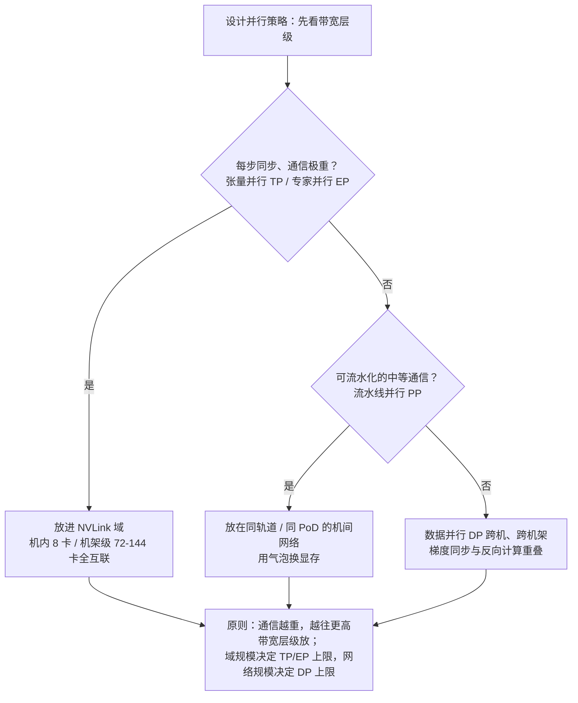

# GPU 集群与高速网络

> 万卡集群不是"很多台服务器"，而是一台巨型计算机：GPU 是算力，NVLink 是主板总线，RDMA 网络是机箱内连线，并行文件系统是硬盘。理解集群，就是理解这台"巨型计算机"的每个部件为什么这样设计。这篇基于经手过预训练与后训练项目的一线视角，按"单卡 → 机内 → 机间 → 存储 → 运维"的顺序拆解，最后给出选型与常见坑。

## 心智模型：集群是一台计算机，带宽是分层的

把集群当一台计算机看，很多设计决策就不再玄学：**这台机器的"总线"有四个层级，带宽每跨一层掉一个数量级**——HBM 显存带宽（TB/s 级）> NVLink 域内互联（每卡数百 GB/s 到 TB/s）> 机间 RDMA 网络（每卡数十到上百 GB/s）> 存储网络（每节点数十 GB/s）。并行策略、拓扑设计、存储选型，全部是"把通信量往高带宽层级塞"这一个原则的推论。

这张图也是本文所有硬件讨论的索引：下面每一节，都是在解释某一层为什么是现在这个样子。

## 单卡到机内：NVLink 域

**为什么需要 NVLink**：训练时 GPU 间要交换梯度、激活和专家路由，PCIe 带宽（Gen5 约 64 GB/s 单向量级）是瓶颈，NVLink 把机内互联拉高到数百 GB/s 乃至 TB/s——机内通信走"总线"而不是"网络"，没有协议栈、没有排队抖动。

**NVSwitch 与超节点**：NVLink 最早只是点对点桥，NVSwitch 交换芯片把它变成全互联域——Hopper 时代是机内 8 卡全互联；Blackwell 的 GB200 NVL72 用 NVLink Switch 把 **72 张 GPU 组成一个域**，域内任意两卡直达，整架 NVLink 聚合带宽 130 TB/s；Rubin 一代 NVLink 6 每卡 3.6 TB/s，NVL72 聚合到 260 TB/s。**域越大，张量并行（TP）与专家并行（EP）可铺开的规模越大**——MoE 时代这一点是决定性的：专家分布在哪些卡上，必须由域边界说了算。

**架构含义**：并行策略要"贴着硬件拓扑做"。通信最重的维度（TP/EP）放进域内，通信中等、可流水的维度（PP）放在同轨道机间，通信轻、可重叠的维度（DP）才跨域跨架——上面那张 Mermaid 就是这条经验的形式化。我见过的多数性能事故，根因都是"把 TP 拆到了 NVLink 域外"这类拓扑错配。

**代际观察**：每代升级的主线是"HBM 容量/带宽 + 域规模"双扩张；显存带宽决定推理上限，域规模决定训练并行上限。NVIDIA 官方页口径的三代对比：

| 指标 | H100 SXM | H200 | B200 | B300 (Ultra) | Rubin |
| --- | --- | --- | --- | --- | --- |
| HBM | 80 GB HBM3 | 141 GB HBM3e | 192 GB HBM3e | 288 GB HBM3e | 288 GB HBM4 |
| 显存带宽 | 3.35 TB/s | 4.8 TB/s | 8 TB/s | 8 TB/s | ~22 TB/s |
| FP8 dense | ~2.0 PF | 同左 | ~4.5 PF | ~4.5 PF | — |
| FP4 dense | — | — | 9 PF | **15 PF** | **50 PF**（sparse，推理） |
| NVLink/卡 | 900 GB/s | 900 GB/s | 1.8 TB/s | 1.8 TB/s | **3.6 TB/s** |
| TDP | 700 W | 700 W | ~1000 W | ~1400 W | 待定 |

（数据为 NVIDIA 官方公开口径；PF 为 dense/sparse 混合标注，量级对比用，精确值以官方白皮书为准。）

机架级系统沿着"域扩张"这条线推进：GB200 NVL72（13.5 TB HBM 聚合，官方宣称万亿参数 LLM 实时推理 30 倍、MoE 10 倍于上代）→ GB300 NVL72（20.7 TB）→ **Vera Rubin NVL144**（NVLink 聚合 260 TB/s，宣称推理 token 成本最高降 10 倍）。路线图节奏已变成一年一代：Rubin 2026 下半年交付、Rubin Ultra（NVL576，整机架功耗进入 600 kW 量级）2027、Feynman 2028 以后；Scale-up 域从 8 卡 → 72 卡 → 144 卡 → 576 die，NVLink Fusion 还向第三方 XPU 开放了互联授权。**做容量规划时我的习惯是按"域"而不是按"卡"做单位**：买多少卡不重要，买多少个 NVLink 域、域间网络怎么接，才决定并行策略的可行空间。

## 机间：RDMA 网络

### 为什么必须 RDMA

数据并行与流水线并行的跨机通信量巨大（梯度同步按模型大小计，万卡 DP 每一步都要 all-reduce）。TCP 协议栈的延迟、中断与 CPU 拷贝开销在这个量级下不可接受——**RDMA（远端直接内存访问）绕过内核协议栈，网卡直接读写远端内存**，再配合 GPUDirect 让数据在显存与网卡之间直达，CPU 全程不参与。这是过去十年 AI/HPC 网络的共识底座。

### InfiniBand vs RoCE

| 维度 | InfiniBand | RoCE v2 |
| --- | --- | --- |
| 生态 | NVIDIA 垂直整合，开箱即用 | 以太网生态，供应商多、可自研 |
| 拥塞控制 | 子网管理 + 信用流控，确定性高 | 依赖 PFC/ECN 调优，工程门槛高 |
| 拓扑 | Fat-Tree 成熟 | Fat-Tree / 轨道优化均可 |
| 规模上限 | 单子网数千到万级，靠多子网路由扩展 | 以太网路由生态，横向扩展更自由 |
| 趋势 | 超大规模训练的传统答案 | 云厂商与超大规模自建主力，UEC 标准化推进中 |

Meta 在 2024 年为建设 Llama 3 训练集群做了业内最著名的对照实验：**两个同为 24,576 张 H100 的集群，一个用 RoCE（Arista 7800 + OCP Wedge400/Minipack2 交换机），一个用 NVIDIA Quantum-2 InfiniBand**，结论是调优后的 RoCE 能达到与 IB 同级的集合通信性能。但注意"调优后"三个字——同一篇博客里的图显示，24K 大集群在"开箱"状态下集合通信性能方差极大（不同任务的有效带宽从一成到九成都有），经过端到端调优才收敛到与小集群一致的高位：

*图源：Meta Engineering Blog《Building Meta's GenAI Infrastructure》（[原文](https://engineering.fb.com/2024/03/12/data-center-engineering/building-metas-genai-infrastructure/)，访问日期 2026-09-03）*

这张图是我给所有准备上 RoCE 的团队看的第一张图：**RoCE 的便宜是拿网络工程团队的水平换的**。PFC 死锁、ECN 阈值、打流不均、光模块一致性，任何一项没管住，训练 MFU 就会以百分点为单位往下掉。IB 则把这部分复杂度收进了子网管理器（配套 UFM 类工具），代价是生态锁定与采购来源单一。

### 拓扑：胖树与轨道优化

机间网络的标准答案是**轨道优化（Rail-optimized）+ 胖树**：每台机器的 8 张 GPU 各自接到 8 个独立的网络平面（"轨道"），同号 GPU 组成一个平面。它的好处是把 collective 通信的主流量（同 rank 间的 all-reduce/all-to-all）锁在同一轨道内、一跳可达，只有跨轨道流量才上脊柱层——这与"把通信重的维度放进高带宽层级"的心智模型完全同构。NVIDIA 的 DGX SuperPOD 参考架构就是这个设计的标准件：H100 代每系统 8 条 NDR 400G 轨道、每个可扩展单元（SU）32 节点同轨一跳互联，SU 间或跨轨流量走脊柱层，整网无阻塞全胖树；存储则单独一张 InfiniBand 网，因为 SuperPOD 要求每节点 I/O 超过 40 GB/s。

*图源：NVIDIA DGX SuperPOD Reference Architecture（H100）——Network Fabrics（[原文](https://docs.nvidia.com/dgx-superpod/reference-architecture-scalable-infrastructure-h100/latest/network-fabrics.html)，Figure 5，访问日期 2026-09-03）*

代际演进上，GB200 SuperPOD 延续 rail-optimized 胖树（每系统 8×NDR 400 跨架），B300 代升级为双平面（twin-plane）胖树以匹配 XDR 800G；轨道数与每轨带宽，基本跟着"每卡 RDMA 带宽 ≈ NVLink 带宽的 1/10~1/20"的经验比例走。**一线要记住的坑**：轨道优化对"rank 放置"有强约束——并行策略的 rank 映射如果不感知轨道（比如把同一 TP 组拆到不同轨道的脊柱层后面），等于主动放弃拓扑红利。

### 云上的 RDMA：EFA 与 eRDMA

云厂商把 RDMA 做成了弹性服务，这是云上训推的默认选项：

- **AWS EFA**：自研传输协议（SRD）跑在 AWS 自有 fabric 上，多路径 + 乱序容忍，绕开传统 RoCE 对无损以太网的依赖；p5 实例（H100）单机 3200 Gbps 量级的聚合带宽，第二代 EFA 进一步支持显存直达。它的设计哲学是"把无损的责任从网络挪到端侧协议"。
- **阿里云 eRDMA**：基于 CIPU 的弹性 RDMA，普通 VPC 里秒级组网、全地域可用，官方口径在分布式训练场景有可观的吞吐收益；后续在 SIGCOMM 上公开的 Stellar 一代继续把 RDMA 虚拟化做多租户化。

云上用 RDMA 的取舍与自建相同但更尖锐：**你买到的"无损"是云厂商的工程成果，调优空间也一并交给了平台**。我的经验是云上跑千卡以内训练，EFA/eRDMA 类方案已经够用；真正的万卡自建，才需要下面这一整节的网络工程能力。

### 2026 互联格局：以太网反超与跨数据中心

几个已经落地的趋势：

- **以太网在 AI 后端网络的新部署上反超 InfiniBand**（Dell'Oro 等机构 2025 年口径），与 Meta/Google/xAI Colossus/AWS 全部押注以太网的公开信息一致；IB 退守极端规模与超低延迟场景。
- **UEC 1.0 规范**（2025 年中发布，560+ 页）进入产品化期，目标是为多厂商以太网定义 AI 级的传输与拥塞控制标准；NVIDIA Spectrum-X 则用"端到端调优的以太网"把与 IB 的性能差距压到个位数百分比。
- IB 侧 XDR 800G（Quantum-X800）2025 年底起批量出货；共封装光学（CPO）交换机 2026 年上市，功耗与布线密度是下一个战场。
- **跨数据中心训练从概念变实践**：Microsoft Fairwater（双城 AI WAN、十万英里级光纤）、OpenAI Stargate（多站点）等公开项目，用专用 WAN 把多站点连成统一 GPU 域。但约束不变——**跨站带宽比机间低一到两个数量级，只放得下流水线维度或异步任务**，别指望跨站做 TP。

## 存储：被低估的训练瓶颈

### 三类存储负载

1. **数据集读取**：海量小文件随机读（文本分片）或大文件顺序读（视频/音频）——元数据性能与吞吐双要求。
2. **Checkpoint 写入风暴**：万卡集群定期保存全量状态（参数 + 优化器状态，单次可达数十 TB），瞬时写带宽需求是 TB/s 级——写入期间训练暂停，**保存频率是容错与效率的权衡**。
3. **结果与日志**：评测输出、采样样本、遥测数据。

多数团队第一次被存储教训，是在 checkpoint 上：算一下"万卡停训 10 分钟写一次 checkpoint"的机会成本，你会发现存储带宽是最便宜的那种算力保险。

### 并行文件系统格局

- **CPFS/Lustre/GPFS 类**：POSIX 兼容 + 多客户端并行访问，训练场景主流；Lustre 在 HPC 份额长期第一。云厂商自研在冲顶：阿里云 CPFS 智算版公开口径单文件系统可达 TB/s 级吞吐、千万级 IOPS。
- **3FS 类新架构**：面向 NVMe SSD + RDMA 重构的存储栈，把单机 SSD 的带宽和 IOPS 全部暴露给网络。DeepSeek 开源的 3FS 在 180 节点上做到 **6.6 TiB/s 聚合读吞吐**（GraySort 3.66 TiB/min），让"AI 原生并行文件系统"这条路线进入主流视野；其论文（Fire-Flyer AI-HPC）还给出了 3FS-KV 的雏形——把 KV Cache 下沉到 SSD 服务长上下文推理，成本可降约一个量级。
- **DAOS/WEKA/VAST 类**：DAOS 支撑 Aurora 超算 230 PB 级部署；WEKA/VAST 在 GPU 云（neocloud）里是常见选择。
- **分层设计是通用答案**：热数据（当前 epoch 数据分片）放高性能层，全量数据集放容量层，训练节点本地 NVMe 做缓存预热——DataLoader 的预取深度与缓存命中率，要和存储分层一起调。

*图源：NVIDIA DGX SuperPOD Reference Architecture（H100）——Network Fabrics（[原文](https://docs.nvidia.com/dgx-superpod/reference-architecture-scalable-infrastructure-h100/latest/network-fabrics.html)，Figure 6，访问日期 2026-09-03）*

注意 SuperPOD 把存储网络**独立成一张 fabric** 并给出收敛比建议——"存储网与计算网混布省一张网"是小集群的省钱办法，万卡集群上这是拿训练效率赌建设成本，多数情况不划算。

### Checkpoint 工程

- **异步保存**：先快照到本地内存/NVMe，训练立即继续，后台落盘到并行文件系统——把"写风暴"从关键路径上挪走。PyTorch DCP 类的分布式异步 checkpoint 已是事实标配。
- **分级 offload**：HBM → 主机内存 → 本地 NVMe → 并行 FS 逐级下沉；社区实践（如 The Ultra-Scale Playbook 汇总的经验）表明，主机内存留一份一级副本能让多数故障恢复不必回读磁盘，恢复浪费的算力可降一个数量级。
- **增量/差分 checkpoint** 控制写放大；对象存储做冷归档。
- **恢复速度也是指标**：从 checkpoint 拉起万卡、重新对齐数据管线的时间，决定每次故障的真实损失——买存储时把"恢复读带宽"和"写入带宽"放在同一张评分表里。

## 集群运维：故障是常态

### 规模数学

单卡/单机的年故障率不变，乘上万卡规模就是**每天都有故障**——训练中断不是意外，是日程。公开数据可以给这条直觉定标：

- **Meta（Llama 3 复盘）**：16,384 GPU 集群约 54 天训练发生 466 次计划外中断，其中 419 次归因于硬件，GPU 与 HBM 问题占近半。
- **DeepSeek（Fire-Flyer 论文）**：万卡级集群一年的原始故障数据——GPU Xid 事件 12,970 次（NVLink 错误占四成以上）、内存/网络类故障数百次、IB 网络闪断约两百次；同时其 V3 训练（278.8 万 H800 GPU 时）公开宣称全程无 loss spike、无回滚——**故障一直在发生，只是被容错体系吃掉了**。这就是万卡级容错的业界标杆形态。
- **字节（MegaScale）**：12,288 GPU 训练 175B 模型做到 55.2% MFU，论文把"故障检测 + 快速诊断 + 分钟级恢复"列为与并行策略同等重要的贡献。

### 容错四件套

1. **快速检测**：通信超时、ECC/Xid 错误、链路闪断的实时采集；NCCL 层面的 hang 检测要比硬件告警更早。
2. **自动隔离与替换**：坏卡/坏机踢出、备机顶上，配合调度器的"节点准入体检"（上线前跑 burn-in 与 all-reduce 基线）。
3. **断点续训**：从最近 checkpoint 自动恢复，恢复流程要演练——没演练过的恢复流程等于没有。
4. **慢节点治理**：不掉线但拖慢全局的"灰色故障"最难查。同步集合里一个慢 rank 拖住所有人，需要 straggler 检测：MegaScale 的做法是给每个 rank 的代码段计时画热力图，离群者一眼可见。

*图源：MegaScale 论文（[arXiv:2402.15627](https://arxiv.org/abs/2402.15627)，Figure 7，NSDI '24，访问日期 2026-09-03）*

我的一线经验是：**检测与隔离的自动化程度，比备机比例更决定有效训练时长**。备机再多，靠人肉判断换机，万卡集群也跑不出好看的 MFU。

### MFU 是北极星指标

模型浮点利用率（MFU）= 实际算力 / 理论峰值。万卡训练做到 35–45% 是良好、50%+ 是优秀工程——每个百分点在万卡尺度上都是真金白银。系统成熟度红利仍在兑现：SemiAnalysis 公开实测同一套工作负载在 12 个月内从 H100 的约 34% 优化到 GB200 NVL72 的约 54%。**网络即性能**也是同一枚硬币的另一面：千卡以上集群，网络 1% 的丢包/重传就能吃掉 10%+ 的 MFU——网络监控必须与训练监控同级别建设，PFC 计数、ECN 标记率、光模块温度这些"网络指标"要进训练值班大屏。

## 对后训练场景的差异

- **全参后训练**：规模小一至两个数量级，但对数据管线与评测闭环要求更高——存储瓶颈从"checkpoint 风暴"变成"海量小样本随机读 + 频繁小 checkpoint"。
- **RL 训练的特殊性**：采样（rollout）与训练交替甚至混布——推理集群与训练集群的边界模糊，显存分时复用、异构资源池化成为新课题（详见 [训练工程](/ai/infra/training)）。
- **推理集群反哺存储**：3FS-KV 类把 KV Cache 下沉 SSD 的实践，本质是"推理的内存层级"向存储层延伸——长上下文服务的成本曲线因此改变。

## 选型与常见坑

### 选型：先问规模与形态

| 决策点 | 经验判断 | 适用边界 |
| --- | --- | --- |
| 自建 vs 云租 vs Serverless | 千卡以下云租/EFA/eRDMA 类；长期万卡自建；波峰用量按秒级 GPU 池补 | 自建前提是养得起网络与存储工程团队 |
| IB vs RoCE | 有专职网络团队、要极致确定性选 IB；要供应链弹性与自研空间选 RoCE，并接受调优投入 | RoCE 的"便宜"含人力成本 |
| 拓扑 | 默认 rail-optimized 胖树；跨轨道流量占比高（大 EP）时评估双平面/多轨加宽 | rank 放置必须感知轨道 |
| 存储 | 并行 FS 做训练层 + 对象存储做归档层；checkpoint 与数据集分池 | 万卡必做存储独立 fabric |
| 代际 | 按"域"做采购单元；新老代际混布只混 DP 维度，不混域内 | 一年一代节奏下残值管理是财务问题 |
| 计费形态 | 从"按小时包卡"转向按秒/按 token；prefill 池与 decode 池按算力/带宽特征分池 | 公开 GPU 时价分层剧烈（同卡不同供应商价差可达一个数量级以上），采购决策权重要上升 |

### 常见坑

| 坑 | 现象 | 根因与对策 |
| --- | --- | --- |
| TP 拆出 NVLink 域 | MFU 断崖式下跌 | 并行策略评审先画拓扑图，域边界是硬约束 |
| RoCE 当 IB 用 | 开箱性能方差巨大 | PFC/ECN/流分布全链路调优 + 持续监控，参考 Meta 调优曲线 |
| rank 放置不感知轨道 | 跨脊柱流量打满、热点链路 | 调度器注入轨道拓扑，collective 流量尽量同轨一跳 |
| checkpoint 同步写 | 每次保存停训数十分钟 | 异步 DCP + 内存一级副本 + 写带宽独立评估 |
| 存储网计算网混布 | 数据加载与集合通信互相抖动 | 独立存储 fabric，收敛比按厂商参考架构 |
| 只监控硬件不监控慢节点 | MFU 缓慢劣化查无实据 | straggler 热力图 + 每步计时基线，灰故障当故障处理 |
| 恢复流程不演练 | 真故障时恢复耗时数小时 | 定期故障演练，把"拉起万卡"时间做成 SLA |

## 参考资料

<Refs>

**NVIDIA 官方**（访问日期 2026-09-03）

- [NVLink & NVLink Switch 产品页](https://www.nvidia.com/en-us/data-center/nvlink/) —— NVLink 5/6 带宽、域规模、NVL72 聚合带宽口径
- [GB200 NVL72 产品页](https://www.nvidia.com/en-us/data-center/gb200-nvl72/) —— 72 GPU 域、13.5 TB HBM、推理倍数口径
- [DGX SuperPOD Reference Architecture（H100）——Network Fabrics](https://docs.nvidia.com/dgx-superpod/reference-architecture-scalable-infrastructure-h100/latest/network-fabrics.html) —— rail-optimized 胖树、存储 fabric、收敛比

**超大规模集群公开复盘**（访问日期 2026-09-03）

- [Building Meta's GenAI Infrastructure（Meta Engineering Blog）](https://engineering.fb.com/2024/03/12/data-center-engineering/building-metas-genai-infrastructure/) —— 24,576 GPU 双集群（RoCE vs IB）、RoCE 调优曲线、Tectonic 存储
- [RDMA over Ethernet for Distributed AI Training at Meta Scale（SIGCOMM '24 报告）](https://www.youtube.com/watch?v=wLW3UzUw5rY)
- [MegaScale: Scaling Large Language Model Training to More Than 10,000 GPUs（NSDI '24）](https://arxiv.org/abs/2402.15627) —— 12,288 GPU、55.2% MFU、straggler 诊断
- [The Llama 3 Herd of Models（arXiv:2407.21783）](https://arxiv.org/abs/2407.21783) —— 16K 集群 54 天 466 次中断的故障复盘
- [DeepSeek-V3 Technical Report（arXiv:2412.19437）](https://arxiv.org/abs/2412.19437) —— 278.8 万 H800 GPU 时、训练稳定性口径
- [Fire-Flyer AI-HPC（arXiv:2408.14158）](https://arxiv.org/abs/2408.14158) —— 万卡集群一年故障原始数据、3FS 设计、RoCE 拥塞治理
- [The Ultra-Scale Playbook](https://huggingface.co/spaces/nanotron/ultrascale-playbook) —— 大集群训练系统经验汇编（2025）

**存储**（访问日期 2026-09-03）

- [DeepSeek 3FS 开源仓库](https://github.com/deepseek-ai/3FS) —— 180 节点 6.6 TiB/s 聚合读、3FS-KV

**云上 RDMA**（访问日期 2026-09-03）

- [AWS Elastic Fabric Adapter 文档](https://docs.aws.amazon.com/AWSEC2/latest/UserGuide/efa.html) / [AWS HPC Blog：第二代 EFA](https://aws.amazon.com/blogs/hpc/second-generation-efa-improving-hpc-and-ml-application-performance-in-the-cloud/)
- [阿里云 eRDMA 文档](https://help.aliyun.com/zh/ecs/user-guide/on-the-gpu-instance-configuration-erdma)；演进见 [Alibaba Stellar（SIGCOMM）](https://dl.acm.org/doi/10.1145/3718958.3750539)

**行业观察**（访问日期 2026-09-03）

- [SemiAnalysis：100,000 H100 Clusters —— Power, Network Topology, Ethernet vs InfiniBand](https://newsletter.semianalysis.com/p/100000-h100-clusters-power-network) —— 拓扑与 MFU 实测、GPU 时价分层
- [Dell'Oro Group News](https://www.delloro.com/news/) —— 2025 年以太网在 AI 后端部署反超 InfiniBand 的机构口径

**图片来源**（访问日期 2026-09-03）

- [superpod-compute-fabric.png](/images/ai/infra/cluster/superpod-compute-fabric.png) ← NVIDIA DGX SuperPOD RA（H100）Network Fabrics，Figure 5
- [superpod-storage-fabric.png](/images/ai/infra/cluster/superpod-storage-fabric.png) ← NVIDIA DGX SuperPOD RA（H100）Network Fabrics，Figure 6
- [meta-24k-roce-tuning.png](/images/ai/infra/cluster/meta-24k-roce-tuning.png) ← Meta Engineering Blog《Building Meta's GenAI Infrastructure》
- [megascale-straggler-heatmap.png](/images/ai/infra/cluster/megascale-straggler-heatmap.png) ← MegaScale 论文 Figure 7（arXiv:2402.15627）

**站内相关**：[训练工程](/ai/infra/training) · [GPU 选型与推理成本测算](/ai/infra/inference/gpu-sizing) · [云网络](/cloud/infra/network) · [云存储](/cloud/infra/storage)

</Refs>
