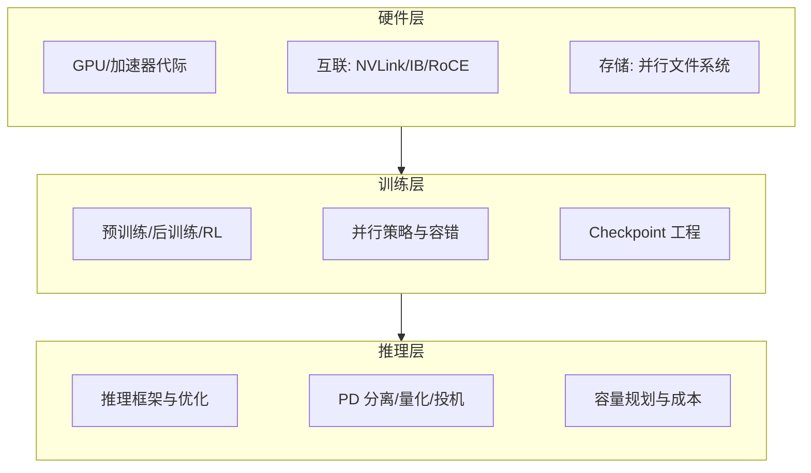

# AI Infra：总览

> AI Infra 是大模型时代的"水电煤"：模型的能力上限由架构与数据决定，但**能不能训出来、跑得起、扛得住并发，全部由基础设施决定**。这个子域按"硬件—训练—推理"三层组织，沉淀从 GPU 集群到推理服务的全链路工程知识。

## 三层结构

## 文章导航

| 文章 | 状态 | 说明 |
| --- | --- | --- |
| [GPU 集群与高速网络](/ai/infra/cluster) | 已发布 | 加速器代际、NVLink、RDMA、拓扑与分布式存储 |
| [训练工程](/ai/infra/training) | 已发布 | 训练范式光谱、并行策略、微调决策与集群工程 |
| [推理与算力（子域）](/ai/infra/inference/) | 已发布 | 推理框架、量化、GPU 选型与成本测算 |

## 这个子域回答什么问题

- 万卡集群为什么是"系统工程问题"而不是"买卡问题"？
- 预训练、全参后训练、LoRA、强化学习各自需要什么样的基础设施？
- 推理成本的结构是什么？自建与 API 的成本曲线在哪里交叉？

## 衔接

- 上游：[模型架构演进](/ai/models/) · 下游：[大模型应用](/ai/application/)
