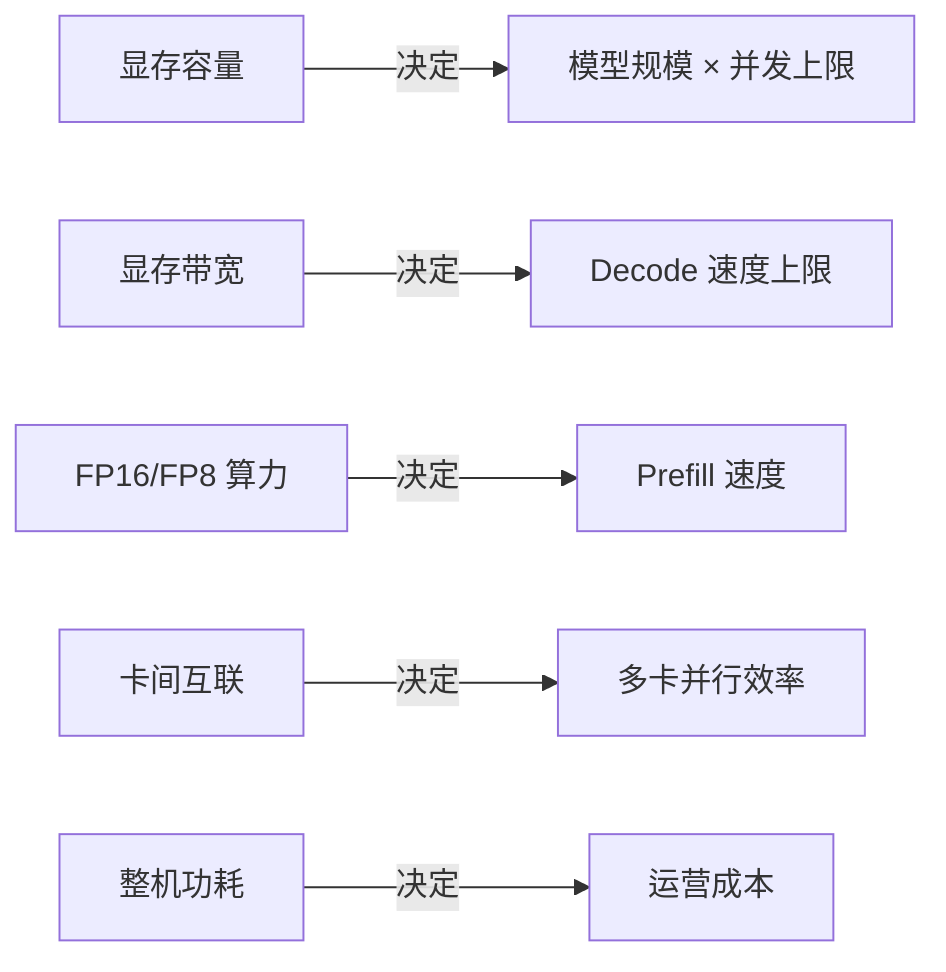
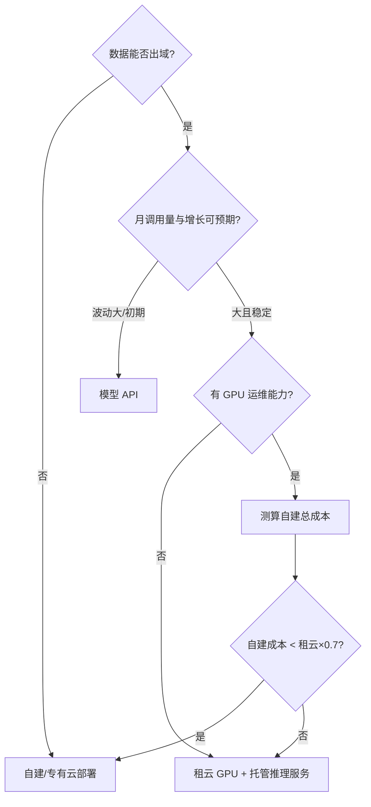

# GPU 选型与推理成本测算

> "我们要上大模型，需要买几张卡？"——这个问题我每年都被问几十次。答案从来不是拍脑袋，而是一道可以算的应用题。这篇给出完整的测算框架：**从模型规格推显存需求，从显存与带宽推吞吐，从吞吐推成本**，以及自建/租云/用 API 三条路线的成本比较方法。阵容规格与租卡报价口径已于 2026-09 刷新（Hopper/Blackwell 现役阵容）。

## 先建立直觉：推理的瓶颈是显存，不是算力

大模型推理的两个阶段特征完全不同：

| 阶段 | 特征 | 瓶颈 |
| --- | --- | --- |
| **Prefill（预填充）** | 并行处理输入全部 token | 计算密集 → 看 TFLOPS |
| **Decode（解码）** | 逐 token 串行生成 | 访存密集 → 看显存带宽 |

生产负载以 Decode 为主（输出往往比输入长），所以**显存容量决定能跑多大的模型、能并发多少请求；显存带宽决定生成速度**。这也是为什么推理场景里，一张显存带宽高的卡可以胜过算力高但显存小的卡。

## GPU 参数读法

选型只需要看懂五个参数：



| 定位 | 典型代表 | 特征 | 适用 |
| --- | --- | --- | --- |
| 旗舰训练/推理卡 | H100/H200（Hopper）、B200/GB200（Blackwell）级 | 显存带宽与算力都顶配，支持 FP8/FP4 | 训练 + 高性能推理 |
| 主流推理卡 | L40S 级（48GB GDDR6，PCIe） | 显存适中、性价比高 | 中小模型推理、微调 |
| 轻量推理卡 | L4 级 | 功耗低（72W）、密度高 | 小模型、高并发低延迟 |
| 国产加速器 | 多家产品 | 供给稳定、生态追赶中 | 合规要求、供给风险对冲 |

::: tip 供给侧现实
旗舰卡长期处于"有钱也未必有货"的状态。选型时必须把**供给可得性**作为第一约束：买不到、租不到、坏了换不了，纸面性能再高也没有意义。这也是近年推理方案普遍向"量化 + 中端卡"演进的根本原因。
:::

### 2026 现役阵容：官方规格表

下表是 2026-09 我在做方案时核对的现役阵容，全部以 NVIDIA 官网产品页为准（逐条来源见"官方规格页"列，访问日期均为 2026-09-04）。**算力数字如无注明，均为含稀疏（With Sparsity）口径，稠密约为一半**——这是官网脚注的原话，也是最容易被二手资料搞混的地方。

| 型号 | 定位 | 显存 | 显存带宽 | FP8 算力 | 官方规格页 |
| --- | --- | --- | --- | --- | --- |
| H100 SXM | Hopper 旗舰（训练/推理） | 80GB HBM3 | 3.35TB/s | 3,958 TFLOPS（稀疏） | [H100](https://www.nvidia.com/en-us/data-center/h100/) |
| H200 SXM | Hopper 显存增强版 | 141GB HBM3e | 4.8TB/s | 3,958 TFLOPS（稀疏） | [H200](https://www.nvidia.com/en-us/data-center/h200/) |
| HGX B200（8 卡基板） | Blackwell 旗舰 | 8 卡合计 1.4TB HBM3e | 单卡 8TB/s（GB200 页口径） | 8 卡合计 72 PFLOPS（稀疏，单卡 9） | [HGX](https://www.nvidia.com/en-us/data-center/hgx/) |
| GB200 NVL72（整机柜） | Blackwell 机柜级（36 Grace CPU + 72 GPU） | 合计 13.4TB HBM3e | 合计 576TB/s | 720 PFLOPS（稀疏，360 稠密） | [GB200 NVL72](https://www.nvidia.com/en-us/data-center/gb200-nvl72/) |
| L40S | Ada 主流推理/通用 | 48GB GDDR6 ECC | 864GB/s | 1,466 TFLOPS（稀疏） | [L40S](https://www.nvidia.com/en-us/data-center/l40s/) |
| L4 | Ada 轻量推理 | 24GB GDDR6 | 300GB/s | 485 TFLOPS（稀疏） | [L4](https://www.nvidia.com/en-us/data-center/l4/) |


*Blackwell 的机柜级形态：GB200 NVL72，72 个 GPU 组成一个 NVLink 域。图来源：[NVIDIA GB200 NVL72 产品页](https://www.nvidia.com/en-us/data-center/gb200-nvl72/)（访问日期 2026-09-04）*

几点读表说明（都是一线对方案时反复要解释的）：

- **H200 与 H100 算力相同**（FP8 同为 3,958 TFLOPS 稀疏），差别全在显存：容量 80GB→141GB、带宽 3.35→4.8TB/s。Decode 为主的推理负载里，H200 单卡有效吞吐通常明显高于 H100——"带宽即正义"的标准案例。
- **B200 单卡 FP8 为 9 PFLOPS 稀疏 / 4.5 PFLOPS 稠密**（HGX 页 8 卡合计 72 PFLOPS 稀疏），相比 H100 的同口径数字翻倍有余，并新增 NVFP4 精度；NVL72 整柜 NVFP4 达 1,440 PFLOPS（稀疏）。
- **GB200 NVL72 是"一台机柜"而不是一堆卡**：72 GPU 单 NVLink 域（域内聚合带宽 130TB/s），超大 MoE 模型可以整柜部署，容量规划的粒度从"卡数"变成"柜数"。
- **口径差异注意**：B200 显存在 HGX 页标 8 卡合计 1.4TB，在 GB200 NVL72 页按 372GB/超级芯片（2 GPU）折算约 186GB/卡，两个页面取整口径略有出入，测算时以所引用页面原文为准。
- **L20/A10 未列入**：截至 2026-09-04，这两款区域向推理卡在 nvidia.com 上已无公开规格页（产品页返回 404），按"确有公开规格才列"的原则不填记忆里的数字。
- NVIDIA 官网同页已挂出 HGX B300（Blackwell Ultra）与下一代 Rubin 的规格，阵容更迭很快；测算锚定的永远是"当前能采购到的代际"。

## 测算第一步：模型要多大显存

一个可以复用的公式：

```
显存需求 ≈ 权重 + KV Cache + 运行时开销

权重 = 参数量 × 每参数字节数
      （FP16 = 2 字节，INT8 = 1 字节，INT4 = 0.5 字节）

KV Cache ≈ 2 × 层数 × 隐藏维度 × 上下文长度 × 并发数 × 精度字节数
          （可用框架显存分析工具实测，经验上长上下文场景不可忽略）

运行时开销 ≈ 按 1.2~1.4 倍冗余预留
```

**速算示例**（70B 参数模型）：

| 精度 | 权重显存 | 最少卡数（80G 卡） |
| --- | --- | --- |
| FP16 | ~140 GB | 2 张（不含 KV 余量，生产建议 3-4 张） |
| INT8 | ~70 GB | 1 张（生产建议 2 张） |
| INT4 | ~35 GB | 1 张 |

结论很直接：**量化等级改变的不只是性能，而是硬件方案的台数**。

## 测算第二步：吞吐与成本

### 建立吞吐基线

吞吐必须实测，但可以先用经验区间做方案筛选：

- 同规格卡 + 同模型，vLLM 类框架的聚合吞吐（所有请求加总的 tokens/s）可以在压测中得到
- 关注两个数：**并发 1 时的单请求速度**（体验下限）和**打满时的聚合吞吐**（成本分母）
- 压测必须用真实长度分布的输入输出（参考 [推理部署实战](/ai/infra/inference/llm-inference) 的坑清单）

### 单位成本模型

```
每百万 token 成本 = 卡时成本 ÷ 实测吞吐 × 10⁶

其中 卡时成本：
  租云  = 单卡小时价格
  自建  = (采购价 ÷ 折旧月数 ÷ 730 + 电力成本 + 运维摊销) ÷ 卡数
```

### 2026-09 公开租卡报价口径

卡时单价要有出处。下表是 GPU 租赁平台的公开按需报价快照（[RunPod 官方定价页](https://www.runpod.io/pricing)，Community Cloud / Secure Cloud 两档区间，访问日期 2026-09-04）：

| GPU | 公开按需报价（美元/卡·小时） |
| --- | --- |
| B300 | 6.94–7.89 |
| B200 | 5.98–6.79 |
| H200 SXM | 3.59–4.59 |
| H100 SXM | 2.69–3.29 |
| H100 PCIe | 1.99–2.89 |
| A100 SXM | 1.39–1.59 |
| L40S | 0.79–0.99 |
| L4 | 0.44–0.49 |

**公开报价口径、波动大，仅供量级参考**：竞价/二级现货市场可能更低；超大规模云厂商的官方 GPU 实例通常更高，且带区域与合约约束；新一代卡在上市初期溢价最高，随供给爬坡会明显回落。引用任何报价时都要写明来源和日期。

自建与租云的交叉点经验值：**稳定高利用率（>50%）且持续一年以上，自建开始划算；利用率低或需求波动大，租云永远更优**。电力与运维摊销常被漏算——一张旗舰卡的整机功耗不可忽视，三年电费可能是购卡成本的显著比例。另外注意：上面那张报价表一年之内就可能整体下移一档（Blackwell 铺量后，H100 的卡时单价比上市初期低了不少），**每次做预算前重拉一遍公开报价**，别用旧测算表里的数字。

### 一个完整的测算示例

> 场景：70B 模型对外服务，日均 2 亿输出 token，峰值 8000 tokens/s。

1. 显存：INT8 部署，每实例 2 张 80G 卡（含 KV 余量）
2. 吞吐：实测单实例聚合 ~4500 tokens/s（INT8，vLLM）
3. 容量：峰值需要 2 个实例 = 4 张卡；加 N+1 冗余 = 6 张卡
4. 对比：同样负载走商用 API 的月账单 = 2亿×30×单价；与 6 卡自建月摊销对比
5. 决策：调用量再涨 3 倍前，API 更划算 → **先 API，预留自建方案，设置成本预警线**

## 三条路线的决策框架



（0.7 系数是对自建隐性成本——故障、升级、闲置——的保守补偿，可按团队情况调整。）

## 常见坑

| 坑 | 说明 | 对策 |
| --- | --- | --- |
| 只看卡价不看配套 | 高速网络、存储、机柜电力、备件，整体交付成本常超出卡价本身 | 测算表按"整机柜/整机房"立项，配套单列预算 |
| 按峰值配卡不留弹性 | 峰谷比大的负载，固定底座按峰值配会大量闲置 | 混合"固定底座 + 弹性租云"更省钱 |
| 忽略折旧周期 | 硬件迭代快，折旧按 5 年算会低估自建成本 | 折旧按 2-3 年算 |
| 用训练卡做纯推理 | 预算错配；反之训练负载用推理卡则带宽不够 | 先定负载类型再选卡型 |
| 不算电力 | 三年电费可以再造半台机器，运营账要进测算表 | 卡时成本公式里电力与运维摊销必填 |
| 用旧规格/旧报价做测算 | 代际更迭快，二手文章里的规格和一年前的卡时价都不能直接套用 | 每次测算前逐条核对官方规格页与近期公开报价，注明访问日期 |
| 混淆规格口径 | 稀疏/稠密、单卡/整机/整柜，同一型号的数字能差一倍 | 规格表只信一个来源，口径标清楚再进测算表 |

## 小结

GPU 选型不是硬件问题，是**容量规划问题**：模型定显存、带宽定速度、并发定卡数、利用率定路线。把这条链算清楚，"买几张卡"就不再是玄学。框架本身是稳定的，但参数会过时——从 Hopper 到 Blackwell 只隔了一代，算力、显存与卡时报价的口径全部换过一轮，测算表里的数字至少每年校准一次。

## 参考资料

<Refs>

**NVIDIA 官方规格页**（访问日期 2026-09-04）

- [NVIDIA H100 Tensor Core GPU](https://www.nvidia.com/en-us/data-center/h100/) —— H100 SXM：80GB HBM3、3.35TB/s、FP8 3,958 TFLOPS（稀疏）、TDP 最高 700W
- [NVIDIA H200 Tensor Core GPU](https://www.nvidia.com/en-us/data-center/h200/) —— 141GB HBM3e、4.8TB/s、FP8 3,958 TFLOPS（稀疏）
- [NVIDIA HGX](https://www.nvidia.com/en-us/data-center/hgx/) —— HGX B200/B300 八卡基板口径：FP8/FP4 算力、总显存、NVLink 1.8TB/s/卡
- [NVIDIA GB200 NVL72](https://www.nvidia.com/en-us/data-center/gb200-nvl72/) —— 72 GPU 单域：13.4TB HBM3e、聚合 576TB/s、FP8 720 PFLOPS（稀疏）、NVFP4 1,440 PFLOPS（稀疏）
- [NVIDIA L40S](https://www.nvidia.com/en-us/data-center/l40s/) —— 48GB GDDR6 ECC、864GB/s、FP8 1,466 TFLOPS（稀疏）、350W
- [NVIDIA L4](https://www.nvidia.com/en-us/data-center/l4/) —— 24GB GDDR6、300GB/s、FP8 485 TFLOPS（稀疏）、72W

**公开定价口径**（访问日期 2026-09-04）

- [RunPod GPU Cloud Pricing](https://www.runpod.io/pricing) —— GPU 租赁市场公开按需报价（正文价格表来源；公开报价口径、波动大、仅供量级参考）

**权威基准**（访问日期 2026-09-04）

- [MLPerf Inference: Datacenter（MLCommons）](https://mlcommons.org/benchmarks/inference-datacenter/) —— 跨代际推理性能的行业公开基准，验证厂商口径与实测差距时首选

**图片来源**（访问日期 2026-09-04）

- [gb200-nvl72.jpg](/images/ai/inference/gb200-nvl72.jpg) ← NVIDIA GB200 NVL72 产品页配图

**站内相关**：[大模型推理部署实战](/ai/infra/inference/llm-inference) · [GPU 集群与高速网络](/ai/infra/cluster) · [AI 与大模型导读](/ai/)

</Refs>