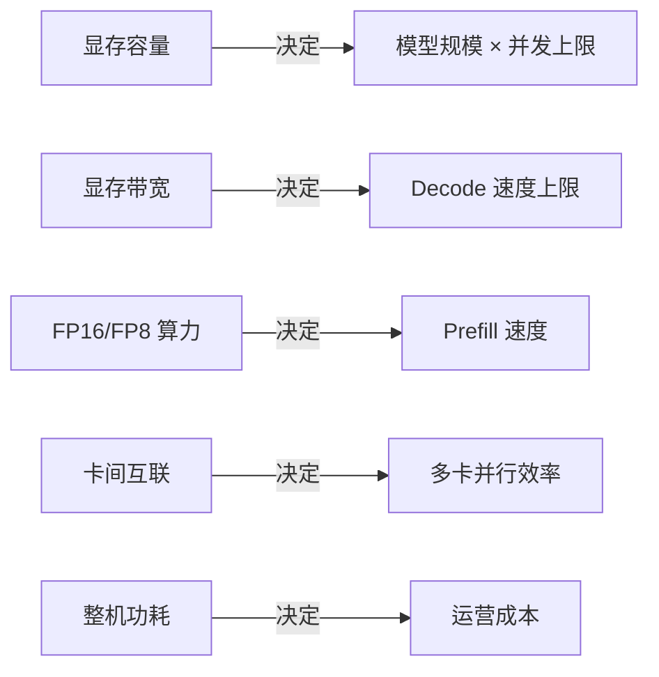
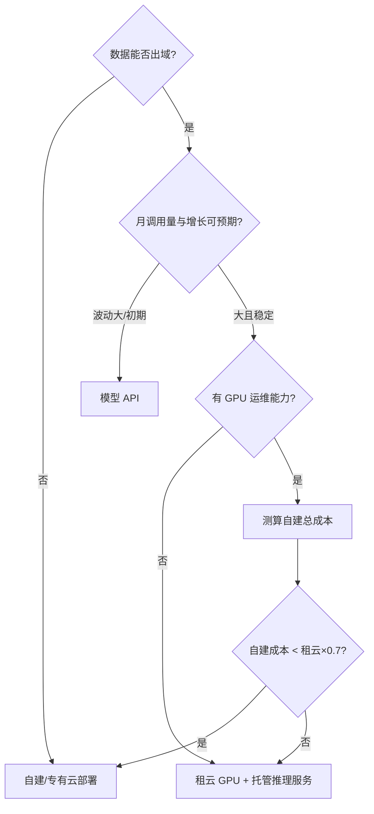

# GPU 选型与推理成本测算

> "我们要上大模型，需要买几张卡？"——这个问题我每年都被问几十次。答案从来不是拍脑袋，而是一道可以算的应用题。这篇给出完整的测算框架：**从模型规格推显存需求，从显存与带宽推吞吐，从吞吐推成本**，以及自建/租云/用 API 三条路线的成本比较方法。

## 先建立直觉：推理的瓶颈是显存，不是算力

大模型推理的两个阶段特征完全不同：

| 阶段 | 特征 | 瓶颈 |
| --- | --- | --- |
| **Prefill（预填充）** | 并行处理输入全部 token | 计算密集 → 看 TFLOPS |
| **Decode（解码）** | 逐 token 串行生成 | 访存密集 → 看显存带宽 |

生产负载以 Decode 为主（输出往往比输入长），所以**显存容量决定能跑多大的模型、能并发多少请求；显存带宽决定生成速度**。这也是为什么推理场景里，一张显存带宽高的卡可以胜过算力高但显存小的卡。

## GPU 参数读法

选型只需要看懂五个参数：



| 定位 | 典型代表 | 特征 | 适用 |
| --- | --- | --- | --- |
| 旗舰训练卡 | H100/H200/B200 级 | 显存带宽与算力都顶配，支持 FP8 | 训练 + 高性能推理 |
| 主流推理卡 | L40S / L20 / A10 级 | 显存适中、性价比高 | 中小模型推理、微调 |
| 轻量推理卡 | L4 / T4 级 | 功耗低、密度高 | 小模型、高并发低延迟 |
| 国产加速器 | 多家产品 | 供给稳定、生态追赶中 | 合规要求、供给风险对冲 |

::: tip 供给侧现实
旗舰卡长期处于"有钱也未必有货"的状态。选型时必须把**供给可得性**作为第一约束：买不到、租不到、坏了换不了，纸面性能再高也没有意义。这也是近年推理方案普遍向"量化 + 中端卡"演进的根本原因。
:::

## 测算第一步：模型要多大显存

一个可以复用的公式：

```
显存需求 ≈ 权重 + KV Cache + 运行时开销

权重 = 参数量 × 每参数字节数
      （FP16 = 2 字节，INT8 = 1 字节，INT4 = 0.5 字节）

KV Cache ≈ 2 × 层数 × 隐藏维度 × 上下文长度 × 并发数 × 精度字节数
          （可用框架显存分析工具实测，经验上长上下文场景不可忽略）

运行时开销 ≈ 按 1.2~1.4 倍冗余预留
```

**速算示例**（70B 参数模型）：

| 精度 | 权重显存 | 最少卡数（80G 卡） |
| --- | --- | --- |
| FP16 | ~140 GB | 2 张（不含 KV 余量，生产建议 3-4 张） |
| INT8 | ~70 GB | 1 张（生产建议 2 张） |
| INT4 | ~35 GB | 1 张 |

结论很直接：**量化等级改变的不只是性能，而是硬件方案的台数**。

## 测算第二步：吞吐与成本

### 建立吞吐基线

吞吐必须实测，但可以先用经验区间做方案筛选：

- 同规格卡 + 同模型，vLLM 类框架的聚合吞吐（所有请求加总的 tokens/s）可以在压测中得到
- 关注两个数：**并发 1 时的单请求速度**（体验下限）和**打满时的聚合吞吐**（成本分母）
- 压测必须用真实长度分布的输入输出（参考 [推理部署实战](/ai/infra/inference/llm-inference) 的坑清单）

### 单位成本模型

```
每百万 token 成本 = 卡时成本 ÷ 实测吞吐 × 10⁶

其中 卡时成本：
  租云  = 单卡小时价格
  自建  = (采购价 ÷ 折旧月数 ÷ 730 + 电力成本 + 运维摊销) ÷ 卡数
```

自建与租云的交叉点经验值：**稳定高利用率（>50%）且持续一年以上，自建开始划算；利用率低或需求波动大，租云永远更优**。电力与运维摊销常被漏算——一张旗舰卡的整机功耗不可忽视，三年电费可能是购卡成本的显著比例。

### 一个完整的测算示例

> 场景：70B 模型对外服务，日均 2 亿输出 token，峰值 8000 tokens/s。

1. 显存：INT8 部署，每实例 2 张 80G 卡（含 KV 余量）
2. 吞吐：实测单实例聚合 ~4500 tokens/s（INT8，vLLM）
3. 容量：峰值需要 2 个实例 = 4 张卡；加 N+1 冗余 = 6 张卡
4. 对比：同样负载走商用 API 的月账单 = 2亿×30×单价；与 6 卡自建月摊销对比
5. 决策：调用量再涨 3 倍前，API 更划算 → **先 API，预留自建方案，设置成本预警线**

## 三条路线的决策框架



（0.7 系数是对自建隐性成本——故障、升级、闲置——的保守补偿，可按团队情况调整。）

## 常见坑

| 坑 | 说明 |
| --- | --- |
| 只看卡价不看配套 | 高速网络、存储、机柜电力、备件，整体交付成本常超出卡价本身 |
| 按峰值配卡不留弹性 | 峰谷比大的负载，混合"固定底座 + 弹性租云"更省钱 |
| 忽略折旧周期 | 硬件迭代快，折旧按 2-3 年算，否则自建成本被低估 |
| 用训练卡做纯推理 | 预算错配；反之训练负载用推理卡则带宽不够 |
| 不算电力 | 三年电费可以再造半台机器，运营账要进测算表 |

## 小结

GPU 选型不是硬件问题，是**容量规划问题**：模型定显存、带宽定速度、并发定卡数、利用率定路线。把这条链算清楚，"买几张卡"就不再是玄学。

## 参考资料

<Refs>

- [NVIDIA GPU 规格与对比](https://www.nvidia.com/)
- 站内相关：[大模型推理部署实战](/ai/infra/inference/llm-inference) · [AI 与大模型导读](/ai/)

</Refs>