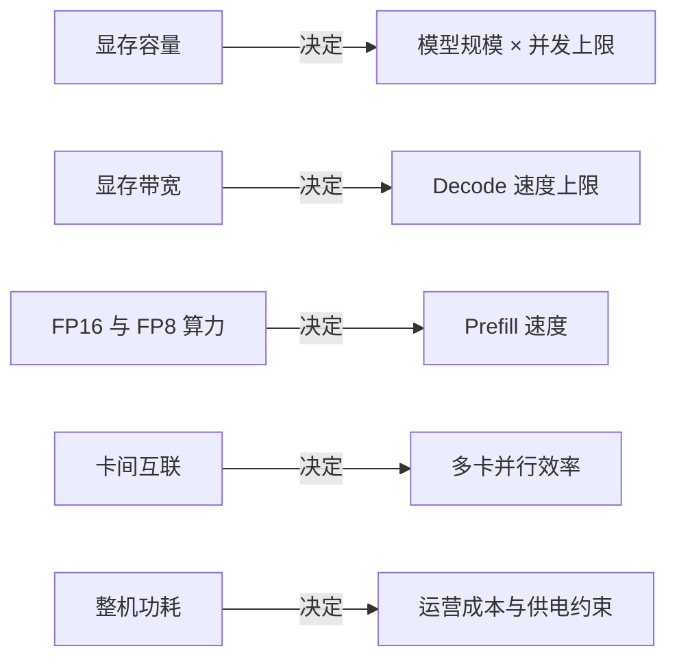
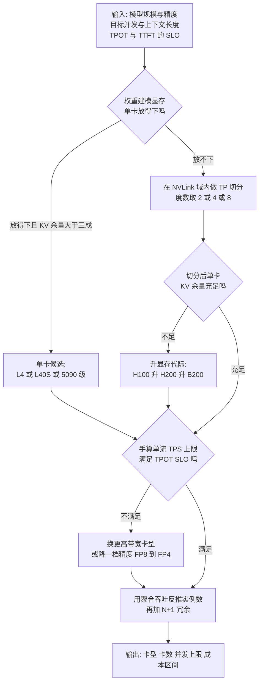
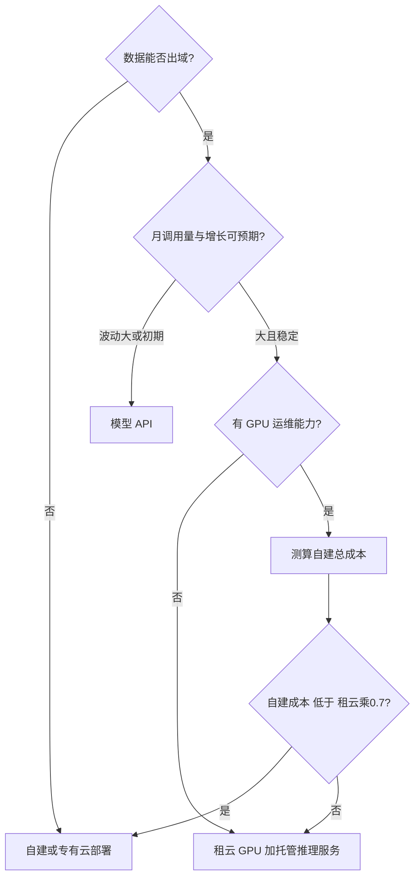

# GPU 选型与推理成本测算

> "我们要上大模型，需要买几张卡？"——这个问题我每年都被问几十次。答案从来不是拍脑袋，而是一道可以算的应用题。这篇面向要做推理容量规划与硬件预算的架构师和工程师，把整条测算链一步步拆开：**显存四件套（权重 / KV Cache / 激活 / 框架开销）怎么逐项算、卡型谱系在 2026 年的真实格局、显存带宽为什么才是 decode 的真正瓶颈、量化与并发怎样改写卡数结论**，最后落到"按模型规模 × 并发 × SLO 三步定卡型定数量"的决策树，以及自建/租云/API 三条路线的成本比较方法。所有卡规格与报价均标注官方页或公开来源与访问日期（2026-09 刷新，Hopper/Blackwell/Blackwell Ultra 现役阵容）。全文主线一句话：**模型定显存、带宽定速度、并发定卡数、利用率定路线**。

## 一、先建立直觉：推理的瓶颈是显存与带宽，不是算力

大模型推理的两个阶段特征完全不同：

| 阶段 | 特征 | 瓶颈 | 选型时看什么 |
| --- | --- | --- | --- |
| **Prefill（预填充）** | 并行处理输入全部 token，一次大矩阵乘 | 计算密集 | TFLOPS（FP16/FP8 算力） |
| **Decode（解码）** | 逐 token 串行生成，每步只算 1 个 token | 访存密集 | 显存容量 + 显存带宽 |

生产负载以 Decode 为主（输出往往比输入长），所以**显存容量决定能跑多大的模型、能并发多少请求；显存带宽决定生成速度**。这也是为什么推理场景里，一张显存带宽高的卡可以胜过算力高但显存小的卡——H200 与 H100 算力完全相同，但 Decode 为主的负载里 H200 单卡有效吞吐明显更高，原因就在带宽（详见第三节规格表与第四节推导）。

选型只需要看懂五个参数：



::: tip 供给侧现实
旗舰卡长期处于"有钱也未必有货"的状态。选型时必须把**供给可得性**作为第一约束：买不到、租不到、坏了换不了，纸面性能再高也没有意义。这也是近年推理方案普遍向"量化 + 中端卡"演进的根本原因。2025–2026 年出口管制的反复（H20 一度停售、H200 改为逐案审批）更把"供给"从商务问题变成了架构问题——同一套模型，要准备两套卡型预案。
:::

## 二、显存账本：四件套逐项算清

### 2.1 总公式

一个可以复用的公式，四个分量缺一不可：

```text
显存需求 ≈ 权重 + KV Cache + 激活与中间态 + 框架运行时开销

权重        = 参数量 × 每参数字节数
KV Cache    = 2 × 层数 × KV头数 × 头维度 × 序列长度 × 并发数 × 精度字节数
              （MLA 等压缩注意力按各自结构单独算，见 2.3）
激活        ≈ k × chunk长度 × 隐藏维度 × 精度字节数   （k 为单层存活张量数，量级 10~34）
框架开销    = CUDA context + CUDA Graph 捕获 + 通信缓冲 + 分配器碎片

安全余量    = 上述合计 × 1.1 ~ 1.2，或按 gpu_memory_utilization=0.9 反推
```

多数人只算第一项，然后在上线当天被第二项打脸。下面逐项拆。

### 2.2 权重：参数量 × 精度字节数

| 精度 | 每参数字节 | 7B 级（8B 参数） | 70B 级 | 671B MoE（总参数） |
| --- | --- | --- | --- | --- |
| FP16 / BF16 | 2 | ~16 GB | ~140 GB | ~1,342 GB |
| FP8 / INT8 | 1 | ~8 GB | ~70 GB | ~671 GB |
| INT4 | 0.5 | ~4 GB | ~35 GB | ~336 GB |

两个容易踩的点：

- **MoE 的显存看总参数，算力看激活参数。** DeepSeek-V3 类 671B MoE 每 token 只激活 37B 参数，但全部专家的权重必须常驻显存——decode 时每个被路由到的专家权重都要从显存读出来。所以"671B 只要 37B 的显存"是错的，"671B 只要 37B 的算力"才是对的。
- **权重刚好塞满 ≠ 能服务。** 70B FP16 = 140GB，H200 是 141GB：权重放下后 KV 与开销为零，服务起不来。单卡能服务的前提是"权重 + 开销之后还留出至少 20–30% 给 KV"。

### 2.3 KV Cache：并发与上下文的放大器

KV Cache 是注意力机制为避免重复计算而缓存的历史 Key/Value 张量。它的公式（MHA/GQA 口径）：

```text
KV = 2(K和V) × 层数 × KV头数 × 头维度 × 序列长度 × 并发数 × 精度字节数
```

按三个公开模型配置实算每 token 的 KV（FP16）。以 Llama-3-70B 级配置为例，手算过程是：

```text
每 token KV = 2(K和V) × 80层 × 8个KV头 × 128头维 × 2字节
            = 327,680 字节 ≈ 320 KB
4K 上下文单请求  = 320KB × 4,096   ≈ 1.28 GB
32K 上下文单请求 = 320KB × 32,768  ≈ 10.2 GB
64 并发 @4K     = 1.28GB × 64     ≈ 80 GB   ← 已经等于一整台 8 卡机的显存
```

三个配置的对照结果：

| 模型配置（公开结构参数） | KV 头数 × 头维 | 每 token KV | 4K 上下文单请求 | 32K 上下文单请求 | 64 并发 @4K |
| --- | --- | --- | --- | --- | --- |
| Llama-3-8B 级：32 层，GQA 8 KV 头 | 8 × 128 | 128 KB | 0.5 GB | 4 GB | ~32 GB |
| Llama-3-70B 级：80 层，GQA 8 KV 头 | 8 × 128 | 320 KB | 1.28 GB | 10.2 GB | ~80 GB |
| DeepSeek-V3 级：61 层，MLA（512+64 维潜变量） | 等效 1 × 576 | ~69 KB | 0.28 GB | 2.2 GB | ~18 GB |


*图源：NVIDIA 官方博客《Mastering LLM Techniques: Inference Optimization》KV caching 示意图（[developer.nvidia.com](https://developer.nvidia.com/blog/mastering-llm-techniques-inference-optimization/)）*

读这张表的三个结论：

1. **KV 是"上下文 × 并发"的二阶放大。** 70B 级模型在 32K 上下文、64 并发下 KV 就是 640GB 量级——比权重本身还大一个数量级。长上下文服务的显存规划，主角从来不是权重。
2. **GQA（分组查询注意力）是第一代减法**：多组 query 头共享一个 KV 头，KV 头数从等于 query 头数降到 1/4、1/8。下图是 MHA / GQA / MQA 三种共享粒度的对照。
3. **MLA（多头潜变量注意力，DeepSeek-V2 提出）是第二代减法**：不存 K/V，只存一个低秩潜变量，decode 时再投影还原。按 DeepSeek-V3 公开配置自算，单 token KV 约为同配置 MHA 的 1/57；DeepSeek-V2 技术报告给出的口径是相对 MHA 降低 93.3%。这就是 671B 模型敢开 64K+ 上下文做高并发服务的底气。


*图源：NVIDIA 官方博客《Mastering LLM Techniques: Inference Optimization》注意力机制对比图（[developer.nvidia.com](https://developer.nvidia.com/blog/mastering-llm-techniques-inference-optimization/)）*


*图源：论文《DeepSeek-V2: A Strong, Economical, and Efficient Mixture-of-Experts Language Model》图 1（[arXiv:2405.04434](https://arxiv.org/abs/2405.04434)）*

还有一项隐性放大：**分配方式造成的浪费**。传统实现按"最大可能长度"为每个请求预分配连续 KV 空间，于是出现预留浪费（reserved）、内部碎片（请求内未用满的槽位）与外部碎片（请求间无法复用的空洞）。vLLM 论文实测这类浪费可占到已分配 KV 显存的大部分，PagedAttention 用"按块分配、按需增长"把它压到 4% 以下——**同一张卡能扛的并发数直接翻倍量级**。做容量规划时，如果框架不支持分页 KV，就要在公式里手动乘一个 1.5~2 的惩罚系数。


*图源：论文《Efficient Memory Management for Large Language Model Serving with PagedAttention》图 2（[arXiv:2309.06180](https://arxiv.org/abs/2309.06180)）*

### 2.4 激活与中间态：Prefill 的瞬时峰值

激活是前向过程中层与层之间必须暂存的张量。它的特点是**瞬时、与 batch×序列长度成正比、随层释放**：

- Decode 阶段每步只处理 1 个 token/请求，激活很小（MB 级 × 并发），通常可忽略；
- Prefill 阶段一次吃进整条 prompt，激活峰值 ≈ k × chunk × hidden × 字节数。以 70B（hidden 8192）为例，chunked prefill 把 chunk 限制在 2048 token 时，这一项在 1–2GB 量级；若关掉分块、直接吃 32K 的长 prompt，可以到 10GB 以上，成为 OOM 的直接原因。

工程含义：**长上下文服务的显存余量要按"最大允许输入长度"的 prefill 峰值留，而不是按 decode 常态留**。vLLM 类框架默认开启 chunked prefill（典型 chunk 2048），就是用"把 Prefill 切碎"换激活峰值可控，代价是少量吞吐损失。

### 2.5 框架与运行时开销：最容易被漏算的 5–10%

| 项 | 典型量级 | 说明 |
| --- | --- | --- |
| CUDA context | 0.3–1 GB | 驱动与运行时驻留，与模型无关 |
| CUDA Graph 捕获 | 1–3 GB | 按 batch 档位预热捕获，档位越多占用越大 |
| 通信缓冲（TP/PP） | 1–2 GB/卡 | NCCL 的 ring/tree 缓冲，卡数越多越大 |
| 分配器碎片 | 已用显存的 2–5% | 缓存分配器的块对齐与复用损失 |
| 框架预留语义 | 全卡的 ~10% | vLLM 的 `gpu_memory_utilization` 默认 0.9，即主动留 10% 给系统 |

我的经验做法：公式合计后乘 1.1–1.2，或直接用"可用显存 = 单卡显存 × 0.9 − 固定 2–4GB"做预算。别小看这几 GB——70B INT8 单卡 80G 的方案，往往就是死在这里。

### 2.6 三个完整算例：7B / 70B / 671B MoE

以下按"FP16 KV、chunked prefill、gpu_memory_utilization=0.9"口径手算，目的是演示方法，数字为量级值：

**7B 级（8B 参数，GQA 8 KV 头），单卡 RTX 4090 24GB：**

| 精度 | 权重 | 固定开销 | KV 预算 | 4K 上下文并发上限 | 结论 |
| --- | --- | --- | --- | --- | --- |
| FP16 | 16 GB | ~2 GB | ~4 GB | ~8 | 能跑但并发寒酸 |
| FP8 | 8 GB | ~2 GB | ~12 GB | ~24 | 量化直接改写并发 |
| INT4 | 4 GB | ~2 GB | ~16 GB | ~32 | 需接受精度折损 |

**70B 级（GQA 8 KV 头），不同卡型：**

| 部署形态 | 权重 | KV 预算 | 4K 并发上限 | 备注 |
| --- | --- | --- | --- | --- |
| FP16，2×H100 80G | 140 GB | ~0 | 不可服务 | 权重塞满即死，典型反面案例 |
| FP16，2×H200 141G | 140 GB | ~105 GB | ~80 | 显存增强版的意义就在 KV |
| FP8，1×H100 80G | 70 GB | 负数 | 不可服务 | 0.9×80=72 < 70+开销 |
| FP8，1×H200 141G | 70 GB | ~53 GB | ~41 | 单卡可服务的下限形态 |
| FP8，2×H100 80G | 70 GB | ~68 GB | ~53 | 生产常见形态，留了 TP 与冗余 |
| INT4，1×L40S 48G | 35 GB | ~6 GB | ~4 | 边缘/低并发场景 |

**671B MoE（MLA，61 层），机柜/多机口径：**

| 部署形态 | 权重 | 是否放得下 | KV 预算 | 64K 并发上限（FP16 KV，4.4GB/请求） |
| --- | --- | --- | --- | --- |
| FP8，8×H100（640GB） | 671 GB | 否（可用 ~576GB） | — | 需 FP4 或 16 卡 |
| FP4，8×H100 | 336 GB | 是 | ~236 GB | ~53 |
| FP8，8×H200（1,128GB） | 671 GB | 是 | ~340 GB | ~77 |
| FP8，8×B200（1,536GB） | 671 GB | 宽裕 | ~700 GB | ~150 |
| FP8，GB200 NVL72 整柜 | 671 GB | 整柜 13.4TB | 充裕 | 千级并发量级 |

结论很直接：**量化等级与注意力结构改变的不只是性能，而是硬件方案的台数与形态**。671B 在"8 卡 H100"与"8 卡 H200"之间是能与不能的区别，在"FP8 与 FP4"之间是 8 卡与 16 卡的区别。

## 三、卡型谱系：2026-09 在售格局与官方规格

### 3.1 代际爬坡：显存与带宽才是主线


*图源：NVIDIA 官方博客《Inside NVIDIA Blackwell Ultra》显存容量对比图（[developer.nvidia.com](https://developer.nvidia.com/blog/inside-nvidia-blackwell-ultra-the-chip-powering-the-ai-factory-era/)）*

从 H100 的 80GB 到 Blackwell Ultra 的 288GB 是 3.6 倍；带宽从 3.35TB/s 到 8TB/s 是 2.4 倍。而同期 FP8 算力涨了约 4 倍（稀疏口径）。**推理侧的代际红利主要在显存侧**——这解释了为什么 H200（算力与 H100 相同）在推理市场比"同算力的新卡"更受欢迎。

### 3.2 官方规格对照表

下表是 2026-09-05 我逐条核对的在售阵容。数据中心卡以 NVIDIA 官网产品页为准（HTTP 200 实测）；算力数字如无注明均为**含稀疏（With Sparsity）口径，稠密约为一半**——这是官网脚注原话，也是二手资料最常搞混的地方。

| 型号 | 定位 | 显存 | 显存带宽 | 代表性算力（口径） | 卡间互联 | 官方规格页 |
| --- | --- | --- | --- | --- | --- | --- |
| A100 80GB SXM | Ampere 上一代主力 | 80GB HBM2e | 1,935–2,039 GB/s | FP16 312 TFLOPS（稀疏） | NVLink 600GB/s | [A100](https://www.nvidia.com/en-us/data-center/a100/) |
| H100 SXM | Hopper 旗舰 | 80GB HBM3 | 3.35TB/s | FP8 3,958 TFLOPS（稀疏） | NVLink 900GB/s | [H100](https://www.nvidia.com/en-us/data-center/h100/) |
| H200 SXM | Hopper 显存增强 | 141GB HBM3e | 4.8TB/s | FP8 3,958 TFLOPS（稀疏） | NVLink 900GB/s | [H200](https://www.nvidia.com/en-us/data-center/h200/) |
| HGX B200（8 卡基板） | Blackwell 旗舰 | 单卡 192GB HBM3e（8 卡 1.5TB 级） | 单卡 8TB/s | FP4 144 PFLOPS/8 卡（稀疏，稠密 72） | NVLink 1.8TB/s/卡 | [HGX](https://www.nvidia.com/en-us/data-center/hgx/) |
| HGX B300（Blackwell Ultra） | 2026 旗舰 | 单卡 288GB HBM3e | 单卡 8TB/s | FP4 144 PFLOPS/8 卡（稀疏，稠密 108） | NVLink 1.8TB/s/卡 | [HGX](https://www.nvidia.com/en-us/data-center/hgx/) |
| GB200 NVL72（整机柜） | 机柜级 Blackwell | 合计 13.4TB HBM3e | 合计 576TB/s | NVFP4 1,440 / FP8 720 PFLOPS（稀疏） | NVLink 域 130TB/s | [GB200 NVL72](https://www.nvidia.com/en-us/data-center/gb200-nvl72/) |
| GB300 NVL72（整机柜） | 机柜级 Blackwell Ultra | 合计 20TB（+37TB 快内存） | 合计最高 576TB/s | FP4 1,440 / FP8 720 PFLOPS（稀疏） | NVLink 域 130TB/s | [GB300 NVL72](https://www.nvidia.com/en-us/data-center/gb300-nvl72/) |
| L40S | Ada 主流推理/通用 | 48GB GDDR6 ECC | 864GB/s | FP8 1,466 TFLOPS（稀疏） | PCIe（无 NVLink） | [L40S](https://www.nvidia.com/en-us/data-center/l40s/) |
| L4 | Ada 轻量推理 | 24GB GDDR6 | 300GB/s | FP8 485 TFLOPS（稀疏） | PCIe | [L4](https://www.nvidia.com/en-us/data-center/l4/) |
| A10 | Ampere 轻量推理/图形 | 24GB GDDR6 | 600GB/s | FP32 31.2 TFLOPS | PCIe Gen4 | [A10](https://www.nvidia.com/en-us/data-center/products/a10-gpu/) |
| RTX 4090 | 消费级旗舰（上一代） | 24GB GDDR6X | 1,008GB/s | FP32 82.6 TFLOPS 级 | 无 NVLink | NVIDIA GeForce 页 |
| RTX 5090 | 消费级旗舰 | 32GB GDDR7 | 1,792GB/s | 3,352 AI TOPS | 无 NVLink | [RTX 5090](https://www.nvidia.com/en-us/geforce/graphics-cards/50-series/rtx-5090/) |

读表说明（都是一线对方案时反复要解释的）：

- **H200 与 H100 算力相同**（FP8 同为 3,958 TFLOPS 稀疏），差别全在显存：容量 80→141GB、带宽 3.35→4.8TB/s。Decode 为主的负载里 H200 单卡有效吞吐明显更高——"带宽即正义"的标准案例。
- **B200/B300 的显存口径要盯紧页面**：NVIDIA 官方博客的代际对比图标 Blackwell 单卡 192GB、Blackwell Ultra 288GB；GB200 NVL72 产品页按 372GB/超级芯片（2 GPU）折算约 186GB/卡、整柜 13.4TB，GB300 NVL72 产品页按整柜 20TB 折算约 278GB/卡，与 288GB 的标称存在"名义容量 vs 可用容量"的出入。测算时以所引用页面原文为准，并在表格里写明口径。
- **GB200/GB300 NVL72 是"一台机柜"而不是一堆卡**：72 GPU 单 NVLink 域（域内聚合 130TB/s），超大 MoE 可以整柜部署，容量规划粒度从"卡数"变成"柜数"；GB300 NVL72 额外带 37TB "快内存"（LPDDR 层），为 KV 卸载/分层存储提供了官方形态。
- **Rubin 已在 HGX 页挂出**：HGX Rubin NVL8 标称 2.3TB HBM4、聚合 176TB/s 带宽、NVFP4 400 PFLOPS，NVLink Switch 带宽 28.8TB/s。阵容更迭很快，测算锚定的永远是"当前能采购到的代际"。
- **L20/H20 未列入官方表**：截至 2026-09-05，这两款区域向卡在 nvidia.com 的产品页返回 404（实测）。按"确有公开规格才列官方口径"的原则，它们的规格放在 3.4 节以公开报道口径给出。
- **A10 是个路径坑**：它的官方页在 `/data-center/products/a10-gpu/`，而 `/data-center/a10/` 返回 404——核对规格时很容易因此误判"产品已下线"。判断一款卡是否在售，路径要查全，必要时以经销商与云厂商在售清单交叉验证。

### 3.3 互联：NVLink 域决定并行粒度


*图源：NVIDIA 官方博客《NVIDIA Hopper Architecture In-Depth》HGX H100 基板图（[developer.nvidia.com](https://developer.nvidia.com/blog/nvidia-hopper-architecture-in-depth/)）*

互联参数在推理侧的意义与训练不同：

| 互联形态 | 典型带宽 | 推理侧含义 |
| --- | --- | --- |
| 单机 NVLink 域（8 卡） | 900GB/s–1.8TB/s/卡 | TP（张量并行）的可行边界：70B/671B 的 TP 度数一般不超过域内卡数 |
| 机柜 NVLink 域（72 卡） | 域内聚合 130TB/s | TP/EP 可以跨"机"做到跨"柜"，MoE 专家并行的主场 |
| PCIe Gen4/Gen5 | 32–64GB/s 单向 | 只够 PP（流水并行）与小模型；在 PCIe 卡上做 TP 会被通信吃掉收益 |
| 无互联（消费级） | — | 只能单卡或 PP 拆层，4090/5090 做 70B 要靠层间切分 + 量化 |

TP 的切法（按列切 MLP 与注意力头）决定了"每卡只读 1/N 权重、但每层要 all-reduce 一次"：


*图源：NVIDIA 官方博客《Mastering LLM Techniques: Inference Optimization》张量并行示意图（[developer.nvidia.com](https://developer.nvidia.com/blog/mastering-llm-techniques-inference-optimization/)）*

工程含义：**decode 阶段 TP 几乎总是赚的**（把"读权重"摊到 N 条带宽上，通信量只与 batch×hidden 有关、与权重无关）；**prefill 阶段 TP 的通信占比更高**，batch 大时收益递减。所以"TP 度数 = 显存放不下时的最小切分度数"是稳妥起点，而不是越大越好。

### 3.4 中国区合规卡与消费级卡的现实

出口管制把"中国区能买什么"变成了一个独立变量。公开时间线（BIS 官方口径）：2023-10 规则堵住 A800/H800 的互联阉割路线后，NVIDIA 推出 H20/L20/L2；2025-04 H20 被列入无限期许可审查、NVIDIA 计提 55 亿美元；2025-07 恢复出货；2026-01-15 BIS 最终规则把 H200/MI325X 从"推定拒绝"改为"逐案审批"（门槛：总处理性能 < 21,000 且显存带宽 < 6,500 GB/s），2026-05 美方批准向约 10 家中国企业销售 H200。政策一年数变，**架构上要为"卡型不可得"留预案**。

官方页已下线、只能按公开报道口径引用的两款（TechPowerUp 数据库与 SemiAnalysis 拆解，访问日期 2026-09-05）：

| 型号 | 显存 | 显存带宽 | 算力（口径混乱，慎用） | 互联/功耗 | 推理侧画像 |
| --- | --- | --- | --- | --- | --- |
| H20 | 96GB HBM3 | ~4.0TB/s | FP16 ~148 TFLOPS 稠密 / ~296 稀疏 | NVLink 900GB/s / 400W | 算力被砍、显存与带宽反超 H100：典型"推理特化"卡，长上下文 decode 甚至快于 H100，训练则弱 |
| L20 | 48GB GDDR6 ECC | 864GB/s | FP32 59.8 TFLOPS | PCIe / 275W | 约等于无 NVLink 的 L40S，中小模型推理与微调的合规主力 |

消费级卡（4090/5090）在推理侧的真实位置：

- **带宽性价比极高**：5090 的 1,792GB/s 超过 L40S 两倍、接近 H100 的六成，配 32GB 显存，INT4/FP8 的 7B–14B 模型单卡体验很好；
- **但有三个硬约束**：无 ECC（长时服务的静默错误风险）、无 NVLink（多卡只能 PP/单机多实例）、许可条款对数据中心部署不友好。我的用法是：开发验证、边缘与小流量场景用消费级，生产底座不用。

国产加速器在选型表里的位置也要写实：多家产品已形成稳定供给，生态（算子覆盖度、主流推理框架适配、量化通路）仍在追赶，实际落地的工作量主要在适配与回归测试上，而不是硬件本身。我见到的典型用法是两类：**合规与信创要求驱动的必选项**，以及**对单一供应商供给风险的对冲仓位**（用一小部分流量长期跑在第二生态上，保持热备）。评估时的关键动作是用自己的真实模型与算子清单做适配摸底，而不是看厂商对标表。

### 3.5 机柜级：规划粒度从卡到柜


*图源：NVIDIA GB200 NVL72 产品页配图（[nvidia.com](https://www.nvidia.com/en-us/data-center/gb200-nvl72/)，访问日期 2026-09-05）*

GB200/GB300 NVL72 改变了三件事：容量规划按柜算（整柜 13.4–20TB 显存）；MoE 的专家并行（EP）有了足够大的单一互联域；KV 可以做柜内分层（HBM + 37TB 快内存）。代价是液冷机房、整柜采购与供电——**它适合"模型太大、并发太高"的确定性负载，不适合需求还在验证期的团队**。

## 四、带宽为什么决定 decode 吞吐

### 4.1 算术强度与 roofline

Roofline 模型把硬件能力画成两条线：水平线是算力上限 π（FLOPS），斜线是带宽上限 β × 算术强度（FLOPs/byte）。一个内核落在斜线段就是访存瓶颈，落在水平段才是算力瓶颈。


*图源：Wikimedia Commons《Roofline model bandwidth ceilings》（CC BY-SA 4.0，[commons.wikimedia.org](https://commons.wikimedia.org/wiki/File:Roofline_model_bandwidth_ceilings.png)）*

把两个阶段代进去：

- **Prefill**：处理长度 S 的输入，FLOPs ≈ 2×P×S（P 为参数量），读权重一次 P×字节数 → 算术强度 ≈ 2×S / 字节数。S=2048、FP16 时约 2,048 FLOPs/byte，远高于脊点 → **算力瓶颈**。
- **Decode**：每步对 batch 中每个请求做 2×P 的 FLOPs，但权重只读一遍 → 算术强度 ≈ 2×B / 字节数（B 为 batch）。FP16 下即 B FLOPs/byte。H100 的脊点约为 1,979 TFLOPS（FP8 稠密）÷ 3.35TB/s ≈ 590 FLOPs/byte——**要 batch ≈ 300 才摸到脊点**，而受显存与 SLO 约束的生产 batch 通常在几十到一两百，且 KV 读取还会进一步拉低算术强度。所以 decode 长期趴在斜线段：**吞吐 ≈ 带宽 ÷ 每 token 读取字节数**。

### 4.2 每 token 的读权重账：单流速度上限

decode 单流（batch=1）时，每生成一个 token 至少要把全部权重读一遍。上限 = 带宽 ÷ 权重字节数：

| 模型与精度 | 每 token 读权重 | H100（3.35TB/s） | H200（4.8TB/s） | B200（8TB/s） | RTX 4090（1.0TB/s） | RTX 5090（1.79TB/s） |
| --- | --- | --- | --- | --- | --- | --- |
| 7B FP16 | 16 GB | 209 tok/s | 292 | 488 | 63 | 112 |
| 70B FP16 | 140 GB | 24 tok/s | 34 | 57 | — | — |
| 70B FP8 | 70 GB | 48 tok/s | 68 | 114 | — | — |
| 671B FP8（8 卡 TP） | 671 GB / 8 卡带宽和 | —（放不下） | 57 | 95 | — | — |

（理论上限，未计 KV 读取与 kernel 效率；多卡口径为权重切分后各卡读自己那份、带宽相加。671B 行按 8 卡 NVLink 域计算。）

这张表解释了三个日常现象：为什么 H200 比 H100 贵得值；为什么 FP8 一上吞吐近翻倍；为什么 5090 跑 7B 单流能破百 tok/s 而 L4（300GB/s）只有 ~19 tok/s。**选型时先算这一行，再谈别的。**

手算上限需要一个外部锚点来校验"量级没算错"。行业公开基准里，MLPerf Inference 的 datacenter 赛道从 v4.0（2024-03）起以 Llama 2 70B 的 tokens/s 为主负载，v5.0（2025-04）升级到 Llama 3.1 405B + 128K 上下文并给出 TTFT 6s / TPOT 40ms（P99 25 tok/s）量级的延迟门槛，v5.1（2025-09）又加入小模型负载。我的用法是：**用手算上限对照同卡型同负载的公开提交值，两者在同一量级才放行方案**；差距超过 2–3 倍通常意味着口径错了（稀疏/稠密、offline/online、是否含量化）。

### 4.3 batch 上来之后：KV 项与算力项

batch=B、平均上下文 L 时，每步读取量 = 权重 + B×L×每 token KV，再叠加算力项：

```text
TPOT ≈ max( (W + B × L × kv_per_token) / 带宽 ,  2 × P × B / 有效算力 )
聚合吞吐 ≈ B / TPOT
```

两个推论：

1. **小 batch 看带宽，大 batch 看算力与 KV。** B 增大时权重被摊薄（每请求分摊的权重读取下降），KV 读取与算力项占比上升——所以"高并发服务"的卡型选择会逐渐从"带宽优先"滑向"算力+显存容量优先"。
2. **TPOT 随 B 近似线性变差**（在访存段），这就是并发-延迟 trade-off 的数学形态，也是第六节 SLO 反推并发的依据。

### 4.4 什么时候带宽不再是瓶颈

把"decode 看带宽"当成永恒真理也会错判三类场景：

| 场景 | 为什么带宽退居二线 | 选型含义 |
| --- | --- | --- |
| 超大 batch 的离线吞吐 | 算术强度进入脊点右侧，算力项主导 | 看 FP8/FP4 算力与显存容量，而非带宽 |
| 推测解码（speculative decoding） | 一次验证多个 token，等价于提高每步算术强度 | 收益与草稿模型命中率相关，需实测 |
| Prefill 占比高的负载（长输入短输出，如 RAG 汇总） | 负载主体是计算密集段 | 看 FP16/FP8 算力与 TTFT，必要时 prefill/decode 分离部署 |
| KV 命中前缀缓存的对话负载 | 重复上下文不重算也不重读权重 | 命中率高的场景，显存容量与调度策略比裸带宽更值钱 |

判断方法很简单：压测时把 batch 从 1 扫到框架上限，画 TPOT-并发曲线。曲线前段平坦（带宽段）、后段陡升（算力/排队段），拐点位置就是你该按哪种口径选卡的依据。

## 五、量化对选型的影响


*图源：NVIDIA 官方博客《Mastering LLM Techniques: Inference Optimization》量化示意图（[developer.nvidia.com](https://developer.nvidia.com/blog/mastering-llm-techniques-inference-optimization/)）*

| 精度组合 | 权重显存 | decode 收益来源 | 70B 最少卡数（生产口径） | 风险 |
| --- | --- | --- | --- | --- |
| FP16 基线 | 140 GB | — | 2×H200 / 4×H100 | 无 |
| W8A8（FP8） | 70 GB | 权重与激活都减半：prefill 算力翻倍 + decode 读权重减半 | 1×H200 / 2×H100 | 现代框架与卡原生支持，风险低 |
| W4A16（INT4 权重） | 35 GB | decode 读权重减到 1/4（带宽项主导时近 4 倍） | 1×L40S / 1×H100 | 精度折损需 eval 把关；prefill 收益小 |
| W4A8 / FP4（Blackwell NVFP4） | 35 GB | 权重 1/4 + 激活 FP8/FP4，Blackwell 原生 | 1×L40S / 1×B200 宽裕 | 新精度生态仍在成熟期 |
| KV Cache FP8 | 不动权重 | KV 预算翻倍 = 并发上限翻倍 | 同上但并发 ×2 | 长上下文质量需抽查 |

三条一线判断：

- **decode 为主的负载，量化权重是第一杠杆**（直接砍带宽项）；**prefill 为主的负载，量化激活与用 FP8 算力才是杠杆**。两者别搞反。
- **KV 量化是"免费"的并发翻倍**：H200 上 70B FP8 + FP8 KV，4K 并发上限从 ~41 到 ~80 量级。
- 量化的代价必须用评测闭环偿还：选 W4 前跑业务评测集，留 FP8 作回退档。**"量化改变台数"这件事，只有在精度可接受时才成立。**

## 六、并发-显存-延迟三角

### 6.1 三个量互相怎么顶

- **显存顶并发**：并发上限₁ = KV 预算 ÷ 单请求 KV（上下文长度决定）；
- **延迟顶并发**：并发上限₂ = 由 TPOT SLO 反推（4.3 的公式解出 B）；
- **吞吐定成本**：聚合吞吐 = min(上限₁, 上限₂) 对应的 B ÷ TPOT。

真实系统里几乎总是**显存先顶到**（因为 KV 随上下文线性涨），而延迟 SLO 决定你"敢不敢"把显存给的并发用满。

### 6.2 一个手算算例：70B FP8，2×H100，TPOT SLO 50ms

```text
可用显存   = 2 × 80 × 0.9 = 144 GB
权重+开销  = 70 + 6 = 76 GB  →  KV 预算 = 68 GB
显存上限   = 68 ÷ 1.28GB(4K, FP16 KV) ≈ 53 并发
延迟上限   : 权重项 70GB ÷ 6.7TB/s(TP2) = 10.4ms
             KV 项  B × 1.28GB ÷ 6.7TB/s = B × 0.19ms
             50ms SLO → B ≤ (50 − 10.4) ÷ 0.19 ≈ 208 并发
取小者     = 53 并发 → 聚合吞吐 ≈ 53 ÷ 0.05s ≈ 1,060 tok/s
若开 FP8 KV: 显存上限 → ~106 并发，此时延迟上限(208)仍宽松，吞吐近翻倍
```

这个算例的信息量：**卡型与精度定了之后，并发上限和聚合吞吐是可以手算的**；而"开 FP8 KV"这一项配置改动，收益等于加了一倍卡。做方案时把这三个数（KV 预算、SLO 反推 B、聚合吞吐）写进测算表，比任何"经验并发数"都可靠。

### 6.3 工程上的取法

| 场景 | 并发的取法 | 说明 |
| --- | --- | --- |
| 对话类（输出长、SLO 松） | 用满显存上限的 80–90% | TPOT 50–80ms 可接受 |
| Agent/工具调用（SLO 紧） | 以 SLO 反推值为准，显存留 30% 余量 | 尾延迟比均值重要 |
| 离线批处理 | 压到框架稳定上限 | 看聚合吞吐，不看单请求延迟 |
| 长上下文（>32K） | 显存上限主导，且要按 P95 长度算 KV | 平均长度会骗人 |

### 6.4 三角的第三个顶点是成本

并发-显存-延迟三角的每条边都标着价格：提并发要 KV 显存（加卡或量化 KV），压延迟要带宽（升代际或加 TP），而两者共同决定单 token 成本。工程上我的排序是**先满足 SLO（不可谈判），再在剩余空间里最大化并发（摊薄成本）**，而不是反过来先压成本再谈体验——后者在对话类产品上几乎必然返工。把 6.2 的三个数（KV 预算、SLO 反推并发、聚合吞吐）与第七节的卡时报价放进同一张表，"每百万 token 成本"就会随并发取值呈现一个明显的 U 型：并发太低摊不薄权重读取，并发太高撞 SLO 后要加卡。U 型底部附近 ±20% 就是合理的运行点。

## 七、云上选型方法论：三步定卡型与数量



### 7.1 第一步：显存定卡型下限

用第二节的四件套公式算"权重+开销"，要求单卡（或 TP 切分后的单卡）留出 ≥30% 给 KV。这一步淘汰掉所有"看起来够"的卡：70B FP16 淘汰单卡 80G，671B FP8 淘汰 8×H100。

### 7.2 第二步：带宽与 SLO 定卡型

用 4.2 的单流上限表对照 TPOT SLO；不满足就升带宽代际或降精度。注意 TTFT（首包）由 prefill 算力决定，长 prompt 场景要把算力项也查一遍——**同一卡型可能 TPOT 达标而 TTFT 不达标**，这时要考虑 chunked prefill 与 prefill/decode 分离部署（见[推理部署实战](/ai/infra/inference/llm-inference)）。

### 7.3 第三步：吞吐定数量与冗余

实例数 = 峰值聚合需求 ÷ 单实例实测聚合吞吐；再加 N+1（或按故障域加）。**实测必须用真实长度分布的输入输出**，压测方法见[推理部署实战](/ai/infra/inference/llm-inference)的坑清单。

实测口径有三个必须写进报告的字段，否则数字不可比：**并发档位与调度策略**（continuous batching 的队列深度）、**输入/输出长度分布**（P50/P95，而不是单一固定值）、**SLO 达标率**（P99 TPOT 而非均值）。我见过太多"吞吐很漂亮、P99 惨不忍睹"的压测报告，根因都是只报了 offline 口径的聚合值。给决策层的表里，聚合吞吐与 P99 延迟必须成对出现。

### 7.4 弹性与潮汐：固定底座 + 弹性层

峰谷比大的负载按峰值配固定底座会大量闲置。我的默认结构：

- **固定底座**覆盖 P50–P70 负载，用包年/自建摊销；
- **弹性层**覆盖峰值与潮汐，用按需或 spot/竞价实例（公开市场 spot 通常为按需的三到五折），配合请求排队与降级策略；
- **混部**：推理低峰时段跑离线批处理/评测/微调任务填谷，把利用率从 30% 拉到 60%+——这是单位成本下降最狠的一刀。

### 7.5 报价口径与单位成本

```text
每百万 token 成本 = 卡时成本 ÷ 实测聚合吞吐 × 10⁶

其中 卡时成本:
  租云  = 单卡小时价格
  自建  = (采购价 ÷ 折旧月数 ÷ 730 + 电力成本 + 运维摊销) ÷ 卡数
```

卡时单价要有出处。下表是 GPU 租赁平台的公开按需报价快照（[RunPod 官方定价页](https://www.runpod.io/pricing)，Community/Secure 两档区间，2026-09-05 经公开渠道复核）：

| GPU | 公开按需报价（美元/卡·小时） |
| --- | --- |
| B300 | 6.94–7.89 |
| B200 | 5.98–6.79 |
| H200 SXM | 3.59–4.59 |
| H100 SXM | 2.69–3.29 |
| H100 PCIe | 1.99–2.89 |
| A100 SXM | 1.39–1.59 |
| L40S | 0.79–0.99 |
| L4 | 0.44–0.49 |

**公开报价口径、波动大，仅供量级参考**：竞价/二级现货市场可能更低；超大规模云厂商的官方 GPU 实例通常更高，且带区域与合约约束；新一代卡上市初期溢价最高，随供给爬坡明显回落。引用任何报价都要写明来源和日期。

自建与租云的交叉点经验值：**稳定高利用率（>50%）且持续一年以上，自建开始划算；利用率低或需求波动大，租云永远更优**。电力与运维摊销常被漏算——一张旗舰卡整机功耗 700W–1.4kW，三年电费可以是购卡成本的显著比例。另外注意：上面那张报价表一年之内就可能整体下移一档（Blackwell 铺量后 H100 单价已明显回落），**每次做预算前重拉一遍公开报价**，别用旧测算表里的数字。

### 7.6 一个完整的测算示例

> 场景：70B 模型对外服务，日均 2 亿输出 token，峰值 8,000 tokens/s。

1. 显存：INT8/FP8 部署，每实例 2 张 80G 卡（KV 预算 ~68GB，4K 并发 ~53）
2. 吞吐：实测单实例聚合 ~4,500 tokens/s（INT8，vLLM 类框架，真实长度分布）
3. 容量：峰值需要 2 个实例 = 4 张卡；加 N+1 冗余 = 6 张卡
4. 对比：同样负载走商用 API 的月账单 = 2 亿 × 30 × 单价；与 6 卡自建月摊销对比（含电力运维）
5. 决策：调用量再涨 3 倍前 API 更划算 → **先 API，预留自建方案，设置成本预警线**

## 八、自建 / 租云 / API 三条路线的决策框架



（0.7 系数是对自建隐性成本——故障、升级、闲置——的保守补偿，可按团队情况调整。单位成本的完整算法见 [Token 经济学](/ai/infra/inference/token-economics)。）

## 九、训练侧对照：同一张卡，两套账

本文全部是推理口径。训练侧的显存账与瓶颈结构不同，做"一卡两用"规划时必须分开算（详见[训练工程](/ai/infra/training)与[集群与高速网络](/ai/infra/cluster)）：

| 维度 | 推理 | 训练 | 对选型的含义 |
| --- | --- | --- | --- |
| 显存构成 | 权重 + KV + 激活 + 开销 | 权重 + 梯度 + 优化器状态 + 激活（FP16+Adam 约 16 字节/参数） | 训练的显存大头不是权重，ZeRO/重计算是必选项 |
| 主导瓶颈 | decode 看带宽，prefill 看算力 | 算力 + 互联（all-reduce/AllToAll） | 训练卡优先看 FP16/BF16 算力与 NVLink/网络 |
| 并行策略 | TP（域内）+ PP + 并发调度 | TP + PP + DP + EP + ZeRO | 训练对跨机网络（IB/RoCE）敏感度远高于推理 |
| 利用率口径 | 聚合吞吐 / SLO 达标率 | MFU（模型 FLOPs 利用率） | 两者的"好"不可互推 |
| 卡型偏好 | 显存容量与带宽优先 | 算力与互联优先 | H20 这类"带宽高算力低"的卡适合推理不适合训练，是口径差异的直接产物 |

## 十、常见坑

| 坑 | 现象 | 根因与对策 |
| --- | --- | --- |
| 只算权重不算 KV | 压测正常，上线长上下文即 OOM | KV 是"上下文×并发"二阶放大；按 P95 长度与目标并发算 KV 预算 |
| 权重刚好塞满就当能服务 | 服务起不来或并发为个位数 | 单卡可用 = 显存×0.9−固定开销；留 ≥30% 给 KV |
| 忽略分配方式浪费 | 显存"够"但并发上不去 | 连续分配的预留/内外碎片；用分页 KV（PagedAttention 类） |
| 混淆稀疏/稠密口径 | 算力数字差一倍，方案全错 | 官网脚注：无注明即含稀疏；测算表写清口径 |
| 混淆单卡/整机/整柜口径 | B200 显存写成 8 卡合计 | 规格表只信一个来源，逐条注明页面 |
| 用旧规格/旧报价做测算 | 预算与采购对不上 | 代际与报价一年一变；每次测算前核对官方页与近期公开报价，注明访问日期 |
| 只看卡价不看配套 | 交付成本远超卡价 | 网络、存储、机柜电力、备件单列预算；按整机柜/整机房立项 |
| 按峰值配卡不留弹性 | 峰谷比大时底座大量闲置 | 固定底座 + 弹性租云/spot + 混部填谷 |
| 忽略折旧周期 | 自建成本被低估 | 硬件迭代快，折旧按 2–3 年算 |
| 用训练卡做纯推理 / 反之 | 预算错配或带宽不够 | 先定负载类型再选卡型（见第九节对照表） |
| 不算电力 | 运营账缺口 | 卡时成本公式里电力与运维摊销必填；旗舰卡 700W–1.4kW |
| 量化不上评测 | 上线后质量投诉 | W4/FP4 前跑业务评测集，留 FP8 回退档 |
| 把政策当常量 | 卡型断供、方案停摆 | 出口管制一年数变；关键模型准备双卡型预案 |

## 小结

GPU 选型不是硬件问题，是**容量规划问题**：模型定显存、带宽定速度、并发定卡数、利用率定路线。把"权重 + KV + 激活 + 开销"四件套算清、把"带宽 ÷ 每 token 读取字节"这条上限算清、把 SLO 反推的并发算清，"买几张卡"就不再是玄学。框架本身是稳定的，但参数会过时——从 Hopper 到 Blackwell Ultra 只隔两代，显存、带宽、算力与卡时报价的口径全部换过一轮，测算表里的数字至少每年校准一次，政策敏感区域每季度校准一次。

## 参考资料

<Refs>

**NVIDIA 官方规格页**（访问日期 2026-09-05，均实测可达）

- [NVIDIA A100 Tensor Core GPU](https://www.nvidia.com/en-us/data-center/a100/) —— 80GB HBM2e、1,935/2,039 GB/s、FP16 312 TFLOPS（稀疏）、NVLink 600GB/s
- [NVIDIA H100 Tensor Core GPU](https://www.nvidia.com/en-us/data-center/h100/) —— 80GB HBM3、3.35TB/s、FP8 3,958 TFLOPS（稀疏）、TDP 最高 700W
- [NVIDIA H200 Tensor Core GPU](https://www.nvidia.com/en-us/data-center/h200/) —— 141GB HBM3e、4.8TB/s、FP8 3,958 TFLOPS（稀疏）
- [NVIDIA HGX](https://www.nvidia.com/en-us/data-center/hgx/) —— HGX B200/B300 八卡口径（FP4 144 PFLOPS 稀疏、NVLink 1.8TB/s/卡）与 HGX Rubin NVL8（2.3TB HBM4、176TB/s、NVFP4 400 PFLOPS）
- [NVIDIA GB200 NVL72](https://www.nvidia.com/en-us/data-center/gb200-nvl72/) —— 72 GPU 单域：13.4TB HBM3e、聚合 576TB/s、NVFP4 1,440 / FP8 720 PFLOPS（稀疏）
- [NVIDIA GB300 NVL72](https://www.nvidia.com/en-us/data-center/gb300-nvl72/) —— 72 Blackwell Ultra + 36 Grace：GPU 显存 20TB、快内存 37TB、NVLink 域 130TB/s
- [NVIDIA L40S](https://www.nvidia.com/en-us/data-center/l40s/) —— 48GB GDDR6 ECC、864GB/s、FP8 1,466 TFLOPS（稀疏）
- [NVIDIA L4](https://www.nvidia.com/en-us/data-center/l4/) —— 24GB GDDR6、300GB/s、FP8 485 TFLOPS（稀疏）
- [NVIDIA A10](https://www.nvidia.com/en-us/data-center/products/a10-gpu/) —— 24GB GDDR6、600GB/s、FP32 31.2 TFLOPS
- [NVIDIA GeForce RTX 5090](https://www.nvidia.com/en-us/geforce/graphics-cards/50-series/rtx-5090/) —— 32GB GDDR7、512-bit、1,792GB/s、3,352 AI TOPS、575W

**NVIDIA 官方博客**（访问日期 2026-09-05）

- [Inside NVIDIA Blackwell Ultra: The Chip Powering the AI Factory Era](https://developer.nvidia.com/blog/inside-nvidia-blackwell-ultra-the-chip-powering-the-ai-factory-era/) —— 代际显存容量对比（80→141→192→288GB）、Blackwell Ultra 规格口径
- [NVIDIA Hopper Architecture In-Depth](https://developer.nvidia.com/blog/nvidia-hopper-architecture-in-depth/) —— H100/HGX 基板与互联口径
- [Mastering LLM Techniques: Inference Optimization](https://developer.nvidia.com/blog/mastering-llm-techniques-inference-optimization/) —— KV cache、MHA/GQA/MQA 对比、张量并行、量化等本文多张配图的来源

**原始论文**（访问日期 2026-09-05）

- [Efficient Memory Management for Large Language Model Serving with PagedAttention（arXiv:2309.06180）](https://arxiv.org/abs/2309.06180) —— KV 连续分配的预留/内部/外部碎片实测与分页方案
- [GQA: Training Generalized Multi-Query Transformer Models from Multi-Head Checkpoints（arXiv:2305.13245）](https://arxiv.org/abs/2305.13245) —— GQA/MQA 的 KV 共享粒度原始设计
- [DeepSeek-V2: A Strong, Economical, and Efficient Mixture-of-Experts Language Model（arXiv:2405.04434）](https://arxiv.org/abs/2405.04434) —— MLA 潜变量注意力与 KV 压缩口径（报告称相对 MHA 降 93.3%）
- [LLM Inference Unveiled: Survey and Roofline Model Insights（arXiv:2402.16363）](https://arxiv.org/abs/2402.16363) —— 用 roofline 模型刻画 prefill 算力瓶颈 / decode 访存瓶颈的系统性分析

**公开定价与基准**（访问日期 2026-09-05）

- [RunPod GPU Cloud Pricing](https://www.runpod.io/pricing) —— GPU 租赁市场公开按需报价（正文价格表来源；公开口径、波动大、仅供量级参考）
- [MLPerf Inference: Datacenter（MLCommons）](https://mlcommons.org/benchmarks/inference-datacenter/) —— 跨代际推理性能行业基准；v5.0 起含 Llama 3.1 405B @128K 上下文负载

**政策与区域卡口径**（访问日期 2026-09-05）

- [BIS: Revision to License Review Policy for Advanced Computing Commodities](https://www.bis.gov/press-release/department-commerce-revises-license-review-policy-semiconductors-exported-china) —— 2026-01 对华许可审查改为逐案审批的官方口径
- [NVIDIA H20 Specs（TechPowerUp GPU 数据库）](https://www.techpowerup.com/gpu-specs/h20.c4420) —— 官方页下线后 H20 的公开规格口径（96GB HBM3、~4.0TB/s）
- [NVIDIA's New China AI Chips Circumvent Export Controls（SemiAnalysis）](https://newsletter.semianalysis.com/p/nvidias-new-china-ai-chips-circumvent) —— H20/L20 设计逻辑（保显存带宽、砍算力）的拆解

**图片来源**（访问日期 2026-09-05）

- [kv-cache-mechanism.png](/images/ai/inference/kv-cache-mechanism.png) ← NVIDIA 博客《Mastering LLM Techniques: Inference Optimization》
- [attention-mha-mqa-gqa.png](/images/ai/inference/attention-mha-mqa-gqa.png) ← 同上，MHA/GQA/MQA 对比图
- [deepseek-v2-architecture.png](/images/ai/inference/deepseek-v2-architecture.png) ← arXiv:2405.04434 论文图 1
- [kv-cache-memory-waste.png](/images/ai/inference/kv-cache-memory-waste.png) ← arXiv:2309.06180 论文图 2
- [gpu-memory-capacity-scaling.png](/images/ai/inference/gpu-memory-capacity-scaling.png) ← NVIDIA 博客《Inside NVIDIA Blackwell Ultra》
- [hgx-h100-8gpu-baseboard.png](/images/ai/inference/hgx-h100-8gpu-baseboard.png) ← NVIDIA 博客《NVIDIA Hopper Architecture In-Depth》
- [tensor-parallelism-mlp-attention.png](/images/ai/inference/tensor-parallelism-mlp-attention.png) ← NVIDIA 博客《Mastering LLM Techniques: Inference Optimization》
- [gb200-nvl72.jpg](/images/ai/inference/gb200-nvl72.jpg) ← NVIDIA GB200 NVL72 产品页
- [roofline-bandwidth-ceilings.png](/images/ai/inference/roofline-bandwidth-ceilings.png) ← Wikimedia Commons（CC BY-SA 4.0）
- [quantization-value-distribution.png](/images/ai/inference/quantization-value-distribution.png) ← NVIDIA 博客《Mastering LLM Techniques: Inference Optimization》

**站内相关**：[大模型推理部署实战](/ai/infra/inference/llm-inference) · [Token 经济学：定价与成本的数学](/ai/infra/inference/token-economics) · [GPU 集群与高速网络](/ai/infra/cluster) · [大模型训练工程](/ai/infra/training) · [推理服务导读](/ai/infra/inference/) · [AI 与大模型导读](/ai/)

</Refs>
