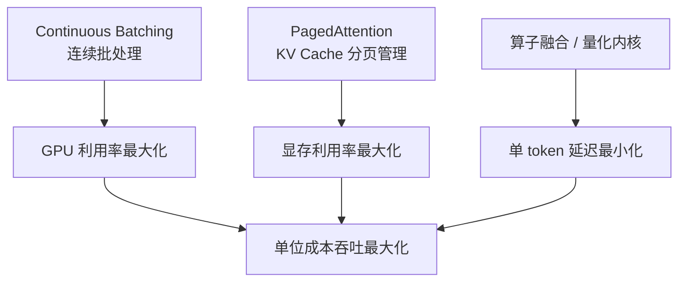
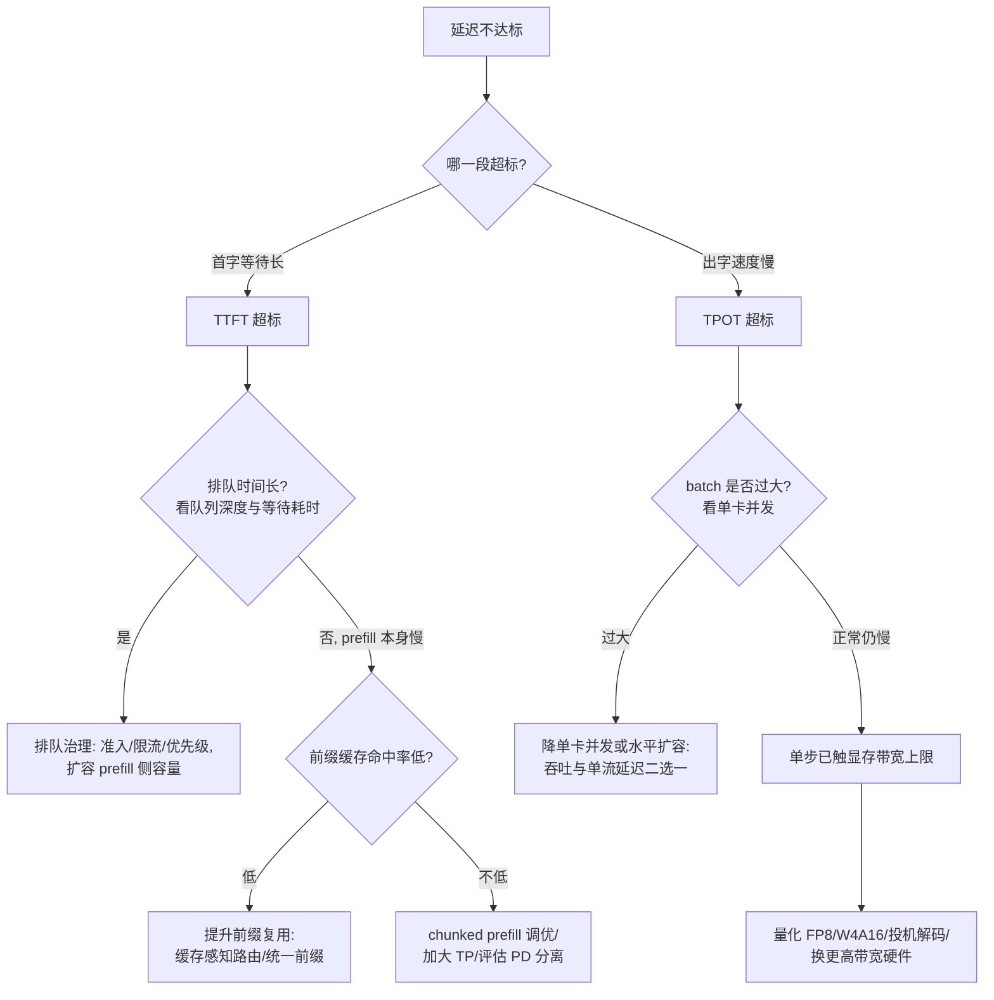
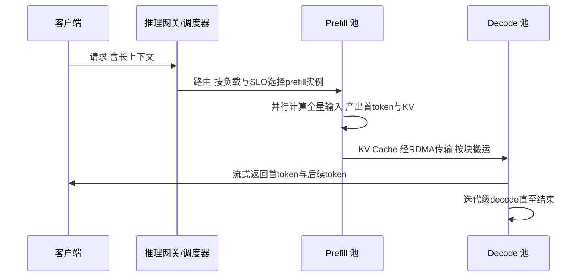
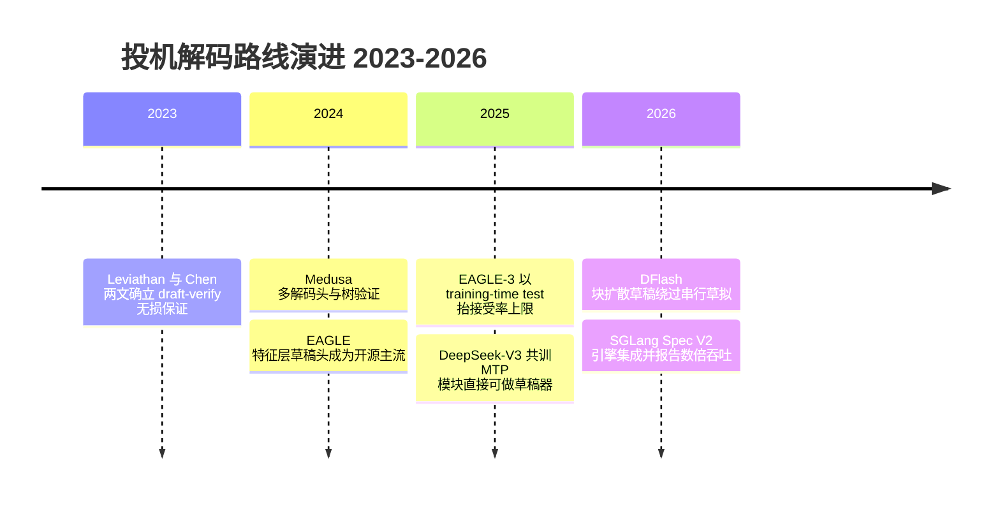
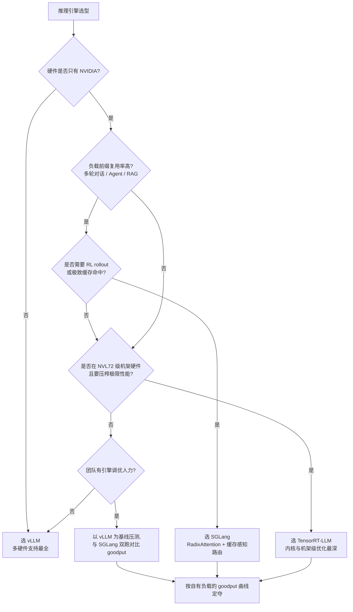
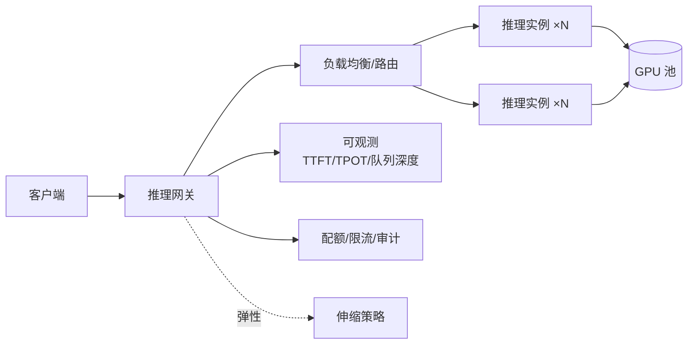

# 大模型推理部署实战

> 大模型落地，推理服务是绕不开的工程核心。这篇面向要把推理服务跑进生产的工程师与架构师，把现代推理引擎逐层拆开讲：**continuous batching 与 PagedAttention 到底优化了什么、前缀缓存如何变成账单上的折扣、投机解码各路线的接受率与适用边界、量化与 KV Cache 压缩的精度账、Prefill/Decode 分离为什么在长上下文时代成为主流**，以及从 Demo 到生产之间隔着哪些坑。全文主线只有一条：在保证延迟 SLO 的前提下，最大化单位显存的有效吞吐（goodput）。以自建推理服务为主线，模型 API（如百炼类服务）的取舍见文末。

## 为什么推理是成本大头

大模型推理的计算特征和传统服务完全不同：

1. **自回归生成**：输出是逐 token 串行的，延迟天然随输出长度线性增长
2. **KV Cache**：每个请求的上下文状态都要常驻显存，一个 70B 模型 + 长上下文请求，KV Cache 可能比权重本身还占地方
3. **显存墙**：推理瓶颈通常不是算力而是**显存容量与带宽**——这也决定了 GPU 选型逻辑（见 [GPU 选型与推理成本测算](/ai/infra/inference/gpu-sizing)）

先把 KV Cache 的账算成公式，后面所有优化都是在改这个公式的某一项。单个请求的 KV Cache 显存占用：

```text
KV 字节数 = 2（K+V 两份） × 层数 × KV 头数 × 每头维度 × 每元素字节数 × 序列长度
```

代入一个 70B 级稠密模型的典型结构（80 层、GQA 8 个 KV 头、头维度 128、FP16 每元素 2 字节）：每 token 的 KV 增量 = 2 × 80 × 8 × 128 × 2 = 320KB。一个 128K 上下文的请求，仅 KV Cache 就约 40GB——超过模型权重摊到单卡的份额。这就是"KV Cache 比权重还占地方"的具体含义，也是后文分页、量化、分离、稀疏化全部优化的出发点。

架构层面的对照更夸张：标准 MHA（多头注意力）每 token 每层要存 2 × 头数 × 头维度 个元素，而 DeepSeek-V2/V3 的 MLA（Multi-head Latent Attention，多头潜在注意力）把 KV 压缩成一个低秩潜向量再加一个解耦的旋转位置键，官方论文口径 KV Cache 节省约 93%——架构设计本身就是第一级的"KV 压缩"（见量化一节的展开）。

由此引出一个反直觉的结论：**推理优化的主线，不是让单次计算更快，而是让一张卡在同一时间服务更多请求**。

把这句话翻译成成本公式，全文的优化就都有了统一的度量衡：

```text
每 token 推理成本 ≈ 单卡时成本 ÷ 单卡 goodput（SLO 内 tokens/s）
```

分子是硬件与运维账（选型决定，见 [GPU 选型与推理成本测算](/ai/infra/inference/gpu-sizing)），分母是本文全部主题——并发效率、缓存命中、量化、分离、投机最终都作用在 goodput 上。任何一项优化的价值，都可以用它把分母抬高了百分之几来衡量；抬不动分母的优化（比如只压低空载单流延迟）在成本账上就是零。定价与成本结构的展开另见 [Token 经济学：定价与成本的数学](/ai/infra/inference/token-economics)。

## 推理引擎内部机制拆解

以 vLLM 为代表的现代推理引擎，本质是把三件事做到极致：



### 请求生命周期：两个阶段的计算画像

一个请求进入引擎后经历两个计算特征完全相反的阶段：

| 阶段 | 做什么 | 计算特征 | 主导资源 |
| --- | --- | --- | --- |
| Prefill（预填充） | 对全部输入 token 做一次并行前向，产出首 token 与全部输入侧 KV Cache | 计算密集：矩阵乘把 GPU 算力吃满，算术强度高 | FLOPs（算力） |
| Decode（解码） | 每步只处理 1 个新 token，但要读取全部权重与历史 KV Cache | 访存密集：每步搬运的字节数远大于计算量，算术强度低 | HBM 带宽与容量 |

引擎主循环因此天然是"迭代级"的：每一步把当前所有活跃请求组成一个 batch 做一次前向——新到的请求做 prefill、活跃请求做一步 decode——采样出 token、写回状态、检查结束条件，然后进入下一步。用伪代码表示（以 vLLM V1 类引擎为原型）：

```text
while serving:
    batch = scheduler.schedule()          # 迭代级组批：
                                          #   新请求取 prefill 份额（chunked prefill 下按 token 预算切）
                                          #   活跃请求各取 1 个 decode 步
    outputs = model_executor.run(batch)   # 一次前向：prefill 与 decode 混跑于同一步
    tokens  = sampler.sample(outputs)     # GPU 上采样，异步回传 CPU
    for req in batch:
        req.append(tokens[req])           # 写回状态 / 追加 KV 块
        if req.finished():                # EOS 或达到 max_tokens
            scheduler.free(req)           # 释放 KV 块与槽位，下一步即可被新请求占用
```

理解了这个循环，下面两个核心优化就是对这个循环的"组批方式"和"显存管理方式"的重写：continuous batching 改写 `schedule()` 的粒度，PagedAttention 改写 `free/append` 背后的显存管理。

### Continuous Batching：从请求级到迭代级调度

传统 static batching（请求级批处理）要等一批请求**都完成**才释放整批：短请求生成完只能空转陪跑长请求，batch 的有效大小随时间单调下降。continuous batching（连续批处理，也称 iteration-level batching，迭代级调度）把组批粒度从"请求"降到"解码步"：**每一步重新组批，完成的请求立刻释放位置，排队的新请求立刻插入**。


*图源：Anyscale 官方博客"How continuous batching enables 23x throughput in LLM inference"（[链接](https://www.anyscale.com/blog/continuous-batching-llm-inference)）。左：static batching，请求结束后槽位空转直到整批完成；右：continuous batching，结束槽位立即被新请求（S5–S8）填上。*

吞吐差异的机制很清楚：static batching 下 GPU 每个 step 实际服务的请求数从 batch 上限一路衰减，等效利用率取决于"批内最长请求"；continuous batching 下 batch 始终维持在并发上限附近，同样的卡数能完成的请求数成倍增加。Anyscale 官方基准里该机制带来最高 20 余倍的吞吐提升（具体倍数强依赖请求长度分布，量级参考即可）。工程上还有两个连带收益：新请求不必等上一批清空，排队延迟下降；batch 组成每步可变，使后文的 chunked prefill（prefill 切片与 decode 混跑）成为可能。

代价也要说清楚：迭代级调度要求每一步都能廉价地重组 batch——KV Cache 必须能按请求独立寻址（这正是 PagedAttention 解决的事），采样与停止判断要在步间异步完成，否则 CPU 侧的组批开销会吃掉收益。

三种组批方式的对照：

| 方式 | 组批粒度 | 请求结束后的槽位 | 新请求进入时机 | 典型问题 |
| --- | --- | --- | --- | --- |
| Static batching | 请求级（整批同生同死） | 空转陪跑至整批结束 | 等整批清空 | 长度方差越大浪费越狠 |
| Continuous batching | 解码步级 | 下一步即被新请求占用 | 任一步插入 | 需要分页 KV 与异步采样支撑 |
| Chunked prefill | 解码步级 + prefill 按 token 预算切片 | 同 continuous | prefill 切片与 decode 混排 | 切片大小需调优：切太碎 prefill 效率降，切太大仍阻塞 decode |

Chunked prefill 是 continuous batching 的自然延伸：长 prefill 不再独占某一步，而是被切成与 decode 步同量级的 token 块混排进每一步，把"一次几百毫秒的算力占用"摊薄成"多步各占一点"。它是中小规模下缓解两阶段干扰的标配手段，也是评估 PD 分离前的前置动作（见 PD 分离一节）。

### PagedAttention：块表、碎片消除与 copy-on-write

vLLM 论文（SOSP 2023）先给问题定了量：传统引擎按"请求最大可能长度"预分配连续 KV 显存，实测**显存浪费达 60–80%**，来自三种碎片：


*图源：vLLM 论文图 3（[arXiv:2309.06180](https://arxiv.org/abs/2309.06180)）。reserved 为预分配未用（内部碎片）、请求间空隙为外部碎片、reserved 槽位永不可用为剩余浪费。*

- **Reserved（预留浪费）**：按 max_tokens 上限预分配，实际生成远短于上限的部分全废
- **Internal fragmentation（内部碎片）**：预分配块尾部用不满的部分
- **External fragmentation（外部碎片）**：连续分配下请求之间长度不齐留下的空洞，无法被新请求使用

PagedAttention 的解法完全借鉴操作系统虚拟内存：KV Cache 切成固定大小的**物理块**（block，vLLM 默认 16 个 token 一块），每请求维护一张**块表**（block table）把逻辑块号映射到物理块号，按需逐块分配：


*图源：vLLM 论文图 5（[arXiv:2309.06180](https://arxiv.org/abs/2309.06180)）。注意力计算通过块表把逻辑上连续的 KV 序列映射到物理上离散的块，query 向量按块寻址读取。*

机制要点：

- **按需分配**：生成一个块才申请一个块，reserved 浪费归零；块内浪费上限只剩"最后一个块用不满"，平均半块
- **非连续存储**：外部碎片归零，显存池化后所有空闲块对任何请求可用
- **块表即间接层**：attention kernel 按块表 gather KV，逻辑连续、物理离散；这个间接层同时是前缀共享、copy-on-write、KV 换入换出的基础
- **块大小的取舍**：块越小内部碎片越少，但块表越长、kernel 寻址开销越大；16 token 是 vLLM 的默认经验值，长上下文大并发场景可测 32/64

**copy-on-write 共享**是分页带来的第二个红利：并行采样、beam search 的多个候选序列共享同一段前缀 KV 时，块表指向同一组物理块并累加引用计数；只有某个候选要继续写入共享块时才复制该块（引用计数 2→1 的分裂点）：


*图源：vLLM 论文图 8（[arXiv:2309.06180](https://arxiv.org/abs/2309.06180)）。两个采样序列 A1/A2 的逻辑块 0/1 指向同一组物理块，写时才复制分裂。*

最终效果是论文与各家复测一致的结论：**显存浪费从 60–80% 降到接近零，同卡并发请求数翻倍级提升**——而并发数正是 decode 吞吐的直接决定因素（更多请求摊薄每步的权重读取成本）。

用第一节的 70B 级模型做个示意测算（块大小 16 token，每块 KV = 16 × 320KB ≈ 5MB）：一张 80GB 卡扣除权重与激活后若剩 40GB 可作 KV 池，可容纳约 8000 个块；按平均 2K 上下文的请求（约 128 块/请求）算，理论并发上限约 60 个请求——分页之前，同样的显存因碎片与预留浪费，实际并发往往只有一半甚至更低。这个"KV 池容量 ÷ 单请求块数"的算法，就是后文容量规划里并发上限核定的一级近似。

池子终有满的时候，抢占（preemption）策略决定谁被牺牲：KV 池耗尽时引擎要么 **swap**（把被抢占请求的 KV 块搬到 CPU 内存，回来时换入），要么 **recompute**（直接丢弃其 KV，调度回来时重算 prefill）。vLLM V1 默认 recompute——因为 swap 的 CPU 搬运在 PCIe 带宽下往往比重算更贵。对运维的含义：抢占发生时被牺牲请求的 TTFT 会二次计账，表现为尾延迟尖刺；监控里要把"抢占次数/被抢占请求占比"与队列深度放在一起看，它比 OOM 更早预警容量不足。

### vLLM V1：当前主流引擎的内部参照

vLLM 自 2025 年起切换到 V1 核心架构，重写了调度器与执行层，把前缀缓存、chunked prefill、投机解码等能力统一到新引擎里：调度器单进程零开销、执行层以 CUDA Graph 与持久化 batch 降低步间开销、前缀缓存默认开启。下面这张官方架构图可以作为理解当前主流推理引擎内部结构的参照：


*vLLM V1 服务器架构：API Server 与引擎核心解耦，调度器逐步骤组批执行。图源：[vLLM 官方博客](https://blog.vllm.ai/2025/01/27/v1-alpha-release.html)。*

读这张图时抓住两个解耦：API Server 与引擎核心解耦，使排队、限流、多进程数据并行可以放在引擎之外横向扩展；调度器与执行器解耦，使"组批决策"（CPU 侧、每步一次）与"kernel 执行"（GPU 侧、CUDA Graph 固化）互不阻塞。其余引擎的同位组件：SGLang 的零开销调度器 + RadixAttention 缓存管理、TensorRT-LLM 的 In-Flight Batching 执行器——名称不同，"迭代级组批 + 分页 KV + 步间异步"三件套是共通的。

## 前缀缓存与 RadixAttention：把重复计算变成账单折扣

### 机制：块级哈希与基数树

多轮对话、RAG、Agent 流量的共同特征是**请求之间共享长前缀**（系统提示词、工具定义、检索到的文档、历史轮次）。前缀缓存（prefix caching / Automatic Prefix Caching）的做法是：把每个 KV 块按"父块哈希 + 本块 token 序列"做链式哈希，新请求的前缀若命中已有哈希链，直接复用物理块、跳过这部分 prefill 计算。vLLM V1 中该能力默认开启；SGLang 则把它做成更显式的数据结构——**RadixAttention**：所有请求的 KV Cache 组织成一棵基数树（radix tree），共享前缀天然是树上的同一路径，配合 LRU 类驱逐策略在显存紧张时淘汰最冷分支：


*图源：SGLang 论文图 3（[arXiv:2312.07104](https://arxiv.org/abs/2312.07104)）。(1)–(9) 展示多轮请求如何在基数树上复用、分叉与按 LRU 驱逐节点。*

两个工程含义：

- **命中率取决于前缀稳定性**：前缀里任何逐请求变化的内容（时间戳、随机 ID、把可变内容放在前面）都会让哈希链从变化点开始全部失效。把稳定的系统提示词与工具定义放在最前、可变内容放在最后，是零成本提升命中率的第一动作
- **缓存要配路由**：多实例部署时，相同前缀的请求若被轮询打散到各实例，每实例都只有零星命中。缓存感知路由（SGLang Router、llm-d 的 EPP、GKE Inference Gateway 等）按前缀哈希把请求导向"已经持有这段 KV"的实例，把命中率从随机水平拉到高水位

前缀布局的对照示例——同样的信息量，命中率天差地别：

```text
反例（命中率趋零）：
  [当前时间: 2026-09-05T10:23:41] [request_id: 8f3a…] [系统提示词……] [工具定义……] [检索文档……]
   ↑ 逐请求变化放在最前，哈希链从第一个块起就全部失效

正例（高命中）：
  [系统提示词……] [工具定义……] [检索文档……] [历史轮次……] [当前时间/用户新输入]
   ↑ 稳定内容前置形成公共前缀，可变内容收在最尾，命中链覆盖到变化点之前
```

命中率的账也值得算一遍：设公共前缀 P token、单请求新增 I token，则命中时的 prefill 计算量从 P+I 降到 I。RAG 场景常见 P 占 90% 以上（系统提示词 + 工具 + 文档），命中即省九成首字计算；多轮对话的 P 随轮次增长，第 N 轮命中可省掉前 N−1 轮的全部重算——这也是多轮 Agent 流量对前缀缓存最敏感的原因。

### Prompt caching 的计费含义

前缀缓存在 MaaS 侧已经直接写进了定价表，这让它从"性能优化"升级为"成本工程"。截至 2026-09 的公开口径：

| 厂商 | 缓存写入 | 缓存读取（命中） | 机制 |
| --- | --- | --- | --- |
| Anthropic | 5 分钟 TTL 按输入价 1.25 倍、1 小时 TTL 按 2 倍计费 | 输入价的 0.1 倍 | 显式断点（cache_control），TTL 可选 |
| OpenAI | 自动缓存、无显式写入费（历史口径） | 新一代模型缓存输入约 1 折（2024 年首发时为 5 折，随模型代际变化） | 自动，前缀需达到最小长度 |
| DeepSeek | 无写入费 | 上下文缓存（含磁盘缓存）自动生效，命中价比未命中低约一个数量级以上；2026-08 起分峰谷计价，以官方定价页为准 | 自动 |

（以上为官方文档口径的量级化转述，具体倍率以各家当期定价页为准。）

这张表对自建与采购都有直接推论：

- **自建侧**：前缀缓存命中率应作为一级监控指标。命中部分的 prefill 计算被跳过，TTFT 与算力成本同时下降；命中率长期走低通常意味着前缀设计或路由有问题，而不是缓存没开
- **采购侧**：缓存命中让"长上下文 + 高复用"负载的 API 单价大幅下降（Anthropic 口径下命中 token 只有 1/10 价）。评估 API 成本时按"命中率 × 折扣"建模，别用全价输入token 乘总量——这也是后文自建 vs API 算账时要加入的新变量
- **TTL 要与对话节奏匹配**：5 分钟 TTL 适合连续多轮交互；间隔更长的会话要么接受重新写入的成本，要么评估 1 小时 TTL 的写入溢价是否被命中次数摊平

## TTFT 与 TPOT：两段延迟的优化杠杆总览

推理服务的"延迟"在生产上要拆成两个指标分别盯——它们由不同阶段决定，优化杠杆完全不同。定义按 NVIDIA 基准测试文档口径：

| 指标 | 定义 | 决定什么 | 主要构成 |
| --- | --- | --- | --- |
| TTFT（Time to First Token） | 从请求发出到第一个输出 token 的耗时 | 等待体感：发出请求后多久开始出字 | 排队等待 + prefill 计算（分离架构下还有 KVCache 传输） |
| TPOT（Time Per Output Token） | 后续每个输出 token 的平均间隔（也称 ITL） | 生成速度：出字流不流畅 | decode 单步耗时，由 batch 大小与显存带宽主导 |

交互场景的经验目标值（业界经验口径，不是硬标准，按业务形态设定）：

- **TTFT 数百毫秒量级**：对话类常以"500ms 以内算响应及时"为门槛（Modular 手册口径），代码补全弹窗类要求更严；超过秒级，用户会明显感到等待
- **TPOT 约 50ms（≈20 tokens/s）**：持续 20 tokens/s 的输出已经超过绝大多数人的阅读速度，再压低 TPOT 在对话界面里用户感知不到（ClickHouse 口径）——省下的预算不如投给吞吐或 TTFT
- 离线批处理没有这类约束，只看总吞吐

在 TTFT/TPOT 之外，容量规划还需要两个系统级指标：

| 指标 | 定义 | 工程含义 |
| --- | --- | --- |
| 吞吐（throughput） | 单位时间完成的 token 数或请求数 | 成本指标：决定每 token 摊到多少卡时 |
| 好吞吐（goodput） | 单位时间内**同时满足 TTFT 与 TPOT SLO** 的请求吞吐（DistServe 提出） | 容量指标：超 SLO 的吞吐是无效吞吐，压测与扩容都应以 goodput 为准 |

goodput 是 DistServe 论文最重要的概念贡献之一：混跑架构下可以把吞吐压得很高，但代价是两端延迟同时超 SLO——那部分吞吐对用户而言等于服务不可用。**用 goodput 而不是 throughput 做容量核定与压测验收**，是我在方案评审里坚持的一条硬规则。

两个阶段的资源画像差异（prefill 计算密集 vs decode 访存密集）与混跑时的互扰机制，下文 PD 分离一节的对照表已有展开，此处不重复，只列各自的杠杆：

| TTFT 杠杆（prefill 侧） | 作用 | 备注 |
| --- | --- | --- |
| 前缀缓存 | 命中部分免重算，直接减少需计算的 prefill 量 | 多轮对话、RAG 命中率高，见上节 |
| chunked prefill 调度 | 切碎长 prefill，避免单次长 prefill 阻塞全局 | 中小规模标配，见上节 |
| 加大 TP | 并行压缩单请求的 prefill 耗时 | 代价是卡数与通信开销 |
| PD 分离 | prefill 池独立扩容、独立优化并行策略 | 适用边界见下节 |
| 排队治理 | 准入、限流、优先级调度，压缩排队等待 | TTFT 含排队时间，先治理再谈扩容 |

| TPOT 杠杆（decode 侧） | 作用 | 备注 |
| --- | --- | --- |
| batch 策略 | 更大并发摊薄每步的权重加载成本 | 与单流延迟互相取舍，按 SLO 定 |
| 显存带宽（选型） | decode 访存密集，HBM 带宽决定单步时延上限 | 选型看带宽而非算力，见 [GPU 选型与推理成本测算](/ai/infra/inference/gpu-sizing) |
| 量化（FP8 / W4A16） | 每步要搬运的字节数变少 | 精度取舍见下文量化节 |
| KV Cache 量化 / MLA | 每步要读的 KV 字节数变少 | 见量化节 KV 部分 |
| 投机解码 | 一次验证产出多个 token，摊薄每 token 成本 | 仅延迟敏感场景有意义，见下文 |
| MoE 稀疏激活 | 每 token 只计算激活参数 | 显存账不减，见下文 MoE 专项 |

延迟不达标时，先诊断是哪一段，再对号选杠杆：



一句经验：TTFT 差，先查排队等待——它最容易被忽略也最便宜；TPOT 差，先确认并发是不是压得太满——混部之下，吞吐与单流延迟本来就是同一份预算的两头。

### SLO 驱动的容量规划

把上面的指标落成容量数字，我的固定动作是四步：

1. **取真实长度分布**：输入/输出 token 的分布（P50/P95/P99）决定一切。用合成等长请求做的压测结论在长尾流量面前全部失效
2. **扫单卡 goodput 曲线**：固定 SLO（如 TTFT P95 ≤ 1s、TPOT P95 ≤ 60ms）， sweeping 并发度，记录 goodput 随并发变化的曲线——曲线拐点就是该实例的工作点
3. **用 KV 容量核并发上限**：并发上限 = 可用 KV 显存 ÷ 单请求平均 KV 占用（用第一节公式按 P95 长度估），与 goodput 拐点取小者
4. **留 headroom 并定扩容信号**：生产工作点取拐点的 70–80%；扩容信号用队列深度与 TTFT P95，不用 GPU 利用率（continuous batching 下它常年打满，无信息量）

这套流程的产出是一张"每卡 goodput × 实例数 × SLO"的对照表，也是后文自建 vs API 算账时自建侧成本曲线的来源。

goodput 曲线长什么样？一个示意形态（数值为说明用虚构样例，形状来自普遍实测经验）：

| 单卡并发 | 吞吐 tokens/s | TTFT P95 | TPOT P95 | goodput（SLO 内） |
| --- | --- | --- | --- | --- |
| 8 | 900 | 0.4s | 38ms | 900（全部达标） |
| 16 | 1500 | 0.7s | 46ms | 1500（全部达标） |
| 24 | 1850 | 1.3s | 52ms | 约 1200（TTFT 开始超 SLO，超出部分不计） |
| 32 | 2000 | 2.6s | 61ms | 约 600（两端同时劣化） |

读法：吞吐在并发 24 之后仍在涨，但 goodput 在 16–24 之间见顶回落——**继续加并发是在生产"不达标的吞吐"**。工作点取拐点附近（此例约 16–20），而不是吞吐最大值处。这张表同时回答了两个常见争论："为什么 GPU 没打满还要扩容"（goodput 已到顶，加并发只加延迟）与"为什么压测吞吐达标线上却超标"（压测报的是 throughput 不是 goodput）。

## Prefill/Decode 分离（PD 分离）

### 为什么两个阶段互相冲突

推理的两个阶段资源画像完全相反，混跑在同一批卡上必然互相干扰：

| | Prefill（预填充） | Decode（解码） |
| --- | --- | --- |
| 计算特征 | 计算密集：一次前向处理全部输入 token，算术强度高 | 访存密集：每步只生成 1 个 token，却要加载全部权重与 KV Cache |
| 主导资源 | FLOPs | HBM 带宽与容量 |
| 对应延迟指标 | TTFT（首 token 延迟） | TPOT（每 token 间隔） |
| 并行偏好 | 更大 TP/CP，压缩单请求耗时 | 更大 batch，吃满带宽 |
| 混跑时的表现 | 一次长上下文 prefill 占用算力几百毫秒，阻塞同批所有请求的解码 | 单步算力需求小但持续占卡，拖慢 prefill 排队 |
| 计算量随输入长度 n 的增长 | 注意力部分 ∝ n²（每个输入 token 两两做注意力），FFN 部分 ∝ n | 每步 ∝ 当前上下文长度（读 KV），步数 ∝ 输出长度 |

最后一行是长上下文时代的关键词：**输入越长，prefill 的计算占比与 KV 产出越大**，混跑时它对 decode 的阻塞越严重，分离的收益也越明显。

DistServe 论文把这个矛盾讲得很透：混跑会把两个阶段的资源分配与并行策略耦合在一起，在严格的延迟要求下，系统要么牺牲其中一端的延迟，要么为两端都过度配置算力。我的体感是，最典型的症状是：**开了 chunked prefill 之后，长上下文流量一来，TPOT 的 P99 仍然锯齿状抖动**——这时就该认真考虑分离了。

### 两个代表方案

**DistServe**（OSDI 2024）是学界方案的起点：把 prefill 与 decode 物理放到不同 GPU 上，按各自的 TTFT/TPOT 约束独立优化资源分配与并行策略，并根据集群带宽放置两个阶段，控制 KV Cache 的跨节点传输开销。它的核心贡献是把优化目标从"吞吐"改成"goodput"——同时满足两端 SLO 的有效吞吐。


*图源：DistServe 论文图 6（[arXiv:2401.09670](https://arxiv.org/abs/2401.09670)）。控制器按 SLO 将请求调度到 prefill 实例池，生成的 KV Cache 经高速互联传输到 decode 实例池继续生成。*

**Mooncake** 是生产验证过的方案——月之暗面（Moonshot AI）Kimi 的服务平台，论文获 USENIX FAST 2025 最佳论文。它的思路更进一步：不仅拆分 prefill/decode 集群，还把集群里未充分利用的 CPU DRAM 与 SSD 资源池化成分离式 KVCache 池（Mooncake Store），调度器以 KVCache 的位置为中心做请求路由，"用存储换计算"。论文报告在真实负载下能多承接 75% 的请求，长上下文模拟场景下吞吐最高提升 525%。


*Mooncake 的 KVCache-centric 分离架构：prefill 与 decode 池分离，KVCache 池由 CPU DRAM/SSD 承接，配合传输引擎在异构资源间搬运。图源：[Mooncake 官方仓库](https://github.com/kvcache-ai/Mooncake)。*

### 分离后一个请求的完整路径

把分离架构下的一次请求画成时序，成本结构一目了然：



KV 传输这笔账要亲自算一遍才敢拆：沿用第一节 70B 级模型（320KB/token），32K 上下文的 KV 约 10GB；在 400Gbps RDMA（有效约 40–50GB/s）上搬完约 200–250ms，200Gbps 互联则翻倍到 400–500ms——而这段是**加在 TTFT 上的串行开销**。对照 prefill 侧：同长度 prefill 在单卡上通常是数百毫秒到秒级，分离把它压缩到几分之一，两相抵才有正收益。这就是"没有 RDMA 级互联不要谈分离"的量化版本；也是 Mooncake 式 KV 池化的动机之一——命中已有前缀时 KV 从池里就近取，传输账可以变成复用账。

### 为什么长上下文时代 PD 分离成为主流

2023–2024 年 PD 分离还是论文里的选项，2025 年之后它成了大厂 serving 的默认架构之一，驱动力有三：

1. **上下文长度上移**：文档问答、Agent 长轨迹把输入推到数万到数十万 token，prefill 的计算量（∝ n²）与 KV 产出同步膨胀，混跑下 decode 被周期性长 prefill 打断，TPOT 尾延迟不可接受
2. **两阶段的硬件偏好分化**：prefill 要算力密度（高 FLOPs 卡、大 TP），decode 要带宽与显存（高 HBM 带宽卡、大 batch），分离后两池可以分别选型、分别伸缩，P:D 配比按负载调
3. **传输与编排基础设施成熟**：RDMA 级互联普及、NIXL 类 KV 传输库与 KV 分层存储（Mooncake Store、NVIDIA Dynamo 的 KV Block Manager）把"跨节点搬 KV"从不可用变成可工程化

生态侧，目前 vLLM（prefill/decode/encode 分离）、SGLang（PD 分离 + 大规模专家并行）、TensorRT-LLM（Disaggregated Serving）都已支持 PD 分离；编排层则收敛到两个开源栈：**NVIDIA Dynamo**（数据面分布式推理框架，提供 KV 感知路由、NIXL 传输、多级 KV Block Manager 与理解分离架构的 Planner 自动伸缩）与 **llm-d**（Red Hat、Google、IBM 等发起的 Kubernetes 原生推理栈，基于 vLLM 与 K8s Gateway API Inference Extension，提供缓存感知路由与分离式 serving 的"well-lit path"）。架构本身不再是门槛，门槛在于值不值得。

### 什么规模才值得拆

我的经验判断：

| 规模 / 负载特征 | 建议 |
| --- | --- |
| 单机几卡、普通对话流量 | 不拆。Chunked Prefill + 前缀缓存足够 |
| 几十卡以上，TTFT 与 TPOT 有双 SLO 硬约束 | 值得评估，先实测 KVCache 传输开销 |
| 长上下文占比高（文档问答、Agent 长轨迹） | 优先考虑。prefill 算力占比大，分离收益最明显 |
| 离线批处理为主 | 不必拆，直接优化吞吐 |

两点必须说清楚：

- **分离不是免费的**：每个请求从 prefill 到 decode 都要跨节点搬运整份 KVCache，没有高速互联（RDMA 级别网络）打底，分离后 TTFT 反而更差。互联与集群网络规划见 [GPU 集群与高速网络](/ai/infra/cluster)
- **P:D 配比由负载决定**：输入长输出短（分类、抽取）偏 prefill 侧，输出长（写作、代码）偏 decode 侧。按真实输入/输出长度分布配比，别简单对半拆卡

P:D 配比有一个可直接套用的算法：统计每请求在两池各占多少"卡秒"，比值即池子规模比。示意（数值为说明用样例）：某负载平均输入 8K/输出 512，prefill 池单请求占 0.5 卡秒（含 TP 摊分），decode 池单卡并发 40、平均生成 8 秒即 0.2 卡秒/请求，则 P:D ≈ 0.5 : 0.2 = 2.5 : 1——prefill 池卡数应是 decode 池的 2.5 倍。换成输出 4K 的写作负载，decode 侧卡秒翻八倍，配比立刻倒向 decode 侧。负载结构一变配比就变，**P:D 是随流量季度级复核的运行参数，不是一次性设计决定**。

## 投机解码：draft-verify 机制与 2025–2026 路线全景



### 原理：一次验证多个 token，数学上无损

自回归解码的瓶颈在访存带宽，而**一次前向验证多个 token 的成本，与生成一个 token 相差不大**（验证时 γ 个候选 token 并行过一遍模型，权重只读一次）。投机解码就是利用这一点：

1. **Draft（草拟）**：用低成本方式快速生成 γ 个候选 token——可以是小参数草稿模型、n-gram 匹配，也可以是模型自带的 MTP 头或特征层草稿头（EAGLE 类）
2. **Verify（验证）**：目标大模型用一次前向并行验证这 γ 个候选
3. **接受/拒绝**：按接受采样规则逐个接受，遇到拒绝则从修正分布重新采样——数学上保证输出分布与直接用大模型生成完全一致，**无损加速**（Leviathan et al. 2023 与 Chen et al. 2023 两篇奠基论文分别给出该保证）

关键指标是**接受率** α（草稿 token 被目标模型接受的比例）。若近似独立同分布，一次验证平均接受的 token 数为 (1 − α^(γ+1)) / (1 − α)：α=0.8、γ=4 时约 3.4 个/步，即单流延迟降至约 1/3；α=0.5 时只有约 1.9 个/步，草稿开销开始不划算。接受率由"草稿器与目标模型的对齐程度 + 输出的可预测性"共同决定，这也是各路线竞争的主战场。

把公式展开成表（γ=4，即每步草拟 4 个候选；数值为公式计算值）：

| 接受率 α | 平均每步接受 token 数 | 单流延迟约为基线的 | 工程读法 |
| --- | --- | --- | --- |
| 0.5 | 1.94 | 1/1.9 | 草稿质量差，扣除草稿开销后收益所剩无几 |
| 0.6 | 2.31 | 1/2.3 | 勉强可用，需草稿器足够便宜 |
| 0.7 | 2.77 | 1/2.8 | 多数 EAGLE 类草稿头在常规对话负载的水位 |
| 0.8 | 3.36 | 1/3.4 | 代码/结构化文本等规律性输出的常见水位 |
| 0.9 | 4.10 | 1/4.1 | 高重复性负载（模板、补全）才能到 |

两点提醒：其一，接受率对**分布漂移**敏感——草稿头是在某批训练数据上对齐的，业务流量换了领域（如从通用对话切到 SQL 生成）α 会整体下移，要按负载分别测；其二，上表是"单流延迟"账，吞吐场景下验证的并行度会被并发挤占，收益另算（见适用边界表）。

验证多个候选时还有一个自由度：**候选不必是一条链，可以是一棵树**。Medusa 提出用 tree attention（树状注意力掩码）在一次前向里并行验证多条候选路径，把"每步接受数"再抬一截：


*图源：Medusa 论文（[arXiv:2401.10774](https://arxiv.org/abs/2401.10774)）tree attention 图。多个解码头给出的候选组成树，一次前向用树状掩码并行验证所有路径。*

### 路线全景：从 n-gram 到共训 MTP 与块扩散草稿

截至 2026-09，主流草稿路线已经迭代了三轮：

| 路线 | 草稿器 | 特点与代表 | 适用 |
| --- | --- | --- | --- |
| n-gram / 检索式 | 无模型：在上下文或历史输出里匹配续写 | 零训练零显存开销；代码、重复性文本接受率高；vLLM/SGLang 均内置 | 输出规律性强的负载，快速起手的基线 |
| 独立小模型 | 同词表的小参数模型 | 经典 draft model；需要维护第二个模型的部署与版本对齐 | 有现成小模型且分布对齐时 |
| Medusa 多头 | 目标模型上加多个解码头，一次前向出多个候选 + 树验证 | 无需独立草稿模型；训练头成本低；树注意力抬接受数 | 中等并发、可接受少量训练投入 |
| EAGLE 系 | 特征层轻量自回归头：在隐状态空间草稿再映射回 token | EAGLE-1/2 以特征外推保持高接受率；成为开源引擎的事实标准草稿器 | 通用主力路线 |
| EAGLE-3 | 同上，但训练时模拟多步草稿采样（training-time test） | 2025-03 论文报告最高 6.5 倍加速、随训练数据量呈 scaling law；vLLM（speculators 库）与 SGLang（SpecForge 训练框架）均已支持 | 愿意为草稿头付一次训练成本的生产服务 |
| MTP 共训投机 | 模型训练时自带的多 token 预测模块直接当草稿器 | DeepSeek-V3 起共训 MTP 模块，官方报告投机下约 1.8 倍解码加速；SGLang 以 EAGLE 式投机实现 MTP，DeepSeek-V3.2 延续该设计 | 用 DeepSeek 系模型的部署，开箱即用 |
| DFlash 块扩散 | 轻量块扩散模型，一次前向并行草拟整块 token | 2026 年新路线：绕过自回归草稿的串行瓶颈；SGLang Spec V2 引擎集成，LMSYS 报告叠加后吞吐超基线 4.3 倍，NVIDIA 报告 Blackwell 高交互区间最高 15 倍 | 2026 年起的新部署评估项 |

EAGLE 系的机制值得多看一眼：它不在 token 空间串行猜词，而是用目标模型的隐状态（特征）作为草稿输入——特征比 token 携带更多信息，一步特征外推就能给出高置信的后续候选：


*图源：EAGLE 论文图 1（[arXiv:2401.15077](https://arxiv.org/abs/2401.15077)）。左：目标模型前向；右：草稿头以隐状态 f 与嵌入 e 的拼接为输入，自回归地外推特征并映射出候选 token 树。*

EAGLE-3 的关键改动在训练侧：训练时不再只监督一步特征预测，而是**模拟推理时的多步草稿-验证过程**（training-time test），让草稿头学会"自己生成的草稿被接下去之后"该怎么继续猜，从而把高接受率维持到更深的草稿步：


*图源：EAGLE-3 论文方法图（[arXiv:2503.01840](https://arxiv.org/abs/2503.01840)）。①③ 为训练时模拟的多轮草稿步，每步以上一轮的采样结果与拼接特征为输入。*

### 适用边界与收益

| 场景 | 收益 | 原因 |
| --- | --- | --- |
| 小并发、延迟敏感的交互服务 | 高，常见 1.5–3 倍 | 解码阶段算力大量闲置，验证不抢资源 |
| 大批量吞吐型场景 | 有限甚至负收益 | 算力开始吃紧，草拟的额外开销挤占有效计算 |
| 输出规律性强（代码、结构化文本） | 偏高 | n-gram 类草稿接受率高 |

实践上我会强调四点：只在延迟敏感场景开启；用真实流量验证接受率与端到端 TPOT，不要信宣传页的数字（接受率要进监控大盘，模型或流量分布漂移时它会悄悄掉）；注意草稿模型/草稿头会额外占显存，需并入 KV 容量核算；吞吐型服务无脑开投机解码，是常见的负优化。

## 量化：最便宜的"扩容"手段

量化通过降低权重/激活的数值精度来省显存、提速度。先给机制，再给取舍表。

### 三条权重量化路线的机制差异

- **AWQ（W4A16）**：观察到激活中存在约 1% 的"显著通道"，对量化误差极度敏感；做法是按激活分布为每通道找保护性缩放因子，再对权重做 4-bit 量化——不需要反向传播，小校准集即可，对离群值多的模型效果稳定
- **GPTQ（W4A16）**：逐层做量化误差补偿（基于 OBQ 的二阶信息，Cholesky 分解更新未量化权重），把本层量化误差"摊"到剩余权重上；校准成本中等，逐层跑一遍校准集
- **GGUF**：严格说是容器格式而非量化算法——llama.cpp 生态的量化方案（k-quants 混合精度：不同层用不同 bit 数）打包为 GGUF 文件，主打 CPU/消费级显卡的本地推理；生产 GPU 服务里更常见的是 AWQ/GPTQ 产物 + 引擎原生加载

三者的共同边界：**W4A16 省的是权重显存与权重读取带宽，激活仍是高精度**——大 batch 下激活与 KV 的搬运占比上升，速度收益打折；4-bit 的精度损失必须用业务评测集回归，通用 benchmark 不掉分不代表你的领域不掉分。

### 主流方案取舍（2026 年现状）

| 方案 | 精度（权重/激活） | 质量损失 | 校准成本 | 硬件支持 | 适用 |
| --- | --- | --- | --- | --- | --- |
| FP16/BF16 | 16 位/16 位 | 基线 | 无 | 全部 | 默认选择 |
| FP8（W8A8） | FP8/FP8 | 很小 | 很小 | Hopper（H100）及以后原生支持 | 新一代 NVIDIA 卡的生产环境 |
| INT8（W8A8） | INT8/INT8 | 小 | 需要校准集 | 广，Ampere 及以后均可 | 通用生产环境 |
| AWQ（W4A16） | INT4/FP16 | 有损，需评测 | 小（激活感知，小校准集） | 广，全部 GPU 可跑 | 资源受限时优先，激活离群值多的模型效果好 |
| GPTQ（W4A16） | INT4/FP16 | 有损，需评测 | 中（逐层校准） | 广，全部 GPU 可跑 | 资源受限、质量可接受时 |
| NVFP4 | FP4/FP4 系 | 有损，需评测 | 小 | Blackwell 及以后原生支持 | 2025 起新硬件上的激进选项 |

### KV Cache 量化与架构级压缩

权重之外，KV Cache 是长上下文场景更大的显存项，两条压缩路线：

- **KV Cache 量化（工程侧）**：vLLM 支持 FP8 KV Cache（`kv_cache_dtype=fp8`），KV 占用直接减半——等价于同卡并发或可用上下文翻倍；vLLM 官方 2026 年的状态总结里，FP8 KV 与 FP8 注意力量化已是生产可用路径，INT8/INT4 KV 仍在推进中。风险点在于长上下文的尾段精度（检索类任务对 KV 精度更敏感），上线前同样要回归
- **MLA 与新一代压缩（架构侧）**：DeepSeek-V2/V3 的 MLA 把每 token 每层的 KV 从 2 × 头数 × 头维度 个元素压成一个 512 维潜向量加 64 维解耦位置键，官方论文口径 KV Cache 节省约 93%，这是"架构即压缩"的代表；2026 年的新一代模型（如 DeepSeek-V4 系）进一步沿 token 轴做稀疏压缩（若干 token 共享一份压缩 KV，见 Together AI 等第三方对公开模型的分析），把百万级上下文的 KV 账继续往下压

实践要点：

- **先评测再上线**：量化后必须在业务评测集上回归测试。通用 benchmark 不掉分 ≠ 你的业务场景不掉分——专业领域（医疗、法律、代码）对量化更敏感
- **70B 级别模型的账**：FP16 需要 4×A100-80G 才能跑，INT8 降到 2 张，INT4 单张可跑——量化直接改变硬件采购方案
- **新硬件优先看 FP8**：原生硬件支持的量化格式，质量/速度平衡通常优于 INT4；Blackwell 上还可以进一步看 NVFP4
- **W4A16 的账要算全**：权重压缩省显存是实打实的，但激活仍是高精度，大 batch 下速度收益会打折，用真实负载验证再拍板
- **权重与 KV 分开决策**：权重量化看精度回归，KV 量化看并发/长度收益与长文质量回归，两者独立开关、独立验收

把 70B 级模型的权重显存账按精度列全（仅权重、不含 KV 与激活，按 1B 参数 ≈ 2GB@FP16 折算）：

| 精度 | 权重显存 | 80GB 卡最少张数（仅权重） | 备注 |
| --- | --- | --- | --- |
| FP16/BF16 | 约 140GB | 2（实际需 4 张留 KV/激活余量） | 基线 |
| FP8 | 约 70GB | 1（实际 2 张） | Hopper 起原生 |
| INT8 | 约 70GB | 1（实际 2 张） | 需校准 |
| INT4（AWQ/GPTQ） | 约 35GB | 1 | 单卡可跑，精度需回归 |

这张表直接改采购方案：同一业务在 INT4 下单卡可服务，在 FP16 下是四卡 TP——量化首先是容量问题，其次才是速度问题。

## 推理引擎对比：vLLM / SGLang / TensorRT-LLM

按各引擎官方仓库与文档核实（2026-09），三个主流引擎的现状：

| | vLLM | SGLang | TensorRT-LLM |
| --- | --- | --- | --- |
| 定位 | 生态最广的通用开源推理引擎，源自 UC Berkeley，社区贡献者 2000+ | 深度面向 Agent/RL 场景的高性能服务框架 | NVIDIA 官方高性能推理库 |
| 核心优势 | PagedAttention 发源地，V1 引擎；模型支持最全（200+ 架构）；量化支持最广（FP8/NVFP4/INT4/GPTQ/AWQ） | RadixAttention 前缀缓存、零开销调度器、缓存感知路由，大规模 PD 分离与专家并行成熟 | 内核级深度优化，In-Flight Batching，Disaggregated Serving，Blackwell NVL72 专项调优（DWDP、稀疏注意力） |
| 投机解码 | n-gram / EAGLE / EAGLE-3 / MTP / DFlash 接入中 | EAGLE / EAGLE-3 / MTP / DFlash / Spec V2 引擎 | N-Gram、MTP 等 |
| 硬件 | NVIDIA / AMD / Intel / TPU / 昇腾等 | NVIDIA（至 GB200/B300）/ AMD MI300/MI355 / TPU / 昇腾 | 仅 NVIDIA |
| 适用场景 | 通用首选，多硬件、多模型、求稳 | 前缀复用高（多轮对话、Agent）、延迟苛刻、RL 后训练 | 单一 NVIDIA 硬件、追求极致性能 |

架构层面的差异决定了"同样的优化在三个引擎里长什么样"：

| 维度 | vLLM | SGLang | TensorRT-LLM |
| --- | --- | --- | --- |
| 调度 | V1 单进程调度器，零开销组批，chunked prefill 默认 | 零开销调度器 + 面向结构化程序的前端运行时 | In-Flight Batching：请求在飞行中加入/退出批 |
| KV 管理 | PagedAttention + 块哈希前缀缓存（APC 默认开启） | RadixAttention 基数树 + LRU 驱逐 | 分页 KV + 引擎内 cache 管理 |
| 前缀复用路由 | 依赖外部路由器（production-stack / llm-d） | 内置 Router 的缓存感知路由 | 依赖外部编排 |
| 分离式 serving | prefill/decode/encode 分离，NIXL 类传输接入 | PD 分离 + 大规模专家并行成熟 | Disaggregated Serving |
| 扩展生态 | 模型架构接入最快，新模型 day-0 支持多 | RL rollout 后端事实标准（verl、slime 等对接） | 与 NVIDIA 硬件特性绑定最深 |

几个一线观点：

- **不知道选什么就选 vLLM**。模型支持与社区生态最广，踩过的坑都有人趟过，我通常拿它当评测基线
- **Agent 负载认真考虑 SGLang**。多轮 Agent 流量的前缀复用率极高，RadixAttention 与缓存感知路由能直接把命中率换成成本优势；它也是 RL 后训练 rollout 后端的事实标准之一（verl、slime 等主流框架均对接），官方称已在 40 万+ GPU 上运行
- **只有 NVIDIA 卡且要压榨极限性能，看 TensorRT-LLM**。尤其在 NVL72 这类机架级新硬件上，NVIDIA 自家的内核与并行优化最深；代价是绑定 NVIDIA 生态，上手与运维成本相对高
- 引擎迭代极快，**超过半年的 benchmark 数字不可信**，选型前务必用自己的负载重测

### 上线前要过一遍的关键参数（以 vLLM 类引擎为例）

选型之后是调参。下面这张表是我评审部署方案时的固定检查单（参数名以引擎当期版本文档为准，含义跨引擎通用）：

| 参数 | 作用 | 工程含义与常见误用 |
| --- | --- | --- |
| gpu-memory-utilization | 划给权重+KV 池的显存比例（默认约 0.9） | 调高换并发，但要给激活与通信缓冲留余量；与容器 memory limit 一起核 |
| max-model-len | 上下文上限 | 直接决定 KV 池能容纳的并发（第一节公式）；按业务 P99 长度设，不要照抄模型标称窗口 |
| max-num-seqs | 单实例并发上限 | goodput 拐点的工作点旋钮；设太大 TPOT 尾延迟劣化 |
| enable-prefix-caching | 前缀缓存开关 | V1 默认开启；关掉要有理由（如完全无复用的负载） |
| kv-cache-dtype | KV 精度（fp16/fp8） | FP8 KV 换一倍并发，先做长文回归 |
| enable-chunked-prefill | prefill 切片混跑 | 长输入负载的 TPOT 尾延迟开关 |
| speculative-config / num-speculative-tokens | 投机解码与草稿长度 | 仅延迟敏感低并发开；γ 不是越大越好，按接受率曲线定 |
| tensor/pipeline/expert-parallel-size | TP/PP/EP 规模 | prefill 偏 TP、decode 偏 batch/EP；MoE 模型的 EP 规模先算 all-to-all 通信账 |
| 调度与优先级参数 | FCFS/优先级、抢占策略 | 多租户与混合负载下决定谁先被牺牲 |

误用最多的是前三个：把 max-model-len 设成模型标称最大窗口（128K/1M），KV 池被极少数长请求占满，常规并发被挤到个位数——**上下文上限是容量参数，不是能力声明**。

选型决策树（按我评审方案时的提问顺序）：



## MoE 模型推理专项

前沿开源模型（以 DeepSeek-V3/R1 为代表）普遍采用 MoE（Mixture of Experts，混合专家）架构。稀疏激活换来了效率，也把推理的显存账与通信账整个改写——稠密模型的经验在这里会失效。

### 显存与带宽账：算得少、放得多、搬得多

- **每 token 计算量 ≈ 激活参数**：路由器每个 token 只选少数专家。以 DeepSeek-V3 为例，总参数 671B、每 token 仅激活 37B（官方技术报告口径），单 token 算力需求只相当于一个数百亿级稠密模型
- **显存占用 ≈ 总参数**：所有专家的权重都必须常驻才能被路由到，一个都省不掉
- **搬运量也按总参数计**：decode 时每步要把被激活专家的权重从显存加载进计算单元，命中的虽是部分专家，权重池的底盘仍是全量模型

与稠密模型的直觉对照：**稠密模型是"算多少放多少"，MoE 是"算一小部分、放全部、搬一大半"**。由此带来两个直接后果：一是不能用激活参数估卡数，显存必须按总参数估（见 [GPU 选型与推理成本测算](/ai/infra/inference/gpu-sizing)）；二是 decode 依旧访存密集，MoE 省的是算力，不是带宽。

### 专家并行（EP）serving

专家在多卡间怎么放，是 MoE 部署的第一决策：

- **专家放置**：把专家分散到不同 GPU，每卡只存一部分专家权重。EP 规模越大，每卡专家越少——NVIDIA Wide-EP 的实践里，DeepSeek-R1 的 256 个路由专家放到 64 卡上，每层每卡仅 4 个专家，权重加载压力与 GroupGEMM 计算效率都随之改善
- **每步两次 all-to-all**：每个 MoE 层，先按路由结果把 token 隐状态分发到目标专家所在卡（dispatch），算完再把结果收集合并回来（combine）。decode 本就访存紧张，all-to-all 很容易放大延迟，跨节点的大规模 EP 往往得不偿失

把 all-to-all 的通信账算成量级（示意估算）：每层每步的 dispatch+combine 流量 ≈ 2 × batch × hidden × 每元素字节 × (EP−1)/EP。取 DeepSeek-V3 级 hidden 7168、BF16、decode batch 256、EP64：单层单步约 7MB，乘以数十个 MoE 层后单步约数百 MB；在 NVLink 级域内带宽（单卡数百 GB/s 量级）下是毫秒级、可接受，一旦换成跨节点百 GB/s 级网络就变成每步数毫秒到十几毫秒的硬开销——与 decode 单步本身同量级。**这就是"EP 规模押在互联带宽上"的量化版本**：先有域内高带宽，再谈宽 EP。
- **热门专家热点**：路由并不均匀，被高频命中的"热门专家"若恰好集中在同一张卡，该卡过载而其余卡空转。TensorRT-LLM 用 EPLB（Expert Parallel Load Balancer）在卡间重新分布冷热专家，支持按历史分布预计算的静态模式与运行时动态调整的在线模式


*EPLB 的冷热专家再均衡：均衡前热门专家集中在个别 GPU 上造成过载，在线再均衡后各卡负载恢复平均。图源：[NVIDIA Wide-EP 博客](https://developer.nvidia.com/blog/scaling-large-moe-models-with-wide-expert-parallelism-on-nvl72-rack-scale-systems/)。*

- **专家 offloading**：显存装不下全部专家时，把热门专家留在 GPU、冷门专家下沉到 CPU 内存乃至磁盘，命中冷专家时再换入——用延迟换显存。KTransformers 是这条路线的代表，官方称单张 24GB 消费级显卡加大容量内存即可运行 DeepSeek-R1/V3 级模型。**适用边界要说清楚**：它适合离线、低并发、成本敏感的场景；高并发交互流量下冷专家的换入延迟藏不住，生产上要慎重

### 为什么超大 MoE 与 NVL72 类大域硬件契合

EP 的收益随域内卡数增多而放大，all-to-all 流量也同步放大——两头都押在互联带宽上。GB200 NVL72 把 72 个 GPU 放进一个一致的 NVLink 域，聚合带宽 130TB/s（NVIDIA 口径），单个域即可容纳超大模型的全部或大部分专家，token 分发与结果收集都在域内完成；同样的 EP 规模出了域、走集群网络，代价完全不同。NVIDIA 的实测（DeepSeek-R1，用户侧 100 tokens/s 口径）：EP32 相比 EP8，每 GPU 输出吞吐最高提升 1.8 倍。这与训练侧"域越大，EP 可铺开的专家数越多"的判断互为印证（见 [训练工程](/ai/infra/training)）；域与 scale-up / scale-out 网络的规划，见 [GPU 集群与高速网络](/ai/infra/cluster)。

### MoE 部署要点

| 维度 | 要点 |
| --- | --- |
| 显存估算 | 按总参数估显存（专家须全量常驻），按激活参数估算力需求 |
| 并行策略 | 专家数多的大模型优先评估（宽）EP；专家数少的小 MoE 收益有限，通信开销可能反噬 |
| 互联 | 每层两次 all-to-all，规模化依赖高带宽域（NVLink 级）；跨机柜做 EP 先算通信账 |
| 负载均衡 | 监控各卡专家负载，用 EPLB 类机制再均衡热门专家 |
| 显存不足 | 优先量化（专家权重是量化大头），再评估专家 offloading；交互流量慎用 |
| 与 PD 分离组合 | 仍然适用：prefill 偏算力，decode 偏带宽与路由通信，两池可独立优化 |

## 长上下文、稀疏注意力与多模态推理

### 长上下文：四个随长度恶化的账

上下文从 8K 走到 128K 乃至百万级，恶化的是四本账：prefill 计算（注意力部分 ∝ n²）、KV 显存（∝ n）、decode 每步读 KV 的带宽（∝ n）、以及前缀缓存的命中粒度（前缀越长越难完全命中）。先看 KV 这本账的量级（按公开结构参数估算）：

| 模型形态 | 每 token KV 增量 | 32K 上下文 | 128K 上下文 |
| --- | --- | --- | --- |
| 70B 级稠密 GQA（80 层 / 8 KV 头 / 头维 128 / FP16） | 约 320KB | 约 10GB | 约 40GB |
| 同结构 + FP8 KV Cache | 约 160KB | 约 5GB | 约 20GB |
| DeepSeek-V3 级 MLA（61 层 / 576 维潜向量+位置键 / FP16） | 约 70KB | 约 2.2GB | 约 9GB |

读法：同一个 128K 请求，稠密 GQA 的 KV 能在单卡上吃掉半张卡的容量，MLA 架构则把它压到十分之一上下——**长上下文可行性首先由 KV 架构决定，其次才由优化手段决定**。对策按性价比排序：

1. **chunked prefill + 前缀缓存**：中小规模的第一道防线，把长 prefill 切碎与 decode 混跑、命中部分免算
2. **KV 分层与压缩**：FP8 KV、MLA、KV 池下沉到 CPU DRAM/SSD（Mooncake Store、Dynamo KVBM 类）——把"显存装不下"变成"带宽换容量"
3. **PD 分离**：长 prefill 与长 decode 各归其池，互不阻塞（见前文）
4. **稀疏注意力**：从算法上把 decode 注意力的成本与上下文长度解耦

### 稀疏注意力（DSA）的推理侧支持

DeepSeek-V3.2-Exp（2025-09 发布）引入 DSA（DeepSeek Sparse Attention，细粒度稀疏注意力）：先用一个轻量的 lightning indexer 对全部历史 token 打分，再按分数细粒度地选出 top-k token 参与注意力计算——decode 每一步的注意力成本从 O(n) 降到 O(k)，k 与上下文长度脱钩。indexer 的设计要点是"便宜且可错"：它本身是一个极小的打分网络（相对主模型可忽略的开销），只做粗排选候选，选错的代价由主模型注意力在 top-k 内消化；配合 MLA 的低秩潜向量，打分可以在压缩表示上完成，进一步压低 indexer 自身的读写量。vLLM 在发布当日即给出 day-0 支持（官方博客详述了稀疏 kernel 与分页 KV 的结合工程），2025-12 的 DeepSeek-V3.2 正式版延续该设计。对部署者的含义很直接：**长上下文模型的"上下文窗口"第一次不再线性绑定 decode 成本**，但前提是引擎与 kernel 跟得上——选型时要把"目标模型是否稀疏注意力、引擎是否支持"列入检查项。

### 多模态推理的差异（简述）

多模态请求在文本推理之上多了两件事：视觉/音频编码器（ViT 类）的 encode 计算，以及视觉 token 对上下文的膨胀（一张高分辨率图可折算数千 token，直接进第一节的 KV 公式）。视觉 token 的预算感要先建立起来（量级示意，随模型切片策略差异很大）：

| 输入形态 | 折算视觉 token 量级 | 直接进入的账 |
| --- | --- | --- |
| 低分辨率缩略图 | 数百 | KV 与 prefill 增量小，细节信息也少 |
| 单张高分辨率文档截图 | 数千 | 单图即可占满短上下文预算的一半 |
| 多图工单/试卷（5–10 张） | 数万 | 长上下文四本账全部激活，需 DSA/MLA 类支撑 |

工程差异有三：encode 是纯计算密集阶段，可与 prefill/decode 一起拆成 **EPD 三段分离**（NVIDIA Dynamo 生态已有 Encode-Prefill-Decode 的实践）；相同图片/文档的 encode 结果适合做对象级缓存（比 KV 缓存更靠前的一层复用）；视觉 token 的分辨率档位是显存与质量的直接旋钮，按业务设上限。多模态应用侧的设计另见 [多模态大模型](/ai/application/multimodal)。

## 生产部署架构与 MaaS 模式

一个能扛住生产的推理服务，远不止"起一个 vLLM 进程"：



关键工程点：

1. **双延迟指标**：TTFT（首 token 延迟，决定体感）与 TPOT（每 token 间隔，决定生成速度）必须分开监控、分开优化。长输出场景要关注的是整体吞吐而不是单请求延迟
2. **队列与背压**：推理是慢服务，网关必须管理队列深度与超时，否则雪崩会以"请求堆积→显存爆→实例重启"的形式发生
3. **优雅发布**：模型切换是分钟级事件（权重加载慢），用双实例组 + 流量切换，不要原地重启
4. **多模型路由**：按任务复杂度路由到不同规格模型（小模型兜底、大模型攻坚）是当前性价比最高的架构手段之一，展开见下节
5. **流式输出是默认形态，不是可选项**：SSE/WebSocket 流式返回把"用户等待整段结果"变成"等待首 token"，TTFT 的体感收益直接来自这里；但流式长连接把网关变成了状态持有者——连接数、半开连接清理、客户端断连后的生成取消（及时释放 KV 与槽位）都要显式设计，否则断连请求会继续烧 GPU
6. **token 级审计与计费埋点**：输入/输出/缓存命中 token 数在网关层记录最全，事后从引擎日志补算成本高且口径易乱；这一步同时是内部成本分摊与对账的数据源

可观测指标清单（每项都标了"看它是为了回答什么问题"）：

| 指标 | 回答什么问题 | 常见坑 |
| --- | --- | --- |
| TTFT P50/P95/P99（含网关排队） | 用户等多久才见第一个字 | 只埋引擎内部耗时，漏掉网关与排队段，指标好看体感差 |
| TPOT / ITL P95 | 出字流不流畅 | 与端到端延迟混用；长输出要看全程均值而非首段 |
| 队列深度与等待耗时 | 该不该扩容、准入阈值设在哪 | 无显式队列时该指标缺失，过载只能靠超时发现 |
| 前缀缓存命中率 | 前缀设计与路由做对了吗 | 不区分"未开启"与"开启但没命中"两种零命中 |
| KV 池占用率 / 块压力 | 离 OOM 与准入拒绝还有多远 | 只看均值不看 P99，长请求尖峰打爆显存 |
| GPU SM 利用率 / HBM 带宽利用率 | 当前是算力受限还是带宽受限 | 把"利用率打满"当扩容信号——continuous batching 下它常年打满 |
| 投机解码接受率 | 投机还值不值得开 | 上线时测一次就再也不看，分布漂移后负优化 |
| 单请求 token 成本（含缓存命中） | 账单对不对得上、路由省没省钱 | 漏记缓存命中 token，成本口径与厂商账单对不齐 |

### 多模型路由与推理网关

一旦生产环境里有多个模型、多组实例，路由层的决策质量直接决定成本：

| 路由策略 | 逻辑 | 典型场景 |
| --- | --- | --- |
| 任务复杂度分级 | 分类器或规则前置，小模型处理简单问题，大模型攻坚 | 通用对话入口，降本最直接 |
| 级联路由 | 小模型先答，置信度不足再升级到大模型 | 质量要求高但多数请求简单的场景 |
| 延迟分级 | 交互流量走低延迟实例，离线任务走高吞吐实例 | 在线离线混部 |
| 前缀/缓存感知路由 | 相同前缀的请求路由到同一实例，提高 KVCache 命中率 | 多轮对话、RAG；SGLang Router、llm-d EPP 即此类 |
| 成本优先 | 在满足质量门槛的模型中选最便宜的 | 大量低复杂度调用 |

网关层的模式已经收敛为几件事：

- **统一 API（OpenAI 兼容）**：上层业务只面对一套接口，引擎与模型的替换对业务透明，否则每次换模型都是一个项目
- **队列、限流、配额与审计**：标配能力，审计要记录输入/输出 token，作为内部结算与成本分摊的依据
- **降级与兜底**：主模型不可用或排队超阈值时自动切到备用模型或小模型，有答案比没有答案好
- **可观测**：除了 TTFT/TPOT/队列深度，还要看前缀缓存命中率与单请求 token 成本——前者决定路由是否做对了，后者决定账单能否对得上

### MaaS 推理服务的公开架构模式

观察各家云厂商与开源社区 2025–2026 年的公开实践（NVIDIA Dynamo、llm-d、K8s Gateway API Inference Extension、GKE Inference Gateway、AWS 的 llm-d 方案等），MaaS 推理底座的模式已经收敛为四层：

| 层 | 职责 | 代表组件 |
| --- | --- | --- |
| 接入层 | 统一 OpenAI 兼容 API、认证、配额、审计 | 推理网关 / API Gateway |
| 路由层 | 模型路由 + 实例级智能路由（队列深度、KV 命中感知） | Gateway API Inference Extension 的 InferencePool/EPP、llm-d Router、Dynamo Smart Router |
| 服务层 | 引擎实例池，可分离式（P/D/EPD）、可宽 EP | vLLM / SGLang / TensorRT-LLM 实例 |
| 状态层 | KV Cache 多级池化与跨节点传输 | Mooncake Store、Dynamo KVBM + NIXL、LMCache 类 |

其中**路由层从"轮询负载均衡"进化为"推理感知调度"**是最值得注意的变化：InferencePool/EPP 这类标准把"队列深度、前缀哈希、SLO 预测"变成了 L7 网关的一等路由依据——传统微服务网关的那套 round-robin 在推理负载下会系统性打散前缀缓存、忽视队列积压，是明确的反模式。自建多实例服务时，即使不引入完整开源栈，也应在自研网关里实现前缀亲和与队列感知这两个最小能力。

### 系统设计题的打法

"设计一个能扛 10 倍突发流量的推理服务"是面试与方案评审的高频题，我的答法按三层展开：

**第一层：队列与背压，把过载显性化。** 突发到来时请求进显式队列并返回预计等待，而不是硬塞进实例；队列水位到阈值就快速拒绝——快失败优于慢失败。并发上限按显存与 KV Cache 容量核定，不按 CPU。队列与背压的机制前文已讲，答题的关键是把它画成显式组件、给出准入阈值，并说明阈值的来源。

**第二层：扩容信号看队列与延迟，不看 GPU 利用率。** 推理实例在 continuous batching 下 GPU 利用率常年接近打满，这个指标既不能预警过载，也不指示还有余量；有效的扩容信号是队列深度与 TTFT（含排队时间）的 P95。且扩容是分钟级动作（权重加载慢），触发必须留出提前量，目标是把 TTFT 拉回 SLO 之内。

**第三层：降级与弹性。** 降级方向前文网关一节已列（切备用/小模型），突发场景还要补两件事：一是面向用户的排队提示与预期管理；二是可预测的活动流量提前预热容量（预加载权重），不可预测的突发靠云上弹性 GPU 承接——镜像与权重预制好，接受分钟级冷启动，并为冷启动预留准入缓冲。

**长时任务要另起一套调度。** 视频生成、长推理这类分钟到小时级的任务，不能与交互流量共用一套 serving 模型：

| 要点 | 做法 |
| --- | --- |
| 队列隔离 | 异步任务队列与交互服务分池，避免长任务占卡挤掉实时流量 |
| 状态检查点 | 中间状态定期落对象存储，失败后从检查点续跑而不是从头再来 |
| 失败重试 | 有限次数 + 指数退避；反复失败的任务进死信队列人工处理 |
| 超时取舍 | 超时定短了浪费已投入的算力，定长了占着卡不放；按任务价值分级设置超时与独占资源 |
| 结果交付 | 产物存对象存储，回调或轮询交付，GPU 实例不承担长连接推送 |

这套表不只适用于视频生成——凡是"GPU 上跑得久、中间状态有价值"的离线生成任务，调度骨架都一样。

## 自建推理 vs 模型 API

这是每个项目第一个要回答的问题，判断框架：

| 决策因素 | 倾向模型 API | 倾向自建 |
| --- | --- | --- |
| 调用量 | 中小、波动大 | 大且持续（自建成本曲线会交叉） |
| 数据合规 | 可出域或厂商可信 | 必须留在自己环境内 |
| 模型选择 | 通用能力够用 | 需要私有微调模型/开源特定模型 |
| 团队能力 | 无推理运维人力 | 有 GPU 运维与调优能力 |
| 延迟要求 | 公网延迟可接受 | 需要内网级低延迟 |
| 前缀复用率 | 高（API 侧 prompt caching 折扣能吃满） | 低（缓存折扣用不上，自建吞吐优化更值） |

实践中最常见的演进路径：**先用 API 验证业务价值，调用量上来之后再算账决定是否自建**——跳过验证阶段直接建推理集群，是典型的过度设计。算账时记得把前缀缓存折扣纳入 API 侧单价（命中率高时 API 的有效输入单价可低一个数量级），也要把自建侧的 goodput 曲线、运维人力与闲置率算全。

交叉点的算法（示意口径）：自建月成本 = 卡数 × 单卡月摊成本（折旧+电费+运维人力摊分）÷ 平均利用率；API 月成本 = Σ 各模型调用 token × 有效单价（含缓存折扣）。两者相等处即交叉调用量。经验上交叉点常落在"单业务月调用量进入十亿 token 量级、且负载稳定到能把利用率压过五成"之后——波动大的负载即使总量过线，自建池的闲置期也会把均成本抬回 API 之上，这时混合形态（基线自建 + 峰值溢出 API）往往优于二选一。推理侧决策的全景另见 [推理与算力](/ai/infra/inference/)。

## 常见坑清单

| 坑 | 现象 | 对策 |
| --- | --- | --- |
| 上下文长度没规划 | 长请求把显存挤爆 | 网关层限制最大 token + 监控上下文分布 |
| 只压测短请求 | 生产长请求一来就超时 | 用真实长度分布压测 |
| max_tokens 不设上限 | 单个请求无限生成 | 服务端强制上限 |
| 忽略并发下的排队延迟 | P99 离奇恶化 | 监控队列等待时间，扩容看队列不看 GPU 利用率 |
| 驱动/框架版本漂移 | 升级后性能突变 | 镜像化固定版本组合，升级走完整评测 |
| PD 分离没测传输带宽 | 分离后 TTFT 反而变差 | 高速互联是前提，先实测 KVCache 搬运开销 |
| 盲目开启投机解码 | 吞吐不升反降 | 仅延迟敏感低并发场景开启，用真实流量验证 |
| 前缀里放可变内容 | 前缀缓存命中率接近零 | 稳定内容前置、可变内容后置；命中率进监控 |
| 多实例轮询打散前缀 | 每实例命中率都低 | 缓存感知路由 / 前缀亲和 |
| KV 量化不回归长文任务 | 长文档问答质量悄悄退化 | KV 量化单独做长上下文评测集回归 |
| P:D 配比拍脑袋对半 | 一端排队一端空转 | 按真实输入/输出长度分布核定配比 |
| 缓存 TTL 与对话节奏错配 | 写入费付了、命中没几次 | 按轮次间隔选 TTL，算写入溢价回本次数 |
| 用 throughput 而非 goodput 验收 | 压测达标、线上 SLO 超标 | 压测与扩容一律以 SLO 内好吞吐为准 |

## 术语速查

| 术语 | 一句话解释 |
| --- | --- |
| Prefill / Decode | 推理两阶段：并行处理全部输入 vs 逐 token 自回归生成 |
| KV Cache | 注意力机制的历史键值缓存，decode 每步必读的显存大头 |
| Continuous Batching | 迭代级动态组批，请求随完随走、随到随进 |
| Chunked Prefill | 长 prefill 切片与 decode 混跑，平滑两阶段互扰 |
| PagedAttention | KV Cache 分页管理：块表映射 + 按需分配 + copy-on-write 共享 |
| Prefix Caching / RadixAttention | 前缀 KV 复用：块哈希链（vLLM）/ 基数树（SGLang） |
| TTFT / TPOT | 首 token 延迟 / 每输出 token 间隔，两段延迟分开盯 |
| Goodput | 同时满足 TTFT 与 TPOT SLO 的有效吞吐 |
| PD 分离 | Prefill 与 Decode 分池部署，KV 经高速互联搬运 |
| 投机解码 | 小草稿器猜、大模型并行验证，数学上无损加速 |
| 接受率 | 草稿 token 被目标模型接受的比例，投机收益的第一变量 |
| MTP | 多 token 预测：训练时共训的额外预测头，可直接做草稿器 |
| W8A8 / W4A16 | 权重/激活精度组合：8 位全量化 vs 4 位权重+16 位激活 |
| KV Cache 量化 | 把 KV 存成 FP8 等低精度，容量翻倍、需长文回归 |
| MLA | 多头潜在注意力：KV 压成低秩潜向量，架构级 KV 压缩 |
| DSA | DeepSeek 稀疏注意力：indexer 选 top-k token 参与注意力，decode 成本与上下文解耦 |
| EP / EPLB | 专家并行 / 专家负载均衡：MoE 专家跨卡放置与冷热再均衡 |
| EPD 分离 | Encode-Prefill-Decode 三段分离，多模态推理的 PD 延伸 |
| InferencePool / EPP | K8s Gateway API 推理扩展的 CRD 与端点选择器，推理感知路由标准 |
| NIXL | NVIDIA Inference Xfer Library：跨 worker 与内存层级的 KV/数据传输库，分离式 serving 的数据面 |
| Swap / Recompute | KV 池抢占两策略：KV 搬 CPU 待换入 vs 丢弃后重算 prefill |

## 小结

推理部署的工程主线只有一条：**在保证质量与延迟 SLA 的前提下，最大化单位显存的有效吞吐（goodput）**。Continuous Batching 与 PagedAttention 解决"并发效率"，前缀缓存与缓存感知路由解决"重复计算"，量化与 KV 压缩解决"单位成本"，PD 分离解决"阶段干扰"，投机解码解决"单流延迟"，稀疏注意力解决"长上下文解码成本"，网关、路由与可观测解决"生产可靠性"——这些都做到位，自建推理才谈得上比 API 划算。引擎选型上，以 vLLM 为基线，Agent 与 RL 场景评估 SGLang，NVIDIA 单一硬件追求极致性能看 TensorRT-LLM，定夺前用自己的负载重测。

最后给一张"症状 → 章节"的索引，方便线上出问题时直接翻：首字慢查第四节杠杆表与第三节命中率；出字卡顿查第二节并发与第七节量化；尾延迟锯齿查第五节分离判断；单流延迟敏感查第六节投机；显存不够查第一节公式与第七节 KV 压缩；账单对不上查第三节计费表与第十一节审计埋点；MoE 负载的一切异常先查第九节的显存账与通信账。

## 参考资料

<Refs>

**原始论文**

- [vLLM 论文：Efficient Memory Management for Large Language Model Serving with PagedAttention](https://arxiv.org/abs/2309.06180) — PagedAttention 块表、碎片消除与 copy-on-write 的原始设计（访问日期 2026-09-05）
- [SGLang 论文：Efficient Execution of Structured Language Model Programs](https://arxiv.org/abs/2312.07104) — RadixAttention 基数树与 LRU 驱逐（访问日期 2026-09-05）
- [DistServe 论文：Disaggregating Prefill and Decoding for Goodput-optimized Large Language Model Serving](https://arxiv.org/abs/2401.09670) — PD 分离与 goodput 概念的起点（OSDI 2024）（访问日期 2026-09-05）
- [Mooncake 论文：A KVCache-centric Disaggregated Architecture for LLM Serving](https://arxiv.org/abs/2407.00079) — USENIX FAST 2025 最佳论文，KVCache 池化分离架构（访问日期 2026-09-05）
- [投机解码奠基论文：Fast Inference from Transformers via Speculative Decoding](https://arxiv.org/abs/2211.17192) — draft-verify 与无损接受采样的原始证明（访问日期 2026-09-05）
- [Medusa 论文：Simple LLM Inference Acceleration Framework with Multiple Decoding Heads](https://arxiv.org/abs/2401.10774) — 多解码头与 tree attention 验证（访问日期 2026-09-05）
- [EAGLE 论文：Speculative Sampling Requires Rethinking Feature Uncertainty](https://arxiv.org/abs/2401.15077) — 特征层草稿头路线（访问日期 2026-09-05）
- [EAGLE-3 论文：Scaling up Inference Acceleration of Large Language Models via Training-Time Test](https://arxiv.org/abs/2503.01840) — training-time test 与草稿 scaling law（访问日期 2026-09-05）
- [DFlash 论文：Block Diffusion for Flash Speculative Decoding](https://arxiv.org/abs/2602.06036) — 块扩散草稿器，2026 年新路线（访问日期 2026-09-05）
- [GPTQ 论文](https://arxiv.org/abs/2210.17323) · [AWQ 论文](https://arxiv.org/abs/2306.00978) — W4A16 两条主流量化路线（访问日期 2026-09-05）
- [DeepSeek-V2 论文](https://arxiv.org/abs/2405.04434) — MLA 将 KV Cache 压缩约 93% 的架构设计（访问日期 2026-09-05）
- [DeepSeek-V3 Technical Report](https://arxiv.org/abs/2412.19437) — 671B 总参数、每 token 激活 37B、共训 MTP 模块（访问日期 2026-09-05）

**官方博客与文档**

- [vLLM 官方文档](https://docs.vllm.ai/)（访问日期 2026-09-05）
- [vLLM 文档：Quantized KV Cache](https://docs.vllm.ai/en/latest/features/quantization/quantized_kvcache/) — FP8 KV Cache 的官方配置与边界（访问日期 2026-09-05）
- [vLLM 官方博客：V1 - A Major Upgrade to vLLM's Core Architecture](https://blog.vllm.ai/2025/01/27/v1-alpha-release.html)（访问日期 2026-09-05）
- [vLLM 官方博客：DeepSeek-V3.2-Exp in vLLM: Fine-Grained Sparse Attention in Action](https://vllm.ai/blog/2025-09-29-deepseek-v3-2) — DSA 稀疏注意力的 day-0 工程支持（访问日期 2026-09-05）
- [Anyscale 官方博客：How continuous batching enables 23x throughput in LLM inference](https://www.anyscale.com/blog/continuous-batching-llm-inference) — static vs continuous batching 时序与基准（访问日期 2026-09-05）
- [LMSYS 官方博客：SGLang 发布文](https://lmsys.org/blog/2024-01-17-sglang/) — RadixAttention 与前缀共享的实践数据（访问日期 2026-09-05）
- [LMSYS 官方博客：The next generation of speculative decoding: DFlash and Spec V2](https://www.lmsys.org/blog/2026-06-15-next-generation-speculative-decoding-dflash-v2/) — DFlash 与 SGLang Spec V2 引擎（访问日期 2026-09-05）
- [SGLang 官方仓库](https://github.com/sgl-project/sglang) · [SpecForge：投机解码草稿训练框架](https://github.com/sgl-project/SpecForge)（访问日期 2026-09-05）
- [vLLM speculators 库：草稿模型训练与部署](https://github.com/vllm-project/speculators)（访问日期 2026-09-05）
- [TensorRT-LLM 官方仓库](https://github.com/NVIDIA/TensorRT-LLM)（访问日期 2026-09-05）
- [Mooncake 官方仓库（kvcache-ai）](https://github.com/kvcache-ai/Mooncake)（访问日期 2026-09-05）
- [NVIDIA Dynamo 官方仓库](https://github.com/ai-dynamo/dynamo) — 数据面分布式推理框架：分离式 serving、NIXL、KV Block Manager、Planner（访问日期 2026-09-05）
- [llm-d 社区发布文](https://llm-d.ai/blog/llm-d-announce) — Kubernetes 原生分布式推理栈（访问日期 2026-09-05）
- [Kubernetes Gateway API Inference Extension 官方文档](https://gateway-api-inference-extension.sigs.k8s.io/) — InferencePool/EPP 推理感知路由标准（访问日期 2026-09-05）
- [NVIDIA 博客：Scaling Large MoE Models with Wide Expert Parallelism on NVL72 Rack Scale Systems](https://developer.nvidia.com/blog/scaling-large-moe-models-with-wide-expert-parallelism-on-nvl72-rack-scale-systems/) — Wide-EP 与 EPLB 再均衡（访问日期 2026-09-05）
- [NVIDIA NIM LLMs Benchmarking：Metrics（TTFT / TPOT 指标定义）](https://docs.nvidia.com/nim/benchmarking/llm/latest/metrics.html)（访问日期 2026-09-05）
- [Anthropic 官方文档：Prompt caching](https://platform.claude.com/docs/en/build-with-claude/prompt-caching) — 缓存写入 1.25x/2x、读取 0.1x 的计费口径（访问日期 2026-09-05）
- [OpenAI 官方文档：Prompt caching](https://developers.openai.com/api/docs/guides/prompt-caching) — 自动缓存与缓存输入折扣口径（访问日期 2026-09-05）
- [DeepSeek 官方文档：Context Caching](https://api-docs.deepseek.com/guides/kv_cache/) — 磁盘上下文缓存机制（访问日期 2026-09-05）
- [DeepSeek 官方公告：Introducing DeepSeek-V3.2-Exp](https://api-docs.deepseek.com/news/news250929) — DSA 与 MTP 投机的官方说明（访问日期 2026-09-05）
- [Modular Handbook：Key metrics for LLM inference](https://handbook.modular.com/llm-inference-basics/llm-inference-metrics/) — 对话类 TTFT 500ms 以内的体验口径（访问日期 2026-09-05）
- [ClickHouse：LLM inference latency](https://clickhouse.com/resources/engineering/llm-inference-latency) — 20 tokens/s 超过人类阅读速度的口径（访问日期 2026-09-05）
- [KTransformers 官方仓库（CPU/GPU 混合 MoE 推理、专家 offloading）](https://github.com/kvcache-ai/ktransformers)（访问日期 2026-09-05）

**图片来源**

- `vllm-v1-architecture.png`：[vLLM 官方博客 V1 发布文](https://blog.vllm.ai/2025/01/27/v1-alpha-release.html)
- `continuous-batching-timeline.png`：[Anyscale 官方博客 continuous batching 一文](https://www.anyscale.com/blog/continuous-batching-llm-inference)
- `pagedattention-kv-fragmentation.png` / `pagedattention-block-table.png` / `pagedattention-copy-on-write.png`：vLLM 论文图 3 / 图 5 / 图 8（[arXiv:2309.06180](https://arxiv.org/abs/2309.06180)，自论文 PDF 裁剪）
- `radix-attention-lru.png`：SGLang 论文图 3（[arXiv:2312.07104](https://arxiv.org/abs/2312.07104)，自论文 PDF 裁剪）
- `distserve-architecture.png`：DistServe 论文图 6（[arXiv:2401.09670](https://arxiv.org/abs/2401.09670)，自论文 PDF 裁剪）
- `speculative-tree-attention.png`：Medusa 论文 tree attention 图（[arXiv:2401.10774](https://arxiv.org/abs/2401.10774)）
- `eagle-draft-head.png`：EAGLE 论文图 1（[arXiv:2401.15077](https://arxiv.org/abs/2401.15077)）
- `eagle3-training-time-test.png`：EAGLE-3 论文方法图（[arXiv:2503.01840](https://arxiv.org/abs/2503.01840)）
- `mooncake-architecture.png`：[Mooncake 官方仓库](https://github.com/kvcache-ai/Mooncake)
- `moe-eplb-expert-balancing.gif`：[NVIDIA Wide-EP 博客](https://developer.nvidia.com/blog/scaling-large-moe-models-with-wide-expert-parallelism-on-nvl72-rack-scale-systems/)
- （访问日期 2026-09-05）

**站内相关**

- 站内相关：[GPU 选型与推理成本测算](/ai/infra/inference/gpu-sizing) · [Token 经济学：定价与成本的数学](/ai/infra/inference/token-economics) · [推理与算力](/ai/infra/inference/) · [GPU 集群与高速网络](/ai/infra/cluster) · [训练工程](/ai/infra/training) · [企业级 RAG 架构设计](/ai/application/rag-architecture) · [多模态大模型](/ai/application/multimodal)

</Refs>

