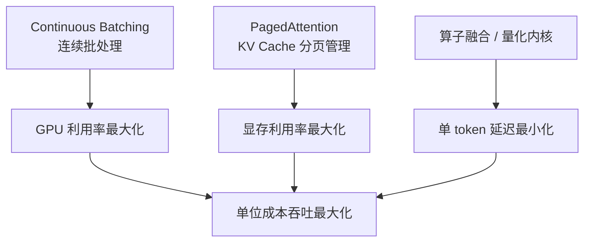
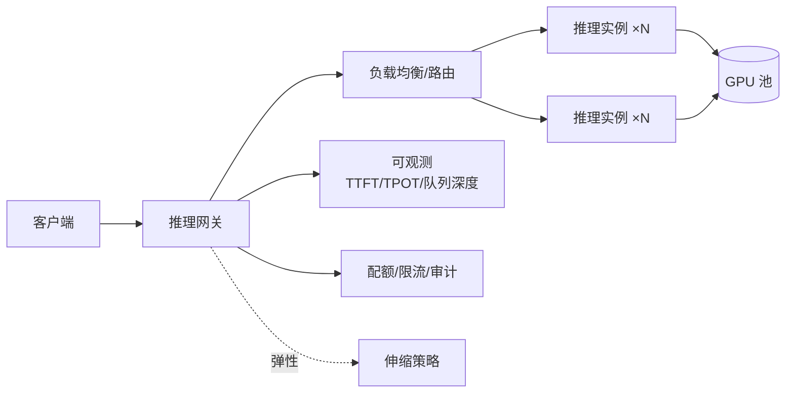

# 大模型推理部署实战

> 大模型落地，推理服务是绕不开的工程核心。这篇沉淀的是生产环境的实战认知：推理的成本结构长什么样、vLLM 类框架到底优化了什么、prefill/decode 分离与投机解码带来的新变量、量化与推理引擎怎么选，以及从 Demo 到生产之间隔着哪些坑。以自建推理服务为主线，模型 API（如百炼类服务）的取舍见文末。

## 为什么推理是成本大头

大模型推理的计算特征和传统服务完全不同：

1. **自回归生成**：输出是逐 token 串行的，延迟天然随输出长度线性增长
2. **KV Cache**：每个请求的上下文状态都要常驻显存，一个 70B 模型 + 长上下文请求，KV Cache 可能比权重本身还占地方
3. **显存墙**：推理瓶颈通常不是算力而是**显存容量与带宽**——这也决定了 GPU 选型逻辑（见 [GPU 选型与推理成本测算](/ai/infra/inference/gpu-sizing)）

由此引出一个反直觉的结论：**推理优化的主线，不是让单次计算更快，而是让一张卡在同一时间服务更多请求**。

## 推理框架的核心武器

以 vLLM 为代表的现代推理框架，本质是把三件事做到极致：

### Continuous Batching（连续批处理）

传统批处理要等一批请求都完成才处理下一批——短请求被迫陪跑长请求。连续批处理在每个解码步动态组批：**完成的请求立刻释放位置，新请求立刻插入**。仅此一项，吞吐通常提升数倍。

### PagedAttention（KV Cache 分页）

借鉴操作系统虚拟内存思想：KV Cache 不再按请求最大长度预分配（浪费严重），而是按块（block）动态分配。效果是**显存浪费从 60-80% 降到接近零**，同一张卡能容纳的并发请求数直接翻倍级提升。

vLLM 自 2025 年起切换到 V1 核心架构，重写了调度器与执行层，把前缀缓存、chunked prefill、投机解码等能力统一到新引擎里。下面这张官方架构图可以作为理解当前主流推理引擎内部结构的参照：

*vLLM V1 服务器架构：API Server 与引擎核心解耦，调度器逐步骤组批执行。图源：[vLLM 官方博客](https://blog.vllm.ai/2025/01/27/v1-alpha-release.html)。*

### 其他值得了解的优化

- **Prefix Caching**：相同系统提示词/知识库前缀的请求共享 KV Cache，多轮对话与 RAG 场景命中率很高
- **Chunked Prefill**：把长上下文的预填充切碎与解码混跑，平滑首字延迟与吞吐的冲突。它是中小规模下缓解两阶段干扰的标配手段，也是评估 PD 分离前的前置动作（见下节）

## Prefill/Decode 分离（PD 分离）

### 为什么两个阶段互相冲突

推理的两个阶段资源画像完全相反，混跑在同一批卡上必然互相干扰：

| | Prefill（预填充） | Decode（解码） |
| --- | --- | --- |
| 计算特征 | 计算密集：一次前向处理全部输入 token，算术强度高 | 访存密集：每步只生成 1 个 token，却要加载全部权重与 KV Cache |
| 主导资源 | FLOPs | HBM 带宽与容量 |
| 对应延迟指标 | TTFT（首 token 延迟） | TPOT（每 token 间隔） |
| 并行偏好 | 更大 TP/CP，压缩单请求耗时 | 更大 batch，吃满带宽 |
| 混跑时的表现 | 一次长上下文 prefill 占用算力几百毫秒，阻塞同批所有请求的解码 | 单步算力需求小但持续占卡，拖慢 prefill 排队 |

DistServe 论文把这个矛盾讲得很透：混跑会把两个阶段的资源分配与并行策略耦合在一起，在严格的延迟要求下，系统要么牺牲其中一端的延迟，要么为两端都过度配置算力。我的体感是，最典型的症状是：**开了 chunked prefill 之后，长上下文流量一来，TPOT 的 P99 仍然锯齿状抖动**——这时就该认真考虑分离了。

### 两个代表方案

**DistServe**（OSDI 2024）是学界方案的起点：把 prefill 与 decode 物理放到不同 GPU 上，按各自的 TTFT/TPOT 约束独立优化资源分配与并行策略，并根据集群带宽放置两个阶段，控制 KV Cache 的跨节点传输开销。它的核心贡献是把优化目标从"吞吐"改成"goodput"——同时满足两端 SLO 的有效吞吐。

**Mooncake** 是生产验证过的方案——月之暗面（Moonshot AI）Kimi 的服务平台，论文获 USENIX FAST 2025 最佳论文。它的思路更进一步：不仅拆分 prefill/decode 集群，还把集群里未充分利用的 CPU DRAM 与 SSD 资源池化成分离式 KVCache 池（Mooncake Store），调度器以 KVCache 的位置为中心做请求路由，"用存储换计算"。论文报告在真实负载下能多承接 75% 的请求，长上下文模拟场景下吞吐最高提升 525%。

*Mooncake 的 KVCache-centric 分离架构：prefill 与 decode 池分离，KVCache 池由 CPU DRAM/SSD 承接，配合传输引擎在异构资源间搬运。图源：[Mooncake 官方仓库](https://github.com/kvcache-ai/Mooncake)。*

目前 vLLM（prefill/decode/encode 分离）、SGLang（PD 分离 + 大规模专家并行）、TensorRT-LLM（Disaggregated Serving）都已支持 PD 分离，架构本身不再是门槛，门槛在于值不值得。

### 什么规模才值得拆

我的经验判断：

| 规模 / 负载特征 | 建议 |
| --- | --- |
| 单机几卡、普通对话流量 | 不拆。Chunked Prefill + 前缀缓存足够 |
| 几十卡以上，TTFT 与 TPOT 有双 SLO 硬约束 | 值得评估，先实测 KVCache 传输开销 |
| 长上下文占比高（文档问答、Agent 长轨迹） | 优先考虑。prefill 算力占比大，分离收益最明显 |
| 离线批处理为主 | 不必拆，直接优化吞吐 |

两点必须说清楚：

- **分离不是免费的**：每个请求从 prefill 到 decode 都要跨节点搬运整份 KVCache，没有高速互联（RDMA 级别网络）打底，分离后 TTFT 反而更差。互联与集群网络规划见 [GPU 集群与高速网络](/ai/infra/cluster)
- **P:D 配比由负载决定**：输入长输出短（分类、抽取）偏 prefill 侧，输出长（写作、代码）偏 decode 侧。按真实输入/输出长度分布配比，别简单对半拆卡

## 投机解码

### 原理：小模型猜，大模型验证

自回归解码的瓶颈在访存带宽，而**一次前向验证多个 token 的成本，与生成一个 token 相差不大**。投机解码就是利用这一点：

1. **Draft（草拟）**：用低成本方式快速生成 γ 个候选 token——可以是小参数草稿模型、n-gram 匹配，也可以是模型自带的 MTP 头或特征层草稿头（EAGLE 类）
2. **Verify（验证）**：目标大模型用一次前向并行验证这 γ 个候选
3. **接受/拒绝**：按接受采样规则逐个接受，遇到拒绝则从修正分布重新采样——数学上保证输出分布与直接用大模型生成完全一致，**无损加速**

关键指标是接受率：接受率高，一次大模型前向就能吐出多个 token；接受率低，草稿的开销就是纯浪费。EAGLE 把草稿做成特征层的轻量头，是当前主流方向，vLLM 与 SGLang 均已支持，SGLang 还在 2026 年推出了下一代实现（DFlash 与 Spec V2）。

### 适用边界与收益

| 场景 | 收益 | 原因 |
| --- | --- | --- |
| 小并发、延迟敏感的交互服务 | 高，常见 1.5–3 倍 | 解码阶段算力大量闲置，验证不抢资源 |
| 大批量吞吐型场景 | 有限甚至负收益 | 算力开始吃紧，草拟的额外开销挤占有效计算 |
| 输出规律性强（代码、结构化文本） | 偏高 | n-gram 类草稿接受率高 |

实践上我会强调三点：只在延迟敏感场景开启；用真实流量验证接受率与端到端 TPOT，不要信宣传页的数字；注意草稿模型/草稿头会额外占显存。吞吐型服务无脑开投机解码，是常见的负优化。

## 量化：最便宜的"扩容"手段

量化通过降低权重/激活的数值精度来省显存、提速度。主流方案的取舍（2026 年现状）：

| 方案 | 精度（权重/激活） | 质量损失 | 校准成本 | 硬件支持 | 适用 |
| --- | --- | --- | --- | --- | --- |
| FP16/BF16 | 16 位/16 位 | 基线 | 无 | 全部 | 默认选择 |
| FP8（W8A8） | FP8/FP8 | 很小 | 很小 | Hopper（H100）及以后原生支持 | 新一代 NVIDIA 卡的生产环境 |
| INT8（W8A8） | INT8/INT8 | 小 | 需要校准集 | 广，Ampere 及以后均可 | 通用生产环境 |
| AWQ（W4A16） | INT4/FP16 | 有损，需评测 | 小（激活感知，小校准集） | 广，全部 GPU 可跑 | 资源受限时优先，激活离群值多的模型效果好 |
| GPTQ（W4A16） | INT4/FP16 | 有损，需评测 | 中（逐层校准） | 广，全部 GPU 可跑 | 资源受限、质量可接受时 |

实践要点：

- **先评测再上线**：量化后必须在业务评测集上回归测试。通用 benchmark 不掉分 ≠ 你的业务场景不掉分——专业领域（医疗、法律、代码）对量化更敏感
- **70B 级别模型的账**：FP16 需要 4×A100-80G 才能跑，INT8 降到 2 张，INT4 单张可跑——量化直接改变硬件采购方案
- **新硬件优先看 FP8**：原生硬件支持的量化格式，质量/速度平衡通常优于 INT4；Blackwell 上还可以进一步看 NVFP4
- **W4A16 的账要算全**：权重压缩省显存是实打实的，但激活仍是高精度，大 batch 下速度收益会打折，用真实负载验证再拍板

## 推理引擎对比：vLLM / SGLang / TensorRT-LLM

按各引擎官方仓库与文档核实（2026-09），三个主流引擎的现状：

| | vLLM | SGLang | TensorRT-LLM |
| --- | --- | --- | --- |
| 定位 | 生态最广的通用开源推理引擎，源自 UC Berkeley，社区贡献者 2000+ | 深度面向 Agent/RL 场景的高性能服务框架 | NVIDIA 官方高性能推理库 |
| 核心优势 | PagedAttention 发源地，V1 引擎；模型支持最全（200+ 架构）；量化支持最广（FP8/NVFP4/INT4/GPTQ/AWQ） | RadixAttention 前缀缓存、零开销调度器、缓存感知路由，大规模 PD 分离与专家并行成熟 | 内核级深度优化，In-Flight Batching，Disaggregated Serving，Blackwell NVL72 专项调优（DWDP、稀疏注意力） |
| 投机解码 | n-gram / EAGLE / DFlash | EAGLE / DFlash / Spec V2 | N-Gram、MTP 等 |
| 硬件 | NVIDIA / AMD / Intel / TPU / 昇腾等 | NVIDIA（至 GB200/B300）/ AMD MI300/MI355 / TPU / 昇腾 | 仅 NVIDIA |
| 适用场景 | 通用首选，多硬件、多模型、求稳 | 前缀复用高（多轮对话、Agent）、延迟苛刻、RL 后训练 | 单一 NVIDIA 硬件、追求极致性能 |

几个一线观点：

- **不知道选什么就选 vLLM**。模型支持与社区生态最广，踩过的坑都有人趟过，我通常拿它当评测基线
- **Agent 负载认真考虑 SGLang**。多轮 Agent 流量的前缀复用率极高，RadixAttention 与缓存感知路由能直接把命中率换成成本优势；它也是 RL 后训练 rollout 后端的事实标准之一（verl、slime 等主流框架均对接），官方称已在 40 万+ GPU 上运行
- **只有 NVIDIA 卡且要压榨极限性能，看 TensorRT-LLM**。尤其在 NVL72 这类机架级新硬件上，NVIDIA 自家的内核与并行优化最深；代价是绑定 NVIDIA 生态，上手与运维成本相对高
- 引擎迭代极快，**超过半年的 benchmark 数字不可信**，选型前务必用自己的负载重测

## 生产部署架构

一个能扛住生产的推理服务，远不止"起一个 vLLM 进程"：

关键工程点：

1. **双延迟指标**：TTFT（首 token 延迟，决定体感）与 TPOT（每 token 间隔，决定生成速度）必须分开监控、分开优化。长输出场景要关注的是整体吞吐而不是单请求延迟
2. **队列与背压**：推理是慢服务，网关必须管理队列深度与超时，否则雪崩会以"请求堆积→显存爆→实例重启"的形式发生
3. **优雅发布**：模型切换是分钟级事件（权重加载慢），用双实例组 + 流量切换，不要原地重启
4. **多模型路由**：按任务复杂度路由到不同规格模型（小模型兜底、大模型攻坚）是当前性价比最高的架构手段之一，展开见下节

### 多模型路由与推理网关

一旦生产环境里有多个模型、多组实例，路由层的决策质量直接决定成本：

| 路由策略 | 逻辑 | 典型场景 |
| --- | --- | --- |
| 任务复杂度分级 | 分类器或规则前置，小模型处理简单问题，大模型攻坚 | 通用对话入口，降本最直接 |
| 级联路由 | 小模型先答，置信度不足再升级到大模型 | 质量要求高但多数请求简单的场景 |
| 延迟分级 | 交互流量走低延迟实例，离线任务走高吞吐实例 | 在线离线混部 |
| 前缀/缓存感知路由 | 相同前缀的请求路由到同一实例，提高 KVCache 命中率 | 多轮对话、RAG；SGLang Router 即此类 |
| 成本优先 | 在满足质量门槛的模型中选最便宜的 | 大量低复杂度调用 |

网关层的模式已经收敛为几件事：

- **统一 API（OpenAI 兼容）**：上层业务只面对一套接口，引擎与模型的替换对业务透明，否则每次换模型都是一个项目
- **队列、限流、配额与审计**：标配能力，审计要记录输入/输出 token，作为内部结算与成本分摊的依据
- **降级与兜底**：主模型不可用或排队超阈值时自动切到备用模型或小模型，有答案比没有答案好
- **可观测**：除了 TTFT/TPOT/队列深度，还要看前缀缓存命中率与单请求 token 成本——前者决定路由是否做对了，后者决定账单能否对得上

## 自建推理 vs 模型 API

这是每个项目第一个要回答的问题，判断框架：

| 决策因素 | 倾向模型 API | 倾向自建 |
| --- | --- | --- |
| 调用量 | 中小、波动大 | 大且持续（自建成本曲线会交叉） |
| 数据合规 | 可出域或厂商可信 | 必须留在自己环境内 |
| 模型选择 | 通用能力够用 | 需要私有微调模型/开源特定模型 |
| 团队能力 | 无推理运维人力 | 有 GPU 运维与调优能力 |
| 延迟要求 | 公网延迟可接受 | 需要内网级低延迟 |

实践中最常见的演进路径：**先用 API 验证业务价值，调用量上来之后再算账决定是否自建**——跳过验证阶段直接建推理集群，是典型的过度设计。推理侧决策的全景另见 [推理与算力](/ai/infra/inference/)。

## 常见坑清单

| 坑 | 现象 | 对策 |
| --- | --- | --- |
| 上下文长度没规划 | 长请求把显存挤爆 | 网关层限制最大 token + 监控上下文分布 |
| 只压测短请求 | 生产长请求一来就超时 | 用真实长度分布压测 |
| max_tokens 不设上限 | 单个请求无限生成 | 服务端强制上限 |
| 忽略并发下的排队延迟 | P99 离奇恶化 | 监控队列等待时间，扩容看队列不看 GPU 利用率 |
| 驱动/框架版本漂移 | 升级后性能突变 | 镜像化固定版本组合，升级走完整评测 |
| PD 分离没测传输带宽 | 分离后 TTFT 反而变差 | 高速互联是前提，先实测 KVCache 搬运开销 |
| 盲目开启投机解码 | 吞吐不升反降 | 仅延迟敏感低并发场景开启，用真实流量验证 |

## 小结

推理部署的工程主线只有一条：**在保证质量与延迟 SLA 的前提下，最大化单位显存的吞吐**。Continuous Batching 与 PagedAttention 解决"并发效率"，量化解决"单位成本"，PD 分离解决"阶段干扰"，投机解码解决"单流延迟"，网关、路由与可观测解决"生产可靠性"——这些都做到位，自建推理才谈得上比 API 划算。引擎选型上，以 vLLM 为基线，Agent 与 RL 场景评估 SGLang，NVIDIA 单一硬件追求极致性能看 TensorRT-LLM，定夺前用自己的负载重测。

## 参考资料

<Refs>

- [vLLM 论文：Efficient Memory Management for Large Language Model Serving with PagedAttention](https://arxiv.org/abs/2309.06180)（访问日期 2026-09-04）
- [vLLM 官方文档](https://docs.vllm.ai/)（访问日期 2026-09-04）
- [vLLM 官方博客：V1 - A Major Upgrade to vLLM's Core Architecture](https://blog.vllm.ai/2025/01/27/v1-alpha-release.html)（访问日期 2026-09-04）
- [SGLang 论文：Efficient Execution of Structured Language Model Programs](https://arxiv.org/abs/2312.07104)（访问日期 2026-09-04）
- [SGLang 官方仓库](https://github.com/sgl-project/sglang)（访问日期 2026-09-04）
- [TensorRT-LLM 官方仓库](https://github.com/NVIDIA/TensorRT-LLM)（访问日期 2026-09-04）
- [Mooncake 论文：A KVCache-centric Disaggregated Architecture for LLM Serving（USENIX FAST 2025 最佳论文）](https://arxiv.org/abs/2407.00079)（访问日期 2026-09-04）
- [Mooncake 官方仓库（kvcache-ai）](https://github.com/kvcache-ai/Mooncake)（访问日期 2026-09-04）
- [DistServe 论文：Disaggregating Prefill and Decoding for Goodput-optimized LLM Serving](https://arxiv.org/abs/2401.09670)（访问日期 2026-09-04）
- [EAGLE 论文：Speculative Sampling Requires Rethinking Feature Uncertainty](https://arxiv.org/abs/2401.15077)（访问日期 2026-09-04）
- [GPTQ 论文](https://arxiv.org/abs/2210.17323) · [AWQ 论文](https://arxiv.org/abs/2306.00978)（访问日期 2026-09-04）
- 图片来源：vLLM V1 架构图取自 [vLLM 官方博客](https://blog.vllm.ai/2025/01/27/v1-alpha-release.html)，Mooncake 架构图取自 [Mooncake 官方仓库](https://github.com/kvcache-ai/Mooncake)（访问日期 2026-09-04）
- 站内相关：[GPU 选型与推理成本测算](/ai/infra/inference/gpu-sizing) · [推理与算力](/ai/infra/inference/) · [GPU 集群与高速网络](/ai/infra/cluster) · [企业级 RAG 架构设计](/ai/application/rag-architecture)

</Refs>
