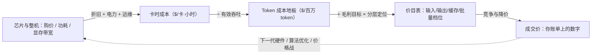
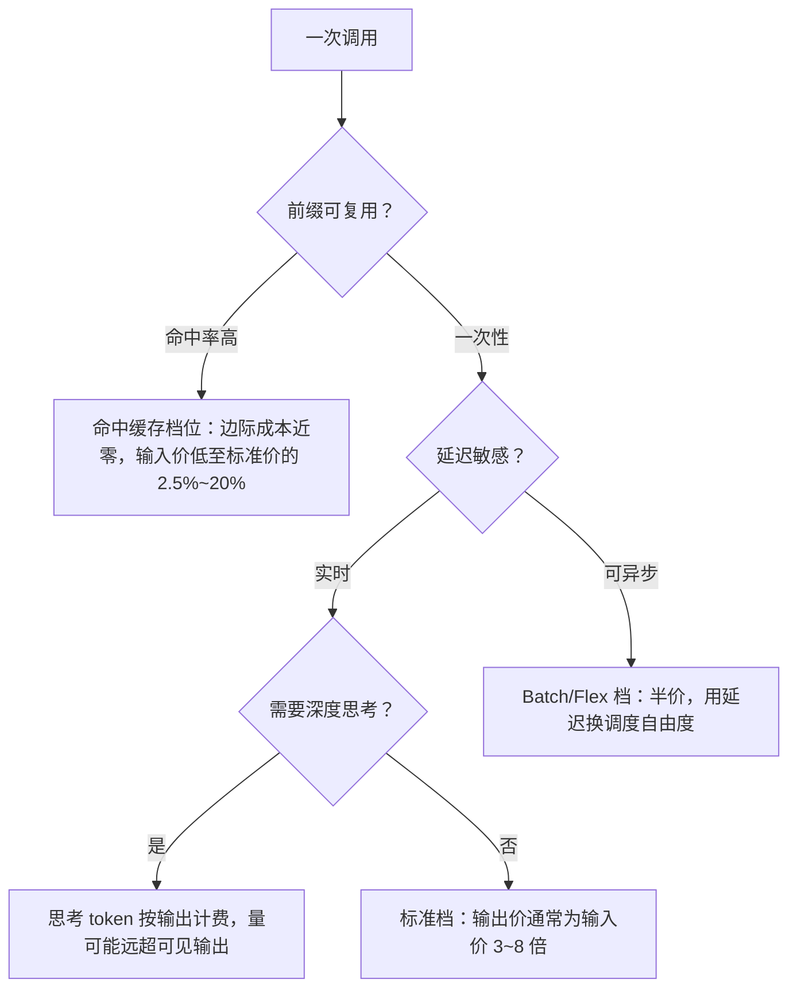
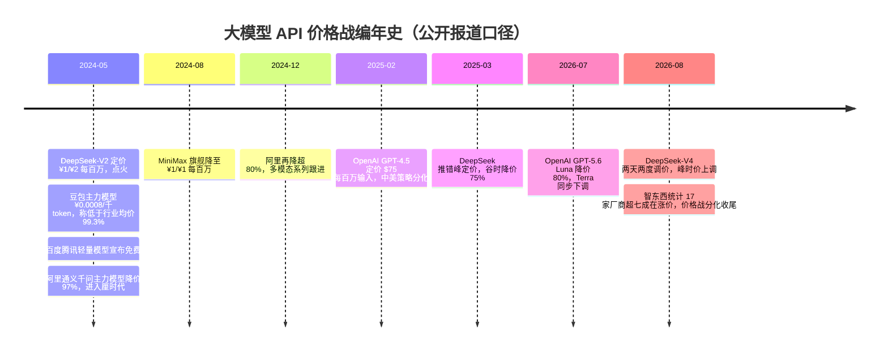
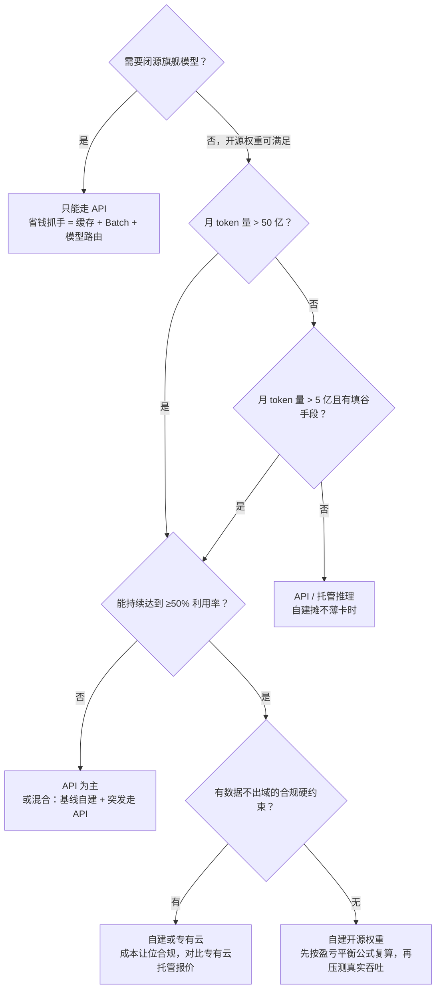

# Token 经济学：定价与成本的数学

> 写给要为大模型调用做预算、做厂商选型、判断"自建还是买 API"，或者被问过"token 定价是怎么设计出来的，跟算力电力有关系吗"的工程师与架构师。读完你能带走六样东西：一条从硬件到电费的完整成本链，一套可以手算的 FLOPs 数学（推理 2N、训练 6N）与"卡时 → 吞吐 → 单 token 成本"的自底向上算例；一份主流厂商定价结构的读表指南（输入/输出差价、缓存折扣、Batch 折扣、思考 token 计费）与截至 2026-09 的六厂商三档横向价格表；2024–2026 价格战的编年史与它的收尾逻辑；一张自建 vs API 的盈亏平衡决策表；一份可以直接照做的成本优化清单；以及 Agent 时代"每 token 成本"为什么正在被"每任务成本"取代的判断。全文主线自底向上：先算清成本地板，再看价目表怎么设计，最后落到买方怎么把账单压下来。文中所有价格均为厂商公开价目或公开媒体报道口径，访问日期 2026-09-05；token 单价是持续下行变量，任何测算前必须现拉口径。

## Token 定价是什么

一句话：**token 定价 = 算力成本映射 + 毛利 + 市场竞争**。它不是拍出来的数字，而是三层力量叠加的结果：

1. **成本地板**：芯片折旧、电力、运维摊销成卡时成本，卡时除以有效吞吐得到每 token 的成本地板。这一层由硬件代际、数据中心效率和**利用率**决定。
2. **毛利与分层**：厂商在成本地板上加毛利，并按模型规格分层——旗舰模型吃能力溢价，轻量模型薄利走量。价目表上输入/输出/缓存/批量的每一个档位，都是对不同成本结构的分别定价（下文展开）。
3. **市场竞争**：同档位能力平价化、开源模型冲击、新一代硬件的成本下降，都会触发降价。这是价格持续下行的主因，也是 2024–2026 三轮价格战的直接推手（见价格战编年史一节）。

从硬件到你账单上的单价，完整链条如下：



这条链上每一段都挂着一个决策：卡型与折旧年限决定成本地板（展开见 [GPU 选型与推理成本测算](/ai/infra/inference/gpu-sizing)）；利用率决定"有效"二字成不成立；毛利定位决定厂商敢不敢打价格战；而你作为买方，能撬动的是链末端——选档位、选模型、选调用方式、管好 Agent 的上下文。本文按这条链从下往上讲，最后再回到买方视角把优化手段串成清单。

## 为什么值得单独学

- **预算测算的底层语言**。客户问"这个应用一年 API 花多少钱"，答案 = 调用量 × 输入输出结构 × 单价。不懂档位结构（缓存命中、思考 token），账单能差出几倍；到了 Agent 负载，不懂 token 放大效应，预算能差出一个数量级。
- **自建还是租用的判断基础**。成本地板怎么算、毛利空间有多大，直接决定"调用量涨到多少时自建划算"。这个判断本文给出可复算的公式与决策表。
- **面试高频题**。"定价跟算力电力有关系吗"考的不是背诵，而是能不能把 2N/6N 的 FLOPs 数学、带宽瓶颈、成本结构一路讲到价目表。

一个反直觉的结论先放在这里：**电力是真实的成本项，但不是主导项；主导项是硬件折旧**——这个判断有公开口径支撑，见成本结构一节。

## FLOPs 数学：参数怎么变成算力

### 推理前向：约 2N FLOPs/token

Transformer 的算力消耗几乎全在矩阵乘法上。一次矩阵乘 A(m×n)·B(n×p) 的 FLOPs 是 2mnp——"2"来自一次乘加是乘(1)+加(2)两个操作。由此可以逐层推：

- 每个 token 前向时，要与模型的**全部参数**做一次矩阵向量乘。每个参数贡献约 2 FLOPs，所以 **前向 ≈ 2N FLOPs/token**（N 为参数量）。逐层拆：QKV 投影 2·3d²、输出投影 2d²、FFN 2·8d²，合计每层 2·12d²，与 2N 相差不到 2%。这个推导与"矩阵乘 2mnp 约定"来自 kipp.ly 的经典文章（见参考资料）。
- **注意力修正项**：上面没算注意力本身。带 KV Cache 解码时，每生成一个 token，注意力要做 q·Kᵀ（2Sd）与 scores·V（2Sd），合计 **4SLd**（S=序列长度，L=层数，d=模型维度）。它随序列长度线性增长：短上下文时相对 2N 可忽略，长上下文时占比显著上升，这也是长上下文推理贵的算力原因之一。
- **MoE 模型用激活参数量**。稀疏激活模型每个 token 只过一部分参数，2N 里的 N 换成每 token 的激活参数量。这解释了一个价格现象：总参数 671B、每 token 只激活 37B 的 MoE 模型（DeepSeek V3 公开口径，V4 同路线）算力账只有同总量稠密模型的约 5%，API 单价自然能比同能力稠密模型低一个量级。

### 训练：约 6N FLOPs/token

训练一个 token 要前向一次（≈2N）加反向一次（梯度对激活与权重各求一遍，约为前向的 2 倍），合计 **≈6N FLOPs/token**，总训练算力 ≈ 6ND（D 为训练 token 数）。这个近似是 Kaplan 缩放定律与 Chinchilla 论文采用的口径：Chinchilla 原文明确写 `FLOPs(N,D) ≈ 6ND (Kaplan et al. 2020)`，并在附录逐架构核算，精确 FLOPs 与 6ND 的比值在 0.99~1.10 之间——即该近似误差在一成以内。

训练账与推理账的关系值得点破一句：**训练是一次性的资本投入，推理是随调用量线性增长的运营支出**。模型能力代际相同时，谁把推理成本压得低，谁就敢在价目表上激进——这是理解价格战里"成本地板"一侧的钥匙。

### Prefill 与 Decode：输入输出差价的物理原因

推理服务在物理上分成两个性格完全相反的阶段：

- **Prefill（预填充）**：把输入 prompt 一次性并行算完，为每个输入 token 生成 KV 激活存入缓存。矩阵形状"胖"、算术强度高，GPU 算力能吃饱——**算力受限**。
- **Decode（解码）**：逐个生成输出 token，每步只算 1 个新 token，却要把**全部模型权重**从显存搬进计算单元一遍。矩阵形状"瘦"、算术强度低——**显存带宽受限**。


*图源：How to Scale Your Model（JAX 团队 scaling book）推理章节 KV Cache 示意图（[jax-ml.github.io/scaling-book/inference](https://jax-ml.github.io/scaling-book/inference/)，访问日期 2026-09-05）*

### 从 FLOPs 到延迟与成本：一个估算示例

拿一个典型 70B 稠密架构（80 层、d=8192）举例，INT8 部署、2 张 H100 SXM（规格口径见 [GPU 选型](/ai/infra/inference/gpu-sizing)）：

| 量 | 估算 | 结果 |
| --- | --- | --- |
| 每 token 前向算力 | 2N = 2×70e9 | 1.4e11 FLOPs |
| 纯算力耗时 | ÷ 有效算力 0.8 PFLOPS（FP8 稠密约 2 PFLOPS × MFU 40%） | ≈0.2 ms |
| Decode 权重搬运 | 70GB ÷ 聚合带宽 6.7TB/s | ≈10 ms/token |

两个数字差了约 60 倍：**decode 阶段算力只忙了零头，时间全花在把权重从显存搬进计算单元上——这是带宽受限，不是算力受限**。所以：

- **FLOPs 估算是必要非充分**。它给出算力需求的下界，但单流 decode 速度要按显存带宽算；显存容量与带宽的口径本站在 [GPU 选型与推理成本测算](/ai/infra/inference/gpu-sizing) 里已经展开，这里不重复。
- **Prefill 相反，是算力受限**：输入可以大并行、算术强度高，GPU 能吃饱。4096 token 的预填充约 5.7e14 FLOPs（注意力项此时约占 7%），同样按 0.8 PFLOPS 估算约 0.7 秒，符合常见的首字延迟量级；上下文到 32K 时，注意力项占比升到约四成，预填充算力随上下文近似平方增长。
- 这个不对称就是定价的经济基础：**输入（预填充）每 token 的算力效率高、可大规模并行；输出（解码）逐 token、被带宽卡着、算力利用率低**。价目表上"输出比输入贵 3~8 倍"不是营销设计，是两种物理过程的成本差（详见定价设计一节）。

decode 带宽受限还有第二层经济含义：**单个请求根本喂不饱 GPU，必须靠批处理把多个请求摊到同一次权重搬运上**。批处理开多大，由延迟要求反推——这就把"吞吐、延迟、成本"锁成了一个三角，也是利用率一节的主线。

## 成本结构拆解：从卡时到 token

### 卡时成本的构成

```
卡时成本 ≈ 折旧 + 电力 + 运维（+ 网络/机柜等其他摊销）

折旧 = 卡价 ÷ 折旧年限 ÷ 8760 小时
电力 = 整机功耗(kW) × PUE × 电价
运维 ≈ 卡价 × 年维护费率 ÷ 8760
```

一篇 2025 年的公开论文（《Beyond Benchmarks: The Economics of AI Inference》）给了 A800 80G 的完整算例（卡价按 12 万元、折旧 3 年、功耗 0.4kW、PUE 1.5、电价 1.0 元/度、维护费率 3%，汇率 7.09）：

| 成本项 | 估算 | 占比 |
| --- | --- | --- |
| 折旧 | 120000 ÷ (3×8760) ÷ 7.09 ≈ $0.64/小时 | ~82% |
| 电力 | 0.4×1.5×1.0 ÷ 7.09 ≈ $0.08/小时 | ~10% |
| 运维 | 120000×0.03 ÷ 8760 ÷ 7.09 ≈ $0.06/小时 | ~8% |

结论：**折旧是绝对大头，电力显著但非主导**。注意这是"GPU 裸卡"口径，未含服务器、机柜、网络与人力；参数（尤其卡价与折旧年限）变化时比例会移动，但"折旧主导"的结构在我见过的多数测算里稳定成立。

### 电力的真实占比与 PUE

- **PUE**（Power Usage Effectiveness，电能利用效率）= 数据中心总电力 ÷ IT 设备电力，衡量制冷与配电的损耗。上面的算例用 PUE 1.5 乘在 GPU 功耗上，就是把"每用 1 度电算算力，还要多付 0.5 度给制冷配电"摊进来。
- 行业水平：Uptime Institute 2025 年全球数据中心调查的行业平均 PUE 约 **1.54**，多年徘徊不前；Google 公布的 2025 年机群平均 PUE 为 **1.09**——超大规模自建机房能把损耗压到行业的零头，这本身就是成本优势。
- 另一个口径：NVIDIA 官方博客（2026-06）称"电力可占 AI 工厂运营支出（OpEx）的高达 40%"。这与"折旧主导"不矛盾——OpEx 是运营支出口径，而折旧属于资本支出的摊销；NVIDIA 强调电力的原因很现实：很多站点的电力容量是硬上限，每一瓦都直接决定能卖多少 token。引用此类数字时，先问清楚口径。

### GPU 租金行情：成本地板的市场价（截至 2026-09）

折旧算的是"自持卡"的成本地板；市场上还有一条更直接的参照线——**租卡行情**。公开聚合数据（GetDeploying 对 53+ 家 GPU 云的持续追踪、SemiAnalysis GPU Pricing Index）显示：

| 口径 | H100 单卡时价 | 说明 |
| --- | --- | --- |
| 按需中位数 | ~$3.3/卡时 | GetDeploying 聚合 40+ 提供商，2026-09 口径 |
| 25~75 分位带 | $1.8~2.7/卡时 | SemiAnalysis 指数，2026 上半年 |
| 低价市场/竞价 | ~$1.7~2/卡时 | Vast.ai、Spheron 等聚合市场，可用性波动大 |
| 超大云按需 | ~$7/卡时 | AWS/Azure 官网牌价，含生态与 SLA 溢价 |
| 整卡购置 | ~$2.5~3 万/卡 | 公开渠道指导价，用于折旧口径 |

两个观察。其一，**H100 时价从 2023 年的 $7+ 一路降到 2026 年的 $2~3 量级**——租卡市场的价格曲线本身就是"硬件代际 + 供给放量"的成本下行曲线，下一代卡上市会进一步压低上一代行情。其二，**按需中位数与低价市场差约 2 倍、与超大云牌价差约 2~3 倍**，这个价差里装的是可用性承诺、网络与存储生态、合规资质——自建测算时用哪个口径，结论会完全不同。

### 完整算例：卡时成本 → 每 token 成本

把租金行情与公开吞吐基准接起来，就能自底向上算出"每百万 token 的成本地板"。以自部署一个 70B 级开源权重模型（Llama-3-70B 类）为例，全部采用公开数据：

| 步骤 | 取值 | 来源/口径 |
| --- | --- | --- |
| 卡配置 | 2×H100（INT8/FP8 量化后单实例） | 70B 级常见最小服务配置 |
| 卡时成本 | $2.5/卡时 × 2 = $5/小时 | SemiAnalysis 指数 25~75 分位带中值 |
| 生产批大小下聚合吞吐 | ≈3000 输出 token/s | 量级推导：单流受带宽限制约 100 tok/s（见上文 10ms/token 估算），批处理下公开基准可提升数十倍（arXiv:2411.00136 实测批 1→64 提升 39 倍；NVIDIA TensorRT-LLM 博客 FP8 高并发峰值 >10000 tok/s），生产口径取保守中值 |
| 满负荷每小时 token | 3000 × 3600 = 1080 万 | — |
| **满负荷成本地板** | $5 ÷ 1080 万 ≈ **$0.46/百万 token** | 名义下界，假设 100% 利用率 |
| **50% 利用率** | ≈ **$0.93/百万 token** | 有效成本 = 名义 ÷ 利用率 |
| **30% 利用率** | ≈ **$1.54/百万 token** | 白天忙晚上闲的典型业务曲线 |

对照市场价格：同一个 Llama-3.1-70B 模型，Artificial Analysis 追踪的各 API 提供商报价在 **$0.40~$2.74/百万 token** 之间（最低约 $0.40，最高约 $2.74，差近 7 倍）；NVIDIA 官方推理性能页给出的参考口径是 Dynamo + TensorRT-LLM 下 **$0.123/百万 token**（按 116 TPS/用户交互性约束，最新硬件与极致优化口径）。

这组数字能读出三件事：

1. **开源权重模型的 API 价格已经贴近自建成本地板**——最低价提供商（$0.40）基本就是"满负荷自建"的水平，说明他们在用极高的利用率打价格；而 $2+ 的报价里大部分是毛利与生态溢价。
2. **利用率越低，敏感性越狠**。有效成本 = 名义 ÷ 利用率：从 90% 掉到 80%，成本抬 12.5%；从 50% 掉到 40%，抬 25%；从 30% 掉到 20%，抬 50%。上表里 30% 与 100% 利用率之间差 3.3 倍——这就是为什么"自建省钱"的话术必须先回答"你能把卡喂到几成"。
3. **旗舰闭源模型是另一个世界**。$10/$50 每百万的旗舰价与其成本地板之间的差距，装的是训练摊销、能力溢价与竞争定位，不能用开源模型的"贴地板定价"直觉去推断。

### 利用率是最大的成本杠杆

同样的卡，利用率 100% 与 70%，每个"有效卡时"的成本差 43%（有效成本 = 名义成本 ÷ 利用率）。我做过的项目里，利用率假设的差异对测算结果的影响，远大于卡价或电价的差异。所有推理优化的经济学意义都可以归结为这一条：连续批处理把多个请求摊到同一次权重加载上、前缀缓存省掉重复预填充、PD 分离让两类硬件各自吃饱、Batch 折扣填谷——全是在抬利用率。

利用率为什么难拉满？物理约束在批大小与延迟的互换关系上。scaling book 用 PaLM 系列模型画过经典的成本-延迟帕累托前沿：


*图源：How to Scale Your Model（JAX 团队 scaling book）推理章节，PaLM 模型的成本（吞吐倒数）-延迟帕累托前沿图（[jax-ml.github.io/scaling-book/inference](https://jax-ml.github.io/scaling-book/inference/)，访问日期 2026-09-05）*

批越大，单位 token 成本越低，但排队与单步时延越高——**延迟 SLO 决定了你敢开多大批，批大小决定了成本地板**。吞吐随批大小的实测曲线也印证这一点：层耗时在批 240 之前几乎不涨（吞吐近似线性上升），之后才进入算力饱和区。


*图源：How to Scale Your Model（JAX 团队 scaling book）推理章节，批大小-吞吐实测曲线（[jax-ml.github.io/scaling-book/inference](https://jax-ml.github.io/scaling-book/inference/)，访问日期 2026-09-05）*

在线服务为了守住交互延迟，批往往开不到饱和点；于是出现了两类"填谷"手段。**Batch API/错峰定价**把不赶时间的负载引到谷时，直接抬全日利用率——这是厂商敢给半价的物理原因。**PD 分离**（prefill/decode disaggregation）把算力受限的预填充与带宽受限的解码拆到不同资源池，各自按自己的最优批大小运行，避免"一个用户的长 prompt 预填充卡住所有用户的解码"：


*图源：How to Scale Your Model（JAX 团队 scaling book）推理章节 PD 分离示意图（[jax-ml.github.io/scaling-book/inference](https://jax-ml.github.io/scaling-book/inference/)，访问日期 2026-09-05）*

吞吐与利用率怎么测、连续批处理怎么实现，见[大模型推理部署实战](/ai/infra/inference/llm-inference)。

## 定价设计：价目表里的六个决定

这是面试必答题的核心。主流厂商的价目表结构高度趋同，下面逐一拆解设计逻辑。



### 1. 输入/输出为什么差价

前面的数学已经给出答案：预填充算力效率高、可大并行；解码带宽受限、逐 token 低效。输出价必须覆盖更贵的边际成本。**经验上输出价为输入价的 3~8 倍**（个别模型到 10 倍）——2026-09-05 核实的实例：Anthropic 全系输出/输入 = 5 倍；OpenAI GPT-5.6 家族 6 倍；Google Gemini 3 Pro 6 倍、Gemini 2.5 Flash-Lite 4 倍；百炼 qwen3-max 4 倍、qwen-flash 10 倍；火山豆包 Seed-2.1 5 倍、Seed-1.6-flash 10 倍；DeepSeek-V4 系列 3 倍。

倍数本身也有信息量：**轻量模型倍数普遍更高（8~10 倍），旗舰反而低（3~6 倍）**。我的解读是，轻量档输入价被价格战打到接近白送（¥0.15/$0.10 每百万），输出价必须独自扛起毛利；而 DeepSeek 3 倍的"扁平"结构与其"全按成本定价、不赚档位差价"的市场策略一致。做预算时不能拿一个倍数套所有模型。

### 2. 缓存输入折扣：边际成本近零

前缀缓存命中时，这部分输入只需从缓存读 KV、跳过预填充计算，边际成本趋近于零，厂商于是给出大幅折扣，把"命中率"直接变成客户的价格激励。工程实现上，缓存通常组织成一棵前缀树（trie），KV 按块共享、LRU 淘汰：


*图源：How to Scale Your Model（JAX 团队 scaling book）推理章节，前缀缓存 trie 示意（原始出处 Character.ai 博客）（[jax-ml.github.io/scaling-book/inference](https://jax-ml.github.io/scaling-book/inference/)，访问日期 2026-09-05）*

各家折扣机制对比（2026-09-05 核实）：

| 厂商 | 缓存写入/创建 | 缓存命中 | 机制 |
| --- | --- | --- | --- |
| OpenAI（GPT-5 家族） | 不单独计费 | 标准输入价的 10% | 自动生效，≥1024 token |
| Anthropic（Claude 全系） | 标准输入价的 125%（5 分钟 TTL） | Sonnet 5/Opus 5 为输入价 10%；Fable 5.1 降至 2.5%（$0.25/百万） | 显式声明缓存断点 |
| Google（Gemini） | 显式缓存免创建费；缓存存储限时免费，2027 年起 $1.00/百万 token·小时 | 约为输入价的 10%（如 Flash-Lite 档 $0.025 vs $0.25） | 显式缓存 + 按存储时长计费 |
| 阿里云百炼（通义千问） | 显式缓存 125%；隐式免费 | 显式命中 10%；隐式命中通常 20% | 显式/隐式两种模式 |
| 火山引擎（豆包） | 透明前缀缓存，缓存存储约 ¥0.017/百万 token·小时 | 旗舰档 ¥1.2/百万（标准输入价 ¥6 的 20%） | 部分模型自动前缀缓存 |
| DeepSeek（V4 系列） | 含在未命中价内 | 约为未命中价的 3%（off-peak $0.007 vs $0.22/百万） | 自动，按峰谷分时计价 |

设计上的共性：写入略贵（补偿建缓存的预填充成本）、命中极便宜（接近纯毛利让渡换调用黏性）。多轮对话、Agent、RAG 这类高前缀复用的负载，实际单价可以远低于价目表标准价。差异点也值得注意：Google 与火山开始对**缓存存储时长**单独收费——缓存从"免费优化"变成"要管理的库存"，长尾不用的缓存前缀会持续产生费用。2026 年 Anthropic 把旗舰 Fable 5.1 的缓存读价从 $1.00 砍到 $0.25（降 75%），方向很明确：**Agent 负载时代，缓存读价就是获客价**。命中率对账单的量化影响，下文有完整算例。

### 3. Batch API 折扣：用延迟换调度自由度

批处理档普遍半价：OpenAI Batch API 对 Global Standard 价 50% 折扣、24 小时内返回，另有 GPT-5.5 Flex 档半价（优先处理 Priority 档则为标准价 2.5 倍）；Anthropic "Save 50% with batch processing"；百炼"Batch 调用半价"。逻辑不是慈善：异步请求给了调度器填谷的自由——塞进利用率低谷、与高优流量混跑、吃满批处理效率，本质是把利用率红利的一部分让给客户。DeepSeek 的做法更直接：同一模型分峰谷两档价，谷时半价（其价目表明示峰时为 UTC 工作日 01:00-04:00 与 06:00-10:00，即北京时间的白天高峰）。

### 4. 推理模型的思考 token 计费

推理模型会生成不可见（或被摘要）的思考链，它的计费方式是一个单独的定价决定：

| 厂商 | 计费方式 | 公开口径 |
| --- | --- | --- |
| OpenAI（o/GPT-5 系列） | 推理 token 不可见但占上下文，**按输出价计费** | 官方文档："billed as output tokens" |
| Anthropic（extended thinking） | 思考 token 按输出价计费；折叠或删减显示也照常计费 | 官方文档（另见 The Register 2026-08 报道转述） |
| Google（Gemini 思考模型） | 思考 token 计入输出 token，按输出价计费；可用思考预算参数控制量级 | 官方定价文档口径 |
| 阿里云百炼（qwen-plus 等） | 思考模式输出单列价档：qwen-plus 思考输出 8 元/百万，非思考输出 2 元/百万 | 官方模型价格页 |
| DeepSeek（V4 系列） | 思考与非思考模式共用同一输出单价 | 官方定价页 |

坑在这里：思考模型一次调用生成的思考 token 经常是可见回答的数倍，且全按输出价计——**同样"问一个问题"，账单可能是普通模型的几倍**。测算时必须把思考预算（如 `budget_tokens`、`max_completion_tokens`、Gemini 的 thinking budget）当成本变量管起来。

更细一层：截至 2026-09，主流厂商还没有出现"按推理努力等级（reasoning effort）直接定不同单价"的公开价目——努力等级参数（minimal/low/medium/high）改变的是**思考 token 的数量**，单价不变。所以"控制推理成本"的抓手是预算封顶与任务分级路由，而不是找一个便宜的单价档。这个局面我认为不会维持太久：当 Agent 负载成为主流，按"处理模式"分级定价（Flex/Priority/Batch 已经是雏形）会继续细化。

### 5. 按模型规格分层定价

旗舰/中端/轻量三层的能力与成本都不同，价目表自然分层（见下节价格表）。还有一层容易被忽略：**上下文长度分层**。Gemini 3 Pro 以 200K 为界，超过后输入 $2→$4、输出 $12→$18（长上下文档位近乎翻倍）；百炼按 32K/128K/256K 分段定价（长段更贵）；Azure OpenAI 对 GPT-5.4 以 272K 上下文为界，长上下文档位价格翻倍；Anthropic 对超 200K 的长会话也有溢价档。原因还是成本：长上下文的 KV Cache 显存占用与注意力算力（随 S 增长乃至平方增长）都显著上升。做长文档、长会话、Agent 类应用，先查你常用的上下文长度落在哪一档，再谈单价。

### 6. 区域与服务档位

同模型不同部署也有价差：Azure 的 Data Zone 比 Global 贵约 10%、优先处理（Priority）档位约为标准价 2 倍；OpenAI 的 Priority 档为标准价 2.5 倍；Anthropic 提供 1.1 倍的"仅限美国推理"选项。还有一个新变量：**促销价与生效期**。2026-09 时点，GPT-5.6 Sol 挂的是 $4/$20 的促销价（官方口径有效期至 2026-11-21，之后回 $5/$30）；Google 对 Gemini 3.6~3.8 Flash 给到 2026-12-31 的引入价 $0.75/$3.75（2027 年起回 $1.5/$7.5）。签合同时把部署档位与价格有效期写清楚，别拿促销价做三年 TCO。

## 六厂商价格横向对比（截至 2026-09）

把 Anthropic、OpenAI、Google、阿里云百炼、火山引擎、DeepSeek 六家的公开价目页拉平到同一张表。所有价格为标准档（未计缓存/批量折扣），美元与人民币按厂商原生币种列示，访问日期 2026-09-05。

### 旗舰档

| 模型（厂商） | 输入/百万 | 输出/百万 | 出/入 | 缓存命中 | 来源 |
| --- | --- | --- | --- | --- | --- |
| Claude Fable 5.1（Anthropic） | $10 | $50 | 5× | $0.25 | anthropic.com/pricing |
| GPT-5.6 Sol（OpenAI） | $5（促销 $4） | $30（促销 $20） | 6× | 输入价 10% | developers.openai.com |
| GPT-5.5 Pro（OpenAI） | $30 | $180 | 6× | 输入价 10% | developers.openai.com |
| Gemini 3 Pro（Google，≤200K） | $2 | $12 | 6× | 约 10% | ai.google.dev 定价页 |
| qwen3.6-max-preview（百炼，≤128K） | ¥9 | ¥54 | 6× | 隐式约 20% | help.aliyun.com 价格页 |
| 豆包 Seed-2.1-pro（火山） | ¥6 | ¥30 | 5× | ¥1.2 | volcengine.com/product/doubao |
| DeepSeek-V4-pro（off-peak） | $0.66 | $1.98 | 3× | $0.022 | api-docs.deepseek.com |

### 中端档

| 模型（厂商） | 输入/百万 | 输出/百万 | 出/入 | 来源 |
| --- | --- | --- | --- | --- |
| Claude Opus 5（Anthropic） | $5 | $25 | 5× | anthropic.com/pricing |
| Claude Sonnet 5（Anthropic） | $2 | $10 | 5× | anthropic.com/pricing |
| GPT-5.6 Terra（OpenAI，2026-07-30 降价后） | $2 | $12 | 6× | developers.openai.com |
| GPT-5.4（Azure OpenAI，Global 标准） | $2.5 | $15 | 6× | Azure Retail Prices API |
| Gemini 3 Flash（Google） | $0.5 | $3 | 6× | ai.google.dev 定价页 |
| qwen3-max（百炼，≤32K） | ¥2.5 | ¥10 | 4× | help.aliyun.com 价格页 |

### 轻量档

| 模型（厂商） | 输入/百万 | 输出/百万 | 出/入 | 来源 |
| --- | --- | --- | --- | --- |
| Claude Haiku 4.5（Anthropic） | $1 | $5 | 5× | anthropic.com/pricing |
| GPT-5.6 Luna（OpenAI，2026-07-30 降价 80% 后） | $0.20 | $1.20 | 6× | developers.openai.com |
| GPT-5.4-nano（Azure OpenAI） | $0.2 | $1.25 | 6× | Azure Retail Prices API |
| Gemini 3.5 Flash-Lite（Google） | $0.30 | $2.50 | 8.3× | ai.google.dev 定价页 |
| Gemini 2.5 Flash-Lite（Google） | $0.10 | $0.40 | 4× | ai.google.dev 定价页 |
| qwen-flash（百炼，≤128K） | ¥0.15 | ¥1.5 | 10× | help.aliyun.com 价格页 |
| 豆包 Seed-1.6-flash（火山） | ¥0.15 | ¥1.5 | 10× | volcengine.com/product/doubao |
| DeepSeek-V4-flash（off-peak，未命中） | $0.22 | $0.66 | 3× | api-docs.deepseek.com |

### 读表：五个结构性观察

1. **旗舰档内部差出数十倍**。同为旗舰定位，输入价从 DeepSeek-V4-pro off-peak 的 $0.66 到 GPT-5.5 Pro 的 $30，差约 45 倍——这里面有能力代差、有毛利率定位差、也有中美市场结构差。旗舰选型不能只看单价，要结合评测分做"每能力单位成本"，学界已经用成本-质量三维帕累托前沿来做这件事：

   

   *图源：《Beyond Benchmarks: The Economics of AI Inference》图 1，模型质量-推理成本三维帕累托前沿（[arXiv:2510.26136](https://arxiv.org/abs/2510.26136)，访问日期 2026-09-05）*

2. **轻量档已经"平价化"**。六家轻量档输入价收敛到 $0.10~0.30/百万（人民币口径 ¥0.15）的窄带里，输出价 $0.40~2.50。这一档拼的不再是价格而是稳定性、并发配额与生态——价格战在轻量档已经打完了。
3. **中国厂商的定价单位仍是"厘"级**：¥0.15/百万 input 折算约 $0.02，比美国轻量档（$0.10~0.30）还低 5~15 倍；但要注意国内价目普遍**不含税、按量阶梯少、企业折扣空间大**，横向比价时口径要对齐。
4. **Google 用中端价格打旗舰市场**：Gemini 3 Pro $2/$12 的定价落在别家中端档，而能力定位是旗舰——这是 2026 年价格表上最值得注意的错位，自持 TPU 的成本结构给了它这个空间。
5. **价格表是快照，结构是稳定的**。档位分层、出入差价、缓存折扣、峰谷分时这套结构两年内不会变；具体数字半年就会面目全非。测算表的正确形态是"结构固定 + 数字带取数日期"。

## 价格战编年史：2024–2026

单价为什么一路下行？把三年的公开报道排成时间线，能看到价格战完整的"点火 → 蔓延 → 精细化 → 分化"四幕。



**第一幕（2024-05）：点火与踩踏。** 导火索是 DeepSeek-V2 把 API 价格打到 ¥1/百万输入、¥2/百万输出，远低于当时行业水平，证券时报称之为"价格屠夫"。一周内字节把豆包主力模型降到 ¥0.0008/千 token（即 ¥0.8/百万，官方口径低于行业均价 99.3%）；百度、腾讯同日宣布轻量模型免费；十天后阿里把通义千问 GPT-4 级主力模型输入价砍 97% 至 ¥0.5/百万，财联社的标题是"大模型价格战卷至厘时代"。这一幕的本质是**获客补贴**：API 毛利率当时普遍为正，降价降的是毛利不是命，换的是调用量与生态位。

**第二幕（2024 下半年）：降价常态化。** MiniMax 旗舰模型输入输出统一 ¥1/百万；年末阿里再降超 80%，多模态模型跟进。免费 + 超低价把中小模型的 API 价格预期彻底重置。

**第三幕（2025）：精细化。** 单纯的标价下调空间见顶后，定价设计接棒：DeepSeek 推出**错峰定价**（谷时降 75%），把利用率红利做成价格杠杆；缓存计价、Batch 折扣在国内厂商价目表上普及。同期中美分化明显——OpenAI 2025-02 发布 GPT-4.5 时输入价反而定到 $75/百万，走"能力溢价"路线。

**第四幕（2026）：攻守易形与分化收尾。** 三个标志事件：其一，DeepSeek-V4 发布后两天两度调价，港媒测算其缓存输入价比美国同档便宜约 97%；其二，2026-07-30 OpenAI 罕见大幅降价反击，GPT-5.6 Luna 输入价从 $1 砍到 $0.20（降 80%），首次低于 DeepSeek 同档，官方博客称之为"推进价格-性能前沿"；其三，DeepSeek 随后把 V4-pro 峰时价**上调**（公开报道口径峰时输入调至 ¥9/百万），智东西对 17 家厂商的统计显示**超七成在涨价**，MIT 科技评论中国的标题是"DeepSeek 涨价，OpenAI 降价，Agent 改写了大模型价格战"。

第四幕的分化不是偶然，我的解读是三条逻辑线交汇：

- **负载变了**：Agent/编程类负载输入 token 占比压倒性（见 Agent 一节），厂商发现"输入价"是获客抓手而"输出价与峰时容量"才是利润来源——于是缓存读价暴跌、峰时价上调同时发生。
- **容量变紧**：调用量暴涨（豆包披露日均 token 消耗两年翻 1000 倍、2026-04 已超 120 万亿）叠加 GPU 供给约束，头部厂商的低谷容量被填满，补贴动机减弱。
- **竞争维度迁移**：从"每 token 单价"转向"每任务成本 + 生态卡位"（编程工具链、Agent 平台），单价作为竞争指标的地位下降。

对买方的含义：**别再期待单边降价**。2024–2025 式的全面价格战大概率是阶段性的，2026 之后的常态是"标准价稳定 + 折扣结构复杂化"（缓存、批量、峰谷、促销期），省钱靠的是把负载特征对准折扣结构，而不是等厂商降价。

## 趋势：同等能力的价格按指数下跌


*Epoch AI 按"达到同一基准分数的最低推理价格"测算的价格下降曲线（图中为各基准的中段趋势）。图源：[Epoch AI Data Insights: LLM inference prices have fallen rapidly but unequally across tasks](https://epoch.ai/data-insights/llm-inference-price-trends)（访问日期 2026-09-05）*

Epoch AI 的测算（2025-03）：固定能力水平下的推理价格，各基准的下降速度在每年 9 倍到 900 倍之间，**中位数约每年 50 倍**；达到 GPT-4 级 GPQA 表现的价格每年下降约 40 倍。最常被引用的定标点：GPT-3.5 级 MMLU 能力的推理成本从 2022 年 11 月的约 $20/百万 token 降到 2024 年 10 月的约 $0.07——两年超 280 倍，本站在[AI 大模型时代](/chronicle/ai-era)里讨论过它对应用生态的意义。

注意 Epoch 的口径是"**同等能力**的价格"，与"同一模型降价"是两回事：前者混合了硬件代际、算法效率与竞争三重因素，还包含"新一代轻量模型追平老旗舰能力"的替代效应——2026 年轻量档 $0.2/百万输入的 Luna 级模型在多数基准上已超过 2023 年的旗舰，这才是能力价格暴跌的主力。做多年期预算时用"能力价格年降一个数量级"做敏感性下限，比锁死某一代模型单价靠谱得多。

我的判断：**token 单价是持续下行变量，但下行斜率在 2026 年后放缓、结构分化**（价格战编年史一节的结论）。驱动力仍是三重的——硬件代际（每代算力与带宽翻倍级提升）、算法与系统效率（量化、MoE、PD 分离、投机解码）、竞争（价格战与开源平价）。但两件事要同时记住：单价降不等于总账单降，调用量随 Agent 化负载爆炸式增长（Jevons 悖论，见[编年史](/chronicle/ai-era)的判断，数据见 Agent 一节）；以及成本地板的下行速度决定降价空间——这也是为什么看一家厂商的价目表，最好同时看它的硬件与利用率故事。

## 缓存经济学：命中率对账单的影响算例

缓存折扣的杠杆有多大，算一个典型 Agent 负载就清楚了。设定：

- 稳定前缀（系统提示 + 工具定义）：8000 token，每个任务的每一轮都重复发送
- 任务平均 30 轮工具调用，每轮输入（历史 + 工具结果）平均 12000 token，每轮输出 500 token
- 模型按 Claude Sonnet 5 公开价：输入 $2/百万、输出 $10/百万、缓存写 $2.5/百万（125%）、缓存读 $0.2/百万（10%）

**不开缓存**（每轮全量按标准输入价）：

```
输入 = 30 轮 × 12000 token = 36 万 token → 36万 × $2/百万 = $0.72
输出 = 30 轮 × 500 token = 1.5 万 token → 1.5万 × $10/百万 = $0.15
每任务合计 ≈ $0.87
```

**开缓存**（每轮输入中，上一轮已存在的前缀 ~11000 token 按缓存读计价，本轮新增 ~1000 token 按缓存写计价）：

```
缓存读 = 30 × 11000 = 33 万 token × $0.2/百万 = $0.066
缓存写 = 30 × 1000  = 3 万 token × $2.5/百万 = $0.075
输出   = 1.5 万 token × $10/百万             = $0.15
每任务合计 ≈ $0.29，节省约 67%
```

再算两个边界，防止把算例当万能公式：

- **会话极短时缓存写会吃掉折扣**。若任务只有 2 轮、每轮 12000 token，缓存写（125%）覆盖的新增部分占比高，节省幅度掉到 20% 以内；单轮一次性调用开显式缓存（Anthropic 模式）纯亏 25% 写入溢价。缓存的收益与"前缀被重读的次数"成正比，次数不够，写入费回不了本。
- **TTL 是隐形炸弹**。Anthropic 显式缓存默认 5 分钟 TTL（可付费延长），对话间隔一超时，下一轮整段前缀重新按写入价计。高频短间隔的 Agent 循环天然占便宜，人类节奏的客服对话要小心。
- **隐式缓存（OpenAI/DeepSeek/百炼隐式模式）无写入溢价但命中价略贵**（如百炼隐式 20% vs 显式 10%），且命中与否不承诺——适合"顺手赚"，不适合写进成本模型做承诺性测算。

一句话结论：**命中率是 Agent 时代最重要的单价变量**。同样的价目表，命中率 0% 与 90% 的实际账单差 2~3 倍。前缀稳定化、按"从静到动"排序 prompt、控制 TTL 间隔这些工程动作，过去叫"性能优化"，在今天的价目表结构下实质是"定价套利"。

## 自建 vs API：盈亏平衡的数学

### 盈亏平衡公式

```
自建月成本 = 卡数 × 卡时价 × 730 小时 ÷ 利用率     （租卡口径；自购卡把卡时价换成折旧+电力+运维）
API 月成本 = 月 token 量 × 混合单价                （混合单价 = 输入占比×输入价 + 输出占比×输出价，含缓存折扣修正）
盈亏平衡点：月 token 量* = 自建月成本 ÷ API 混合单价
```

用 70B 级开源模型的公开口径代入（2×H100 @ $2.5/卡时、利用率 50%、API 混合单价取开源模型市场中间值 $1/百万）：

```
自建月成本 = 2 × 2.5 × 730 ÷ 0.5 = $7300
平衡点 token 量 = $7300 ÷ $1/百万 = 73 亿 token/月 ≈ 持续 2800 token/s
```

也就是说：**月消耗低于几十亿 token、或无法让卡持续跑到五成以上利用率，自建 70B 就不如直接买 API**。而公开 API 最低价（$0.40/百万）意味着对手在用接近满负荷的利用率运营——你用租来的卡、波动的流量去和专职推理厂商拼利用率，多数场景没有胜算。

### 三变量决策表

利用率、模型规模、调用量三个变量的组合判断（经验值，边界：以租卡口径估算、不含合规与人力成本）：

| 月 token 量 | 模型需求 | 能稳定达到的利用率 | 判断 |
| --- | --- | --- | --- |
| < 5 亿 | 开源 70B 级以下 | 任意 | API/托管推理。自建连一张卡的月租金都摊不薄 |
| 5~50 亿 | 开源 70B 级 | < 40% | API 为主。峰谷差大时自建卡大量空转 |
| 5~50 亿 | 开源 70B 级 | ≥ 50%（有夜间批量任务填谷） | 盈亏平衡带：拿自家真实长度分布压测后再定；混合架构（基线自建 + 突发走 API）通常是更稳的解 |
| > 50 亿 | 开源 70B 级 | ≥ 50% | 自建划算，且规模越大越划算；配 PD 分离与量化把吞吐再抬 2~4 倍 |
| 任意 | 闭源旗舰（Fable/GPT-5.6/Gemini Pro 级） | — | 只能 API。无权重可部署，问题变成"选哪家 + 怎么折扣" |
| 任意 | 超大 MoE（V4-pro 级，多机部署） | 需 ≥ 70% 才接近官方 API 价 | 除非有强合规理由，自建很难打过模型厂商自己的 API——他们利用率最高、且定价贴着自家成本地板 |
| 任意 | 任意 | 数据不出域的合规硬约束 | 自建或专有云，成本让位于合规；此时对比对象是"专有云托管"而非公有 API |



三个容易被漏掉的账：**人力**（自建推理平台至少需要一个专职工程投入，折算成本常超过小规模场景的全部卡费）；**弹性**（API 的峰值容量是厂商兜底的，自建要为峰值买卡或用降级预案）；**代际风险**（自建的卡折旧 3 年，而能力价格年降一个量级，两年后你的自建集群可能在"能力/成本"双维度被新 API 淘汰）。

## 成本优化清单：把负载对准折扣结构

按杠杆大小排序的买方优化手段（节省幅度为公开口径与我的项目经验的量级估计，注明边界）：

| 手段 | 机制 | 典型节省量级 | 代价与边界 |
| --- | --- | --- | --- |
| 模型路由（小模型接简单任务） | 分类/规则/级联把请求分流到轻量档，旗舰只接难任务 | 30~70%（Uber 公开案例的核心手段之一） | 需要评测集守住质量底线；路由本身也耗 token，规则要便宜 |
| 前缀稳定化 + 缓存 | 命中部分输入价降至 2.5%~20% | Agent 负载 50~70%（见上文算例） | 前缀必须逐字节稳定；TTL 与写入溢价的边界要算 |
| Batch/异步化 | 半价档，把可离线任务从实时池挪走 | 该部分负载 50% | 放弃实时性；注意 24h 返回窗口与失败重试计费 |
| 错峰调度 | DeepSeek 类峰谷价，谷时跑批量任务 | 该部分负载 50~75% | 任务可调度才行；峰谷时区按 UTC 算，别排错 |
| 量化 + 推理引擎优化（自建） | FP8/INT8、投机解码、PD 分离抬吞吐 | 单位 token 成本降 2~4 倍（公开基准口径） | 工程投入 + 逐模型质量回归验证 |
| 上下文瘦身 | 砍冗余历史、工具结果摘要化、检索代替长文粘贴 | Agent 负载 20~50% | 过度压缩伤任务成功率，要 A/B |
| 长上下文档位规避 | 会话控制在低价档内（如 ≤200K），超限前压缩 | 超档部分近 50%（长档价约翻倍） | 压缩点选择影响体验 |
| 区域/部署档位选择 | Global vs Data Zone、促销价窗口 | 10~20% | 合规与延迟约束优先；促销价到期会回涨 |

执行顺序建议：**先路由和缓存（杠杆最大、不动架构），再批量化和错峰（动调度），最后才是自建侧的量化与引擎优化（动架构）**。多数团队的实际浪费在前两层——我在项目里见过的通病是拿着旗舰模型跑分类任务、每轮全量重发 8000 token 的工具定义，这两项就能吃掉一半账单。

## Agent 时代的成本爆炸：从每 token 到每任务

### Token 放大效应：多轮循环的 O(N²) 账单

聊天机器人一次问答的 token 是常数；Agent 一次任务的 token 是**轮数的超线性函数**。机制很朴素：每轮工具调用都要重发"系统提示 + 全部历史 + 工具结果"，第 k 轮的输入 ≈ 前 k-1 轮的总和，N 轮任务的总输入按 O(N²) 增长。量级感受（公开研究口径）：

- 学术分析（arXiv:2604.22750，对 agentic coding 任务的实测研究）：**agentic 编程任务的 token 消耗约为同模型代码问答/推理任务的 1000 倍**，且大头在输入侧——反复重传上下文的"通信税"。
- Gartner 2026-03 的转述口径（多家工程博客引用）：Agent 任务的 token 消耗约为普通聊天机器人的 **5~30 倍**（任务复杂度决定倍数）。
- 任务级成本随之失去"单价直觉"：同一个任务换模型、换上下文策略，token 量差数倍、单价差十倍，每任务成本跨方案可以差出两个数量级——这正是下文"每任务记账"的动机。

宏观数据同样在讲这个故事：高盛预测 2026–2030 全球 token 需求增长 **24 倍**；IDC 测算中国企业智能体 token 消耗**年均增长超 30 倍**；豆包披露日均 token 消耗两年翻 1000 倍、2026-04 已超 120 万亿。**单价在跌、总量在爆，总账单的方向取决于两者的赛跑**——这就是 Jevons 悖论在推理经济上的显形。

### 正面案例：用量 9.4 倍、账单持平

2026 年被引用最多的企业案例来自 Uber 的公开披露（Reuters/Yahoo Finance 独家，InfoQ 中文有拆解）：其内部 AI 软件工厂的**智能体请求量自 2026-02 起增长 9.4 倍**、编程工具周活用户增长 7 倍、超过 70% 的代码变更提交由智能体产出，而 **AI 总支出自 2026-03 起基本持平**。方法不神秘：把总账单拆成六项成本因子的乘积，逐项治理——模型路由（难任务才上旗舰）、上下文控制（历史压缩、按需检索）、缓存命中最大化、按会话成本做基准测试。这个案例的价值在于证明了：**Agent 成本爆炸不是宿命，是未治理状态的默认值**。

### 视角切换：每任务成本取代每 token 成本

Agent 负载下，"每百万 token 多少钱"失去预算意义——同一个任务，用不同模型、不同上下文策略，token 量能差 5 倍，单价差 10 倍，两个变量相乘后**每任务成本才是稳定的业务口径**。落到实践是三件事：

1. **预算与监控按任务记账**：把"每任务 token 分布 + 每任务成本"做成一级指标，单价只作为中间变量。
2. **给循环装闸门**：最大轮数、每轮上下文预算、思考 token 预算（`budget_tokens` 类参数）都是成本参数；失控循环（retry storm）是 Agent 账单最常见的事故来源。
3. **用折扣结构对冲放大效应**：Agent 负载输入占比极高、前缀高度重复，恰好是缓存折扣的最佳受体——O(N²) 的重传大部分按 10% 计价，放大效应的实际伤害能砍掉一半以上。这也是各家 2026 年竞相下调缓存读价的原因：他们在为 Agent 流量定价。

推理模型还叠加了一层不确定性：思考 token 数量随任务难度波动，同样一句 prompt，effort 参数不同、任务复杂度不同，输出计费量能差数倍。**"按推理努力分级"目前通过 token 数量而非单价生效**（见定价设计第 4 条），管理抓手是任务分级路由：简单任务低 effort 或小模型，难任务才放开思考预算。

## 常见坑

| 坑 | 现象 | 对策 |
| --- | --- | --- |
| 用旧报价测算 | 半年前的价格表算出的预算与真实账单差一个档位 | 每次测算前重拉厂商价目页，注明访问日期；把"价格快照时间"写进测算表头 |
| 把促销价当长期价 | 按促销价做的三年 TCO，到期后成本跳涨 | 促销/引入价（GPT-5.6 Sol 促销至 2026-11、Gemini Flash 引入价至 2026-12）核清有效期，TCO 按标准价保底 |
| 不分输入/输出/缓存档位 | 用单一"平均单价"乘总 token，低估或高估数倍 | 按真实长度分布拆输入/输出；高前缀复用负载单列缓存命中比例 |
| 忽略思考 token | 推理模型账单比预期高几倍 | 思考链按输出价计费且量大；用推理预算参数封顶，账单监控区分可见输出与思考量 |
| 长上下文档位没核 | 会话超 200K 后单价翻倍，账单莫名跳档 | 查清常用上下文长度落在哪个计费档；超限前做历史压缩 |
| 把电费当主导成本 | 高估电价敏感度，低估折旧与利用率的影响 | 按"折旧 ~8 成、电力 ~1 成"的公开算例建直觉；电力敏感场景再看 PUE 与电价 |
| 忽略利用率 | 按满负荷吞吐算成本，自建测算严重乐观 | 有效成本 = 名义成本 ÷ 利用率；利用率假设单独列为可调参数并做敏感性分析 |
| 把榜单吞吐当自己吞吐 | 引用基准的 tokens/s 与自家长尾负载差数倍 | 用自己的真实长度分布与并发压测；基准只用来做代际相对比较；分清"单用户 tok/s"与"聚合 tok/s"两个口径 |
| 假设缓存折扣必得 | 前缀多变导致命中率极低，账单回到标准价 | 把系统提示与知识前缀稳定化；监控命中率再谈折扣收益；短会话还要核对写入溢价是否回本 |
| 用 Batch 价承诺在线延迟 | 拿半价档给客户报了实时 SLA | Batch/异步档位的折扣本质是延迟换价格，SLO 与档位要一一对应 |
| 用单轮问答口径估 Agent 预算 | 上线后账单超预算一个数量级 | 按每任务成本记账；O(N²) 重传 + 思考 token 两个放大器都要进模型 |
| 自建测算漏人力与代际风险 | 只算卡费打平 API 价就立项 | 计入专职工程人力；折旧周期内能力价格年降一个量级，留换代预算 |

## 小结

Token 定价不是市场玄学，而是一道可以拆开算的题：2N/6N 给出算力账，prefill/decode 的物理不对称给出输入输出差价，租金行情与吞吐基准把它变成每百万 token 的成本地板，利用率决定地板抬多高，毛利与竞争把它变成价目表上的档位。看懂这条链，就看得懂为什么输出比输入贵、为什么缓存打到一折、为什么 Batch 半价、为什么思考 token 是新的计费变量，也看得懂 2024–2026 价格战为什么点火、为什么收尾。买方侧的结论同样清晰：轻量档已平价化，旗舰档拼"每能力单位成本"；自建与 API 的分界由利用率和月 token 量决定，公式在手可以自己算；Agent 时代单价跌、总量爆，省钱的主战场从"挑便宜模型"转向"治理每任务 token"——路由、缓存、上下文闸门三板斧先做，架构级优化最后做。框架是稳定的，数字不是——每次做预算，重拉口径。

## 参考资料

<Refs>

**厂商公开价目**（访问日期 2026-09-05，OpenAI 官网对自动访问有拦截，价格经 WebSearch 检索核实并以微软 Azure 官方渠道为交叉口径）

- [Anthropic Pricing](https://www.anthropic.com/pricing) —— Claude Fable 5.1 $10/$50（缓存读 $0.25/写 $12.50）、Opus 5 $5/$25、Sonnet 5 $2/$10、Haiku 4.5 $1/$5、Batch 50% 折扣
- [OpenAI API Pricing](https://developers.openai.com/api/docs/pricing) · [Advancing the price-performance frontier with GPT-5.6](https://openai.com/index/advancing-the-price-performance-frontier-with-gpt-5-6/) —— GPT-5.6 Sol/Terra/Luna 定价、2026-07-30 降价（Luna 输入 $1→$0.20）、Sol 促销价 $4/$20 至 2026-11-21、GPT-5.5 Pro $30/$180、Flex 半价/Priority 2.5 倍
- [Azure OpenAI Service Pricing](https://azure.microsoft.com/en-us/pricing/details/azure-openai/) 与 [Azure Retail Prices API](https://prices.azure.com/api/retail/prices) —— GPT-5 家族 Global 标准价、缓存价、Batch 50% 折扣的机器可读口径
- [Gemini Developer API Pricing](https://ai.google.dev/gemini-api/docs/pricing) · [Google Cloud Agent Platform Pricing](https://cloud.google.com/gemini-enterprise-agent-platform/generative-ai/pricing) —— Gemini 3 Pro $2/$12（>200K 档 $4/$18）、3 Flash $0.5/$3、3.5 Flash-Lite $0.30/$2.50、2.5 Flash-Lite $0.10/$0.40、缓存存储 2027 年起 $1.00/百万 token·小时（页面更新于 2026-09-02）；Vertex 口径 Gemini 3.6~3.8 Flash 引入价 $0.75/$3.75 至 2026-12-31
- [阿里云百炼：模型调用价格](https://help.aliyun.com/zh/model-studio/model-pricing) · [上下文缓存（Context Cache）](https://help.aliyun.com/zh/model-studio/context-cache) —— 千问系列分档价格、Batch 半价、隐式缓存约 20%/显式缓存命中 10%·写入 125%
- [火山引擎豆包大模型](https://www.volcengine.com/product/doubao) —— Seed-2.1-pro ¥6/¥30 每百万、Seed-1.6-flash ¥0.15/¥1.5、缓存命中 ¥1.2、缓存存储 ¥0.017/百万 token·小时
- [新浪财经：豆包 Token 日均消耗量两年翻 1000 倍](https://finance.sina.com.cn/tech/roll/2026-04-02/doc-inhtazrx7826779.shtml) —— 日均 token 使用量超 120 万亿（2026-04 披露）（访问日期 2026-09-05）
- [DeepSeek API: Models & Pricing](https://api-docs.deepseek.com/quick_start/pricing) —— V4-flash/V4-pro 峰谷分时价（off-peak 为 peak 半价）、缓存命中 $0.007/$0.022、未命中 $0.22/$0.66、输出 $0.66/$1.98（峰时 UTC 工作日 01:00-04:00、06:00-10:00）
- [OpenAI Prompt Caching 指南](https://developers.openai.com/api/docs/guides/prompt-caching) —— 自动缓存、≥1024 token、最高 90% 折扣（经检索核实）
- [OpenAI Reasoning Models 指南](https://developers.openai.com/api/docs/guides/reasoning) —— "reasoning tokens ... are billed as output tokens"（经检索核实）
- [Claude Extended Thinking 文档](https://platform.claude.com/docs/en/build-with-claude/extended-thinking) · [The Register: Claude Code returns blank thinking blocks, but reasoning still costs you](https://www.theregister.com/ai-and-ml/2026-08-14/claude-code-returns-blank-thinking-blocks-but-reasoning-still-costs-you/5287557) —— 思考 token 按输出计费、删减显示仍计费（2026-08-14）
- [Introducing Claude Fable 5.1 and Claude Mythos 5.1](https://www.anthropic.com/claude-fable-and-mythos-5-1) —— Fable 5.1 缓存读价从 $1.00 降至 $0.25（降 75%）的官方公告（经检索核实）

**FLOPs 数学与推理经济学**

- [Kaplan et al., Scaling Laws for Neural Language Models](https://arxiv.org/abs/2001.08361)（访问日期 2026-09-04）
- [Hoffmann et al., Training Compute-Optimal Large Language Models（Chinchilla）](https://arxiv.org/abs/2203.15556) —— `FLOPs(N,D) ≈ 6ND (Kaplan et al. 2020)`，精确核算与 6ND 比值 0.99~1.10（访问日期 2026-09-04）
- [kipply, Transformer Inference Arithmetic](https://kipp.ly/transformer-inference-arithmetic/) —— 矩阵乘 2mnp 约定、前向 2N 推导、KV Cache 与带宽受限分析（访问日期 2026-09-05）
- [How to Scale Your Model: All About Transformer Inference](https://jax-ml.github.io/scaling-book/inference/) —— prefill/decode 的 roofline、批大小-吞吐-延迟帕累托、前缀缓存 trie、PD 分离（访问日期 2026-09-05）
- [Beyond Benchmarks: The Economics of AI Inference](https://arxiv.org/abs/2510.26136) —— 卡时成本公式、A800 折旧/电力/运维算例、质量-成本三维帕累托前沿（访问日期 2026-09-05）
- [Inference Benchmarking of Large Language Models on AI Accelerators](https://arxiv.org/html/2411.00136v1) —— LLaMA-3-70B 在 H100 上批 1→64 吞吐提升 39 倍（访问日期 2026-09-05）

**成本结构、GPU 行情与能效**

- [NVIDIA AI Inference Performance](https://developer.nvidia.com/deep-learning-performance-training-inference/ai-inference) —— Dynamo + TensorRT-LLM 口径 $0.123/百万 token（116 TPS/用户）（访问日期 2026-09-05）
- [NVIDIA TensorRT-LLM Blog: H100 has 4.6x A100 Performance](https://nvidia.github.io/TensorRT-LLM/blogs/H100vsA100.html) —— FP8 高并发峰值 >10000 输出 tok/s（访问日期 2026-09-05）
- [SemiAnalysis GPU Pricing Index](https://semianalysis.com/gpu-pricing-index/) —— H100 租价 25~75 分位 $1.80~2.70/卡时（访问日期 2026-09-05）
- [GetDeploying: H100 Cloud Pricing（53+ 提供商聚合）](https://getdeploying.com/gpus/nvidia-h100) —— 按需中位数约 $3.3/卡时、区间 $1.25~14.90（访问日期 2026-09-05）
- [Artificial Analysis: Llama 3.1 Instruct 70B 各提供商基准](https://artificialanalysis.ai/models/llama-3-1-instruct-70b/providers) —— 同一开源模型 API 价差（$0.40~2.74/百万量级）与吞吐/延迟口径（访问日期 2026-09-05）
- [NVIDIA: Maximize AI Factory Energy Efficiency](https://developer.nvidia.com/blog/maximize-ai-factory-energy-efficiency-through-full-stack-inference-and-training-optimizations/) —— "Power can account for 40% of OpEx"（2026-06-23，访问日期 2026-09-04）
- [Uptime Institute Global Data Center Survey Results 2025](https://uptimeinstitute.com/resources/research-and-reports/uptime-institute-global-data-center-survey-results-2025) —— 行业平均 PUE 约 1.54（访问日期 2026-09-04）
- [Google Data Centers: Power usage effectiveness](https://datacenters.google/efficiency/) —— Google 机群平均 PUE 1.09（访问日期 2026-09-04）

**价格战与市场行情报道**

- [证券时报：“价格屠夫”DeepSeek 再掀大模型价格战](https://stcn.com/article/detail/1278384.html) —— 2024-05 DeepSeek-V2 ¥1/¥2 点火（访问日期 2026-09-05）
- [证券时报：阿里 0.5 折，百度、腾讯免费！大厂疯卷大模型](https://www.stcn.com/article/detail/1214180.html) —— 2024-05 豆包 ¥0.0008/千 token 与 BAT 跟进（访问日期 2026-09-05）
- [财联社：大模型价格战卷至“厘时代”！阿里云通义千问主力模型降价 97%](https://www.cls.cn/detail/1681816)（访问日期 2026-09-05）
- [21 经济网：大模型大降价！字节阿里百度腾讯带头开卷](https://www.21jingji.com/article/20240524/herald/4f85472403792fda163f7498cff5ed5e.html) —— 2024-05-21 阿里降价明细（访问日期 2026-09-05）
- [IT之家：降价，免费，圈地，大模型价格战卷到飞起](https://www.ithome.com/0/772/354.htm) —— 2024-05 百度腾讯免费（访问日期 2026-09-05）
- [MIT 科技评论中国：DeepSeek 涨价，OpenAI 降价，Agent 改写了大模型价格战](https://www.mittrchina.com/news/detail/16804) —— 2026 峰谷调价与竞争维度迁移（访问日期 2026-09-05）
- [智东西：大模型价格战逆转？深扒 17 家厂商最新定价，竟有超 7 成在涨价](https://m.zhidx.com/p/498766.html) —— 2026 涨价面统计（访问日期 2026-09-05）
- [Yahoo 财经（港媒转引）：比美国便宜 97%！DeepSeek-V4 两天两度降价](https://hk.finance.yahoo.com/news/%E6%AF%94%E7%BE%8E%E5%9C%8B%E4%BE%BF%E5%AE%9C97-%E6%B8%AF%E5%AA%92-deepseek-v4%E5%85%A9%E5%A4%A9%E5%85%A9%E5%BA%A6%E9%99%8D%E5%83%B9-%E5%85%A8%E7%90%83ai%E5%AE%9A%E5%83%B9%E9%AB%94%E7%B3%BB%E9%9D%A2%E8%87%A8%E5%B4%A9%E5%A1%8C-042005101.html) —— 2026 年 V4 发布后的两度调价与中美价差测算（访问日期 2026-09-05）
- [财联社：AI Coding 价格战背后——从模型跑分转向生态卡位](https://www.cls.cn/detail/2444853) —— 2026-07-30 OpenAI 降价背景（访问日期 2026-09-05）

**Agent 时代的成本**

- [How Do AI Agents Spend Your Money? Analyzing and Predicting Token Consumption in Agentic Coding Tasks](https://arxiv.org/abs/2604.22750) —— agentic 编程任务 token 消耗约为代码问答的 1000 倍、输入 token 主导（访问日期 2026-09-05）
- [Goldman Sachs: AI agents forecast to boost tech cash flow as usage soars](https://www.goldmansachs.com/insights/articles/ai-agents-forecast-to-boost-tech-cash-flow-as-usage-soars) —— 2026–2030 全球 token 需求增长 24 倍预测（访问日期 2026-09-05）
- [IDC：智能体 Token 消耗年均增超 30 倍，中国企业智能体规模进入爆发期](https://www.idc.com/resource-center/blog/%E6%99%BA%E8%83%BD%E4%BD%93token%E6%B6%88%E8%80%97%E5%B9%B4%E5%9D%87%E5%A2%9E%E8%B6%8530%E5%80%8D%EF%BC%9A%E4%B8%AD%E5%9B%BD%E4%BC%81%E4%B8%9A%E6%99%BA%E8%83%BD%E4%BD%93%E8%A7%84%E6%A8%A1%E8%BF%9B/)（访问日期 2026-09-05）
- [Cockroach Labs: The Bill Arrives — How to Manage Agentic AI Costs at Scale](https://www.cockroachlabs.com/blog/agentic-ai-costs-at-scale/) —— Gartner"Agent 任务 token 消耗为聊天机器人 5~30 倍"（2026-03）的转述来源之一，及重试风暴等成本治理分析（访问日期 2026-09-05）
- [Yahoo Finance/Reuters: Exclusive — Uber cuts AI costs even as usage jumps](https://finance.yahoo.com/technology/ai/articles/exclusive-uber-cuts-ai-costs-133004432.html) · [InfoQ 中文：智能体请求暴增 9.4 倍，token 账单却没涨——Uber 公开 AI 软件工厂实践](https://www.infoq.cn/article/WGj2Jx0K2sbP3dhUXeC5) —— 请求量 9.4 倍而支出持平的六因子治理案例（访问日期 2026-09-05）

**价格趋势**

- [Epoch AI: LLM inference prices have fallen rapidly but unequally across tasks](https://epoch.ai/data-insights/llm-inference-price-trends) —— 固定能力价格年降中位数约 50 倍、GPT-3.5 级能力 $20→$0.07 的底层数据（访问日期 2026-09-05）

**图片来源**（访问日期 2026-09-05）

- kv-cache-inference.png ← [How to Scale Your Model 推理章节](https://jax-ml.github.io/scaling-book/inference/)（KV Cache 高效采样示意）
- latency-cost.png ← [How to Scale Your Model 推理章节](https://jax-ml.github.io/scaling-book/inference/)（PaLM 成本-延迟帕累托前沿）
- batch-scaling-throughput.png ← [How to Scale Your Model 推理章节](https://jax-ml.github.io/scaling-book/inference/)（批大小-吞吐曲线）
- disaggregation.png ← [How to Scale Your Model 推理章节](https://jax-ml.github.io/scaling-book/inference/)（PD 分离示意）
- prefix-caching-trie.png ← [How to Scale Your Model 推理章节](https://jax-ml.github.io/scaling-book/inference/)（前缀缓存 trie，原始出处 Character.ai 博客）
- inference-pareto-front.png ← [Beyond Benchmarks: The Economics of AI Inference 图 1](https://arxiv.org/abs/2510.26136)（质量-成本三维帕累托前沿）
- llm-inference-price-trends.png ← [Epoch AI Data Insights: LLM inference price trends](https://epoch.ai/data-insights/llm-inference-price-trends)（价格下降曲线）

**站内相关**：[GPU 选型与推理成本测算](/ai/infra/inference/gpu-sizing) · [大模型推理部署实战](/ai/infra/inference/llm-inference) · [AI 大模型时代](/chronicle/ai-era) · [智能体全景](/ai/agent/) · [推理与算力](/ai/infra/inference/)

</Refs>
