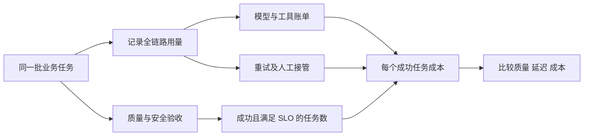

# Token 经济学：定价与成本的数学


> 面向要做模型选型、预算与成本优化的工程师。先分清 API 账单、推理服务成本与训练投入，再用带条件的价格快照和可复算的例子，把“每百万 token”换算成“每个成功任务”。产品数据采集于 2026-09-26，后续以官方价目页为准。

## 先分清三本账

| 账本 | 计算对象 | 不能直接推出什么 |
| --- | --- | --- |
| API 账单 | 输入、输出、缓存、工具、存储及服务档位 | 不能从零售价倒推厂商 GPU 成本或毛利 |
| 自建推理成本 | 设备或租赁、运行、运维、冗余、实际有效吞吐 | 单卡峰值跑分不等于生产可交付吞吐 |
| 模型研发投入 | 预训练、后训练、数据、试验与持续迭代 | 训练并非只发生一次；摊销方式取决于业务 |

价格还受供需、产品策略、地域与合同影响。不同模型的 tokenizer、推理 token、缓存和工具计费规则不同，同一段文本不一定产生相同的计费 token 数。



## 推理原理怎样影响成本

### 计算量近似的适用边界

稠密 Transformer 的参数矩阵前向计算常粗估为 `2N FLOPs/token`，训练可用 `6ND` 做数量级估计（N 为参数量，D 为训练 token 数）。这些近似省略注意力的上下文相关计算、具体架构、激活重算等开销。MoE 应分别考虑激活专家的计算与总权重的存储，不能把总参数直接代入所有计算项。参见 [Chinchilla 论文](https://arxiv.org/abs/2203.15556)。

Prefill 并行处理输入，通常能形成较大的矩阵运算；小批量 Decode 每次为各请求生成一个新 token，常受权重与 KV 读取带宽限制。大 batch、长上下文、稀疏注意力、专家通信和调度方式都会改变瓶颈，不能概括为“输出一定比输入长”或“Decode 永远只受带宽限制”。参见 [NVIDIA 推理优化说明](https://developer.nvidia.com/blog/mastering-llm-techniques-inference-optimization/)。

### 自建成本的分母必须满足 SLO

```text
每百万输出 token 的分摊成本
  = 同一统计窗口内的完整服务成本 ÷ 合格输出 token 数 × 1,000,000

每个成功任务成本
  = 模型 + 工具 + 检索/存储 + 重试 + 人工接管等成本
    ------------------------------------------------
          满足质量、安全与延迟要求的任务数
```

**假设算例，非实测报价**：两张卡合计 $5/小时，完整输入输出混合负载下持续交付合格输出 3,000 token/s，则卡租金分摊为 `5 ÷ (3000 × 3600) × 10⁶ ≈ $0.463/百万输出 token`。有效输出降至 300 token/s 时，分摊变为 $4.63。这还没计入主机、网络、存储、运维、容灾和空闲时段。

算例只能说明利用率的影响，不能证明某款 70B 模型具有该吞吐，也不能把分摊成本与 API 零售价之差当作供应商利润。自购设备计入折旧与资金占用；租云时避免再次计入设备购置成本。

电费可按 `IT 平均功率(kW) × 运行小时 × PUE × 电价` 估算。PUE 是设施总能耗与 IT 能耗之比，需使用该机房、该统计期的数据；GPU TDP 不是整机平均功率，也不能用行业平均 PUE 代替现场值。

## API 价格快照

以下为 **2026-09-26 访问的第一方 API 文本价格**，单位 **美元/百万 token**。这是计费示例，不是能力排名；未计税费、合同价、工具费用和地域附加费。短上下文与谷时的条件不可省略。

| 模型 / 实际服务版本 | 输入（未命中） | 输出 | 缓存读 | 条件与来源 |
| --- | ---: | ---: | ---: | --- |
| GPT-6 Astra | $10 | $50 | $1 | Standard 短上下文，[OpenAI 价格](https://developers.openai.com/api/docs/pricing) |
| GPT-6 Sol | $2 | $10 | $0.20 | Standard，输入不超过 272K，[模型说明](https://developers.openai.com/api/docs/models/gpt-6-sol) |
| GPT-6 Luna | $0.10 | $0.50 | $0.01 | Standard 短上下文，[OpenAI 价格](https://developers.openai.com/api/docs/pricing) |
| Claude Fable 5.1 | $10 | $50 | $0.25 | 标准档，[Claude 价格](https://platform.claude.com/docs/en/about-claude/pricing) |
| Claude Opus 5.5 | $4 | $20 | $0.20 | 标准档，同上 |
| Claude Sonnet 5 | $2 | $10 | $0.20 | 标准档，同上；下文算例使用此行 |
| Gemini 3.8 Flash | $0.75 | $3.75 | $0.075 | Standard，优惠至 2026-12-31，[Google 价格](https://ai.google.dev/gemini-api/docs/pricing) |
| DeepSeek-V4.1-Flash（`deepseek-flash`） | $0.15 / $0.30 | $0.60 / $1.20 | $0.003 / $0.006 | 谷时 / 峰时，[DeepSeek 价格](https://api-docs.deepseek.com/quick_start/pricing/) |
| DeepSeek-V4-Pro-0813 | $0.66 / $1.32 | $1.98 / $3.96 | $0.022 / $0.044 | 谷时 / 峰时，同上 |

DeepSeek 峰时为周一至周五 UTC 01:00–04:00、06:00–10:00（排除中国公共假期），其余为谷时。旧名称 `deepseek-v4-flash`、`deepseek-v4-flash-vision-exp` 虽仍可调用，实际已由 V4.1-Flash 服务，不能用旧名称复现实验版本。

百炼、火山、Azure、Bedrock 与 Vertex 的地区、部署和服务档位需单独选定。本轮不把尚未逐行重新核验的人民币报价混入表格；取价入口见文末。原有 9 月初价格表已由本表替换。

### 容易漏掉的条件

- **长上下文与处理档位**：GPT-6 Sol 超过 272K 输入时，整次请求输入与缓存价格为短档 2 倍、输出为 1.5 倍。缓存写为输入价 1.25 倍；Batch/Flex 为标准价 50%，Fast 为 2 倍。不能外推给所有 OpenAI 模型，也不能沿用“缓存没有写费”的旧假设。[模型计费规则](https://developers.openai.com/api/docs/models/gpt-6-sol)
- **缓存存储与优惠截止**：Gemini 3.8 Flash 优惠期内缓存存储为 $0.50/百万 token·小时，读取折扣不代表存储免费；页面列示 2027-01-01 起标准输入/输出为 $1.50/$7.50，仍需届时复核。[Google 计费规则](https://ai.google.dev/gemini-api/docs/pricing)
- **实际用量**：推理 token、联网搜索、代码容器、文件存储可能另计费。使用 API usage 与账单对账，不以可见文字长度代替用量。

## 缓存收益：计入首轮与过期

缓存减少重复 Prefill，但仍有存储、读取和后续注意力开销。缓存命中不等于零成本，也不能据此推断供应商的“纯毛利”。

以 Sonnet 5 的 5 分钟缓存为例：输入 $2、输出 $10、写 $2.50、读 $0.20/百万 token。**固定前缀算例**：每轮输入 12,000 token，其中 8,000 为稳定前缀、4,000 为不缓存的动态内容；输出 500 token，共 30 轮，后续请求均在 TTL 内命中。这里没有假设历史无限增长。

| 项目 | 不缓存 | 缓存固定前缀 |
| --- | ---: | ---: |
| 前缀 | 30 × 8,000 × $2/10⁶ = $0.4800 | 首写 8,000 × $2.50/10⁶ + 29 次读 × 8,000 × $0.20/10⁶ = $0.0664 |
| 动态输入 | 30 × 4,000 × $2/10⁶ = $0.2400 | $0.2400 |
| 输出 | 30 × 500 × $10/10⁶ = $0.1500 | $0.1500 |
| 合计 | **$0.8700** | **$0.4564** |

上述条件下节省约 **47.5%**。真实历史追加、重写、未命中与过期应分别计入，不能把首轮也算作命中。对于同一前缀、无过期的 n 次调用，缓存费用为 `前缀长度 × [写价 + (n−1) × 读价]`，不缓存为 `前缀长度 × n × 输入价`。价格需换算到每 token。

这组费率下，前缀复用一次即可抵消 5 分钟写入溢价，但整个请求的节省比例还取决于动态输入和输出。费率来源：[Claude Prompt caching pricing](https://platform.claude.com/docs/en/about-claude/pricing)。

## 从 token 成本到任务成本

以下是工程建议，需要使用同一业务任务集验证：

| 优化手段 | 适用条件 | 同时观察 |
| --- | --- | --- |
| 前缀稳定化 | 提示词、工具 schema、文档块会重复使用 | 命中、重写、TTL、版本隔离 |
| 模型路由 | 有可校准的任务难度判断 | 误分流、升级调用、成功率 |
| 控制上下文与输出 | 冗余可删除，任务允许摘要 | 引用遗漏、长程一致性、重试 |
| Batch / 谷时 | 任务允许等待 | 截止时间、失败重跑、配额 |
| 自建与量化 | 负载稳定且有运维能力 | 质量、P99、空闲和冗余成本 |

**对照算例**：A 每次 $0.02，100 次中 60 次通过验收；B 每次 $0.03，100 次中 95 次通过。暂不计重试与人工，成功任务成本分别约 $0.0333 与 $0.0316。单次更便宜并不意味着每个成功任务更便宜。

### 自建还是 API

可用 `月固定成本 ÷（API 每合格任务费用 − 自建每合格任务变动成本）` 粗估盈亏平衡任务量，前提是分母为正、质量与 SLO 相当、固定资源在这个任务量下仍有容量。超过容量需要扩容后重新计算。突发负载、长尾模型、灾备与运维投入可能改变结论。

## 价格趋势怎样用于预算

历史降价不能直接外推为未来承诺，标价也不能证明行业利润率。分别保留“当前合同/牌价”“官方公布的优惠结束条件”“用量增长、价格与缓存变化的情景假设”。敏感性分析至少改变任务量、输入输出长度、成功率和缓存命中，避免把“价格战结束”或“每年必降一个数量级”当作事实。

每次换模型、服务档位或提示词版本，记录：访问日期与来源、供应商/地区、模型 ID 与实际版本、币种、处理档位、上下文门槛、缓存读写及存储、优惠截止条件、工具费用、任务集质量与延迟。

## 常见坑

| 错误做法 | 修正方式 |
| --- | --- |
| 谷时价与另一家标准价直接排名 | 并列峰谷、延迟和配额条件 |
| 峰值输出吞吐乘以全天时长 | 使用代表性的混合负载与生产统计窗口 |
| 未验证的缓存命中率固定不变 | 从 usage 取样，并保留无缓存情景 |
| 用“开源”推断任意商用免费 | 分别核对权重许可、代码许可与托管服务收费 |
| 只换模型名，不重跑任务集 | 同步核对 tokenizer、工具协议、能力和计费变化 |

## 参考资料

<Refs>

价格来源访问日期：2026-09-26；本轮复核范围为上文明确列出的项目。

- [OpenAI API Pricing](https://developers.openai.com/api/docs/pricing) · [GPT-6 Sol 模型说明](https://developers.openai.com/api/docs/models/gpt-6-sol)
- [Claude API Pricing](https://platform.claude.com/docs/en/about-claude/pricing)
- [Gemini Developer API Pricing](https://ai.google.dev/gemini-api/docs/pricing)
- [DeepSeek Models & Pricing](https://api-docs.deepseek.com/quick_start/pricing/)
- 其他取价入口（需另选定地区与档位）：[百炼](https://help.aliyun.com/zh/model-studio/model-pricing) · [火山方舟](https://www.volcengine.com/product/ark) · [Bedrock](https://aws.amazon.com/bedrock/pricing/) · [Vertex AI](https://cloud.google.com/vertex-ai/generative-ai/pricing)
- 原理：[NVIDIA 推理优化](https://developer.nvidia.com/blog/mastering-llm-techniques-inference-optimization/) · [Chinchilla](https://arxiv.org/abs/2203.15556)
- 站内相关：[GPU 选型](/ai/infra/inference/gpu-sizing) · [推理服务](/ai/infra/inference/llm-inference) · [应用评测](/ai/application/evaluation) · [核验与更新记录](/about#updates)

</Refs>
