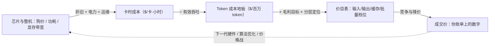
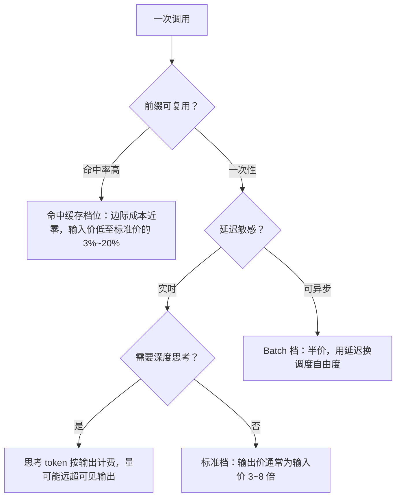

# Token 经济学：定价与成本的数学

> 写给要为大模型调用做预算、做厂商选型，或者被问过"token 定价是怎么设计出来的，跟算力电力有关系吗"的工程师与架构师。读完你能带走四样东西：一条从硬件到电费的完整成本链、一套可以手算的 FLOPs 数学（推理 2N、训练 6N）、一份主流厂商定价结构的读表指南（输入/输出差价、缓存折扣、Batch 折扣、思考 token 计费），以及一个判断——token 单价是持续下行变量，任何测算都要现拉口径。文中所有价格均为厂商公开价目口径，访问日期 2026-09-04。

## Token 定价是什么

一句话：**token 定价 = 算力成本映射 + 毛利 + 市场竞争**。它不是拍出来的数字，而是三层力量叠加的结果：

1. **成本地板**：芯片折旧、电力、运维摊销成卡时成本，卡时除以有效吞吐得到每 token 的成本地板。这一层由硬件代际、数据中心效率和**利用率**决定。
2. **毛利与分层**：厂商在成本地板上加毛利，并按模型规格分层——旗舰模型吃能力溢价，轻量模型薄利走量。价目表上输入/输出/缓存/批量的每一个档位，都是对不同成本结构的分别定价（下文展开）。
3. **市场竞争**：同档位能力平价化、开源模型冲击、新一代硬件的成本下降，都会触发降价。这是价格持续下行的主因。

从硬件到你账单上的单价，完整链条如下：



这条链上每一段都挂着一个决策：卡型与折旧年限决定成本地板（展开见 [GPU 选型与推理成本测算](/ai/infra/inference/gpu-sizing)）；利用率决定"有效"二字成不成立；毛利定位决定厂商敢不敢打价格战；而你作为买方，能撬动的是链末端——选档位、选模型、选调用方式。

## 为什么值得单独学

- **预算测算的底层语言**。客户问"这个应用一年 API 花多少钱"，答案 = 调用量 × 输入输出结构 × 单价。不懂档位结构（缓存命中、思考 token），账单能差出几倍。
- **自建还是租用的判断基础**。成本地板怎么算、毛利空间有多大，直接决定"调用量涨到多少时自建划算"。
- **面试高频题**。"定价跟算力电力有关系吗"考的不是背诵，而是能不能把 2N/6N 的 FLOPs 数学、带宽瓶颈、成本结构一路讲到价目表。

一个反直觉的结论先放在这里：**电力是真实的成本项，但不是主导项；主导项是硬件折旧**——这个判断有公开口径支撑，见成本结构一节。

## FLOPs 数学：参数怎么变成算力

### 推理前向：约 2N FLOPs/token

Transformer 的算力消耗几乎全在矩阵乘法上。一次矩阵乘 A(m×n)·B(n×p) 的 FLOPs 是 2mnp——"2"来自一次乘加是乘(1)+加(2)两个操作。由此可以逐层推：

- 每个 token 前向时，要与模型的**全部参数**做一次矩阵向量乘。每个参数贡献约 2 FLOPs，所以 **前向 ≈ 2N FLOPs/token**（N 为参数量）。逐层拆：QKV 投影 2·3d²、输出投影 2d²、FFN 2·8d²，合计每层 2·12d²，与 2N 相差不到 2%。这个推导与"矩阵乘 2mnp 约定"来自 kipp.ly 的经典文章（见参考资料）。
- **注意力修正项**：上面没算注意力本身。带 KV Cache 解码时，每生成一个 token，注意力要做 q·Kᵀ（2Sd）与 scores·V（2Sd），合计 **4SLd**（S=序列长度，L=层数，d=模型维度）。它随序列长度线性增长：短上下文时相对 2N 可忽略，长上下文时占比显著上升，这也是长上下文推理贵的算力原因之一。
- **MoE 模型用激活参数量**。稀疏激活模型每个 token 只过一部分参数，2N 里的 N 换成每 token 的激活参数量。

### 训练：约 6N FLOPs/token

训练一个 token 要前向一次（≈2N）加反向一次（梯度对激活与权重各求一遍，约为前向的 2 倍），合计 **≈6N FLOPs/token**，总训练算力 ≈ 6ND（D 为训练 token 数）。这个近似是 Kaplan 缩放定律与 Chinchilla 论文采用的口径：Chinchilla 原文明确写 `FLOPs(N,D) ≈ 6ND (Kaplan et al. 2020)`，并在附录逐架构核算，精确 FLOPs 与 6ND 的比值在 0.99~1.10 之间——即该近似误差在一成以内。

### 从 FLOPs 到延迟与成本：一个估算示例

拿一个典型 70B 稠密架构（80 层、d=8192）举例，INT8 部署、2 张 H100 SXM（规格口径见 [GPU 选型](/ai/infra/inference/gpu-sizing)）：

| 量 | 估算 | 结果 |
| --- | --- | --- |
| 每 token 前向算力 | 2N = 2×70e9 | 1.4e11 FLOPs |
| 纯算力耗时 | ÷ 有效算力 0.8 PFLOPS（FP8 稠密约 2 PFLOPS × MFU 40%） | ≈0.2 ms |
| Decode 权重搬运 | 70GB ÷ 聚合带宽 6.7TB/s | ≈10 ms/token |

两个数字差了约 60 倍：**decode 阶段算力只忙了零头，时间全花在把权重从显存搬进计算单元上——这是带宽受限，不是算力受限**。所以：

- **FLOPs 估算是必要非充分**。它给出算力需求的下界，但单流 decode 速度要按显存带宽算；显存容量与带宽的口径本站在 [GPU 选型与推理成本测算](/ai/infra/inference/gpu-sizing) 里已经展开，这里不重复。
- **Prefill 相反，是算力受限**：输入可以大并行、算术强度高，GPU 能吃饱。4096 token 的预填充约 5.7e14 FLOPs（注意力项此时约占 7%），同样按 0.8 PFLOPS 估算约 0.7 秒，符合常见的首字延迟量级；上下文到 32K 时，注意力项占比升到约四成，预填充算力随上下文近似平方增长。
- 这个不对称就是定价的经济基础：**输入（预填充）每 token 的算力效率高、可大规模并行；输出（解码）逐 token、被带宽卡着、算力利用率低**。

## 成本结构拆解：从卡时到 token

### 卡时成本的构成

```
卡时成本 ≈ 折旧 + 电力 + 运维（+ 网络/机柜等其他摊销）

折旧 = 卡价 ÷ 折旧年限 ÷ 8760 小时
电力 = 整机功耗(kW) × PUE × 电价
运维 ≈ 卡价 × 年维护费率 ÷ 8760
```

一篇 2025 年的公开论文（《Beyond Benchmarks: The Economics of AI Inference》）给了 A800 80G 的完整算例（卡价按 12 万元、折旧 3 年、功耗 0.4kW、PUE 1.5、电价 1.0 元/度、维护费率 3%，汇率 7.09）：

| 成本项 | 估算 | 占比 |
| --- | --- | --- |
| 折旧 | 120000 ÷ (3×8760) ÷ 7.09 ≈ $0.64/小时 | ~82% |
| 电力 | 0.4×1.5×1.0 ÷ 7.09 ≈ $0.08/小时 | ~10% |
| 运维 | 120000×0.03 ÷ 8760 ÷ 7.09 ≈ $0.06/小时 | ~8% |

结论：**折旧是绝对大头，电力显著但非主导**。注意这是"GPU 裸卡"口径，未含服务器、机柜、网络与人力；参数（尤其卡价与折旧年限）变化时比例会移动，但"折旧主导"的结构在我见过的多数测算里稳定成立。

### 电力的真实占比与 PUE

- **PUE**（Power Usage Effectiveness，电能利用效率）= 数据中心总电力 ÷ IT 设备电力，衡量制冷与配电的损耗。上面的算例用 PUE 1.5 乘在 GPU 功耗上，就是把"每用 1 度电算算力，还要多付 0.5 度给制冷配电"摊进来。
- 行业水平：Uptime Institute 2025 年全球数据中心调查的行业平均 PUE 约 **1.54**，多年徘徊不前；Google 公布的 2025 年机群平均 PUE 为 **1.09**——超大规模自建机房能把损耗压到行业的零头，这本身就是成本优势。
- 另一个口径：NVIDIA 官方博客（2026-06）称"电力可占 AI 工厂运营支出（OpEx）的高达 40%"。这与"折旧主导"不矛盾——OpEx 是运营支出口径，而折旧属于资本支出的摊销；NVIDIA 强调电力的原因很现实：很多站点的电力容量是硬上限，每一瓦都直接决定能卖多少 token。引用此类数字时，先问清楚口径。

### 利用率是最大的成本杠杆

同样的卡，利用率 100% 与 70%，每个"有效卡时"的成本差 43%（有效成本 = 名义成本 ÷ 利用率）。我做过的项目里，利用率假设的差异对测算结果的影响，远大于卡价或电价的差异。所有推理优化的经济学意义都可以归结为这一条：连续批处理把多个请求摊到同一次权重加载上、前缀缓存省掉重复预填充、PD 分离让两类硬件各自吃饱、Batch 折扣填谷——全是在抬利用率。吞吐与利用率怎么测，见[大模型推理部署实战](/ai/infra/inference/llm-inference)。

## 定价设计：价目表里的六个决定

这是面试必答题的核心。主流厂商的价目表结构高度趋同，下面逐一拆解设计逻辑。



### 1. 输入/输出为什么差价

前面的数学已经给出答案：预填充算力效率高、可大并行；解码带宽受限、逐 token 低效。输出价必须覆盖更贵的边际成本。**经验上输出价为输入价的 3~8 倍**（个别模型到 10 倍）——2026-09-04 核实的实例：Anthropic 全系输出/输入 = 5 倍；OpenAI GPT-5 家族 6~8 倍；百炼 qwen3-max 4 倍、qwen-flash 10 倍；DeepSeek-V4 系列 3 倍。

### 2. 缓存输入折扣：边际成本近零

前缀缓存命中时，这部分输入只需从缓存读 KV、跳过预填充计算，边际成本趋近于零，厂商于是给出大幅折扣，把"命中率"直接变成客户的价格激励：

| 厂商 | 缓存写入/创建 | 缓存命中 | 机制 |
| --- | --- | --- | --- |
| OpenAI（GPT-5 家族） | 不单独计费 | 标准输入价的 10% | 自动生效，≥1024 token |
| Anthropic（Claude 全系） | 标准输入价的 125%（5 分钟 TTL） | 标准输入价的 10% | 显式声明缓存断点 |
| 阿里云百炼（通义千问） | 显式缓存 125%；隐式免费 | 显式命中 10%；隐式命中通常 20% | 显式/隐式两种模式 |
| DeepSeek（V4 系列） | 含在未命中价内 | 约为未命中价的 3%（off-peak $0.007 vs $0.22/百万） | 自动，按峰谷分时计价 |

设计上的共性：写入略贵（补偿建缓存的预填充成本）、命中极便宜（接近纯毛利让渡换调用黏性）。多轮对话、Agent、RAG 这类高前缀复用的负载，实际单价可以远低于价目表标准价。

### 3. Batch API 折扣：用延迟换调度自由度

批处理档普遍半价：OpenAI Batch API 对 Global Standard 价 50% 折扣、24 小时内返回；Anthropic "Save 50% with batch processing"；百炼"Batch 调用半价"。逻辑不是慈善：异步请求给了调度器填谷的自由——塞进利用率低谷、与高优流量混跑、吃满批处理效率，本质是把利用率红利的一部分让给客户。DeepSeek 的做法更直接：同一模型分峰谷两档价，谷时半价（其价目表明示峰时为 UTC 工作日 01:00-04:00 与 06:00-10:00，即北京时间的白天高峰）。

### 4. 推理模型的思考 token 计费

推理模型会生成不可见（或被摘要）的思考链，它的计费方式是一个单独的定价决定：

| 厂商 | 计费方式 | 公开口径 |
| --- | --- | --- |
| OpenAI（o/GPT-5 系列） | 推理 token 不可见但占上下文，**按输出价计费** | 官方文档："billed as output tokens" |
| Anthropic（extended thinking） | 思考 token 按输出价计费；折叠或删减显示也照常计费 | 官方文档（另见 The Register 2026-08 报道转述） |
| 阿里云百炼（qwen-plus 等） | 思考模式输出单列价档：qwen-plus 思考输出 8 元/百万，非思考输出 2 元/百万 | 官方模型价格页 |
| DeepSeek（V4 系列） | 思考与非思考模式共用同一输出单价 | 官方定价页 |

坑在这里：思考模型一次调用生成的思考 token 经常是可见回答的数倍，且全按输出价计——**同样"问一个问题"，账单可能是普通模型的几倍**。测算时必须把思考预算（如 `budget_tokens`、`max_completion_tokens`）当成本变量管起来。

### 5. 按模型规格分层定价

旗舰/中端/轻量三层的能力与成本都不同，价目表自然分层（见下节价格表）。还有一层容易被忽略：**上下文长度分层**。百炼按 32K/128K/256K 分段定价（长段更贵）；Azure OpenAI 对 GPT-5.4 以 272K 上下文为界，长上下文档位价格翻倍。原因还是成本：长上下文的 KV Cache 显存占用与注意力算力（随 S 增长乃至平方增长）都显著上升。

### 6. 区域与服务档位

同模型不同部署也有价差：Azure 的 Data Zone 比 Global 贵约 10%、优先处理（Priority）档位约为标准价 2 倍；Anthropic 提供 1.1 倍的"仅限美国推理"选项。签合同时把部署档位写清楚，别拿 Global 标准价去对 Data Zone 账单。

## 价格现状与趋势

### 主流档位价格快照（公开价目口径，2026-09-04）

| 档位 | 模型（厂商） | 输入 | 输出 | 出/入倍数 | 价目来源 |
| --- | --- | --- | --- | --- | --- |
| 旗舰 | Claude Fable 5（Anthropic） | $10/百万 | $50/百万 | 5× | anthropic.com/pricing |
| 旗舰 | GPT-5.6-sol（Azure OpenAI，Global 标准） | $5/百万 | $30/百万 | 6× | Azure Retail Prices API |
| 旗舰 | qwen3.6-max-preview（百炼，≤128K） | ¥9/百万 | ¥54/百万 | 6× | help.aliyun.com 价格页 |
| 中端 | Claude Opus 5 / Sonnet 5 | $5 / $2 | $25 / $10 | 5× | anthropic.com/pricing |
| 中端 | GPT-5.4 / GPT-5.2 | $2.5 / $1.75 | $15 / $14 | 6× / 8× | Azure Retail Prices API |
| 中端 | qwen3-max（≤32K） | ¥2.5/百万 | ¥10/百万 | 4× | help.aliyun.com 价格页 |
| 轻量 | Claude Haiku 4.5 | $1/百万 | $5/百万 | 5× | anthropic.com/pricing |
| 轻量 | GPT-5.4-nano / GPT-5-nano | $0.2 / $0.05 | $1.25 / $0.4 | 6× / 8× | Azure Retail Prices API |
| 轻量 | qwen-flash（≤128K） | ¥0.15/百万 | ¥1.5/百万 | 10× | help.aliyun.com 价格页 |
| 轻量 | DeepSeek-V4-flash（off-peak，未命中） | $0.22/百万 | $0.66/百万 | 3× | api-docs.deepseek.com |

读表提示：均为标准价、未计缓存与批量折扣；美元与人民币按厂商原生币种列示；价格波动极大，表格只能用来看**结构与量级**，具体数字用前必须重拉。

### 趋势：同等能力的价格按指数下跌


*Epoch AI 按"达到同一基准分数的最低推理价格"测算的价格下降曲线（图中为各基准的中段趋势）。图源：[Epoch AI Data Insights: LLM inference prices have fallen rapidly but unequally across tasks](https://epoch.ai/data-insights/llm-inference-price-trends)（访问日期 2026-09-04）*

Epoch AI 的测算（2025-03）：固定能力水平下的推理价格，各基准的下降速度在每年 9 倍到 900 倍之间，**中位数约每年 50 倍**；达到 GPT-4 级 GPQA 表现的价格每年下降约 40 倍。最常被引用的定标点：GPT-3.5 级 MMLU 能力的推理成本从 2022 年 11 月的约 $20/百万 token 降到 2024 年 10 月的约 $0.07——两年超 280 倍，本站在[AI 大模型时代](/chronicle/ai-era)里讨论过它对应用生态的意义。

我的判断：**token 单价是持续下行变量**。驱动力是三重的——硬件代际（每代算力与带宽翻倍级提升）、算法与系统效率（量化、MoE、PD 分离、投机解码）、竞争（价格战与开源平价）。但两件事要同时记住：单价降不等于总账单降，调用量随 Agent 化负载爆炸式增长（Jevons 悖论，见[编年史](/chronicle/ai-era)的判断）；以及成本地板的下行速度决定降价空间——这也是为什么看一家厂商的价目表，最好同时看它的硬件与利用率故事。

## 常见坑

| 坑 | 现象 | 对策 |
| --- | --- | --- |
| 用旧报价测算 | 半年前的价格表算出的预算与真实账单差一个档位 | 每次测算前重拉厂商价目页，注明访问日期；把"价格快照时间"写进测算表头 |
| 不分输入/输出/缓存档位 | 用单一"平均单价"乘总 token，低估或高估数倍 | 按真实长度分布拆输入/输出；高前缀复用负载单列缓存命中比例 |
| 忽略思考 token | 推理模型账单比预期高几倍 | 思考链按输出价计费且量大；用推理预算参数封顶，账单监控区分可见输出与思考量 |
| 把电费当主导成本 | 高估电价敏感度，低估折旧与利用率的影响 | 按"折旧 ~8 成、电力 ~1 成"的公开算例建直觉；电力敏感场景再看 PUE 与电价 |
| 忽略利用率 | 按满负荷吞吐算成本，自建测算严重乐观 | 有效成本 = 名义成本 ÷ 利用率；利用率假设单独列为可调参数并做敏感性分析 |
| 把榜单吞吐当自己吞吐 | 引用基准的 tokens/s 与自家长尾负载差数倍 | 用自己的真实长度分布与并发压测；基准只用来做代际相对比较 |
| 假设缓存折扣必得 | 前缀多变导致命中率极低，账单回到标准价 | 把系统提示与知识前缀稳定化；监控命中率再谈折扣收益 |
| 用 Batch 价承诺在线延迟 | 拿半价档给客户报了实时 SLA | Batch/异步档位的折扣本质是延迟换价格，SLO 与档位要一一对应 |

## 小结

Token 定价不是市场玄学，而是一道可以拆开算的题：2N/6N 给出算力账，带宽与利用率把它变成成本地板，毛利与竞争把它变成价目表上的档位。看懂这条链，就看得懂为什么输出比输入贵、为什么缓存打到一折、为什么 Batch 半价、为什么思考 token 是新的计费变量。框架是稳定的，数字不是——每次做预算，重拉口径。

## 参考资料

<Refs>

**厂商公开价目**（访问日期均为 2026-09-04）

- [Anthropic Pricing](https://www.anthropic.com/pricing) —— Claude 全系输入/输出/缓存读/缓存写价格、"Save 50% with batch processing"
- [Azure OpenAI Service Pricing](https://azure.microsoft.com/en-us/pricing/details/azure-openai/) 与 [Azure Retail Prices API](https://prices.azure.com/api/retail/prices) —— GPT-5 家族 Global 标准价、缓存价、Batch 50% 折扣的机器可读口径（OpenAI 官网价目页有访问限制，本文采用微软官方渠道口径）
- [阿里云百炼：模型调用价格](https://help.aliyun.com/zh/model-studio/model-pricing) · [上下文缓存（Context Cache）](https://help.aliyun.com/zh/model-studio/context-cache) —— 千问系列分档价格、Batch 半价、隐式缓存约 20%/显式缓存命中 10%·写入 125%
- [DeepSeek API: Models & Pricing](https://api-docs.deepseek.com/quick_start/pricing) —— V4 系列峰谷分时价与缓存命中/未命中价
- [OpenAI Prompt Caching 指南](https://developers.openai.com/api/docs/guides/prompt-caching) —— 自动缓存、≥1024 token、最高 90% 折扣（经检索核实）
- [OpenAI Reasoning Models 指南](https://developers.openai.com/api/docs/guides/reasoning) —— "reasoning tokens ... are billed as output tokens"（经检索核实）
- [Claude Extended Thinking 文档](https://platform.claude.com/docs/en/build-with-claude/extended-thinking) · [The Register: Claude Code returns blank thinking blocks, but reasoning still costs you](https://www.theregister.com/ai-and-ml/2026/08/14/claude-code-returns-blank-thinking-blocks-but-reasoning-still-costs-you/5287557) —— 思考 token 按输出计费、删减显示仍计费（2026-08-14）

**FLOPs 数学与推理经济学**

- [Kaplan et al., Scaling Laws for Neural Language Models](https://arxiv.org/abs/2001.08361)（访问日期 2026-09-04）
- [Hoffmann et al., Training Compute-Optimal Large Language Models（Chinchilla）](https://arxiv.org/abs/2203.15556) —— `FLOPs(N,D) ≈ 6ND (Kaplan et al. 2020)`，精确核算与 6ND 比值 0.99~1.10（访问日期 2026-09-04）
- [kipply, Transformer Inference Arithmetic](https://kipp.ly/transformer-inference-arithmetic/) —— 矩阵乘 2mnp 约定、前向 2N 推导、KV Cache 与带宽受限分析（访问日期 2026-09-04）
- [How to Scale Your Model: All About Transformer Inference](https://jax-ml.github.io/scaling-book/inference/) —— prefill/decode 的 roofline 与算术强度（访问日期 2026-09-04）
- [Beyond Benchmarks: The Economics of AI Inference](https://arxiv.org/abs/2510.26136) —— 卡时成本公式与 A800 折旧/电力/运维算例（访问日期 2026-09-04）

**成本结构与能效**

- [NVIDIA: Maximize AI Factory Energy Efficiency](https://developer.nvidia.com/blog/maximize-ai-factory-energy-efficiency-through-full-stack-inference-and-training-optimizations/) —— "Power can account for 40% of OpEx"（2026-06-23，访问日期 2026-09-04）
- [Uptime Institute Global Data Center Survey Results 2025](https://uptimeinstitute.com/resources/research-and-reports/uptime-institute-global-data-center-survey-results-2025) —— 行业平均 PUE 约 1.54（经检索核实）
- [Google Data Centers: Power usage effectiveness](https://datacenters.google/efficiency/) —— Google 机群平均 PUE 1.09（经检索核实）

**价格趋势**

- [Epoch AI: LLM inference prices have fallen rapidly but unequally across tasks](https://epoch.ai/data-insights/llm-inference-price-trends) —— 固定能力价格年降中位数约 50 倍、GPT-3.5 级能力 $20→$0.07 的底层数据（访问日期 2026-09-04）

**图片来源**（访问日期 2026-09-04）

- [llm-inference-price-trends.png](/images/ai/token-economics/llm-inference-price-trends.png) ← Epoch AI Data Insights 页题图

**站内相关**：[GPU 选型与推理成本测算](/ai/infra/inference/gpu-sizing) · [大模型推理部署实战](/ai/infra/inference/llm-inference) · [AI 大模型时代](/chronicle/ai-era) · [推理与算力](/ai/infra/inference/)

</Refs>
