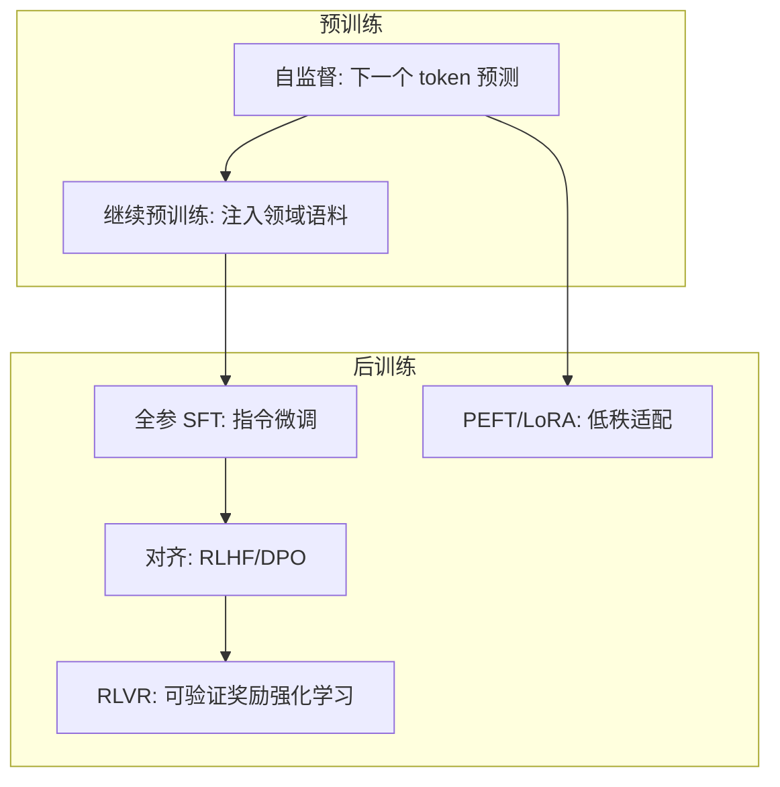

# 训练工程：从预训练到强化学习

> 训练是 AI Infra 的第一战场：预训练决定模型的能力天花板，后训练决定能力如何被"调教"成产品形态。这篇沉淀经手过开源模型全参后训练、LoRA 微调、强化学习与预训练项目的一线工程知识——每个范式不只是算法，更是一套不同的基础设施与成本结构。

## 训练范式全景



| 范式 | 改变什么 | 算力特征 | 典型场景 |
| --- | --- | --- | --- |
| 预训练 | 从零学语言与世界知识 | 千卡月级，成本极高 | 基座模型厂商 |
| 继续预训练 | 注入领域语料 | 高（预训练的 1-10%） | 行业基座（金融/医疗/代码） |
| 全参后训练（SFT） | 全量权重适配指令格式与任务 | 中（单机多卡到数十卡） | 深度定制、能力塑形 |
| LoRA/PEFT | 旁路低秩矩阵，冻结主干 | 低（单卡可跑 7B） | 风格/轻量领域适配、多租户 |
| RLHF/DPO | 人类偏好对齐 | 中高（奖励模型+采样） | 安全性与偏好塑造 |
| RLVR | 可验证奖励的强化学习 | 高（推理采样+训练混布） | 推理能力（数学/代码） |

实践口径：企业落地 90% 的需求落在 **SFT + LoRA** 区间；"要不要预训练"的答案几乎总是"不要"——除非有独占数据与长期投入。

## 预训练工程

### 数据是第一瓶颈

- **配比是学问**：网页/书籍/代码/百科/专业语料的比例直接影响能力分布——数据消融实验是预训练项目最贵的"实验"
- **清洗管线**：去重（文档级+行级）、质量过滤（分类器打分）、敏感信息处理——FineWeb 类公开实践证明了管线的价值
- **分片与调度**：数据按 shard 预切分，训练按计划消费——断点续训时要能精确恢复到数据位置

### 并行策略组合

```
数据并行（DP/ZeRO）扩吞吐 × 张量并行（TP）破单层显存
× 流水线并行（PP）破层数 × 专家并行（EP，MoE 专用）
× 上下文并行（CP，长序列）
```

- 经验序：**先定 TP（贴着机内拓扑），再定 PP（控制气泡），DP 铺满剩余算力**，长序列任务加 CP
- ZeRO 三档是显存与通信的权衡：优化器状态分片（省最多）→ 梯度分片 → 参数分片（通信最重）

### 稳定性工程

- **Loss 尖峰**：数据批次污染、学习率与 warmup 不匹配、数值溢出——需要有 spike 检测与自动跳过坏批次的机制
- **梯度范数监控**是最便宜的健康指标
- 硬件故障处理见 [GPU 集群与高速网络](/ai/infra/cluster)：容错四件套 + checkpoint 工程

## 全参后训练（SFT）工程

- **数据质量 > 数据数量**：千条高质量标注常胜过十万条噪音；数据格式一致性（对话模板、特殊标记）是被低估的坑
- **训练规模感**：7B 全参 SFT 单机 8 卡小时级完成；70B 需要数十卡——全参的账单主要在显存（参数+梯度+优化器状态 ≈ 16× 参数量字节，BF16+Adam 口径）
- **评估先行**：没有评测集的 SFT 是盲调——先建业务评测集（含负面用例），再谈训练
- **灾难性遗忘**：领域 SFT 可能损伤通用能力，需要通用集回归测试与数据配比对冲

## LoRA/PEFT 工程

- **原理**：冻结主干，在注意力/FFN 旁挂低秩矩阵（W + BA，秩 r 通常 8-256）——训练参数降到 1% 以下
- **超参经验**：秩越大表达力越强但越易过拟合；alpha/r 比例、目标模块选择（全挂 vs 只挂注意力）需要小步实验
- **工程优势**：一份基座 + 多个 LoRA 适配器 = 多租户多场景共享底座——部署侧可以动态热插拔适配器
- **局限**：能力上限低于全参；知识注入（学新事实）弱于风格/格式调整（学新行为）——注入知识优先选继续预训练或 RAG

## 强化学习工程

- **RLHF 管线**：偏好数据 → 奖励模型 → PPO（四模型同时在场：policy/reference/reward/critic）——显存与调度复杂度陡增
- **DPO 简化路线**：绕过奖励模型直接优化偏好——工程复杂度降一档，是当前对齐的默认起点
- **RLVR（可验证奖励）**：数学/代码等可自动判分任务，奖励由验证器给出——无需人工标注偏好，成为推理能力训练的主路线
- **基础设施新形态**：采样（rollout，推理特征）与训练（反向传播特征）交替或混布——推理引擎（vLLM 类）与训练引擎共处一池，资源分时复用，是当前训练平台的前沿课题

## RL 训练的基础设施新课题（2026 前沿）

- **三主体失配是核心矛盾**：RL 系统由生成器（推理采样）、环境、训练器构成——rollout 吞吐与训练吞吐的失配是当前最大瓶颈
- **混布 vs 分离**：
  - 混布（colocated）：训练与 rollout 共用 GPU，权重就地可用，适合中小规模（veRL/OpenRLHF 默认形态）
  - 分离（disaggregated）：rollout 用独立推理池（可低精度/异构卡），训练池专注反向，权重同步走 RDMA——规模化方向
- **长程/Agent RL 的增量要求**：单条轨迹从"解题"变成"小时级环境交互"，rollout:train 算力比持续上升；需要异步权重更新、大规模环境池编排、轨迹级容错（环境崩溃不影响训练）
- **效率基准参考**：MegaScale 万卡训练 MFU 55.2%；业界大规模预训练常态 35–50%

## 微调决策框架（SA 视角)

1. **先评测后微调**：基座 + RAG/Prompt 能达到 80 分，就不要为最后 10 分付微调的成本
2. **目标定路线**：调行为风格 → LoRA；注入领域知识 → 继续预训练或 RAG；塑推理能力 → RLVR
3. **算清总账**：微调成本 = 训练算力 + 数据标注 + **持续维护**（基座每次升级，微调要重做）——最后一项最容易被漏算
4. **交付物是管线不是模型**：可复现的数据版本 + 训练配置 + 评测报告，比单个模型权重值钱

## 精选资源

> 更新于 2026-09-02。

- [DeepSeek-V3 Technical Report](https://arxiv.org/abs/2412.19437) — 千亿 MoE 低成本训练全复盘（2024 · 论文）
- [The Llama 3 Herd of Models](https://arxiv.org/abs/2407.21783) — 1.6 万卡预训练过程与故障复盘（2024 · 论文）
- [MegaScale](https://arxiv.org/abs/2402.15627) — 万卡训练：故障诊断、检查点与容错（2024 · 论文）
- [LoRA: Low-Rank Adaptation of Large Language Models](https://arxiv.org/abs/2106.09685) — 低秩微调奠基（2021 · 论文）
- [Practical Tips for Finetuning LLMs Using LoRA](https://magazine.sebastianraschka.com/p/practical-tips-for-finetuning-llms) — 超参调优实操（2023 · 工程博客）
- [DPO 原论文](https://arxiv.org/abs/2305.18290) — 直接偏好优化（2023 · 论文）
- [从 RLHF 到 DPO：对齐算法原理对比](https://developer.aliyun.com/article/1559136) — 中文推导清晰（2024 · 工程博客）
- [FineWeb](https://huggingface.co/spaces/HuggingFaceFW/blogpost-fineweb-v1) — 15T token 语料管线全公开（2024 · 工程博客）
- [The Big LLM Architecture Comparison](https://magazine.sebastianraschka.com/p/the-big-llm-architecture-comparison) — 主流架构对比（2025 · 工程博客）
- [【LLM 003】并行训练汇总](https://zhuanlan.zhihu.com/p/647133493) — 中文并行策略梳理（2023 · 工程博客）

## 衔接

- 硬件底座：[GPU 集群与高速网络](/ai/infra/cluster) · 下游：[推理与算力](/ai/infra/inference/) · 模型视角：[模型架构演进](/ai/models/)
