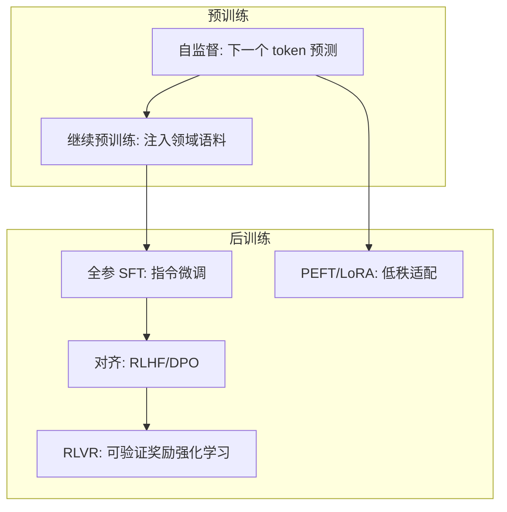
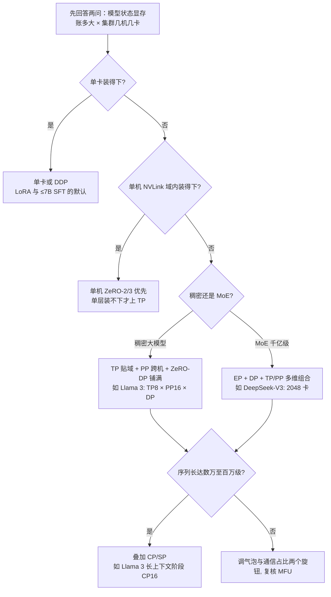

# 训练工程：从预训练到强化学习

> 训练是 AI Infra 的第一战场：预训练决定模型的能力天花板，后训练决定能力如何被"调教"成产品形态。这篇沉淀经手过开源模型全参后训练、LoRA 微调、强化学习与预训练项目的一线工程知识——每个范式不只是算法，更是一套不同的基础设施与成本结构。

## 训练范式全景

| 范式 | 改变什么 | 算力特征 | 典型场景 |
| --- | --- | --- | --- |
| 预训练 | 从零学语言与世界知识 | 千卡月级，成本极高 | 基座模型厂商 |
| 继续预训练 | 注入领域语料 | 高（预训练的 1-10%） | 行业基座（金融/医疗/代码） |
| 全参后训练（SFT） | 全量权重适配指令格式与任务 | 中（单机多卡到数十卡） | 深度定制、能力塑形 |
| LoRA/PEFT | 旁路低秩矩阵，冻结主干 | 低（单卡可跑 7B） | 风格/轻量领域适配、多租户 |
| RLHF/DPO | 人类偏好对齐 | 中高（奖励模型+采样） | 安全性与偏好塑造 |
| RLVR | 可验证奖励的强化学习 | 高（推理采样+训练混布） | 推理能力（数学/代码） |

实践口径：企业落地 90% 的需求落在 **SFT + LoRA** 区间；"要不要预训练"的答案几乎总是"不要"——除非有独占数据与长期投入。

## 并行策略全景

并行的本质是一句话：**把模型状态与计算切开，映射到分层带宽上**——通信最重的切法放进机内 NVLink 域，最轻的才允许跨机。五个维度各回答一个不同的问题：

| 维度 | 切什么 | 通信形态 | 关键约束 |
| --- | --- | --- | --- |
| 数据并行 DP/ZeRO | 数据批次 | 梯度 all-reduce/reduce-scatter，可与反向重叠 | 最通用，随卡数线性扩吞吐 |
| 张量并行 TP | 层内权重矩阵 | 每层前反向共 4 次 all-reduce | 延迟敏感，限 NVLink 域内 |
| 流水线并行 PP | 层间分段 | 相邻段点对点传激活 | 气泡占比 ≈ (p−1)/m |
| 专家并行 EP | MoE 专家分布 | token all-to-all 分发/回收 | 负载均衡是生死线 |
| 上下文并行 CP | 序列维度 | K/V 环传 或 注意力头 all-to-all | 长序列（数万 token 以上）才值 |

### 数据并行与 ZeRO：把优化器状态切掉

朴素数据并行（DDP）：每张卡持完整模型副本，各自消费不同数据批次，反向后对梯度做一次 all-reduce 再各自更新——PyTorch DDP 把梯度按桶（bucket）组织，让通信与反向计算重叠，因此 DP 的扩展性是所有维度里最好的。但每卡都要背全套模型状态，显存账算不过来：混精训练（BF16 权重 + Adam）下，每个参数要存 BF16 权重 2 字节 + BF16 梯度 2 字节 + FP32 优化器状态 12 字节（权重副本 4 + 动量 4 + 方差 4），合计 **16Ψ 字节**（Ψ 为参数量）。

ZeRO 的洞察：优化器状态和梯度**只在参数更新那一瞬间需要**，没必要每卡冗余一份，按 DP 组分片即可，于是有三档（论文图 1 以 Ψ=7.5B、DP=64 为例）：

*图源：ZeRO 论文 Figure 1（[arXiv:1910.02054](https://arxiv.org/abs/1910.02054)，访问日期 2026-09-04）*

- **ZeRO-1（P_os，优化器状态分片）**：单卡 4Ψ + 12Ψ/Nd——上例从 120GB 降到约 31GB，Nd 足够大时逼近 4 倍节省
- **ZeRO-2（+梯度分片）**：2Ψ + 14Ψ/Nd——约 16.6GB，逼近 8 倍节省
- **ZeRO-3（+参数分片）**：16Ψ/Nd——约 1.9GB，节省随卡数线性增长；代价是前反向都要临时 all-gather 参数，论文通信分析口径下通信量比 DP 基线高约 50%

经验就是那句权衡：**ZeRO 三档是显存与通信的权衡——优化器状态分片省最多、通信零增量，参数分片省得彻底、通信最重**。PyTorch FSDP 即 ZeRO-3 思想的官方实现（DDP/FSDP 的系统性总结见 PyTorch Distributed 论文），Megatron 一侧对应 Distributed Optimizer。

### 张量并行：层内横切

单层权重超过单卡显存（或单层计算成为瓶颈）时，把矩阵本身切开。Megatron 的经典切法：MLP 第一个 GEMM 按列切、第二个按行切，前向只需一次 all-reduce；注意力按头数天然可切。

*图源：Megatron-LM 论文 Figure 3(a)（[arXiv:1909.08053](https://arxiv.org/abs/1909.08053)，访问日期 2026-09-04）*

*图源：Megatron-LM 论文 Figure 3(b)（[arXiv:1909.08053](https://arxiv.org/abs/1909.08053)，访问日期 2026-09-04）*

通信代价是 TP 的命门：**每个 Transformer 层前向+反向共 4 次 all-reduce**（Megatron 论文 Figure 4 口径），通信量与 batch×隐藏维度成正比，且在关键路径上、无法重叠——它对带宽和延迟双敏感。机间网络比机内 NVLink 慢一到两个数量级，所以**经验上 TP 度数不超过单个 NVLink 域（8 卡，超节点时代可到 72/144 卡），几乎从不跨机**；我见过的多数训练性能事故，根因都是把 TP 拆到了域外。

### 流水线并行：层间纵切

把模型按层切成 p 段（stage）放到不同卡组，靠 micro-batch 流水起来：一个 global batch 拆成 m 个 micro-batch，各段交替执行 1F1B（一前一后）调度。代价是气泡：稳态下约 **(p−1)/m** 的时间浪费在等待上——段数越多显存越省，micro-batch 越多气泡越小，两者都受总卡数约束。工程上 PP 的切分还要考虑各段参数量/激活量的均衡，否则出现"木桶段"。

### 专家并行：MoE 的专属维度

MoE 把 FFN 换成 N 个专家、每个 token 只路由到 top-k 个，于是多了一个天然切分维度：**专家分布在不同卡上，靠 all-to-all 把 token 分发到目标专家、再把结果收回来**。EP 的难点不在通信模式而在**负载均衡**——专家冷热不均既浪费算力又导致路由坍缩，主流方案从辅助损失（aux loss）走向免辅助损失的无偏平衡（DeepSeek-V3 公开了这条路线）。DeepSeek-V3 在 2048 卡上用大规模 EP+DP 组合训练 671B 总参模型；而 GB200 NVL72 这类超大域的意义正在于此——**域越大，EP 可铺开的专家数越多**。

### 上下文并行与序列并行：长序列的两条路

- **序列并行（SP）**：TP 把注意力与 MLP 切了，但 LayerNorm/Dropout 的激活仍是每卡全量副本；Megatron 的方案是把这些算子的激活沿序列维切开，与 TP 组合后激活显存再降，几乎不增加通信（可视为 TP 通信的重排）
- **上下文并行（CP）**：把序列本身切到多卡。两条技术路线：Ulysses 式（注意力头维度 all-to-all，通信少但对头数有整除约束）与 Ring 式（K/V 块沿环传递，任意切分度）；实践中常混用。Llama 3 训练 405B 的 131K 长上下文阶段即切到 CP16

### 组合决策：从 3D 到 5D

| 场景 | 模型规模 | 机器规模 | 推荐组合 |
| --- | --- | --- | --- |
| 小规模微调 | ≤7B | 1 卡–1 机 | DDP；LoRA 单卡即可 |
| 中大规模全参后训练 | 7B–70B | 1–4 机 | ZeRO-3（FSDP）为主 |
| 稠密百亿–千亿预训练 | 100B–400B | 数百至万卡 | TP8 × PP × ZeRO-DP（Llama 3 口径 TP8×PP16×DP64–128） |
| MoE 万亿参数级 | 总参 600B+ | 数千卡 | EP + DP，按需叠加 TP/PP（DeepSeek-V3 口径） |
| 长上下文训练 | 任意 | 同上 | 以上组合叠加 CP（131K 序列 Llama 3 用 CP16） |

经验序不变：**先定 TP（贴着机内拓扑），再定 PP（控制气泡），DP/ZeRO 铺满剩余算力**，MoE 加 EP，长序列加 CP。

## 预训练工程

### 数据是第一瓶颈

- **配比是学问**：网页/书籍/代码/百科/专业语料的比例直接影响能力分布——数据消融实验是预训练项目最贵的"实验"
- **清洗管线**：去重（文档级+行级）、质量过滤（分类器打分）、敏感信息处理——FineWeb 类公开实践证明了管线的价值
- **分片与调度**：数据按 shard 预切分，训练按计划消费——断点续训时要能精确恢复到数据位置

### 稳定性与容错

- **Loss 尖峰**：数据批次污染、学习率与 warmup 不匹配、数值溢出——需要有 spike 检测与自动跳过坏批次的机制
- **梯度范数监控**是最便宜的健康指标
- **Checkpoint 工程**：万卡量级故障是常态而非意外，异步保存 + 高频小步增量是标配；容错四件套（故障检测、快速诊断、自动隔离、秒级恢复）与集群网络设计耦合很深，展开见 [GPU 集群与高速网络](/ai/infra/cluster)，此处不重复

## 混合精度：BF16 常态与 FP8 现状

- **BF16 是当下默认**：指数位与 FP32 同宽（8 位），动态范围够大、不需要 loss scaling；权重/梯度/激活用 BF16、master weights 与优化器状态留 FP32，这套混精配方自 Ampere 起就是预训练与后训练的常态
- **FP8 两格式**：E4M3（精度高、动态范围小，用于权重与前向）与 E5M2（用于梯度），由 NVIDIA TransformerEngine 在 Hopper 一代引入官方支持
- **FP8 难在数值稳定**：位宽砍半后必须引入细粒度缩放因子。**DeepSeek-V3 是首个公开的大规模 FP8 预训练**——128×128 块级缩放、提高 GEMM 累加精度、在线量化（其技术报告 §3.3 全量披露）；更早的 FP8-LM 论文（微软/英伟达）给出了逐层缩放的基础方法
- **2026-09 现状（官方口径）**：FP8 已是 Hopper/Blackwell 大规模预训练的默认配方之一；Blackwell 新增 MXFP8 与 NVFP4 硬件支持（TransformerEngine 官方文档），英伟达已公开 NVFP4 预训练研究（arXiv:2509.25149），前沿正探向 4 比特
- **实践口径**：FP8 的收益在千卡级预训练/继续预训练才划算，数值调试成本高；企业中小规模微调不必追，BF16 足够

## 算力与显存的取舍：梯度累积与激活重计算

**梯度累积**：global batch = micro-batch × 累积步数 × DP 宽度。它把"有效批大小"与"单卡显存"解耦：显存不够就攒 N 步再更新一次参数；顺带降低通信频率（N 步才同步一次梯度），对小集群与慢网络友好。代价只有墙钟时间——累积是串行的，且学习率与 warmup 要按真正的 global batch 调。

**激活重计算**：激活显存与 层数×序列长×批大小 成正比，是长序列训练的第一显存大户。两条路：

- **全量重计算（full checkpoint）**：只存层输入，反向时整层重算——省显存但多付约一次前向的计算（反向总开销约增 1/3）
- **选择性重计算**：只重算"激活占比大、重算又便宜"的注意力层。Megatron 官方论文给出的实测：激活显存降 5 倍、重计算开销降 90%+，530B 模型 2240 张 A100 上 MFU 从 42.1% 提到 54.2%（arXiv:2205.05198）

一线默认：主流框架（Megatron-Core、FSDP2 activation checkpointing）都内置选择性策略；显存紧张时先开重计算，算力紧张时再还回去——这两档旋钮和 ZeRO 档位一样，是"拿一种资源换另一种资源"。

## 效率口径：MFU 与 HFU

衡量训练系统效率的通用语言是 PaLM 论文定义的 **MFU（Model FLOPs Utilization）**：观测吞吐折算的 FLOPs/s（常按 6ND 估算）÷ 硬件峰值 FLOPs/s。它**只算模型"该用"的前反向 FLOPs，不含重计算**；更早的 Gopher 论文用的 **HFU** 则把重计算 FLOPs 也算进去——对比不同论文的效率数字，先看口径是哪一个。注意 MFU 的估算通常不含注意力项，长序列、小 batch 场景下会低估实际干的活。

公开水位（均注明出处）：

| 系统 | 硬件 | MFU/HFU | 来源 |
| --- | --- | --- | --- |
| PaLM 540B | 6144×TPU v4 | MFU 46.2% / HFU 57.8% | PaLM 论文（arXiv:2204.02311） |
| Megatron 530B + 选择性重计算 | 2240×A100 | MFU 54.2% | arXiv:2205.05198 |
| Llama 3 405B | 16K×H100，BF16 | 38–43%（8K 序列 43% → 131K 序列 38%） | Llama 3 论文 |
| MegaScale | 12288 GPU | 55.2% | MegaScale（arXiv:2402.15627） |
| DeepSeek-V3 | 2048×H800，MoE+FP8 | 约 21–23%（论文未自述，Epoch AI 等第三方估算） | 见参考资料 |

两个解读：其一，**MFU 不等于性价比**——FP8 峰值更高、卡时更便宜，低 MFU 的 FP8 训练总成本可能更优（DeepSeek-V3 即例）；其二，稠密到 MoE、BF16 到 FP8，MFU 数字普遍下台阶（all-to-all 通信、专家不均、缩放开销），跨代际跨精度直接比 MFU 没有意义。

## 全参后训练（SFT）工程

- **数据质量 > 数据数量**：千条高质量标注常胜过十万条噪音；数据格式一致性（对话模板、特殊标记）是被低估的坑
- **训练规模感**：7B 全参 SFT 单机 8 卡小时级完成；70B 需要数十卡——全参的账单主要在显存（参数+梯度+优化器状态 ≈ 16× 参数量字节，BF16+Adam 口径）
- **评估先行**：没有评测集的 SFT 是盲调——先建业务评测集（含负面用例），再谈训练
- **灾难性遗忘**：领域 SFT 可能损伤通用能力，需要通用集回归测试与数据配比对冲

## LoRA/PEFT 工程

- **原理**：冻结主干，在注意力/FFN 旁挂低秩矩阵（W + BA，秩 r 通常 8-256）——训练参数降到 1% 以下
- **超参经验**：秩越大表达力越强但越易过拟合；alpha/r 比例、目标模块选择（全挂 vs 只挂注意力）需要小步实验
- **工程优势**：一份基座 + 多个 LoRA 适配器 = 多租户多场景共享底座——部署侧可以动态热插拔适配器
- **局限**：能力上限低于全参；知识注入（学新事实）弱于风格/格式调整（学新行为）——注入知识优先选继续预训练或 RAG

## 强化学习工程

- **RLHF 管线**：偏好数据 → 奖励模型 → PPO（四模型同时在场：policy/reference/reward/critic）——显存与调度复杂度陡增
- **DPO 简化路线**：绕过奖励模型直接优化偏好——工程复杂度降一档，是当前对齐的默认起点
- **RLVR（可验证奖励）**：数学/代码等可自动判分任务，奖励由验证器给出——无需人工标注偏好，成为推理能力训练的主路线
- **基础设施新形态**：采样（rollout，推理特征）与训练（反向传播特征）交替或混布——推理引擎（vLLM 类）与训练引擎共处一池，资源分时复用，是当前训练平台的前沿课题

## RL 训练的基础设施新课题（2026 前沿）

- **三主体失配是核心矛盾**：RL 系统由生成器（推理采样）、环境、训练器构成——rollout 吞吐与训练吞吐的失配是当前最大瓶颈；而 rollout 的生成长度天然重尾，**一个 step 的时长被最慢的长尾轨迹决定**，批式同步架构下 GPU 空转严重
- **混布 vs 分离**：
  - 混布（colocated）：训练与 rollout 共用 GPU，权重就地可用，适合中小规模（veRL/OpenRLHF 默认形态）
  - 分离（disaggregated）：rollout 用独立推理池（可低精度/异构卡），训练池专注反向，权重同步走 RDMA——规模化方向
- **异步化是分离的下一步**：蚂蚁集团公开的 AReaL 系统（NeurIPS 2025）把生成与训练完全解耦、用"陈旧度控制"（staleness control）与陈旧度增强 PPO 保证收敛，论文报告相比同卡数同步系统最高 2.77 倍训练加速；长程/Agent RL 下单条轨迹变成小时级环境交互，rollout:train 算力比持续上升，异步权重更新、大规模环境池编排、轨迹级容错（环境崩溃不影响训练）都成了硬需求

## 微调决策框架（SA 视角)

1. **先评测后微调**：基座 + RAG/Prompt 能达到 80 分，就不要为最后 10 分付微调的成本
2. **目标定路线**：调行为风格 → LoRA；注入领域知识 → 继续预训练或 RAG；塑推理能力 → RLVR
3. **算清总账**：微调成本 = 训练算力 + 数据标注 + **持续维护**（基座每次升级，微调要重做）——最后一项最容易被漏算
4. **交付物是管线不是模型**：可复现的数据版本 + 训练配置 + 评测报告，比单个模型权重值钱

## 参考资料

<Refs>

**论文**（访问日期 2026-09-04）

- [ZeRO: Memory Optimizations Toward Training Trillion Parameter Models](https://arxiv.org/abs/1910.02054) —— ZeRO 三档分片原理与显存账、通信分析
- [Megatron-LM: Training Multi-Billion Parameter Language Models Using Model Parallelism](https://arxiv.org/abs/1909.08053) —— 张量并行切分与通信开销的原始论文
- [PyTorch Distributed: Experiences on Accelerating Data Parallel Training](https://arxiv.org/abs/2006.15704) —— DDP/FSDP 的系统性总结
- [Reducing Activation Recomputation in Large Transformer Models](https://arxiv.org/abs/2205.05198) —— 序列并行 + 选择性激活重计算，54.2% MFU 实测
- [PaLM: Scaling Language Modeling with Pathways](https://arxiv.org/abs/2204.02311) —— MFU/HFU 口径定义（附录 B）
- [FP8-LM: Training FP8 Large Language Models](https://arxiv.org/abs/2310.18313) —— FP8 混精训练基础方法
- [DeepSpeed Ulysses](https://arxiv.org/abs/2309.14509) / [Ring Attention](https://arxiv.org/abs/2310.01889) —— 上下文并行两条路线
- [AReaL: A Large-Scale Asynchronous Reinforcement Learning System for Foundation Reasoning Models](https://arxiv.org/abs/2505.24298) —— 全异步 RL 训练、陈旧度控制（NeurIPS 2025）
- [DeepSeek-V3 Technical Report](https://arxiv.org/abs/2412.19437) —— 千亿 MoE 低成本训练全复盘、FP8 训练章节（2024）
- [The Llama 3 Herd of Models](https://arxiv.org/abs/2407.21783) —— 1.6 万卡预训练：4D 并行配置表与故障复盘（2024）
- [MegaScale](https://arxiv.org/abs/2402.15627) —— 万卡训练：55.2% MFU、故障诊断、检查点与容错（2024）
- [LoRA: Low-Rank Adaptation of Large Language Models](https://arxiv.org/abs/2106.09685) —— 低秩微调奠基（2021）
- [DPO 原论文](https://arxiv.org/abs/2305.18290) —— 直接偏好优化（2023）
- [Pretraining Large Language Models with NVFP4](https://arxiv.org/html/2509.25149v2) —— 4 比特预训练前沿（2025）

**官方文档与工程博客**（访问日期 2026-09-04）

- [DeepSpeed 官方：ZeRO](https://www.deepspeed.ai/zero/) —— ZeRO 三档与 ZeRO++ 官方说明
- [NVIDIA TransformerEngine：Using FP8 and FP4](https://docs.nvidia.com/deeplearning/transformer-engine/user-guide/examples/fp8_primer.html) —— FP8/MXFP8/NVFP4 官方口径
- [What is the MFU for DeepSeek-V3 training?](https://medium.com/@dlrover/what-is-the-mfu-for-deepseek-v3-training-0d9ea4d42eb4) / [Epoch AI：What went into training DeepSeek-R1?](https://epochai.substack.com/p/what-went-into-training-deepseek) —— DeepSeek-V3 MFU 第三方估算
- [Practical Tips for Finetuning LLMs Using LoRA](https://magazine.sebastianraschka.com/p/practical-tips-for-finetuning-llms) —— 超参调优实操（2023）
- [FineWeb](https://huggingface.co/spaces/HuggingFaceFW/blogpost-fineweb-v1) —— 15T token 语料管线全公开（2024）
- [The Big LLM Architecture Comparison](https://magazine.sebastianraschka.com/p/the-big-llm-architecture-comparison) —— 主流架构对比（2025）
- [The Ultra-Scale Playbook](https://huggingface.co/spaces/nanotron/ultrascale-playbook) —— 大规模训练系统经验汇编（2025）
- [从 RLHF 到 DPO：对齐算法原理对比](https://developer.aliyun.com/article/1559136) —— 中文推导清晰（2024）
- [【LLM 003】并行训练汇总](https://zhuanlan.zhihu.com/p/647133493) —— 中文并行策略梳理（2023）

**图片来源**（访问日期 2026-09-04）

- [zero-memory-sharding.png](/images/ai/training/zero-memory-sharding.png) ← ZeRO 论文 Figure 1（arXiv:1910.02054）
- [megatron-tp-mlp.png](/images/ai/training/megatron-tp-mlp.png) ← Megatron-LM 论文 Figure 3(a)（arXiv:1909.08053）
- [megatron-tp-attention.png](/images/ai/training/megatron-tp-attention.png) ← Megatron-LM 论文 Figure 3(b)（arXiv:1909.08053）

**站内相关**：[GPU 集群与高速网络](/ai/infra/cluster) · [推理与算力](/ai/infra/inference/) · [模型架构演进](/ai/models/)

</Refs>
