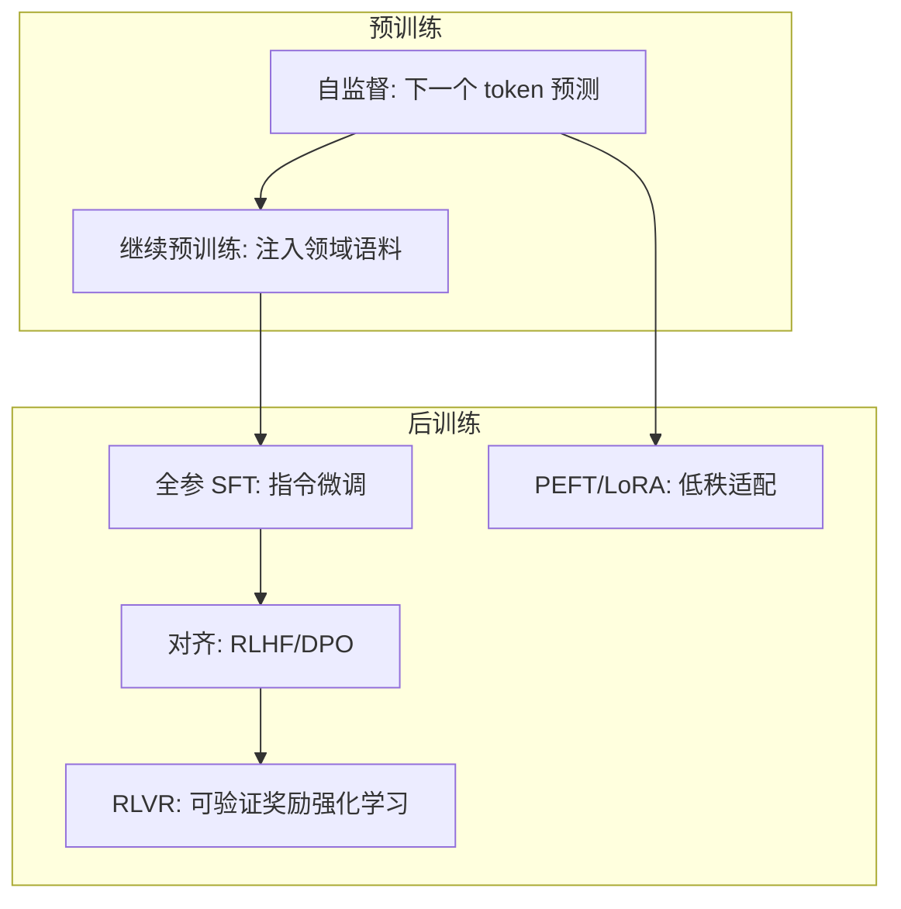
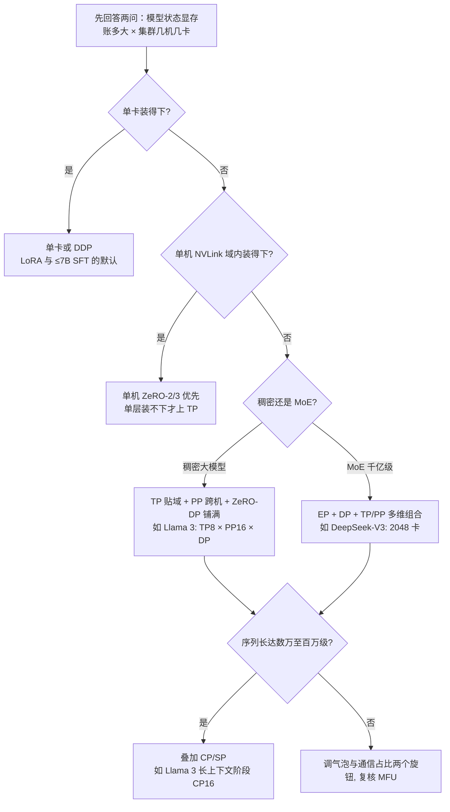
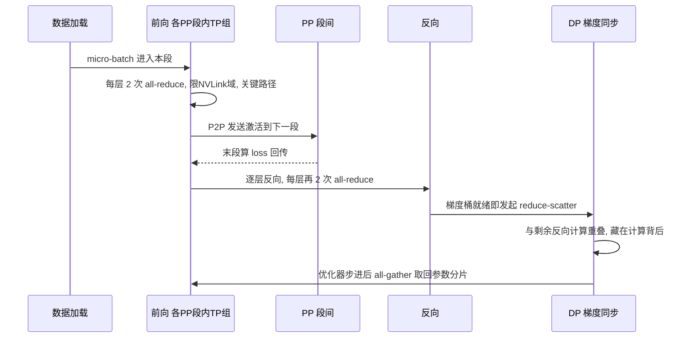
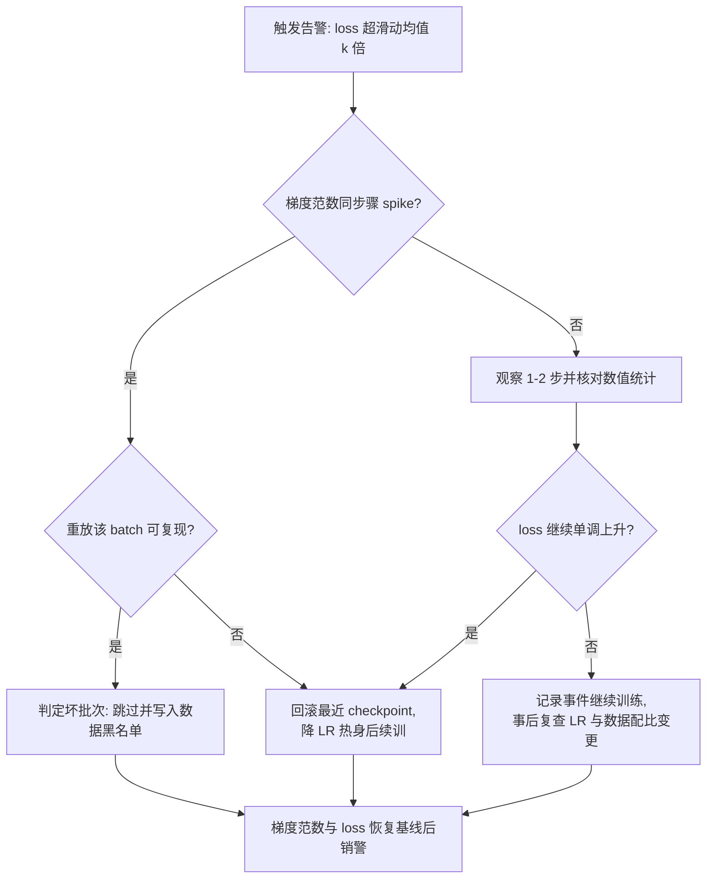

# 训练工程：从预训练到强化学习

> 面向要搭训练平台、跑大模型后训练、或评估自研预训练可行性的工程师与方案架构师。全文主线是一本账——**显存与互联带宽**：五个并行维度各自拿什么换什么、切走账本里的哪一项；什么规模该上什么组合；组合定了之后如何把训练跑稳（检查点、断点续训、loss 尖峰）与跑快（MFU 口径与优化抓手）。读完你能独立算清任意模型规模的显存账、从决策表里读出并行组合、并知道预训练 / SFT / 强化学习三个阶段在基础设施上到底差在哪。截至 2026-09，业界常态是"BF16 混精为默认、FP8 在千卡级规模化、MoE 与长上下文成为主流模型形态"，文中数字均标注口径与出处。

## 显存账：GPU 内存都花在哪

谈并行之前先算显存账——**所有并行策略的存在意义，就是为了把这本账里的某几项切掉或摊薄**。训练时 GPU 显存由四块构成：模型状态（权重、梯度、优化器状态）、激活值、通信缓冲与框架开销。前三块都能算，算清了并行的选择就不是信仰问题而是算术问题。

### 模型状态：每参数 16 字节

混合精度训练（BF16 计算 + FP32 master weights + Adam 族优化器）这套主流配方下，每个参数的存储成本是固定的：

| 组成 | 精度 | 每参数字节 | 说明 |
| --- | --- | --- | --- |
| 权重（计算副本） | BF16 | 2 | 前向/反向参与计算 |
| 梯度 | BF16 | 2 | 反向聚合结果 |
| Master weights | FP32 | 4 | 参数更新在 FP32 上做，再转回 BF16 |
| 一阶动量 | FP32 | 4 | Adam 的 momentum |
| 二阶动量 | FP32 | 4 | Adam 的 variance |
| **合计** | — | **16** | 即 ZeRO 论文里的 16Ψ 口径（Ψ 为参数量） |

按参数量展开（1B = 10 亿参数，GB 按十进制量级估算，够用）：

| 模型规模 | 权重+梯度 4Ψ | 优化器状态 12Ψ | 模型状态合计 16Ψ |
| --- | --- | --- | --- |
| 7B | 约 28 GB | 约 84 GB | 约 112 GB |
| 70B | 约 280 GB | 约 840 GB | 约 1.1 TB |
| 405B | 约 1.6 TB | 约 4.9 TB | 约 6.5 TB |

两个直接结论：**单卡连 7B 的全参训练状态都装不下**（这还没算激活值）；优化器状态占了四分之三——这正是 ZeRO 分片的切入点。走 LoRA 路线时可训参数降到 1% 以下，但主干权重与激活值仍要驻留，账本只是变薄不是消失。

### 激活值：长序列场景的第一大户

激活值是前向留给反向的中间结果，与 层数 × 序列长 × micro-batch 成正比。Megatron 官方论文给出的混合精度下单层激活显存公式：

```text
单层激活 ≈ s · b · h · (34 + 5 · a · s / h) 字节
s = 序列长, b = micro-batch, h = 隐藏维, a = 注意力头数
```

第一项 34sbh 是残差输入、LayerNorm 输入、MLP 中间激活等（随序列线性）；第二项是注意力分数矩阵（随序列平方）。代一组 70B 级配置（h=8192、a=64、s=8192、b=1）：注意力项系数 5as/h = 320，是线性项 34 的近 10 倍——单层激活就到几十 GB 量级，80 层合计超出单卡显存两个数量级。**所以激活重计算在长序列下不是优化项而是前提**，这笔账在后文"算力与显存的取舍"一节细算。

### 算例：单机装得下 70B × 8K 吗

把前两小节的公式落到一台 8×80GB 的机器上（70B、s=8192、b=1、无 TP），看决策是怎么被算出来的：

| 账本项 | 配置 | 单卡需求 | 结论 |
| --- | --- | --- | --- |
| 模型状态 | 不切 | 1.1 TB | 超单机物理上限 1.7 倍 |
| 模型状态 | ZeRO-3 切 8 卡 | 约 140 GB | 仍超单卡 80GB，单机无解 |
| 模型状态 | ZeRO-3 切 2 机 16 卡 | 约 70 GB | 进入单机可表示区间，但只剩 10GB 给激活 |
| 激活（不重计算） | 80 层 × 23.8 GB/层 | 约 1.9 TB | 任何切法都无解，必须重计算 |
| 激活（选择性重计算） | 只丢注意力分数项 | 约 182 GB | 无 TP/SP 分摊时依然无解 |
| 激活（全量重计算） | 只存层输入 | 约 20–30 GB | 与 16 卡 ZeRO-3 相加约 95–100GB/卡，仍超 80GB |
| 组合可行解 | 4 机 32 卡 ZeRO-3 + 全量重计算 | 约 35 + 25 ≈ 60 GB | 可行；或 16 卡 + 优化器状态降为 BF16（8Ψ 口径）压到约 60GB |

三个读数：其一，**70B × 8K 全参训练的稳态门票是 4 机 32 卡（ZeRO-3 + 全量重计算）**，或 2 机 16 卡配合"优化器状态放弃 FP32 master"的激进配方——后者省一半模型状态但牺牲更新精度，只适合短程 SFT、不适合长程预训练；其二，选择性重计算省的是注意力平方项，在"序列不算太长、线性项才是大头"的配置里才划算——本例 s=8192 时平方项占激活的九成，选择性重计算救不了场；其三，加上 TP8+SP 后线性项再被 8 分摊，选择性重计算就重新变得划算——**旋钮之间是联动的，单看任何一项都会误判**。这也是为什么我把"算账"放在讲并行之前。

### 通信缓冲与框架开销

DDP 的梯度桶、ZeRO/FSDP 的临时分片、TP/PP 的 send/recv buffer，量级在百 MB 级，账本上不起眼，但**边界 OOM 的第一嫌疑人就是它**——"理论算得刚好、一跑就爆"几乎都是这块没留余量。我的一线口径：显存预算留 10–15% 余量给它，长序列场景留更多。

## 训练范式全景



| 范式 | 改变什么 | 算力特征 | 典型场景 |
| --- | --- | --- | --- |
| 预训练 | 从零学语言与世界知识 | 千卡月级，成本极高 | 基座模型厂商 |
| 继续预训练 | 注入领域语料 | 高（预训练的 1-10%） | 行业基座（金融/医疗/代码） |
| 全参后训练（SFT） | 全量权重适配指令格式与任务 | 中（单机多卡到数十卡） | 深度定制、能力塑形 |
| LoRA/PEFT | 旁路低秩矩阵，冻结主干 | 低（单卡可跑 7B） | 风格/轻量领域适配、多租户 |
| RLHF/DPO | 人类偏好对齐 | 中高（奖励模型+采样） | 安全性与偏好塑造 |
| RLVR | 可验证奖励的强化学习 | 高（推理采样+训练混布） | 推理能力（数学/代码） |

实践口径：企业落地 90% 的需求落在 **SFT + LoRA** 区间；"要不要预训练"的答案几乎总是"不要"——除非有独占数据与长期投入。

补一个算力量级直觉（量级估算，非报价）：Chinchilla 口径下 7B 从零预训练约需 1–2 万亿 token，千卡规模跑天级；70B 级要 10–15 万亿 token，千卡跑数月；405B 级的公开参照是 1.6 万卡跑 54 天（Llama 3）。**规模每上一档，工程复杂度（并行维度、容错、数据管线）是超线性上升的**——这正是本文把篇幅压在并行与稳定性上的原因：它们是预训练与后训练共同的成本放大器。

## 并行策略全景

并行的本质是一句话：**把模型状态与计算切开，映射到分层带宽上**——通信最重的切法放进机内 NVLink 域，最轻的才允许跨机。五个维度各回答一个不同的问题：

| 维度 | 切什么 | 通信形态 | 关键约束 | 典型度数与放置 |
| --- | --- | --- | --- | --- |
| 数据并行 DP/ZeRO | 数据批次 | 梯度 all-reduce / reduce-scatter，可与反向重叠 | 最通用，随卡数线性扩吞吐 | 铺满剩余所有卡，可跨机 |
| 张量并行 TP | 层内权重矩阵 | 每层前反向共 4 次 all-reduce | 延迟敏感，限 NVLink 域内 | 8（机内）；超节点域可到 72/144 |
| 流水线并行 PP | 层间分段 | 相邻段点对点传激活 | 气泡占比 ≈ (p−1)/m | 跨机，度数=机群组数 |
| 专家并行 EP | MoE 专家分布 | token all-to-all 分发/回收 | 负载均衡是生死线 | 域内到跨机，随专家数铺开 |
| 上下文并行 CP | 序列维度 | K/V 环传 或 注意力头 all-to-all | 长序列（数万 token 以上）才值 | 4–16，长上下文阶段启用 |

### 通信原语速览：后文的共同语言

| 原语 | 语义 | 每卡收发量级 | 本文主要用途 |
| --- | --- | --- | --- |
| all-reduce | 全卡求和、全卡得全量 | ≈2Δ | DDP 梯度同步、TP 层内同步 |
| reduce-scatter | 全卡求和、每卡得一片 | ≈Δ | ZeRO/FSDP 梯度分片 |
| all-gather | 各卡出一片、全卡得全量 | ≈Δ | ZeRO 参数同步、FSDP 前向取参 |
| all-to-all | 每卡向不同卡发不同块 | Δ 分发 | EP dispatch/combine、Ulysses 布局变换 |
| P2P send/recv | 点对点 | 块大小 | PP 段间激活传递 |

（Δ 为参与集合通信的总数据量；ring all-reduce 每卡发送量 = 2(N−1)/N·Δ，N 大时趋近 2Δ。）所有并行策略的差异，最终都归结为"用哪个原语、传多少数据、跑在哪层互联、能否与计算重叠"四个问题——把这张表变成直觉，后文各维的通信段落都能一眼读透。

### 数据并行与 ZeRO：把优化器状态切掉

朴素数据并行（DDP）：每张卡持完整模型副本，各自消费不同数据批次，反向后对梯度做一次 all-reduce 再各自更新。PyTorch DDP 把梯度按桶（bucket）组织——反向算完一个桶就立刻启动该桶的通信，**让 all-reduce 与反向计算在时间上重叠**，因此 DP 的通信大部分藏在计算背后，扩展性是所有维度里最好的。但每卡都要背全套模型状态：混精训练（BF16 权重 + Adam）下每个参数 16 字节，7B 就是 112GB/卡，70B 直接超出单机物理上限——账算不过来。

ZeRO 的洞察：优化器状态和梯度**只在参数更新那一瞬间需要**，没必要每卡冗余一份，按 DP 组分片即可，于是有三档（论文图 1 以 Ψ=7.5B、DP=64 为例）：


*图源：ZeRO 论文 Figure 1（[arXiv:1910.02054](https://arxiv.org/abs/1910.02054)，访问日期 2026-09-04）*

- **ZeRO-1（P_os，优化器状态分片）**：单卡 4Ψ + 12Ψ/Nd——上例从 120GB 降到约 31GB，Nd 足够大时逼近 4 倍节省。通信上零增量：把 all-reduce 换成 reduce-scatter（各卡只收回自己负责更新的那片梯度），更新后再 all-gather 参数，总量与 all-reduce 相同
- **ZeRO-2（+梯度分片）**：2Ψ + 14Ψ/Nd——约 16.6GB，逼近 8 倍节省。梯度也只保留自己那片，reduce-scatter 后即丢弃其余
- **ZeRO-3（+参数分片）**：16Ψ/Nd——约 1.9GB，节省随卡数线性增长；代价是前反向都要临时 all-gather 参数，论文通信分析口径下通信量比 DP 基线高约 50%。工程上靠**预取**（反向时提前取下一层的参数）把通信藏进计算，预取窗口与 all-gather 并发上限是两个常调的旋钮

把 ZeRO-2 的一个完整参数更新步拆开看，分片语义就清楚了（Nd 为分片数，卡 i 只负责第 i 片参数）：

```text
1. 前向: 各卡用完整权重副本计算(ZeRO-2 不切参数, 无需通信)
2. 反向: 算出本卡梯度后 reduce-scatter —— 卡 i 只收回第 i 片梯度之和
3. 更新: 卡 i 用自己那片梯度更新自己那片 FP32 master weights/动量/方差
4. 同步: all-gather 把更新后的 BF16 参数片收回, 拼成完整权重进入下一步
```

ZeRO-3 只多一件事：第 1 步的"完整权重"不再常驻，前向也要按需 all-gather（用完即弃），于是通信从"每步 2 次集合通信"变成"每层 2 次 all-gather + 1 次 reduce-scatter"——这就是那 50% 增量的来源，也是预取优化能起作用的原因。

经验就是那句权衡：**ZeRO 三档是显存与通信的权衡——优化器状态分片省最多、通信零增量，参数分片省得彻底、通信最重**。PyTorch FSDP 即 ZeRO-3 思想的官方实现（FSDP2 改为按参数分片、基于 DTensor，与 torch.compile 兼容；DDP/FSDP 的系统性总结见 PyTorch Distributed 论文），Megatron 一侧对应 Distributed Optimizer（即 ZeRO-1 语义，只切优化器状态、不动参数，是千卡预训练的默认搭配）。再往下探是 offload 路线（ZeRO-Offload/ZeRO-Infinity 把优化器状态甚至参数卸载到主机内存/NVMe）——我把它当"显存救急"而非常态：PCIe 带宽会把迭代时间拉长数倍，只在小集群跑大模型时救命用。

DP 家族配方对照（Δ 记梯度数据量，N 为分片卡数）：

| 配方 | 单卡模型状态 | 每步集合通信 | 与反向重叠 | 典型场景 |
| --- | --- | --- | --- | --- |
| DDP | 16Ψ | all-reduce ≈2Δ | 完全可重叠 | 单机装得下、≤百亿级 |
| ZeRO-1 / 分布式优化器 | 4Ψ+12Ψ/N | reduce-scatter+all-gather ≈2Δ | 完全可重叠 | Megatron 系预训练默认 |
| ZeRO-2 | 2Ψ+14Ψ/N | 同上 | 完全可重叠 | 中等规模全参后训练 |
| ZeRO-3 / FSDP2 | 16Ψ/N | 上述+参数 all-gather×2 | 部分（靠预取） | 70B+ 全参后训练 |
| ZeRO-3 + offload | 趋近 0（主机/NVMe） | 上述+PCIe 搬运 | 差 | 小集群跑大模型的救急档 |

反过来说，"何时不该用 ZeRO-3"也有一份清单：模型状态不切就装得下（单机数十亿参数）时，DDP 的全重叠通信几乎总是比 ZeRO-3 的参数 all-gather 更快；网络二分带宽不足（跨集群、跨可用区训练）时，ZeRO-3 会放大短板；迭代时间极短的小模型上，集合通信的 launch 开销占比不可忽略。**ZeRO-3 是解决"装不下"的工具，不是"更快"的默认**——这句话能救回不少"无脑开 ZeRO-3 然后疑惑为什么慢"的项目。

### 张量并行：层内横切

单层权重超过单卡显存（或单层计算成为瓶颈）时，把矩阵本身切开。Megatron 的经典切法是把一个 Transformer 层内的两个大 GEMM 分别沿不同方向切：


*图源：Megatron-LM 论文 Figure 3(a)（[arXiv:1909.08053](https://arxiv.org/abs/1909.08053)，访问日期 2026-09-04）*


*图源：Megatron-LM 论文 Figure 3(b)（[arXiv:1909.08053](https://arxiv.org/abs/1909.08053)，访问日期 2026-09-04）*

机制上记一对共轭算子就够：**列切（column parallel）后各卡持有输出的一个列块，彼此独立、无需通信；行切（row parallel）后各卡只算出部分和，需要一次 all-reduce 求和**。MLP 的第一个 GEMM 按列切、第二个按行切，两层之间不需要通信，整个 MLP 前向只需一次 all-reduce（反向再来一次）；f/g 这对共轭函数就是"前向用 all-reduce 则反向用 all-gather、反之亦然"的书面对照。注意力更自然：各头之间本就独立，按头数切即可（上右图），约束是**头数要能被 TP 度数整除**——GQA 架构下要按 KV 头数校核，这是选型时容易踩的坑。

通信代价是 TP 的命门：**每个 Transformer 层前向+反向共 4 次 all-reduce**（Megatron 论文 Figure 4 口径），通信量与 batch×隐藏维度成正比，且在关键路径上、无法重叠——它对带宽和延迟双敏感。机间网络比机内 NVLink 慢一到两个数量级，所以**经验上 TP 度数不超过单个 NVLink 域（8 卡，超节点时代可到 72/144 卡），几乎从不跨机**；我见过的多数训练性能事故，根因都是把 TP 拆到了域外。Megatron 2021 论文还给了 scatter/gather 优化（all-reduce 拆成 scatter+gather，各卡只传自己需要的分片），在大批量下可再省近一半 TP 通信量；2025 年起 torchtitan 等框架推进的 async TP 则尝试把这次同步通信也藏进计算。

用伪代码把"列切/行切 + 共轭通信"固定下来（t 为 TP 度数，卡 i 持有第 i 片）：

```python
# 列并行 (column parallel): 权重沿输出维切, Y_i = X @ W_i^T
#   各卡独立计算, 前向零通信; 反向时 dX 需要 all-gather/ReduceScatter 拼回
def column_parallel_forward(X, W_shard):          # f = identity
    return X @ W_shard.T                            # 每卡得到输出的一个列块

# 行并行 (row parallel): 权重沿输入维切, 各卡只算出部分和
def row_parallel_forward(X_shard, W_shard):         # g = all-reduce
    P = X_shard @ W_shard.T                         # 部分和
    return all_reduce(P)                            # 前向 1 次 all-reduce

# MLP = column(W1) -> GELU -> row(W2): 中间不加通信, 整块前向仅 1 次 all-reduce
# 反向共轭: 前向用 all-reduce 的算子, 反向对应身份映射; 反之亦然 (f/g 共轭)
```

记住这条共轭规则，读任何 TP 实现的通信点都不会迷路：**前向在哪里求和，反向就在哪里广播；前向在哪里切分，反向就在哪里求和**。注意力层同理，只是切分维从矩阵的行列换成注意力头。

### 流水线并行：层间纵切

把模型按层切成 p 段（stage）放到不同卡组，靠 micro-batch 流水起来：一个 global batch 拆成 m 个 micro-batch，让各段在时间上错开执行。**气泡（bubble）从哪来**：第一段算第 1 个 micro-batch 时，后面所有段只能等；最后一段做反向时，前面所有段也只能等——这段" ramp-up + flush "的空闲就是气泡。看 GPipe 原始论文的调度图最直观：


*图源：GPipe 论文 Figure 2(c)（[arXiv:1811.06965](https://arxiv.org/abs/1811.06965)，访问日期 2026-09-05）*

GPipe 调度是"所有 micro-batch 先做完前向、再倒序做反向"，气泡占比 = (p−1)/(m+p−1)，m 足够大时约等于 **(p−1)/m**；且它要求每段同时持有全部 m 个 micro-batch 的激活，显存随 m 线性涨——所以 GPipe 调度在 LLM 训练里基本只作教学样例。Megatron 的替代看下图：


*图源：Megatron-LM（2021）论文 Figure 3（[arXiv:2104.04473](https://arxiv.org/abs/2104.04473)，访问日期 2026-09-05）*

**1F1B（one-forward-one-backward）** 把调度改成稳态下"一个前向搭一个反向"交替：warmup 阶段第 i 段先做 p−i 个前向填满流水线，之后每收到一个前向任务就配一个反向任务，末尾 flush。气泡量级不变（仍约 (p−1)/m），但**峰值激活显存从 O(m) 降到 O(p)**——在途 micro-batch 数被限制在段数量级，这才是它能用于大模型的原因。再进一步是 **interleaved（交错）调度**：每卡不再只持一段，而是持 v 个虚拟段（把层切成 p×v 块轮流执行），气泡降为约 (p/v−1)/m，代价是点对点通信量乘 v：


*图源：Megatron-LM（2021）论文 Figure 4（[arXiv:2104.04473](https://arxiv.org/abs/2104.04473)，访问日期 2026-09-05）*

| 调度 | 气泡占比 | 峰值激活显存 | 通信 | 适用 |
| --- | --- | --- | --- | --- |
| GPipe | (p−1)/(m+p−1) | O(m)×段激活 | 相邻段 P2P | 教学/小规模 |
| 1F1B | ≈(p−1)/m | O(p)×段激活 | 相邻段 P2P | 大模型预训练默认 |
| interleaved 1F1B | ≈(p/v−1)/m | O(p)×段激活/v | P2P ×v | 段数多、网络好的集群 |

工程上还有三个旋钮。其一，**micro-batch 数量 m 是压气泡的主旋钮**：经验口径 m ≥ 10p 可把气泡压到 10% 以内，m 受 global batch 与 DP 宽度约束（m = global batch ÷ DP ÷ 每卡 micro-batch），所以"气泡大"往往要回到 batch 设计去解；Llama 3 论文把"每段连续执行 N 个同向 micro-batch"的 N 做成可调参数（DFS/BFS 之间滑动），就是在气泡与通信开销之间找平衡点。其二，**段间均衡**：embedding 与输出层参数量大、计算量小，MoE 层计算量随专家数波动，切段时要按"参数量与计算量双均衡"调整层归属，否则出现"木桶段"拖慢全体。其三，PP 的通信只是相邻段点对点传激活，量小且可跨机——**这正是 PP 被放在跨机一层的原因**：它把"必须高带宽"的 TP 关在机内，把"可以低带宽"的切法放到机间。

### 专家并行：MoE 的专属维度

MoE 把 FFN 换成 N 个专家、每个 token 只路由到 top-k 个，于是多了一个天然切分维度：**专家分布在不同卡上，靠 all-to-all 把 token 分发到目标专家、再把结果收回来**。GShard 论文最早把这套机制画清楚：


*图源：GShard 论文 Figure 3（[arXiv:2006.16668](https://arxiv.org/abs/2006.16668)，访问日期 2026-09-05）*

机制拆成两步：**dispatch**——gate 对每个 token 算出 top-k 路由后，一次 all-to-all 把 token 的隐藏态送到持有目标专家的卡上；专家 FFN 各自计算；**combine**——再一次 all-to-all 把结果送回原卡并按 gate 权重加权求和。每层 MoE 因此多出两次 all-to-all（前向），反向再来两次；通信量与 token 数×隐藏维成正比，且落在关键路径上。EP 的度数通常受"专家数 ÷ 每卡专家数"约束， DeepSeek-V3 在 2048 卡上用大规模 EP+DP 组合训练 671B 总参模型；而 GB200 NVL72 这类超大域的意义正在于此——**域越大，EP 可铺开的专家数越多**，all-to-all 才能留在高带宽域内。推理侧的专家部署（Wide-EP、冷热再均衡、专家 offloading）见 [大模型推理部署实战](/ai/infra/inference/llm-inference) 的 MoE 专项节。

EP 的难点不在通信模式而在**负载均衡**——专家冷热不均既浪费算力（热的卡成为木桶）又导致路由坍缩（少数专家通吃、其余不更新）。主流方案从辅助损失（aux loss，在总损失里加一项均衡惩罚）走向免辅助损失的无偏平衡：DeepSeek-V3 公开了这条路线——用逐专家偏置项动态补偿冷热差异，并配合序列级/设备级负载约束。其技术报告里的专家负载热力图直观说明了两种路线的差异：


*图源：DeepSeek-V3 技术报告 Figure 9（专家相对负载对比）（[arXiv:2412.19437](https://arxiv.org/abs/2412.19437)，访问日期 2026-09-05）*

一线监控口径：**每步记录各专家的 token 计数与 drop 率**（capacity factor 超限时被丢弃的 token 比例），负载方差持续放大就是路由要塌的前兆。capacity factor 是 EP 的第二个关键旋钮：它为每个专家预留 token 容量上限（容量 = 平均 token 数 × factor），factor 小则显存省但 drop 多、factor 大则反之；我的经验是预训练初期用较宽松的 factor 保收敛、中后期逐步收紧保效率，并把 drop 率纳入日常看板（公开实践里 drop 率持续高于 1–2% 就需要回头看路由）。2026 年的新进展是 Megatron-Core 的 MoE 技术报告提出 MoE Parallel Folding——注意力层与 MoE 层各自用不同的并行组合（例如注意力走 TP+CP、专家走 EP），把"专家必须跟着注意力一起切"的老约束解开；EP 与 CP 同时开启的组合也已在官方实现中打通。

### 序列并行与上下文并行：长序列的两条路

- **序列并行（SP）**：TP 把注意力与 MLP 切了，但 LayerNorm/Dropout 的激活仍是每卡全量副本；Megatron 的方案是把这些算子的激活沿序列维切开，与 TP 组合后激活显存再降（单层非注意力激活从 34sbh 降到约 sbh×(10+24/t)，t 为 TP 度数），几乎不增加通信（可视为 TP 通信的重排）
- **上下文并行（CP）**：把序列本身切到多卡。两条技术路线：

**Ulysses 式**（DeepSpeed-Ulysses）：序列切成 P 份后，Q/K/V 投影在本地算，随后一次 all-to-all 把布局从"序列分片×全头"换成"全序列×头分片"，每卡对一部分头做完整序列的注意力，再 all-to-all 换回。通信量小（每层两次 all-to-all、总量 O(s·h)），但对头数有整除约束（P ≤ 头数），且 all-to-all 是全域通信、对网络拓扑敏感：


*图源：DeepSpeed-Ulysses 论文 Figure 2（[arXiv:2309.14509](https://arxiv.org/abs/2309.14509)，访问日期 2026-09-05）*

**Ring 式**（Ring Attention）：每卡持有自己的 query 块，K/V 块沿环逐跳传递；每收到一块 KV 就用在线 softmax 增量累积本地注意力结果，KV 环游一圈即得精确的全局注意力。没有头数整除约束、通信只是相邻节点 P2P（可与计算完全重叠、对低带宽网络友好），代价是步数随 CP 度数线性增加：


*图源：Ring Attention 论文 Figure 2（[arXiv:2310.01889](https://arxiv.org/abs/2310.01889)，访问日期 2026-09-05）*

实践中常混用（机内 Ulysses + 机间 Ring 的分层组合）。规模参照：Llama 3 训练 405B 的 131K 长上下文阶段切到 CP16（TP8×CP16×PP16×DP4，MFU 从 8K 序列的 43% 降到 38%）；torchtitan 在 2025–2026 的公开实验里用 CP 把 Llama-3-8B 的训练序列推到 1M token 量级。**CP 只在序列长到激活账本撑不住时才开**——8K 以下序列开 CP 通常是纯亏通信。

两条路线的选型对照：

| 维度 | Ulysses | Ring |
| --- | --- | --- |
| 通信算子 | 每层 2 次 all-to-all（全域） | 相邻节点 P2P × CP 度数 |
| 硬约束 | 头数（GQA 下 KV 头数）须被度数整除 | 无 |
| 网络要求 | 对二分带宽敏感，适合高带宽域内 | 环状 P2P 可与计算完全重叠，低带宽友好 |
| 单步延迟 | 低（两次集合通信） | 随度数线性增加但被重叠掩盖 |
| 典型放置 | 机内 / NVLink 域内 | 跨机一层 |
| 我的默认 | 度数 ≤8 且头数整除时优先 | 超长序列、跨机、度数大时优先 |

### 组合决策：从 3D 到 5D


*图源：Megatron-LM（2021）论文 Figure 2（[arXiv:2104.04473](https://arxiv.org/abs/2104.04473)，访问日期 2026-09-05）*



| 场景 | 模型规模 | 机器规模 | 推荐组合 |
| --- | --- | --- | --- |
| 小规模微调 | ≤7B | 1 卡–1 机 | DDP；LoRA 单卡即可 |
| 中大规模全参后训练 | 7B–70B | 1–4 机 | ZeRO-3（FSDP）为主 |
| 稠密百亿–千亿预训练 | 100B–400B | 数百至万卡 | TP8 × PP × ZeRO-DP（Llama 3 405B 公开口径：8K 序列 TP8×PP16×DP64–128，16K 卡） |
| MoE 万亿参数级 | 总参 600B+ | 数千卡 | EP + DP，按需叠加 TP/PP（DeepSeek-V3 口径） |
| 长上下文训练 | 任意 | 同上 | 以上组合叠加 CP（131K 序列 Llama 3 用 TP8×CP16×PP16×DP4） |

经验序不变：**先定 TP（贴着机内拓扑），再定 PP（控制气泡），DP/ZeRO 铺满剩余算力**，MoE 加 EP，长序列加 CP。校验顺序也固定：显存账（含激活与通信余量）→ 气泡占比 → 各维通信占迭代时间比例 → MFU 复核，任何一项不达标就回到上一步调度数。

度数选完还有一个容易被忽略的决策：**rank 放置（device mesh 的维度顺序）**。同样的度数组合，维度映射到物理拓扑的顺序不同，通信成本可以差出数倍：总原则是"通信量大的维度贴高带宽域"——TP 最内层（NVLink 域内），CP/EP 次之（机内或同交换机下），PP 再次（跨节点但流量小），DP 最外（对带宽最不敏感、可铺到全集群）。Llama 3 公开的顺序即 [TP, CP, PP, DP]。顺序放反（例如 DP 组在机内、TP 跨机）等于主动把高带宽域让给最不需要它的维度——这类错误在性能 profile 上的特征与"TP 度数选错"几乎一样，排查时要先看 mesh 顺序再看度数。

## 一次训练迭代的解剖：五维通信落在同一条时间线上

组合选定后，所有通信最终要挤进同一个迭代步。把 3D 并行（TP×PP×DP）下一次迭代的时间线画出来，"哪个通信能藏、哪个通信藏不住"就一目了然：



读法：**TP 的 4 次 all-reduce/层 与 PP 的 P2P 在关键路径上，只能靠带宽硬扛；DP/ZeRO 的梯度同步按桶流水线化，可以藏进反向计算；optimizer 步的参数 all-gather（ZeRO）也能与下一步前向重叠**。所以调性能时的优先级天然是"先压关键路径通信（TP 度数、scatter/gather），再提重叠度（桶大小、预取），最后才是堆卡"。

通信量账（每迭代、每卡，Δ 为数据字节数，N 为参与卡数；ring all-reduce 总量 = 2·(N−1)/N·Δ ≈ 2Δ）：

| 维度 | 集合通信 | 单次数据量 Δ | 70B 口径量级 | 能否重叠 |
| --- | --- | --- | --- | --- |
| DP/ZeRO-1/2 | reduce-scatter + all-gather | 梯度 2Ψ 字节 | 约 280GB/步（BF16 梯度） | 能，按桶与反向重叠 |
| ZeRO-3 | 上述 + 参数 all-gather×2 | +权重 2Ψ | 再 +约 50% | 部分（预取） |
| TP | all-reduce ×4/层 | b·s·h·2 字节 | 8K 序列 b=1 约 MB 级/次，但次数=4×层数 | 不能，关键路径 |
| PP | 相邻段 P2P | b·s·h·2 字节/微批 | MB 级/次 × m | 与相邻微批计算重叠 |
| EP | all-to-all ×2/MoE层 | token×h×2 字节 | 随 top-k 与专家数 | 不能，关键路径 |
| CP-Ulysses | all-to-all ×2/层 | s·h·2/t 字节 | MB 级/层 | 部分 |

两个易错点：DP 的 Δ 看起来最大（百 GB 级），但因为它能完全重叠，**实际占迭代时间的往往不是它**；TP 的 Δ 每次只有 MB 级，但次数多、在关键路径、对延迟敏感，**万卡集群里拖死 MFU 的通常是它**。这张表也解释了超节点（NVLink 域扩大到 72/144 卡）为什么是 2024–2026 的基础设施主线：把 TP/EP 的关键路径通信关进更大的高带宽域里。

最后补两个时间线上容易被忽略的细节：optimizer step 本身（FP32 master 更新）是计算密集型，成熟框架会把它与下一微批的前向重叠；ZeRO 的参数 all-gather 也可以提前到上一步尾部启动。判断"重叠是否做满"的方法是看 GPU 利用率曲线的缝隙——**迭代边界上的周期性凹口，就是某次通信或同步没藏住的指纹**。

## 预训练工程

### 数据是第一瓶颈

- **配比是学问**：网页/书籍/代码/百科/专业语料的比例直接影响能力分布——数据消融实验是预训练项目最贵的"实验"
- **清洗管线**：去重（文档级+行级）、质量过滤（分类器打分）、敏感信息处理——FineWeb 类公开实践证明了管线的价值
- **分片与调度**：数据按 shard 预切分，训练按计划消费——断点续训时要能精确恢复到数据位置（shard 编号 + 片内 offset 都要进 checkpoint，否则续训后数据重复或漏读，是隐蔽的质量事故）
- **序列打包（packing）**：变长文档拼到定长序列里减少 padding 浪费；后训练阶段 packing 还要处理跨文档注意力掩码，掩码做错的后果是"训练 loss 正常、能力异常"，属于最难查的一类坑
- **tokenize 与 shard 先行**：语料预先 tokenize 成定长 token 的二进制 shard（单 shard 通常在 GB 级），训练按 shard + 片内 offset 消费；混配比（blending）在 shard 消费调度层实现在线混合，比离线预混省一个 PB 级中间产物，代价是调度器要同时维护多条 shard 游标
- **annealing 阶段的数据调度**：收尾阶段上调高质量源（代码、百科、合成数据）比例是公开报告的通行做法（Llama 3 的 upsample 阶段即例）——数据调度器要支持"中途改配比且可复现"，否则 annealing 实验无法归因
- **数据管线的算力预算**：万卡下 loader 是独立的容量系统——每节点 CPU 核数、内存带宽、本地/远端 IO 都要按 GPU 消费速率压测配比；loader 饿死 GPU 的表现是"显存占用正常、MFU 偏低且无通信热点"，很容易被误判为并行配置问题

### 批次与学习率：预训练的两条棘轮

- **global batch 爬坡**：早期用小 batch 让梯度噪声帮助探索、后期线性/指数爬到稳态大 batch 提吞吐（Llama 3 稳态 16M tokens/batch 即公开参照）；爬坡计划要与数据调度一起进 checkpoint，否则续训无法复现
- **LR 三段式**：warmup（经验口径占总步数 0.1–2%，warmup 不足是早期 loss 尖峰的头号根因）→ 稳态峰值 → cosine/linear 退火到峰值的约 1/10；峰值 LR 与 batch 大小按线性或平方根规则联动，改 batch 不改 LR 等于换了一个未调过的超参组合
- **超参迁移**：换模型规模重调超参是预训练项目最贵的隐性成本；公开实践里用小模型调参、按 μP（maximal update parameterization，最大更新参数化）口径迁移到大规模，能把大模型实验次数压到个位数
- **优化器基线**：AdamW betas (0.9, 0.95)、eps 1e-8、grad clip norm 1.0 是 LLM 预训练的通行起点；二阶矩 beta2 在超长训练与 FP8 场景下更敏感，动到它要先做短程对照

### 稳定性与容错：万卡训练的常态是故障

万卡量级故障是常态而非意外。Llama 3 论文给出了迄今最完整的公开统计：**54 天预训练快照期内共 466 次作业中断，其中 47 次计划内（固件升级、配置/数据更新），419 次意外；意外中断里约 78% 归因于确认或疑似硬件问题，GPU 相关占全部意外问题的 58.7%；尽管如此，有效训练时间仍高于 90%，全程仅 3 次需要人工介入**——靠的是自动化故障检测、隔离与恢复。MegaScale 在 12288 卡上报告了同类经验（含"三节点关联分析"式的故障定位手段）。容错四件套（故障检测、快速诊断、自动隔离、秒级恢复）与集群网络设计耦合很深，展开见 [GPU 集群与高速网络](/ai/infra/cluster)，此处只讲训练侧的两件事：checkpoint 与 loss 尖峰。

**Checkpoint 工程**要回答三个问题。存什么：权重、优化器状态、LR scheduler、RNG 状态、数据消费位置——少存任何一项，续训都不是"接着跑"而是"近似接着跑"。怎么存：万卡下让 rank 0 汇总再写盘是不可行的（70B 的优化器状态汇总就是 TB 级单点 IO），标准做法是**分布式分片写**——每 rank 只写自己持有的分片（torch.distributed.checkpoint / DCP、DeepSpeed universal checkpoint 都是这个思路），续训时即使并行配置变了（TP/PP 度数调整）也能在线 reshard 加载。何时存：同步存盘的停顿在万卡下以分钟计，标配是**异步检查点**——先把 GPU 状态快照到主机内存/NVMe，训练继续，后台线程再落盘/上传；配合高频小步增量（每数百步一次）把单次故障的回退成本压到可接受。

以 70B 为例看 checkpoint 的体积账与丢失代价：

| 内容 | 70B 体积量级 | 漏存后果 |
| --- | --- | --- |
| 权重（BF16） | 约 140 GB | — |
| 优化器状态（FP32 master+双动量） | 约 840 GB | 续训等于热启动失败，loss 抖动甚至发散 |
| LR scheduler / 步数 | KB 级 | 学习率曲线错位，annealing 阶段直接毁掉 |
| RNG 状态 | KB–MB 级 | dropout/采样不可复现，消融实验失去对照意义 |
| 数据消费位置（shard+offset） | KB 级 | 数据重复或漏读，隐蔽的质量事故 |

两条一线纪律：**恢复演练**——checkpoint 只写不读是常态风险，定期（我的口径是每两周）用真实作业做一次"从最近 checkpoint 恢复并跑通 N 步"的演练，顺带验证 reshard 路径；**间隔经济学**——checkpoint 间隔 = f(单次存盘开销, 平均故障间隔, 可接受回退步数)，万卡集群平均故障间隔以小时计，把间隔设成"一天一存"等于把有效训练时间白白送给故障。

**Loss 尖峰**的常见根因是数据批次污染（重复文档、编码损坏）、学习率与 warmup 不匹配、数值溢出三类。处理流程我习惯固化成一张决策图而不是靠人肉值班：



预防侧永远比处理侧便宜：文档级去重与编码校验能消掉大部分批次污染；warmup 与 batch 爬坡对齐能消掉大部分早期尖峰；grad clip 常开是最后的安全网。同时把处置预案写成规则而不是临场判断——"什么阈值跳过、什么阈值回滚、谁有权决定"事先定死，避免值班人员在凌晨做架构级决策。

**梯度范数监控**是最便宜的健康指标：spike 往往先于 loss 可见；配合每步记录的分维梯度统计，能把"数值问题"与"数据问题"在第一时间内分开。

**hang 检测与自愈**是万卡平台的另一根支柱：集合通信卡死（某卡静默掉队、NCCL 超时）比崩溃更耗有效时间——标配是心跳 watchdog + 通信超时阈值 + "隔离嫌疑节点后从最近 checkpoint 重启"的自动流程；MegaScale 与 Llama 3 的公开复盘里，"快速定位坏节点"都被列为有效训练时间的头号贡献项。诊断抓手按便宜到贵排序：各 rank 的步进时间戳差 → 集合通信耗时分位数 → 网卡/光模块计数器 → 硬件自检。

## 混合精度：从 FP16 到 BF16 再到 FP8

### FP16 与 loss scaling：第一代混精的课

FP16 只有 5 位指数、10 位尾数：动态范围上限 65504、正常数下限约 6e-5。反向梯度普遍落在下限以下，直接 FP16 训练会**梯度下溢成零、loss 原地踏步**。解法是动态 loss scaling（NVIDIA 混精论文）：loss 乘一个缩放因子 S 再反向，把梯度抬进 FP16 可表示区间，更新前再除回 S；一旦检测到 inf/nan 就跳过本步并把 S 减半，连续若干步无溢出再把 S 翻倍。这套机制让 FP16 在 2018–2020 年成为主流，但"跳步"本身是稳定性税。

### BF16 为什么成为默认

BF16 把 8 位指数留给动态范围（与 FP32 同宽）、尾数砍到 7 位：**不需要 loss scaling 也不会下溢**，代价是单步精度粗——靠 FP32 master weights 与优化器状态补足累积精度。自 Ampere 一代硬件原生支持 BF16 起，"权重/梯度/激活用 BF16、master weights 与优化器状态留 FP32"就是预训练与后训练的默认配方。格式对照：

| 格式 | 指数位 | 尾数位 | 最大正常数 | 典型用途 |
| --- | --- | --- | --- | --- |
| FP32 | 8 | 23 | 约 3.4e38 | master weights、优化器状态、累加器 |
| FP16 | 5 | 10 | 65504 | 老一代混精训练、推理 KV |
| BF16 | 8 | 7 | 约 3.4e38 | 当前训练默认计算精度 |
| FP8 E4M3 | 4 | 3 | 448 | 权重与前向激活 |
| FP8 E5M2 | 5 | 2 | 57344 | 梯度（动态范围优先） |

### FP8：Hopper 起的第二跳

FP8 两格式（E4M3 精度高、动态范围小，用于权重与前向；E5M2 动态范围大，用于梯度）由 NVIDIA TransformerEngine 在 Hopper 一代引入官方支持。位宽砍半后数值稳定是主战场，必须引入细粒度缩放因子：**DeepSeek-V3 是首个公开的大规模 FP8 预训练**——128×128 块级缩放（激活按块、权重按组）、GEMM 累加提精度、在线量化，其技术报告 §3.3 全量披露了这套框架：


*图源：DeepSeek-V3 技术报告 Figure 6（[arXiv:2412.19437](https://arxiv.org/abs/2412.19437)，访问日期 2026-09-05）*

更早的 FP8-LM 论文（微软/英伟达）给出了逐层缩放的基础方法。缩放因子的演进可以看成三代：**delayed scaling**（TransformerEngine 默认：用上一步累积的 amax 历史推导本步 scale，零额外同步但需维护 amax 窗口）→ **current scaling**（本步内在线归约 amax，更稳但每步多一次归约通信）→ **细粒度块缩放**（DeepSeek-V3 的 128×128、MXFP8 的 1×32：块越小精度损失越小，但 scale 元数据与 kernel 支持成本越高）。FP8 能不能用、好不好用，基本就由"缩放因子这笔开销谁付、付多少"决定。

**2026-09 现状（官方口径）**：FP8 已是 Hopper/Blackwell 大规模预训练的默认配方之一；Blackwell 新增 MXFP8 与 NVFP4 硬件支持（TransformerEngine 官方文档），英伟达已公开 NVFP4 预训练研究（arXiv:2509.25149），前沿正探向 4 比特。**实践口径**：FP8 的收益在千卡级预训练/继续预训练才划算（峰值算力翻倍、通信量减半），数值调试成本高；企业中小规模微调不必追，BF16 足够。

## 算力与显存的取舍：梯度累积与激活重计算

**梯度累积**：global batch = micro-batch × 累积步数 × DP 宽度。它把"有效批大小"与"单卡显存"解耦：显存不够就攒 N 步再更新一次参数；顺带降低通信频率（N 步才同步一次梯度），对小集群与慢网络友好。代价只有墙钟时间——累积是串行的，且学习率与 warmup 要按真正的 global batch 调（改了累积步数不改 LR，是我见过最多的"莫名其妙不收敛"根因）。

**激活重计算**（梯度检查点）：激活显存与 层数×序列长×批大小 成正比，是长序列训练的第一显存大户。两条路：

- **全量重计算（full checkpoint）**：只存层输入，反向时整层重算——省显存但多付约一次前向的计算（反向总开销约增 1/3）
- **选择性重计算**：只重算"激活占比大、重算又便宜"的注意力分数项（即前文公式里的 5as/h 项），线性项照常保存。Megatron 官方论文给出的实测：激活显存降 5 倍、重计算开销降 90%+，530B 模型 2240 张 A100 上 MFU 从 42.1% 提到 54.2%（arXiv:2205.05198）

| 策略 | 激活显存 | 额外计算 | 适用 |
| --- | --- | --- | --- |
| 不重计算 | 全量 34sbh+5as²b 项 | 0 | 短序列、显存富裕 |
| 选择性重计算 | 去掉注意力分数项 | 约 +2–5% | 默认档（Megatron-Core / FSDP2 per-op AC 均内置） |
| 全量重计算 | 仅层输入 | 约 +33% 反向 | 超长序列、显存极限 |

一线默认：显存紧张时先开重计算，算力紧张时再还回去——这两档旋钮和 ZeRO 档位一样，是"拿一种资源换另一种资源"。2025 年起的 per-op 选择性检查点（按算子粒度配置哪些重算）把这条曲线调得更细，torchtitan 与 Megatron-Core 都已暴露该配置面。

## 效率口径：MFU 与 HFU

衡量训练系统效率的通用语言是 PaLM 论文定义的 **MFU（Model FLOPs Utilization）**：观测吞吐折算的 FLOPs/s（常按 6ND 估算，N=参数量、D=训练 token 数）÷ 硬件峰值 FLOPs/s。它**只算模型"该用"的前反向 FLOPs，不含重计算**；更早的 Gopher 论文用的 **HFU** 则把重计算 FLOPs 也算进去——对比不同论文的效率数字，先看口径是哪一个。注意 MFU 的估算通常不含注意力项，长序列、小 batch 场景下会低估实际干的活。算例：405B 模型训 15.6T token，总 FLOPs ≈ 6×4.05e11×1.56e13 ≈ 3.8e28；16K 张 H100（BF16 峰值约 990 TFLOPs/s）跑 54 天 ≈ 4.7e6 秒，峰值供给 ≈ 7.4e28——比值约 51% 是"含一切开销的端到端上限视角"，论文报告的 BF16 MFU 38–43% 扣除了注意力项口径差异与统计窗口，两个数字放在一起读才完整。

公开水位（均注明出处）：

| 系统 | 硬件 | MFU/HFU | 来源 |
| --- | --- | --- | --- |
| PaLM 540B | 6144×TPU v4 | MFU 46.2% / HFU 57.8% | PaLM 论文（arXiv:2204.02311） |
| Megatron 530B + 选择性重计算 | 2240×A100 | MFU 54.2% | arXiv:2205.05198 |
| Llama 3 405B | 16K×H100，BF16 | 38–43%（8K 序列 43% → 131K 序列 38%） | Llama 3 论文（arXiv:2407.21783，Table 4） |
| MegaScale | 12288 GPU | 55.2% | MegaScale（arXiv:2402.15627） |
| DeepSeek-V3 | 2048×H800，MoE+FP8 | 约 21–23%（论文未自述，Epoch AI 等第三方估算） | 见参考资料 |

两个解读：其一，**MFU 不等于性价比**——FP8 峰值更高、卡时更便宜，低 MFU 的 FP8 训练总成本可能更优（DeepSeek-V3 即例）；其二，稠密到 MoE、BF16 到 FP8，MFU 数字普遍下台阶（all-to-all 通信、专家不均、缩放开销），跨代际跨精度直接比 MFU 没有意义。

读别人的 MFU 数字时先对齐三个口径，再谈高低：

- **峰值口径**：分母是单卡理论峰值还是整机/整柜峰值（NVLink Switch、降频、功耗墙都会让"系统峰值"低于标称值），BF16 与 FP8 峰值差一倍
- **FLOPs 口径**：6ND 是否含注意力项、是否含重计算（HFU 含、MFU 不含）；MoE 按激活参数还是总参数算 N，两者能差一个数量级
- **时间口径**：是稳态迭代时间还是含 checkpoint/故障/数据切换的端到端时间——后者才是账单口径，两者差距就是"有效训练时间"

**优化抓手**按收益排序（我的经验序）：通信与计算重叠（DP 桶重叠、ZeRO 预取、async TP）＞ 气泡压缩（interleaved 调度、micro-batch 设计）＞ 算子层（kernel 融合、torch.compile/TransformerEngine）＞ 数据管线（loader 不打饱 GPU 是隐蔽损耗，万卡下 CPU/IO 配比要专门压测）＞ 有效训练时间（故障恢复速度直接乘进端到端效率，Llama 3 的 >90% 有效时间就是这项的成果）。前三项决定 MFU 的分子，最后一项决定"纸面 MFU"与"账单 MFU"的差距。

## 生态：四套框架怎么选

截至 2026-09，分布式训练框架的格局可以压成四家 + 一层后训练工具链：

| 框架 | 维护方 | 定位 | 并行覆盖 | 典型场景 |
| --- | --- | --- | --- | --- |
| Megatron-Core（Megatron-LM） | NVIDIA | 大规模预训练的参考实现 | TP/PP/SP/CP/EP/DP+分布式优化器，官方称 6D 并行 | 百亿–万亿级自研预训练（NeMo 底座） |
| DeepSpeed | 微软开源 | ZeRO 系显存优化 + offload | ZeRO 1/2/3、ZeRO++、CPU/NVMe offload；TP/PP 多经 HF 集成使用 | 后训练全参、中小规模预训练、HF 生态默认后端 |
| PyTorch FSDP/FSDP2 | PyTorch 官方 | 原生分片（DTensor） | FSDP2 按参数分片、TP（含 async TP）、与 torch.compile 深度集成 | 通用训练与后训练主力、官方教程生态 |
| torchtitan | PyTorch 官方 | 原生 4D 并行预训练参考栈 | FSDP2+TP+PP+CP（+MoE）、float8、DCP 异步检查点、compile | 新架构验证、研究、千卡级预训练实验 |

- **Megatron-Core**：并行策略最全、性能上限最高，代价是抽象重、改造成本高；2026 年的 MoE 技术报告（Megatron-Core MoE）补齐了 EP 与 TP/PP/CP/DP 的自由组合与 MoE Parallel Folding，NeMo-RL 也把它带进了后训练
- **DeepSpeed**：价值核心是 ZeRO 三档与 offload 的成熟实现；HF Accelerate/Trainer 把它做成了"改一行配置"的体验，是企业后训练事实上的默认
- **FSDP2**：从"按模块分片"改为"按参数分片"后，与 DTensor、torch.compile 的组合顺畅了很多；多数"不想引入第二套栈"的团队选它
- **torchtitan**：ICLR 2025 论文（arXiv:2410.06511）给出的定位是"生产级预训练的一站式原生栈"，公开实验含 1K 卡 AMD GPU 上的 MoE 预训练、CP 推到百万 token 序列；2026 年其 RL 方向（TitanRL、与 vLLM 的 bitwise 一致 on-policy 训练）把训练-推理同栈推进了一步

**版本与发布节奏（截至 2026-09）**：Megatron-Core 跟随 NVIDIA 容器编号发版（25.x/26.x 序列），季度路线图公开可查，2026-06 的 MLPerf Training v6.0 中 NVIDIA 以 NeMo/Megatron 栈在含 MoE 训练的全部项目登顶；torchtitan 自 2025 年底改为预发布节奏（v0.2.1），main 分支跟随 PyTorch nightly；DeepSpeed 的增量集中在 ZeRO++ 与 offload 一侧。节奏对工程的含义是：**生产集群跟"容器/LTS 版本 + 选择性 backport"，不跟 main**——并行语义与 checkpoint 格式的变更，复现成本远高于功能收益。

后训练工具链另算一层：SFT/PEFT 用 HF TRL/PEFT、LLaMA-Factory、axolotl 这类"配置驱动"框架足够；RL 用 veRL、OpenRLHF、NeMo-RL、TitanRL。**选型口径**：千卡以上预训练或要压榨最后 10% 性能 → Megatron-Core；PyTorch 原生栈、要可读可改 → torchtitan/FSDP2；后训练与中小规模 → DeepSpeed/HF 生态。混用也常见：预训练 Megatron、后训练转 HF 权重格式再走 FSDP——权重格式转换管线（Megatron ↔ HF safetensors）因此是训练平台的标配组件。

### 后训练工具链一层

| 工具 | 形态 | 强项 | 边界 |
| --- | --- | --- | --- |
| HF TRL + PEFT | 库 | 与 HF 生态无缝、SFT/DPO/RLHF 全覆盖 | 超大规模需自补并行 |
| LLaMA-Factory / axolotl | 配置驱动框架 | 上手快、模板与数据格式全 | 深度定制要改源码 |
| veRL / OpenRLHF | RL 训练框架 | rollout-训练混布/分离、RLVR 管线成熟 | 系统复杂度高 |
| NeMo-RL / TitanRL | 厂商栈 | 与 Megatron/vLLM 同栈优化、规模化 | 绑定相应生态 |

**权重与检查点转换是被低估的管线组件**：Megatron 分布式 checkpoint ↔ HF safetensors 要处理 TP/PP reshard、优化器状态剥离与词表对齐；405B 级转换本身就是 TB 级 IO 作业，且转换错误极难在训练侧暴露（表现为"续训即发散"）。实践做法是把转换固化为带校验的独立作业：逐层数值 diff、前向 logits 对比、抽样生成对比三道闸都过才放行。

## 后训练工程：SFT、PEFT 与 RL 的基础设施差异

预训练与后训练在基础设施上是两种活，先把差异摆清楚：

| 维度 | 预训练 | 后训练（SFT/RL） |
| --- | --- | --- |
| 规模 | 千卡–万卡、月级 | 单卡–数百卡、小时–天级 |
| 序列形态 | 定长 + packing | 变长严重，packing 与注意力掩码是质量关键 |
| 在场模型 | 1 个（+可选 EMA） | SFT 1 个；RLHF 4 个；RLVR 为 policy+reference+验证器+rollout 引擎 |
| 主导并行 | TP/PP/EP 重 | FSDP/ZeRO 主导，TP 仅在 70B+ 出现 |
| 容错重点 | checkpoint 频率与恢复速度 | rollout 状态与采样-训练一致性（RL） |
| 评估 | 周期性 ppl/基准 | 业务评测集/验证器先行 |

下面三小节依次回答"SFT 怎么跑对、LoRA 何时用、RL 给基础设施带来什么新东西"。多数"用预训练思路搭后训练平台"的坑都源于忽视上表的差异——尤其是序列形态与在场模型数这两行：它们决定了后训练平台的调度器、显存规划与评测体系都要另做一套。

### 全参后训练（SFT）工程

- **数据质量 > 数据数量**：千条高质量标注常胜过十万条噪音；数据格式一致性（对话模板、特殊标记）是被低估的坑
- **训练规模感**：7B 全参 SFT 单机 8 卡小时级完成；70B 需要数十卡——全参的账单主要在显存（参数+梯度+优化器状态 ≈ 16× 参数量字节，BF16+Adam 口径，即前文账本）

| 任务 | 参考配置 | 墙钟量级 | 备注 |
| --- | --- | --- | --- |
| 7B 全参 SFT | 1 机 8 卡，ZeRO-3 + 选择性重计算 | 小时级 | 万条级样本 1–3 epoch |
| 70B 全参 SFT | 4–8 机，ZeRO-3 + 全量重计算 | 半天–1 天 | 长序列需叠加 CP 或缩短 packing 长度 |
| 70B LoRA | 1 机 8 卡 | 小时级 | QLoRA 可再降到单机低配 |
| 7B LoRA | 单卡 40–80GB | 小时级 | 多租户场景可共享基座缓存 |

- **评估先行**：没有评测集的 SFT 是盲调——先建业务评测集（含负面用例），再谈训练
- **灾难性遗忘**：领域 SFT 可能损伤通用能力，需要通用集回归测试与数据配比对冲
- **loss 掩码与模板一致性**：只在 assistant 轮计 loss 是默认口径；对话模板、特殊标记必须与推理侧逐字节一致——模板不一致的表现是"训练指标全绿、上线答非所问"
- **packing 的跨样本掩码**：多条短样本拼进一个序列时，样本间注意力必须掩掉；掩码漏做的 loss 看起来完全正常，只能靠评测集发现
- **超参量级**：全参 SFT 的学习率通常在 1e-5 量级、1–3 个 epoch；LoRA 可放到 1e-4 量级、3–5 个 epoch——把预训练量级的 LR 直接搬进 SFT 是最常见的发散原因

### LoRA/PEFT 工程

- **原理**：冻结主干，在注意力/FFN 旁挂低秩矩阵（W + BA，秩 r 通常 8-256）——训练参数降到 1% 以下
- **变体谱系**：QLoRA（主干 4-bit 量化 + LoRA，单卡可训 70B 级）、DoRA（权重分解为幅值+方向、LoRA 调方向，质量略升开销略增）、rsLoRA（把缩放从 α/r 修正为 α/√r，秩调大时更稳）——选型时先跑基线 LoRA，再按瓶颈加变体，不要一次全上
- **超参经验**：秩越大表达力越强但越易过拟合；alpha/r 比例、目标模块选择（全挂 vs 只挂注意力）需要小步实验
- **工程优势**：一份基座 + 多个 LoRA 适配器 = 多租户多场景共享底座——部署侧可以动态热插拔适配器
- **局限**：能力上限低于全参；知识注入（学新事实）弱于风格/格式调整（学新行为）——注入知识优先选继续预训练或 RAG

### 强化学习工程

- **RLHF 管线**：偏好数据 → 奖励模型 → PPO（四模型同时在场：policy/reference/reward/critic）——显存与调度复杂度陡增
- **DPO 简化路线**：绕过奖励模型直接优化偏好——工程复杂度降一档，是当前对齐的默认起点
- **RLVR（可验证奖励）**：数学/代码等可自动判分任务，奖励由验证器给出——无需人工标注偏好，成为推理能力训练的主路线
- **基础设施新形态**：采样（rollout，推理特征）与训练（反向传播特征）交替或混布——推理引擎（vLLM 类）与训练引擎共处一池，资源分时复用，是当前训练平台的前沿课题；模型架构与后训练方法的全景对照见 [大模型架构与演进](/ai/models/llm)

把 RLVR 的一个训练循环画成时序，基础设施的复杂点就都出来了——它比预训练多出"推理引擎"与"验证器"两个主体，且三者节奏天然不同步：

```mermaid
sequenceDiagram
  participant T as 训练器 FSDP/Megatron
  participant R as Rollout 引擎 vLLM 类
  participant V as 验证器/奖励模型
  T->>R: 同步当前 policy 权重
  R->>R: 批量采样, 生成长度重尾
  R->>V: 轨迹提交判分
  V-->>R: 可验证奖励
  R->>T: 样本 + token 级 logprob
  T->>T: 算 advantage 与策略梯度, 更新权重
  Note over T,R: 同步架构等最慢轨迹; 异步架构带陈旧度上限
```

三个工程结论：其一，**一个 step 的墙钟时间由最慢的长尾轨迹决定**，所以 rollout 侧的调度（长度分桶、提前终止、投机采样）直接决定训练侧的 GPU 利用率；其二，权重同步频率是"策略新鲜度"与"同步开销"的权衡，异步系统用陈旧度上限把它变成显式旋钮；其三，rollout 要回传 token 级 logprob 供重要性采样校正，**训练-推理数值不一致会直接污染策略梯度**——这是 2025 年底 bitwise 一致方案要解的问题。

### 路线选择：SFT、DPO 还是 RLVR

| 目标 | 首选路线 | 基础设施成本 | 失效信号 |
| --- | --- | --- | --- |
| 指令格式与行为基线 | SFT | 低（纯训练栈） | SFT 后偏好类问题仍失败 |
| 偏好/风格/安全感 | DPO | 中（无需采样池） | 分布外泛化差、reward 维度多时失稳 |
| 可验证推理能力 | RLVR | 高（rollout 池+验证器） | 验证器覆盖不足导致奖励 hacking |
| 开放域偏好对齐 | RLHF/PPO | 最高（四模型在场） | 通常应先用 DPO 验证收益再升级 |

经验序：**SFT 立行为基线 → DPO 对齐偏好 → RLVR 推推理上限**，跳级通常意味着返工——没有 SFT 基线的 RL 采样质量差、没有偏好对齐的 RLVR 会放大"会做但答得没法用"的问题。

### RL 训练的基础设施新课题（2026 前沿）

- **三主体失配是核心矛盾**：RL 系统由生成器（推理采样）、环境、训练器构成——rollout 吞吐与训练吞吐的失配是当前最大瓶颈；而 rollout 的生成长度天然重尾，**一个 step 的时长被最慢的长尾轨迹决定**，批式同步架构下 GPU 空转严重
- **混布 vs 分离**：
  - 混布（colocated）：训练与 rollout 共用 GPU，权重就地可用，适合中小规模（veRL/OpenRLHF 默认形态）
  - 分离（disaggregated）：rollout 用独立推理池（可低精度/异构卡），训练池专注反向，权重同步走 RDMA——规模化方向
- **异步化是分离的下一步**：蚂蚁集团公开的 AReaL 系统（NeurIPS 2025）把生成与训练完全解耦、用"陈旧度控制"（staleness control）与陈旧度增强 PPO 保证收敛，论文报告相比同卡数同步系统最高 2.77 倍训练加速；长程/Agent RL 下单条轨迹变成小时级环境交互，rollout:train 算力比持续上升，异步权重更新、大规模环境池编排、轨迹级容错（环境崩溃不影响训练）都成了硬需求
- **训练-推理数值一致性**：on-policy RL 要求采样分布与训练分布对齐，2025 年底起 vLLM 与 torchtitan 公开了 bitwise 一致的 on-policy 方案——"rollout 用的 logits 和训练算的 logits 对不上"这类隐蔽偏差开始有标准解法

## 微调决策框架（SA 视角）

1. **先评测后微调**：基座 + RAG/Prompt 能达到 80 分，就不要为最后 10 分付微调的成本
2. **目标定路线**：调行为风格 → LoRA；注入领域知识 → 继续预训练或 RAG；塑推理能力 → RLVR
3. **算清总账**：微调成本 = 训练算力 + 数据标注 + **持续维护**（基座每次升级，微调要重做）——最后一项最容易被漏算
4. **交付物是管线不是模型**：可复现的数据版本 + 训练配置 + 评测报告，比单个模型权重值钱

## 常见坑

| 坑 | 现象 | 根因与对策 |
| --- | --- | --- |
| TP 跨机部署 | MFU 腰斩、all-reduce 占迭代时间过半 | TP 对延迟敏感，必须留在 NVLink 域内；跨机需求交给 PP |
| PP 段数多但 micro-batch 小 | 气泡 >30%，加卡不加速 | m ≥ 10p 口径校核；不够就 interleaved 调度或调 global batch |
| ZeRO-3 预取配置不当 | 边界 OOM，或 GPU 利用率锯齿 | 调 prefetch 深度与 all-gather 并发上限；显存余量留 10–15% |
| 改梯度累积步数未改 LR/warmup | 发散或收敛异常缓慢 | 超参以 global batch 为口径，累积步数是 batch 设计的一部分 |
| FP16 未配动态 loss scaling | 梯度下溢、loss 平台期 | 换 BF16；必须用 FP16 时开动态缩放并监控跳步率 |
| 续训未恢复数据位置 | 数据重复/漏读，能力回退难归因 | shard+offset 进 checkpoint；续训后做数据消费审计 |
| 异步 checkpoint 与训练步进竞态 | checkpoint 损坏或训练卡顿 | 用 DCP/DeepSpeed 的异步接口 + 快照屏障；定期做恢复演练 |
| EP 负载失衡 | 个别卡 OOM、其余空转 | aux-loss-free 平衡 + 每步专家计数/drop 率监控 |
| Ulysses CP 度数不整除头数 | 形状报错或性能悬崖 | 校验 GQA 的 KV 头数；不行换 Ring 或分层组合 |
| LoRA 秩盲目调大 | 过拟合、验证集不升反降 | 秩/alpha 小步消融；知识型需求改走继续预训练或 RAG |
| 集合通信 hang 而非崩溃 | 作业"活着但不步进"，烧卡数小时 | watchdog + 通信超时 + 自动隔离重启；看步进时间戳差定位掉队 rank |
| 训练-推理模板/数值不一致 | 训练指标全绿、上线效果崩坏 | 模板逐字节对齐；RL 场景上 bitwise 一致方案或 logprob 校正 |
| 无脑开 ZeRO-3 | 小模型/好网络下反而比 DDP 慢 | ZeRO-3 解决"装不下"而非"更快"，见正文决策清单 |
| mesh 维度顺序放反 | 度数没变但性能陡降 | rank 放置按通信量排序：TP 最内、DP 最外 |

## 关键数字速查

把全文散落的数字收敛成一张表，便于评审与排障时快速取用（口径均以正文为准）：

| 数字 | 含义 | 口径/出处 |
| --- | --- | --- |
| 16Ψ 字节 | 混精训练单卡模型状态（权重 2+梯度 2+优化器 12） | ZeRO 论文 |
| 4 次 all-reduce/层 | TP 前向+反向的通信次数 | Megatron-LM |
| (p−1)/m | PP 气泡占比（m 为 micro-batch 数） | GPipe / Megatron |
| m ≥ 10p | 气泡压到 10% 内的 micro-batch 经验下限 | 一线经验 |
| sbh(34+5as/h) | 单层激活显存（字节，混精不重计算） | arXiv:2205.05198 |
| 5 倍 / 90%+ | 选择性重计算的激活节省与重算开销降幅 | arXiv:2205.05198 |
| 46.2% / 54.2% / 55.2% / 38–43% | PaLM / Megatron 530B / MegaScale / Llama 3 的 MFU 公开水位 | 各论文 |
| 466 / 419 / 78% / 58.7% | Llama 3 54 天中断总数 / 意外数 / 硬件占比 / GPU 占比 | Llama 3 论文 |
| >90% | Llama 3 有效训练时间 | Llama 3 论文 |
| 448 / 57344 | FP8 E4M3 / E5M2 最大正常数 | FP8 格式规范 |
| 128×128 | DeepSeek-V3 FP8 块缩放粒度 | DeepSeek-V3 |
| 2.77× | AReaL 异步 RL 相对同步系统的加速上限 | AReaL（NeurIPS 2025） |
| 1e-5 / 1e-4 | 全参 SFT / LoRA 的学习率量级 | 一线经验 |
| 0.1–2% | warmup 占总步数的经验区间 | 一线经验 |
| [TP, CP, PP, DP] | Llama 3 公开的 mesh 维度顺序 | Llama 3 论文 |
| 16M tokens/batch | Llama 3 稳态 global batch | Llama 3 论文 |

## 参考资料

<Refs>

**论文**（未注明者访问日期 2026-09-04；新增条目 2026-09-05）

- [ZeRO: Memory Optimizations Toward Training Trillion Parameter Models](https://arxiv.org/abs/1910.02054) —— ZeRO 三档分片原理与显存账、通信分析
- [Megatron-LM: Training Multi-Billion Parameter Language Models Using Model Parallelism](https://arxiv.org/abs/1909.08053) —— 张量并行切分与通信开销的原始论文
- [Efficient Large-Scale Language Model Training on GPU Clusters Using Megatron-LM](https://arxiv.org/abs/2104.04473) —— 1F1B/interleaved 调度、scatter-gather、3D 并行组合实测（访问日期 2026-09-05）
- [GPipe: Efficient Training of Giant Models](https://arxiv.org/abs/1811.06965) —— 微批流水线与气泡的原始论文（访问日期 2026-09-05）
- [GShard: Scaling Giant Models with Conditional Computation and Automatic Sharding](https://arxiv.org/abs/2006.16668) —— MoE 专家并行 all-to-all dispatch/combine 机制（访问日期 2026-09-05）
- [Mixed Precision Training](https://arxiv.org/abs/1710.03740) —— FP16 动态 loss scaling 的奠基论文（访问日期 2026-09-05）
- [PyTorch Distributed: Experiences on Accelerating Data Parallel Training](https://arxiv.org/abs/2006.15704) —— DDP/FSDP 的系统性总结
- [Reducing Activation Recomputation in Large Transformer Models](https://arxiv.org/abs/2205.05198) —— 序列并行 + 选择性激活重计算，54.2% MFU 实测与激活显存公式
- [PaLM: Scaling Language Modeling with Pathways](https://arxiv.org/abs/2204.02311) —— MFU/HFU 口径定义（附录 B）
- [FP8-LM: Training FP8 Large Language Models](https://arxiv.org/abs/2310.18313) —— FP8 混精训练基础方法
- [DeepSpeed Ulysses](https://arxiv.org/abs/2309.14509) / [Ring Attention](https://arxiv.org/abs/2310.01889) —— 上下文并行两条路线
- [TorchTitan: One-stop PyTorch Native Solution for Production Ready LLM Pre-training](https://arxiv.org/abs/2410.06511) —— PyTorch 原生 4D 并行预训练栈（ICLR 2025，访问日期 2026-09-05）
- [Scalable Training of Mixture-of-Experts Models with Megatron Core](https://arxiv.org/abs/2603.07685) —— Megatron-Core MoE：EP 与 TP/PP/CP/DP 组合、MoE Parallel Folding（2026，访问日期 2026-09-05）
- [AReaL: A Large-Scale Asynchronous Reinforcement Learning System for Foundation Reasoning Models](https://arxiv.org/abs/2505.24298) —— 全异步 RL 训练、陈旧度控制（NeurIPS 2025）
- [DeepSeek-V3 Technical Report](https://arxiv.org/abs/2412.19437) —— 千亿 MoE 低成本训练全复盘、FP8 训练与免辅助损失负载均衡章节（2024）
- [The Llama 3 Herd of Models](https://arxiv.org/abs/2407.21783) —— 1.6 万卡预训练：4D 并行配置表（Table 4）、MFU 38–43%、54 天 466 次中断的故障复盘（2024）
- [MegaScale](https://arxiv.org/abs/2402.15627) —— 万卡训练：55.2% MFU、故障诊断、检查点与容错（2024）
- [LoRA: Low-Rank Adaptation of Large Language Models](https://arxiv.org/abs/2106.09685) —— 低秩微调奠基（2021）
- [DPO 原论文](https://arxiv.org/abs/2305.18290) —— 直接偏好优化（2023）
- [Pretraining Large Language Models with NVFP4](https://arxiv.org/html/2509.25149v2) —— 4 比特预训练前沿（2025）

**官方博客与文档**（访问日期 2026-09-04；新增条目 2026-09-05）

- [DeepSpeed 官方：ZeRO](https://www.deepspeed.ai/zero/) —— ZeRO 三档与 ZeRO++ 官方说明
- [NVIDIA TransformerEngine：Using FP8 and FP4](https://docs.nvidia.com/deeplearning/transformer-engine/user-guide/examples/fp8_primer.html) —— FP8/MXFP8/NVFP4 官方口径
- [Megatron-Core Parallelism Strategies Guide](https://docs.nvidia.com/megatron-core/developer-guide/latest/user-guide/parallelism-guide.html) —— 6D 并行官方指南（访问日期 2026-09-05）
- [pytorch/torchtitan（GitHub）](https://github.com/pytorch/torchtitan) —— PyTorch 原生训练平台仓库（访问日期 2026-09-05）
- [Efficient MoE Pre-training at Scale on 1K AMD GPUs with TorchTitan](https://pytorch.org/blog/efficient-moe-pre-training-at-scale-with-torchtitan/) —— PyTorch 官方 MoE 千卡预训练实验（访问日期 2026-09-05）
- [Getting Started with Distributed Checkpoint (DCP)](https://docs.pytorch.org/tutorials/recipes/distributed_checkpoint_recipe.html) —— 分布式/异步检查点官方教程（访问日期 2026-09-05）
- [What is the MFU for DeepSeek-V3 training?](https://medium.com/@dlrover/what-is-the-mfu-for-deepseek-v3-training-0d9ea4d42eb4) / [Epoch AI：What went into training DeepSeek-R1?](https://epochai.substack.com/p/what-went-into-training-deepseek) —— DeepSeek-V3 MFU 第三方估算
- [Practical Tips for Finetuning LLMs Using LoRA](https://magazine.sebastianraschka.com/p/practical-tips-for-finetuning-llms) —— 超参调优实操（2023）
- [FineWeb](https://huggingface.co/spaces/HuggingFaceFW/blogpost-fineweb-v1) —— 15T token 语料管线全公开（2024）
- [The Big LLM Architecture Comparison](https://magazine.sebastianraschka.com/p/the-big-llm-architecture-comparison) —— 主流架构对比（2025）
- [The Ultra-Scale Playbook](https://huggingface.co/spaces/nanotron/ultrascale-playbook) —— 大规模训练系统经验汇编（2025）
- [从 RLHF 到 DPO：对齐算法原理对比](https://developer.aliyun.com/article/1559136) —— 中文推导清晰（2024）
- [【LLM 003】并行训练汇总](https://zhuanlan.zhihu.com/p/647133493) —— 中文并行策略梳理（2023）

**图片来源**（旧图访问日期 2026-09-04，新图 2026-09-05）

- [zero-memory-sharding.png](/images/ai/training/zero-memory-sharding.png) ← ZeRO 论文 Figure 1（arXiv:1910.02054）
- [megatron-tp-mlp.png](/images/ai/training/megatron-tp-mlp.png) ← Megatron-LM 论文 Figure 3(a)（arXiv:1909.08053）
- [megatron-tp-attention.png](/images/ai/training/megatron-tp-attention.png) ← Megatron-LM 论文 Figure 3(b)（arXiv:1909.08053）
- [gpipe-partition-microbatch.png](/images/ai/training/gpipe-partition-microbatch.png) ← GPipe 论文 Figure 2(c)（arXiv:1811.06965）
- [pipeline-gpipe-schedule.png](/images/ai/training/pipeline-gpipe-schedule.png) ← Megatron-LM（2021）论文 Figure 3（arXiv:2104.04473，SVG 转 PNG）
- [pipeline-1f1b-interleaved.png](/images/ai/training/pipeline-1f1b-interleaved.png) ← Megatron-LM（2021）论文 Figure 4（arXiv:2104.04473，SVG 转 PNG）
- [parallel-tp-pp-combination.png](/images/ai/training/parallel-tp-pp-combination.png) ← Megatron-LM（2021）论文 Figure 2（arXiv:2104.04473，SVG 转 PNG）
- [ep-moe-gshard.png](/images/ai/training/ep-moe-gshard.png) ← GShard 论文 Figure 3（arXiv:2006.16668）
- [ep-expert-load-balance.png](/images/ai/training/ep-expert-load-balance.png) ← DeepSeek-V3 技术报告 Figure 9（专家相对负载对比）（arXiv:2412.19437）
- [cp-ulysses-design.png](/images/ai/training/cp-ulysses-design.png) ← DeepSpeed-Ulysses 论文 Figure 2（arXiv:2309.14509）
- [cp-ring-attention.png](/images/ai/training/cp-ring-attention.png) ← Ring Attention 论文 Figure 2（arXiv:2310.01889）
- [fp8-deepseek-framework.png](/images/ai/training/fp8-deepseek-framework.png) ← DeepSeek-V3 技术报告 Figure 6（arXiv:2412.19437）

**站内相关**：[GPU 集群与高速网络](/ai/infra/cluster) · [推理与算力](/ai/infra/inference/) · [大模型推理部署实战](/ai/infra/inference/llm-inference) · [大模型架构与演进](/ai/models/llm) · [模型架构演进](/ai/models/)

</Refs>
