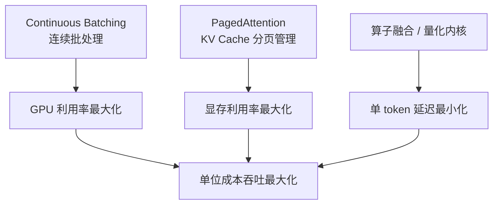
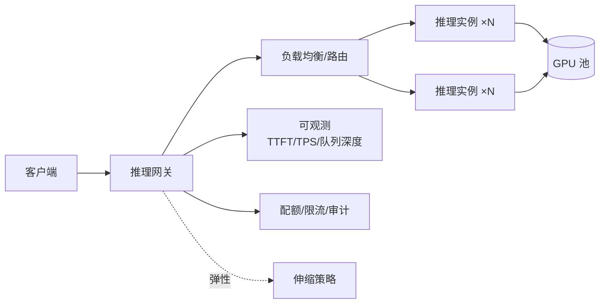

# 大模型推理部署实战

> 大模型落地，推理服务是绕不开的工程核心。这篇沉淀的是生产环境的实战认知：推理的成本结构长什么样、vLLM 类框架到底优化了什么、量化怎么选、以及从 Demo 到生产之间隔着哪些坑。以自建推理服务为主线，模型 API（如百炼类服务）的取舍见文末。

## 为什么推理是成本大头

大模型推理的计算特征和传统服务完全不同：

1. **自回归生成**：输出是逐 token 串行的，延迟天然随输出长度线性增长
2. **KV Cache**：每个请求的上下文状态都要常驻显存，一个 70B 模型 + 长上下文请求，KV Cache 可能比权重本身还占地方
3. **显存墙**：推理瓶颈通常不是算力而是**显存容量与带宽**——这也决定了 GPU 选型逻辑（见 [GPU 选型与推理成本测算](/ai/gpu-sizing)）

由此引出一个反直觉的结论：**推理优化的主线，不是让单次计算更快，而是让一张卡在同一时间服务更多请求**。

## 推理框架的核心武器

以 vLLM 为代表的现代推理框架，本质是把三件事做到极致：

### Continuous Batching（连续批处理）

传统批处理要等一批请求都完成才处理下一批——短请求被迫陪跑长请求。连续批处理在每个解码步动态组批：**完成的请求立刻释放位置，新请求立刻插入**。仅此一项，吞吐通常提升数倍。

### PagedAttention（KV Cache 分页）

借鉴操作系统虚拟内存思想：KV Cache 不再按请求最大长度预分配（浪费严重），而是按块（block）动态分配。效果是**显存浪费从 60-80% 降到接近零**，同一张卡能容纳的并发请求数直接翻倍级提升。

### 其他值得了解的优化

- **投机解码（Speculative Decoding）**：小模型猜、大模型验证，串行生成变并行验证，延迟敏感场景收益明显
- **Prefix Caching**：相同系统提示词/知识库前缀的请求共享 KV Cache，多轮对话与 RAG 场景命中率很高
- **Chunked Prefill**：把长上下文的预填充切碎与解码混跑，平滑首字延迟与吞吐的冲突

## 量化：最便宜的"扩容"手段

量化通过降低权重/激活的数值精度来省显存、提速度：

| 精度 | 显存占用（相对 FP16） | 质量损失 | 适用 |
| --- | --- | --- | --- |
| FP16/BF16 | 1x | 基线 | 默认选择 |
| INT8 (W8A8) | ~0.5x | 很小 | 通用生产环境 |
| INT4 (AWQ/GPTQ) | ~0.25x | 有损，需评测 | 资源受限、质量可接受时 |
| FP8 | ~0.5x | 很小 | 新一代 GPU（H100 及以后） |

实践要点：

- **先评测再上线**：量化后必须在业务评测集上回归测试。通用 benchmark 不掉分 ≠ 你的业务场景不掉分——专业领域（医疗、法律、代码）对量化更敏感
- **70B 级别模型的账**：FP16 需要 4×A100-80G 才能跑，INT8 降到 2 张，INT4 单张可跑——量化直接改变硬件采购方案
- **新硬件优先看 FP8**：原生硬件支持的量化格式，质量/速度平衡通常优于 INT4

## 生产部署架构

一个能扛住生产的推理服务，远不止"起一个 vLLM 进程"：

关键工程点：

1. **双延迟指标**：TTFT（首 token 延迟，决定体感）与 TPOT（每 token 间隔，决定生成速度）必须分开监控、分开优化。长输出场景要关注的是整体吞吐而不是单请求延迟
2. **队列与背压**：推理是慢服务，网关必须管理队列深度与超时，否则雪崩会以"请求堆积→显存爆→实例重启"的形式发生
3. **优雅发布**：模型切换是分钟级事件（权重加载慢），用双实例组 + 流量切换，不要原地重启
4. **多模型路由**：按任务复杂度路由到不同规格模型（小模型兜底、大模型攻坚）是当前性价比最高的架构手段之一

## 自建推理 vs 模型 API

这是每个项目第一个要回答的问题，判断框架：

| 决策因素 | 倾向模型 API | 倾向自建 |
| --- | --- | --- |
| 调用量 | 中小、波动大 | 大且持续（自建成本曲线会交叉） |
| 数据合规 | 可出域或厂商可信 | 必须留在自己环境内 |
| 模型选择 | 通用能力够用 | 需要私有微调模型/开源特定模型 |
| 团队能力 | 无推理运维人力 | 有 GPU 运维与调优能力 |
| 延迟要求 | 公网延迟可接受 | 需要内网级低延迟 |

实践中最常见的演进路径：**先用 API 验证业务价值，调用量上来之后再算账决定是否自建**——跳过验证阶段直接建推理集群，是典型的过度设计。

## 常见坑清单

| 坑 | 现象 | 对策 |
| --- | --- | --- |
| 上下文长度没规划 | 长请求把显存挤爆 | 网关层限制最大 token + 监控上下文分布 |
| 只压测短请求 | 生产长请求一来就超时 | 用真实长度分布压测 |
| max_tokens 不设上限 | 单个请求无限生成 | 服务端强制上限 |
| 忽略并发下的排队延迟 | P99 离奇恶化 | 监控队列等待时间，扩容看队列不看 GPU 利用率 |
| 驱动/框架版本漂移 | 升级后性能突变 | 镜像化固定版本组合，升级走完整评测 |

## 小结

推理部署的工程主线只有一条：**在保证质量与延迟 SLA 的前提下，最大化单位显存的吞吐**。Continuous Batching 与 PagedAttention 解决"并发效率"，量化解决"单位成本"，网关与可观测解决"生产可靠性"——三者都做到位，自建推理才谈得上比 API 划算。

## 参考资料

- [vLLM 项目文档](https://docs.vllm.ai/)
- [PagedAttention 论文（Efficient Memory Management for LLM Serving）](https://arxiv.org/abs/2309.06180)
- 站内相关：[GPU 选型与推理成本测算](/ai/gpu-sizing) · [企业级 RAG 架构设计](/ai/rag-architecture)
