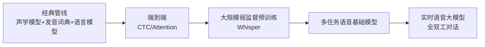

# 语音识别与理解

> 语音是交互最自然的入口。这条技术线走过"声学模型+语言模型拼接"的经典时代，被端到端 Encoder-Decoder 统一，如今正在进入"语音大模型"阶段——识别、合成、理解、对话在一个模型里闭环。

## 技术演进

## ASR：语音识别

- **Whisper 范式**：海量弱监督数据 + 简单稳健的 Encoder-Decoder——证明了"数据规模 + 架构简单"胜过精巧设计；多语言、抗噪、带时间戳与翻译的统一输出
- **工业化的另一条线**：Paraformer 类非自回归模型——一步解码、速度数倍于自回归，适合实时与大并发场景
- **中文与垂直场景**：SenseVoice 类多语种模型覆盖中英日韩粤 + 情感/事件标签；电话客服、会议、车载各有专用优化（说话人分离、热词定制、远场降噪）
- **关键指标**：词错率（WER）、首包延迟、并发成本——实时场景三者互相牵制

## TTS：语音合成

- **演进**：拼接合成 → 参数合成 → 神经网络（Tacotron/FastSpeech）→ 零样本音色克隆时代
- **当前主流形态**：指令可控合成（情感、语速、风格用自然语言控制）、零样本克隆（几秒参考音频复刻音色）、多语种跨语言合成
- **CosyVoice 类开源模型**：把"音色克隆 + 指令控制"开源化，本地部署的语音交互成为可能
- **产品级标杆**：商用语音服务（ElevenLabs 类）在自然度与情感表达上仍是参照系——v3 代际已支持音频标签式的情感控制

## 实时语音对话：从级联到端到端

- **级联方案**：ASR → LLM → TTS，工程成熟但延迟叠加（通常 1.5-3s），且丢失韵律信息
- **端到端语音模型**：音频进音频出，延迟降到数百毫秒，保留语气与情感——GPT-4o realtime 类、Moshi 类是两条代表路线
- **全双工**：可打断、可边听边说，逼近真人对话节奏——这是语音交互的体验分水岭

## 音频理解的扩展

- 不止语音：声音事件识别（AED）、音频内容理解（音乐/环境声）、音频检索
- 语音大模型正在把"听觉"并入多模态底座——与视觉理解的融合路线一致（参见 [视觉理解](/ai/models/vision)）

## 2026 格局：主力模型速览（更新于 2026-09）

| 方向 | 代表 | 时间 | 要点 |
| --- | --- | --- | --- |
| ASR 开源 | Whisper large-v3-turbo | 2024-09 | 809M decoder-only 蒸馏，速度与质量的平衡点 |
| ASR 开源 | SenseVoice（FunAudioLLM） | 2024-07 | 非自回归、~50ms 延迟、情感/事件识别一体 |
| ASR 商用 | ElevenLabs Scribe v1/v2 | 2025/2026 | 99 语言、说话人分离；v2 Realtime <150ms 面向 Agent |
| TTS 开源 | Fun-CosyVoice3-0.5B | 2025-12 | 3s 零样本克隆、指令控制、**RL 对齐优化**、150ms 流式 |
| TTS 商用 | ElevenLabs v3 | 2026-03 GA | 音频标签式情感控制（[laughing]/[sad]）、70+ 语言 |
| 实时对话 | Moshi（Kyutai） | 2024-09 | 首个开源全双工 speech-text 基础模型 |
| 实时对话 | gpt-realtime（OpenAI） | 2025-08 | 生产级语音 Agent：低延迟、函数调用、speech-in-speech-out |
| 实时对话 | Qwen3-Omni / GLM-4-Voice | 2025 | Omni 化代表：Thinker-Talker 流式语音进出 |

**格局要点**：
- **级联管线 → 端到端**：语音 token 直进直出保留副语言信息（情感、语气）成为旗舰路线
- **全双工与打断**成为体验基准（Moshi 开创，2025 全面普及）
- **低码率语音 tokenizer（25Hz 级）**成为 ASR/TTS/对话共用底座；RL 开始用于 TTS 质量优化
- **Agent 化明确**：Scribe v2 Realtime、gpt-realtime 均直接面向实时语音 Agent 场景

## 实践观点（SA 笔记）

- **选型三分法**：离线转写看准确率与说话人分离；实时交互看首包延迟与全双工能力；声音产品化（有声书/客服音色）看克隆相似度与授权合规
- **声音克隆的合规线**：音色属于人格权益，商用必须取得授权——方案里要内置授权链与水印
- **成本视角**：语音模型推理开销远低于视频/图像生成，实时语音是"低延迟高并发"的推理工程题，适配 [推理部署](/ai/infra/inference/llm-inference) 里的并发优化方法

## 参考资料

<Refs>

- [Robust Speech Recognition via Large-Scale Weak Supervision (Whisper)](https://arxiv.org/abs/2212.04356) — 大规模弱监督范式（2022）
- [CosyVoice 开源仓库](https://github.com/FunAudioLLM/CosyVoice) — 可控语音合成（持续更新）
- 站内相关：[视觉理解](/ai/models/vision) · [模型架构演进总览](/ai/models/)

</Refs>