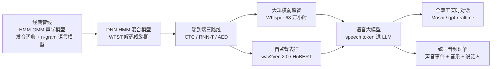
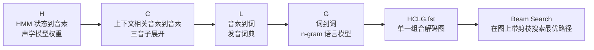
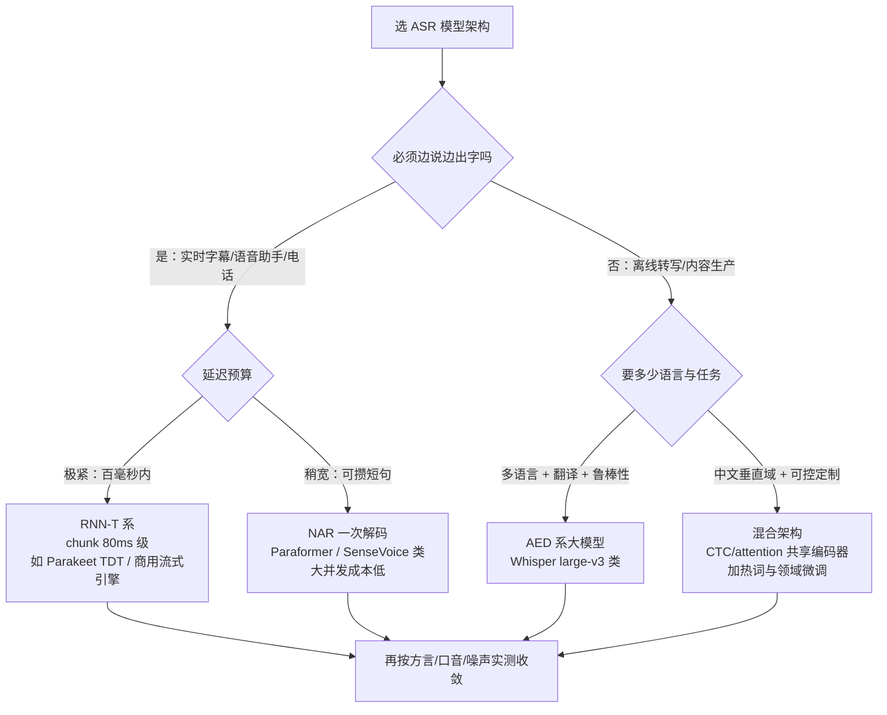
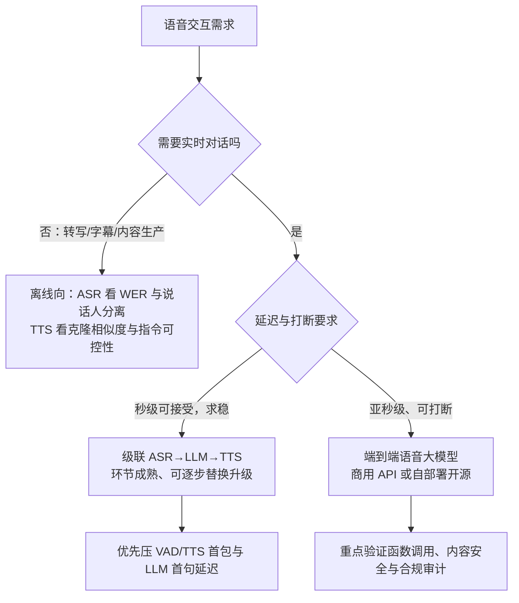
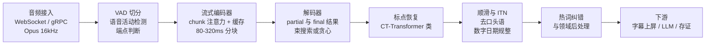
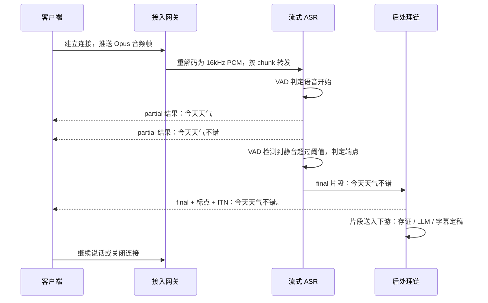

# 语音识别与理解

> 面向做语音交互选型、想把"听懂"能力接进现有系统的工程师与架构师。这篇把语音识别与理解的技术线从底层讲透：**经典 ASR 管线（声学模型+发音词典+语言模型、WFST 解码）为什么被端到端取代、CTC/RNN-T/AED 三大路线各自的机制与工程取舍、Whisper 的 68 万小时弱监督数据工程、wav2vec 2.0/HuBERT 的自监督表征学习**，再到语音大模型时代——speech token 怎样让语言模型直接"听"、Moshi 的全双工架构如何做到边听边说、评估体系（WER/CER、RTF、首包延迟）与流式服务化、热词定制、端云协同这些课本不讲的工程细节。读完你会清楚：一条音频从波形到文字再到"理解"，每一段在做什么、为什么这么做、选型时该盯哪些指标。

语音是交互最自然的入口。这条技术线走过"声学模型+语言模型拼接"的经典时代，被端到端模型统一，如今正在进入"语音大模型"阶段——识别、理解、对话在一个模型里闭环。我在方案评审里对语音的判断始终如一：**它已经过了"能不能用"的阶段，现在的分水岭是延迟、可控性和合规**。

**与姊妹篇的分工**：语音技术有"理解"与"生成"两侧。TTS 合成侧——自回归语言模型怎样把文本变成语音离散表示、HiFi-Decoder 与 DIT+DAV 两条声码路线、Triton/TensorRT 服务化——已由 [语音生成](/ai/models/speech-gen) 一文完整覆盖，本篇不再展开；本文专注 **ASR 识别与语音理解侧**，两篇互为上下游：理解侧的语音 token、流式推理、延迟预算，正是生成侧架构的镜像。文末速览节保留一份 TTS 极简索引，方便从本篇跳转到生成侧细节。

## 技术演进：从管线到基础模型



这条演进线里真正改变游戏规则的是三个节点：

1. **端到端**（2015–2019）把声学模型、发音词典、语言模型三个独立训练、独立维护的模块压成一个神经网络联合优化，工程复杂度骤降，但也丢掉了管线时代的可干预性（后文详述这笔交易的得失）；
2. **Whisper**（2022）证明了"海量弱监督数据 + 简单稳健架构"可以碾压精心设计的专用管线，把 ASR 的竞争焦点从模型结构转向数据工程；
3. **语音 tokenizer**（把波形压缩成低码率离散 token 的编码器，如 Mimi、EnCodec、GLM-4-Voice tokenizer）让语音第一次能像文本一样被语言模型直接消费——识别、理解、对话、合成从此共用同一个底座，这也是本篇与生成侧姊妹篇的技术交汇点。

## 语音识别问题的本质：一个对齐难题

ASR（Automatic Speech Recognition，自动语音识别）的形式化定义很简单：给定音频观测序列 X，找最可能的文字序列 Y：

```text
Ŷ = argmax_Y P(Y | X)
```

但难点在于 **X 和 Y 长度不成比例、且对应关系未知**：一秒语音对应几个字取决于语速，同一个字在不同语境下发音不同（协同发音），音频帧和文字之间没有现成的对齐标注。所有 ASR 技术路线的差异，本质上都是**对"对齐"这个隐变量的不同处理方式**：

| 范式 | 对齐怎么处理 | 代表 | 时代 |
| --- | --- | --- | --- |
| 经典管线 | HMM 状态显式建模对齐，解码器在 WFST 图上搜索 | Kaldi、HTK | ~2010–2018 |
| CTC | 引入 blank 符号，对所有合法对齐路径求和，边缘化掉对齐 | wav2vec 2.0 微调头、Paraformer 前身 | 2006 提出，2017 起流行 |
| RNN-T | 帧同步的二维格：每帧决定"发声 or 输出 token" | Google 全端语音、NVIDIA Parakeet | 2012 提出，2019 起工业化 |
| AED | 交叉注意力隐式学对齐，无需对齐假设 | LAS、ESPnet、Whisper | 2015 起 |
| LLM 化 | 语音编码为 token/嵌入后交给语言模型解码，对齐由 LLM 自回归消化 | Seed-ASR、Qwen3-ASR、FireRedASR2-LLM | 2024 起 |

下面按这条线逐层拆开。

## 经典 ASR 管线：模块化时代的架构与遗产

### 三大组件：各管一段的生成式分解

经典管线是**生成式**思路：不直接建模 P(Y|X)，而是用贝叶斯公式拆成两个更好估计的部分：

```text
Ŷ = argmax_Y P(Y|X) = argmax_Y P(X|Y) · P(Y)
```

- **声学模型 AM**（Acoustic Model）估计 P(X|Y)：给定文字，声音长什么样。HMM-GMM 时代用高斯混合模型刻画每个 HMM 状态（音素的亚单元）的声学特征分布；2012 年 Hinton 等人的 DNN-HMM 混合模型把 Switchboard 电话任务词错率相对降低约 23%，是深度学习改写语音的第一枪——DNN 只替换了"给定 HMM 状态算特征概率"这一步，对齐框架仍是 HMM 的。
- **发音词典**（Lexicon）：文字到音素的映射表，回答"这个词由哪些音素、按什么顺序发出来"。中文场景对应字/词到声韵母的映射，还要处理多音字消歧。
- **语言模型 LM**（Language Model）估计 P(Y)：什么文字序列本身更可能。工业界长期是 n-gram + 插值平滑，词表几十万级；后期用 RNNLM 对解码结果做二次打分（rescoring）。

### WFST 解码：把所有知识编译进一张图

四个组件怎么合起来搜索？答案是 **WFST**（Weighted Finite-State Transducer，加权有限状态转换器）——把每种知识表示成一张带权状态图，再用图组合运算编译成单一解码图：



H∘C∘L∘G 离线组合成一张 HCLG 图后，解码就是在这张图上做带剪枝的 beam search——每一步扩展状态时同时消费声学得分和语言得分。这套框架的工程含义：

- **优点**：解码是确定性图搜索，速度快、结果可复现；任何知识（热词表、领域语法、脏词过滤）都能编译成一个小 FST 再组合进去，**定制不改模型**；lattice（词格）可以保存下来做 N-best 重打分。
- **代价**：图可能爆炸——大词典 × 大语言模型组合出的 HCLG 动辄数 GB，需要 on-the-fly 组合与剪枝技巧；词典和 n-gram 都要人工构建维护，多语言扩展成本高；组件间目标不一致（AM 优化帧级似然、LM 优化文本困惑度，没人直接优化 WER）。

我遇到过的存量系统里，电话客服、司法转写这些领域还有大量 Kaldi 系 HCLG 栈在跑。它们不新潮，但**热词注入、语法约束这些能力是即插即用的**，这是后面很多端到端模型至今没补齐的短板。经典管线的完整总结可看 Mohri 等人的 WFST 综述与 Hinton 等人的 DNN 声学模型综述（见参考资料）。

## 端到端三路线：把对齐学出来

端到端（End-to-End）的口号是"音频进、文字出，一个模型全包"。三大路线的区别，在于**用什么机制消解对齐这个隐变量**。

### CTC：边缘化所有对齐路径

**CTC**（Connectionist Temporal Classification，联结时序分类，Graves 等 2006 年提出）的思路最直接：既然对齐未知，就把**所有可能的对齐路径的概率加起来**。

机制拆解：

1. 编码器把 T 帧音频特征映射为 T 个时间步的输出分布，词表里额外加一个 **blank 符号**（ε，表示"这一帧没有新字发出"）；
2. 一条长度为 T 的输出序列（如 `ε今ε天天ε气ε好εε`）经"去重合并"映射到文字序列（`今天天气好`）：相邻重复先折叠、再删 blank——多条路径可以映射到同一个 Y；
3. 训练目标是所有映射到正确 Y 的路径概率之和，用动态规划（前向-后向算法，和 HMM 的 forward 算法同构）在 O(T·|Y|) 内算完，无需对齐标注：

```text
P(Y|X) = Σ_{π ∈ B⁻¹(Y)} Π_{t=1..T} y_t^π
损失 = -log P(Y|X)
```

这个设计有个致命假设——**条件独立**：第 t 帧的输出分布只依赖音频输入，不依赖已经输出了哪些字。模型无法自己建模"输出内部的依赖"（比如"今天天气"之后更可能接"很好"而不是"很猫"），语言知识只能靠音频侧间接推断或外挂 LM。


*图源：Sequence Modeling with CTC（Distill 交互论文，[distill.pub/2017/ctc](https://distill.pub/2017/ctc/)）条件独立示意节*

条件独立还带来著名的**尖峰行为**（peaky behavior，Distill 这篇文章的经典分析）：训练充分的 CTC 模型把概率质量集中到极少数帧上——一个字在一个尖峰帧一次性"吐出"，其余帧全是 blank。工程后果：

- CTC 输出的时间戳天然就是尖峰位置，**字级时间戳几乎免费**（对比 AED 需要额外对齐器）；
- 但尖峰位置常偏离人耳感知的字中心，直接拿来做卡拉 OK 字幕会"抢拍"，需要平滑或换 forced aligner；
- 尖峰之间的长 blank 段让 CTC 对**插入型幻觉**相对免疫（对比 Whisper 的 AED 解码，后文细讲）。

CTC 解码用 **prefix beam search**：按前缀合并路径、边扩展边累积概率。因为条件独立，CTC 也可以和外部 n-gram/神经 LM 做浅融合（shallow fusion，解码时把 LM 分数加权进 beam search），这是弥补其语言建模短板的标准手段。

**工程判断**：CTC 结构简单、推理一次前向就出结果（无自回归循环）、帧同步输出天然支持流式，至今仍是自监督模型（wav2vec 2.0 系）微调头和多任务联合训练（CTC/attention 混合）的默认选择；但它单独作为产品级 ASR 主干已让位于 RNN-T 和 AED——多数场景我遇到的情况是：CTC 做辅助损失提稳训练，而不是做最终解码器。

### RNN-T/Transducer：帧同步的二维格，流式为什么天然

**RNN-T**（RNN-Transducer，Graves 2012 年提出，arXiv:1211.3711）可以理解为"CTC + 输出历史"：它同样在帧上同步决策，但把条件独立假设拆掉了——每个时间步的输出同时依赖音频状态和已输出文字。

结构是三张网络的组合：


*图源：Improving RNN Transducer Modeling for End-to-End Speech Recognition（[arXiv:1909.12415](https://arxiv.org/abs/1909.12415)）论文结构图*

- **编码器**（encoder/transcription network）：单向 RNN 或 Conformer/Zipformer，逐帧把音频特征编码为声学表示——单向保证因果性，来一帧算一帧；
- **预测网络**（prediction network）：一个纯文本侧的自回归 LM，把已输出的 token 序列编码为向量——这就是被 CTC 砍掉的"输出历史"；
- **联合网络**（joint network）：一个小前馈网络，把声学向量和文本向量融合，在每个格点 (t, u) 输出 |V|+1 维分布——V 个文字 token 加一个 blank。

训练时展开成一张 **T×U 的二维格**（transcription lattice），每条从左上到右下的路径是一种"边听边写"的对齐方案：横走一格 = 消费一帧音频、输出 blank；竖走一格 = 不消费音频、吐一个字。目标函数是所有正确路径概率之和（RNN-T loss，用修改版前向后向算法计算，显存开销比 CTC 大一个量级——这是它训练贵的根源）。

**流式为什么天然**：因为决策是帧同步的。编码器每收到一个 chunk（比如 80ms 音频），联合网络就在那个时间列上做决策——要么 blank（继续听），要么吐 token。**识别结果的延迟下界就是 chunk 大小**，不需要等整句说完，也不需要 VAD 判停。对比 AED 必须拿到全句才能做交叉注意力，RNN-T 的流式是结构性的而非补丁式的。推理主循环可以写成几行伪代码：

```text
enc_state ← 编码器初始状态        pred_state ← 预测网络初始状态（仅 <bos>）
循环，每到达一个音频 chunk：
    h ← 编码器前向(chunk, enc_state)      # 单向，只依赖历史
    循环：                                # 同一帧可以连续吐多个字
        g ← 联合网络(h, pred_state)       # |V|+1 维分布
        y ← argmax / 采样(g)
        若 y == blank：跳出内层循环，等下一个 chunk
        否则：输出 y；pred_state ← 预测网络前向(y, pred_state)
```

内层"同一帧连吐多字"的循环是 Transducer 与 CTC 的另一个区别——CTC 每帧至多一个符号，RNN-T 没有这个上限（实践中也常限制每帧最多发射 k 个 token 来 bound 延迟抖动）。

工业验证非常充分：Google 2019 年把 2000 万参数级的 RNN-T 塞进 Pixel 手机做全离线流式听写（官方博客 *An All-Neural On-Device Speech Recognizer*），服务器侧 Google 的实时会议字幕、YouTube 直播字幕长期是 RNN-T 栈；NVIDIA 的 Parakeet TDT 系（2025–2026 年 HuggingFace Open ASR Leaderboard 头部常客）也是 Transducer 变体——TDT（Token-and-Duration Transducer）把"每个 token 持续几帧"显式建模，比逐帧决策再快数倍。

工程代价两点：**训练显存大**（二维格的概率计算），**预测网络是自回归的**（推理时每吐一个字要过一次预测网络，不过它很小、且可以缓存状态）；另外 blank 决策逐帧进行，容易在词中间产生尖刺式提前发射（spike emission），对时间戳精度和延迟稳定性都有影响，FastEmit 一类的正则化就是冲着这个来的。

### AED/LAS：注意力编解码，全局上下文的诱惑

**AED**（Attention-based Encoder-Decoder，注意力编解码）路线由 Google 2015 年的 **LAS**（Listen, Attend and Spell，arXiv:1508.01211）定型：

- **Listener**（编码器）：双向 RNN/Conformer 把整句音频编码为特征序列——双向意味着每帧能看到全句上下文，表征质量高，但也意味着**必须等音频收完**；
- **Attender**（注意力）：解码器每生成一个字，都对编码器全部输出算一次注意力加权——对齐不再显式建模，而是注意力权重的副产品；
- **Speller**（解码器）：自回归 RNN/Transformer，条件于注意力上下文和已输出文字，逐个吐字。

AED 的关键优势是**联合建模**：解码器直接建模 P(Y|X) 且输出之间有依赖（自带语言模型能力），不需要外接 LM 也能写通顺句子；配合 Transformer 解码器就是今天所有"语音大模型"的形态前身——Whisper 就是一个 AED。

短板同样结构性：

- **流式困难**：全局注意力天然反流式。补救方案是一族"受限注意力"——单调注意力（Monotonic Attention）、MoChA（硬/软注意力混合）、chunk 化注意力（每帧只看左边固定窗口），WeNet 的 **U2/U2++** 干脆让同一套编码器共享 CTC 和 attention 两个头，训练一次、部署时按场景切流式（CTC）或非流式（attention 重打分）两种模式，这是工程上非常实用的折中；
- **长音频注意力漂移**：输入几十分钟后，注意力容易"迷路"——漏段、重复、跳读。这是 AED 系模型做长转写必须切 chunk 的根本原因；
- **幻觉**：自回归解码 + 全局注意力，在静音或噪声段可能"无中生有"地续写文本——Whisper 的幻觉问题正是这个机制缺陷的放大版（弱监督数据里存在音频与文本不匹配的脏样本，模型学会了"没有语音也接着编"）。

### 非自回归变体：Paraformer 与 CIF

自回归解码逐字生成，速度受限于序列长度。**Paraformer**（阿里，arXiv:2206.08317）代表非自回归（NAR）路线：用 **CIF 预测器**（Continuous Integrate-and-Fire，连续积分发射——累积声学权重到阈值就"发射"一个 token 位置的向量）先预测 token 数量并抽取每个 token 的声学表征，再用带双向注意力的并行解码器**一步生成整句**，配合采样器降低 NAR 常见的漏字/重复。速度比自回归快数倍，精度损失很小，是 FunASR 体系的骨干，也是 SenseVoice 的架构基础（在其上加多任务头）。NAR 路线的取舍：低延迟高并发场景占优，但对复杂长句和代码转换（中英混说）的鲁棒性弱于自回归大模型——我遇到的情况是会议转写这类长内容仍以自回归为主，NAR 统治实时字幕。

### 三路线对比与选型

| 维度 | CTC | RNN-T/Transducer | AED/LAS |
| --- | --- | --- | --- |
| 对齐机制 | blank + 路径求和，边缘化对齐 | 二维格，帧同步显式决策 | 交叉注意力隐式对齐 |
| 输出依赖建模 | 无（条件独立） | 有（预测网络） | 有（自回归解码器） |
| 流式能力 | 天然（帧同步） | 天然（帧同步，工业首选） | 困难，需受限/chunk 注意力 |
| 推理速度 | 快（一次前向 + beam） | 中（逐帧联合网络，token 少） | 慢（逐 token 自回归） |
| 训练成本 | 低 | 高（二维格前向后向，显存大） | 中 |
| 时间戳 | 尖峰位置免费但偏早 | 帧级，粒度细 | 需注意力对齐或强制对齐器 |
| 幻觉倾向 | 低 | 低 | 高（静音段、长音频） |
| 外挂 LM | 浅融合成熟 | 可融合预测网络 | 通常内置，融合较难 |
| 代表系统 | wav2vec 2.0 微调、Zipformer CTC 头 | Google 全系、NVIDIA Parakeet TDT | Whisper、ESPnet、WeNet U2++ |
| 工程含义 | 做辅助损失/自监督微调头 | 实时流式产品的默认主干 | 离线转写与多任务语音大模型底座 |



判断入口：**流式需求先分流**（这是结构性的，后补很痛苦），再看延迟预算和语言/任务面。注意最后一环——架构选对只完成一半，方言、口音、噪声的实测数据才是收敛依据，纸面 WER 不可信（评估体系一节细讲）。

## 数据与表征从哪里来：弱监督与自监督两条路

端到端模型架构趋同之后，竞争焦点转向"表征和数据从哪来"。2020–2022 年两条路线各自登顶：**弱监督**（Whisper：有噪声的音频-文本对，量大管饱）和**自监督**（wav2vec 2.0/HuBERT：只要音频不要文本，先学表征再微调）。两条路线解决的痛点不同：前者治"标注太贵"，后者治"标注语言太多、根本标不过来"。

### Whisper：大规模弱监督的胜利与数据工程

Whisper 是 OpenAI 2022 年底发布的工作（Radford 等，arXiv:2212.04356）：用从互联网收集的 **68 万小时多语言音频-文本对**做弱监督训练——不精标注、不人工清洗，只用"预测互联网上音频对应的转录文本"这个朴素目标，把数据规模比前人扩大了一个数量级。架构反而是最朴素的 Transformer Encoder-Decoder（标准 AED）：音频切成 30 秒块、提取 80 维 log-Mel 谱，编码器输出交给解码器自回归生成；转录、翻译、语种识别、静音检测多个任务用一组特殊 token（`<|zh|>`、`<|translate|>` 等）统一表达，一个模型替代了传统语音处理管线的多个阶段。


*图源：Whisper 论文（[arXiv:2212.04356](https://arxiv.org/abs/2212.04356)）方法总览图*

**真正值得学的是它的数据工程**——论文的过滤管线比架构部分含金量高：

1. **来源**：爬取互联网音频及既有字幕/转写文本，得到 680 万小时原始候选；
2. **机器翻译文本过滤**：互联网字幕里混着大量机翻文本，会让模型学到"翻译腔"而非真实转写。用一个分类器区分人工文本 vs 机翻文本，只保留前者；
3. **语种均衡采样**：防止英语主导（最终非英语约 11.7 万小时、外译英约 12.5 万小时，99 种语言）；
4. **去重**：用 Bloom filter 对 n-gram 做重复转写检测，剔除跨数据集的复读样本；
5. **弱监督目标**：容忍剩余噪声——不追求每条数据干净，而是靠 68 万小时的多样性把噪声"平均掉"。

核心结论是**鲁棒性来自数据多样性而非架构精巧**：模型在零样本设置下（不做任何微调）逼近人类转写的准确率，对口音、背景噪声、专业术语的抗性和人类接近。我在离线转写项目里的体感一致：Whisper large 系在会议录音、播客、电话音质这些"脏数据"上的稳定性，明显好于在干净朗读集上刷分的专用模型。

工程使用注意三点：

- **turbo 是性价比甜点**。large-v3-turbo 是 809M 参数的 decoder-only 蒸馏版（解码器从 32 层砍到 4 层），官方数据约为 large 的 8 倍速度、6GB 显存即可跑，准确率损失很小——但它**没有训练翻译任务**，需要"外语转英语"时仍要用 large/medium。
- **Whisper 不支持热词定制，且对静音/噪声段有幻觉输出的已知问题**（会吐出重复或编造的文本，AED 机制缺陷 + 弱监督脏数据的合谋）。做客服、会议等垂直场景时，热词与领域适配要靠外层工程或换模型，不能指望原生能力。前置 VAD 过滤静音段、监控输出重复率是标配防线。
- **30 秒窗口是硬约束**：超过 30 秒的音频必须自己切块（VAD 切或滑窗切），块间用重叠 + 去重拼接；上一块的文本作为 prompt 喂给下一块能显著提升连贯性，但也会**放大幻觉的传染**——一块编造，后续块跟着复读，长音频转写要对重复模式做后处理熔断。

模型规格的选型速查（官方仓库数据，显存为 batch=1 推理的量级，实际部署随运行时浮动）：

| 型号 | 参数量 | 显存需求（约） | 相对速度 | 备注 |
| --- | --- | --- | --- | --- |
| tiny / base | 39M / 74M | 1GB 级 | 10x / 7x | 只够原型验证，生产可用度低 |
| small | 244M | 2GB 级 | 4x | 边缘/CPU 场景的下限 |
| medium | 769M | 5GB 级 | 2x | 多语言与翻译任务的性价比档 |
| large-v3 | 1550M | 10GB 级 | 1x | 精度上限，99 语言，加约 500 万小时伪标注数据 |
| large-v3-turbo | 809M | 6GB 级 | 8x | 解码器蒸馏到 4 层，无翻译任务，生产默认推荐 |

Whisper 之后的谱系：large-v3（2023）、社区蒸馏系（distil-whisper 等）、以及 faster-whisper（CTranslate2 运行时，吞吐提升数倍，事实上的生产部署标准）。它证明的范式——"数据规模碾压结构精巧"——随后被各家复用，只是数据源从"爬互联网"变成了"合成与回收业务数据"。

### wav2vec 2.0：对比学习 + 在线量化

**wav2vec 2.0**（Meta，2020，arXiv:2006.11477）回答另一个问题：能不能**只用未标注音频**学出好的语音表征？它的框架分三块：


*图源：wav2vec 2.0 论文（[arXiv:2006.11477](https://arxiv.org/abs/2006.11477)）模型示意图*

1. **特征编码器**（多层 CNN）把波形编码为每 20ms 一帧的潜在表征；
2. **随机掩码**：像 BERT 一样遮住连续若干帧——区别是掩在**潜在表征层**而非原始波形上（波形插值太容易，学不到东西）；
3. **量化模块**：Gumbel-softmax 产品量化把潜在表征离散成有限个"语音单元"，与模型**在线联合训练**；一个多样性损失防止码本坍缩；
4. **上下文网络**（Transformer）消费掩码后的序列，训练目标是**对比学习**：在被掩位置，从若干干扰项（同句其他掩码位置的量化单元）里辨认出真正的量化目标。

学到的表征接一个小小的 CTC 头微调即可做 ASR。标志性结果：**用 53k 小时未标注英语预训练后，只用 10 分钟标注数据微调，LibriSpeech test-clean/other 达到 4.8/8.2 WER；1 小时标注达到 2.3/4.8**——低资源场景的天花板被改写。多语言版本 XLSR 及后续的 MMS（Massively Multilingual Speech）把同一配方推广到 1000+ 语言，很多语言从头到尾没有大规模标注数据。

### HuBERT：离线聚类 + 掩码预测

**HuBERT**（Meta，2021，arXiv:2106.07447）复用 wav2vec 2.0 的骨架，但换了学习目标：不做对比，改做 **BERT 原味的掩码类别预测**。


*图源：HuBERT 论文（[arXiv:2106.07447](https://arxiv.org/abs/2106.07447)）Figure 1*

语音没有现成的"词表"可以做预测目标，HuBERT 的答案是**先离线造一个**：

1. 第一轮：对训练音频提取 MFCC，跑 k-means 得到每帧的聚类 ID 作为伪标签；
2. 训练：掩码位置的输出做**交叉熵**预测伪标签（只在掩码区域算损失——逼迫模型同时学声学和上下文规律，而不是简单插值）；
3. 迭代：用训练好的模型中间层表征重新聚类，得到更"语言学"的伪标签，再训一轮。

伪标签的质量不必好——聚错没关系，**同一个音在不同上下文的聚类差异恰好逼模型学习上下文**。HuBERT 在 60k 小时 Libri-light 上匹配或超过 wav2vec 2.0，且训练更稳（没有对比学习的干扰项采样和多样性损失调参）。Google 的 **w2v-BERT**（arXiv:2108.06209）把两家统一：对比学习模块在线产生量化目标，直接喂给上层的掩码预测模块——这条线后来成为 Google USM/Chirp（Gemini 语音底座的前身）的地基。

### 自监督表征的工程价值：不止 ASR

自监督表征在工程上的真正价值，超出"低资源 ASR"这个原始动机：

- **表征可复用**：同一份 wav2vec 2.0/HuBERT 表征，接不同头可以做说话人识别、情感识别（SER）、语种识别；speechbrain、fairseq 生态把这些头做成了积木；
- **它们是语音 tokenizer 的祖先**：后文 Moshi 的 Mimi 编解码器用 WavLM（HuBERT 家族）蒸馏语义信息进第一层码本，GLM-4-Voice 的 tokenizer 直接在 Whisper 编码器里插量化瓶颈——**"理解侧学到的表征，被生成侧拿去当 token"**，这是理解与生成两条线在 2024 年之后合流的技术枢纽；
- **落地边界**：纯自监督微调的 ASR 在中文工业场景我遇到的情况是打不过 Whisper 大模型或商用引擎——自监督的主战场是**没有标注数据的长尾语言**和**表征复用**，而不是和成熟引擎拼中文 WER。

## 语音大模型时代：从"识别"到"理解"

2024 年起，ASR 的边界溶解了：模型不再输出"文字"就结束，而是把语音变成语言模型可以直接消费的 token 序列，识别、翻译、情感、事件、对话在同一底座里完成。这一步的钥匙是 **speech token**。

### Speech Token：让语言模型能"听"

语音离散化有三个流派，取舍在"码率-音质-语义"三角：

| token 类型 | 怎么来 | 码率量级 | 保住了什么 | 代表 |
| --- | --- | --- | --- | --- |
| 声学 token | RVQ 神经编解码器直接重建波形训练 | 1.5–24 kbps，多层码本 | 音质、说话人细节 | SoundStream、EnCodec |
| 自监督语义 token | HuBERT/w2v-BERT 表征再聚类 | ~25–50 Hz 单层 | 语言内容 | AudioLM 的语义阶段、GSLM |
| 监督语义 token | 在 ASR 模型里插量化瓶颈 | 175 bps 级，单码本 12.5Hz | 语言内容 + 部分韵律 | GLM-4-Voice tokenizer、CosyVoice2 tokenizer |

**AudioLM**（Google，2022，arXiv:2209.03143）是"语言建模方法做音频生成"的开创者，也第一次完整演示了语义 token 与声学 token 的接力：先由 w2v-BERT 语义 token 建模"说什么、怎么说"，再分两阶段由 SoundStream 声学 token 补回音色与音质——生成的长语音语义连贯、说话人一致，全程没有文本。


*图源：AudioLM 论文（[arXiv:2209.03143](https://arxiv.org/abs/2209.03143)）生成阶段图*

这个"语义-声学分层"思想被后来所有语音大模型继承：理解侧只需要语义 token（低码率、丢音质没关系），生成侧才需要声学 token 补细节。

### GLM-4-Voice 与 Qwen-Omni：监督语义 token 路线

**GLM-4-Voice**（智谱，2024-12，arXiv:2412.02612）把"理解侧表征当 token 用"推到极致：在 Whisper-large-v3 的编码器中间插入向量量化瓶颈，得到**单码本、12.5Hz、约 175bps** 的监督语义 tokenizer——一秒语音只有 12.5 个 token，和文本 token 同量级，LLM 消费得起。


*图源：GLM-4-Voice 论文（[arXiv:2412.02612](https://arxiv.org/abs/2412.02612)）总体架构图*

骨干是 GLM-4-9B，训练时把语音 token 和文本 token **交织**（interleave）成序列——模型学会"边想文字边说语音"，推理时可通过控制文本流来引导语音内容（比如指定语速情感），输出侧用流匹配解码器还原波形。单码本的代价是音质上限低于多层码本方案，但换来的是 LLM 侧序列长度减半再减半——这是"理解优先"的取舍。

**Qwen2.5-Omni**（2025-03，arXiv:2503.20215）走全模态路线：**Thinker-Talker** 双模块结构——Thinker 是真正的大脑，统一消费文本、图像、音频、视频并产出高层表征与文本；Talker 基于 Thinker 的隐层表征自回归生成语音 codec token，再经流匹配 + 声码器出波形。理解侧的关键创新是 **TMRoPE**（时间对齐的多模态 RoPE）：把视频帧和音频块按真实时间戳对齐到同一位置编码轴，模型才能"看着口型听声音"。


*图源：Qwen2.5-Omni Technical Report（[arXiv:2503.20215](https://arxiv.org/abs/2503.20215)）架构总览图*

**Qwen3-Omni**（2025-09，arXiv:2509.17765）把这套结构 MoE 化，并针对首包延迟重做了 Talker：多码本 codec token 自回归预测 + 轻量因果 ConvNet 替换分块扩散，官方报告**冷启动理论端到端首包延迟 234ms**；在 36 个音频/音视频基准中 32 个开源 SOTA、22 个总体 SOTA，包括超过 Gemini-2.5-Pro、Seed-ASR、GPT-4o-Transcribe 的音频任务——Omni 模型的语音理解能力第一次系统性压过了专用模型，这是 2025–2026 年格局里最重要的变化之一。

### 全双工实时对话：Moshi 深度拆解

**Moshi**（Kyutai，2024-09，arXiv:2410.00037）是首个开源全双工 speech-text 基础模型，它的架构回答了一个此前没人认真回答的问题：**怎样让模型像人一样"边听边说、可被打断"？**


*图源：Moshi 论文（[arXiv:2410.00037](https://arxiv.org/abs/2410.00037)）Figure 1*

拆开看四根支柱：

**支柱一：Mimi——为对话特化的流式神经编解码器。**


*图源：Moshi 论文（[arXiv:2410.00037](https://arxiv.org/abs/2410.00037)）Mimi 编解码器架构与训练图*

Mimi 是 EnCodec 系的流式改造：卷积编码器/解码器全部因果化，80ms 一帧（12.5Hz），RVQ 多层量化，码率压到约 1.1kbps。关键创新是 **split RVQ 语义蒸馏**：第一层码本用 WavLM（自监督语义表征）做教师蒸馏——逼它承载语言内容；其余码本不蒸馏——保留音色音质。这样第一层就是"语义 token"，可以被语言模型当文字用；低码率又保证 12.5Hz × 8 码本的序列长度 LLM 扛得住。这个"第一层蒸馏语义、其余层放声学"的设计，2025 年起成为对话系统 codec 的事实标准。

**支柱二：并行多流建模——全双工的结构基础。**传统语音助手是半双工状态机：听（VAD 判停）→ 想 → 说，说的时候不听。Moshi 把**用户音频流和自己的音频流当作两条永远在走的并行 token 序列**，加上自己的文本流，模型在每个 80ms 时间步同时预测三路 token。它从不需要"轮次"概念——用户插话时，用户流的 token 变化直接被模型看到，模型可以在同一时间步决定闭嘴、附和（backchannel，"嗯嗯"）或继续说。**打断能力不是工程补丁，是建模方式的必然推论**。

**支柱三：Inner Monologue（内心独白）——文本先行。**纯音频 token 自回归的语言质量差（音频 token 里语义密度低）。Moshi 让模型先预测文本 token、再预测对齐的音频 token，文本流相当于"说话前在脑子里把词想好"——消融实验显示内心独白显著提升生成语音的语言质量。工程上这条文本流还成了能力注入点：文本侧的指令、知识可以直接影响语音输出。

**支柱四：两级 Transformer 分工。**时间轴上的 7B Temporal Transformer（Helium 文本 LLM 初始化）建模"下一帧是什么"，帧内 8 个码本由一个小于 100M 参数的 Depth Transformer 沿码本维度自回归展开——大模型管时序、小模型管细节，算力花在刀刃上。

延迟账：理论 160ms（80ms Mimi 帧 + 80ms 声学延迟），单张 L4 GPU 实测约 200ms 全程——作为对比，级联方案光 VAD 判停就要 300–500ms。训练配方同样值得记：Helium 7B 文本 LLM 打底 → 700 万小时无标注英语音频做自监督预训练 → 后训练阶段用 Helium 自己生成合成对话数据做指令微调——**用文本 LLM 造对话剧本、用 TTS 配音**，绕开了真实全双工对话数据稀缺的死结。

### 商用路线：GPT-4o 与 gpt-realtime

商用侧节奏更快但机制公开更少。**GPT-4o**（OpenAI，2024-05）首个出圈的原生多模态实时语音模型：音频-文本-图像统一进单一模型端到端处理，官方公布语音响应平均 320ms（最低 232ms），接近人类对话反应时间，能感知语气、多人同时说话和笑声——这些副语言能力是级联方案结构上做不到的。**Realtime API** 2024-10 开放预览，**gpt-realtime** 2025-08-28 正式 GA：speech-in-speech-out、函数调用、图像输入、SIP 电话接入、MCP 服务器支持，音频 token 定价 $32/$64 每百万（输入/输出，官方公布价，较预览版降价约 20%）。截至 2026-09，Realtime 家族已迭代出 1.5 与 2.x 系列（官方社区公告），持续改进噪声环境识别与打断行为。

国内路线：GLM-4-Voice（开源）、Qwen3-Omni（开源）、Step-Audio 系等走"开源全功能"，与 Moshi 同一生态位；商用 API 则各家大模型厂商均有实时语音接口。全双工（可打断、可边听边说，逼近真人对话节奏）2024 年还是论文亮点，2025 年起成为产品基准——今天的语音 Agent 采购清单上，"支持打断吗"已经和"多少钱一分钟"同级。

### ASR 也在 LLM 化：语音编码器 + 适配器 + LLM 解码器

独立 ASR 模型本身也在被 LLM 改造，2024–2026 年形成了清晰的 **Encoder-Adapter-LLM** 范式：语音编码器（复用 Whisper/自监督骨干）→ 下采样适配器 → LLM 解码器直接生成文字。代表作：字节 **Seed-ASR**（arXiv:2407.04675）、小红书 **FireRedASR2-LLM**（arXiv:2603.10420，四个普通话公开基准平均 CER 2.89%）、NVIDIA **Canary-Qwen**（2025 年起 HuggingFace Open ASR Leaderboard 头部）、阿里 **Qwen3-ASR**（2026-01 开源 1.7B/0.6B 双尺寸 + ForcedAligner，arXiv:2601.21337，覆盖 30 种语言和 22 种中文方言共 52 种语言方言）。

LLM 化解码器带来两个此前做不到的能力：

- **自由文本上下文注入**：把人名、产品名、行业黑话甚至一段业务背景直接写进 prompt，识别结果就会偏向它们——Qwen3-ASR-Flash（2025-09 API 版）支持任意自由文本做定制，热词从"工程外挂"变成了"提示词"；
- **理解式转写**：唱歌、带 BGM 的语音、强口音，LLM 靠世界知识"猜"出合理文字，传统 ASR 只能逐帧硬解。

代价是推理成本上升（LLM 解码器逐 token 生成）和幻觉风险回归（LLM 会"顺滑"出音频里没有的词）。选型判断：通用场景 LLM 化 ASR 已是明确趋势；但对**逐字准确、宁可漏不可编**的场景（司法、医疗记录），非自回归或 Transducer 系的保守解码仍有位置。

### 对话系统选型：级联还是端到端

回到系统层面。今天的实时语音对话有两条路线：**级联**（ASR → LLM → TTS 三段拼接）与**端到端**（语音 token 直进直出）。

级联方案工程成熟、每个环节可独立替换与优化，今天多数生产语音客服仍是这个形态。问题是**延迟叠加**，典型预算拆法（经验值，随模型与网络浮动）：

| 环节 | 典型耗时 | 说明 |
| --- | --- | --- |
| VAD 端点判断 | 300–500ms | 等静音间隙确认"用户说完了" |
| 流式 ASR 出最终结果 | 100–200ms | 分块增量输出 |
| LLM 首 token | 300–800ms | 模型大小与首句流式策略影响最大 |
| TTS 首包 | 100–300ms | 双向流式模型可压到 150ms 级 |
| 网络与抖动 | 100–300ms | 移动网络更差 |

叠加后通常 1.5–3s，且 ASR 转成文本那一步**永久丢失韵律信息**——用户讽刺还是认真、着急还是随意，LLM 看不到。端到端语音模型（Moshi、gpt-realtime、Qwen3-Omni）语音 token 直进直出，延迟降到数百毫秒，保留语气与情感，还天然全双工。



我的判断：客服、外呼这类**流程确定、话术受控**的场景，级联方案仍是稳妥选择，优化延迟预算比重构架构划算；陪伴、助手、口语练习这类**体验驱动**的场景，端到端的自然度差距用户一听便知，值得为它承担更高的成本与较新的工程不确定性。混合形态也在出现：端到端模型负责听说、关键动作（下单、查询）经函数调用落回受控流程，这是 2026 年语音 Agent 的主流折中。

## 音频理解的扩展：不止语音

"听懂"的外延在快速扩大，都在并入同一批基础模型的能力清单：

- **声音事件识别（AED/Tagging）**：识别"狗叫、玻璃碎、键盘声"这类非语音事件。学术底座是 AudioSet（527 类事件、百万级视频音频）与 BEATs 系模型；产品形态上，SenseVoice 把音频事件检测（笑声、掌声、咳嗽、音乐）直接做进了 ASR 输出标签，ElevenLabs Scribe 转写结果也带音频事件标注——事件标签正在变成转写服务的标配字段；
- **语音情感识别（SER）**：从声学特征（基频、能量、语速）判断情绪。传统独立模型（emotion2vec 类）之外，Omni 模型直接"听"出语气——GPT-4o 演示的"感知笑声与情绪"是端到端路线的原生能力，级联方案要靠独立 SER 模型旁路补；
- **音频-文本对齐（CLAP 系）**：音频版的 CLIP，把音频片段和文本描述映射到同一嵌入空间，支撑自然语言检索音频、零样本分类；
- **音乐理解**：曲风/乐器/节拍识别、歌词转写（本质是带 BGM 的 ASR，难度显著高于干净语音，Qwen3-ASR-Flash 一类新模型开始明确支持歌声转写）。音乐生成侧（MusicLM/MusicGen 谱系）是另一条线，与本篇的理解侧分工类似 TTS 之于 ASR；
- **说话人技术**：声纹识别与说话人分离（diarization，"谁在什么时候说话"）是会议转写的刚需组件，通常以独立模型（ECAPA-TDNN 声纹嵌入 + 聚类）与 ASR 管线串联，评估指标是 DER（Diarization Error Rate）。

语音大模型正在把"听觉"整体并入多模态底座——与视觉理解的融合路线一致（参见 [视觉理解](/ai/models/vision)），Omni 模型的落地应用视角另见 [多模态应用](/ai/application/multimodal)。

## TTS 生成侧速览：本篇与姊妹篇的交接点

生成侧的完整拆解在 [语音生成](/ai/models/speech-gen)，这里只留一份浓缩索引，方便对照本篇的理解侧概念。合成技术按"声音从哪来"走过四代：**拼接合成**（录制大片段语音库运行时拼接，自然但笨重，换音色要重录整库——早期导航与客服语音的味道）→ **统计参数合成**（发声信息进模型参数，音色风格可控但机器味重）→ **神经声码器时代**（DeepMind 2016 年 WaveNet 是分水岭：跳过声学特征直接对 16,000Hz 原始波形逐样本自回归建模，用空洞因果卷积拿长时程依赖，把与人类自然度的差距缩小 50% 以上，经并行化改造进入 Google 云 TTS 后提速约千倍；随后 Tacotron/FastSpeech + 神经声码器（vocoder）、端到端 VITS 构成 2017–2022 主流配方）→ **端到端大模型 TTS**（语音编码成离散 token，LLM 自回归预测、flow matching 或声码器还原波形，零样本克隆时代开始）。

当前开源生态三足鼎立、商用以指令可控为主，与本篇理解侧概念的镜像关系如下：

| 生成侧概念 | 要点 | 与本篇的镜像关系 | 详见 |
| --- | --- | --- | --- |
| GPT 自回归预测 Mel Codes + HiFi-Decoder / DIT+DAV 两条声码路线 | 单步前向低延迟 vs 多步 ODE 高音质 | 对应本篇 speech token 流派表：生成侧消费的正是理解侧蒸馏出的语义表征 | 语音生成 GPT/DIT 章节 |
| CosyVoice 系（通义） | LLM 预测 25Hz 语音 token + flow matching；9 语言 + 18 种以上中文方言、3 秒参考音频零样本克隆、自然语言指令控制、150ms 双向流式；Fun-CosyVoice3-0.5B 已发布 RL 对齐版本 | 级联方案 TTS 环节首选之一；其 tokenizer 由 SenseVoice 编码器改造——理解模型直接变成生成词表 | 语音生成 与本篇 tokenizer 一节 |
| F5-TTS（上交等） | 非自回归 flow matching + DiT，ConvNeXt V2 文本表示，去掉时长预测与对齐模块，中英基座（Emilia 数据） | 与 ASR 的 NAR 路线（Paraformer）同一取舍逻辑：并行解码换速度 | 语音生成 |
| Fish Speech（Fish Audio） | LLM 式语音生成，10–30 秒参考样本克隆音色/风格/情感；研究许可协议，商用要看清条款 | 授权合规问题与本篇声音克隆红线一致 | 语音生成 |
| ElevenLabs v3（2026-03 GA，商用） | 方括号音频标签做情感导演：[laughs]、[whispers]、[worried] 按表演指导处理，取代 SSML，70+ 语言 | 情感控制的能力边界与 ASR 的 SER 互为正反问题 | 语音生成 |

能力边界（与生成侧姊妹篇一致的实测结论）：**极端情绪（哭腔、耳语长段落）、唱歌、超长文本的稳定性**仍是各家共同软肋；克隆音色在陌生语言上会"串味"；指令控制在开源模型上的遵从度不如商用旗舰。CosyVoice 类开源模型把"音色克隆 + 指令控制"开源化，让数据不出域的客服、车载、硬件场景的本地语音闭环成为现实。


*图源：CosyVoice 2 论文（[arXiv:2412.10117](https://arxiv.org/abs/2412.10117)）Figure 1*

注意这张图左侧的**监督式语音 tokenizer**（由 SenseVoice-Large 的编码器加量化瓶颈而来，25Hz 单码本）——它就是本篇"监督语义 token"流派在生成侧的实例：理解模型（SenseVoice）的中间表征，成了生成模型（CosyVoice 2）的输入词表。理解与生成共用表征底座，这是两条线合流最具体的证据。

## 评估体系：指标、基准与"纸面 WER 不可信"

### 核心指标

**WER**（Word Error Rate，词错率）是 ASR 的第一指标，按编辑距离计算：

```text
WER = (S + D + I) / N
S = 替换词数  D = 删除词数  I = 插入词数  N = 参考文本总词数
```

细节比公式重要：

- **中文用 CER**（字错率）：中文没有天然空格分词，按字算才稳定；混合文本要先统一归一化（全半角、数字读法、标点剥离），否则不同工具的 WER 没有可比性——评测前先对表文本归一化脚本，这是最常见的"指标打架"根源；
- **WER 可以超过 100%**（插入错误不设上限），跨系统对比要看 S/D/I 分解：删除高通常是漏音/端点截断，插入高常见于幻觉与噪声误触发，替换高是声学混淆或语言模型弱；
- **代码转换（code-switch，中英混说）单独测**：混说句子里英文词的 WER 通常是纯中文的 2–3 倍（我遇到的量级），模型清单标"支持英语"不等于"支持混说"，要用真实业务里的混说样本单独建测试集。

**RTF 与延迟**：

| 指标 | 定义 | 典型值参考 | 工程含义 |
| --- | --- | --- | --- |
| RTF | 处理时长 / 音频时长 | 离线转写 GPU 上 0.01–0.1 | 小于 1 才能跟上实时；离线批处理看吞吐成本 |
| RTFx | 实时率倒数（HF 榜用法） | Parakeet 系数千 | 越大越快，注意是否含批处理加速 |
| 首包延迟 | 说话结束到第一个识别结果/第一帧回复 | 流式 ASR 数百 ms；Moshi 约 200ms | 实时交互的第一体验指标，看 P95 不看均值 |
| 端点延迟 | VAD 判停耗时 | 300–500ms | 级联方案最大的单项可压缩延迟 |

**SER 与 DER**：情感识别看准确率/UAR（非加权平均召回，防类别不平衡虚高）；说话人分离看 DER = 漏检 + 误检 + 说话人混淆，会议场景 DER 10–20% 是常见水平，重叠语音是重灾区。

### 基准的正确用法

公开基准：LibriSpeech（英语朗读，clean/other 两档）、FLEURS（102 语言朗读）、Common Voice（众包，口音多样）、AISHELL/WenetSpeech（中文）、Open ASR Leaderboard（HuggingFace，按平均 WER 与 RTFx 排名，截至 2026-03 收录 86 个模型——榜单论文 arXiv:2510.06961 同时指出各家提交配置不一、可复现性是硬伤）。

我的用法三原则：

1. **榜单只用来做初筛**，朗读体基准和真实业务音频（远场、电话窄带、口音、噪声）的 WER 差 2–5 倍很常见，最终决策必须用自己的数据实测；
2. **警惕基准子集选择**：厂商对比常挑自己有利的子集（Whisper 强在噪声鲁棒、Parakeet 强在英语朗读速度、SenseVoice 强在中文粤语），看对比先看测试集构成；
3. **方言单独立项**：FireRedASR2S 的数据很说明问题——四个普通话基准平均 CER 2.89%，但 19 个中文方言/口音基准平均 11.55%，差 4 倍。方言覆盖看模型清单（Qwen3-ASR 明确标 22 种中文方言、SenseVoice 覆盖粤语），清单之外靠业务数据微调，没有免费午餐。

## 工程实践：流式服务化、定制与端云协同

### 流式 ASR 服务管线

生产级流式 ASR 不是"模型开个流式开关"就完事，完整管线每一环都影响体验：



各环节的工程要点：

- **接入层**：实时链路普遍 Opus 编码 + WebRTC/WebSocket 传输，16kHz 采样覆盖语音频带足够（音乐场景才需要 24/48kHz）；链路各段采样率与编码必须一致，多次重采样本身就会劣化识别率；
- **chunk 化编码**：流式模型的注意力窗口按 chunk 缓存（WeNet U2++ 类共享架构可同一权重切流式/非流式两种部署）；chunk 大小直接换算延迟下限——80ms chunk 理论延迟最低但精度略降，320ms 更稳但"跟嘴"感差，多数产品落在 160–320ms；
- **partial/final 双轨输出**：partial 结果（未定稿）低延迟上屏给用户"实时感"，final 结果（VAD 判停后回刷）才进下游 NLP——字幕类产品必须处理 partial 到 final 的**回改抖动**，直接拿 partial 喂 LLM 会因文本反复变化而输出错乱；
- **标点与顺滑**：流式 ASR 原始输出无标点、含口头语（"呃、就是说"）。标点恢复是独立小模型（FunASR 的 CT-Transformer 类）；顺滑（disfluency removal）与 ITN（Inverse Text Normalization，"二零二六年"→"2026 年"）决定转写文本能否直接给人读——会议纪要类产品这三件套缺一不可；
- **监控**：盯首包延迟 P95/P99、RTF、空结果率、重复率（幻觉信号）、partial 回改幅度；均值好看的系统经常死在长尾上。

一次流式会话的完整时序（WebSocket 接入为例）：



### 端点检测：对话延迟的最大单项

VAD（Voice Activity Detection，语音活动检测）回答"有没有人在说话"，端点检测（endpointing）回答"这句话说完了没有"——后者是级联对话延迟预算里最大的单项（300–500ms），也是最容易被低估的模块：

| 策略 | 机制 | 延迟 | 风险 |
| --- | --- | --- | --- |
| 固定静音窗 | 连续静音超过阈值即判停，阈值 300–800ms 可调 | 阈值即延迟 | 阈值短则"抢话"（用户换气被截断），长则拖沓 |
| 动态阈值 | 按语速/场景自适应调整静音窗 | 中 | 实现复杂，跨场景仍要调 |
| 语义端点 | 用文本 LLM 判断当前转写是否构成完整话轮 | 可低至 100–200ms | 依赖 partial 质量，计算成本高 |
| 全双工建模 | Moshi 类并行流模型，无显式端点概念 | 理论约 200ms | 架构绑定端到端路线 |

工程经验（边界：语音助手与外呼场景）：固定静音窗 500ms 是安全的通用起点；对话类产品上语义端点通常能再压 200–300ms，但要配合"抢话补救"——判停后 300ms 内用户续说，应把新音频并回上一句而不是开新轮次。**打断（barge-in）场景端点检测要双向做**：既要判"用户说完了"，也要在模型播报时持续检测用户插话并立即停播，后者在级联方案里是独立的回声消除 + VAD 问题（要区分"用户声音"和"设备自己播出的声音"），处理不好就是"一放音就误打断"的经典翻车。

### 热词与领域定制：四代手段

垂直场景（客服、医疗、法律、企业内部词）的识别准确率，八成靠定制而不是换底座模型。手段按侵入度排序：

1. **解码期偏置**（不改模型）：CTC 浅融合外挂领域 LM、WFST 时代的热词 FST、Transducer 的 Trie 约束解码——把热词表编译进解码搜索，命中即加分。FunASR 的 SeACo-Paraformer 把热词做成模型原生输入，是开源生态里最顺手的方案；
2. **上下文编码器**（轻量改模型）：CLAS 类结构，把上下文短语编码成向量注入注意力；
3. **自由文本注入**（LLM 化 ASR 的新范式）：Qwen3-ASR 类模型直接把业务背景文本写进 prompt，热词从"词表工程"变成"提示词工程"，还能注入"这是医疗对话"这类全局语境；
4. **微调**（改权重）：领域数据 LoRA 或全参微调。数据量经验值（边界：中文、有基座模型的前提下）：几十小时高质量领域音频 + LoRA 通常就能把领域词错误率砍半；全参微调要防灾难性遗忘，务必混通用数据。

Whisper 原生不支持热词是它在垂直场景最大的短板——要么外层做文本级纠错（识别后用领域词表做编辑距离替换），要么换支持定制的模型，别指望 prompt 里塞词就有用（initial_prompt 只对风格微调有效，不是热词机制）。

### 端云协同

端侧语音的技术可行性由两条线支撑：Google 2019 年把 2000 万参数级 RNN-T 放进 Pixel 做全离线流式听写；2025–2026 年 SenseVoice 有了 GGUF/llama.cpp 运行时、Parakeet 系小模型在 CPU/NPU 上跑出数倍实时的速度，边缘与 CPU 部署成为现实。典型分工：

| 层 | 放什么 | 理由 |
| --- | --- | --- |
| 端侧常驻 | 唤醒词、VAD、端侧小 ASR | 隐私（音频不出端）、离线可用、省电 |
| 云侧按需 | 大模型 ASR、Omni 理解、LLM | 精度与能力上限、快速迭代 |
| 降级策略 | 弱网时端侧兜底、恢复后云端补转 | 车载/移动场景必需 |

架构红线：**端云模型的识别口径要一致**——端侧小模型和云端大模型对同一句话给出不同转写，会让用户端缓存和云端存证对不上，审计场景尤其致命。

### 音频编解码的两层含义

容易混淆但必须分清：**传输层编解码**（Opus/AAC，解决"怎么传"，16kHz + Opus 是实时链路的默认答案）与**建模层编解码**（EnCodec/Mimi/GLM tokenizer 这类神经音频编解码器，解决"怎么让模型消费"，把波形压成 12.5–25Hz 离散 token，码率可低至 1.1kbps）。建模层是端到端语音模型的基石，其"语义层蒸馏"设计（Mimi 第一层码本）正是理解侧表征反哺生成侧的通道。选型时确认链路各段的采样率、编码、token 帧率三者一致，任何一环错配都会在识别率或延迟上付出代价。

## 2026 格局：主力模型速览（更新于 2026-09）

| 方向 | 代表 | 时间 | 要点 |
| --- | --- | --- | --- |
| ASR 开源（多语言） | Whisper large-v3 / turbo | 2023/2024 | 99 语言弱监督底座；turbo 809M 蒸馏约 8 倍速、不支持翻译 |
| ASR 开源（英语效率） | NVIDIA Parakeet TDT / Canary-Qwen | 2025–2026 | Open ASR Leaderboard 头部：RTFx 数千、平均 WER 5–6% 区间 |
| ASR 开源（中文/方言） | FireRedASR2S（小红书） | 2026 | 普通话基准 CER 2.89%、19 方言基准 11.55%，ASR+VAD+LID+标点全家桶 |
| ASR 开源（LLM 化） | Qwen3-ASR 1.7B/0.6B | 2026-01 | 52 种语言方言、自由文本上下文注入、附 ForcedAligner |
| ASR 多任务 | SenseVoice（通义） | 2024-07 | 非自回归、数十 ms 延迟，ASR+LID+SER+音频事件一体，中英日韩粤 |
| ASR 商用 | ElevenLabs Scribe v1/v2 | 2025/2026 | 99 语言、词级时间戳、说话人分离；v2 Realtime 官方宣称 <150ms 流式 |
| ASR 商用 | Qwen3-ASR-Flash（API） | 2025-09 | 11 语言 + 中文方言、唱歌/噪声鲁棒、自由文本定制 |
| 全双工开源 | Moshi（Kyutai） | 2024-09 | 首个开源全双工 speech-text 基础模型，实测约 200ms |
| 全双工商用 | gpt-realtime（OpenAI） | 2025-08 GA | speech-in-speech-out、函数调用、MCP、SIP；家族已迭代至 2.x 系列 |
| Omni 理解生成 | Qwen3-Omni / GLM-4-Voice | 2025 | Thinker-Talker MoE 理论首包 234ms；GLM-4-Voice 单码本 12.5Hz 开源 |
| TTS 开源 | CosyVoice 系 / F5-TTS / Fish Speech | 2024–2025 | LLM+flow matching / 非自回归 flow matching / LLM 式克隆，详见语音生成篇 |
| TTS 开源 | Fun-CosyVoice3-0.5B | 2025-12 | 3s 零样本克隆、指令控制、RL 对齐优化、150ms 双向流式 |
| TTS 商用 | ElevenLabs v3 | 2026-03 GA | 音频标签式情感导演，70+ 语言 |

**格局要点**：

- **级联管线 → 端到端**：语音 token 直进直出保留副语言信息（情感、语气）成为旗舰路线；
- **ASR 的 LLM 化**：Encoder-Adapter-LLM 范式统一了"识别"与"理解"，热词定制变成提示词工程；
- **全双工与打断**成为体验基准（Moshi 开创，2025 全面普及）；
- **低码率语音 tokenizer（12.5–25Hz 级）**成为 ASR/TTS/对话共用底座，语义蒸馏成标准设计；RL 开始用于 TTS 质量优化；
- **Agent 化明确**：Scribe v2 Realtime、gpt-realtime、Qwen3-Omni 均直接面向实时语音 Agent 场景，SIP 电话接入把语音 Agent 推进传统呼叫中心腹地。

## 实践观点（SA 笔记）

- **选型三分法**：离线转写看准确率与说话人分离；实时交互看首包延迟与全双工能力；声音产品化（有声书/客服音色）看克隆相似度与授权合规（生成侧详见 [语音生成](/ai/models/speech-gen)）
- **声音克隆的合规线**：音色属于人格权益，商用必须取得授权——方案里要内置授权链与水印（Moshi 等已内置音频水印评估；国内上线还要对齐深度合成标识要求）；语音数据本身的采集合规（个人信息保护、告知同意）在识别侧同样是红线
- **开源还是云服务**：数据不出域、要方言微调、有 GPU 团队，选自部署开源（SenseVoice/Paraformer + FunASR 管线、Whisper 系、Qwen3-ASR）；求开箱即用、多语言长尾、免运维，选云服务（通义语音、ElevenLabs 类 API）。多数企业的现实路径是：**原型用云，上量后按数据合规要求决定是否自部署**
- **成本视角**：语音模型推理开销远低于视频/图像生成，实时语音是"低延迟高并发"的推理工程题——流式 ASR 的并发优化、批处理策略与 [推理部署](/ai/infra/inference/llm-inference) 的方法论同源；LLM 化 ASR 的音频 token 成本要按"1 分钟音频 ≈ 千级 token"量级预估
- **架构趋势判断**（经验边界：2026-09 时点）：独立 ASR 作为产品会长期存在（合规存证、逐字准确场景），但作为技术组件正在被 Omni 底座吸收——新立项语音交互，先问"是否可以直接上 Omni 模型"，再决定是否拆级联

## 常见坑

| 坑 | 现象 | 根因与对策 |
| --- | --- | --- |
| 静音段幻觉 | Whisper 在无声/噪声段输出重复或编造文本 | AED 解码 + 弱监督脏数据的固有倾向；前置 VAD 过滤；监控输出重复率做熔断 |
| 长音频幻觉传染 | 切块转写时一块编造、后续块复读 | 上一块文本作 prompt 会放大错误；块间做重复检测，异常块丢弃重转 |
| 拿 turbo 做翻译 | 翻译任务输出原文 | large-v3-turbo 未训练翻译，换 large/medium |
| 热词缺失 | 人名、产品名、行业词识别错误 | Whisper 无热词能力；换支持定制的模型（SeACo-Paraformer/Qwen3-ASR 类）或加后处理纠错 |
| partial 结果喂下游 | LLM 回复错乱、字幕闪改 | partial 会回改，只用 final 结果进下游；字幕做防抖延迟上屏 |
| 级联延迟只测均值 | 线上偶发 5s+ 无响应 | 盯 P95/P99 首包；端点检测与 TTS 首包是两个最大压缩空间 |
| CTC 时间戳抢拍 | 卡拉 OK 式字幕提前跳出 | CTC 尖峰天然偏早；时间戳用 forced aligner（Qwen3-ForcedAligner 类）重算 |
| 克隆未授权商用 | 法律与舆情风险 | 授权链存证 + 音频水印 + 深度合成标识 |
| 采样率链路不一致 | 识别率无端下降 | 统一 16kHz/Opus 链路，避免多次重采样；排查接入层与模型期望是否一致 |
| 方言/口音直接用通用模型 | 清单外语种 WER 翻倍 | 方言基准与普通话差数倍是常态；用业务真实音频实测，必要时领域微调 |
| 说话人分离级联误差 | 分离结果张冠李戴且带崩转写 | diarization 与 ASR 串联时错误会传递；重叠语音是重灾区，重要场景人工抽检 DER |
| 端云口径不一致 | 端侧与云端转写对不上、存证冲突 | 端云模型统一评测集验收；降级切换时记录来源标识 |

## 参考资料

<Refs>

**原始论文**

- [Robust Speech Recognition via Large-Scale Weak Supervision（Whisper，arXiv:2212.04356）](https://arxiv.org/abs/2212.04356) — 68 万小时弱监督数据工程与多任务统一架构（访问日期 2026-09-05）
- [wav2vec 2.0: A Framework for Self-Supervised Learning of Speech Representations（arXiv:2006.11477）](https://arxiv.org/abs/2006.11477) — 对比学习 + 在线量化的自监督表征框架（访问日期 2026-09-05）
- [HuBERT: Self-Supervised Speech Representation Learning by Masked Prediction of Hidden Units（arXiv:2106.07447）](https://arxiv.org/abs/2106.07447) — 离线聚类伪标签 + 掩码预测（访问日期 2026-09-05）
- [w2v-BERT: Combining Contrastive Learning and Masked Language Modeling（arXiv:2108.06209）](https://arxiv.org/abs/2108.06209) — 对比学习与掩码预测的统一路线（访问日期 2026-09-05）
- [Sequence Transduction with Recurrent Neural Networks（RNN-T 原始论文，arXiv:1211.3711）](https://arxiv.org/abs/1211.3711) — Transducer 框架的提出（访问日期 2026-09-05）
- [Listen, Attend and Spell（LAS，arXiv:1508.01211）](https://arxiv.org/abs/1508.01211) — AED 端到端路线的定型之作（访问日期 2026-09-05）
- [Improving RNN Transducer Modeling for End-to-End Speech Recognition（arXiv:1909.12415）](https://arxiv.org/abs/1909.12415) — RNN-T 建模改进，本篇 RNN-T 结构图来源（访问日期 2026-09-05）
- [Paraformer: Fast and Accurate Parallel Transformer for Non-autoregressive End-to-End Speech Recognition（arXiv:2206.08317）](https://arxiv.org/abs/2206.08317) — CIF 预测器与非自回归一步解码（访问日期 2026-09-05）
- [Zipformer: A faster and better encoder for automatic speech recognition（arXiv:2310.11230）](https://arxiv.org/abs/2310.11230) — 当前开源生态主流编码器结构（访问日期 2026-09-05）
- [AudioLM: a Language Modeling Approach to Audio Generation（arXiv:2209.03143）](https://arxiv.org/abs/2209.03143) — 语义 token 与声学 token 接力的开创工作（访问日期 2026-09-05）
- [Moshi: a speech-text foundation model for real-time dialogue（arXiv:2410.00037）](https://arxiv.org/abs/2410.00037) — 全双工并行流、Inner Monologue、Mimi 编解码器（访问日期 2026-09-05）
- [GLM-4-Voice: Towards Intelligent and Human-Like End-to-End Spoken Chatbot（arXiv:2412.02612）](https://arxiv.org/abs/2412.02612) — 单码本 12.5Hz 监督语义 tokenizer 路线（访问日期 2026-09-05）
- [Qwen2.5-Omni Technical Report（arXiv:2503.20215）](https://arxiv.org/abs/2503.20215) — Thinker-Talker 架构与 TMRoPE 时间对齐（访问日期 2026-09-05）
- [Qwen3-Omni Technical Report（arXiv:2509.17765）](https://arxiv.org/abs/2509.17765) — Thinker-Talker MoE、理论首包延迟 234ms（访问日期 2026-09-05）
- [Qwen3-ASR Technical Report（arXiv:2601.21337）](https://arxiv.org/abs/2601.21337) — 52 种语言方言的开源 LLM 化 ASR 与 ForcedAligner（访问日期 2026-09-05）
- [Seed-ASR: Understanding Diverse Speech and Contexts with LLM-based Speech Recognition（arXiv:2407.04675）](https://arxiv.org/abs/2407.04675) — Encoder-Adapter-LLM 范式代表（访问日期 2026-09-05）
- [FireRedASR: Open-Source Industrial-Grade Mandarin Speech Recognition Models（arXiv:2501.14350）](https://arxiv.org/abs/2501.14350) — 工业级中文 ASR（访问日期 2026-09-05）
- [FireRedASR2S: A State-of-the-Art Industrial-Grade All-in-One Automatic Speech Recognition System（arXiv:2603.10420）](https://arxiv.org/abs/2603.10420) — 普通话 2.89% CER 与 19 方言基准 11.55% 数据出处（访问日期 2026-09-05）
- [FunAudioLLM: Voice Understanding and Generation Foundation Models（SenseVoice，arXiv:2407.04051）](https://arxiv.org/abs/2407.04051) — ASR+LID+SER+AED 一体的非自回归理解模型（访问日期 2026-09-05）
- [CosyVoice 2: Scalable Streaming Speech Synthesis with Large Language Models（arXiv:2412.10117）](https://arxiv.org/abs/2412.10117) — 生成侧姊妹篇引用，本篇速览节图片出处（访问日期 2026-09-05）
- [CosyVoice 3: Towards In-the-wild Speech Generation（arXiv:2505.17589）](https://arxiv.org/abs/2505.17589) — CosyVoice 系最新演进（访问日期 2026-09-05）
- [F5-TTS: A Fairytaler that Fakes Fluent and Faithful Speech with Flow Matching（arXiv:2410.06885）](https://arxiv.org/abs/2410.06885) — 非自回归 flow matching 合成路线（访问日期 2026-09-05）
- [WaveNet: A Generative Model for Raw Audio（arXiv:1609.03499）](https://arxiv.org/abs/1609.03499) — 神经声码器时代的开山论文（访问日期 2026-09-05）
- [Open ASR Leaderboard: Towards Reproducible and Transparent Evaluation（arXiv:2510.06961）](https://arxiv.org/abs/2510.06961) — 榜单方法论与可复现性讨论（访问日期 2026-09-05）
- [Deep Neural Networks for Acoustic Modeling in Speech Recognition（Hinton 等，IEEE Signal Processing Magazine 2012）](https://static.googleusercontent.com/media/research.google.com/en//pubs/archive/38131.pdf) — DNN-HMM 混合模型改写语音识别的奠基综述（访问日期 2026-09-05）

**官方博客与文档**

- [Sequence Modeling with CTC（Distill，Hannun 等）](https://distill.pub/2017/ctc/) — CTC 机制与尖峰行为的经典交互讲解，本篇 CTC 示意图出处（访问日期 2026-09-05）
- [An All-Neural On-Device Speech Recognizer（Google Research 博客）](https://research.google/blog/an-all-neural-on-device-speech-recognizer/) — 端侧 RNN-T 全离线流式识别（访问日期 2026-09-05）
- [OpenAI Whisper 官方仓库](https://github.com/openai/whisper) — 模型规格、turbo 说明与 30 秒窗口约束（访问日期 2026-09-05）
- [FunASR 开源仓库](https://github.com/modelscope/FunASR) — Paraformer/SenseVoice/标点/热词管线（访问日期 2026-09-05）
- [SenseVoice 开源仓库（QwenAudio 组织）](https://github.com/QwenAudio/SenseVoice) — 多任务语音理解模型与部署运行时（访问日期 2026-09-05）
- [Qwen3-ASR 开源仓库](https://github.com/QwenLM/Qwen3-ASR) — 开源 LLM 化 ASR 与 ForcedAligner（访问日期 2026-09-05）
- [FireRedASR 开源仓库](https://github.com/FireRedTeam/FireRedASR) — 中文与方言工业级 ASR（访问日期 2026-09-05）
- [HuggingFace Open ASR Leaderboard](https://huggingface.co/spaces/hf-audio/open_asr_leaderboard) — 开源 ASR 按 WER/RTFx 排名（访问日期 2026-09-05）
- [NVIDIA Speech AI Models Deliver Industry-Leading Accuracy and Performance（NVIDIA 开发者博客）](https://developer.nvidia.com/blog/nvidia-speech-ai-models-deliver-industry-leading-accuracy-and-performance/) — Parakeet/Canary 系官方数据（访问日期 2026-09-05）
- [Introducing gpt-realtime and Realtime API updates for production voice agents（OpenAI）](https://openai.com/index/introducing-gpt-realtime/) — Realtime API GA、MCP/SIP/函数调用与定价（访问日期 2026-09-05）
- [Scribe: the world's most accurate ASR model（ElevenLabs）](https://elevenlabs.io/scribe) — 商用 ASR 能力清单（访问日期 2026-09-05）
- [Introducing Scribe v2 Realtime（ElevenLabs 博客）](https://elevenlabs.io/blog/introducing-scribe-v2-realtime) — 流式 <150ms 与 Agent 场景（访问日期 2026-09-05）
- [Audio tags 101: Directing emotional TTS in Eleven v3（ElevenLabs 博客）](https://elevenlabs.io/blog/v3-audiotags) — 生成侧情感标签，供速览节对照（访问日期 2026-09-05）
- [CosyVoice 开源仓库（QwenAudio 组织）](https://github.com/QwenAudio/CosyVoice) — 生成侧姊妹篇主要参考（访问日期 2026-09-05）
- [F5-TTS 开源仓库（SWivid/F5-TTS）](https://github.com/SWivid/F5-TTS) — 非自回归合成开源实现（访问日期 2026-09-05）
- [Fish Speech 开源仓库（fishaudio/fish-speech）](https://github.com/fishaudio/fish-speech) — LLM 式语音生成，注意其许可条款（访问日期 2026-09-05）
- [WaveNet: A generative model for raw audio（DeepMind 博客）](https://deepmind.google/blog/wavenet-a-generative-model-for-raw-audio/) — 神经声码器分水岭的官方解读（访问日期 2026-09-05）
- [Introducing Cloud Text-to-Speech powered by DeepMind WaveNet Technology（Google Cloud 博客）](https://cloud.google.com/blog/products/ai-machine-learning/introducing-cloud-text-to-speech-powered-by-deepmind-wavenet-technology) — WaveNet 并行化商用（访问日期 2026-09-05）

**图片来源**

- `whisper-approach.png`：Whisper 论文方法总览图（[arXiv:2212.04356](https://arxiv.org/abs/2212.04356)），取自 ar5iv HTML 版
- `ctc-conditional-independence.svg`：Sequence Modeling with CTC 条件独立示意（[distill.pub/2017/ctc](https://distill.pub/2017/ctc/)）
- `rnn-t-arch.png`：Improving RNN Transducer Modeling 论文结构图（[arXiv:1909.12415](https://arxiv.org/abs/1909.12415)），取自 ar5iv HTML 版
- `wav2vec2-framework.png`：wav2vec 2.0 论文模型示意图（[arXiv:2006.11477](https://arxiv.org/abs/2006.11477)），取自 ar5iv HTML 版
- `hubert-arch.png`：HuBERT 论文 Figure 1（[arXiv:2106.07447](https://arxiv.org/abs/2106.07447)），取自 ar5iv HTML 版
- `audiolm-stages.png`：AudioLM 论文生成阶段图（[arXiv:2209.03143](https://arxiv.org/abs/2209.03143)），取自 arXiv HTML 版
- `glm4voice-arch.png`：GLM-4-Voice 论文总体架构图（[arXiv:2412.02612](https://arxiv.org/abs/2412.02612)），取自 arXiv HTML 版
- `qwen25omni-overview.png`：Qwen2.5-Omni Technical Report 架构总览图（[arXiv:2503.20215](https://arxiv.org/abs/2503.20215)），取自 arXiv HTML 版
- `moshi-overview.png`：Moshi 论文 Figure 1（[arXiv:2410.00037](https://arxiv.org/abs/2410.00037)），取自 ar5iv HTML 版
- `mimi-arch.png`：Moshi 论文 Mimi 编解码器架构与训练图（[arXiv:2410.00037](https://arxiv.org/abs/2410.00037)），取自 arXiv HTML 版
- `cosyvoice2-overview.png`：CosyVoice 2 论文 Figure 1（[arXiv:2412.10117](https://arxiv.org/abs/2412.10117)），取自 ar5iv HTML 版

站内相关：[语音生成](/ai/models/speech-gen) · [视觉理解](/ai/models/vision) · [大语言模型架构解析](/ai/models/llm) · [多模态应用](/ai/application/multimodal) · [推理部署](/ai/infra/inference/llm-inference) · [模型架构演进总览](/ai/models/)

</Refs>

