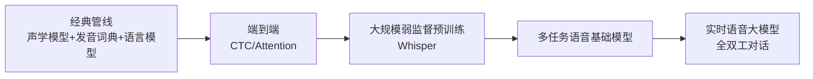
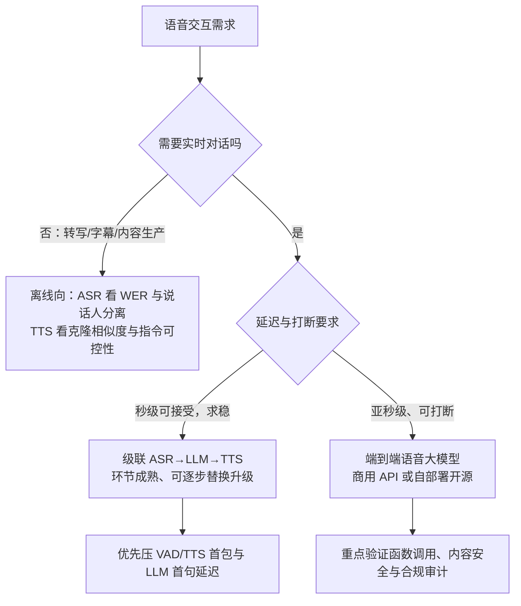

# 语音识别与理解

> 面向做语音交互选型、想把语音能力接进现有系统的工程师与架构师。这篇把语音技术线讲透：**识别（ASR）为什么被 Whisper 的弱监督范式改写、合成（TTS）怎么从拼接库走到零样本克隆、实时对话的级联与端到端两条路线怎么取舍**，以及一线落地时音频编解码、流式推理、方言噪声这些课本不讲的工程细节。

语音是交互最自然的入口。这条技术线走过"声学模型+语言模型拼接"的经典时代，被端到端 Encoder-Decoder 统一，如今正在进入"语音大模型"阶段——识别、合成、理解、对话在一个模型里闭环。我在方案评审里对语音的判断始终如一：**它已经过了"能不能用"的阶段，现在的分水岭是延迟、可控性和合规**。

## 技术演进

这条演进线里真正改变游戏规则的是两个节点：Whisper 证明了"海量弱监督数据 + 简单稳健架构"可以碾压精心设计的专用管线；语音 tokenizer（把波形压缩成低码率离散 token 的编码器，如 Mimi、Encodec 类）则让语音第一次能像文本一样被语言模型直接消费——TTS、ASR、实时对话从此共用同一个底座。

## ASR：语音识别

### Whisper：弱监督大规模范式的胜利

Whisper 是 OpenAI 2022 年底发布的工作（Radford 等，arXiv 2212.04356）：用从互联网收集的 **68 万小时多语言音频-文本对**做弱监督训练——不精标注、不人工清洗，只用"预测互联网上音频对应的转录文本"这个朴素目标，把数据规模比前人扩大了一个数量级。架构反而是最朴素的 Transformer Encoder-Decoder，多任务（转录、翻译、语种识别、静音检测）用一组特殊 token 统一表达，一个模型替代了传统语音处理管线的多个阶段。

*图源：Whisper 论文（[arXiv:2212.04356](https://arxiv.org/abs/2212.04356)）方法总览图*

核心结论是**鲁棒性来自数据多样性而非架构精巧**：模型在零样本设置下（不做任何微调）逼近人类转写的准确率，对口音、背景噪声、专业术语的抗性和人类接近。我在离线转写项目里的体感一致：Whisper large 系在会议录音、播客、电话音质这些"脏数据"上的稳定性，明显好于在干净朗读集上刷分的专用模型。

工程使用注意两点：

- **turbo 是性价比甜点**。large-v3-turbo 是 809M 参数的 decoder-only 蒸馏版，官方数据约为 large 的 8 倍速度、6GB 显存即可跑，准确率损失很小——但它**没有训练翻译任务**，需要"外语转英语"时仍要用 large/medium。
- **Whisper 不支持热词定制，且对静音/噪声段有幻觉输出的已知问题**（会吐出重复或编造的文本）。做客服、会议等垂直场景时，热词与领域适配要靠外层工程或换模型，不能指望原生能力。

### 工业化的另一条线：非自回归与多任务理解

Paraformer 类非自回归模型——一步解码、速度数倍于自回归，适合实时与大并发场景，是阿里 FunASR 体系的骨干。这条线的代表是 **SenseVoice**：一个语音理解基础模型，把 ASR、语种识别（LID）、情感识别（SER）、音频事件检测（AED）统一在一个非自回归模型里。开源的 SenseVoiceSmall 覆盖中英日韩粤五语，中文与粤语识别有优势，推理延迟在数十毫秒级；研究版训练数据超 40 万小时、支持 50+ 语言。工程上两点值得注意：说话人分离不是它单模型的输出，要用 FunASR 管线组合 VAD 与说话人模型实现；2026 年起它有了 GGUF/llama.cpp 运行时，边缘与 CPU 部署也成为现实。

商用侧，ElevenLabs 的 Scribe v1（2025-02）主打"真实世界音频"的转写精度：99 语言、词级时间戳、说话人分离、音频事件标签，官方宣称在 FLEURS 与 Common Voice 基准上整体优于 Gemini 2.0 Flash、Whisper large-v3 等——这类对比要留意各家选的基准子集，但方向上"专用商用 ASR 重新拉开与通用开源的差距"是成立的。

### 语音指令理解与实时字幕

两个应用面值得分开说：

- **实时字幕/实时转写**：本质是流式 ASR 管线——VAD（语音活动检测）切句、分块增量解码、标点恢复、热词注入，缺哪一环体验都会塌。Scribe v2 Realtime 把这条线卷到了官方宣称 <150ms 的流式延迟，直接面向语音 Agent 与会议助理；代价是实时版不带说话人分离（离线批处理版才有）。
- **语音指令理解**："听懂指令"过去等于 ASR 加 LLM 两段拼接，韵律信息在转成文本那一步就丢了（"重音在哪、语气是否着急"）；端到端多模态模型正在把这个环节并入统一底座，让模型直接"听"指令——这是后面实时对话路线的伏笔。

**关键指标**：词错率（WER，转写错词占比）、首包延迟、并发成本——实时场景三者互相牵制。我的经验边界：离线转写可以放心追 WER；实时交互场景里，把首包延迟压进预算通常比再降一个点 WER 值钱。

## TTS：语音合成

### 从拼接合成到端到端大模型

合成这条线的演进，我习惯按"声音从哪来"分成四代：

1. **拼接合成**：录制单个说话人的大片段语音库，运行时拼接。声音自然但笨重——换个音色、换种情绪就要重新录一整个库（早期导航、客服语音都是这个味道）。
2. **统计参数合成**：把发声信息存进模型参数，音色与风格可控了，但合成声音"机器味"重，还要依赖信号处理声码器（vocoder，把声学特征还原成波形的模块）。
3. **神经声码器时代**：DeepMind 2016 年的 **WaveNet** 是分水岭——不再经过声学特征，直接对原始波形逐样本自回归建模（每秒 16,000+ 个采样点），用空洞因果卷积获得长时程依赖，把与人类自然度的差距缩小 50% 以上。初版生成极慢（逐样本生成），随后经并行化改造进入 Google 云 TTS 商用，生成速度提升约 1000 倍。此后的 Tacotron/FastSpeech（文本到声学特征）+ 神经声码器、以及端到端的 VITS，构成了 2017–2022 年的主流配方。
4. **端到端大模型 TTS**：把语音编码成离散 token，用 LLM 自回归预测语音 token，再由 flow matching（流匹配，一种生成式建模方法）或声码器还原波形——零样本音色克隆时代由此开始。

*图源：CosyVoice 2 论文（[arXiv:2412.10117](https://arxiv.org/abs/2412.10117)）Figure 1*

开源生态现在是三足鼎立，我做选型时的印象：

| 项目 | 技术路线 | 特点与适用 |
| --- | --- | --- |
| CosyVoice 系（通义） | LLM 预测 25Hz 语音 token + flow matching | 9 语言 + 18 种以上中文方言、3 秒参考音频零样本克隆、自然语言指令控制、双向流式 150ms 首包；Fun-CosyVoice3-0.5B 已发布 RL 对齐版本 |
| F5-TTS（上交等） | 非自回归 flow matching + DiT，ConvNeXt V2 做文本表示 | 去掉时长预测与对齐模块，训练推理更快，零样本克隆，中英基座（Emilia 数据） |
| Fish Speech（Fish Audio） | LLM 式语音生成，S2 系 | 10–30 秒参考样本克隆音色/风格/情感；注意其研究许可协议，商用要看清条款 |

### 情感与音色控制的能力边界

当前主流形态是**指令可控合成**：情感、语速、风格用自然语言控制；**零样本克隆**：几秒参考音频复刻音色；**跨语言合成**：用中文音色说英语。产品级标杆看 ElevenLabs v3（2026-03 GA）：用方括号音频标签做情感导演——`[laughs]`、`[whispers]`、`[worried]` 这类提示按"表演指导"而非朗读文本处理，覆盖情绪、语速节奏、人类反应声（笑、吸气）、音效等类别，取代了繁琐的 SSML，支持 70+ 语言。

但要老实标出能力边界（我测过的范围内）：**极端情绪（哭腔、耳语长段落）、唱歌、超长文本的稳定性**仍是各家共同的软肋；克隆音色在陌生语言上会"串味"；指令控制在开源模型上的遵从度不如商用旗舰。CosyVoice 类开源模型把"音色克隆 + 指令控制"开源化，让本地部署的语音交互成为可能——数据不出域的客服、车载、硬件场景，这是最现实的落点。

## 实时语音对话：从级联到端到端

### 级联方案：ASR → LLM → TTS

工程成熟、每个环节可独立替换与优化，今天多数生产语音客服仍是这个形态。问题是**延迟叠加**，典型预算拆法（经验值，随模型与网络浮动）：

| 环节 | 典型耗时 | 说明 |
| --- | --- | --- |
| VAD 端点判断 | 300–500ms | 等静音间隙确认"用户说完了" |
| 流式 ASR 出最终结果 | 100–200ms | 分块增量输出 |
| LLM 首 token | 300–800ms | 模型大小与首句流式策略影响最大 |
| TTS 首包 | 100–300ms | 双向流式模型可压到 150ms 级 |
| 网络与抖动 | 100–300ms | 移动网络更差 |

叠加后通常 1.5–3s，且 ASR 转成文本那一步**永久丢失韵律信息**——用户讽刺还是认真、着急还是随意，LLM 看不到。

### 端到端语音模型：音频进、音频出

语音 token 直进直出，延迟降到数百毫秒，保留语气与情感。两条代表路线：

- **Moshi（Kyutai，2024-09）**：首个开源全双工 speech-text 基础模型。Mimi 神经音频编解码器把语音压成 12.5Hz、约 1.1kbps 的离散 token，单一语言模型同时建模"用户流"和"自身流"两路音频加一路文本"内心独白"——所以它天然能边听边说、被打断。

*图源：Moshi 论文（[arXiv:2410.00037](https://arxiv.org/abs/2410.00037)）Figure 1*

- **gpt-realtime（OpenAI，2025-08）**：生产级语音 Agent 路线——speech-in-speech-out、函数调用、Realtime API 转正式版，与 Moshi 的"研究驱动全双工"互补。国内代表是 Qwen3-Omni / GLM-4-Voice 这类 Omni 化模型（Thinker-Talker 结构，流式语音进出）。

**全双工**（可打断、可边听边说，逼近真人对话节奏）是语音交互的体验分水岭——2024 年还是论文亮点，2025 年起成为产品基准。

### 两条路线怎么选

我的判断：客服、外呼这类**流程确定、话术受控**的场景，级联方案仍是稳妥选择，优化延迟预算比重构架构划算；陪伴、助手、口语练习这类**体验驱动**的场景，端到端的自然度差距用户一听便知，值得为它承担更高的成本与较新的工程不确定性。

## 音频理解的扩展

不止语音：声音事件识别（AED）、音频内容理解（音乐/环境声）、音频检索，都在并入同一批基础模型的能力清单。语音大模型正在把"听觉"并入多模态底座——与视觉理解的融合路线一致（参见 [视觉理解](/ai/models/vision)），Omni 模型的落地应用视角另见 [多模态应用](/ai/application/multimodal)。

## 2026 格局：主力模型速览（更新于 2026-09）

| 方向 | 代表 | 时间 | 要点 |
| --- | --- | --- | --- |
| ASR 开源 | Whisper large-v3-turbo | 2024-09 | 809M decoder-only 蒸馏，约 8 倍速度，不支持翻译 |
| ASR 开源 | SenseVoice（通义） | 2024-07 | 非自回归、低延迟、情感/事件识别一体，中英日韩粤 |
| ASR 商用 | ElevenLabs Scribe v1/v2 | 2025/2026 | 99 语言、说话人分离；v2 Realtime <150ms 面向 Agent |
| TTS 开源 | Fun-CosyVoice3-0.5B | 2025-12 | 3s 零样本克隆、指令控制、**RL 对齐优化**、150ms 双向流式 |
| TTS 开源 | F5-TTS / Fish Speech | 2024/2025 | flow matching 非自回归路线 / LLM 式克隆路线 |
| TTS 商用 | ElevenLabs v3 | 2026-03 GA | 音频标签式情感控制（[laughing]/[sad]）、70+ 语言 |
| 实时对话 | Moshi（Kyutai） | 2024-09 | 首个开源全双工 speech-text 基础模型 |
| 实时对话 | gpt-realtime（OpenAI） | 2025-08 | 生产级语音 Agent：低延迟、函数调用、speech-in-speech-out |
| 实时对话 | Qwen3-Omni / GLM-4-Voice | 2025 | Omni 化代表：Thinker-Talker 流式语音进出 |

**格局要点**：

- **级联管线 → 端到端**：语音 token 直进直出保留副语言信息（情感、语气）成为旗舰路线
- **全双工与打断**成为体验基准（Moshi 开创，2025 全面普及）
- **低码率语音 tokenizer（12.5–25Hz 级）**成为 ASR/TTS/对话共用底座；RL 开始用于 TTS 质量优化
- **Agent 化明确**：Scribe v2 Realtime、gpt-realtime 均直接面向实时语音 Agent 场景

## 实践观点（SA 笔记）

- **选型三分法**：离线转写看准确率与说话人分离；实时交互看首包延迟与全双工能力；声音产品化（有声书/客服音色）看克隆相似度与授权合规
- **声音克隆的合规线**：音色属于人格权益，商用必须取得授权——方案里要内置授权链与水印（Moshi 等已内置音频水印评估；国内上线还要对齐深度合成标识要求）
- **开源还是云服务**：数据不出域、要方言微调、有 GPU 团队，选自部署开源（CosyVoice/F5/SenseVoice + FunASR 管线）；求开箱即用、多语言长尾、免运维，选云服务（通义语音、ElevenLabs 类 API）。多数企业的现实路径是：**原型用云，上量后按数据合规要求决定是否自部署**
- **成本视角**：语音模型推理开销远低于视频/图像生成，实时语音是"低延迟高并发"的推理工程题，适配 [推理部署](/ai/infra/inference/llm-inference) 里的并发优化方法

### 工程视角：编解码、流式与鲁棒性

- **音频编解码有两层含义**。传输层：实时链路普遍用 Opus 编码 + WebRTC 传输，16kHz 采样足够覆盖语音频带；建模层：神经音频编解码器（Encodec/Mimi 类）把波形压成离散语音 token，码率可低至 1.1kbps——这是端到端语音模型的基石，选型时要确认链路各段的采样率与编码一致，否则重采样本身就会劣化识别率。
- **流式推理是实时语音的硬约束**：分块大小直接换算成延迟下限，KV cache、chunk 感知的 flow matching、双向流式（文本流入、音频流出）是开源生态的标准优化项。评估别只看 RTF（实时率，合成 1 秒音频所需秒数），要看**首包延迟的 P95**——均值好看的系统经常死在长尾上。
- **方言与噪声鲁棒性**：Whisper 的抗噪来自 68 万小时脏数据的多样性；方言覆盖看模型清单（CosyVoice3 支持 18 种以上中文方言、SenseVoice 覆盖粤语），清单之外靠业务数据微调。我遇到的情况是：会议室远场、车载、电话窄带这三类场景，不做针对性测试就上线，翻车率很高。

## 常见坑

| 坑 | 现象 | 根因与对策 |
| --- | --- | --- |
| 静音段幻觉 | Whisper 在无声/噪声段输出重复或编造文本 | 前置 VAD 过滤；监控输出重复率 |
| 拿 turbo 做翻译 | 翻译任务输出原文 | large-v3-turbo 未训练翻译，换 large/medium |
| 热词缺失 | 人名、产品名、行业词识别错误 | Whisper 无热词能力，换支持定制的模型或加后处理纠错 |
| 级联延迟只测均值 | 线上偶发 5s+ 无响应 | 盯 P95/P99 首包；端点检测与 TTS 首包是两个最大压缩空间 |
| 克隆未授权商用 | 法律与舆情风险 | 授权链存证 + 音频水印 + 深度合成标识 |
| 采样率链路不一致 | 识别率无端下降 | 统一 16kHz/Opus 链路，避免多次重采样 |

## 参考资料

<Refs>

- [Robust Speech Recognition via Large-Scale Weak Supervision（Whisper 论文，arXiv:2212.04356）](https://arxiv.org/abs/2212.04356)（访问日期 2026-09-03）
- [OpenAI Whisper 官方仓库（模型规格与 turbo 说明）](https://github.com/openai/whisper)（访问日期 2026-09-03）
- [WaveNet: A generative model for raw audio（DeepMind 博客）](https://deepmind.google/blog/wavenet-a-generative-model-for-raw-audio/)（访问日期 2026-09-03）
- [WaveNet: A Generative Model for Raw Audio（arXiv:1609.03499）](https://arxiv.org/abs/1609.03499)（访问日期 2026-09-03）
- [Introducing Cloud Text-to-Speech powered by DeepMind WaveNet Technology（Google Cloud 博客）](https://cloud.google.com/blog/products/ai-machine-learning/introducing-cloud-text-to-speech-powered-by-deepmind-wavenet-technology)（访问日期 2026-09-03）
- [Scribe: the world's most accurate ASR model（ElevenLabs）](https://elevenlabs.io/scribe)（访问日期 2026-09-03）
- [Introducing Scribe v2 Realtime（ElevenLabs 博客）](https://elevenlabs.io/blog/introducing-scribe-v2-realtime)（访问日期 2026-09-03）
- [Audio tags 101: Directing emotional TTS in Eleven v3（ElevenLabs 博客）](https://elevenlabs.io/blog/v3-audiotags)（访问日期 2026-09-03）
- [CosyVoice 开源仓库（QwenAudio/CosyVoice，原 FunAudioLLM 组织）](https://github.com/QwenAudio/CosyVoice)（访问日期 2026-09-03）
- [CosyVoice 2: Scalable Streaming Speech Synthesis with Large Language Models（arXiv:2412.10117）](https://arxiv.org/abs/2412.10117)（访问日期 2026-09-03）
- [CosyVoice 3: Towards In-the-wild Speech Generation（arXiv:2505.17589）](https://arxiv.org/abs/2505.17589)（访问日期 2026-09-03）
- [SenseVoice 开源仓库（QwenAudio/SenseVoice）](https://github.com/QwenAudio/SenseVoice)（访问日期 2026-09-03）
- [FunAudioLLM: Voice Understanding and Generation（arXiv:2407.04051）](https://arxiv.org/abs/2407.04051)（访问日期 2026-09-03）
- [F5-TTS 开源仓库（SWivid/F5-TTS）](https://github.com/SWivid/F5-TTS)（访问日期 2026-09-03）
- [F5-TTS: A Fairytaler that Fakes Fluent and Faithful Speech with Flow Matching（arXiv:2410.06885）](https://arxiv.org/abs/2410.06885)（访问日期 2026-09-03）
- [Fish Speech 开源仓库（fishaudio/fish-speech）](https://github.com/fishaudio/fish-speech)（访问日期 2026-09-03）
- [Moshi: a speech-text foundation model for real-time dialogue（arXiv:2410.00037）](https://arxiv.org/abs/2410.00037)（访问日期 2026-09-03）
- [Introducing gpt-realtime and Realtime API updates for production voice agents（OpenAI）](https://openai.com/index/introducing-gpt-realtime/)（访问日期 2026-09-03）
- 站内相关：[视觉理解](/ai/models/vision) · [大语言模型架构解析](/ai/models/llm) · [多模态应用](/ai/application/multimodal) · [推理部署](/ai/infra/inference/llm-inference) · [模型架构演进总览](/ai/models/)

**图片来源**

- Whisper 方法总览图：Whisper 论文（[arXiv:2212.04356](https://arxiv.org/abs/2212.04356)），取自 ar5iv HTML 版
- CosyVoice 2 总览图：CosyVoice 2 论文（[arXiv:2412.10117](https://arxiv.org/abs/2412.10117)）Figure 1，取自 ar5iv HTML 版
- Moshi 架构总览图：Moshi 论文（[arXiv:2410.00037](https://arxiv.org/abs/2410.00037)）Figure 1，取自 ar5iv HTML 版

</Refs>
