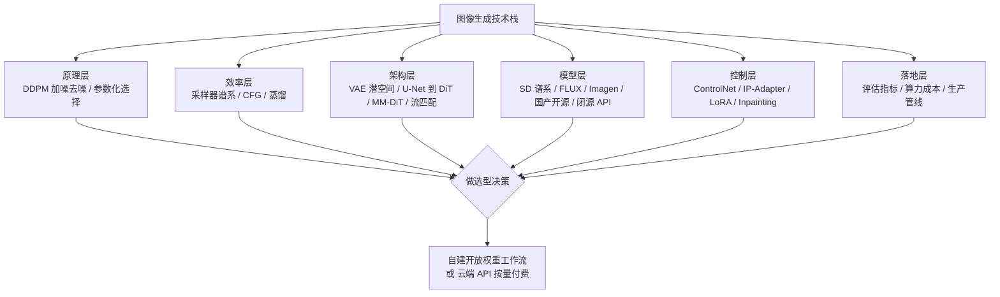
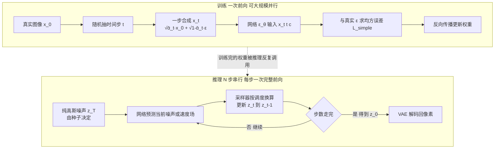
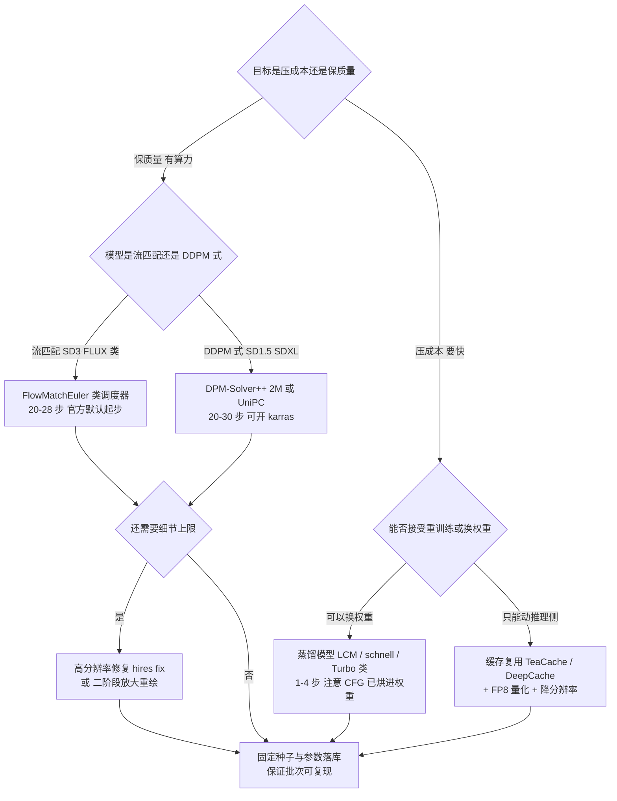
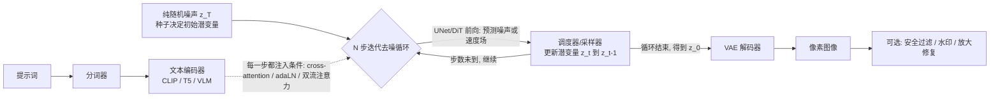
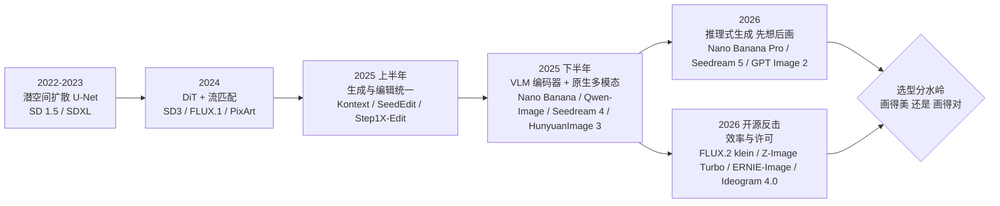
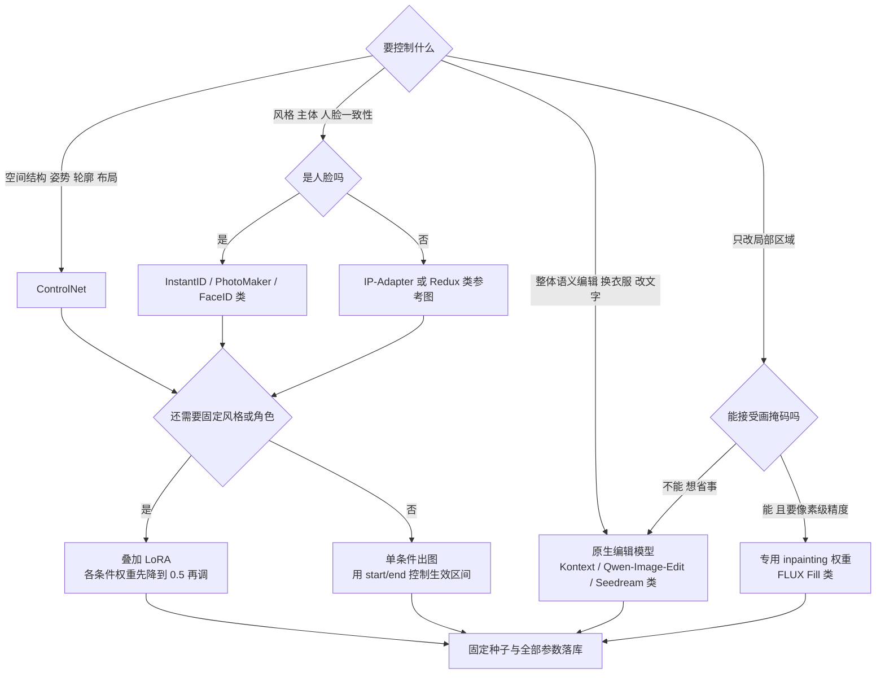
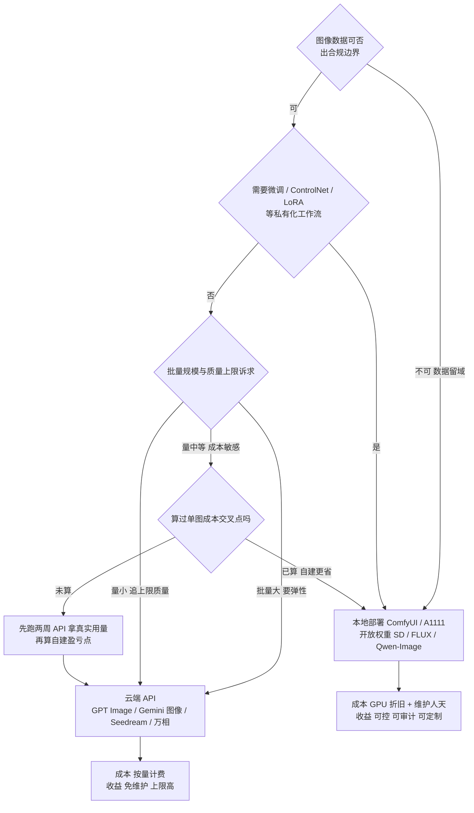

# 图像生成：从 Stable Diffusion 到 DiT 时代

> 面向要把文生图/图像编辑能力接进产品、并为"自建还是买 API"做决策的工程师与方案架构师。这篇把图像生成这条技术线从地基讲到格局：**DDPM 的前向加噪与反向去噪到底在学什么（噪声 ε 与目标图像 x₀ 的换算关系）、采样器为什么能从千步压到二十步、CFG 引导强度这个旋钮背后是什么权衡、Latent Diffusion 的 VAE 压缩为什么是"消费级显卡能跑"的根本原因、去噪主干为什么从 U-Net 换成 DiT 再演进到 MM-DiT 双流、以及 ControlNet / IP-Adapter / LoRA / Inpainting 这套可控性生态为什么只能长在开源侧**。读完你会掌握一条完整主轴：扩散原理打底 → 潜空间省算力 → 架构换代吃 Scaling Law → 流匹配压步数 → 可控性插件化 → 评估与成本落地。最后一层是 2025–2026 的新变局：自回归多模态路线（GPT-4o 原生生图）带着"理解与生成同一个模型"回来了，与扩散路线正面竞争，选型判断因此要重写。


*图源：CompVis/latent-diffusion 官方仓库 assets/txt2img-preview.png（MIT 许可，[GitHub](https://github.com/CompVis/latent-diffusion)）*

全文的地图长这样，后面每一节都是这张图上的一个格子：



## 从 GAN 到扩散：一次范式转变

2021 年之前图像生成的主流是 GAN（生成对抗网络：生成器造假、判别器打假，二者对抗博弈）。我在项目里经历过 GAN 时代，当时两个头疼问题是特征性的：

- **训练不稳定**：判别器与生成器要保持动态平衡，一方过强过弱都会震荡发散，调参经验难以复用；
- **模式覆盖差**：生成器学会产出少数几种"骗过判别器"的样本就停手，多样性缺失（模式坍缩）。

扩散模型（DDPM，2020）换了问题定义：前向过程把图像逐步加噪直到纯高斯噪声，训练目标是让网络学会**逐步去噪**；生成就是从纯噪声出发的迭代去噪。


*图源：DDPM 论文官方 HTML 版（Figure 2，[arXiv:2006.11239](https://arxiv.org/abs/2006.11239)）*

扩散为什么赢了？我的理解是三层：

1. **训练变成稳定的回归问题**：网络学的是明确的去噪目标（似然类目标），没有对抗博弈——训练曲线终于"可信"，这是工程团队敢投入的前提；
2. **模式覆盖全**：拟合的是整个数据分布而非"骗过判别器"的捷径，多样性有结构性保证（后续 "Diffusion Models Beat GANs on Image Synthesis" 在指标上把结论钉死）；
3. **过程每一步都可注入条件**：这个特性后来长出了整个可控生成生态（ControlNet、局部重绘）。

补一句经验边界：扩散并非在每个单项指标上都赢 GAN，但"训练可信、多样性有保证、条件可注入"的组合，使它成为唯一能工业化的路线——2022 年之后，新一代生成模型几乎都站在扩散/流匹配的地基上。GAN 并未死透：它退居两条支线，一是给扩散做后处理（超分、人脸修复里的 GAN 判别器），二是把对抗损失塞进蒸馏（把多步扩散蒸成 1–4 步的学生模型时，常用判别器补细节）——后面"成本与加速"一节会再提到。

代价同样清楚：迭代采样慢（DDPM 原始设定约千步）。此后整条加速技术线——DDIM、蒸馏、一致性模型、缓存复用——都在为这个代价还债，直到今天。

## DDPM 拆开看：加噪、去噪与"预测噪声"

这一节是全篇地基。我不堆公式，但要把三件事讲透：前向过程为什么可以一步到位、反向过程网络到底在回归什么、以及 ε 与 x₀ 为什么是同一枚硬币的两面。

### 前向加噪：一条已知的、不需要学习的下坡路

前向过程（forward / diffusion process）做的事很朴素：拿一张真实图像 x₀，按固定的噪声调度一步步掺高斯噪声，走 T 步（DDPM 原文 T=1000）后变成纯噪声 x_T。

关键在于**这条路径是人为规定死的，不含任何可学习参数**。每一步的形式是：

```text
q(x_t | x_{t-1}) = N( x_t ; √(1-β_t) · x_{t-1} , β_t · I )
```

β_t 是第 t 步掺多少噪声的"步长"（noise schedule，DDPM 原文用 1e-4 → 0.02 的线性调度，后续工作普遍改余弦调度）。单看一步没什么用，真正有用的是它的**闭式解**：因为高斯叠加高斯还是高斯，从 x₀ 直接跳到任意第 t 步，一次采样就够：

```text
x_t = √(ᾱ_t) · x₀ + √(1 - ᾱ_t) · ε ,   ε ~ N(0, I)
其中 ᾱ_t = ∏(1 - β_i)，i 从 1 到 t
```

这个式子我建议读到能默写，因为它就是整个扩散工程的"总闸"：

- **√ᾱ_t 是信号系数，√(1−ᾱ_t) 是噪声系数**，两者平方和恒为 1——本质是一个随 t 旋转的"信号-噪声配比"。t 小则信号主导，t 大则噪声主导，t=T 时信号系数趋近 0，x_T 就是纯高斯噪声；
- **训练时不需要真的跑 t 步**：随机抽一个 t，用上式一步合成 x_t，网络看着 (x_t, t) 去猜那个 ε。这就是为什么扩散训练能像普通监督学习一样简单并行——每步训练样本都是独立的一次回归；
- **它同时定义了"信噪比"这个坐标轴**：SNR(t) = ᾱ_t / (1−ᾱ_t)。后文所有关于"高噪声步学什么、低噪声步学什么"的讨论，都在这根轴上。

一个必须建立的直觉：**去噪不是"擦掉噪声"，而是"从噪声里认出结构"**。t 很大的时候，x_t 里的信号已经被压到接近零，网络此时的任务不是修细节，而是在几乎纯噪声里决定"这张图大体是什么"——构图、主体位置、色调。t 很小的时候反过来，全局早就定了，网络只在补高频细节。这条"先定骨架、后填细节"的粗到细顺序，是扩散模型的固有行为，也解释了后面两个工程现象：为什么高分辨率要做 timestep shifting（SD3 论文的重点之一），为什么少步采样最先丢的总是细节而不是构图。

### 反向去噪：网络在学一个"往回走一小步"的分布

生成走的是反方向：从 x_T 出发，逐步回到 x₀。真实的反向条件分布 q(x_{t-1} | x_t) 是不可解的（要知道整个数据集才行），但**如果额外告诉你 x₀，反向的单步分布是有闭式解的**——这是 DDPM 推导里最漂亮的一步，也是所有采样器的数学起点。于是做法变成：训练一个网络 p_θ(x_{t-1} | x_t) 去逼近它，具体是学这一步的均值和方差，然后：

```text
x_{t-1} = μ_θ(x_t, t) + σ_t · z ,   z ~ N(0, I)（t=1 时不注入）
```

μ_θ 是网络预测出来的"往回走一步应该到哪"，σ_t·z 是重新注入的随机性（DDPM 祖先采样每步都注入，这也是它必须走满千步的原因之一）。

那么 μ_θ 怎么参数化？DDPM 的推导从 ELBO（证据下界：把生成过程的对数似然分解为逐步变分项之和）出发，化简后的结论是：**让网络学每一步反向分布的均值，等价于让它回归该步加入的噪声 ε**。于是网络的实际输入输出是：

```text
输入: x_t（当前带噪潜变量） + t（时间步嵌入） + c（文本等条件）
输出: ε_θ(x_t, t, c)，与 x_t 同形状
损失: L_simple = E[ ‖ ε − ε_θ(x_t, t, c) ‖² ]   （无加权均方误差）
```

Ho 等人进一步把各步的权重系数直接扔掉，用这个无加权的均方误差做损失（L_simple）。论文的消融实验表明，这个"不严格"的损失在样本质量上反而优于严格 ELBO 目标——代价是似然指标变差。**这个取舍很典型：优化一个更"人性化"的代理目标，换来视觉质量，牺牲理论似然**。今天几乎所有扩散模型的训练损失都是 L_simple 的变体。

### ε 与 x₀：同一信息的两种写法

高频面试题"为什么预测噪声而不是直接预测图像"，答案的核心是一句话：**在 x_t 已知的前提下，ε 和 x₀ 是严格线性可互换的，信息量完全相同，差的只是数值性质和隐含权重**。

把前向闭式解反解出来即可：

```text
已知 x_t = √ᾱ_t · x₀ + √(1−ᾱ_t) · ε

⇒ 预测了 ε，就能算出 x₀ 的估计：
  x̂₀ = ( x_t − √(1−ᾱ_t) · ε_θ ) / √ᾱ_t

⇒ 反过来，预测了 x₀，也能算出 ε：
  ε̂ = ( x_t − √ᾱ_t · x̂₀ ) / √(1−ᾱ_t)
```

所以"预测噪声"和"预测图像"不是两种模型，是同一个模型的两种输出接口。工程上真正在意的是三点差别：

- **目标的数值性质**：ε 在任何时间步都从同一个标准正态分布采样，目标尺度前后一致（均值 0、方差 1），网络输出的动态范围全程稳定；若直接回归 x₀，高噪声步的输入几乎全是噪声，从里面外推整张图像方差极大，训练不稳；
- **隐含加权**：ε 参数化相当于给各时间步自动套上与信噪比相关的权重，让每一步对最终成图质量的贡献相对均衡——这正是 L_simple 简化的用意；x₀ 参数化则天然偏向低噪声步（细节），高噪声步的"定构图"任务权重被压低；
- **中间结果的可用性**：预测 x₀ 有个很实用的副作用——每一步都能拿到一张"当前对成图的完整猜测"（业内叫 x₀ prediction / preview），可以立刻做裁剪、做安全审核、做提前停止。这在生产管线里是真实需求（例如"生成到一半发现违规就直接中断"），所以一些编辑/超分场景反而故意选 x₀ 参数化。

再加上流匹配的速度场，一共有四种常见参数化。看懂这张表，再遇到任何新模型说"我们预测 v / 预测速度场 / 预测 flow"，都不会觉得换了世界：

| 参数化 | 网络输出 | 与 x_t、x₀ 的关系 | 典型用在哪 | 工程含义 |
| --- | --- | --- | --- | --- |
| ε-prediction | 该步掺入的高斯噪声 | x̂₀ = (x_t − σ_t·ε̂)/α_t | DDPM、SD 1.5、SDXL | 目标尺度全程稳定，训练最省心；默认选择 |
| x₀-prediction | 干净图像本身 | 直接输出 x̂₀ | 超分、修复、部分编辑模型 | 每步可预览成图，便于中途审核/早停；高噪声步训练不稳 |
| v-prediction | v = α_t·ε − σ_t·x₀ | ε 与 x₀ 的线性组合 | 渐进蒸馏、SD 2.x、视频模型 | 在高/低噪声两端都数值良好，天生适合少步蒸馏 |
| velocity / flow | 概率流的速度场 dx/dt | 直线路径上"从噪声指向数据"的方向 | 流匹配、rectified flow：SD3、FLUX、多数 2025+ 新模型 | 路径拉直后离散化误差小，步数天然更少；与 ε 参数化可互换 |

> 一句话记住：**参数化是选择，不是教条**。它们是同一目标的等价表示，差别在数值稳定性、隐含的时间步加权、以及能不能拿到中间预览。

### 训练与推理的不对称

最后把整件事压成一张流程图。注意训练与推理的不对称：训练是"一步合成 + 一次回归"，完全并行；推理是"N 步串行前向"，每步都要跑一遍完整主干。这个不对称是扩散模型"训练好扩容、推理天生贵"的根源。



## 采样器谱系：从千步到二十步的那条加速线

主干网络只回答"当前潜变量里是什么噪声/该往哪走"，**从 z_t 走到 z_t-1 的具体走法由调度器（scheduler，前端常叫采样器）决定**——它把网络的预测按自己的离散化方案换算成潜变量更新。这条线是扩散工程最容易被低估的部分：同一套权重，换个采样器、调个步数，出图质量和耗时能差一倍。

### 三代思路

| 思路 | 代表 | 机制要点 | 典型步数 | 工程含义 |
| --- | --- | --- | --- | --- |
| 祖先采样 | DDPM 原始采样 | 严格马尔可夫、每步注入随机性 | ~1000 | 只在研究里见；生产不用 |
| 确定性跳步 | DDIM | 反向过程改为非马尔可夫确定性轨迹 | 20–50 | 不重训练减步数的第一刀；潜空间确定、可插值、同种子可复现 |
| 高阶求解器 | DPM-Solver / DPM-Solver++ / UniPC / Euler、Heun | 把反向过程当 ODE，用高阶方法近似积分 | 15–30 | SD 时代的工程默认，质量/步数比最优 |
| 蒸馏与一致性 | 渐进蒸馏、LCM、DMD2、[schnell] 类 | 学生模型直接模仿教师多步输出 | 1–4 | 需要重训练；换来数量级提速，代价是多样性与细节 |

**DDIM 为什么能跳步**：DDPM 的反向过程是马尔可夫的（每步只看上一步、每步都注入新随机性），所以不能省步。DDIM 的观察是——前向闭式解 x_t = √ᾱ_t·x₀ + √(1−ᾱ_t)·ε 对任意 t 都成立，那么完全可以构造一个**非马尔可夫**的反向过程，让它共享同一族边缘分布 q(x_t)，但把随机性抽掉（论文里的 η 参数，η=0 完全确定，η=1 精确退化回 DDPM）。η=0 时整条采样轨迹由初始噪声唯一决定，于是可以只在 1000 步里挑 50 个子序列来走，论文实测墙钟时间快 10–50 倍，潜空间还因此可做语义插值。**同一套权重、不用重训练，千步变几十步**——这是 2020 年底最重要的工程突破，也是"同种子出同图"这件事的由来。

**DPM-Solver 为什么更快**：它换了个视角——把去噪过程写成关于"对数信噪比 λ = log(α_t/σ_t)"的常微分方程（probability flow ODE），并发现这个 ODE 是**半线性**的：线性部分有解析解，只需要对非线性部分（网络的 ε 预测）做数值近似。于是可以用高阶泰勒展开（2 阶、3 阶）大踏步前进而不失精度：论文数据是 10 次网络评估在 CIFAR-10 上 FID 4.70、20 次 2.87，比此前的免训练采样器快 4–16 倍。DPM-Solver++ 进一步改成 x₀ 预测形式（data-prediction）并加阈值裁剪，专门解决"带 CFG 采样时旧高阶方法反而不稳、甚至比 DDIM 更慢"的问题；UniPC 则把"预测-校正"框架统一起来，**校正步不额外调用网络**就能提阶，10 步以内表现最好（CIFAR-10 无条件 FID 3.87、ImageNet 256 条件 7.51）。

**噪声调度也要修**：Karras 等人的工作（EDM 论文与 "Common Diffusion Noise Schedules and Sample Steps are Flawed"）指出常见调度在末端信噪比不归零（zero-SNR 问题），会导致出图整体偏灰或偏亮；EDM 提出的 sigma 序列（karras 调度，实现里是 rho=7 的幂律，把采样点在低噪声端加密）在少步采样下明显更好——EDM 用 35 次评估就在 CIFAR-10 条件生成上拿到 FID 1.79。这解释了前端 UI 里除了采样器还有"scheduler: karras / exponential / normal"这个下拉框——它调的是**走哪些时间点**，与"每步怎么走"（求解器阶数）是两个正交的旋钮。经验上：高分辨率、少步数场景开 karras 常有肉眼可见的收益（经验值，按模型微调）。

**流匹配把路径本身拉直**：上面所有办法都是在"弯曲的路径"上想办法走得更快；流匹配（Flow Matching / rectified flow）改的是路径——训练时直接规定噪声与数据之间走**直线插值**（rectified flow 的原始论点就是"直线是两点间最短路径，可以不做时间离散而被精确模拟"），网络学这条直线上每一点的速度场。路径越直，同样的离散化步长误差越小，步数天然能压得更低。SD3 论文的实测是：在少步采样（<25 步）区间，rectified flow 显著优于 DDPM 式训练目标；步数充足时两者趋同。推理侧对应 diffusers 的 `FlowMatchEulerDiscreteScheduler`（一阶欧拉解直线 ODE），FLUX.1 [dev] 的 28–50 步、[schnell] 的 1–4 步都跑在它上面。**这就是 2025–2026 新模型几乎全部转向流匹配的原因**，也意味着"扩散=千步采样"的旧印象应当整体更新。这一点与语音侧完全同源——TTS 的 DIT + DAV 路线用的也是流匹配加欧拉求解器，机制可以互相印证，见站内[语音生成](/ai/models/speech-gen)的 DIT 一节。

**蒸馏与一致性模型是另一条路**：一致性模型（Consistency Models）要求"轨迹上任意一点都能直接映射回数据点"，设计上支持一步生成（一步在 CIFAR-10 上 FID 3.55、ImageNet 64×64 上 6.20），还能免费获得 zero-shot 修复/上色/超分；LCM 的关键差别是**把 CFG 增广后的 PF-ODE 当作蒸馏目标**，等于把引导一起内化进学生模型，推理时不必再跑双分支。这两条与 DDIM/DPM-Solver 的区别是：前者改权重，后者只改采样过程。

### 怎么选：一张决策图



两个衔接点值得记住：其一，调度器是"不重训练的减步"，同一套权重可换不同调度器，这就是前端 UI 允许自由切换采样器的工程原因；其二，蒸馏是"重训练的减步"——学生模型直接模仿教师多步采样的输出，渐进蒸馏每轮把步数减半，一路压到个位数；一致性模型（Consistency Models）与 LCM 则更激进，直接要求"轨迹上任意一点都能一步映射到终点"。两者方向相同，下文"算力成本"一节的加速手段排序就建立在这个认知上。

## Classifier-Free Guidance（CFG）：引导强度的权衡

文生图有个天然毛病：模型学的是图文对的联合分布，采样时即使带着文本条件，也经常"沾边但不听话"。早期的分类器引导（"Diffusion Models Beat GANs" 一文采用的方法）靠额外分类器的梯度把采样拉向条件——效果好，但每种条件都要单训一个分类器，文本条件上根本不实用。Classifier-Free Guidance（CFG，Ho & Salimans，2021 年发表）把这个外部依赖去掉了，如今已是所有主流文生图模型的内置机制：界面与 API 上的 guidance / guidance scale 旋钮，就是它。

机制两句话：

- **训练时**：按一定概率（实践常见 10%-20%）随机把文本条件替换为空嵌入，同一个网络同时学会条件预测 ε(x, c) 与无条件预测 ε(x, ∅)，不增加任何结构；
- **推理时**：每一步做双前向（带条件一次、不带一次），然后沿"无条件 → 条件"方向线性外推：

  `ε̂ = ε(x, ∅) + s·(ε(x, c) − ε(x, ∅))`

  其中 s 是引导强度（guidance scale）：s=1 就是普通条件预测，s>1 则放大条件的作用——直观理解是"宁可过头，也要听话"，等价于把条件似然的梯度加权放大。

代价很直接：每步两次前向，推理算力翻倍（工程上通常拼成一个 batch 一次前向）。这也是蒸馏模型（如 FLUX.1 [schnell]）要把引导直接烘进权重的动机之一。


*图源：The AI Summer 的 CFG 综述文章引用，原图为 Ho & Salimans, Classifier-Free Diffusion Guidance 论文插图（[theaisummer.com](https://theaisummer.com/classifier-free-guidance/)）*

权衡非常陡：

- **过低**（SD 1.x/XL 时代经验，低于 4-5）：出图松弛、不听指令，提示词里的主体可能干脆不出现；
- **过高**（经验值，高于 12-15）：过饱和、对比度炸裂、细节油画化、结构畸变，样本同时向少数模式坍缩、多样性丢失；
- **中间区间是甜区**：上图的 IS/FID 曲线就是实证——质量随引导强度升到峰值，之后多样性持续买单。

从业者的典型口径（经验值，跨模型不可照搬，任何模型都先从官方默认值起步）：

| 模型代际 | 经验常用区间 | 官方/推荐锚点 |
| --- | --- | --- |
| SD 1.x / SDXL（UNet + CLIP） | 6-9 | diffusers 管线默认 7.5 |
| SD3（MM-DiT + 流匹配） | 5-8 | 官方模型卡推荐 7.0、28 步 |
| FLUX.1 [dev] | 3.5 附近 | BFL 官方推理参数 3.5、28-50 步 |
| Qwen-Image | 4.0 附近 | QwenLM 官方示例 true_cfg_scale=4.0 |
| 蒸馏少步模型（[schnell] 类） | 基本不需要 | 引导已烘进蒸馏，1-4 步出图 |

三个判断：

1. **引导强度跨模型不可比**。这个数字不是物理绝对量，与训练时的条件丢弃率、编码器、参数化都耦合——FLUX.1 [dev] 的 3.5 与 SD3 的 7.0 完全不是同一档"力度"。换模型别搬运旧参数，先按官方默认，再小幅微调；
2. **guidance 正在被"烘进"权重**：FLUX.1 [dev] 把引导强度直接作为网络输入（引导蒸馏），每步只需单次前向；[schnell] 更进一步连步数一起蒸馏。"引导提质量、算力翻倍"的矛盾，蒸馏是目前的常规解法；
3. **负向提示是 CFG 机制上的顺带功能**：它只是替换无条件分支的条件输入，"不要出现 XXX"靠的是同一套外推。DiT 时代（SD3/FLUX）官方口径转向直接正向描述后，负向提示的使用明显减少——与下文"提示词工程"节的判断一致。

再补两个一线常遇到的细节：

- **`true_cfg` 与 `guidance` 是两回事**。FLUX.1 [dev] 这类做过引导蒸馏的模型，界面上的 guidance 是"喂给网络的嵌入值"，只跑一次前向；而 diffusers 里的 `true_cfg_scale` 才是真正的双前向外推。Qwen-Image 官方示例给的 4.0 属于后者。混用这两个旋钮是常见的调参事故来源——先确认自己动的是哪一个；
- **CFG 在高分辨率下会放大缺陷**。ControlNet 论文因此提出 CFG Resolution Weighting（CFG-RW），在不同分辨率/步数区间对引导强度做加权，避免高分辨率下引导过强导致的结构畸变。实践中更简单的做法是：高分辨率二阶段（hires fix）把 CFG 调低一档。

## Latent Diffusion：为什么必须先把图像压小

像素空间做扩散太贵。512×512×3 的图像有 78 万个维度，U-Net 每一步前向都要在这个尺度上做多层卷积，且要走几十步——单图成本直接压垮消费级显卡。Latent Diffusion Models（LDM，即 Stable Diffusion 的论文，CVPR 2022）做了一个最重要的工程决策：先用 VAE（变分自编码器，一种把图像压到低维潜空间再重建的网络）把图像压缩，扩散过程在潜空间进行，最后解码回像素。

以 SD 1.x 的 8 倍空间压缩为例，512×512×3 的图变成 64×64×4 的潜变量，空间维度少了 64 倍，通道数只多 4/3——**去噪主干的计算量降一个数量级以上**。这是"消费级显卡能跑"的根本原因，我认为它比任何网络细节改进都重要。


*图源：CompVis/latent-diffusion 官方仓库 assets/modelfigure.png（MIT 许可，[GitHub](https://github.com/CompVis/latent-diffusion)）*

### VAE 压缩不是免费的：一条必须自己走一遍的取舍曲线

压缩倍数 f 选多少？这不是拍脑袋，LDM 与 SD3 论文都做了系统的自编码器消融。SD3 的结论很有代表性：**单纯增大压缩率会让下游扩散模型的质量掉得很明显；要保住质量，必须同时增加潜空间通道数**。


*图源：SD3 论文（Scaling Rectified Flow Transformers）图 10（[arXiv:2403.03206](https://arxiv.org/abs/2403.03206)）*

这条曲线怎么读，以及它在选型上的意义：

- **f=8 是过去四年的事实标准**：SD 1.5/SDXL 用 f=8 + 4 通道，SD3 与 FLUX 用 f=8 + 16 通道，Qwen-Image 也用同量级的自编码器。f=8 时一张 1024×1024 的图对应 128×128 的潜变量网格，DiT patch=2 后就是 64×64 = 4096 个 token——这个 token 数直接决定了每一步前向的注意力开销；
- **f=16 甚至更高（更激进的压缩）在研究里可行，但代价是重建上限**：Qwen-Image 技术报告里对不同 VAE 的重建对比图很直观——把细节区域逐级放大，压缩狠的 VAE 连原始图都还原不好，此时扩散模型再强也超不过解码器的天花板；
- **工程含义**：评估一个开源模型时，除了看主干，要看它配套的 VAE。潜空间重建质量是整个系统的上限，而这一环在模型卡里通常只有一句话。文字、细线、人脸小图这类高频内容出问题，先怀疑 VAE，再怀疑主干。


*图源：Qwen-Image Technical Report 图 17（[arXiv:2508.02324](https://arxiv.org/abs/2508.02324)）*

### 定型的"三件套"架构

由此定型的"三件套"架构，成为整个 SD 谱系的标准形态，直到今天绝大多数开放权重模型仍是这个骨架：

| 组件 | 职责 | SD 1.5 | SDXL | SD3 / FLUX | Qwen-Image |
| --- | --- | --- | --- | --- | --- |
| 文本编码器 | 把提示词转成语义向量序列 | CLIP ViT-L | OpenCLIP ViT-bigG + CLIP ViT-L 双编码器 | CLIP×2 + T5-XXL（FLUX 为 CLIP-L + T5-XXL） | Qwen2.5-VL（多模态 LLM 当文本编码器） |
| 去噪主干 | 每步预测噪声/速度场 | U-Net，cross-attention 注入条件 | 更大的 U-Net + 注意力层扩展 | MM-DiT 双流 Transformer | 双流 MMDiT，20B |
| VAE | 潜空间与像素互转 | f=8，4 通道 | f=8，4 通道（另训修复用 VAE） | f=8，16 通道 | f=8 量级，自研 VAE |

其中 **cross-attention**（去噪网络在每一步"回头看"文本向量的注意力机制）是文生图的条件注入点——这个机制值得单独强调：**条件不是一次性注入，而是在每一步、每一层都重新注入一次**，这是可控生成能做得这么深的机制根源。

量级感：SD 1.5 在 512×512 下约 6GB 档显存可用，SDXL 的 1024×1024 约需 8-12GB 档——这个量级决定了扩散的第一波爆发发生在个人电脑而非机房。到了 FLUX.1 dev（12B）与 Qwen-Image（20B）这一代，全精度推理要 24GB 以上，FP8/INT4 量化后才回到消费级区间（详见"算力成本"节）。**开源模型的参数量在两年里涨了十倍，"本地能跑"的含义已经从"游戏显卡随便玩"变成"要懂量化"**。

### 端到端生成流水线：一句话怎么变成一张图

三件套定型之后，文生图的完整过程就可以画全了。无论是 SD 谱系、FLUX 还是 Qwen-Image，推理管线的骨架基本一致。我给人讲方案时习惯先画这张图：有了它，生产调优问题至少一半能定位到具体环节——是编码没编好，还是步数不够，还是解码丢细节，一目了然。



逐步拆解：

1. **① 分词**：提示词先被切分成 token 序列。提示词模板化约束的其实是这一步的输入；
2. **② 文本编码**：文本编码器把 token 序列编码成语义向量序列。这一步决定模型"看得见"的语义上限——CLIP 只接受 77 个 token，SD 1.x 的长提示词截断问题正出在这里；SD3/FLUX 叠加 T5-XXL 后长文本与细粒度属性明显改善；Qwen-Image 直接换成 Qwen2.5-VL 这种多模态大模型当编码器，中文与复杂指令的理解上限又抬一档；
3. **③ 潜空间初始化**：在潜空间采样一份纯高斯噪声（尺寸 = 目标分辨率 ÷ VAE 压缩倍数），生成完全从这份噪声出发。种子决定初始噪声，"同种子同图"的可复现性来自这里；
4. **④ N 步迭代去噪循环**：最贵的一步。每一轮去噪主干（U-Net 或 DiT）做一次前向，预测当前潜变量中的噪声（或速度场，取决于训练目标），调度器/采样器据此更新到下一个潜变量；文本条件则经 cross-attention、adaLN（自适应层归一化，DiT 用调节归一化参数的方式注入条件的方法）或 MM-DiT 的双流联合注意力在每一轮前向中注入。**条件注入不是一次性的，而是贯穿整个循环**——这是可控生成的机制根源；开 CFG 时这一步的前向次数翻倍；
5. **⑤ VAE 解码**：最终潜变量 z_0 解码回像素空间，一次前向，计算量占全程的小头（但在超大分辨率下也会成为显存瓶颈，故有 tiling 分块解码）；
6. **⑥ 可选后处理**：安全过滤、水印（闭源侧如 SynthID 已内置）、放大与人脸修复。生产管线必有这一环，研究 demo 里常见省略。

本质一句话点破：**生成 = 从噪声出发的迭代去噪 + 每一步的条件注入**。模型不是"一笔画出图"，而是每次前向只做一小步修正，出一张图就要跑 N 次完整主干前向（开 CFG 则 2N 次）——这就是扩散推理又慢又贵的根源，DDIM 跳步、蒸馏、缓存复用整条加速线，还的都是这笔债。

## 架构换代：U-Net → DiT → MM-DiT

DiT（Diffusion Transformer，2022 年发表、2023 年 ICCV）把去噪主干从 U-Net 换成 Transformer。这不是"追热点换骨干"，而是扩散模型工业化过程中最重要的一次架构决策。

### DiT 怎么工作

机制很朴素，三步：

1. **patchify（切块）**：VAE 给出的潜变量（例如 32×32×4）按 patch size p 切成小块（p=2 时得到 16×16=256 个 token），每个块线性投影成一个 token 向量，加上位置编码——图像从此在主干眼里就是一串 token；
2. **条件注入**：类别标签/文本嵌入与时间步 t 一起，通过 **adaLN-Zero**（自适应层归一化，用条件向量回归出 LayerNorm 的缩放与偏移参数；"Zero"指初始化时让残差分支输出恒为零，训练起点等价于恒等映射，收敛更稳）注入每一层；
3. **N 层 Transformer 后 unpatchify**：把 token 序列还原成潜变量形状，输出与输入同形状的噪声预测。

论文的关键实验有两个，第二个决定了整个行业后续三年的路线：

- **条件注入方式对比**：adaLN-Zero 在同等算力下优于 cross-attention 与 in-context 拼接——这是 DiT 与后来 MM-DiT 分道扬镳的起点（MM-DiT 又回到了注意力路线，见下）；
- **Scaling Law 成立**：FID 随模型前向计算量（Gflops）单调下降，且与训练总算力呈清晰的幂律关系——"更大即更强"第一次在扩散模型上成为可执行的工程路线。


*图源：DiT 论文（Scalable Diffusion Models with Transformers）图 7（[arXiv:2212.09748](https://arxiv.org/abs/2212.09748)）*

表面是换骨干，我在实践中看到的是三层意义：

1. **扩散模型也吃上了 Scaling Law**：上图那条曲线是行业转向的直接依据。U-Net 的多尺度卷积结构加参数收益递减，而 Transformer 的扩展是可预测的——投资规模第一次能换算成质量预期，这是大厂愿意砸千卡集群训图像模型的前提；
2. **与 LLM 共享工程栈**：分布式并行（张量并行/序列并行/FSDP）、混合精度、量化、KV 缓存思路、推理服务框架都可复用，推理团队不用为图像模型另学一套。我见过的多数团队，图像生成服务最终和 LLM 服务跑在同一套调度与监控体系上；
3. **图文生成架构趋同**：DiT 与 LLM 结构同构，为"统一生成模型"铺路——2025 年后的"推理式图像生成"（先想后画）与自回归多模态路线，都站在这个趋同上。

理解 DiT 的心智捷径是直接借用 LLM：图像潜空间切块 = token，去噪的多步采样 = 多轮前向，条件 = 上下文，patch size = 影响 token 数的"分词粒度"。这层对应建立后，LLM 侧的工程经验（并行、量化、服务化、显存估算）全部可迁移。

### MM-DiT：文本与图像的双流

SD3 论文（Scaling Rectified Flow Transformers）把 DiT 又改了一次，提出 **MM-DiT**：不再用 adaLN 把文本"压成一个向量注入"，而是**让文本 token 与图像 token 各自拥有独立的权重（两套 QKV 投影、两套 MLP），在注意力层里拼成一条序列做联合自注意力**。

为什么要这么绕？我的理解是两件事：

- **文本不该被压扁**：adaLN 式的调制把整段文本汇成一个全局条件，细粒度属性（"三只猫，左边黑右边白，中间在睡觉"）容易丢；双流联合注意力让每个图像 token 都能直接注意到具体的文本 token，绑定关系更精确；
- **两种模态的统计性质不同**：文本 embedding 与图像 patch 的分布差异很大，共享同一套投影权重会互相拖累。SD3 的消融显示，分开权重（MM-DiT）在同等训练预算下优于共享权重的 DiT、优于 cross-attention 的 CrossDiT、也优于 UViT。


*图源：SD3 论文图 4（[arXiv:2403.03206](https://arxiv.org/abs/2403.03206)）*


*图源：Qwen-Image Technical Report 图 6（[arXiv:2508.02324](https://arxiv.org/abs/2508.02324)）*

MM-DiT 已经成为 2025 年后开放权重模型的默认架构：SD3/SD3.5、FLUX.1/FLUX.2、Qwen-Image、HunyuanImage 系基本都是双流或改良双流（FLUX 在双流块之外还插了单流块，属工程变体）。**看一个新模型是不是"这一代"，最快的判断就是看它的主干是 U-Net 还是 MM-DiT，以及训练目标是 DDPM 式还是流匹配**。

### 流匹配 + 时间步偏移：高分辨率的两个补丁

与架构换代同步的是训练范式：**流匹配（Flow Matching / rectified flow）** 把"学噪声预测"换成"学概率流的速度场"——噪声到数据的路径被拉直，采样步数更少、训练更稳。SD3 与 FLUX 均采用，如今已是新模型的默认选择。我的判断：2025-2026 的新模型几乎都以流匹配为默认，DDPM 时代"千步采样"的印象应整体更新。

SD3 还有两个工程细节值得单独记，因为它们解释了"为什么同一个模型在 1024 和 2048 分辨率下表现不同"：

- **logit-normal 时间步采样**：训练时不均匀采 t，而是偏向中间时刻（信噪比适中的区域最难学，多分配训练预算）。这个 trick 对最终质量的影响，比很多结构改动都大；
- **timestep shifting（分辨率相关的噪声偏移）**：同一份噪声强度，在高分辨率图像上"看起来"更弱——因为像素多了，冗余信息能帮模型把噪声"猜"回去。SD3 的做法是按分辨率把时间步整体往高噪声方向平移，让高分辨率训练/推理时模型面对等效的信噪比。不做这个偏移，高分辨率下会出现结构重复、细节糊、构图失控。


*图源：SD3 论文图 6（[arXiv:2403.03206](https://arxiv.org/abs/2403.03206)）*

工程含义：**分辨率不是可以随便调的自由参数**。模型在训练时见过的分辨率（及对应的噪声偏移）决定了它的"舒适区"，超出太多就会出现构图崩、人脸重复、肢体错乱。SD 1.5 的舒适区是 512、SDXL 是 1024、SD3/FLUX 是 1024 上下并可外推到 2048——想要更大图，正确做法是"生成在舒适区 + 二阶段放大重绘"，而不是直接把分辨率拉到 4K。

## SD 谱系与主力模型演进

把这条时间线捋清楚，选型时就不会被新名词绕晕。我只列工程上真正产生过影响的节点。

### Stable Diffusion 三代

| 维度 | SD 1.5（2022-10） | SDXL（2023-07） | SD3 / 3.5（2024） |
| --- | --- | --- | --- |
| 主干 | U-Net ~860M | U-Net ~2.6B（base）+ 可选 refiner | MM-DiT，2B / 8B（3.5 Large）等多档 |
| 文本编码 | CLIP ViT-L（77 token） | OpenCLIP ViT-bigG + CLIP ViT-L 双编码拼接 | CLIP-L + OpenCLIP-bigG + T5-XXL（可裁掉 T5 换省显存） |
| 训练目标 | DDPM ε 预测 | DDPM ε 预测 | rectified flow + logit-normal 采样 |
| 舒适分辨率 | 512×512 | 1024×1024 | 1024 起，支持到 2048 |
| VAE | f=8，4 通道 | f=8，4 通道 | f=8，16 通道 |
| 生态地位 | 生态之王，LoRA/ControlNet 资产存量至今仍在被消费 | 质量跃升，长期是商业项目主力 | 架构换代标杆；生态迁移慢于预期（许可与效果争议） |

三代的取舍各不相同，我的评价是：

- **1.5 的价值不在质量在生态**。它是最早"人人可微调"的一代，插件、LoRA、ControlNet 权重存量巨大。今天仍有团队用它跑垂直场景——不是因为效果好，而是因为"我需要的 LoRA 只有这一代有"。技术债的典型形态；
- **SDXL 是工程上最省心的一代**：单模型 1024 出图、显存友好、社区微调成熟（含大量写实/动漫风格 checkpoint）、Turbo/Lightning 蒸馏版权威可用。多数"要可控 + 要便宜"的自建项目，2024–2025 年的默认答案就是它；
- **SD3 是一次成功的技术换代和一次不成功的产品发布**：MM-DiT + 流匹配被行业继承（FLUX、Qwen-Image 都是这条路），但首发模型的人体结构问题、许可条款与"付费才能拿权重"的策略让社区转向了 FLUX。这件事的教训是：**开放权重模型的生态位不只由效果决定，许可与社区关系同等重要**。

### FLUX 系（Black Forest Labs）

FLUX 是 SD 原班人马（Stability 早期核心研究员出走创立 BFL）交出的答卷，也是 2024–2026 年开放权重侧事实上的参考实现：

- **FLUX.1（2024-08）**：12B rectified flow transformer，双流 + 单流块混合，旋转位置编码，CLIP-L + T5-XXL 双文本编码。三个档位是理解开源商业模式的最佳样本：`[pro]` 只给 API、`[dev]` 开放权重但非商业许可（且是 pro 的引导蒸馏版）、`[schnell]` Apache 2.0 的时序蒸馏版（1–4 步出图）；
- **FLUX.1 Kontext（2025-05）**：把"图像编辑"做成原生能力——输入图 + 指令，输出改好的图，主体一致性保持得比 ControlNet+inpainting 的拼装方案好一个档次，官方同时给出 KontextBench 评测；dev 档开放权重（非商用许可）；
- **FLUX.1 Tools（2024-11）**：官方给出 Fill（inpainting/outpainting）、Canny、Depth、Redux（参考图变体）四件套，等于官方下场把可控性生态标准化；
- **FLUX.2（2025-11-25）**：一次彻底换代——**文本编码器换成 Mistral Small 3.2（24B VLM）**，VAE 从头重训，生成 + 编辑 + 最多 10 张参考图统一到单模型，输出最高 4MP（约 4K），主打排版、品牌规范遵循与光照物理合理性。档位延续 FLUX.1 的商业设计：pro/max/flex 只给 API，**dev 开放权重 32B 但非商用许可**；
- **FLUX.2 [klein]（2026-01）**：4B / 9B 蒸馏小模型，**4B 档 Apache 2.0**、约 13GB 显存、亚秒级出图。这一步很关键：BFL 用"大模型闭源商用 + 小模型真开源"的组合，把消费级生态位重新抢了回来。

FLUX 的最大工程影响是**把"引导蒸馏 + 少步蒸馏"变成了发行标配**：dev 版单次前向即可（guidance 作为输入嵌入），schnell 版四步出图。这条路线后来被国产开源模型普遍沿用。

### Imagen 系与闭源技术路线

Google 的 Imagen（2022）走的是一条与 SD 完全不同的路，值得对照着看，因为它证明了两件事：

- **文本编码器越大越好**：Imagen 直接用冻结的 T5-XXL（纯文本大模型，4.6B）当编码器，论文消融显示"扩大文本编码器规模"比"扩大扩散模型规模"对图文对齐收益更大。这个结论后来被 SD3（加 T5）、FLUX（加 T5）、Qwen-Image（换 Qwen2.5-VL）全部继承；
- **级联生成（cascaded）曾是高分辨率的标准解**：先出 64×64，再用超分扩散模型逐级放大到 1024。SD 生态的 hires fix、以及各家 API 的"高清档"都是这个思路的变体。潜空间扩散成熟后，级联在开源侧基本被"单次高分辨率生成 + 二阶段修复"取代，但闭源 API 内部是否仍用级联/多阶段，官方很少披露。

Imagen 之后的闭源主线是"少披露、看效果"：DALL·E 3 公开的重点是**用大模型重写标注**（用 captioner 给训练图重新生成详细描述，显著提升提示词遵循度，这个思路后来被所有开源模型采纳），Midjourney 从不发论文，Google 的 Imagen 3/4 只给 API 与技术卡片。**评估闭源模型只能靠实测与竞技场排名，不能靠论文——这是选型方法上的根本差异**。

### 国产开源：中文与文字渲染成了差异化战场

2025 年后中国团队在开放权重图像模型上的投入非常密集，且找到了一个明确的差异化切口：**中文字形渲染与中文长提示词理解**。这不是小功能——海报、电商主图、教育物料、政务宣传里"图上有字"是刚需，而 SD/FLUX 在中文渲染上基本不可用。

- **Qwen-Image（阿里通义，2025-08）**：20B MMDiT，Apache 2.0，用 Qwen2.5-VL 当文本编码器，自研 VAE。技术报告里最有工程价值的部分是数据侧：七阶段过滤流水线、以及专门为文字渲染做的数据合成（Pure / Compositional / Complex 三种渲染策略生成带文字的训练图）。中文与英文长文本渲染是它的招牌能力。开源节奏很密：Qwen-Image-Edit（2025-08）、Edit-2509、Layered（分层生成）、2512 版一路月度迭代；
- **Qwen-Image 2.0 / 3.0（2026-02 / 2026-07）转向"产品先行"**：2.0 统一生成与编辑、支持 1k token 长指令（PPT、海报、信息图）、原生 2K，技术报告改用 Qwen3-VL 作条件编码器；3.0 进一步支持 4.5k token 超长指令、12 国语言与 20 多款字体原生渲染。**截至 2026-09，这两个版本未见开放权重**（Hugging Face 上无对应仓库），开源线停在 2512 版——这是选型时必须确认的一件事：你用的是"开源的 Qwen-Image"还是"API 的 Qwen-Image 3.0"，两者在私有化可行性上完全不同；
- **通义万相 Wan 系**：以视频生成为主线（Wan2.2 于 2025-07 开源，视频扩散首用按时间步分专家的 MoE；Wan2.5/2.6 走云端发布），图像能力与 Qwen-Image、Z-Image 同源互补，云上以 API 形态提供；
- **HunyuanImage（腾讯混元）**：2.1（2025-09 开源）是 17B DiT，用 MLLM + ByT5 双编码器强化文字渲染，FP8 后 24GB 显存可出 2K；3.0（2025-09-28 开源）换了路线——**80B MoE（64 专家、激活约 13B）的原生多模态自回归模型**，统一理解与生成，训练里内置 CoT，是目前参数量最大的开源图像生成模型之一；
- **CogView3/4（智谱）**：CogView3 用"relay diffusion"缓解文图语义鸿沟，CogView4（2025-03）转向 6B DiT + GLM-4-9B 文本编码器，主打中文与效率；GLM-Image（2026-01）则明确披露"**9B 自回归主干 + 7B 单流 DiT 扩散解码器**"的混合架构，主攻密集知识与文字渲染——这是 AR 路线落地方式最有参考价值的一份公开实现；
- **Z-Image（阿里通义"造相"，2025-11）**：6B **单流** DiT，Apache 2.0；Turbo 版用 Decoupled-DMD 蒸馏到 8 次前向，官方称 H800 上亚秒级出图、16GB 消费级显存可跑，中英双语文字渲染与写实见长。它代表一条与"堆参数"相反的路线：**用蒸馏与小模型把成本打下来**；
- **ERNIE-Image（百度，2026-05）**：8B 单流 DiT 开源，Turbo 版 8-NFE 蒸馏，配套美学评测基准；
- **Kolors（快手可灵）**：2024-07 开源，latent diffusion + ChatGLM 系文本编码器，中英双语，写实人像与中文主体见长；可灵 Kling 是同体系的视频线；
- **Step1X-Edit（阶跃星辰，2025-04）**：较早把"MLLM 理解参考图 + 指令 → 扩散解码器"做成开源编辑方案的团队之一，配套 GEdit-Bench 评测。

我的判断：**国产开源模型在"中文场景可用性"上已经超过同代 FLUX**，在"通用美学上限"与"生态插件存量"上仍有差距。选型时按业务语言与场景划线：中文物料、图内文字、国内合规部署，优先国产开源；追求风格化上限、需要现成 LoRA/ControlNet 生态，FLUX/SDXL 仍占优。


*图源：Qwen-Image Technical Report 图 20（[arXiv:2508.02324](https://arxiv.org/abs/2508.02324)）*

## 2026 格局：两线竞争与路线之争（更新于 2026-09）

### 开源与闭源两线

- **开源线**：SD 生态 → FLUX（Black Forest Labs，12B rectified flow transformer 起步，2025-11 的 FLUX.2 dev 已到 32B）→ 各家旗舰开源（Qwen-Image 20B、HunyuanImage 2.1/3.0、Z-Image 6B、CogView4 6B、Kolors、ERNIE-Image 8B，2026 年连 Ideogram 4.0 也转 Apache 2.0）。**中文与文字渲染是国产开源模型的差异化战场，效率与蒸馏是 2026 年的新战场**（Z-Image-Turbo、ERNIE-Image Turbo、FLUX.2 [klein] 都在拼"消费级显存 + 亚秒出图"）；
- **闭源线**：Midjourney（V7 Alpha 2025-04 → V8.2 2026-07，订阅制、始终不发论文）/ DALL·E → GPT Image 线（2025-03 GPT-4o 原生生图 → 2025-04 gpt-image-1 API → 2025-10 mini 档 → 2025-12 gpt-image-1.5 → 2026-04 GPT Image 2 带 thinking mode）；Google Nano Banana 线（2025-08 Gemini 2.5 Flash Image → 2025-11 Nano Banana Pro / Gemini 3 Pro Image → 2026 年 3.1 Flash Image "Nano Banana 2" 与 Lite 档）；字节 Seedream 线（3.0 → 4.0/4.5 → 2026-02 5.0 Lite → 2026-07 5.0 Pro，全程 API）；
- **格局判断**：开源解决"可控与私有化"，闭源解决"开箱即用的上限"；企业选型按数据边界与定制深度划线。2025–2026 的新变化是**两条线互相入侵**：闭源侧开放了编辑、多参考图、长指令这些原本靠开源工作流拼装的能力；开源侧则出现"旗舰版不开放权重"的回摆（Qwen-Image 2.0/3.0 走产品先行）。**"开源=永远能拿到最新权重"这个假设已经不成立了，签方案前必须逐版本确认**。

### 主力模型速览

下表只收录我跟踪的主力玩家，时间是首次发布时间；具体能力与价格以各方最新官方文档为准。

| 阵营 | 模型 | 时间 | 路线 | 要点 |
| --- | --- | --- | --- | --- |
| 开源 | FLUX.1（BFL） | 2024-08 | rectified flow，双流+单流 DiT | 12B；[schnell] Apache 2.0 四步出图，[dev] 非商用许可，[pro] 只给 API |
| 开源 | FLUX.2（BFL） | 2025-11 | latent flow matching + VLM 编码器 | dev 32B；生成+编辑+最多 10 张参考图统一，最高 4MP；[klein] 4B 为 Apache 2.0（2026-01） |
| 开源 | Qwen-Image 系（阿里） | 2025-08 起 | 20B MMDiT + Qwen2.5-VL 编码器 | Apache 2.0；中英文字渲染标杆；月度迭代到 2512 版；**2.0/3.0（2026）未见开放权重** |
| 开源 | Z-Image（阿里通义） | 2025-11 | 6B 单流 DiT + Decoupled-DMD 蒸馏 | Apache 2.0；Turbo 版 8 次前向、H800 亚秒、16GB 显存可跑 |
| 开源 | HunyuanImage 2.1 / 3.0（腾讯） | 2025-09 | 2.1：17B DiT；3.0：80B MoE 原生多模态 AR | 3.0 统一理解与生成、内置 CoT，激活约 13B |
| 开源 | CogView4 / GLM-Image（智谱） | 2025-03 / 2026-01 | DiT + LLM 编码器 / AR + 扩散解码器 | 中文原生；GLM-Image 公开披露 9B AR + 7B DiT 解码器的混合结构 |
| 开源 | Kolors（快手）、ERNIE-Image（百度）、Ideogram 4.0 | 2024-07 / 2026-05 / 2026-06 | latent diffusion / 8B 单流 DiT | 各有中文、美学、文字排版侧重；Ideogram 由闭源转 Apache 2.0 |
| 闭源 | Seedream 3.0 → 5.0 Pro（字节） | 2025-04 → 2026-07 | DiT + 强压缩 VAE，VLM 后训练 | 生成编辑统一 → 原生 1K–4K（4.0 报 2K 图 1.8s）→ 5.0 起"深度思考"+联网检索增强生成 |
| 闭源 | Nano Banana / Pro / 2（Google） | 2025-08 / 2025-11 / 2026 | Gemini 原生多模态 | 世界知识驱动生成与编辑、Search grounding、最高 4K、SynthID 水印 |
| 闭源 | GPT Image 1 → 1.5 → 2（OpenAI） | 2025-04 → 2026-04 | 官方口径为自回归原生多模态 | 按 token 计费分质量档；GPT Image 2 引入 thinking mode，与推理模型协同"先查再画" |
| 闭源 | Midjourney V7 → V8.2 | 2025-04 → 2026-07 | 不披露 | 审美上限与风格化仍是标杆，订阅制、无 API 生态 |
| 闭源 | Imagen 4（Google） | 2025-08 GA | 级联扩散 + 大文本编码器 | Fast / 标准 / Ultra 三档，文字渲染与 SynthID |
| 闭源 | MAI-Image-2.6（微软）、Reve 2.1、Muse Image（Meta） | 2026 | 未披露 | 2026-09 盲测榜前列的新玩家：微软 MAI-Image 系以"高质量 + 低单价"上榜（Flash 档约 $19.5/千张），Meta 于 2026-07 推出首个图像模型 Muse Image |

### 自回归路线 vs 扩散路线：这场争论现在什么结论

2025-03 GPT-4o 原生图像生成爆红（"吉卜力风格"那波病毒传播）之后，"自回归多模态要取代扩散"的说法很响。截至 2026-09，我的判断是：**没有取代，而是分工**。依据是这几条：

1. **OpenAI 从未发布 GPT Image 的技术报告**。官方口径只说 GPT Image 系列是自回归、原生多模态（区别于 DALL·E 的扩散路线）；社区广泛推测其为"AR 主干产出视觉 token + 扩散解码器渲染像素"的混合结构，**但这属于逆向推测，不是官方结论**。写作与方案汇报时，这条务必标明；
2. **纯离散 token 的 AR 路线没有赢下商业文生图**：Chameleon（Meta，2024）、Emu3（BAAI，2024）证明"全离散 token 统一图文"可行，但 2025–2026 的头部产品（Seedream、Nano Banana、FLUX.2、Qwen-Image）主干仍是扩散/流匹配 DiT 或 AR+扩散混合；
3. **混合路线拿到了明确的工程位置**：Transfusion（Meta，2024）证明"一个 Transformer、文本用 next-token loss、图像用 diffusion loss"比纯离散 token 扩展性更好；BAGEL（字节，2025-05）把它做成了开源统一模型并涌现出复杂多模态推理；GLM-Image（智谱，2026-01）直接公开了"AR 管语义与知识、扩散解码器管保真"的分工；HunyuanImage 3.0 走 80B MoE 的统一 AR 且内置 CoT。**AR 的价值在"理解、知识、推理、指令遵循"，扩散的价值在"像素保真度"**，混合是当前最优解；
4. **真正的收敛点其实是文本编码器 VLM 化**：FLUX.2 用 Mistral Small 3.2（24B VLM）、Qwen-Image 2.0 用 Qwen3-VL、Seedream 4.0 用微调 VLM、HunyuanImage 2.1 用 MLLM + ByT5。**"把 LLM 塞进图像模型当编码器"比"用 AR 替代扩散"更早、更实地改变了产品能力**——长指令理解、多语言、图内文字，收益都来自这里。



### 推理式图像生成：2026 年的新标配

2025 年末起，头部闭源模型集体加上了"先推理再生成"：Nano Banana Pro 用 Gemini 3 Pro 的推理能力加 Search grounding（画生物图解、历史地图这类事实型图像时先取数再渲染）；Seedream 5.0 Lite 做多步视觉推理保证物理规律一致，还能联网检索生成时效内容；5.0 Pro 更进一步——官方口径是"它理解设计"，先做逻辑推理与版面规划，再直出高密度信息图；GPT Image 2 的 thinking mode 与推理模型联动，走"research → transform → self-check"。

这件事的工程含义比听起来大：**图像生成正在从"美学问题"变成"正确性问题"**。竞争焦点从画得美转向画得对（事实、文字、版式、物理关系）。对方案侧的影响是，评测集必须加进事实型与版式型用例，只评审美会漏掉这一代模型的主要差异。

### 许可：选型里最容易被跳过、也最致命的一栏

| 模型 | 许可形态 | 商用含义 |
| --- | --- | --- |
| FLUX.1 [schnell] / FLUX.2 [klein] 4B | Apache 2.0 | 可商用，最省心 |
| FLUX.1 [dev] / FLUX.2 [dev] | 开放权重 + 非商用许可 | 研究/内部可用，对外商用需另购授权 |
| SD 谱系 | 开放权重许可（RAIL-M / Stability 社区许可类） | 需逐版本看条款，部分档位对营收规模有限制 |
| Qwen-Image（至 2512 版）、Z-Image、HunyuanImage、CogView4、Kolors、ERNIE-Image | 多为 Apache 2.0 | 可商用；仍需核对训练数据与衍生条款 |
| Qwen-Image 2.0/3.0、Seedream、Nano Banana、GPT Image、Midjourney | API/订阅 | 商用按服务条款，注意内容审核与二次分发限制 |

许可这一条直接决定商用交付是否成立。我在"常见坑"里也留了相应一行：**效果与许可必须同时看，很多"技术验证成功"的项目死在交付前的法务审查上**。

## 可控性生态：冻结主干、旁路挂条件

只有文本条件，满足不了生产需求。真实业务要的是"人物姿势照我给的来、脸必须是这个人、风格必须是品牌那套、只改这块背景别动其他"。开源社区沿"**冻结主干、旁路挂条件**"的思路把可控生成做成了插件市场——这是开源生态相对闭源 API 最深的护城河：闭源侧只能开放参数，开源侧能长出新结构。

### ControlNet：把空间条件焊进生成过程

ControlNet（2023-02）的机制设计非常克制，也因此非常成功：

1. **锁定原网络**：预训练扩散主干的权重全部冻结，一个参数不动——原模型能力零损失；
2. **复制一份可训练副本**：把 U-Net 的编码器块与中间块复制一份作为可训练副本（trainable copy），条件图（线稿/深度/姿态）从这份副本输入；
3. **零卷积回注**：副本的输出经过一层**初始权重全为零的 1×1 卷积**（zero convolution）加回主干。零初始化的妙处是：训练开始的那一刻，ControlNet 对主干的输出没有任何影响（等价于恒等），然后逐渐学会注入条件——**不会在训练初期把预训练模型"打坏"**。


*图源：ControlNet 论文（Adding Conditional Control to Text-to-Image Diffusion Models）图 2（[arXiv:2302.05543](https://arxiv.org/abs/2302.05543)）*


*图源：ControlNet 论文图 3（[arXiv:2302.05543](https://arxiv.org/abs/2302.05543)）*

论文里还有一个反直觉的实验结论值得记住：**ControlNet 在小数据集（哪怕几十到几千张）上也能训出可用模型**，而且零卷积带来的"突然收敛"现象让训练全程都能出高质量图。这直接催生了社区里成百上千的自定义 ControlNet——企业完全可以拿自己的品类图训一个专用条件模型。

一线常用条件与经验参数：

| 条件类型 | 输入 | 典型用途 | 经验参数与坑 |
| --- | --- | --- | --- |
| Canny / HED / Lineart | 边缘图 | 保持轮廓的结构化重绘、线稿上色 | conditioning scale 0.5–0.8；线稿太密会把画面锁死，先做阈值调参 |
| Depth | 深度图 | 场景/商品换风格保结构 | 0.4–0.7；深度图边缘不准会导致物体粘连 |
| OpenPose | 人体骨架 | 人物姿势控制、模特换装 | 0.6–0.9；手脚关键点错误会直接画成畸形，建议先质检骨架图 |
| Segmentation | 语义分割图 | 版式/场景布局控制 | 0.5–0.8；类别色块要与训练时一致 |
| Scribble / Sketch | 手绘草稿 | 草图变成品 | 0.4–0.7；最能"发挥"，也最不稳定 |
| Normal / MLSD | 法线 / 直线段 | 建筑、室内、硬表面 | 直线场景 MLSD 优于 Canny |
| Inpaint | 掩码 + 原图 | 局部重绘 | 与下面 inpainting 三条路线配合 |
| Tile | 分块图 | 放大时保持细节一致 | 二阶段放大常用，scale 偏低（0.3–0.5） |

两个控制旋钮要分清：**conditioning scale**（条件强度，diffusers 里是 `controlnet_conditioning_scale`，官方示例单条件给 0.5、多条件给 `[0.5, 0.5]` 起步再逐路调；0 等于没挂）与 **control_guidance_start/end**（只在去噪的哪个区间生效，**官方默认是 0.0/1.0 即全程生效**）。后者非常有用——例如只在 0–0.6 区间施加姿态控制，后 40% 放开让模型自由补细节，出图会自然很多。**条件全程硬压是最常见的"画面僵硬"根因**。另外 diffusers 还提供 `guess_mode`（无提示词、纯条件生成，按网络深度比例缩放残差），线稿上色类场景很好用。

同期还有更轻量的 **T2I-Adapter**：不复制编码器半边，只挂一个小适配器，参数更省、可组合性更强，但控制力略弱于 ControlNet。我的经验是：**要精确控结构用 ControlNet，要轻量多条件叠加用 T2I-Adapter**，两者在 ComfyUI 里都有成熟节点。

### IP-Adapter：图像提示与主体一致性

ControlNet 管结构，IP-Adapter（2023-08）管"像什么"——用一张参考图当提示词，控制风格、主体、人脸。机制同样是"冻结主干 + 加旁路"，但加的是**解耦的交叉注意力**：把原本的文本 cross-attention 复制一套专门给图像特征用（图像经 CLIP 视觉编码器 + 一个小投影层得到 token 序列），两套注意力各自计算后加权相加。文本与图像因此互不干扰——这也是它名字里"text compatible"的含义。


*图源：IP-Adapter 论文（Text Compatible Image Prompt Adapter）图 2（[arXiv:2308.06721](https://arxiv.org/abs/2308.06721)）*

工程口径（经验值 + 官方 README）：图像权重官方建议 **0.5 起**（纯图像提示、文本给空或通用描述时可到 1.0），社区常用 0.5–0.8；新增参数只有约 **22M**，官方称这个量级就能媲美全量微调的效果，且一次训练可跨多个底模使用（作者也提供了 fine-grained 版本，用 CLIP 的 patch 级特征而非全局特征，细节还原更好）。

要"人脸像"别用通用 IP-Adapter，用专门方案：**InstantID**（单张人脸、免微调即插即用，IdentityNet 把人脸 embedding 当强语义条件、把关键点当弱空间条件，因此既保身份又允许风格变化）或 **PhotoMaker**（多张 ID 图堆叠成 stacked ID embedding，支持多人物融合）。这两条路线的效果远好于通用 IP-Adapter。与 ControlNet 组合时先降各自权重再调，两个满强度条件同时压上去基本必崩。

### LoRA、DreamBooth 与 Textual Inversion：个性化的三档成本

| 方法 | 改什么 | 参数量级 | 数据量 | 训练成本量级 | 何时选 |
| --- | --- | --- | --- | --- | --- |
| Textual Inversion | 只学一个新词向量，模型不动 | 几 KB | 3–10 张 | CPU/单卡数小时 | 概念很轻、只要能"叫出名字" |
| DreamBooth | 微调整个主干 | 全量（GB 级） | 3–20 张 | 单卡数小时，易过拟合、易丢通用能力 | 现在基本被 LoRA 取代，除非要极致还原 |
| LoRA（低秩适配） | 在注意力/卷积权重上加低秩增量 ΔW = BA | 几十 MB（rank 4–128） | 风格 20–50 张、人物 15–30 张、商品 30–100 张 | 消费级 24GB 卡数小时，云上单卡按小时计费 | **默认选择**：风格、角色、商品、字体都能训，可热插拔可叠加 |

三种方法的机制差别值得说清：**Textual Inversion 冻结整个模型，只学一个新词向量**（3–5 张图即可，最轻，但表达力最弱，本质是"给概念起个名字"）；**DreamBooth 微调整个主干**，用 unique identifier 绑定主体，并靠 class-specific prior preservation loss 防止"语言漂移"（模型忘了"狗"本来长什么样）——效果好但重、易过拟合；**LoRA 冻结预训练权重，只在每层注入低秩增量**，原论文在 GPT-3 175B 上把可训练参数减少一万倍、显存降三倍，且**推理零额外延迟**（增量可以合并回权重）。

一线经验：

- **rank 不是越大越好**：风格类 rank 16–32 常已足够；rank 过大更容易把底模的通用能力"顶掉"（出图带训练集味）。可查的锚点是 BFL 官方 FLUX LoRA 训练代码默认 `lora_rank=128`（大模型 + 大数据量场景），社区在小数据集上普遍用 16–64；alpha 通常设为 rank 的 1–2 倍，实际强度靠推理时的 LoRA weight（0.6–1.0）微调；
- **数据集质量 >> 数量**：标注要描述"你不想学的东西"（例如学人物时把背景、服装都写进标注，模型才不会把背景当成人物特征一起学）；
- **多个 LoRA 叠加要降权**：两个各 0.8 叠起来通常糊，先各 0.5 试；
- **LoRA 与底模强绑定**：SD1.5 的 LoRA 不能用在 SDXL 上，FLUX 的也不能用在 SD3 上。换底模 = 重训所有 LoRA，这是"要不要跟进新模型"决策里最重的隐性成本。

### Inpainting：局部重绘的三条路线

"改背景、换商品、去掉路人"是设计类工具最高频的入口，实现上有三条路线，代价与效果差别很大：

1. **专用 inpainting 权重**：如 SD 1.5-inpainting、FLUX.1 Fill dev（DiT 时代的延续，diffusers 里有专门的 FluxFillPipeline）。模型在训练时就把"掩码 + 原图潜变量"当输入（通道数因此比常规模型多），边缘融合最自然，是质量首选；
2. **通用模型 + latent 掩码混合**：diffusers 的 inpainting pipeline 做法——每步去噪后，把掩码外的区域用"原图按当前步加噪的结果"覆盖回去。任何底模都能用，但边缘过渡依赖羽化与掩码精度，容易看出接缝；
3. **ControlNet-inpaint / Tile 类**：把 inpaint 当条件挂上去，灵活但需要调参经验。

2025 年之后，**原生编辑模型正在吞掉这条线**：FLUX.1 Kontext（论文明确是"latent 空间里的 in-context 编辑"，把原图与指令拼成一条序列）、FLUX.2、Qwen-Image-Edit（Apache 2.0，把文字渲染能力延伸到编辑，能直接改图内中英文）、Seedream、Nano Banana 类都是"输入图 + 自然语言指令 → 输出编辑后的图"，不需要画掩码，还能做"把这件衣服换成红色但保持光影褶皱"这类语义级操作。

我的判断分两面：**掩码式 inpainting 会退居为"精修工具"**（需要像素级指定区域、且不能容忍全图重算时仍不可替代，成本也更低）；**90% 的编辑需求会走指令式原生编辑**，但它有两个必须管理的风险——全图重算带来的成本，以及"把不该动的地方也改了"（这正是 GEdit-Bench / ImgEdit / KontextBench 都单列"细节保持"与"多轮一致性"维度的原因）。做产品时如果 2026 年还在纯掩码路线上投入，要评估这条技术债的生命周期。

### 可控性方案怎么选



组合的可控性方案是开源侧最大的工程优势，也是最大的调参坑：**条件之间会互相打架**。经验规则是"结构条件（ControlNet）先给足，身份/风格条件（IP-Adapter、LoRA）后给，两者权重之和不要超过 1.5 太多"，然后靠 control_guidance_start/end 错开生效区间。

## 评估：FID、CLIP Score 与人工评测

"这个模型比那个好吗"是选型会上第一个问题，也是最容易吵起来的问题。图像生成的评估分三层，各有各的用途，混着用就会得出错误结论。

### 三个自动指标，各测一件事

| 指标 | 测什么 | 怎么算 | 局限（我踩过的） |
| --- | --- | --- | --- |
| FID（Fréchet Inception Distance） | 生成分布与真实分布的距离（越低越好） | 用 Inception-v3 提特征，比较两组图像特征的均值与协方差矩阵之间的 Fréchet 距离 | 需要大参考集（论文常用数万张）；样本量小时波动剧烈；对"图好不好看"不敏感、对"听不听提示词"完全不敏感；**跨实现不可比** |
| CLIP Score | 图文对齐度（越高越好） | 用 CLIP 分别编码图像与提示词，取余弦相似度 | 对计数、空间关系、属性绑定、文字渲染都不敏感——"两只猫"和"三只猫"分数几乎一样 |
| sFID / IS / Precision-Recall | 分布质量的不同侧面 | 同样基于 Inception 特征或分类概率 | 今天多用于论文补表，工程决策价值低 |

关于 FID 有个必须知道的坑：**同一批图，用不同实现算出来的 FID 能差好几个点**。这不是个人感受，有论文专门论证（On Aliased Resizing and Surprising Subtleties in GAN Evaluation）：resize 的插值核若不预滤波会产生混叠伪影，连 JPEG 有损压缩都会系统性改变 FID；作者因此发布了 `clean-fid` 参考实现。除此之外还有两件事要提前知道：**FID 需要大参考集**（惯例 3 万张量级，如 COCO-30k），样本少时协方差估计噪声极大；**算一次严格的 FID-50K 要生成 5 万张图**，在大模型上这本身就是单卡数天的工作量。结论是：FID 适合发版前跑一次做纵向对比，不适合放进 CI；工程上要么统一用 `clean-fid`，要么只在同一套脚本内部做相对比较——**绝对值不要拿去和论文里的数字比**。

### 组合性与遵循度：新一代 benchmark

CLIP Score 测不出"三只猫、左边黑、右边在睡觉"这种组合性要求，于是有了针对性 benchmark：

- **GenEval**：以物体为中心的评测框架，测单物体/双物体存在性、计数、颜色绑定、位置关系，用目标检测器自动判定。是目前开放权重模型技术报告里最常引用的组合性指标；
- **DPG-Bench**（Dense Prompt Graph，由 CogView3 论文提出、ELLA 仓库给出通行评测协议）：长而密的提示词，测整体遵循度——每条提示生成 4 张图拼成 2×2，再按语义图自动生成 QA 逐项判定，输出 Overall / Global / Entity / Attribute / Relation 等维度分；
- **T2I-CompBench(++)**：属性绑定、对象关系、数量、复杂组合的系统化评测，8000 条提示、检测式与 MLLM 式指标并用，覆盖面最广；
- **文字渲染类**：LongText-Bench（X-Omni 论文提出）测图内长文字渲染，160 条提示覆盖招牌、印刷品、网页、幻灯片、海报、字幕、对话等 8 类场景，中英双语；Qwen-Image 报告另自建 ChineseWord——按《通用规范汉字表》全部 8105 字分三个频段出题，专测中文字符级渲染。公开榜在这块区分度不够，所以国产模型普遍自建；
- **编辑类**：GEdit-Bench（Step1X-Edit 提出，按真实用户指令分布）、ImgEdit（百万级编辑对，含单轮与多轮）、KontextBench（FLUX.1 Kontext 提出，1026 组图文对、5 类任务并单列多轮一致性），2025 年后随原生编辑模型火起来。三者都设了"细节保持"维度——因为原生编辑最常见的失败不是改不动，而是把不该动的地方也改了。

### 人工评测与竞技场

自动指标都过了，最后还是要人看。**人类偏好评测（human preference evaluation）是各家旗舰模型技术报告的压轴章节**：SD3 论文里就有一整节对比当时闭源与开源 SOTA 的偏好胜率，Qwen-Image、Seedream、HunyuanImage 的报告也都有。


*图源：SD3 论文图 7（[arXiv:2403.03206](https://arxiv.org/abs/2403.03206)）*

公开可查的持续评测是 **Artificial Analysis 的 Text-to-Image Arena**：用户盲测两两投票，用 Elo 排榜，覆盖闭源与开源主力模型。截至 2026-09 的榜单头部是 GPT Image 2（high，Elo 1172）、微软 MAI-Image-2.6（1145）、Reve 2.1（1127）、Nano Banana 2 / Gemini 3.1 Flash Image（1123）、Muse Image（1114），Nano Banana Pro 与 Seedream 5.0 Pro 在 1080–1100 档；LMArena 的文生图榜同期头名同样是 gpt-image-2（medium，约 1382）。

这个榜还有个很实用的一栏是成本：GPT Image 2 约 $211/千张、Reve 2.1 约 $200/千张，而 NB2 Lite 约 $33.6/千张、MAI-Image-2.6-Flash 约 $19.5/千张——**头名与便宜档差一个数量级**。做选型时把 Elo 与每千张价格画在同一张图上，比单看任何一栏都更有决策价值。

局限也要说清楚：投票人群偏审美（好看 > 听话），对中文场景、特定业务品类没有区分度，且榜单更新快、快照会失效——**引用时务必带日期**。

### 企业内部评测集怎么做

这一节是我认为最有价值的部分，因为公开榜单永远回答不了"这个模型在我们的品类上好不好用"。落地做法（多数场景够用）：

1. **固定 prompt 集**：从真实业务需求里挑 100–300 条，覆盖主要品类、构图难度、文字渲染、多主体、极端长宽比。这份集子要版本化，改动要走评审——**它是你唯一能纵向比较的尺子**；
2. **固定采样参数**：同种子、同步数、同 CFG、同分辨率，一次评测只变一个因素（模型/权重/参数）；
3. **三层打分**：自动指标（CLIP Score / GenEval 类）先过一遍筛掉明显退步 → 多模态大模型当裁判打分（主体是否出现、文字是否正确、有无肢体畸变，写成 rubric 让 VLM 逐项判定）→ 人工复核 top/bottom 各 10%；
4. **记录失败模式而非只记分数**：均分涨 0.2 没有意义，"手指畸形从 12% 降到 3%""中文短标语渲染成功率从 40% 升到 85%"才是能拿去汇报的结论；
5. **VLM 当裁判的坑**：裁判模型自己会看错小字、会漏掉多指、对风格类判断偏保守；且换裁判模型会让历史分数不可比。**裁判模型一旦定下，半年内不要换**，换了就要全量重跑基线。有公开数据可以校准预期：VIEScore 这类免训练 MLLM 打分方案与人类的 Spearman 相关约 0.4（人与人之间也只有约 0.45），开源 MLLM 明显弱于旗舰闭源模型，生成任务尚可、编辑任务更吃力。更稳的做法是学 GenEval / DPG-Bench：**把"好不好"拆成可判定的原子问题**（主体在不在、数量对不对、文字读不读得出、肢体正不正常），用检测器或 VQA 逐项判，而不是让 VLM 直接给总分；确实需要总分，就再叠一个偏好模型（ImageReward 一类，用十几万条专家比较训练出来的可复现指标）。

## 算力成本：步数 × 分辨率 × 模型规模的账单

图像生成的成本结构比 LLM 好算得多，但也更容易被低估——因为它没有"上下文长度"这种一眼能看见的变量，账藏在步数、分辨率和 CFG 里。

### 账单公式：三个相乘的因子

```text
单图推理成本 ≈ 前向次数 × 单次前向成本
             = （步数 N × CFG 倍数 1~2） × （token 数 × 模型规模）

其中 DiT 的 token 数 = (H / f / p) × (W / f / p)
  H、W = 目标像素分辨率
  f    = VAE 空间压缩倍数（当前主流 f=8）
  p    = patch size（DiT/MM-DiT 常见 p=2）
```

把这张公式代进去，就能解释一线几乎所有的成本现象：

- **1024×1024、f=8、p=2 → 64×64 = 4096 token**；512×512 只有 1024 token。注意力计算量随 token 数近似平方增长，**分辨率翻倍，单步成本约涨 4 倍以上**——这就是"高分辨率出图贵得不成比例"的原因；
- **步数是线性因子**：28 步换 14 步，成本直接减半，代价是细节与结构稳定性下降；
- **CFG 是 2 倍因子**：开真实 CFG（双前向）等于成本翻倍。引导蒸馏模型（FLUX.1 [dev] 一类）把这 2 倍省掉，是它在成本上对 SDXL 的最大优势；
- **VAE 编解码是常数小头**：占比通常个位数百分比，但超大分辨率下解码会成为显存峰值来源（故有 tiling）。

举个可算的例子：1024×1024、28 步、真实 CFG，等于 56 次 4096-token 的 DiT 前向；换成 4 步蒸馏模型 + 引导已烘进权重，等于 4 次前向——**理论上差 14 倍**。这就是为什么"营销物料批量出图"这类场景，蒸馏模型几乎是唯一经济解。

各代的公开结构参数（做显存与算力估算时的输入）：SD 1.5 / SDXL 是 f=8、潜空间 4 通道；SD3 与 FLUX.1 都是 f=8 + patch 2（等效空间压缩 16 倍）、潜空间 16 通道。FLUX.1 官方源码里能看到更细的数字：patchify 后进主干的通道是 16×2×2=64，hidden size 3072，19 个双流块 + 38 个单流块，合计 12B。**估算显存时别忘了三块**：主干权重（12B 的 BF16 就是 24GB 上下，官方实测全量加载 30GB 以上）、T5-XXL 文本编码器（另需 9GB 档，可量化或按需卸载）、以及 VAE 解码时的峰值（大分辨率下容易成为压垮显存的最后一根稻草）。

耗时量级（公开基准，仅供估算，随量化格式/功耗墙/调度实现浮动）：

| 场景 | 公开耗时 | 来源口径 |
| --- | --- | --- |
| FLUX.1 dev，28 步，1024×1024，单张 H100 | PyTorch 约 6.7s；torch.compile 约 4.3s | xDiT 官方性能文档 |
| 同上，4×H100 序列并行 | 约 1.6s | 同上 |
| FLUX.1 schnell，4 步，2048×2048，单张 A100 | 约 10s | 同上 |
| FLUX.1 dev，FP8，20–28 步，1024×1024，RTX 4090 | 约 14–17s（社区实测） | ComfyUI 官方讨论区 |
| SDXL，20 步，1024×1024，RTX 4090 | 约 2s 量级 | 第三方基准 |
| FLUX.1 dev，不量化，512×512，RTX 3090 | 单图约 20 分钟（反面案例） | Hugging Face 官方论坛 |

最后那行值得单独记：3090 显存 24GB 看似够，但权重反复在显存与内存间搬运，速度掉两个数量级。**消费级卡的真正门槛是带宽与量化，不是显存容量**——这条经验直接影响私有化部署的硬件选型（见[GPU 选型与算力测算](/ai/infra/inference/gpu-sizing)）。

### 云端 API 定价（截至 2026-09，均为官方公开价）

| 服务 | 计费方式 | 公开单价 |
| --- | --- | --- |
| OpenAI gpt-image-1 | 按 token（文本输入 / 图像输入 / 图像输出分别计价），质量档决定输出 token 数 | 图像输出 $40/1M token；换算到 1024×1024：low ≈ $0.011、medium ≈ $0.042、high ≈ $0.167；竖版/横版 high 档约 $0.25–0.30 |
| Google Gemini 2.5 Flash Image（Nano Banana） | 按图 | $0.039/张（1K，1290 token，图像输出 $30/1M） |
| Google Gemini 3.1 Flash Lite Image（Nano Banana 2 Lite） | 按 token | 图像输出 $15/1M，官方等价约 $0.017/张（1K） |
| Google Gemini 3.1 Flash Image（Nano Banana 2） | 按 token | 图像输出 $60/1M，官方页面给出 1K 图约 $0.034–0.067（页面两处 token 口径不同，以实际账单为准） |
| Google Gemini 3 Pro Image（Nano Banana Pro） | 按 token | 图像输出 $120/1M；1K–2K ≈ $0.134/张，4K ≈ $0.24/张 |
| 托管平台 Replicate | 按输出图 | FLUX.1 [dev] $0.025/张；FLUX.1 [schnell] $0.003/张（$3/千张） |
| 托管平台 fal.ai | 按 megapixel（向上取整） | FLUX [dev] $0.025/MP、[schnell] $0.003/MP |
| 阿里云百炼（通义万相 / Qwen-Image / Z-Image） | 按张，分模型与分辨率档 | wan2.6-t2i 0.20 元/张、wan2.2-t2i-flash 0.14 元/张；qwen-image 0.25 元/张、qwen-image-plus 0.20 元、qwen-image-3.0 0.18 元（1K/2K）、3.0-pro 0.25 元（1K）/0.50 元（2K）；z-image-turbo 0.1 元/张（关提示词改写）、0.2 元/张（开） |

（表内价格均为 2026-09-05 抓取的官方公开价，实际以厂商页面与账单为准；OpenAI 官方定价页对爬虫返回 403，其数字来自官方文档内容的多源一致快照。OpenAI 侧后续还有更便宜的 gpt-image-1-mini（约为 gpt-image-1 的两成价）与 gpt-image-1.5（图像输入输出较上代降约 20%），2026-04 的 GPT Image 2 在盲测榜上排第一，第三方统计的单价约 $0.21/张——**同一家厂商内部就有 20 倍的档位跨度**。）

三个成本判断：

1. **API 单图价的档位差远大于厂商差**：同一厂商 low 与 high 档能差 15 倍（gpt-image-1 的 $0.011 vs $0.167）。**先问业务"这个场景真的需要 high 档吗"**，比货比三家省钱得多；
2. **官方页面的换算口径要自己复核**：Google 的定价页里，同一模型的"每图等价单价"在两处给出不同 token 数（1K 图 560 token 与 1120 token 两种口径），实际账单以 API 返回的 usage 为准。**做成本模型时，先跑 100 张真实请求量一次实际单价**，这比读定价页可靠；另一个常踩的点是**出图张数参数的默认值**——部分厂商文生图 API 的 `n` 默认不是 1（国内厂商有过默认 4 的设计），压测时不显式设置，一次请求就按多张计费；
3. **自建与 API 的交叉点**：粗算是"月出图量 × API 单价"对比"GPU 月折旧 + 运维人天 + 模型追新成本"。多数小团队的答案是先 API；当月出图量涨到几万张、且工作流稳定（不再频繁换模型）时，自建才开始划算。有强合规要求（数据不出域）时这条计算直接失效，只能自建。

### 加速手段（按投入产出排序）

1. **蒸馏减步数**：收益最大。渐进蒸馏每轮把步数减半；LCM/一致性模型把采样压到 1–4 步（LCM 论文里 2–4 步就能出 768²，而蒸馏训练只花了 **32 个 A100 小时**）；LCM-LoRA 进一步做成通用插件（2–8 步，可挂到 SD1.5/SDXL 上）；DMD2 一类分布匹配蒸馏的一步学生在 ImageNet-64 上 FID 做到 1.28，反超多步教师；FLUX.1 [schnell]、SDXL-Turbo/Lightning、Z-Image-Turbo 是可直接用的成品权重。**代价是多样性与细节上限下降**：SDXL-Turbo 官方模型卡的人评里，单步 Turbo 优于 4 步 LCM-XL——说明少步蒸馏里对抗损失（ADD）很关键，GAN 的判别器在这里复活了。创意类场景慎用蒸馏档；
2. **引导蒸馏**：把 CFG 的两次前向压成一次（把 guidance scale 作为网络输入），原始方法是 On Distillation of Guided Diffusion Models，FLUX.1 [dev] 是代表。等于直接省掉一半算力，质量损失很小——这是过去两年最"划算"的一项改进；
3. **缓存复用**：DeepCache 复用 U-Net 高层特征，在 SD 1.5 上做到 **2.3× 加速而 CLIP Score 只降 0.05**；TeaCache 用时间步嵌入估计输出变化量决定哪些步可复用，对 FLUX 按阈值不同给到 **1.5–2.25×**。两者都不动权重，属于"免费午餐"，但对少步蒸馏模型收益变小（本来步数就少）；
4. **量化**：FP8 已是常规操作（显存近乎减半，质量损失肉眼难辨）；4-bit 靠 SVDQuant/Nunchaku 这类"用低秩分支吸收激活离群值"的方法，官方数据是 FLUX.1 12B **显存降 3.5 倍**、INT4 比 W4A16 快 **3 倍**，消除 offload 后在笔记本 4090 上能到 8–10 倍，最低门槛压到 FLUX 4GiB / Qwen-Image 3GiB 显存。**做私有化部署方案时，量化能力直接决定硬件选型档次**；
5. **服务侧优化**：动态批处理（把不同请求的去噪步对齐后合批）、多卡序列并行（xDiT 一类，FLUX 4 卡把 6.7s 压到 1.6s）、模型常驻显存避免反复加载、按分辨率分桶调度。这些和 LLM 推理服务的思路完全一致，可以复用同一套工程经验（见[大模型推理](/ai/infra/inference/llm-inference)）。

一句话给出选型口径：**交互预览用蒸馏少步档（1–4 步，单图亚秒级），终稿用满步档（20–28 步以上）**；缓存与量化和少步蒸馏是正交的，可以叠加。

### 训练成本量级

自建训练通常不在多数团队的选项里，但知道量级有助于判断"这个开源模型有多值钱"。可查的官方披露：**SD v1.4 的模型卡写明用 256 张 A100（40GB）训练、约 15 万 GPU-小时**；Imagen 论文披露基座 64×64 模型用 256 颗 TPU v4、两个超分模型各 128 颗。SDXL / SD3 / FLUX 都未披露训练算力（社区流传的"SDXL 用 256 张 A100"来自碳排放数据的二手引用，不要当官方口径用），但从参数量与数据规模看，FLUX.1（12B）、Qwen-Image（20B）这一代的预训练需要千卡级集群与数月。

对照数字更能说明问题：**LCM 蒸馏只花 32 个 A100 小时**——基座预训练与下游蒸馏之间差着四个数量级。数据侧的投入往往还超过算力本身：SD3 论文专门有章节讲数据去重与重标注，Qwen-Image 报告里数据流水线占了近三分之一篇幅，这不是偶然。**我的判断：2026 年从零训一个通用文生图基座已经不是企业级选项，只有云厂商与头部大模型公司会做；企业侧的正确姿势是"开放权重基座 + LoRA/ControlNet + 数据闭环"，把预算花在数据与评测上，而不是算力上**。

## 工程实践：提示词、部署与生产管线

### 提示词工程

我踩坑后留下的经验，按重要性排序：

1. **结构化写法优于形容词堆叠**：主体 + 动作/关系 + 场景 + 构图/镜头 + 光线 + 风格 + 画质词。CLIP 时代的模型对词序敏感（越靠前权重越高），DiT + T5/VLM 时代对自然语言长句的理解明显更好，但仍建议把最重要的主体放前面；
2. **模板化是质量稳定的前提**：把提示词做成模板，变量只留业务字段（商品名、颜色、场景），其余固定。批次间风格不一致 90% 是提示词随手改出来的，不是模型不稳；
3. **负向提示的历史地位**：SD 1.5/XL 时代有效（`lowres, bad anatomy, extra fingers` 一类），DiT 时代（SD3/FLUX/Qwen-Image）官方口径已建议直接正向描述。我的做法是保留一份最小负向词表（违规内容、明显畸变），不再堆几十行；
4. **中文场景优先选中文渲染强的模型直接写中文**：国产开源模型（Qwen-Image 系）能直接吃中文提示，比"中译英再喂给 CLIP 系模型"稳定得多——翻译会丢掉成语、品牌语感与文字渲染需求；
5. **图内文字要用引号显式给出**：需要渲染的文案写成 `招牌上写着"今日特惠"` 这类形式，并优先选中文渲染强的模型；这是目前各家模型差异最大的一项能力；
6. **提示词重写（prompt rewrite）已成标配**：DALL·E 3 公开了这个做法——用 LLM 把用户的短提示扩写成详细描述再送模型。生产系统里这一步能显著提升遵循度，代价是多一次 LLM 调用（延迟与费用）。自建管线时我建议把重写做成可选开关，模板化场景关掉、开放输入场景打开。

### 选型：本地部署还是云端 API



- **ComfyUI（GPL-3.0）** 是本地部署的事实标准：节点式工作流把"模型 + 条件 + 后处理"做成可自由拼装、可版本化、可 API 调用的工件，本地交互与云端批处理通吃。我的建议是把工作流导出为 JSON 存进代码仓库，与提示词模板一起当配置管理；
- **A1111 WebUI（AGPL-3.0）** 单机上手更直观，插件生态成熟，但批处理与工程化能力弱于 ComfyUI；
- **云端 API 侧**关注四件事：质量档（low/medium/high）、尺寸预设、内容审核参数（以及审核失败是否计费）、是否支持原生编辑与多参考图；
- **本地部署的隐性成本是追新维护**：开源生态每月都有新权重与新插件，没人维护的工作流半年就过时。这条经验边界要提前跟业务方说清楚——"自建"不是一次性投入，是一条长期有人力占用的线。多数小团队的正确答案是**先 API、量起来再自建**，且自建后仍保留一条 API 通道做质量兜底。

### 生产管线要点

生成质量靠模型，交付稳定靠管线。我见过的多数"效果不错但上不了生产"的项目，缺的都是下面这些：

- **提示词模板化 + 参数全量落库**：种子、步数、CFG、采样器、LoRA 版本、ControlNet 权重与生效区间，全部随结果入库。没有这份记录，"上周那张好图怎么出来的"永远查不出来，质量也就无法回归；
- **安全过滤前后双置**：输入侧拦截违规提示词（关键词 + 分类模型），输出侧过审核模型（涉政、涉黄、暴恐、人脸/版权风险），别等投诉再补。有真人形象的场景要额外做人脸比对与授权留痕；
- **尺寸/宽高比预设**：按下游渠道（主图 800×800、详情页 750×N、社媒 1080×1350）固化预设，禁止任意尺寸——既避开模型分辨率舒适区问题，也让下游排版可控；
- **批量调度与重试**：GPU 任务队列化（按显存与模型分组，避免频繁换模型权重），失败自动换种子重试 2–3 次，仍失败则降级到备选模型或人工；
- **质检闭环**：用多模态理解模型对生成结果自动打分（主体是否出现、文字是否正确、有无畸形肢体），低分自动重跑。这一步能把人工抽检量降一个数量级；
- **水印与溯源**：面向公众的产品建议输出侧加显式或隐式水印（闭源侧如 SynthID 已内置），并保留生成记录以应对内容溯源要求。

### 常见坑

| 坑 | 现象 | 根因与对策 |
| --- | --- | --- |
| 提示词漂移 | 批次间风格不一致 | 固定种子 + 模板化提示词，结构不随业务字段变；参数全量落库 |
| 显存溢出 | 高分辨率 OOM | 顺序是：先量化（FP8/INT4）、再降 batch 与步数、开启 attention slicing/VAE tiling，最后才考虑换小模型 |
| 分辨率越界 | 构图崩、人脸重复、肢体错乱 | 超出模型训练分辨率舒适区。回到舒适分辨率生成，再用二阶段放大重绘（hires fix / Tile / 超分） |
| 文字渲染乱码 | 图内中文不可读 | 换中文渲染强的模型（Qwen-Image 系），提示词里用引号显式给文案；别指望后处理补救 |
| 引导强度搬运 | 换模型后过饱和或结构畸变 | guidance 跨模型不可比，先用官方默认值，再 ±0.5 微调；注意 `guidance` 与 `true_cfg_scale` 不是一回事 |
| 条件互相打架 | 挂 ControlNet + IP-Adapter 后画面僵硬或糊 | 降低各条件权重、用 control_guidance_start/end 错开生效区间；姿态图先质检关键点 |
| LoRA 失效 | 换底模后 LoRA 不起作用或崩图 | LoRA 与底模强绑定（SD1.5 ≠ SDXL ≠ FLUX）。换底模需重训，把这条算进模型升级成本 |
| 许可混用 | 商用交付合规风险 | 分清 Apache 2.0（schnell / Qwen-Image 类）与非商业或开放权重许可（dev 类）；再查训练数据与衍生条款 |
| VAE 被忽视 | 细节/小字始终糊，换主干也不解决 | 潜空间重建是系统上限。检查配套 VAE 的重建质量，必要时换官方修复版 VAE |
| 蒸馏模型当通用模型用 | 1–4 步模型出图多样性差、细节平 | 蒸馏换来速度也换走了多样性。批量营销物料可用，需要创意上限的场景用满步模型 |
| 评测集不固定 | "感觉变好了"但说不清 | 固定 prompt 集 + 固定种子 + 固定参数做 A/B，指标与人工打分一起看（见"评估"节） |

## 应用形态

- **设计辅助**：变体生成、局部重绘（Inpainting）、线稿上色、材质替换——设计师把扩散当"草图放大器"，人负责审美与决策；
- **营销物料批量生产**：电商主图/详情页、活动海报、社媒配图。这是当前 ROI 最清楚的场景，也是中文文字渲染能力直接决定可用性的场景；
- **游戏美术管线**：概念原画 → 三视图 → 贴图 → 图标，配合 LoRA 固化项目美术风格，能显著压缩前期概念阶段的人天；
- **虚拟试穿与商品图**：模特换装、场景替换、白底图转场景图。技术上依赖 ControlNet（姿态/深度）+ 原生编辑模型 + 商品主体一致性方案；
- **建筑与工业设计可视化**：草图/白模渲染，MLSD、Depth、Normal 类条件最常用；
- **与视觉理解的融合（生成-评估闭环）**：生成结果直接回灌多模态理解模型做质检与打分，形成自动化的"生成→评估→重试"循环。这条闭环我认为比单点提升模型更能改善交付质量；
- **作为 Agent 的原子能力**：文档自动生成配图、需求直接生成前端素材、PPT 自动配图，图像生成正被编进智能体工作流（见[智能体框架](/ai/agent/frameworks)）；
- **个人创作与企业交付的分界**：前者拼效果上限，后者拼可复现性——种子固定、工作流版本化、质检闭环是交付的三件套。

## 参考资料

<Refs>

### 原始论文：原理与采样

- [Denoising Diffusion Probabilistic Models（DDPM）](https://arxiv.org/abs/2006.11239) — 扩散模型奠基，前向加噪闭式解与 L_simple（2020）（访问日期 2026-09-05）
- [Diffusion Models Beat GANs on Image Synthesis](https://arxiv.org/abs/2105.05233) — 扩散超越 GAN 的指标实证，分类器引导的出处（访问日期 2026-09-05）
- [Classifier-Free Diffusion Guidance](https://arxiv.org/abs/2207.12598) — CFG 机制，Ho & Salimans（2021）（访问日期 2026-09-05）
- [Denoising Diffusion Implicit Models（DDIM）](https://arxiv.org/abs/2010.02502) — 非马尔可夫确定性跳步采样（2020）（访问日期 2026-09-05）
- [DPM-Solver: A Fast ODE Solver for Diffusion Probabilistic Model Sampling in Around 10 Steps](https://arxiv.org/abs/2206.00927) — 半线性 ODE 高阶求解器（2022）（访问日期 2026-09-05）
- [DPM-Solver++: Fast Solver for Guided Sampling](https://arxiv.org/abs/2211.01095) — 面向带 CFG 采样的 data-prediction 改进（访问日期 2026-09-05）
- [UniPC: A Unified Predictor-Corrector Framework for Fast Sampling](https://arxiv.org/abs/2302.04867) — 预测-校正统一框架（访问日期 2026-09-05）
- [Common Diffusion Noise Schedules and Sample Steps are Flawed](https://arxiv.org/abs/2305.08891) — zero-SNR 与末端信噪比问题（访问日期 2026-09-05）
- [Flow Matching for Generative Modeling](https://arxiv.org/abs/2210.02747) — 流匹配范式原始论文（2022）（访问日期 2026-09-05）
- [Flow Straight and Fast: Learning to Generate and Transfer Data with Rectified Flow](https://arxiv.org/abs/2209.03003) — rectified flow：直线路径与少步采样（访问日期 2026-09-05）
- [Elucidating the Design Space of Diffusion-Based Generative Models（EDM）](https://arxiv.org/abs/2206.00364) — karras 噪声调度与设计空间梳理（访问日期 2026-09-05）
- [Progressive Distillation for Fast Sampling of Diffusion Models](https://arxiv.org/abs/2202.00512) — v 预测与渐进蒸馏（2022）（访问日期 2026-09-05）
- [On Distillation of Guided Diffusion Models](https://arxiv.org/abs/2210.03142) — 引导蒸馏：把 CFG 的两次前向压成一次（访问日期 2026-09-05）
- [Consistency Models](https://arxiv.org/abs/2303.01469) — 一步生成的轨迹一致性约束（访问日期 2026-09-05）
- [Latent Consistency Models（LCM）](https://arxiv.org/abs/2310.04378) — 潜空间少步蒸馏，CFG 内化，32 A100 小时训练（访问日期 2026-09-05）
- [LCM-LoRA: A Universal Stable-Diffusion Acceleration Module](https://arxiv.org/abs/2311.05556) — 通用少步加速插件（访问日期 2026-09-05）
- [One-step Diffusion with Distribution Matching Distillation（DMD）](https://arxiv.org/abs/2311.18828) — 分布匹配蒸馏与 COCO-30k FID 口径（访问日期 2026-09-05）
- [Improved Distribution Matching Distillation（DMD2）](https://arxiv.org/abs/2405.14867) — 一步学生反超多步教师（访问日期 2026-09-05）
- [Decoupled DMD: CFG Augmentation as the Spear, Distribution Matching as the Shield](https://arxiv.org/abs/2511.22677) — Z-Image-Turbo 所用的蒸馏方法（访问日期 2026-09-05）

### 原始论文：架构与可控性

- [High-Resolution Image Synthesis with Latent Diffusion Models（LDM / Stable Diffusion）](https://arxiv.org/abs/2112.10752) — 潜空间扩散，CVPR 2022（访问日期 2026-09-05）
- [SDXL: Improving Latent Diffusion Models for High-Resolution Image Synthesis](https://arxiv.org/abs/2307.01952) — 双文本编码器与多宽高比训练（访问日期 2026-09-05）
- [Scalable Diffusion Models with Transformers（DiT）](https://arxiv.org/abs/2212.09748) — DiT 架构与扩散 Scaling Law（2022）（访问日期 2026-09-05）
- [Scaling Rectified Flow Transformers for High-Resolution Image Synthesis（SD3 / MM-DiT）](https://arxiv.org/abs/2403.03206) — MM-DiT、rectified flow、logit-normal 时间步采样、timestep shifting、自编码器消融与人类偏好评测（访问日期 2026-09-05）
- [SiT: Exploring Flow and Diffusion-based Generative Models with Scalable Interpolant Transformers](https://arxiv.org/abs/2401.08740) — 流匹配与扩散在可扩展架构下的解耦研究（访问日期 2026-09-05）
- [PixArt-α: Fast Training of Diffusion Transformer for Photorealistic Text-to-Image Synthesis](https://arxiv.org/abs/2310.00426) — 低成本 DiT 训练范式与密集标注（访问日期 2026-09-05）
- [Photorealistic Text-to-Image Diffusion Models with Deep Language Understanding（Imagen）](https://arxiv.org/abs/2205.11487) — 大文本编码器与级联生成（访问日期 2026-09-05）
- [Adding Conditional Control to Text-to-Image Diffusion Models（ControlNet）](https://arxiv.org/abs/2302.05543) — 可训练副本 + 零卷积，含 CFG-RW（访问日期 2026-09-05）
- [T2I-Adapter: Learning Adapters to Dig out More Controllable Ability](https://arxiv.org/abs/2302.08453) — 更轻量的条件适配方案（访问日期 2026-09-05）
- [IP-Adapter: Text Compatible Image Prompt Adapter](https://arxiv.org/abs/2308.06721) — 解耦交叉注意力的图像提示，22M 参数（访问日期 2026-09-05）
- [InstantID: Zero-shot Identity-Preserving Generation in Seconds](https://arxiv.org/abs/2401.07519) — 单图人脸一致性，IdentityNet（访问日期 2026-09-05）
- [PhotoMaker: Customizing Realistic Human Photos via Stacked ID Embedding](https://arxiv.org/abs/2312.04461) — 多图 ID 堆叠与多人融合（访问日期 2026-09-05）
- [LoRA: Low-Rank Adaptation of Large Language Models](https://arxiv.org/abs/2106.09685) — 低秩适配原始论文（访问日期 2026-09-05）
- [DreamBooth: Fine Tuning Text-to-Image Diffusion Models for Subject-Driven Generation](https://arxiv.org/abs/2208.12242) — 主体绑定与 prior preservation loss（访问日期 2026-09-05）
- [An Image is Worth One Word: Personalizing Text-to-Image Generation using Textual Inversion](https://arxiv.org/abs/2208.01618) — 只学词向量的最轻量个性化（访问日期 2026-09-05）
- [FLUX.1 Kontext: Flow Matching for In-Context Image Generation and Editing in Latent Space](https://arxiv.org/abs/2506.15742) — 原生编辑与 KontextBench（访问日期 2026-09-05）
- [Step1X-Edit: A Practical Framework for General Image Editing](https://arxiv.org/abs/2504.17761) — MLLM + 扩散解码器的指令编辑，GEdit-Bench（访问日期 2026-09-05）

### 原始论文：评估与推理加速

- [GANs Trained by a Two Time-Scale Update Rule Converge to a Local Nash Equilibrium](https://arxiv.org/abs/1706.08500) — FID 指标的出处（Heusel et al.）（访问日期 2026-09-05）
- [On Aliased Resizing and Surprising Subtleties in GAN Evaluation](https://arxiv.org/abs/2104.11222) — FID 跨实现不可比的成因与 clean-fid 修正（访问日期 2026-09-05）
- [CLIPScore: A Reference-free Evaluation Metric for Image Captioning](https://arxiv.org/abs/2104.08718) — CLIP Score 指标（访问日期 2026-09-05）
- [GenEval: An Object-Focused Framework for Evaluating Text-to-Image Alignment](https://arxiv.org/abs/2310.11513) — 组合性/计数/颜色绑定评测（访问日期 2026-09-05）
- [ELLA: Equip Diffusion Models with LLM for Enhanced Semantic Alignment](https://arxiv.org/abs/2403.05135) — DPG-Bench 通行评测协议的实现（访问日期 2026-09-05）
- [T2I-CompBench++: An Enhanced and Comprehensive Benchmark for Compositional Text-to-image Generation](https://arxiv.org/abs/2307.06350) — 组合性系统评测（访问日期 2026-09-05）
- [X-Omni（LongText-Bench 出处）](https://arxiv.org/abs/2507.22058) — 图内长文字渲染评测，160 条提示 8 类场景（访问日期 2026-09-05）
- [ImgEdit: A Unified Image Editing Dataset and Benchmark](https://arxiv.org/abs/2505.20275) — 指令编辑数据集与评测（访问日期 2026-09-05）
- [ImageReward: Learning and Evaluating Human Preferences for Text-to-Image Generation](https://arxiv.org/abs/2304.05977) — 人类偏好模型作为可复现指标（访问日期 2026-09-05）
- [VIEScore: Towards Explainable Metrics for Conditional Image Synthesis Evaluation](https://arxiv.org/abs/2312.14867) — MLLM 免训练打分与人类相关性实测（访问日期 2026-09-05）
- [DeepCache: Accelerating Diffusion Models for Free](https://arxiv.org/abs/2312.00858) — 特征缓存复用，SD1.5 上 2.3× 加速（访问日期 2026-09-05）
- [Timestep Embedding Tells: It's Time to Cache for Video Diffusion Model（TeaCache）](https://arxiv.org/abs/2411.19108) — 按时间步嵌入估计变化量的缓存复用（访问日期 2026-09-05）
- [SVDQuant: Absorbing Outliers by Low-Rank Components for 4-Bit Diffusion Models](https://arxiv.org/abs/2411.05007) — 4-bit 量化与 Nunchaku 引擎（访问日期 2026-09-05）

### 模型技术报告与统一多模态路线

- [Qwen-Image Technical Report](https://arxiv.org/abs/2508.02324) — 20B MMDiT、Qwen2.5-VL 编码器、数据流水线与文字渲染（访问日期 2026-09-05）
- [Qwen-Image-2.0 Technical Report](https://arxiv.org/abs/2605.10730) — Qwen3-VL 作条件编码器，统一生成与编辑（访问日期 2026-09-05）
- [Z-Image: An Efficient Image Generation Foundation Model with Single-Stream Diffusion Transformer](https://arxiv.org/abs/2511.22699) — 6B 单流 DiT 的效率路线（访问日期 2026-09-05）
- [Seedream 3.0 Technical Report](https://arxiv.org/abs/2504.11346) — 中英双语基座、原生 2K 与推理加速（访问日期 2026-09-05）
- [Seedream 4.0: Toward Next-generation Multimodal Image Generation](https://arxiv.org/abs/2509.20427) — 生成/编辑/多图合成统一，VLM 后训练与对抗蒸馏（访问日期 2026-09-05）
- [SeedEdit 3.0: Fast and High-Quality Generative Image Editing](https://arxiv.org/abs/2506.05083) — 真实用户编辑可用率评测（访问日期 2026-09-05）
- [HunyuanImage 3.0 Technical Report](https://arxiv.org/abs/2509.23951) — 80B MoE 原生多模态自回归，统一理解与生成（访问日期 2026-09-05）
- [ERNIE-Image Technical Report](https://arxiv.org/abs/2605.25347) — 8B 单流 DiT 与 Turbo 蒸馏（访问日期 2026-09-05）
- [CogView3: Finer and Faster Text-to-Image Generation via Relay Diffusion](https://arxiv.org/abs/2403.05121) — relay diffusion（访问日期 2026-09-05）
- [Chameleon: Mixed-Modal Early-Fusion Foundation Models](https://arxiv.org/abs/2405.09818) — 早期离散 token 统一路线（访问日期 2026-09-05）
- [Transfusion: Predict the Next Token and Diffuse Images with One Multi-Modal Model](https://arxiv.org/abs/2408.11039) — AR + 扩散混合训练的扩展性证据（访问日期 2026-09-05）
- [Emu3: Next-Token Prediction is All You Need](https://arxiv.org/abs/2409.18869) — 纯 next-token 的图文视频统一（访问日期 2026-09-05）
- [Janus: Decoupling Visual Encoding for Unified Multimodal Understanding and Generation](https://arxiv.org/abs/2410.13848) — 解耦视觉编码（访问日期 2026-09-05）
- [Show-o: One Single Transformer to Unify Multimodal Understanding and Generation](https://arxiv.org/abs/2408.12528) — AR + 离散扩散统一（访问日期 2026-09-05）
- [Emerging Properties in Unified Multimodal Pretraining（BAGEL）](https://arxiv.org/abs/2505.14683) — Transfusion 式统一模型的开源实现（访问日期 2026-09-05）
- [Autoregressive Model Beats Diffusion: Llama for Scalable Image Generation](https://arxiv.org/abs/2406.06525) — AR 路线在图像生成上的扩展性论证（访问日期 2026-09-05）

### 官方博客、文档与工具

- [FLUX.2: Frontier Visual Intelligence（Black Forest Labs）](https://bfl.ai/blog/flux-2) — FLUX.2 发布：VLM 编码器、4MP、多参考图（访问日期 2026-09-05）
- [FLUX.2 klein: Towards Interactive Visual Intelligence](https://bfl.ai/blog/flux2-klein-towards-interactive-visual-intelligence) — 4B（Apache 2.0）/9B 蒸馏档（访问日期 2026-09-05）
- [Announcing Black Forest Labs](https://bfl.ai/announcing-black-forest-labs/) — FLUX.1 发布与三档许可（访问日期 2026-09-05）
- [black-forest-labs/flux（GitHub）](https://github.com/black-forest-labs/flux) — FLUX 官方推理仓库与推荐参数（访问日期 2026-09-05）
- [black-forest-labs/FLUX.2-dev（Hugging Face）](https://huggingface.co/black-forest-labs/FLUX.2-dev) — dev 档权重与许可（访问日期 2026-09-05）
- [QwenLM/Qwen-Image（GitHub）](https://github.com/QwenLM/Qwen-Image) — 官方推理示例（true_cfg_scale=4.0）与开源时间线（访问日期 2026-09-05）
- [Tongyi-MAI/Z-Image-Turbo（Hugging Face）](https://huggingface.co/Tongyi-MAI/Z-Image-Turbo) — 6B、Apache 2.0、8 NFEs、16GB 显存可跑（访问日期 2026-09-05）
- [Tencent-Hunyuan/HunyuanImage-2.1（GitHub）](https://github.com/Tencent-Hunyuan/HunyuanImage-2.1) — 17B DiT 与 FP8 部署说明（访问日期 2026-09-05）
- [Tencent-Hunyuan/HunyuanImage-3.0（GitHub）](https://github.com/Tencent-Hunyuan/HunyuanImage-3.0) — 80B MoE 原生多模态（访问日期 2026-09-05）
- [zai-org/GLM-Image（GitHub）](https://github.com/zai-org/GLM-Image) — 自回归主干 + 扩散解码器的公开混合实现（访问日期 2026-09-05）
- [zai-org/CogView4（GitHub）](https://github.com/zai-org/CogView4) — 6B DiT + GLM-4-9B 编码器（访问日期 2026-09-05）
- [Kwai-Kolors/Kolors（GitHub）](https://github.com/Kwai-Kolors/Kolors) — 快手开源文生图（访问日期 2026-09-05）
- [Wan-Video/Wan2.2（GitHub）](https://github.com/Wan-Video/Wan2.2) — 通义万相开源线（访问日期 2026-09-05）
- [Seedream 5.0 Lite 发布博客（ByteDance Seed）](https://seed.bytedance.com/en/blog/deeper-thinking-more-accurate-generation-introducing-seedream-5-0-lite) — 深度思考与联网检索增强生成（访问日期 2026-09-05）
- [Seedream 5.0 Pro 发布博客（ByteDance Seed）](https://seed.bytedance.com/en/blog/beyond-generation-it-understands-design-introducing-seedream-5-0-pro) — "理解设计"与像素级编辑（访问日期 2026-09-05）
- [Gemini 图像生成官方页（Google DeepMind）](https://deepmind.google/models/gemini/image/) — Nano Banana 2 / Gemini 3.1 Flash Image：2K/4K 放大、宽高比切换、SynthID（访问日期 2026-09-05）
- [Developers can build with Nano Banana Pro（Google 博客）](https://blog.google/innovation-and-ai/technology/developers-tools/gemini-3-pro-image-developers/) — Gemini 3 Pro Image：推理驱动生成、Search grounding、4K（访问日期 2026-09-05）
- [Introducing Gemini 2.5 Flash Image（Google Developers Blog）](https://developers.googleblog.com/introducing-gemini-2-5-flash-image/) — Nano Banana 首发与定价口径（访问日期 2026-09-05）
- [Gemini API 图像生成文档](https://ai.google.dev/gemini-api/docs/image-generation) — 模型名、参数与能力（访问日期 2026-09-05）
- [Gemini API 定价](https://ai.google.dev/gemini-api/docs/pricing) — 各图像模型的 token 与每图等价单价（访问日期 2026-09-05）
- [Vertex AI 生成式 AI 定价](https://cloud.google.com/vertex-ai/generative-ai/pricing) — Nano Banana Pro 等企业档单价（访问日期 2026-09-05）
- [Announcing Imagen 4 family GA（Google Developers Blog）](https://developers.googleblog.com/announcing-imagen-4-fast-and-imagen-4-family-generally-available-in-the-gemini-api/) — Imagen 4 三档 GA（访问日期 2026-09-05）
- [Introducing gpt-image-2（OpenAI 开发者社区公告）](https://community.openai.com/t/introducing-gpt-image-2-available-today-in-the-api-and-codex/1379479) — thinking mode 与 2K（访问日期 2026-09-05）
- [OpenAI — Image generation guide](https://developers.openai.com/api/docs/guides/image-generation) — gpt-image API 参数与质量档（访问日期 2026-09-05）
- [OpenAI — gpt-image-1 model card](https://developers.openai.com/api/docs/models/gpt-image-1) — 原生多模态生成模型与 token 计价（访问日期 2026-09-05）
- [OpenAI — Pricing](https://developers.openai.com/api/docs/pricing) — 图像 token 单价（访问日期 2026-09-05）
- [Midjourney V7 Alpha 更新说明](https://updates.midjourney.com/v7-alpha/) — 官方更新日志（访问日期 2026-09-05）
- [Introducing Stable Diffusion 3.5（Stability AI）](https://stability.ai/news/introducing-stable-diffusion-3-5) — SD3.5 多档发布（访问日期 2026-09-05）
- [Stable Diffusion Public Release（Stability AI）](https://stability.ai/news-updates/stable-diffusion-public-release) — SD 开源发布公告（访问日期 2026-09-05）
- [Diffusers welcomes Stable Diffusion 3（Hugging Face 博客）](https://huggingface.co/blog/sd3) — SD3 推理实践与参数（访问日期 2026-09-05）
- [diffusers — Stable Diffusion 3 管线文档](https://huggingface.co/docs/diffusers/en/api/pipelines/stable_diffusion/stable_diffusion_3) — 推荐 guidance 7.0、28 步（访问日期 2026-09-05）
- [diffusers — Stable Diffusion 管线源码](https://github.com/huggingface/diffusers/blob/main/src/diffusers/pipelines/stable_diffusion/pipeline_stable_diffusion.py) — SD 1.x/SDXL guidance_scale 默认 7.5（访问日期 2026-09-05）
- [diffusers — Schedulers 总览](https://huggingface.co/docs/diffusers/en/api/schedulers/overview) — 各调度器实现与适用（访问日期 2026-09-05）
- [CompVis/latent-diffusion（GitHub）](https://github.com/CompVis/latent-diffusion) — LDM 官方仓库，MIT 许可（访问日期 2026-09-05）
- [lllyasviel/ControlNet（GitHub）](https://github.com/lllyasviel/ControlNet) — ControlNet 官方实现与条件模型（访问日期 2026-09-05）
- [tencent-ailab/IP-Adapter（GitHub）](https://github.com/tencent-ailab/IP-Adapter) — IP-Adapter 官方实现（访问日期 2026-09-05）
- [nunchaku（GitHub）](https://github.com/nunchaku-ai/nunchaku) — SVDQuant 4-bit 推理引擎，FLUX 最低 4GiB、Qwen-Image 最低 3GiB（访问日期 2026-09-05）
- [ali-vilab/TeaCache（GitHub）](https://github.com/ali-vilab/TeaCache) — 缓存复用官方实现（访问日期 2026-09-05）
- [luosiallen/latent-consistency-model（GitHub）](https://github.com/luosiallen/latent-consistency-model) — LCM 官方实现（访问日期 2026-09-05）
- [GaParmar/clean-fid（GitHub）](https://github.com/GaParmar/clean-fid) — 修正预处理后的 FID 计算实现（访问日期 2026-09-05）
- [djghosh13/geneval（GitHub）](https://github.com/djghosh13/geneval) — GenEval 官方实现（访问日期 2026-09-05）
- [Artificial Analysis — Text-to-Image Leaderboard & Arena](https://artificialanalysis.ai/image/leaderboard/text-to-image) — 盲测 Elo 排行与每千张成本对照（访问日期 2026-09-05）
- [LMArena — Text-to-Image 榜](https://arena.ai/leaderboard/text-to-image) — 另一个盲测竞技场，可交叉验证（访问日期 2026-09-05）
- [CompVis/stable-diffusion-v1-4（Hugging Face 模型卡）](https://huggingface.co/CompVis/stable-diffusion-v1-4) — 官方披露 256×A100、约 15 万 GPU-小时（访问日期 2026-09-05）
- [stabilityai/sdxl-turbo（Hugging Face 模型卡）](https://huggingface.co/stabilityai/sdxl-turbo) — ADD 对抗蒸馏、1–4 步与对 LCM-XL 的人评对比（访问日期 2026-09-05）
- [black-forest-labs/FLUX.1-Fill-dev（Hugging Face）](https://huggingface.co/black-forest-labs/FLUX.1-Fill-dev) — 专用 inpainting/outpainting 权重（访问日期 2026-09-05）
- [Qwen/Qwen-Image-Edit（Hugging Face）](https://huggingface.co/Qwen/Qwen-Image-Edit) — Apache 2.0 的原生指令编辑，支持图内中英文编辑（访问日期 2026-09-05）
- [diffusers — ControlNet 使用文档](https://huggingface.co/docs/diffusers/using-diffusers/controlnet) — conditioning_scale、control_guidance_start/end、guess_mode、多条件组合（访问日期 2026-09-05）
- [crowsonkb/k-diffusion（GitHub）](https://github.com/crowsonkb/k-diffusion) — Euler/Heun/DPM++ 等采样器与 karras 调度（rho=7）的参考实现（访问日期 2026-09-05）
- [xDiT — FLUX 性能文档](https://github.com/xdit-project/xDiT/blob/main/docs/performance/flux.md) — FLUX.1 dev/schnell 在 H100/A100 上的公开耗时与并行加速（访问日期 2026-09-05）
- [ComfyUI 官方讨论区 #4571：FLUX 在消费级卡上的耗时汇总](https://github.com/Comfy-Org/ComfyUI/discussions/4571) — RTX 4090 各量化格式实测（社区数据）（访问日期 2026-09-05）
- [Hugging Face 论坛：FLUX.1-dev 出图耗时讨论](https://discuss.huggingface.co/t/how-long-does-image-generation-with-black-forest-labs-flux-1-dev-take/163940) — 未量化在低带宽卡上的反面案例（访问日期 2026-09-05）
- [Replicate — flux-dev](https://replicate.com/black-forest-labs/flux-dev) 与 [flux-schnell](https://replicate.com/black-forest-labs/flux-schnell) — 托管平台每图单价（访问日期 2026-09-05）
- [fal.ai — FLUX dev](https://fal.ai/models/fal-ai/flux/dev) 与 [FLUX schnell](https://fal.ai/models/fal-ai/flux/schnell) — 按 megapixel 计价（访问日期 2026-09-05）
- [阿里云百炼 — 模型价格](https://help.aliyun.com/zh/model-studio/model-pricing) — 通义万相 / Qwen-Image / Z-Image 文生图每图单价（访问日期 2026-09-05）
- [comfyanonymous/ComfyUI（GitHub）](https://github.com/comfyanonymous/ComfyUI) — 节点式工作流框架，GPL-3.0（访问日期 2026-09-05）
- [AUTOMATIC1111/stable-diffusion-webui（GitHub）](https://github.com/AUTOMATIC1111/stable-diffusion-webui) — A1111 WebUI，AGPL-3.0（访问日期 2026-09-05）
- [fal.ai 定价页](https://fal.ai/pricing) — 开放权重模型的托管按量单价参考（访问日期 2026-09-05）
- [An overview of classifier-free guidance for diffusion models（The AI Summer）](https://theaisummer.com/classifier-free-guidance/) — CFG 综述与论文插图转载（访问日期 2026-09-05）

### 图片来源

- `ddpm-diffusion-process.png` — DDPM 论文 HTML 版 图 2（[arXiv:2006.11239](https://arxiv.org/abs/2006.11239)）
- `latent-diffusion-pipeline.png`、`txt2img-preview.png` — CompVis/latent-diffusion 官方仓库 assets（[GitHub](https://github.com/CompVis/latent-diffusion)，MIT 许可）
- `cfg-guidance-tradeoff.png` — Ho & Salimans, Classifier-Free Diffusion Guidance 论文插图，经 [The AI Summer](https://theaisummer.com/classifier-free-guidance/) 转载
- `sd3-vae-latent-channel-study.png`、`sd3-mmdit-vs-dit-uvit.jpg`、`sd3-timestep-shift-highres.png`、`sd3-human-preference-comparison.jpg` — SD3 论文 图 10 / 图 4 / 图 6 / 图 7（[arXiv:2403.03206](https://arxiv.org/abs/2403.03206)）
- `dit-scaling-gflops-fid.jpg` — DiT 论文 图 7（[arXiv:2212.09748](https://arxiv.org/abs/2212.09748)）
- `controlnet-zero-conv-block.png`、`controlnet-sd-unet-architecture.png` — ControlNet 论文 图 2 / 图 3（[arXiv:2302.05543](https://arxiv.org/abs/2302.05543)）
- `ip-adapter-decoupled-crossattn.png` — IP-Adapter 论文 图 2（[arXiv:2308.06721](https://arxiv.org/abs/2308.06721)）
- `qwen-image-mmdit-architecture.png`、`qwen-image-vae-reconstruction.png`、`qwen-image-chinese-text-rendering.jpg` — Qwen-Image Technical Report 图 6 / 图 17 / 图 20（[arXiv:2508.02324](https://arxiv.org/abs/2508.02324)）

- 站内相关：[视频生成](/ai/models/video-gen) · [语音生成](/ai/models/speech-gen) · [视觉理解](/ai/models/vision) · [多模态应用](/ai/application/multimodal) · [大模型评测](/ai/application/evaluation) · [大模型推理](/ai/infra/inference/llm-inference) · [智能体框架](/ai/agent/frameworks)

</Refs>
