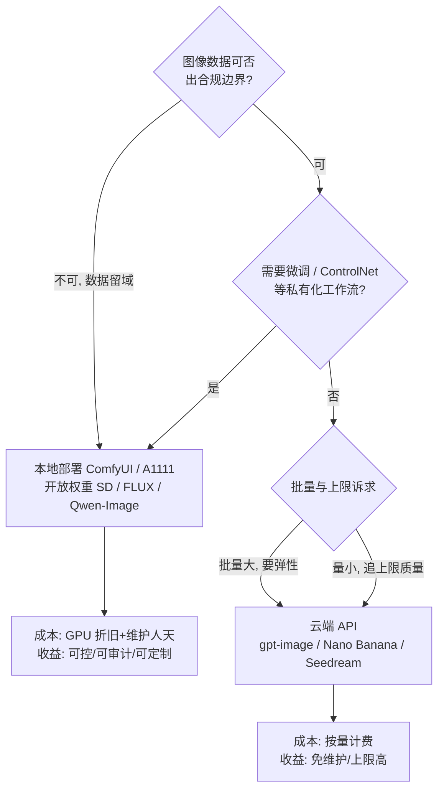

# 图像生成：从 Stable Diffusion 到 DiT 时代

> 图像生成是大模型时代第一个"出圈"的能力：Stable Diffusion 的开源让每个人都能在本机跑通扩散模型。这篇写给想弄懂这条技术线来龙去脉、并要在工程上做选型的读者——读完应能抓住主轴：**扩散原理打底，架构从 UNet 换到 DiT，训练范式从像素空间搬到潜空间与流匹配**，以及每一层决策背后的工程代价。

## 从 GAN 到扩散：一次范式转变

2021 年之前图像生成的主流是 GAN（生成对抗网络：生成器造假、判别器打假，二者对抗博弈）。我在项目里经历过 GAN 时代，当时两个头疼问题是特征性的：

- **训练不稳定**：判别器与生成器要保持动态平衡，一方过强过弱都会震荡发散，调参经验难以复用；
- **模式覆盖差**：生成器学会产出少数几种"骗过判别器"的样本就停手，多样性缺失（模式坍缩）。

扩散模型（DDPM，2020）换了问题定义：前向过程把图像逐步加噪直到纯高斯噪声，训练目标是让网络学会**逐步去噪**；生成就是从纯噪声出发的迭代去噪。

*图源：DDPM 论文官方 HTML 版（Figure 2，[arxiv.org/html/2006.11239](https://arxiv.org/html/2006.11239)）*

扩散为什么赢了？我的理解是三层：

1. **训练变成稳定的回归问题**：网络学的是明确的去噪目标（似然类目标），没有对抗博弈——训练曲线终于"可信"，这是工程团队敢投入的前提；
2. **模式覆盖全**：拟合的是整个数据分布而非"骗过判别器"的捷径，多样性有结构性保证（后续 "Diffusion Models Beat GANs on Image Synthesis" 在指标上把结论钉死）；
3. **过程每一步都可注入条件**：这个特性后来长出了整个可控生成生态（ControlNet、局部重绘）。

补一句经验边界：扩散并非在每个单项指标上都赢 GAN，但"训练可信、多样性有保证、条件可注入"的组合，使它成为唯一能工业化的路线——2022 年之后，新一代生成模型几乎都站在扩散/流匹配的地基上。

代价同样清楚：迭代采样慢（DDPM 原始设定约千步）。此后整条加速技术线——DDIM、蒸馏、一致性模型、缓存复用——都在为这个代价还债，直到今天。

## Stable Diffusion：潜空间扩散的工业化

像素空间做扩散太贵。Latent Diffusion Models（LDM，即 Stable Diffusion 的论文，CVPR 2022）做了一个最重要的工程决策：先用 VAE（变分自编码器，一种把图像压到低维潜空间再重建的网络）把图像压缩，扩散过程在潜空间进行，最后解码回像素。以 SD 1.x 的 8 倍空间压缩为例，512x512 的图变成 64x64 的潜变量，计算量降一个数量级以上——**这是"消费级显卡能跑"的根本原因**，我认为它比任何网络细节改进都重要。

*图源：CompVis/latent-diffusion 官方仓库 assets/modelfigure.png（MIT 许可，[GitHub](https://github.com/CompVis/latent-diffusion)）*

由此定型的"三件套"架构，成为整个 SD 谱系的标准形态：

- **文本编码器**（CLIP 文本编码器，一句话解释：把自然语言转成语义向量序列的对比学习模型；SDXL 及之后叠加 T5 系）：负责"理解提示词"；
- **UNet 去噪主干**：文本向量经 **cross-attention**（去噪网络在每一步"回头看"文本向量的注意力机制）注入——文生图的条件注入点就在这里；
- **VAE**：潜空间与像素的互转，三段式的首尾。

量级感：SD 1.5 在 512x512 下约 6GB 档显存可用，SDXL 的 1024x1024 约需 8-12GB 档——这个量级决定了扩散的第一波爆发发生在个人电脑而非机房。潜空间也有代价：VAE 重建会丢高频细节，小字、细线正是 SD 1.x 的弱项，后来"文字渲染"成为各家模型差异化的必争之地。

*图源：CompVis/latent-diffusion 官方仓库 assets/txt2img-preview.png（MIT 许可，[GitHub](https://github.com/CompVis/latent-diffusion)）*

### 条件注入的演进：从"一句话"到"结构控制"

只有文本条件，满足不了生产需求。开源社区沿"冻结主干、旁路挂条件"的思路把可控生成做成了插件市场：

- **ControlNet**（2023）：复制一份可训练的网络副本，经零卷积（初始为零、不破坏预训练权重的连接层）回注主干，注入姿态、线稿、深度等空间条件；
- **IP-Adapter 等参考图方案**：以同样思路注入图像级特征（风格、主体一致性）；
- **局部重绘（Inpainting）**：掩码区域重生成，是"改背景、换商品"类设计工具的入口；
- **LoRA**（低秩适配，几十 MB 即可注入风格/角色的轻量微调法）：把"个性化"的成本降到个人可玩。

"冻结主干、旁路挂条件"的模式让插件可以无限组合，这是开源生态相对闭源 API 最深的护城河：闭源侧只能开放参数，开源侧能长出新结构。

### SD 谱系

- **1.5**（2022）：生态之王，LoRA/ControlNet 资产存量至今仍在被消费；
- **SDXL**（2023）：质量跃升，双文本编码器；
- **SD3**（2024）：MM-DiT + 流匹配，架构换代（见下节）。

## 架构换代：UNet → DiT

DiT（Diffusion Transformer，2022）把去噪主干从 UNet 换成 Transformer：潜空间被切块（patchify）成 token 序列，条件经自适应归一化等方式注入。表面是换骨干，我在实践中看到的是三层意义：

1. **扩散模型也吃上了 Scaling Law**：论文实测 FID 随计算量（Gflops）与参数增加而持续下降，UNet 的扩展性远不及此——"更大即更强"第一次在扩散模型上成为可执行的工程路线；
2. **与 LLM 共享工程栈**：分布式并行、量化、推理优化可复用，推理团队不用为图像模型另学一套；
3. **图文生成架构趋同**：DiT 与 LLM 结构同构，为"统一生成模型"铺路——2025 年后的"推理式图像生成"正是站在这个趋同上。

理解 DiT 的心智捷径是直接借用 LLM：图像潜空间切块 = token，去噪的多步采样 = 多轮前向，条件 = 上下文。这层对应建立后，LLM 侧的工程经验（并行、量化、服务化）全部可迁移。

与架构换代同步的是训练范式：**流匹配（Flow Matching / rectified flow）** 把"学噪声预测"换成"学概率流的速度场"——噪声到数据的路径被拉直，采样步数更少、训练更稳。SD3 与 FLUX 均采用，如今已是新模型的默认选择。我的判断：2025-2026 的新模型几乎都以流匹配为默认，DDPM 时代"千步采样"的印象应整体更新。

## 开源与闭源的两线格局

- **开源线**：SD 生态 → Flux（Black Forest Labs 的 12B rectified flow transformer；[schnell] 为 Apache 2.0，[dev] 开放权重）→ 各家旗舰开源（Qwen-Image 系等），中文渲染与文字生成成为差异化战场；
- **闭源线**：Midjourney/DALL·E → GPT Image 类原生多模态生成（理解与生成同模型，API 按 token 计费，质量档、尺寸、透明背景等以参数定义）——"理解与生成同一模型"是闭源侧的主叙事；
- **格局判断**：开源解决"可控与私有化"，闭源解决"开箱即用的上限"；企业选型按数据边界与定制深度划线。

还有一条常被工程团队忽略的线：**许可**。FLUX.1 [dev] 开放权重但非商业许可、[schnell] 才是 Apache 2.0；SD 谱系走 RAIL-M 类开放权重许可；Qwen-Image 系为 Apache 2.0。选型时效果与许可要同时看——许可这一条，直接决定商用交付是否成立，我在"常见坑"里也留了相应一行。

## 2026 格局：主力模型速览（更新于 2026-09）

下表只收录我跟踪的主力玩家，时间是首次发布时间；具体能力以各方最新文档为准。

| 阵营 | 模型 | 时间 | 要点 |
| --- | --- | --- | --- |
| 开源 | FLUX.2（BFL） | 2025-11 | 32B rectified flow transformer，生成+编辑+多参考图统一，dev 开放权重 |
| 开源 | Qwen-Image 系（通义） | 2025-08 起 | 20B MMDiT，Apache 2.0；中文文字渲染突破；注意 3.0（2026-07）转闭源 |
| 闭源 | Seedream 3.0→5.0 Pro（字节） | 2025→2026-07 | 生成编辑统一→4K 一致性→"理解设计"的推理式生成 |
| 闭源 | Nano Banana Pro（Google） | 2025-11 | Gemini 3 Pro Image：推理驱动的生成/编辑，最高 4K，SynthID 水印 |
| 闭源 | GPT Image（OpenAI） | 2025-04 | 自回归多模态路线（GPT-4o 原生生成的 API 形态），替代 DALL·E |

**格局要点**：

- **生成与编辑统一**成为标配（Kontext、Seedream、FLUX.2、Qwen-Image-Edit）
- **自回归路线回归**：GPT-4o 原生图像证明 AR 多模态可行，与扩散路线并存
- **推理式图像生成**（2025 末新趋势）：Nano Banana Pro、Seedream 5.0 Pro"先推理后生成"——图像模型开始吃 LLM 的推理红利
- **开源闭源动态**：差距缩小的同时出现回流（Qwen-Image-3.0 转闭源）——开源许可与商业模式仍是变量

## 工程与成本视角

### 成本结构与加速

扩散模型的推理成本 = **扩散步数 × 分辨率 × 模型规模**，三者相乘；闭源 API 侧（gpt-image 类）则把它折算成 token 计费，质量档（low/medium/high）与尺寸直接决定单价。加速三板斧，按投入产出排序：

1. **蒸馏减步数**：数十步压到个位数步（FLUX.1 [schnell] 一类模型 1-4 步出图），收益最大；
2. **缓存复用**（TeaCache 类）：相邻去噪步复用中间结果，几乎免费的提速；
3. **量化**：INT8/FP8 把显存门槛拉低，让大模型下沉到消费级显卡。

量级感（消费级中端卡、1024x1024 一档）：蒸馏到个位数步后单图秒级；云端 API 单图成本由质量档与尺寸决定，从分到角美元量级不等。选型时先算"月出图量 × 单图成本"与"GPU 折旧+人天"的交叉点，再决定本地还是云端——多数小团队的答案是先 API、量起来再自建。

### 提示词工程

我踩坑后留下的经验：主体+风格+构图+光线的结构化写法，优于形容词堆叠；负向提示在 SD 1.5/XL 时代有效，DiT 时代（SD3/FLUX）官方口径已建议直接正向描述；中文场景优先选中文渲染强的模型（Qwen-Image 系）直接写中文，比英译回写稳定。把提示词**模板化**（变量只留业务字段）是质量稳定的前提。

### 选型：本地部署还是云端 API

ComfyUI（GPL-3.0）是本地部署的事实标准：节点式工作流把"模型+条件+后处理"做成可自由拼装、可版本化、可 API 调用的工件，本地交互与云端批处理通吃；A1111 WebUI（AGPL-3.0）单机上手更直观。云端 API 侧关注质量档、尺寸预设与内容审核参数即可。本地部署的隐性成本是模型与插件的追新维护——开源生态每月都有新权重，没人维护的工作流半年就过时，这条经验边界要提前说清楚。

### 常见坑

| 坑 | 现象 | 根因与对策 |
| --- | --- | --- |
| 提示词漂移 | 批次间风格不一致 | 固定种子+模板化提示词，结构不随业务字段变 |
| 显存溢出 | 高分辨率 OOM | 先量化、再降步数，最后才考虑分块（tiling） |
| 文字渲染乱码 | 图内中文不可读 | 换中文渲染强的模型，别用后处理补救 |
| 许可混用 | 商用交付合规风险 | 分清 Apache 2.0（schnell 类）与非商业许可（dev 类）权重 |

### 生产管线要点

生成质量靠模型，交付稳定靠管线。我见过的多数"效果不错但上不了生产"的项目，缺的都是下面这些：

- **提示词模板化**：结构固定、变量只留业务字段，质量才可复现；
- **安全过滤前置**：输入侧拦截违规提示，输出侧过审核模型，别等投诉再补；
- **尺寸/宽高比预设**：按下游渠道（主图、详情页、社媒）固化预设，禁止任意尺寸；
- **批量调度与重试**：GPU 任务队列化，失败自动换种子重试，结果与参数一起落库可追溯。

## 应用形态

- 设计辅助（变体生成、局部重绘 Inpainting）、营销物料批量生产、游戏美术管线（原画→三视图→贴图）、电商主图与虚拟试穿；
- 与视觉理解的融合：生成结果直接回灌理解模型做质检（生成-评估闭环）；
- 作为 Agent 的原子能力：文档自动生成配图、需求直接生成前端素材，图像生成正被编进智能体工作流；
- 个人创作与企业交付的分界：前者拼效果上限，后者拼可复现性——种子固定、工作流版本化、质检闭环是交付的三件套。

## 参考资料

<Refs>

- [Denoising Diffusion Probabilistic Models (DDPM)](https://arxiv.org/abs/2006.11239) — 扩散模型奠基（2020）（访问日期 2026-09-03）
- [Diffusion Models Beat GANs on Image Synthesis](https://arxiv.org/abs/2105.05233) — 扩散超越 GAN 的指标实证（访问日期 2026-09-03）
- [High-Resolution Image Synthesis with Latent Diffusion Models](https://arxiv.org/abs/2112.10752) — Stable Diffusion 论文（2021）（访问日期 2026-09-03）
- [Adding Conditional Control to Text-to-Image Diffusion Models (ControlNet)](https://arxiv.org/abs/2302.05543) — 条件控制（访问日期 2026-09-03）
- [Scalable Diffusion Models with Transformers (DiT)](https://arxiv.org/abs/2212.09748) — DiT 架构（2022）（访问日期 2026-09-03）
- [Flow Matching for Generative Modeling](https://arxiv.org/abs/2210.02747) — 流匹配（2022）（访问日期 2026-09-03）
- [Scaling Rectified Flow Transformers for High-Resolution Image Synthesis](https://arxiv.org/abs/2403.03206) — SD3 / MM-DiT（访问日期 2026-09-03）
- [Stability AI — Stable Diffusion Public Release](https://stability.ai/news-updates/stable-diffusion-public-release) — SD 开源发布公告（访问日期 2026-09-03）
- [Announcing Black Forest Labs](https://bfl.ai/announcing-black-forest-labs/) — FLUX.1 发布与许可（访问日期 2026-09-03）
- [black-forest-labs/flux（GitHub）](https://github.com/black-forest-labs/flux) — FLUX 官方推理仓库（访问日期 2026-09-03）
- [CompVis/latent-diffusion（GitHub）](https://github.com/CompVis/latent-diffusion) — LDM 官方仓库，MIT 许可（访问日期 2026-09-03）
- [comfyanonymous/ComfyUI（GitHub）](https://github.com/comfyanonymous/ComfyUI) — 节点式工作流框架，GPL-3.0（访问日期 2026-09-03）
- [AUTOMATIC1111/stable-diffusion-webui（GitHub）](https://github.com/AUTOMATIC1111/stable-diffusion-webui) — A1111 WebUI，AGPL-3.0（访问日期 2026-09-03）
- [OpenAI — Image generation guide](https://developers.openai.com/api/docs/guides/image-generation) — gpt-image API 官方文档（访问日期 2026-09-03）
- [OpenAI — gpt-image-1 model card](https://developers.openai.com/api/docs/models/gpt-image-1) — 原生多模态生成模型（访问日期 2026-09-03）
- 图片来源：DDPM 论文 HTML 版图 2（[arxiv.org/html/2006.11239](https://arxiv.org/html/2006.11239)）；latent-diffusion 仓库 assets/modelfigure.png 与 assets/txt2img-preview.png（[GitHub](https://github.com/CompVis/latent-diffusion)，MIT）
- 站内相关：[视频生成](/ai/models/video-gen) · [视觉理解](/ai/models/vision) · [多模态应用](/ai/application/multimodal)

</Refs>
