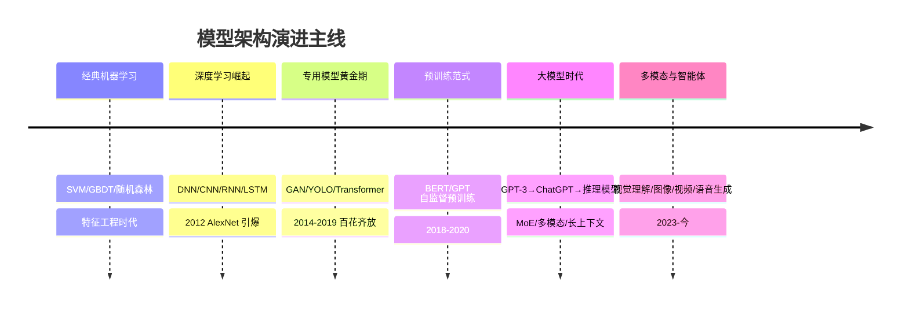

# 模型架构演进：总览

> 从统计机器学习到多模态大模型，二十年间的每一代模型都在回答同一个问题：**如何让机器以更通用的方式理解与生成**。这条演进线不是"新的替代旧的"，而是层层叠加——CNN 仍在视觉感知里服役，RNN 的思想活在序列建模中，Transformer 则统一了几乎所有模态。

## 演进主线

## 六个板块

| 板块 | 内容 | 入口 |
| --- | --- | --- |
| 🎓 机器学习与深度学习经典 | 传统 ML 到 DNN/CNN/RNN/LSTM/GAN/YOLO 的架构解析 | [进入](/ai/models/ml-dl) |
| 📖 大语言模型 | Transformer → Decoder-only → MoE → 推理模型 | [进入](/ai/models/llm) |
| 👁️ 视觉理解 | CLIP → VLM → 原生多模态 | [进入](/ai/models/vision) |
| 🎨 图像生成 | Diffusion 原理：Stable Diffusion → DiT → 最新格局 | [进入](/ai/models/image-gen) |
| 🎬 视频生成 | 时空建模：Sora 类 → 开源生态 | [进入](/ai/models/video-gen) |
| 🎙️ 语音识别与理解 | ASR/TTS/实时语音大模型 | [进入](/ai/models/audio) |

## 贯穿演进线的三个规律

1. **规模定律（Scaling Law）的三次验证**：参数量、数据量、计算量的幂律关系在语言、视觉、语音上依次应验——这是"大力出奇迹"背后的数学
2. **架构统一化**：Transformer 从 NLP 出发，统一了视觉（ViT/DiT）、语音、蛋白质结构预测——"一个架构吃所有模态"降低了全行业的工程成本
3. **能力涌现与范式迁移**：预训练+微调 → Prompt → Agent，每次交互范式迁移都重塑了应用架构——技术栈的演进不只是模型的事

## 衔接

- 模型的工程底座：[AI Infra](/ai/infra/) · 模型的应用落地：[大模型应用](/ai/application/)
