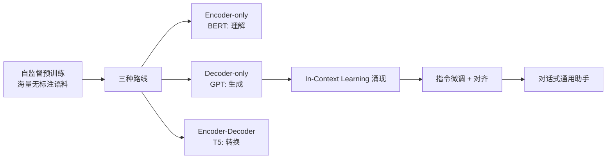
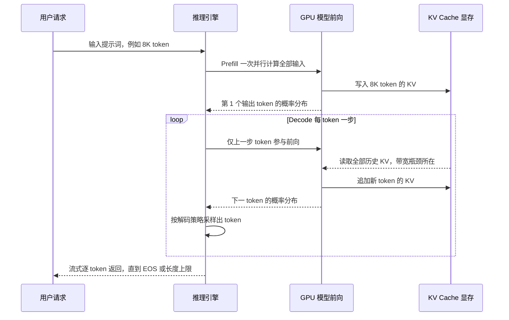
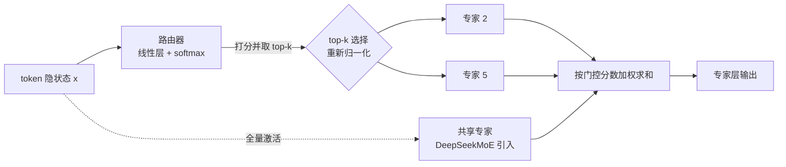
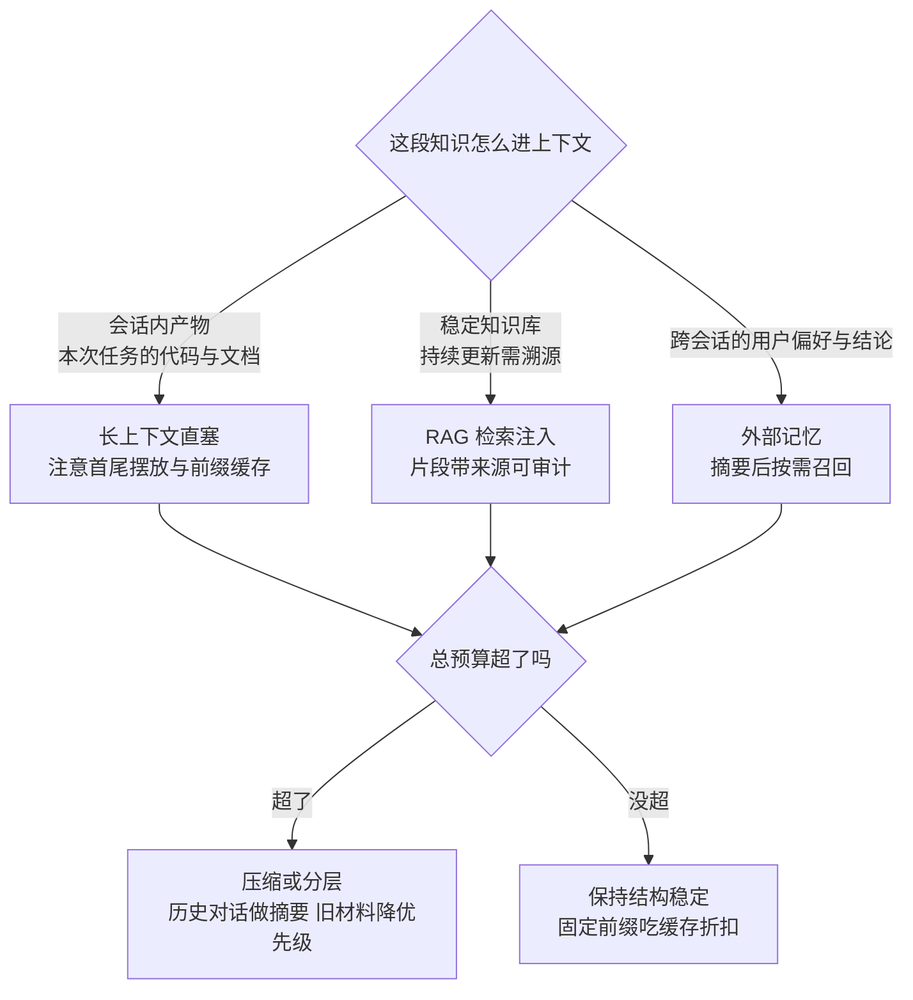
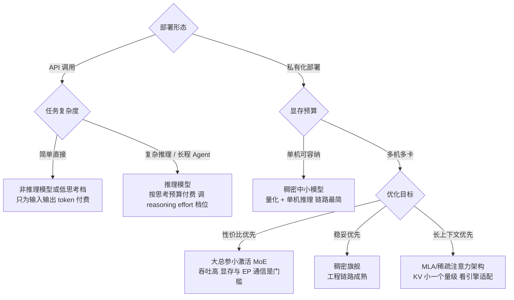
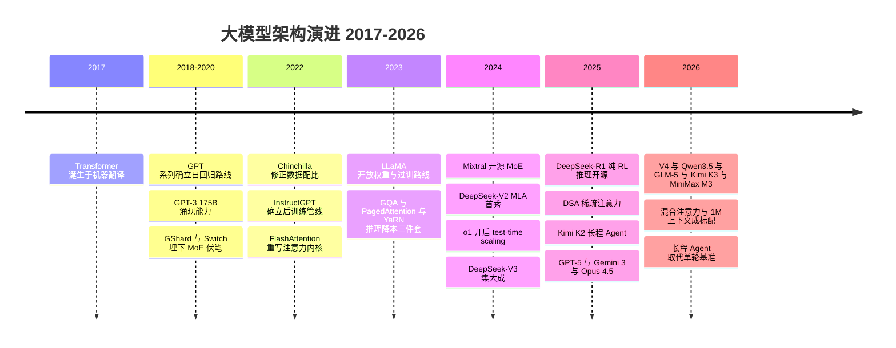

# 大语言模型架构解析

> 从 GPT 到推理模型，大语言模型的架构演进只有一条主线：**在 Transformer 骨架上，不断寻找"规模换能力"的最优结构**。这篇沿主线逐段拆开：自回归生成为什么让 KV Cache 成为推理成本核心（附一笔可复算的显存算例）、规模化律如何改写预训练预算、预训练到对齐的后训练管线、MoE 路由与负载均衡的内部机制、MLA 类注意力压缩、长上下文与 RAG 分工的上下文工程、推理模型的 o1/R1 机制与 test-time compute scaling，以及开源权重谱系与 2025–2026 旗舰格局（截至 2026-09）对部署账单的影响。
> 目标读者是要做模型选型或推理方案设计的架构师与工程师；读完应能把"模型卡片上的架构特性"翻译成"我的部署要花多少钱、能扛多少并发、思考预算怎么配"。

**本文怎么读**：只想带走结论的，直接看"模型卡片怎么读""选型视角""常见坑"三节；要做容量与成本测算的，重点读"KV Cache 完整算例"与"架构选择如何影响部署成本"里的速算模板；关心 2026 年市场格局的，跳到"旗舰演进速览"。全文各节自洽，可跳读，术语统一收在文末"术语速查表"。

## 开篇：一个骨架与三个成本旋钮

对 LLM 的全部理解可以压缩成一句话：

> **模型在玩"预测下一个 token"的文本接龙；每生成一步，都要回看之前全部上下文，而这份上下文以 KV Cache 的形式被缓存下来。**

由此展开推理成本的三个旋钮（后文所有架构分析都建立在这个骨架上，推理侧展开见 [推理部署实战](/ai/infra/inference/llm-inference)）：

| 旋钮 | 来源 | 拧它的架构手段 |
| --- | --- | --- |
| 算力 | 生成是串行的，一个 token 一次前向；长输入的首段计算（Prefill）受算力约束 | MoE 稀疏激活、投机解码 |
| 显存容量 | 权重（由总参数量决定）+ KV Cache（随会话长度与并发线性增长） | GQA/MLA 压缩 KV、量化、分页与卸载 |
| 显存带宽 | 逐字生成阶段每步计算量小，却要把权重与 KV 全部读一遍 | KV 压缩、低精度权重、批处理合并读取 |

近五年的架构演进，大半可以解读为"在不损能力的前提下拧小这三个旋钮"：MoE 拧算力、GQA/MLA 拧 KV Cache、稀疏注意力拧长上下文计算，推理模型则反其道行之——主动加算力换质量。

## 预训练范式：一切的起点



- **自监督目标**：GPT 的"预测下一个 token"看似朴素，却是已知扩展性最好的学习目标——损失函数简单、数据无限、规模可加
- **Decoder-only 胜出的原因**：统一的生成式目标（一切任务皆可生成）、推理时 KV Cache 友好、训练目标与使用方式完全一致。BERT 系在理解任务上并非失败，而是"生成统一理解"的路线赢了
- **涌现能力**：规模跨过阈值后，少样本学习、思维链、指令跟随相继出现——GPT-3（2020，175B 参数）是"规模换能力"的分水岭，Scaling Law（算力/数据/参数的幂律）从经验观察变成了工程预算工具

Transformer 本身 2017 年为机器翻译而生：纯注意力取代循环与卷积，训练彻底并行化——8 卡 GPU 训 3.5 天即刷新 WMT'14 翻译纪录（英德 28.4 / 英法 41.8 BLEU）。真正改变历史的，是此后把 Decoder 半边单独拿出来、以"预测下一个 token"为唯一目标的组合。


*图源：Attention Is All You Need 论文图 1（[arXiv:1706.03762](https://arxiv.org/abs/1706.03762)）*

### 从文本到 token：Tokenizer 与计费单位

在谈架构之前，先把"计费和长度的基本单位"钉清楚：**模型看到的不是字符，是 token**。

- **机制**：主流模型都用 BPE（Byte-Pair Encoding，字节对编码）一族的子词算法——从字节开始，把语料中高频相邻的片段反复合并成新符号，最终得到几万到二十几万规模的词表。常见英文单词是一个 token，长词和生僻词被拆成多个；一个 UTF-8 中文字符占 3 字节，若词表没有为中文做扩容，就会被拆成 2–3 个 token
- **中文压缩率是选型细节**：早期英文中心的词表下，1 个汉字要 1.5–3 个 token；国产模型（Qwen、DeepSeek、GLM 系）专门为中文扩容词表（10 万以上量级），1 个汉字普遍只要 0.6–1 个 token。同一段中文合同，两边的"上下文长度"和"账单 token 数"能差出一倍——**比较上下文长度与单价时，先问 tokenizer**
- **对架构的连带影响**：词表越大，embedding 与输出层（LM Head，把隐状态映射回词表概率的线性层）越大——十几万词表下单是输出层就占数 GB 参数；这也是"小模型配大词表"要在两端权衡的原因
- **经验换算**（中文为主、常规 tokenizer，多数场景够用）：1K token ≈ 600–1000 汉字 ≈ 一页半 A4；估算上下文需求时按"字数 × 1.2"粗算 token，再乘 1.5 留安全边际

### 自回归生成：为什么 KV Cache 是推理成本核心

自回归推理的两个阶段，瓶颈画像完全不同：

| 阶段 | 做什么 | 瓶颈 |
| --- | --- | --- |
| 预填充（Prefill） | 输入 token 并行计算，产出 KV Cache | 算力受限，输入越长 FLOPs 越高 |
| 逐字生成（Decode） | 逐个 token 生成，每步回看全部历史 | 带宽受限，并发数受 KV Cache 显存钳制 |

一个请求的完整生命周期用时序图走一遍——注意 Decode 循环里"读全部历史 KV"那根箭头，它就是带宽瓶颈的具象化：



KV Cache 就是"全部前文的记忆"：每一层注意力都要保存每个历史 token 的 Key/Value 向量，体量随层数 × KV 头数 × 上下文长度线性增长。推理服务的并发能力与长上下文成本，本质上都是 KV Cache 的管理问题；vLLM 的 PagedAttention 借鉴操作系统虚拟内存，把 KV 分页、非连续分配、消除碎片，仅这一项就带来数倍吞吐提升（细节见 [推理部署实战](/ai/infra/inference/llm-inference)）。下一小节把这笔账从头到尾算一遍。

### KV Cache 完整算例：把显存账从头算一遍

这一小节值得亲手复算：会算这笔账，选型时就不会被"支持 1M 上下文"的宣传数字带偏。

**公式**。单 token 的 KV Cache 显存占用：

```text
bytes_per_token = 2 (K 与 V 各一份) × 层数 × KV头数 × 头维度 × 每参数字节数
```

注意是 **KV 头数**而不是 Query 头数——GQA 类模型里 Query 头共享 KV 头，KV Cache 只由后者决定，这正是 GQA 省钱的原理。

**算例一：70B 级 GQA 模型（LLaMA-3 70B 型）**。公开配置：80 层、64 个 Query 头、8 个 KV 头、头维度 128，推理精度 FP16（每参数 2 字节）：

1. 单 token：2 × 80 × 8 × 128 × 2 B = 327,680 B ≈ **320 KB**
2. 128K 上下文单会话：320 KB × 131,072 ≈ 42.9 GB，即 **约 40 GiB**
3. 与权重对比：70B 参数 FP16 权重约 140 GB。单会话 KV 约为权重的三成，看起来不致命——**但它随并发线性叠加**：10 路并发 128K 会话，KV 合计约 400 GB，反超权重近 3 倍。长上下文的账单之痛从来不是单个请求，而是"长度 × 并发"这个乘积

**算例二：单卡能扛多少并发**。8B 级 GQA 模型（32 层、8 个 KV 头、头维 128、FP16），单张 80 GB 卡：

1. 权重：8B × 2 B ≈ 16 GB；留约 60 GB 给 KV 与运行时开销（粗算口径，实际引擎还要为激活值、框架、碎片预留一到两成）
2. 单 token KV：2 × 32 × 8 × 128 × 2 B = 131,072 B = **128 KB**
3. 8K 上下文会话：单会话 1 GB → 理论上可支撑 **约 60 路并发**
4. 128K 上下文会话：单会话 16 GB → 只剩 **3–4 路并发**

上下文长度放大 16 倍，并发能力除以 16——这就是"同一套模型和卡，放开长上下文后吞吐塌方"的算术根源。

**算例三：MLA 能省到什么程度**。DeepSeek-V3 采用 MLA：缓存里不存每头的 K/V，只存每 token 每层一个 512 维潜向量外加 64 维 RoPE 键，合计 576 个数。61 层、BF16：576 × 2 B × 61 ≈ **68.6 KB/token**，128K 会话约 **8.6 GB**——约为算例一里 GQA 结构的 1/5。DeepSeek-V2 官方给出的对照更直接：**KV Cache 相比前代稠密模型减少 93.3%**（机制详见下文 MLA 一节）。

三种结构放进一张表（128K 上下文单会话，BF16/FP16，取整）：

| 注意力结构 | 代表配置 | 单 token KV | 128K 单会话 | 相对 MHA |
| --- | --- | --- | --- | --- |
| MHA | 80 层 × 64 KV 头 × 128 维 | 约 2.5 MB | 约 320 GB | 1× |
| GQA | 80 层 × 8 KV 头 × 128 维 | 约 320 KB | 约 40 GB | 约 1/8 |
| MLA | 61 层 × (512+64) 维潜向量 | 约 69 KB | 约 8.6 GB | 约 1/37 |

两条工程注脚：

- **KV 量化到 FP8 可把上表全部数字再减半**，代价是轻微精度损失——主流推理引擎（vLLM/SGLang 类）已标配，是长上下文场景的第一压缩手段
- 以上都是"名义上限"口径：实际引擎按页分配不会一次占满，前缀缓存能让多个会话共享同一份系统提示词的 KV，真实占用通常更低——但预算必须按上限做，否则峰值并发一来就 OOM

**多轮会话的补充账**：多轮对话里每一轮的输入都是"全部历史 + 新问题"，KV 随轮数持续累积——10 轮、每轮平均 2K token 的会话，最后一轮的上下文就是 20K+，单会话 KV 按 20K 计而不是按单轮计。两个对策直接对应两个账单科目：前缀缓存让历史部分的 KV 在轮间复用（省显存重算），滚动摘要把远古历史压缩掉（省长度本身）。做容量规划时按"平均会话总长度"而不是"单轮长度"代入公式，这是最常见的口径错误。

## Transformer 的关键工程细节

今天的主流模型都是"Transformer + 一组补丁"：

- **Pre-Norm 与残差**：深层稳定训练的基础；每层 = 注意力子层 + FFN 子层，均带残差与归一化
- **RMSNorm 取代 LayerNorm**：LayerNorm 做两件事——减均值（中心化）与除以标准差（缩放）；RMSNorm 去掉中心化，只用均方根做缩放，少一组参数、少一步计算，深层网络下经验上更稳——LLaMA 系与此后几乎全部主流模型的标配，上面 Pre-Norm 里的归一化基本都用它
- **注意力为什么除以 √d_k**：两个维度为 d_k、元素独立且零均值单位方差的向量做点积，结果的方差随 d_k 线性放大——维度越高，点积值越发失控。logits 失控后，softmax 把几乎全部概率压到单个 token 上、进入饱和区，梯度趋近于零，训练就推不动了。除以 √d_k 把方差拉回 1 附近，让 softmax 停留在有梯度的区间。这是原论文里的一行修正，但缺了它，深层 Transformer 基本训不起来
- **RoPE 旋转位置编码**：相对位置的优雅表达，天然支持长度外推，是当前长上下文模型的标配（配 NTK/YaRN 类缩放进一步拉长）
- **MHA → MQA → GQA：注意力的 KV 压缩光谱**：原始 MHA（多头注意力）给每个 Query 头配一组独享的 KV——表达力最强，KV Cache 也最大；MQA（多查询注意力，2019）走到另一极端，全体 Query 头共享一组 KV，把解码时 KV 读取压到最小，但能力损失明显；GQA 居中（见下条），组内共享。三者构成"以少量能力换 KV Cache"的光谱，再往后把压缩做到维度方向上的就是下文 MLA 一节
- **GQA（分组查询注意力）**：多个 Query 头共享一组 KV，大幅压缩 KV Cache——上例中 KV 头从 64 减到 8 即 8 倍压缩，是推理成本优化的架构级手段


*图源：GQA 论文图 2（[arXiv:2305.13245](https://arxiv.org/abs/2305.13245)）*

- **FFN 的膨胀**：FFN 占模型参数的大头，也是知识存储的主要载体——MoE 动的正是这块
- **精度与量化**：训练与推理的数值精度是一组独立的成本旋钮——BF16/FP16 是默认（每参数 2 字节），FP8（1 字节）已进入训练侧（DeepSeek-V3 是全 FP8 训练的代表作）与推理侧，INT4/INT8 权重量化（W4A16 一类：权重 4bit 存储、计算时还原为 16bit）把私有化门槛砍半再砍半，Kimi K2 干脆原生 INT4 发布。经验上权重量化到 4bit 对多数任务的能力损失在可接受范围（个位数百分点内的基准波动），但数学/代码等精密推理任务要先用业务样本实测；KV Cache 也可以独立量化到 FP8（见上文算例）
- **SwiGLU 取代 ReLU**：经典 FFN 是"两层线性夹一个 ReLU"，SwiGLU 则引入门控结构——一路线性输出过 Swish 激活当"门"，与另一路线性输出逐元素相乘，让网络自己学每个维度该放行多少信息。门控用略多的参数（通常把隐层宽度缩到 2/3 以保持总参数量大致不变）换来明显更好的效果，2020 年的对比工作之后，成为 LLaMA、PaLM 等现代模型的 FFN 标配
- **QK-Norm**：在计算注意力得分前对 Q、K 向量各做一次归一化，与"除以 √d_k"同属防 logits 失控的保险丝——万亿参数级训练里 logit 爆炸是真实的崩溃诱因，2024 年后的新架构普遍加上这道保险
- **注意力汇聚（attention sink）**：softmax 总要给"无信息可取"的注意力分数一个去处，实践中这个去处往往是序列开头的 token——StreamingLLM 一类 KV 截断方案因此永远保留头部几个 token；这也是"系统提示词开头别乱放动态内容"的机制层原因之一
- **多 token 预测（MTP）**：训练时让模型同时预测未来 2–4 个 token，既提高样本效率，其附加预测头在推理时又能直接充当投机解码的草稿模型——DeepSeek-V3 采用，一举两得
- **FlashAttention：注意力的瓶颈不在算力而在 IO**：标准注意力要把 N×N 注意力矩阵（N 为序列长度）在 HBM（GPU 显存）中实体化——点积后写出、softmax 读回、softmax 后再写出，HBM 读写量随 N² 增长，而 GPU 算力单元大量时间在等数据；片上 SRAM 快得多却只有几十 MB，装不下整块矩阵。FlashAttention（2022）重排计算：把 Q、K、V 切成能装进 SRAM 的小块，分块在片上算注意力、只把部分结果写回；关键技巧是**在线 softmax**——用运行统计量增量更新归一化分母，不必等整行 logits 算完；反向传播不保存注意力矩阵，而是从前向保存的统计量按块重算，用少量多余算力换 IO。全程 N×N 矩阵不落地 HBM，HBM 访问量从 O(N²) 降到 O(N²d²/M)（M 为 SRAM 容量），显存占用从序列长度的平方降为线性，A100 上实测快 2–4 倍，且与标准注意力逐位一致（精确算法，不是近似）。它因此成为所有训练与推理框架的必备内核——长上下文时代正是建立在这项改进之上
- **FA2 / FA3 的后续方向**：FA2（2023）压低非矩阵乘操作（softmax 类逐元素运算）的比例、增加沿序列长度维度的并行、重排线程块分工，速度再翻倍，把 A100 算力利用率从 v1 的 25–40% 提到 50–70%；FA3（2024）针对 Hopper 架构，用 WGMMA 异步矩阵指令与 warp 分工（warp specialization）让矩阵乘与 softmax 重叠执行，H100 利用率从 35% 提到约 75%（FP16 峰值 740 TFLOPS），速度约为 FA2 的 1.5–2 倍，并支持 FP8 低精度。注意力的内核优化至此与硬件架构深度绑定，每一代 GPU 都要重写一遍


*图源：Tri Dao 的 FlashAttention-3 发布博客（[tridao.me](https://tridao.me/blog/2024/flash3/)）*

## 规模化律：从暴力堆参数到预算工具

预训练的"花钱方式"被两个节点改写：

1. **Scaling Law（GPT-3 时代）**：损失随算力、数据、参数呈幂律下降——对数坐标下是直线。"堆大就变强"从信仰变成可外推的工程预测
2. **Chinchilla 修正（2022）**：DeepMind 训练 400 余个规模不等的模型后给出结论——**参数量与训练 token 数必须等比扩张**，模型翻倍则数据翻倍。70B 的 Chinchilla 以与 280B Gopher 相同的算力、4 倍的数据（1.4T token），全面超越后者（MMLU 67.5%，高出 7 个百分点以上）。震撼之处在于：当时的大模型普遍"欠训"


*图源：Training Compute-Optimal Large Language Models 论文图 2（[arXiv:2203.15556](https://arxiv.org/abs/2203.15556)）*

规模化律还附送一个估算公式：**训练算力 ≈ 6 × 参数量 × 训练 token 数**（6ND，前向约 2ND、反向约 4ND）。代入 Chinchilla：70B × 1.4T × 6 ≈ 5.9×10²³ FLOPs；代入 DeepSeek-V3：37B 激活等效下论文披露全程 2.788M H800 GPU 时。立项前用预算算力反推 N 与 D 的组合、预测损失曲线，再决定做不做——这是规模化律作为"预算工具"的日常用法。

三个工程后果随之而来：

- **LLaMA 路线**：既然推理成本也要进目标函数，就用小模型吃远超最优配比的数据（"过训"）。LLaMA-1（2023，7B–65B）证明 13B 过训模型能在多数基准超过 GPT-3 175B，并靠开放权重点燃了开源生态——今天 7B/14B/32B 的稠密小模型全是这条路
- **数据墙显现**：截至 2026-09，前沿模型预训练语料已达 10–30T token 量级（GLM-5 公开披露 28.5T），高质量网络文本趋近枯竭，合成数据与语料精炼成为数据工程主战场
- **规模化律变成预算工具**：训练前按算力预算反推模型与数据的配比、预测损失曲线再决定是否立项——预训练从"赌规模"变成"做预算"，集群与成本侧展开见 [GPU 集群与高速网络](/ai/infra/cluster)、[训练工程](/ai/infra/training)

## 从预训练到对齐：后训练管线

预训练模型只是"文本接龙引擎"：不会对话、不听指令，还会输出有害内容。InstructGPT（2022）确立的三阶段管线，把它变成了今天可用的"产品"：


*图源：InstructGPT 论文图 2（[arXiv:2203.02155](https://arxiv.org/abs/2203.02155)）*

| 阶段 | 做什么 | 数据 | 成本特征 |
| --- | --- | --- | --- |
| 预训练 | 学语言与世界知识 | 万亿级 token 无标注语料 | 占绝对多数算力 |
| SFT 指令微调 | 学"当助手"的格式与行为 | 数万至数百万条高质量指令对 | 算力低，数据质量杠杆极高 |
| 对齐强化学习 | 学"什么回答更好" | 人类偏好对比 / 可验证奖励 | 算力中等，决定体验上限 |

两个关键事实：

- **对齐是杠杆率极高的投入**：InstructGPT 论文中，1.3B 的对齐模型在人类评估里胜过 175B 的原始 GPT-3——参数量差百倍，体验反超
- RLHF（奖励模型 + PPO）成为标配后又分出一条谱系：**DPO** 跳过奖励模型直接用偏好对优化，工程更简单；**Constitutional AI（RLAIF）** 用 AI 反馈替代部分人工标注，解决无害性数据的规模与一致性问题；2025 年的推理模型浪潮再把 **RLVR**（可验证奖励的强化学习）推上前台——数学、代码等可自动判分的领域成为推理能力的训练场，这正是 o1/R1 的技术底座（详见 [训练工程](/ai/infra/training)）

对齐强化学习阶段的主流算法，工程账差别很大，汇总对照：

| 算法 | 奖励信号 | 是否需要奖励模型 | 关键机制 | 工程复杂度 |
| --- | --- | --- | --- | --- |
| PPO | 学习出的奖励模型打分 | 需要（另需参考模型做 KL 约束、价值网络估优势） | 策略梯度 + 裁剪目标；KL 惩罚防止模型偏离原模型太远 | 高：策略/奖励/参考/价值四个模型同时在手，超参敏感 |
| DPO | 人类或 AI 偏好对 | 不需要 | 把 KL 约束 RL 目标的闭式解代入奖励函数，奖励隐式地由策略本身表示，RL 目标退化为偏好对上的二元分类损失 | 低：单模型直接当分类器训 |
| GRPO | 规则可验证奖励为主 | 不需要 | 每题采样一组回答，用组内相对奖励（减组均值、除组标准差）充当优势，省掉 critic/价值网络 | 中：免训价值网络，但要成组采样并设计奖励函数 |


*图源：DeepSeek-R1 论文图 4（[arXiv:2501.12948](https://arxiv.org/abs/2501.12948)）*

### 后训练数据工程：质量杠杆远大于数量

先看一条完整管线的量级感（公开配方归纳，时间是量级示意）：

```text
预训练（月级，10^24–10^25 FLOPs，万亿至数十万亿 token）
  → 中期训练/长上下文继续训练（周级，高质量语料 + 长文本，拉长窗口）
  → SFT 冷启动（天级，数千至数百万条示范）
  → RLVR 推理强化（天至周级，可验证题库，多轮迭代）
  → 拒绝采样 + 再 SFT（天级，判对的推理轨迹回收）
  → 通用 RL 与安全对齐（天至周级，偏好与无害性）
```

越靠后的阶段算力占比越小、对体验的杠杆越大——后训练相对预训练只是算力的零头（公开共识量级），却决定产品体验的上限，因为它的每一步都是数据杠杆：

- **SFT 重质不重量**：LIMA（2023）用 1000 条精心挑选的示范样本就做出了对话能力接近当时商用水平的模型，验证了"表面对齐假说"——能力主要来自预训练，对齐只是激活使用方式。今天各家 SFT 数据集普遍在数千到数百万条之间，但筛选流程（人写/模型生成 + 人工精修 + 多样性去重）比规模本身重要
- **偏好数据决定 RM 天花板**：奖励模型学的是"人类觉得哪个更好"，标注一致性与覆盖面（不同语言、不同风格、有害性边界）是质量瓶颈；Constitutional AI 用 AI 反馈扩容正是为此
- **RLVR 的题库工程**：可验证奖励的前提是"题目能自动判分"——数学要标准答案、代码要测试用例、科学要可核验结论。DeepSeekMath 一类工作公开披露的题目合成与筛选管线（数学科目合成、判分器校验、去污染）本身就是核心资产；2025–2026 的 Agent RL（V3.2、GLM-5 的"Slime"类框架）进一步把"环境 + 判分器"扩到工具调用与沙箱执行
- **合成数据飞轮**：强模型生成 → 正确性过滤 → 蒸馏进小模型（R1 的 80 万条蒸馏数据是标志事件）。它同时缓解了数据墙与后训练成本，但公开研究也在提示"模型近亲繁殖"（model collapse）的长期风险——纯合成闭环不可持续，真实数据仍是锚
- **奖励劫持与过度优化**：奖励模型是学出来的代理指标，无约束地最大化代理指标，策略会找到人类评估分布之外的高分模式（冗长讨好、特定句式、格式化套话）——公开的术语是 reward hacking / Goodhart 效应。对策三件套：KL 约束防止偏离参考模型太远、RM 集成与定期刷新、**能上可验证奖励就不上代理奖励**。推理模型把 RLVR 当主线，一半是能力选择，一半也是逃离奖励劫持的工程选择

## MoE：稀疏激活的效率革命

**核心机制**：FFN 替换为多个专家网络 + 路由器，每个 token 只激活 top-k 个专家——**总参数大（能力上限高），激活参数小（推理计算成本低）**。MoE 动的是 FFN 这块参数大头，注意力部分保持稠密。

### 路由机制：一个 token 的专家之旅

路由器本身只是一个线性层加 softmax，逻辑可以完整写出来：

```text
scores = softmax(W_r · x)            # x 为 token 隐状态，W_r 是 d×E 的路由矩阵，E 为专家数
topk_ids, topk_gates = TopK(scores, k)   # 取分数最高的 k 个专家
topk_gates = topk_gates / sum(topk_gates)  # 对被选中的 k 个重新归一化
output = Σ_i topk_gates[i] × Expert_i(x)   # 只有被选中的 k 个专家参与前向
```

以 Mixtral 8x7B 为例走一遍：8 个专家选 2，总参数 46.7B、每 token 激活约 13B——一个 token 进来，路由矩阵给它对 8 个专家各打一分，取前两名，两位专家各自做一次完整 FFN 前向，输出按归一化分数加权求和。计算量约等于一个 13B 稠密模型，但知识容量接近 47B。



两个值得知道的实现细节：

- **共享专家（shared expert）**是 DeepSeekMoE 的改进：留一个所有 token 都过的专家承载公共知识，路由专家只学分化知识——减少"每个专家都存一份通用模式"的冗余，同激活量下效果更好，DeepSeek-V2/V3 沿用
- **细粒度专家**：与其 8 个大专家，不如 256 个小专家选 8——专家越小，路由的组合空间越大，知识分化越充分。DeepSeek-V3 就是 61 层 × 每层 256 个路由专家（top-8）+ 1 个共享专家，总参数 671B、激活 37B，14.8T token 预训练，全程 2.788M H800 GPU 时——按论文假设的 2 美元/卡时折算约 560 万美元，这个数字直接击穿了"前沿模型必须烧数亿美元"的预期


*图源：Mixtral of Experts 论文图 1（[arXiv:2401.04088](https://arxiv.org/abs/2401.04088)）*

### 负载均衡：MoE 训练的第一难题

路由器是学出来的，而学习天然会"赢者通吃"：早期被多选的专家得到更多梯度、变得更强、被选更多——最终少数专家包揽全部 token，其余专家退化死重。既浪费参数容量，又制造计算热点（热门专家所在的 GPU 排队，其他 GPU 空转）。历代方案是一条清晰的演化线：

| 方案 | 机制 | 代价/局限 |
| --- | --- | --- |
| 容量因子 + 丢弃（GShard，2020） | 每专家设容量上限 C × 平均负载（C 常取 1.25），超出即丢弃 token；top-2 路由保证被丢的 token 还有第二专家兜底 | 丢 token 伤效果；容量预留浪费显存与算力 |
| 辅助均衡损失（Switch，2021） | 训练损失里加一项 α·E·Σ(f_i × P_i)——f_i 是专家 i 实际分到的 token 比例，P_i 是路由给它的平均概率，两者相关性越低损失越小；α 约 0.01 | 均衡损失与主损失拔河，调大伤能力、调小压不住失衡 |
| 路由 z-loss（ST-MoE，2022） | 惩罚路由器 logits 的平方和，防止 softmax 饱和导致的训练不稳定 | 是稳定性补丁，不直接解决均衡 |
| 专家选 token（expert-choice，2022） | 反转选择方向：每个专家从全部 token 里挑自己 top-N，结构上完美均衡 | 需要专家看到全部候选 token，与自回归逐 token 生成天然冲突，推理侧基本不可用 |
| 无辅助损失均衡（DeepSeek-V3，2024） | 为每个专家维护一个路由偏置：负载持续低于平均就加偏置、高于就减，靠偏置直接引导分流，不动损失函数；配合全局批次均衡（在整个 batch 而非单序列内均衡）与序列级均衡 | 需要精细的工程调参（偏置更新周期、幅度 γ），但避免了"均衡损失扭曲主目标"的老问题 |

我的经验判断：负载均衡方案是评估一个 MoE 实现成熟度的好探针——论文里敢写"无辅助损失"并给出偏置机制细节的（DeepSeek 系），训练工程一般真的过关；只写"采用负载均衡损失"的，超参地狱往往留给了复现者。

### 演进谱系与工程代价

- **演进**：Switch Transformer（2021，单专家路由，把路由简化到极致、参数推向万亿级）→ Mixtral 8x7B（2024，8 选 2，开源 MoE 引爆点）→ DeepSeekMoE（细粒度专家 + 共享专家）→ DeepSeek-V3（无辅助损失负载均衡 + FP8 训练，MoE 工程化集大成）→ 2025–2026 开源旗舰全线 MoE 化（Kimi K2/K3、GLM-5、Qwen3.5/3.8、MiniMax M2/M3，见下文旗舰速览）
- **显存代价**：显存占用由总参数决定——671B 的 V3 即使激活只有 37B，权重 BF16 也要约 1.3 TB，单机 8 卡 80GB 只够装权重加少量 KV，多机是常态
- **通信代价**：专家并行（EP）把不同专家放到不同 GPU 上，每过一个 MoE 层，token 要经历 dispatch（发往选中专家所在 GPU）与 combine（结果收回）两次 All-to-All 集合通信——MoE 把稠密模型的"矩阵乘密集"负载改成了"计算 + 通信交错"负载，跨机带宽差时通信会吃掉稀疏化省下的算力。DeepSeek-V3 训练用 EP+TP 冗余部署（专家层与非专家层用不同并行拓扑）压低通信，推理侧则有 DeepEP 一类专用通信库
- **架构启示**：MoE 证明了"稀疏化"是规模与成本矛盾的正解——这个思想正在向注意力侧延伸（DSA 稀疏注意力）和推理侧延伸（动态推理深度），2026 年的旗舰模型基本是"MoE + 稀疏/线性注意力"的组合拳


*图源：DeepSeek-V3 Technical Report 图 2（[arXiv:2412.19437](https://arxiv.org/abs/2412.19437)）*

MoE 的定价是双面的：API 厂商按激活参数计价（算力成本真实），**单价显得很便宜**；私有化部署却要为总参数买单（显存成本真实），**部署门槛高于同能力的稠密模型**。这个不对称直接决定了下文的选型逻辑。

### 私有化部署算例：万亿参数 MoE 要多少硬件

用两笔公开的账把"MoE 部署门槛"落到卡数上（口径：权重 + 少量 KV 与开销，粗算）：

**算例一：DeepSeek-V3/R1（671B 总参，BF16）**

1. 权重：671B × 2 B ≈ **1.34 TB**
2. 单节点 8 × 80 GB = 640 GB——**装不下**，至少双节点 16 卡，且 EP 的 All-to-All 要跨机走高速网络（RDMA/IB 级），组网成本随节点数上升
3. 换 FP8 权重：约 671 GB，单节点 8 卡勉强装下，但留给 KV 的余量只有百 GB 级——长上下文并发立刻受限。这就是"单机跑 R1"的方案普遍要牺牲上下文或并发的原因

**算例二：Kimi K2（1T 总参，原生 INT4）**

1. 权重：1T × 0.5 B ≈ **500+ GB**（官方口径含少量高精度层约 594 GB）
2. 单节点 8 × 80 GB = 640 GB——**原生 INT4 让 1T 模型进了单节点**，这是"量化发布"作为开源竞争力的一次示范
3. 代价：INT4 对精度敏感的长链推理有影响与否，要用业务样本实测——公开基准上 K2 的 INT4 与高精度版本差距很小，但你的任务未必

两笔账给出同一条经验法则：**私有化选 MoE，先算"总参数 × 每参数字节数 ÷ 单卡可用显存"，卡数决定组网，组网决定 EP 通信上限，通信上限决定真实吞吐**——激活参数只决定其中"算力"那一段。

### MoE 的推理特性：高并发反而更稳

MoE 不只改变成本，还改变了负载的形状：

- **Decode 阶段的带宽聚合**：稠密模型每步要读全部权重，是硬带宽墙；MoE 每步只读被激活的专家——单请求读取量小，多请求并发命中不同专家时，各卡的带宽被并行利用。公开引擎基准里，大 MoE 的单卡吞吐常达同能力稠密模型的数倍，这就是"MoE 为高并发服务而生"的机制根据
- **单请求延迟不一定赢**：All-to-All 通信、路由不均造成的专家热点，都会制造长尾——延迟敏感场景要看 P99 而不是均值，并确认引擎做过专家并行调度优化
- **Prefill 阶段专家趋同**：长输入的 Prefill 会同时激活大量专家，带宽优势收窄、更接近算力受限——长输入占比高的业务，MoE 的红利要按 Prefill/Decode 比例重新折算

## MLA 与注意力压缩：KV Cache 的显存战争

MoE 解决"算力"，注意力压缩解决"显存"。压缩谱系是：MHA（每头独享 KV）→ MQA（全体共享一组）→ GQA（分组共享）→ MLA（压进潜向量）。前三者都在"砍 KV 头数"，MLA 换了个方向——**砍 KV 本身的维度**。


*图源：DeepSeek-V2 论文图 3（[arXiv:2405.04434](https://arxiv.org/abs/2405.04434)）*

### MLA 的机制：压缩—缓存—低秩还原

MLA（Multi-head Latent Attention，DeepSeek-V2 于 2024 年首创）的思路是把"缓存"与"计算"解耦：

1. **写入侧压缩**：每层用下投影矩阵 W_DKV 把该 token 的隐状态压成一个低维潜向量 c_KV（V2/V3 取 512 维）——缓存里只存它，而不是全部头的 K/V
2. **读出侧还原**：计算注意力时，再用上投影矩阵把 c_KV 展开回所有头需要的 K 和 V；RoPE 所需的键部分单独走一条 64 维通路（旋转位置编码会破坏低秩结构，必须旁路缓存）
3. **效果**：每 token 每层缓存 512+64=576 个数，与头数无关——对照算例三，61 层的 V3 单 token KV 约 69 KB，而 MHA 结构同规模要 MB 级

官方报告的对照数字：相比前代稠密模型，DeepSeek-V2 的 **KV Cache 减少 93.3%，最大生成吞吐提升至 5.76 倍**。工程含义很直接：

- **并发直接抬升**：单请求显存下降，同一张卡能承载的会话数同比例上升
- **长上下文变得经济**：128K 上下文从"演示能力"变成"可日常使用"
- **与 PagedAttention 叠加**：分页管理 + 压缩后的 KV，两项收益相乘

一个常被忽略的代价：MLA 的还原投影让每步 Decode 多一点计算，且 Q 侧也要做吸收矩阵变换——对推理引擎的实现能力有要求，这也是"选 MLA 模型要看引擎适配"的原因（vLLM/SGLang 对 DeepSeek 系的适配速度一直是社区标杆）。

### DSA：从"结构稀疏"到"计算稀疏"

2025-09，DeepSeek 进一步开源 DSA（DeepSeek Sparse Attention）：在 MLA 之上加一个轻量**闪电索引器（lightning indexer）**，为每个查询先对全上下文粗筛打分，只对 top-k 个相关 token 做全注意力，把长上下文的注意力计算复杂度从 O(L²) 压下来——这是 V3.2 敢大幅下调长上下文定价的架构底气。至此，注意力完成了"结构稀疏（MLA，省显存）→ 计算稀疏（DSA，省算力）"两步。同期各家路线殊途同归：MiniMax 的 MSA、Kimi K3 的 Kimi Delta Attention、Qwen3-Next/Qwen3.5 的 Gated DeltaNet 线性注意力混合（3 层线性配 1 层全注意力），都在回答同一个问题——**1M 上下文怎么才算得起**。

### 线性注意力与混合架构：把"记忆"换成固定大小的状态

MLA 压缩了记忆，但没改变"记忆随长度线性增长"这个增长率。线性注意力（以及近亲——Mamba 一族的状态空间模型 SSM）走了第三条路：

- **机制**：不再"回看全部历史的 KV"，而是维护一个固定大小的状态矩阵 S，每读一个 token 就更新一次 S、从 S 读一次——类似 RNN 的循环结构。每步显存 O(1)（与长度无关），整段计算 O(L) 而非 O(L²)
- **代表**：Gated DeltaNet（Qwen3-Next/Qwen3.5，门控 + delta 规则更新状态）、Kimi Delta Attention（K3）、Mamba（SSM 路线的开创者）
- **代价**：固定大小的状态是有损压缩——在 1M token 里精确召回某个细节（针尖检索类任务）弱于全注意力。所以 2026 年的落地形态几乎全是**混合架构**：多数层用线性注意力扛吞吐，按固定比例（如 3:1）穿插全注意力层保住精确召回
- **部署含义**：线性层的"KV"不随长度增长，长上下文显存曲线被拉平——1M 上下文的并发天花板由少数全注意力层决定。选型时值得多看一眼"全注意力层的比例与分布"，那才是真正的 KV 账单所在；同时混合架构对推理引擎是新负担（两种状态管理并存），引擎适配成熟度要进检查表

## 长上下文与上下文工程

### 从 8K 到百万级

- **三段式演进**：位置编码外推（RoPE 缩放）→ 注意力稀疏化/分层（滑动窗口、YaRN、DSA、线性注意力混合）→ 检索与记忆分层（KV 压缩、外部记忆）
- **成本真相**：长上下文的瓶颈是 KV Cache 的显存与带宽，不是计算——"支持 1M 上下文"与"用得起 1M 上下文"是两回事（账见上文 KV Cache 算例）
- **名义长度 ≠ 有效长度**：学界与社区的公开评测反复显示，多数模型在标称长度内后段就开始退化——信息利用率随长度下降，中段信息尤其容易被忽略
- **推理侧的配套手段**：让长上下文真正可用还有三件套——分块 Prefill（chunked prefill，把长输入的首段计算切成小段与其他请求的 Decode 交错执行，避免一个长请求卡住整机延迟）、前缀缓存（相同前缀的 KV 直接复用，多轮会话与固定系统提示词的主要省钱手段）、KV 卸载（长尾会话的 KV 降级到 CPU 内存，用回传带宽换显存）。展开见 [推理部署实战](/ai/infra/inference/llm-inference)

其中第一段的 RoPE 缩放值得单独展开：它是让已训好的模型获得长上下文最便宜的手段，三代方法回答的是同一个问题——训练没见过的长位置怎么处理：

- **PI（位置插值）**：把位置索引线性压缩，将更长序列的位置映射回训练过的区间——实现最简单，但对所有维度无差别压缩，高频维度的局部分辨率被压坏
- **NTK-aware 插值**：不动位置索引，改 RoPE 的基频，让各维度的旋转频率按不同幅度放慢——高频维度近似保持原转速，低频维度压缩更多
- **YaRN**：把高低频显式分区处理（NTK-by-parts）——高频维度完全不插值（保护局部信息），低频维度完全插值，中频段平滑过渡，再补一个注意力温度补偿；以很少的继续预训练成本即可稳定支撑约 10 倍的上下文扩张，是开源长上下文模型的默认方案

一句经验：旗舰模型的 1M 上下文，很少靠单一外推技巧，而是"大 RoPE 基频 + 分频段缩放 + 长数据继续训练"的组合拳——外推是放大器，不是无米之炊。

### 上下文工程：长上下文与 RAG 的分工

上下文变长之后，工程问题从"能不能塞下"变成"该塞什么"——这就是 2025 年起被叫做**上下文工程（context engineering）**的领域：把上下文窗口当成一种稀缺预算来经营，决定系统提示词、工具定义、检索片段、历史对话、记忆摘要各自占多少。

两个经典实验定义了预算为什么稀缺：

- **Lost in the Middle（2023）**：把关键信息放在长输入的中段，模型找到的概率显著低于放在开头或结尾——利用率呈 U 形曲线。工程对策：重要指令与关键片段放首尾，中段放低优先级材料
- **上下文腐蚀（context rot，2025 年多家公开实验的一致发现）**：即使任务本身不变，单纯拉长输入，模型表现也会退化——干扰信息越多、有效信息越稀释，退化越快。"全塞进去让模型自己找"是最贵的用法

长上下文与 RAG 不是替代关系，而是分工：

| 维度 | 长上下文直塞 | RAG 检索 | 工程判断 |
| --- | --- | --- | --- |
| 适合的知识 | 会话内产生的、一次性的、需要全文交叉引用的 | 稳定的、持续更新的、远大于窗口的知识库 | 知识生命周期定去留 |
| 成本形态 | 每次请求都为全量 token 付输入费 + KV 显存 | 只在检索命中的片段付费，但多一套向量/索引基建 | 高频问答 RAG 便宜，低频全文分析直塞省事 |
| 时效与可审计 | 塞进去的就是当时的版本，无引用溯源 | 片段可带来源、可更新、可审计 | 合规场景几乎必选 RAG |
| 失败形态 | 中段信息被忽略、长输入整体退化 | 检索不中则模型"无米下锅" | 两边都要评测，评测方法见 [大模型评测](/ai/application/evaluation) |

实践里的稳态是混合：**RAG 管知识库（细水长流），长上下文管工作区（本次任务的代码库、文档、多轮对话），前缀缓存管重复部分**——固定的系统提示词与工具定义命中前缀缓存后，输入单价可降到原价的十分之一量级（各家 API 的缓存定价是公开牌价），这也是"提示词前缀要稳定、别把动态内容放最前面"这条军规的出处。架构与检索管线的展开见 [RAG 架构](/ai/application/rag-architecture)。

一个典型 Agent 应用的窗口预算分配（200K 窗口，经验示意值，按业务调整）：

| 预算项 | 占比示意 | 说明 |
| --- | --- | --- |
| 系统提示词 + 工具定义 | 5–10K | 固定前缀，吃缓存折扣；工具越多越膨胀，按需裁剪工具集 |
| 外部记忆召回 | 5–10K | 跨会话结论与用户偏好，摘要化后注入 |
| RAG 检索片段 | 20–40K | 按相关度截断，片段带来源；宁少勿滥，稀释有效信息就是上下文腐蚀 |
| 对话历史 | 弹性大头 | 超阈值后做滚动摘要压缩，保留最近若干轮原文 |
| 工作区材料 | 弹性大头 | 本次任务的代码、文档、数据——长上下文的主战场 |
| 输出与思考预留 | 10–30K | 推理模型的思考链要占输出预算，别按答案长度留 |

预算管理的本质是把"上下文腐蚀"控制在可接受稀释度内：**窗口是仓库，不是垃圾场**——每多塞一段无关材料，全部有效信息的检索概率都在下降。



## 推理模型：推理时计算深化

### 范式转变：o1 与 R1

推理模型把"能力从哪来"这个问题改写了：不再只靠训练时把能力压进权重，而是**推理时用更多计算换更高质量**——生成一段显式的思维链（chain of thought），在链里试错、验算、回头修正，最后再给答案。

**OpenAI o1（2024-09）是开创者**：用大规模强化学习训练模型"先想后答"，思维链是模型的私有推理区——用户看到的通常只是摘要，但推理质量随测试时计算的增加而上升（官方博客给出 AIME 数学竞赛准确率随算力增长持续爬升的曲线）。这条"test-time scaling"曲线是继预训练 scaling law 之后的第二条增长曲线，也是 2025–2026 全部前沿模型叙事的起点。

**DeepSeek-R1（2025-01）是开源引爆点**，其论文把机制拆得足够细，值得逐段读：

- **R1-Zero：纯 RL 能从零长出推理**。不经过任何人工推理标注，直接对基座模型做大规模 GRPO 训练（奖励 = 答案正确性 + 格式），推理行为自发涌现：思维链越拉越长、出现反思行为（"wait，让我重新检查"），甚至有论文称为 "aha moment" 的现象——模型在 RL 过程中学会推翻自己刚推错的步骤
- **纯 RL 的副作用**：思维链可读性差（中英文混杂）、部分任务性能退化——于是 R1 用四阶段管线收尾：**冷启动 SFT**（数千条人工筛选的长思维链示范）→ **推理向 RLVR**（数学/代码/科学等可验证任务）→ **拒绝采样微调**（用 R1-Zero 采样约 60 万条判对的推理样本 + 20 万条非推理样本再训 SFT）→ **全场景 RL**（补齐指令跟随、通用问答）
- **蒸馏的意外结论**：用 R1 采样的 80 万条数据蒸馏小模型（1.5B–70B），效果超过同等规模的直接 RL——"强模型生成推理数据、小模型蒸馏"成为此后开源社区的默认玩法

把两家的公开数字并排看（DeepSeek-R1 论文 v2 表 3/表 8 口径，Pass@1）：

| 基准 | o1-1217（OpenAI） | R1-Zero（纯 RL） | R1（完整管线） | 说明 |
| --- | --- | --- | --- | --- |
| AIME 2024 数学竞赛 | 79.2 | 77.9 | 79.8 | 纯 RL 从零逼近完整管线，是 R1 最震撼的结论 |
| MATH-500 | 96.4 | 95.9 | 97.3 | 数学推理接近饱和，后续竞争转向 AIME/HMMT 级难题 |
| GPQA Diamond 研究生级科学 | 75.7 | 75.8 | 71.5 | R1-Zero 反而略高——R1 管线为通用性付出了部分闭卷推理分数（论文有此讨论） |
| SWE-bench Verified 真实代码 | 48.9 | 43.2 | 49.2 | 代码是 RLVR 第二战场，2026 年旗舰已把这个分数推到 70%+ |

### 训练配方对照：推理能力是怎么被"炼"出来的

| 维度 | o1 路线 | R1 路线 | 2025–2026 主流开源配方 |
| --- | --- | --- | --- |
| 冷启动 | 未公开细节 | R1-Zero 无冷启动；R1 用数千条长思维链 SFT | 冷启动 SFT 基本标配（数据可蒸馏自强模型） |
| RL 算法 | 大规模 RL（细节未公开） | GRPO（免价值网络，组内相对优势） | GRPO 及其变体（DAPO/Dr.GRPO 类修正）成为开源默认 |
| 奖励来源 | 未公开 | 可验证奖励为主：数学判对错、代码跑测试、格式与语言一致性辅助 | RLVR 题库工程 + 少量 RM，可验证域优先 |
| 数据飞轮 | — | 拒绝采样：判对的推理轨迹回收为 SFT 数据（约 60 万条） | 合成 + 过滤 + 蒸馏闭环，配真实数据锚定 |
| 对工程的启示 | 能力上限靠算力与数据规模 | 配方全公开、可复现，是开源推理模型的"参考实现" | 后训练的重心从"标注偏好"转向"建设判分环境" |

### Test-time compute scaling：多想一步有多划算

推理模型不是"想得越多越好"，而是一条有斜率、会饱和的收益曲线。Snell 等人（2024，arXiv:2408.03314）把测试时计算系统化为两类四种策略，并给出"按题目难度分配算力"的最优解：

| 策略族 | 具体方法 | 适用 |
| --- | --- | --- |
| 修订类（sequential revisions） | Best-of-N 采样 + 多数投票、加权多数投票、无监督奖励模型重排序 | 简单题：单次生成已接近正确，多采样投票即可 |
| 搜索类（search） | 束搜索、过程奖励模型（PRM）引导的树搜索 | 难题：需要中间步骤级的评估才能剪枝 |

核心结论有两条：

1. **计算最优策略随题目难度变化**：简单题用最便宜的并行采样，中等题修订类收益最大，难题才值得上搜索——"自适应分配"比"无脑多想"在 MATH 基准上以约 1/4 的计算达到同等准确率
2. **测试时计算与预训练计算可以互相替代，但有边界**：在 FLOPs 对齐的对照下，简单题、低推理负载时用测试时计算比把模型加大更划算；难题、高负载时预训练规模仍占优——推理模型不是"小模型的免费午餐"，而是"大模型之上的第二增长曲线"


*图源：Scaling LLM Test-Time Compute Optimally 论文图 9（[arXiv:2408.03314](https://arxiv.org/abs/2408.03314)）*

### 思考预算与计费：推理模型的账单怎么读

推理模型的输出 = **思考 token + 答案 token**，两部分都按输出价计费，但思考区通常不完整展示给用户。这改写了三条工程常识：

- **单价模型被改写**：传统"输入价/输出价"两元结构之外，多了一个隐性乘数——思考长度。我的经验值（截至 2026-09，多数场景）：简单任务思考链数百 token，复杂数学/代码任务数千到数万，**输出账单放大 5–20 倍是常态**，容量规划必须按"思考预算"而不是"答案长度"测算
- **各家把预算做成了显式参数**：OpenAI 的 reasoning_effort（minimal/low/medium/high）、Anthropic 扩展思考的 budget_tokens（直接给 token 上限）、Google Gemini 3 系的 thinking_level（low/high，取代 2.5 系的 thinking_budget）——同一模型按任务难度调档，是比换模型更便宜的省钱手段
- **延迟结构也变了**：思考发生在答案之前，首 token 时间（TTFT）被思考链拉长——流式场景要么展示思考摘要（各家产品的"思考中"折叠区），要么在非交互链路异步消化。SLA 设计要按"思考 + 答案"的总 token 数预估端到端时延

一个交叉影响：**Agent 把思考预算乘上了工具调用次数**。Kimi K2 Thinking（2025-11）用交错思考（interleaved thinking）把思维链穿插在工具调用之间，公开演示了 200–300 次连续工具调用的长程任务——每个调用间隙都有一段思考 token，账单与时延都是乘法关系。推理模型与 Agent 在这里合流：长程推理能力是 Agent 处理复杂任务的前提，两条技术线共用同一套 RLVR 训练底座（参见 [Agent 子域](/ai/agent/)）；DeepSeek-V3.2 一类模型已把"推理 + 工具调用"的合成数据训练管线作为核心能力来建设，GLM-5 直接把自己的定位写成"从氛围编程到智能体工程"。

最后呼应解码一节的老经验：思考链本质是一段长搜索过程，贪心解码会让推理掉进重复循环——R1 官方建议 temperature 0.6、top_p 0.95，机制与更多调参细节见下节"解码与采样策略"。

### 推理模型的边界与治理

把推理模型用对，还要管住它的四条边界（截至 2026-09 的公开共识与我的经验）：

- **过度思考（overthinking）**：简单任务上长思考是纯浪费，甚至因反复自我修正引入新错误——按任务难度路由思考档位比全局开满更省钱也更准；"实时路由器"（GPT-5 一类由外层分类器决定走推理还是直答）就是产品化的答案
- **思考链是监控面也是隐私面**：原始思维链暴露模型的中间试错（包括错误的尝试与自我否定），产品端普遍只展示摘要或折叠；安全界对"隐藏思维链是否损害可监控性"有持续公开争论——企业内部使用时，建议留存思考 token 的用量日志，至少把账算清
- **评测失真风险**：推理模型刷榜能力极强，公开数学/代码基准的污染与过拟合争议一直存在（AIME 历年题目重测、私有题库对照是常用打假手段）——评估推理模型务必用未公开的自建题集
- **延迟与成本治理**：给思考预算设上限（budget_tokens 类参数）、设降级策略（超时回退非思考模式）、设单任务成本熔断——推理模型把"不确定的计算量"引入了在线链路，治理机制要跟着上

## 解码与采样策略

模型前向只产出下一个 token 的概率分布，**从分布里取哪个 token，是解码策略说了算**——也就是 API 里调的 `temperature`、`top_p` 这组参数。这一层不改变模型能力，却直接决定输出的稳定性与多样性，是工程调参里理解最不透彻的一环。

常见机制，按从保守到放开排列：

- **贪心（greedy）**：每步取概率最高的 token，完全确定；短视（每步局部最优不保证全局最优），开放任务上容易掉进重复循环
- **束搜索（beam search）**：并行保留 B 条候选序列、逐步扩展，结束时取全局得分最高的一条；曾是机器翻译标配，但开放生成中输出偏单调重复，如今主要留在语音识别等受限生成场景
- **top-k**：每步只保留概率最高的 k 个 token，重新归一化后采样；k 是固定值，不随分布形状自适应——模型很确定时候选集太宽，模型犹豫时候选集又太窄
- **top-p（nucleus sampling，核采样）**：把 token 按概率从大到小累加，累到总概率恰好超过 p 时截断这个最小候选集，归一化后采样；候选集大小随分布熵自动伸缩——模型确定就只留少数几个，不确定就多留。当前主流 API 都以 top_p 为采样的主开关
- **temperature**：不做截断，改分布形状——logits 先除以 T 再过 softmax。T < 1 让分布更尖、概率向头部 token 集中；T > 1 让分布更平、低概率 token 也有机会；T 趋近 0 时近似贪心
- **约束解码（constrained decoding / 结构化输出）**：在采样前用语法或 JSON Schema 对 logits 做掩码，把"非法 token"的概率直接清零——格式正确性从"祈祷模型学会"变成"数学上保证"。各家 API 的 JSON 模式与函数调用底层都是它；代价是每步多一次掩码计算，且约束过紧会扭曲分布（输出合法但内容僵），Schema 设计要留语义余地

实际推理引擎里这些机制串成一条 **logits 处理流水线**：原始 logits → 重复/频率/存在惩罚（对已生成 token 扣分，防循环）→ 温度缩放 → top-k/top-p 截断 → 归一化采样。顺序有意义：先惩罚再截断，才能保证"重复的头部 token"真的被压出候选集；调参调不动时，先想想是不是流水线上游把下游的努力吃掉了。

工程含义有三条：

- **确定性任务压低温度**：分类、信息抽取、JSON 等结构化输出、工具调用参数，这类任务只有唯一正确答案，采样就是噪声——低温度（0–0.3）或贪心 + 格式约束（约束解码/logits mask，只允许合法 JSON token）是标配，top_p 也应同步收紧
- **创作类任务放开温度**：文案、故事、头脑风暴需要多样性，温度太低会让多次输出几乎雷同；同时配合重复惩罚（frequency/presence penalty 一类 logits 处理器，对已生成的 token 在 logits 上扣分）防循环
- **推理模型时代，采样重新变得值钱**：思考链是一段长搜索过程，贪心解码会让推理掉进重复循环。DeepSeek-R1 的官方使用建议明确要求 temperature 0.5–0.7（推荐 0.6）、top_p 0.95，其论文也记录了贪心解码下长输出推理模型的重复率显著升高、评测结果不稳——用推理模型时，别照搬对话模型时代的低温度经验

| 策略 | 机制 | 适用 | 主要风险 |
| --- | --- | --- | --- |
| 贪心 | 每步取 argmax | 抽取、分类、结构化输出 | 短视、重复、无多样性 |
| 束搜索 | 保留 B 条候选、取全局最优 | 语音识别、受限翻译 | 输出单调、算力 × B |
| top-k | 按概率留前 k 再采样 | 通用生成 | k 不自适应分布形状 |
| top-p | 按累积概率 p 截断再采样 | 通用生成（当前默认） | 分布极平时候选集仍可能偏大 |
| temperature | 用 T 重缩放 logits | 与上述组合调锐度 | 过低重复、过高失焦 |

### 投机解码：把带宽的账赚回来

解码策略决定"取哪个 token"，投机解码（speculative decoding）决定"一次验证几个 token"——它是 Decode 带宽瓶颈的直接解法：

- **原理**：用便宜的草稿源（小模型、同模型的附加预测头、甚至 n-gram 查表）一口气猜 k 个 token，目标模型把这 k 个 token **一次并行前向**全部验证；接受与目标分布一致的前缀，在第一个不一致处按目标分布重采样。数学上可证明输出分布与目标模型逐 token 生成完全一致——**无损加速**，不是近似
- **为什么省**：Decode 是带宽受限，一步前向读一遍权重只产 1 个 token；验证 k 个 token 的成本约等于生成 1 个——把"逐字读带宽"变成"批发读带宽"
- **收益边界**：一切取决于接受率。公开引擎基准里通用对话常见 2–3 倍加速；代码补全、模板化输出等高可预测文本收益更高；Prefill 密集（长输入短输出）的负载基本无收益
- **变体谱系**：独立草稿模型（额外显存、额外部署件）→ Medusa/EAGLE 类自草稿（在主模型上加预测头或复用隐层特征，无独立草稿模型）→ prompt lookup / n-gram（零显存，重复文本场景奇效）。DeepSeek-V3 的 MTP 头属于"训练时顺手备好草稿模型"的设计
- **与推理模型的化学反应**：思考链长且模式化（大量套路化过渡句、反复自检句式），自草稿与 n-gram 类方法接受率高——2026 年推理模型服务的引擎调优清单里，投机解码几乎已是标配项

## 开源权重谱系：从 LLaMA 到 DeepSeek

五代开源权重，各解决了一个不同的问题（截至 2026-09）：

| 世代 | 代表 | 解决的问题 |
| --- | --- | --- |
| 2023 | LLaMA 1/2 | 纯公开数据训练可行，过训路线成立，开放权重成势 |
| 2024 | Mixtral / Qwen2 / DeepSeek-V2 | MoE、MLA 等效率架构开源，对标闭源 |
| 2025 | DeepSeek-V3/R1、Qwen3、Kimi K2 | 纯 RL 推理与架构创新成为主流，价格打至闭源 1/10 量级 |
| 2025–2026 | DeepSeek-V3.2/V4、Qwen3.5 系、GLM-5 系、Kimi K3、MiniMax M3 | 稀疏/线性注意力、原生多模态、1M 上下文、长程 Agent——开源旗舰与闭源旗舰进入同一张对比表 |

这条谱系也给出一个选型事实：**开源旗舰的能力差距在收敛，真正的差异在工程生态**——推理引擎（vLLM/SGLang）的支持速度与成熟度、量化方案、Agent 框架适配，往往比基准分数更影响落地体验。2026 年的一个标志性现象是"day-0 适配"成为发布的一部分：Kimi K3 权重放出当天 vLLM/NVIDIA/Together 等即上线，MiniMax M3 发布即获多引擎支持——引擎生态的响应速度本身就是模型竞争力。多模态方向的开源进展见 [多模态应用](/ai/application/multimodal)，更早的脉络见 [机器学习与深度学习经典](/ai/models/ml-dl)。

## 架构选择如何影响部署成本

把本文的架构特性逐一映射到推理侧：

| 架构特性 | 改变了什么 | 成本含义 | 本文对应章节 |
| --- | --- | --- | --- |
| 总参/激活分离（MoE） | 算力随激活、显存随总参 | API 单价低；私有化显存门槛高，EP 通信进关键路径 | MoE 一节 |
| GQA / MLA | 单 token KV 体积 | 并发数、长上下文显存，差 8–37 倍 | KV Cache 算例、MLA 一节 |
| 稀疏注意力（DSA/MSA 类） | 长上下文注意力计算 | 长输入定价、长文档延迟 | DSA 小节 |
| 线性注意力混合（Gated DeltaNet/KDA 类） | 长序列计算复杂度 | 1M+ 上下文的成本天花板 | 旗舰速览 |
| 推理模式 | 输出 token 量 | 输出账单与延迟成倍上升，按思考预算测算 | 推理模型一节 |
| 原生多模态 | 输入 token 构成 | 图像/视频折算 token 进输入账单 | 旗舰速览 |
| MTP/投机解码友好度 | 每步产出 token 数 | Decode 吞吐 2–3 倍级差异 | 投机解码小节 |

再补一条部署拓扑级的架构联动——**Prefill/Decode 分离（PD 分离）**：两阶段瓶颈画像完全不同（算力受限 vs 带宽受限），混跑在同一批卡上会互相干扰——长输入的 Prefill 插队会打断 Decode 造成延迟毛刺。把两阶段拆到不同节点池、KV 经高速网络传输，DeepSeek-V3 论文有专门论述，主流引擎已支持。适用边界：高并发 + 长输入场景收益明显；低并发场景额外的 KV 传输与调度复杂度不划算。

最后给一个三步速算模板（口径全是本文出现过的公式，数量级估算够用）：

```text
第一步 显存与卡数：
  权重 = 总参数 × 每参数字节数（BF16=2 / FP8=1 / INT4=0.5）
  KV 上限 = 峰值并发 × 平均会话总长度 × bytes_per_token（GQA/MLA 公式）
  卡数 ≥ (权重 + KV 上限 + 20% 余量) ÷ 单卡显存，再按 EP/TP 拓扑取整

第二步 吞吐（Decode 带宽受限口径的粗估）：
  单卡 tokens/s ≈ 显存带宽 ÷ 每步需读字节数（权重/并行度 + 该步 KV）
  批处理会摊薄权重读取——并发越高每 token 带宽成本越低，直到显存打满

第三步 账单：
  API：单请求成本 = 输入 token × 输入价 + (答案 + 思考) token × 输出价 − 前缀缓存折扣
  私有化：单请求成本 = 卡数 × 卡时单价 ÷ 每小时实际处理请求数（含思考 token 拉长的占用）
```

架构与推理引擎的耦合比想象中深：PagedAttention、FP8 KV Cache、前缀缓存、专家并行调度、MLA 的吸收矩阵实现——推理工程清单上的每一项，都对应上面某个架构特性。评估模型时应把"主流引擎对它的支持程度"放进检查表（例如 DSA 发布当天即获 vLLM/SGLang 适配，这种速度本身就是竞争力的一部分）。成本侧的完整测算方法（每 token 成本、吞吐、TCO）见 [Token 经济学](/ai/infra/inference/token-economics) 与 [GPU 选型与容量规划](/ai/infra/inference/gpu-sizing)。

## 旗舰演进速览（2025–2026，更新于 2026-09）

**推理模型线**：o1（2024-09，开创 test-time scaling）→ **DeepSeek-R1**（2025-01，纯 RL + 开源引爆点）→ o3/o4-mini（2025）→ GPT-5（2025-08，推理与非推理统一路由）→ **DeepSeek-V3.2**（2025-09 实验版 / 2025-12 正式版，DSA 稀疏注意力大幅降低长上下文成本）→ GPT-5.4（2026-03，OpenAI 自称"首个主线推理模型"）→ GPT-5.5（2026-04）——推理与非推理的边界在产品线层面基本消失，"思考档位"成为通用参数。

**开源旗舰线（截至 2026-09，均为公开披露口径）**：

| 机构 | 代表（发布时间） | 架构与规模要点 |
| --- | --- | --- |
| DeepSeek | V3.2（2025-12）→ **V4**（2026-04） | V3.2：MLA + DSA（闪电索引器 + 细粒度 token 选择）+ 可扩展 RL 框架；V4：V4-Pro 1.6T 总参/约 49B 激活、V4-Flash 284B/13B，1M 上下文，mHC（流形约束超连接）与 Engram 记忆机制，性价比标杆 |
| 阿里 Qwen | **Qwen3.5**（2026-02）→ Qwen3.5-Omni（2026-03）→ **Qwen3.8-Max**（2026-08） | Qwen3.5：397B 总参/约 17B 激活 MoE，3:1 Gated DeltaNet 线性 + 全注意力混合，262K 原生上下文（可扩展至约 1M），原生多模态；Omni 覆盖文本/音频/视频实时交互；Qwen3.8-Max：2.4T/约 95B 激活，约 1M 上下文、128K 输出，另有 27B 开放权重 |
| 智谱 | **GLM-5**（2026-02）→ GLM-5.1（2026-03） | GLM-5：744B 总参/40B 激活 MoE，28.5T token 预训练，200K 上下文/128K 输出，MIT 许可，定位"从氛围编程到智能体工程"；GLM-5.1 全程在国产加速卡上训练并发布 |
| 月之暗面 | Kimi K2 Thinking（2025-11）→ K2.5/K2.6（2026 上半年）→ **K3**（2026-07） | K2 Thinking：1T/32B 激活，原生 INT4 量化，交错思考支撑 200–300 次连续工具调用；K3：2.8T/约 50B 激活，Kimi Delta Attention + 注意力残差，1M 上下文，原生视觉，截至发布为最大开放权重模型 |
| MiniMax | **M3**（2026-06） | 428B 总参/约 23B 激活 MoE，MSA 稀疏注意力（官方口径 1M 上下文下 Prefill 提速 9.7 倍、Decode 15.6 倍），原生多模态，前沿编程 + 1M 上下文三合一，输入价约 0.6 美元/百万 token |

**闭源对照**：

| 厂商 | 节奏（发布时间） | 公开要点 |
| --- | --- | --- |
| OpenAI | GPT-5（2025-08）→ 5.4（2026-03）→ 5.5（2026-04） | GPT-5 用实时路由器统一推理/非推理两条线；5.4 自称"首个主线推理模型"；5.5 分 Pro/Thinking/Instant 三档，Instant 于 2026-05 成为默认档，o3 与 GPT-4.5 退役 |
| Anthropic | Opus 4.5（2025-11）→ Sonnet 5（2026-06）→ **Opus 5**（2026-07） | 扩展思考与交错思考是主线；Opus 5 定价 5/25 美元每百万 token，主打深度推理与长程 Agent，其上还有更高档位 |
| Google | **Gemini 3 Pro**（2025-11）→ Gemini 3.1 Pro（2026） | 1M 上下文 + 64K 输出；thinking_level 参数取代 thinking_budget，思维签名（thought signature）机制保障多轮推理连续性 |

**关键技术趋势**：

1. **MoE 极致稀疏化**：激活占比压到 2–5%（V4-Pro 约 3%、K3 约 1.8%），"大总参、小激活"成为开源标配
2. **注意力架构革命**：DSA/MSA 稀疏注意力工程化、Gated DeltaNet/KDA 线性注意力实用化——为 1M+ 上下文降本，2026 年旗舰不再用纯全注意力
3. **长上下文标配化**：1M token 成为旗舰门槛，且从"名义支持"走向"经济可用"（M3 的 9.7 倍 Prefill 提速这类指标成为卖点）
4. **长程 Agent 能力取代单轮基准**成为新叙事：数百次工具调用的持续作战、交错思考、智能体后训练管线（V3.2 的 Agent RL、GLM-5 的智能体工程、Kimi 的 Agent Swarm）
5. **开源闭源差距收敛 + 价格战**：开源旗舰对标闭源且价格低至 1/10 量级；GLM-5.1 全程国产算力训练则把"供应链自主"写进了模型叙事（背景见 [信创暗流](/chronicle/xinchuang)）

**开源为什么追得上**（我的观察，截至 2026-09）：其一，配方成了公共品——R1 论文之后，GRPO、冷启动、拒绝采样、蒸馏管线成为社区通用语言，后训练 know-how 的代差骤减；其二，合成数据飞轮把"追赶的数据成本"打了下来；其三，推理引擎 day-0 适配让开放权重发布即服务，生态势能反过来补贴模型影响力；其四，国产算力栈成熟提供了第二条供给线。结果是闭源领先窗口从早年的 12–18 个月量级缩短到 3–6 个月量级（经验值，随能力项不同而异）。但要提醒一句：**前沿能力差距在收敛，稳定性与长尾质量的差距没有收敛得那么快**——企业采购的真实体验差距往往藏在指令跟随的一致性、异常输入的行为、工具调用的鲁棒性这些不进榜单的地方。

## 模型卡片怎么读：从参数表到工程判断

选型时拿到的第一手材料是模型卡片/技术报告首页的参数表。把本文的架构知识压缩成一张"字段翻译表"：

| 卡片字段 | 架构上意味着什么 | 决定你部署里的什么 |
| --- | --- | --- |
| 总参数（如 671B、2.8T） | 权重显存 = 总参数 × 每参数字节数 | 私有化卡数、组网与量化必要性 |
| 激活参数（如 37B、50B） | 每步 Decode 的实算量与权重读取量 | 生成速度、单卡吞吐上限、API 侧成本 |
| 注意力结构（GQA/MLA/线性混合） | 单 token KV 体积差可达一个量级 | 并发上限、长上下文显存账单 |
| 上下文长度（名义） | 位置编码与训练长度的上限 | 只是入场券；按有效长度与业务分布重新测算 |
| 思考模式与预算参数 | 输出 token 的隐性乘数 | 账单与延迟测算口径，路由策略设计 |
| 发布精度（BF16/FP8/INT4） | 每参数字节数 | 部署门槛与精度回归测试范围 |
| 训练数据量（如 14.8T、28.5T token） | 过训程度与数据工程投入 | 知识密度与小模型蒸馏潜力 |
| 许可证（MIT/Apache/自定义） | 商用与修改边界 | 合规审查，自定义许可常带用户量/营收阈值 |

读卡三步法（我的工作流）：**第一步只看总参与精度**，判断装不装得下、要几张卡；**第二步看注意力结构与 KV 口径**，用本文算例公式算并发；**第三步才看基准分**，且只信与自己业务同构的基准。顺序不能反——先被基准分种草再去凑硬件，预算通常会失控。

## 选型视角（SA 笔记）

- **稠密还是 MoE**：私有化部署看显存预算（MoE 总参数大，671B 级权重 BF16 就要 1.3 TB 量级），API 调用看激活参数定价；中间地带看引擎成熟度——EP 通信调度做不好的引擎，MoE 的理论性价比落不了地
- **推理模型按需开启**：简单任务用非推理模式省成本，复杂任务才付思考预算——路由策略比模型选择更影响账单；各家已把预算做成显式参数（reasoning_effort / budget_tokens / thinking_level），按任务难度调档
- **上下文长度的账**：按真实业务长度分布测算，别被"支持长度"带节奏；用 KV Cache 算例的公式自己算一遍"长度 × 并发"的显存乘积
- **KV 结构进检查表**：GQA 还是 MLA、引擎是否支持 FP8 KV 与前缀缓存——同价位下 KV 小一个量级的模型，并发账单完全不同
- **别迷信基准分**：用真实业务样本建评测集，指令跟随稳定性、中文与工具调用等长尾能力比主榜分数更决定体验（方法见 [大模型评测](/ai/application/evaluation)）
- **公开牌价的量级差**（截至 2026-09）：开源旗舰的 API 价已压到输入 0.6–3 美元/百万 token 量级（MiniMax M3 公开牌价约 0.6/2.4 美元），闭源顶级档在 5/25 美元（Claude Opus 5）——同量级任务差约一个数量级。高频、成本敏感场景的默认解是"开源旗舰 + 自建或托管 API"；复杂推理与长程 Agent 上闭源顶级档仍有可感知优势，价差要对着任务价值算，而不是对着基准分算



## 常见坑

| 坑 | 现象 | 根因与对策 |
| --- | --- | --- |
| 按激活参数估私有化显存 | 部署即爆显存 | MoE 显存由总参数决定，预算要含全部专家 + KV Cache + EP 通信缓冲 |
| 拿"支持上下文长度"做设计输入 | 账单爆炸、显存 OOM | 按真实业务长度分布测算；KV Cache 随长度与并发线性增长（算例见上文） |
| 推理模式全量默认开启 | 延迟与单价成倍上升 | 按任务复杂度路由，高频简单任务走非思考档；思考 token 是隐性乘数 |
| 按答案长度估推理模型账单 | 月底账单超预期数倍 | 思考链通常为答案的 5–20 倍，容量与预算按总输出 token 测算 |
| 忽视 KV Cache 优化 | 并发量上不去 | 选 GQA/MLA 架构、FP8 KV 量化、PagedAttention 类引擎、前缀缓存 |
| 提示词前缀放动态内容 | 缓存命中率低、输入费白付 | 固定前缀（系统提示词、工具定义）在前，动态内容在后，吃前缀缓存折扣 |
| 长输入"全塞进去" | 中段信息被忽略、正确率不升反降 | Lost in the Middle 效应 + 上下文腐蚀；重要信息放首尾，知识库走 RAG |
| 推理模型照搬低温度 | 思考链重复循环、评测不稳 | 推理模型按官方建议采样（R1：T 0.6 / top_p 0.95），别用贪心 |
| MoE 模型选了 EP 调度弱的引擎 | GPU 利用率低、吞吐不达预期 | All-to-All 通信成瓶颈；选对 MoE 做过专项优化的引擎版本 |
| 长 Prefill 与 Decode 混跑 | 均值延迟正常、P99 毛刺 | 长输入 Prefill 打断 Decode；上分块 Prefill 或 PD 分离 |
| 约束解码 Schema 写得过死 | 输出格式全对、内容僵硬失真 | 掩码把分布压得太窄；Schema 留语义余地，关键字段用枚举而非全文约束 |
| 按单轮长度做多轮会话容量规划 | 高峰期显存告急 | 多轮 KV 按会话总长累积；按平均会话总长度代入公式（见 KV 算例） |
| 迷信基准榜单 | 业务实测回退 | 业务样本建评测集，重点看指令跟随与长尾能力 |

## 术语速查表

全文出现的关键术语压缩成一张表，回顾或跳读时用：

| 术语 | 一句话解释 | 详见 |
| --- | --- | --- |
| Token / BPE | 文本切分后的子词单位，计费与长度的基本口径 | Tokenizer 小节 |
| Prefill / Decode | 输入并行计算阶段 / 逐字生成阶段，瓶颈画像不同 | 自回归生成 |
| KV Cache | 前文全部 token 的 Key/Value 缓存，显存随长度与并发线性增长 | KV Cache 算例 |
| PagedAttention | 借鉴虚拟内存的 KV 分页管理，消除碎片提吞吐 | KV Cache 算例 |
| GQA / MLA | 按组共享 KV 头 / 把 KV 压进低维潜向量，两种 KV 压缩路线 | Transformer 细节、MLA 一节 |
| RoPE / PI / NTK / YaRN | 旋转位置编码及其三代长度外推缩放方法 | 长上下文 |
| FlashAttention | IO 感知的分块精确注意力内核，长上下文的工程地基 | Transformer 细节 |
| 线性注意力 / 混合架构 | 固定大小状态替代增长 KV；与全注意力按比例混层 | 线性注意力小节 |
| DSA / MSA | 先粗筛再全注意力的计算稀疏化，长上下文降算力 | DSA 小节 |
| MoE / EP | 多专家 FFN 每 token 选 top-k / 专家并行与 All-to-All 通信 | MoE 章 |
| 路由与负载均衡 | 决定 token 进哪个专家；防"赢者通吃"的历代方案 | MoE 章 |
| SFT / RLHF / DPO / GRPO / RLVR | 指令微调与对齐强化学习的历代算法与奖励形态 | 后训练管线 |
| CoT / 思考 token | 显式思维链；推理模型输出中足额计费的部分 | 推理模型 |
| Test-time scaling | 用推理时计算换质量的第二增长曲线，按难度分配最优 | 推理模型 |
| 投机解码 | 草稿生成 + 并行验证，输出分布无损的 Decode 加速 | 解码与采样 |
| 约束解码 | 用语法/Schema 掩码 logits，结构化输出的硬保证 | 解码与采样 |
| 前缀缓存 | 相同前缀的 KV 跨请求复用，输入费与延迟双降 | 上下文工程 |
| PD 分离 | Prefill 与 Decode 拆到不同节点池部署 | 架构与成本 |
| 上下文工程 | 把上下文窗口当稀缺预算经营：塞什么、放哪、压多少 | 上下文工程 |
| mHC / Engram | DeepSeek-V4 的流形约束超连接与记忆机制 | 旗舰速览 |

## 演进全景：把十年放进一条时间线



回望这条线，三个变量轮流当主角，也正好对应本文的三大块：

1. **效率架构决定成本**（MoE → GQA/MLA → 稀疏/线性注意力）：每一轮都是"在不损能力的前提下拧小三个成本旋钮"，2026 年的旗舰是三条技术线的叠加态——MoE + MLA 类压缩 + 稀疏/线性混合注意力
2. **后训练决定体验**（SFT → RLHF → DPO/GRPO → RLVR → Agent RL）：算力占比越来越小、数据与判分环境的重要性越来越大，"建设可验证环境"正在取代"标注偏好数据"成为核心资产
3. **推理时计算决定上限**（o1 → R1 → 思考档位标配化）：第二条 scaling 曲线把"能力"从静态属性变成了可按预算调节的动态量——架构师的工作因此多了一项：替业务决定每类任务该买多少"思考"

## 参考资料

<Refs>

**原始论文**

- [Attention Is All You Need](https://arxiv.org/abs/1706.03762) — Transformer 开山之作（2017）（访问日期 2026-09-05）
- [Language Models are Few-Shot Learners (GPT-3)](https://arxiv.org/abs/2005.14165) — 涌现能力的分水岭（2020）（访问日期 2026-09-05）
- [GShard: Scaling Giant Models with Conditional Computation and Automatic Sharding](https://arxiv.org/abs/2006.16668) — MoE 容量因子与辅助均衡损失的起点（2020）（访问日期 2026-09-05）
- [Switch Transformers](https://arxiv.org/abs/2101.03961) — top-1 路由简化与万亿参数（2021）（访问日期 2026-09-05）
- [ST-MoE: Designing Stable and Transferable Sparse Expert Models](https://arxiv.org/abs/2202.08906) — 路由 z-loss 与 MoE 训练稳定性（2022）（访问日期 2026-09-05）
- [Training Compute-Optimal Large Language Models (Chinchilla)](https://arxiv.org/abs/2203.15556) — 规模化律修正，"过训"路线依据（2022）（访问日期 2026-09-05）
- [Training language models to follow instructions with human feedback (InstructGPT)](https://arxiv.org/abs/2203.02155) — RLHF 三阶段原型（2022）（访问日期 2026-09-05）
- [FlashAttention: Fast and Memory-Efficient Exact Attention with IO-Awareness](https://arxiv.org/abs/2205.14135) — IO 感知注意力的起点（2022）（访问日期 2026-09-05）
- [Constitutional AI: Harmlessness from AI Feedback](https://arxiv.org/abs/2212.08073) — AI 反馈对齐（2022）（访问日期 2026-09-05）
- [LLaMA: Open and Efficient Foundation Language Models](https://arxiv.org/abs/2302.13971) — 开放权重转折点（2023）（访问日期 2026-09-05）
- [Direct Preference Optimization: Your Language Model is Secretly a Reward Model](https://arxiv.org/abs/2305.18290) — DPO 跳过奖励模型的对齐（2023）（访问日期 2026-09-05）
- [GQA: Training Generalized Multi-Query Transformer Models from Multi-Head Checkpoints](https://arxiv.org/abs/2305.13245) — 分组查询注意力（2023）（访问日期 2026-09-05）
- [Extending Context Window of Large Language Models via Positional Interpolation](https://arxiv.org/abs/2306.15595) — 位置插值（PI）扩展上下文（2023）（访问日期 2026-09-05）
- [LIMA: Less Is More for Alignment](https://arxiv.org/abs/2305.11206) — SFT 数据质量杠杆与表面对齐假说（2023）（访问日期 2026-09-05）
- [Lost in the Middle: How Language Models Use Long Contexts](https://arxiv.org/abs/2307.03172) — 长上下文信息利用率的 U 形曲线（2023）（访问日期 2026-09-05）
- [FlashAttention-2: Faster Attention with Better Parallelism and Work Partitioning](https://arxiv.org/abs/2307.08691) — 更好的并行与分工（2023）（访问日期 2026-09-05）
- [Efficient Memory Management for Large Language Model Serving with PagedAttention](https://arxiv.org/abs/2309.06180) — vLLM 论文，KV Cache 分页管理（2023）（访问日期 2026-09-05）
- [YaRN: Efficient Context Window Extension of Large Language Models](https://arxiv.org/abs/2309.00071) — 高低频分区的 RoPE 外推（2023）（访问日期 2026-09-05）
- [Mixtral of Experts](https://arxiv.org/abs/2401.04088) — 开源 MoE 引爆点（2024）（访问日期 2026-09-05）
- [DeepSeekMath: Pushing the Limits of Mathematical Reasoning in Open Language Models](https://arxiv.org/abs/2402.03300) — GRPO 组相对策略优化（2024）（访问日期 2026-09-05）
- [DeepSeek-V2: A Strong, Economical, and Efficient Mixture-of-Experts Language Model](https://arxiv.org/abs/2405.04434) — MLA 首秀与 KV Cache 压缩（2024）（访问日期 2026-09-05）
- [FlashAttention-3: Fast and Accurate Attention with Asynchrony and Low-Precision](https://arxiv.org/abs/2407.08608) — Hopper 异步与低精度（2024）（访问日期 2026-09-05）
- [Kimi K2: Open Agentic Intelligence](https://arxiv.org/abs/2507.20534) — 1T/32B 激活 MoE 与长程 Agent 训练（2025）（访问日期 2026-09-05）
- [Scaling LLM Test-Time Compute Optimally can be More Effective than Scaling Model Parameters](https://arxiv.org/abs/2408.03314) — 测试时计算的最优分配策略（2024）（访问日期 2026-09-05）
- [DeepSeek-V3 Technical Report](https://arxiv.org/abs/2412.19437) — MoE 工程化集大成（2024）（访问日期 2026-09-05）
- [DeepSeek-R1: Incentivizing Reasoning Capability in LLMs via Reinforcement Learning](https://arxiv.org/abs/2501.12948) — RLVR 与推理模型的开源里程碑（2025）（访问日期 2026-09-05）
- [Qwen3 Technical Report](https://arxiv.org/abs/2505.09388) — 稠密 + MoE 全线与思考双模式（2025）（访问日期 2026-09-05）
- [DeepSeek-V3.2: Pushing the Frontier of Open Large Language Models](https://arxiv.org/abs/2512.02556) — DSA 稀疏注意力与智能体后训练（2025）（访问日期 2026-09-05）
- [Kimi K2.5: Visual Agentic Intelligence](https://arxiv.org/abs/2602.02276) — 视觉智能体与 Agent Swarm（2026）（访问日期 2026-09-05）
- [GLM-5: from Vibe Coding to Agentic Engineering](https://arxiv.org/abs/2602.15763) — 744B MoE 与智能体工程定位（2026）（访问日期 2026-09-05）
- [Qwen3.5-Omni Technical Report](https://arxiv.org/abs/2604.15804) — 全模态实时交互（2026）（访问日期 2026-09-05）
- [DeepSeek-V4: Towards Highly Efficient Million-Token Context Intelligence](https://arxiv.org/abs/2606.19348) — 百万 token 上下文与 mHC/Engram 机制（2026）（访问日期 2026-09-05）
- [Root Mean Square Layer Normalization](https://arxiv.org/abs/1910.07467) — RMSNorm，去中心化的归一化（2019）（访问日期 2026-09-05）
- [Fast Transformer Decoding: One Write-Head is All You Need](https://arxiv.org/abs/1911.02150) — MQA 多查询注意力（2019）（访问日期 2026-09-05）
- [The Curious Case of Neural Text Degeneration](https://arxiv.org/abs/1904.09751) — top-p/核采样的提出背景（2019）（访问日期 2026-09-05）
- [GLU Variants Improve Transformer](https://arxiv.org/abs/2002.05202) — SwiGLU 门控 FFN（2020）（访问日期 2026-09-05）

**官方博客与公告**

- [OpenAI: Learning to Reason with LLMs](https://openai.com/index/learning-to-reason-with-llms/) — o1 发布公告，test-time compute scaling 曲线出处（2024-09-12）（访问日期 2026-09-05，经 WebSearch 验证）
- [OpenAI: Introducing GPT-5.5](https://openai.com/index/introducing-gpt-5-5/) — GPT-5.5 发布公告（2026-04-23）（访问日期 2026-09-05，经 WebSearch 验证）
- [Anthropic: Introducing Claude Opus 5](https://www.anthropic.com/news/claude-opus-5) — Opus 5 发布公告与定价（2026-07-24）（访问日期 2026-09-05）
- [Anthropic: Effective context engineering for AI agents](https://www.anthropic.com/engineering/effective-context-engineering-for-ai-agents) — 上下文工程的官方阐述（2025-09）（访问日期 2026-09-05）
- [Google: A new era of intelligence with Gemini 3](https://blog.google/products-and-platforms/products/gemini/gemini-3/) — Gemini 3 发布公告，1M 上下文与 thinking_level（2025-11-18）（访问日期 2026-09-05）
- [DeepSeek: Introducing DeepSeek-V3.2-Exp](https://api-docs.deepseek.com/news/news250929/) — DSA 首发公告（2025-09-29）（访问日期 2026-09-05）
- [DeepSeek API 更新日志](https://api-docs.deepseek.com/updates/) — V3.2/V4 系列发布记录（访问日期 2026-09-05）
- [Qwen3.5: Towards Native Multimodal Agents](https://qwen.ai/blog?id=qwen3.5) — Qwen3.5 发布公告，397B-A17B 与混合注意力（2026-02）（访问日期 2026-09-05）
- [Qwen3.8-Max: A New Bar for Coding and Cowork](https://qwen.ai/blog?id=qwen3.8) — Qwen3.8-Max 发布公告（2026-08-03）（访问日期 2026-09-05）
- [GLM-5: From Vibe Coding to Agentic Engineering](https://z.ai/blog/glm-5) — GLM-5 发布公告，744B/40B 激活与 28.5T token（2026-02）（访问日期 2026-09-05）
- [Kimi: Introducing Kimi K2 Thinking](https://moonshotai.github.io/Kimi-K2/thinking.html) — 交错思考与 200–300 次连续工具调用（2025-11）（访问日期 2026-09-05）
- [Kimi K3 Tech Blog: Open Frontier Intelligence](https://www.kimi.ai/blog/kimi-k3) — K3 发布公告，2.8T 与 Kimi Delta Attention（2026-07）（访问日期 2026-09-05）
- [MiniMax M3: Frontier Coding, 1M Context, Native Multimodality](https://www.minimax.io/blog/minimax-m3) — M3 发布公告，MSA 稀疏注意力（2026-06-01）（访问日期 2026-09-05）
- [vLLM: Easy, Fast, and Cheap LLM Serving with PagedAttention](https://vllm.ai/blog/2023-06-20-vllm) — vLLM 发布博客（2023-06）（访问日期 2026-09-05）
- [vLLM: A Preview of Production-Scale Kimi K3 Support](https://vllm.ai/blog/2026-07-22-kimi-k3-preview) — 开源引擎对新旗舰的 day-0 适配实例（2026-07-22）（访问日期 2026-09-05）
- [Tri Dao: FlashAttention-3](https://tridao.me/blog/2024/flash3/) — FA3 作者博客，技术细节与基准（2024-07）（访问日期 2026-09-05）

**图片来源**

- `transformer-architecture.png`：Attention Is All You Need 论文图 1（[arXiv:1706.03762](https://arxiv.org/abs/1706.03762)）
- `gqa-mha-mqa-comparison.png`：GQA 论文图 2（[arXiv:2305.13245](https://arxiv.org/abs/2305.13245)）
- `flashattention-hbm-sram.png`：Tri Dao 的 FlashAttention-3 发布博客（[tridao.me](https://tridao.me/blog/2024/flash3/)）
- `chinchilla-compute-optimal.png`：Training Compute-Optimal Large Language Models 论文图 2（[arXiv:2203.15556](https://arxiv.org/abs/2203.15556)）
- `instructgpt-pipeline.png`：InstructGPT 论文图 2（[arXiv:2203.02155](https://arxiv.org/abs/2203.02155)）
- `r1-ppo-vs-grpo.png`：DeepSeek-R1 论文图 4（[arXiv:2501.12948](https://arxiv.org/abs/2501.12948)）
- `mixtral-moe-architecture.png`：Mixtral of Experts 论文图 1（[arXiv:2401.04088](https://arxiv.org/abs/2401.04088)）
- `deepseek-v3-architecture.png`：DeepSeek-V3 Technical Report 图 2（[arXiv:2412.19437](https://arxiv.org/abs/2412.19437)）
- `deepseek-mla-comparison.png`：DeepSeek-V2 论文图 3（[arXiv:2405.04434](https://arxiv.org/abs/2405.04434)）
- `test-time-compute-scaling.png`：Scaling LLM Test-Time Compute Optimally 论文图 9（[arXiv:2408.03314](https://arxiv.org/abs/2408.03314)）

站内相关：[机器学习与深度学习经典](/ai/models/ml-dl) · [GPU 集群与高速网络](/ai/infra/cluster) · [训练工程](/ai/infra/training) · [推理部署实战](/ai/infra/inference/llm-inference) · [GPU 选型与容量规划](/ai/infra/inference/gpu-sizing) · [Token 经济学](/ai/infra/inference/token-economics) · [RAG 架构](/ai/application/rag-architecture) · [大模型评测](/ai/application/evaluation) · [多模态应用](/ai/application/multimodal) · [智能体技术全景](/ai/agent/) · [AI 时代编年史](/chronicle/ai-era) · [信创暗流](/chronicle/xinchuang)

</Refs>
