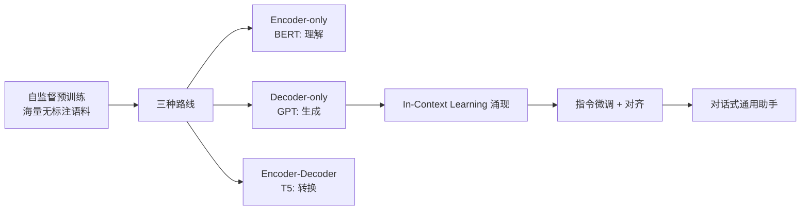

# 大语言模型架构解析

> 从 GPT 到推理模型，大语言模型的架构演进只有一条主线：**在 Transformer 骨架上，不断寻找"规模换能力"的最优结构**。这篇解析这条主线上的每个关键节点：预训练范式、Decoder-only 的胜出、MoE 的效率革命、长上下文工程与推理时计算。

## 预训练范式：一切的起点

- **自监督目标**：GPT 的"预测下一个 token"看似朴素，却是已知扩展性最好的学习目标——损失函数简单、数据无限、规模可加
- **Decoder-only 胜出的原因**：统一的生成式目标（一切任务皆可生成）、推理时 KV Cache 友好、训练目标与使用方式完全一致。BERT 系在理解任务上并非失败，而是"生成统一理解"的路线赢了
- **涌现能力**：规模跨过阈值后，少样本学习、思维链、指令跟随相继出现——Scaling Law（算力/数据/参数的幂律）从经验观察变成了工程预算工具

## Transformer 的关键工程细节

- **Pre-Norm 与残差**：深层稳定训练的基础；每层 = 注意力子层 + FFN 子层，均带残差与归一化
- **RoPE 旋转位置编码**：相对位置的优雅表达，天然支持长度外推，是当前长上下文模型的标配
- **GQA（分组查询注意力）**：多个 Query 头共享一组 KV，大幅压缩 KV Cache——推理成本优化的架构级手段
- **FFN 的膨胀**：FFN 占模型参数的大头，也是知识存储的主要载体——MoE 动的正是这块

## MoE：稀疏激活的效率革命

- **机制**：FFN 替换为多个专家网络 + 路由器，每个 token 只激活少数专家——**总参数大（能力上限高），激活参数小（推理成本低）**
- **演进**：Switch Transformer → Mixtral（开源引爆点）→ DeepSeekMoE（细粒度专家 + 共享专家）→ 成为旗舰模型主流形态
- **工程代价**：显存占用由总参数决定（专家都要加载），通信模式改变（EP 专家并行），负载均衡是训练难点
- **架构启示**：MoE 证明了"稀疏化"是规模与成本矛盾的正解——这个思想正在向推理侧延伸（动态推理深度等）

## 长上下文：从 8K 到百万级

- **三段式演进**：位置编码外推（RoPE 缩放）→ 注意力稀疏化/分层（滑动窗口、YaRN）→ 检索与记忆分层（KV 压缩、外部记忆）
- **成本真相**：长上下文的瓶颈是 KV Cache 的显存与带宽，不是计算——"支持 1M 上下文"与"用得起 1M 上下文"是两回事
- **与 RAG 的关系**：不是替代而是分工——长上下文管会话内，RAG 管知识库，两者在"上下文工程"里统一调度

## 推理模型：推理时计算（Reasoning）

- **范式转变**：从"训练时把能力压进权重"到"推理时用更多计算换更高质量"——o1/R1 谱系用强化学习训练模型"思考后再答"
- **技术要点**：思维链采样 + 验证器/过程奖励、搜索式生成（ToT 类）、可变的思考预算
- **成本结构影响**：推理模型的输出 = 思考 token + 答案 token，单价与延迟都要按"思考预算"重新测算——传统的"输入/输出价格"模型被改写
- **与 Agent 的合流**：长程推理能力是 Agent 处理复杂任务的前提，两条技术线在这里交汇（参见 [Agentic 支柱](/agentic/)）

## 对齐：从 SFT 到 RLHF/RLVR

- **三阶段标配**：预训练 → SFT（指令微调）→ 对齐（RLHF：PPO 路线 / DPO：直接偏好优化）
- **新趋势**：RLVR（可验证奖励的强化学习）让数学/代码等可自动判分的领域成为推理能力的训练场——详见 [训练工程](/ai/infra/training)

## 旗舰演进速览（2025–2026，更新于 2026-09）

**推理模型线**：o1（2024-09，开创者）→ **DeepSeek-R1**（2025-01，纯 RL + 开源引爆点）→ o3/o4-mini → DeepSeek-V3.2（2025-12，**DSA 稀疏注意力**大幅降低长上下文成本）→ V4（2026-04，主攻编程）

**开源旗舰线（2026）**：

| 机构 | 代表 | 要点 |
| --- | --- | --- |
| 阿里 Qwen | Qwen3.5（2026-02）/3.8 | 原生多模态、混合注意力；Qwen3-Next 首创 3:1 线性注意力混合架构 |
| DeepSeek | V3.2 → V4 | DSA 稀疏注意力 + MoE+MLA，性价比标杆 |
| 智谱 | GLM-5（2026-02）→ 5.2 | 744B MoE，定位"从 Vibe Coding 到智能体工程" |
| 月之暗面 | Kimi K2 Thinking（2025-11）→ K3 | 200-300 次连续工具调用的长程 Agent 里程碑 |
| MiniMax | M3（2026-06） | 前沿编程 + 1M 上下文 + 原生多模态三合一 |

**闭源对照**：GPT-5 → 5.5（2026-04）；Claude Opus 4.x → Opus 5（2026-07）；Gemini 3 Pro（2025-11，3.5 Pro 持续跳票）

**关键技术趋势**：
1. **MoE 极致稀疏化**：激活占比压到 3-5%，"大总参、小激活"成为开源标配
2. **注意力架构革命**：线性注意力实用化、稀疏注意力工程化——为 1M+ 上下文降本
3. **长上下文标配化**：1M token 成为旗舰门槛
4. **长程 Agent 能力取代单轮基准**成为新叙事（数百次工具调用的持续作战）
5. **开源闭源差距收敛 + 价格战**：开源旗舰对标闭源且价格低至 1/10-1/18

## 选型视角（SA 笔记）

- **稠密还是 MoE**：私有化部署看显存预算（MoE 总参数大），API 调用看激活参数定价
- **推理模型按需开启**：简单任务用非推理模式省成本，复杂任务才付思考预算——路由策略比模型选择更影响账单
- **上下文长度的账**：按真实业务长度分布测算，别被"支持长度"带节奏

## 参考资料

<Refs>

- [Language Models are Few-Shot Learners (GPT-3)](https://arxiv.org/abs/2005.14165) — 涌现能力的分水岭（2020）
- [Mixtral of Experts](https://arxiv.org/abs/2401.04088) — 开源 MoE 引爆点（2024）
- [DeepSeek-V3 Technical Report](https://arxiv.org/abs/2412.19437) — MoE 工程化集大成（2024）
- [DeepSeek-R1](https://arxiv.org/abs/2501.12948) — RLVR 与推理模型的开源里程碑（2025）
- 站内相关：[机器学习与深度学习经典](/ai/models/ml-dl) · [训练工程](/ai/infra/training) · [推理部署实战](/ai/infra/inference/llm-inference)

</Refs>